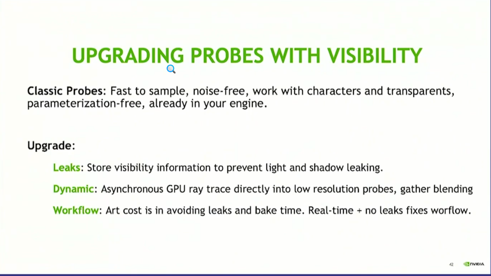
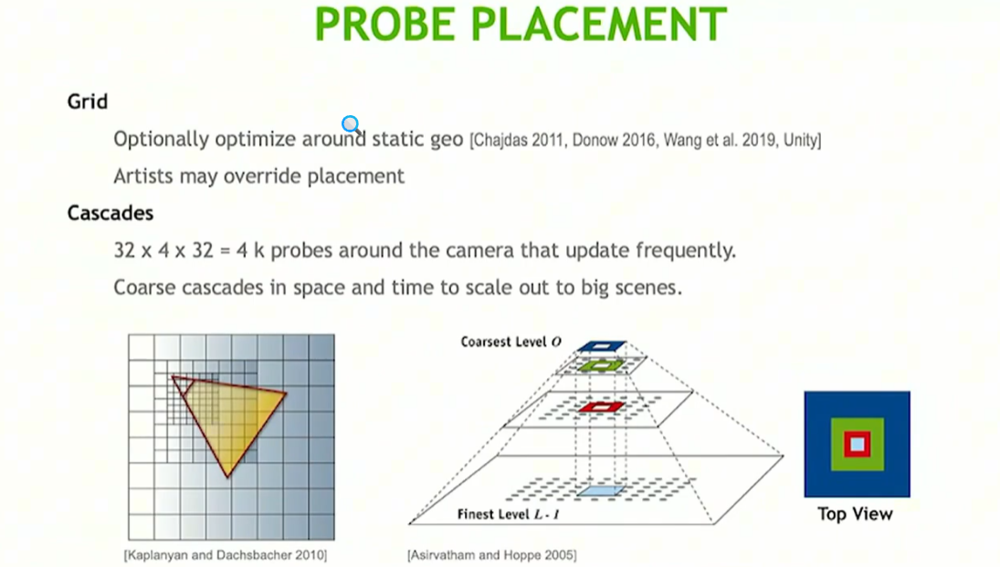

+++
date = '2025-12-01T14:02:56+08:00'
draft = true
title = 'GDC'
tags = ["浏览笔记","GDC"]
+++

# GDC Vault - DDGI(Dynamic Diffuse Global Illumination)

> https://www.bilibili.com/video/BV1RngpzYE89/?spm_id_from=333.337.search-card.all.click&vd_source=9df9034e2f1978b1018f5b387ec3eacd

1. DDGI可以解决漫反射GI的光照探针漏光问题

光照探针的布局研究
