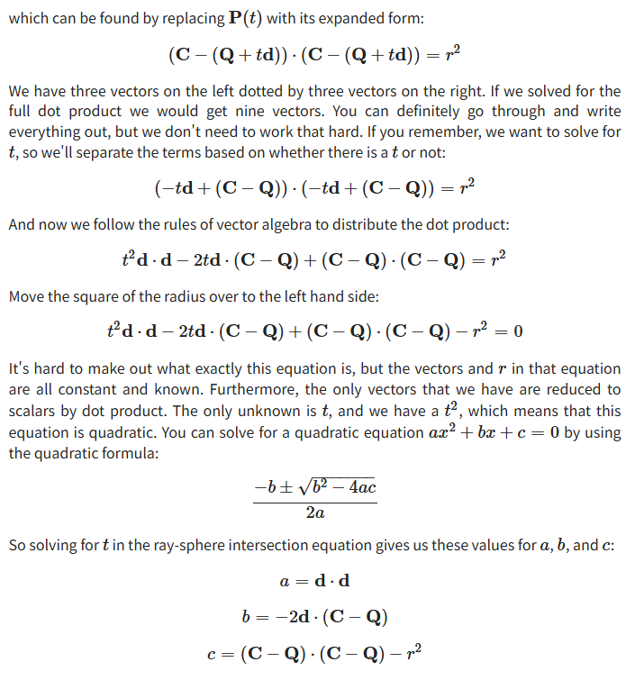
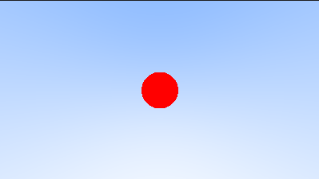
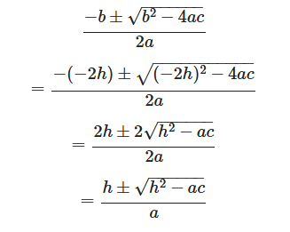
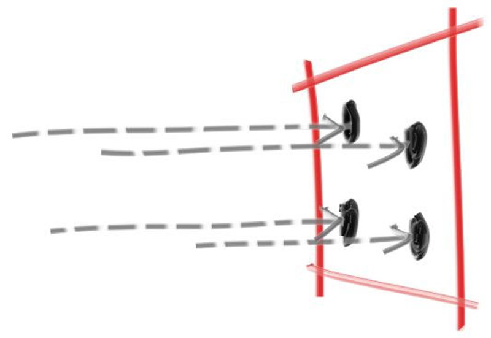
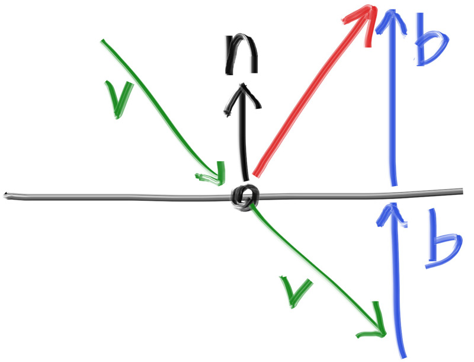
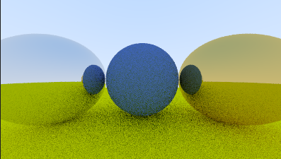
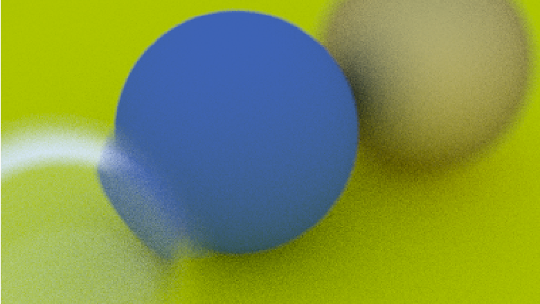
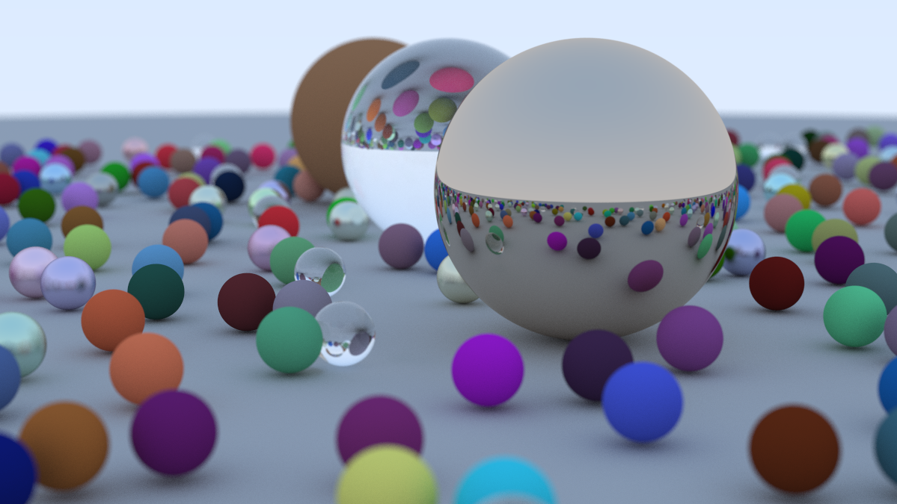

+++
date = '2025-11-12T13:26:10+08:00'
draft = false
title = 'RayTracingOneWeek'
tags = ["RayTracing","RayTracingOneWeek"]
image = 'image-20251114165052053.png'
+++

# Ray-Sphere Intersection

- 显式：**“谁等于谁的函数”**。
- 隐式：**“变量们满足某个共同等式”**

球公式用向量形式表达为：
$$
(\mathbf{C} - \mathbf{P}) \cdot (\mathbf{C} - \mathbf{P}) = (C_x - x)^2 + (C_y - y)^2 + (C_z - z)^2
$$
也就是
$$
(\mathbf{C} - \mathbf{P}) \cdot (\mathbf{C} - \mathbf{P}) = r^2
$$
给一个点P(t)，如果与圆相加，说明这个公式有解 
$$
(\mathbf{C} - \mathbf{P}(t)) \cdot (\mathbf{C} - \mathbf{P}(t)) = r^2
$$


P(t)可以用Ray来表示，Ray = Q + td



经过一系列变换，最后用求根公式可以直接算出t的取值，或者用判别式直接获取解的个数

```c++
// 判断r是否与这个球体相交
bool hit_sphere(const point3& center, double radius, const ray& r) {
    auto a = dot(r.direction(),r.direction());

    auto b = -2*dot(r.direction(),center-r.origin());

    auto c = dot(center-r.origin(),center-r.origin()) - radius * radius;

    auto discriminant = b*b - 4 *a *c;
    return discriminant > 0;
}
```

```c++
if(hit_sphere(point3(0,0,-1),0.2,r)){
    return color(1,0,0);
}
```



```c++
// 返回t
double hit_sphere(const point3& center, double radius, const ray& r) {
    vec3 oc = center - r.origin();
    auto a = dot(r.direction(), r.direction());
    auto b = -2.0 * dot(r.direction(), oc);
    auto c = dot(oc, oc) - radius*radius;
    auto discriminant = b*b - 4*a*c;
     if (discriminant < 0) {
        return -1.0;
    } else {
        return (-b - std::sqrt(discriminant) ) / (2.0*a);
    }
}
```

## Simplifying Code

求根公式中，把原始b带入发现可以化简



# 抗锯齿

像素中心击中物体就是一种颜色，没有击中就是另一种颜色，没有过度，锯齿就会出现。（对一个像素进行着色，一条光线只取一个点的颜色，但是一个像素对应世界位置的一片颜色不一定是一样的，而是连续的）



初始采样点为像素中心，每个像素多次调用git_ray(),他会在一个像素中随机进行采样

```c++
    vec3 sample_square() const {
        // Returns the vector to a random point in the [-.5,-.5]-[+.5,+.5] unit square.
        return vec3(random_double() - 0.5, random_double() - 0.5, 0);
    }
    ray get_ray(int i, int j) const {
        // Construct a camera ray originating from the origin and directed at randomly sampled
        // point around the pixel location i, j.

        auto offset = sample_square();
        auto pixel_sample = pixel00_loc
                          + ((i + offset.x()) * pixel_delta_u)
                          + ((j + offset.y()) * pixel_delta_v);

        auto ray_origin = center;
        auto ray_direction = pixel_sample - ray_origin;

        return ray(ray_origin, ray_direction);
    }
```

# 漫反射材质

hit后，不是直接返回颜色，而是继续发射一根随机半球方向的光线继续进行光线追踪，击中物体后累加，另外需要设置递归深度防止无限递归

```c++
        if (world.hit(r, interval(0, infinity), rec)) {
            vec3 direction = random_on_hemisphere(rec.normal);
            return 0.5 * ray_color(ray(rec.p, direction), depth-1, world);
        }
```

## Fixing Shadow Acne

如果光线起点恰好位于表面正下方（浮点数的舍入误差），它可能会再次与该表面相交。

## 镜面反射

v+2B就是静面反射向量，B可以通过dot(v,n)*n来求



```c++
inline vec3 reflect(const vec3& v, const vec3& n) {
    return v - 2*dot(v,n)*n;
}
```

RT实现这种间接光照太容易了



# 电介质材质（折射）

> 当从折射率高的一边看向折射率低的一边，如果入射角度过大，用反射定律计算出来的折射光线角度超过了90°，这时候就应该只进行反射，而不进行折射。（教程有折射相关的内容，本质就是把反射替换成折射来进行二次弹射）

# Defocus Blur 景深/散焦模糊

成像平面的距离改用焦距来定义，所以在成像平面位置的渲染才是清晰的

```c++
// 根据fov和Near计算视口宽高
auto theta = degrees_to_radians(vfov);
auto h = std::tan(theta/2);
auto viewport_height = 2 * h * focus_dist;
auto viewport_width = viewport_height * (double(image_width)/image_height);
```

```c++
// 构建光线时，先在像素内部随机采样，获得一个摄像终点，但是射线起点不再是相机的位置，而是以相机位置为中心的一个圆盘（可调整半径）上的任意一点作为摄像起点
ray get_ray(int i, int j) const {
    // Construct a camera ray originating from the defocus disk and directed at a randomly
    // sampled point around the pixel location i, j.

    auto offset = sample_square();
    auto pixel_sample = pixel00_loc
                      + ((i + offset.x()) * pixel_delta_u)
                      + ((j + offset.y()) * pixel_delta_v);

    auto ray_origin = (defocus_angle <= 0) ? center : defocus_disk_sample();
    auto ray_direction = pixel_sample - ray_origin;

    return ray(ray_origin, ray_direction);
}
```



```c++
int main() {
    hittable_list world;

    auto ground_material = make_shared<lambertian>(color(0.5, 0.5, 0.5));
    world.add(make_shared<sphere>(point3(0,-1000,0), 1000, ground_material));

    for (int a = -11; a < 11; a++) {
        for (int b = -11; b < 11; b++) {
            auto choose_mat = random_double();
            point3 center(a + 0.9*random_double(), 0.2, b + 0.9*random_double());

            if ((center - point3(4, 0.2, 0)).length() > 0.9) {
                shared_ptr<material> sphere_material;

                if (choose_mat < 0.8) {
                    // diffuse
                    auto albedo = color::random() * color::random();
                    sphere_material = make_shared<lambertian>(albedo);
                    world.add(make_shared<sphere>(center, 0.2, sphere_material));
                } else if (choose_mat < 0.95) {
                    // metal
                    auto albedo = color::random(0.5, 1);
                    auto fuzz = random_double(0, 0.5);
                    sphere_material = make_shared<metal>(albedo, fuzz);
                    world.add(make_shared<sphere>(center, 0.2, sphere_material));
                } else {
                    // glass
                    sphere_material = make_shared<dielectric>(1.5);
                    world.add(make_shared<sphere>(center, 0.2, sphere_material));
                }
            }
        }
    }

    auto material1 = make_shared<dielectric>(1.5);
    world.add(make_shared<sphere>(point3(0, 1, 0), 1.0, material1));

    auto material2 = make_shared<lambertian>(color(0.4, 0.2, 0.1));
    world.add(make_shared<sphere>(point3(-4, 1, 0), 1.0, material2));

    auto material3 = make_shared<metal>(color(0.7, 0.6, 0.5), 0.0);
    world.add(make_shared<sphere>(point3(4, 1, 0), 1.0, material3));

    camera cam;

    cam.aspect_ratio      = 16.0 / 9.0;
    cam.image_width       = 1200;
    cam.samples_per_pixel = 500;
    cam.max_depth         = 50;

    cam.vfov     = 20;
    cam.lookfrom = point3(13,2,3);
    cam.lookat   = point3(0,0,0);
    cam.vup      = vec3(0,1,0);

    cam.defocus_angle = 0.6;
    cam.focus_dist    = 10.0;

    cam.render(world);
}
```

> 每个像素采样500次，并且深度为50的结果


