+++date = '2025-11-15T12:22:52+08:00'
draft = false
title = 'RayTracingTheNextWeek'
tags = ["光线追踪"]
image = 'image-20251122210353992.png'
categories = ["学习笔记/RayTracing系列"]
+++

# Motion Blur

> 思路是给Ray定义一个时间，表示光线的行进时间，判断光线与模型求交时，先用Ray的持续时间来计算模型在当前时间的位置，在新的位置上计算求交，因为发送的射线的时间是随机设置的，所有他们与球求交的是空间上不一致的，所以移动的物体就会出现模糊，本质也就是渲染时，不同像素收集到的是不同时间段的模型颜色，真实相机拍摄运动物体时，快门从打开到关闭的这段时间（比如 1/100 秒）内，物体一直在移动，传感器会记录下这段时间内物体在不同位置的所有光线信息，所以这种近似属于Hack

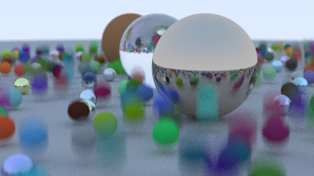

# Bounding Volume Hierarchies

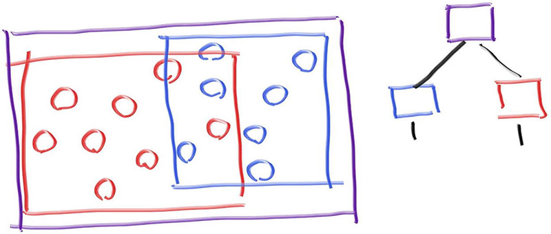

>  BVH_node 可以继承 : public hittable，与 sphere 的继承一样。  相机遍历hittable_list时，会执行BVH_node本身的hit函数，函数内就有树形检索逻辑，加快击中判定

构建BVH的流程，是一个递归函数，用start和end表示要处理的objects范围，递归时，设置为原来的一半作为子节点

```c++
bvh_node(std::vector<shared_ptr<hittable>>& objects, size_t start, size_t end) {
    // 随机选择一个轴方向
    int axis = random_int(0,2);
    // 排序器
    auto comparator = (axis == 0) ? box_x_compare
                    : (axis == 1) ? box_y_compare
                                  : box_z_compare;

    size_t object_span = end - start;

    if (object_span == 1) { // 只有一个物体
        left = right = objects[start];
    } else if (object_span == 2) { // 有两个物体
        left = objects[start];
        right = objects[start+1];
    } else {
        // 在某个轴方向对objects进行排序
        std::sort(std::begin(objects) + start, std::begin(objects) + end, comparator);
        // 划分为两半
        auto mid = start + object_span/2;
        // 递归构建子节点
        left = make_shared<bvh_node>(objects, start, mid);
        right = make_shared<bvh_node>(objects, mid, end);
    }
	// 更新包围盒
    bbox = aabb(left->bounding_box(), right->bounding_box());
}

```

进一步优化，每次都选择最长的轴方向进行划分，因为物体在最长轴上的离散度最高，这样划分包围盒的重叠最少

```c++
bvh_node(std::vector<shared_ptr<hittable>>& objects, size_t start, size_t end) {
        // Build the bounding box of the span of source objects.
        bbox = aabb::empty;
        for (size_t object_index=start; object_index < end; object_index++)
            bbox = aabb(bbox, objects[object_index]->bounding_box());

        int axis = bbox.longest_axis();
        // 排序器
        auto comparator = (axis == 0) ? box_x_compare
                        : (axis == 1) ? box_y_compare
                                      : box_z_compare;

        size_t object_span = end - start;

        if (object_span == 1) { // 只有一个物体
            left = right = objects[start];
        } else if (object_span == 2) { // 有两个物体
            left = objects[start];
            right = objects[start+1];
        } else {
            // 在某个轴方向对objects进行排序
            std::sort(std::begin(objects) + start, std::begin(objects) + end, comparator);
            // 划分为两半
            auto mid = start + object_span/2;
            // 递归构建子节点
            left = make_shared<bvh_node>(objects, start, mid);
            right = make_shared<bvh_node>(objects, mid, end);
        }

        bbox = aabb(left->bounding_box(), right->bounding_box());
    }
```

# 纹理

## 生成球的UV

做法是3D坐标转为球面坐标，再转为UV坐标

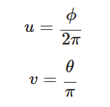

3D坐标与球面坐标的转换

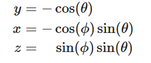

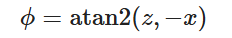

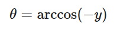

# 四边形

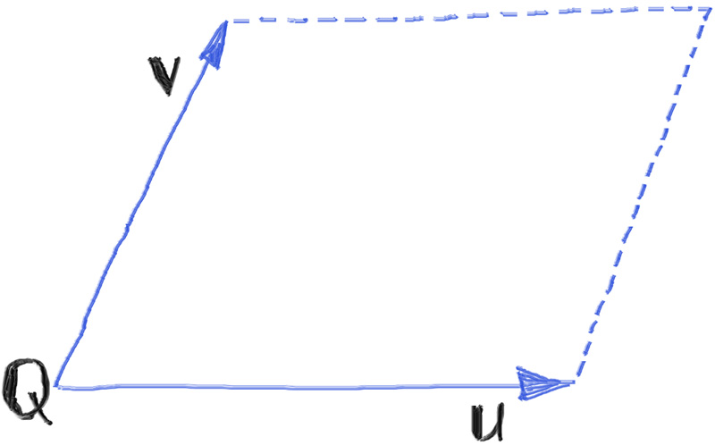

一个点Q+两个方向UV来定义一个四边形

## 求交运算

- 找到四边形对应的平面
- 光线与平面相交
- 确定交点在四边形内

### 四边形所在平面方程

定义平面：

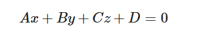

法向量：

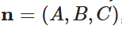

已知平面的法向量n，另外四边形的uv向量与法线n垂直（也就是说说u*v（叉乘）后的方向就是法线方向，这样就求出了ABC）

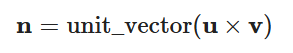

进一步，点Q落在平面上（已经知道ABC就是法向量的xyz，这样就可以通过带入法线和Q求解D，就求解了平面的方程）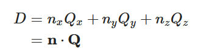

### 光线与平面求交

点位置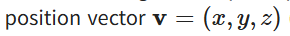可以表示为光线P+td

求解D时，是用法线和点位置求解的，上一步已经求出D是多少了。现在反过来就可以求t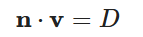

现在点位置用Ray表示后，求解D的方程表示为：

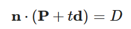

求解t得到光线相交于平面的时间

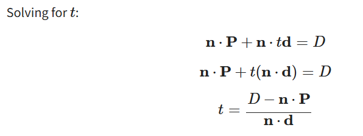

### 判定点是否在四边形内部

判断前需要在2D平面有一个基准坐标系，来表达任何点在平面上的位置

直接用Q点表示原点，UV向量来表示坐标系（不平行即可）

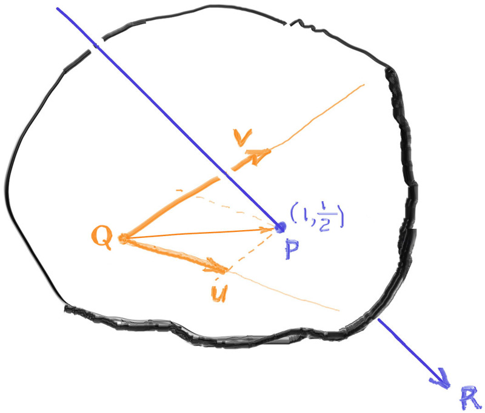

此时平面上任意一点可以表达为（$\alpha,\beta$）

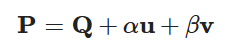

突然用公式求解出（$\alpha,\beta$）的值

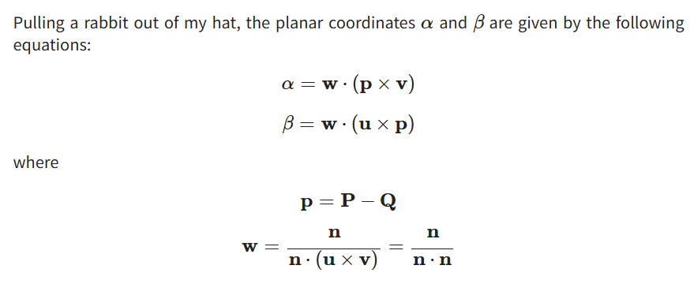

推导流程

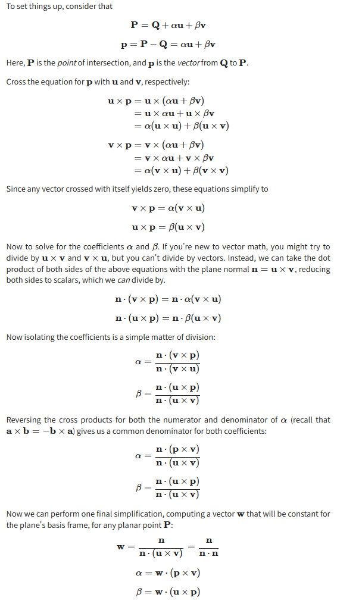

求解出$（\alpha,\beta）$后，按下图判断点是否在四边形内部

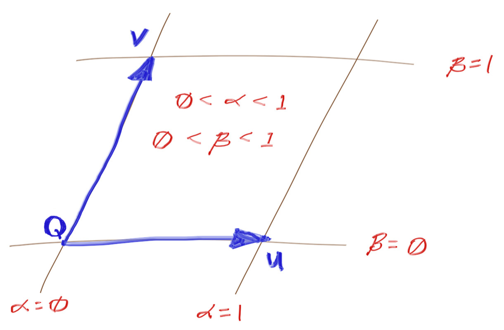

# 发光材质

> 给材质一个发光函数，根据击中的位置，返回一个发光颜色。

```c++
class material {
  public:
    virtual ~material() = default;
    virtual color emitted(double u, double v, const point3& p) const {
        return color(0,0,0);   
    }

    virtual bool scatter(const ray& r_in, const hit_record& rec, color& attenuation, ray& scattered) const {
        return false;
    }
};
```

> 击中物体计算颜色时，首先进行自发光判断，再进行scatter递归

```c++
color ray_color(const ray& r, int depth, const hittable& world) const {
    // If we've exceeded the ray bounce limit, no more light is gathered.
    if (depth <= 0)
        return color(0,0,0);
    hit_record rec;
    // If the ray hits nothing, return the background color.
    if (!world.hit(r, interval(0.001, infinity), rec))
        return background;
    ray scattered;
    color attenuation;
    color color_from_emission = rec.mat->emitted(rec.u, rec.v, rec.p);
    if (!rec.mat->scatter(r, rec, attenuation, scattered))
        return color_from_emission;
    color color_from_scatter = attenuation * ray_color(scattered, depth-1, world);
    return color_from_emission + color_from_scatter;
}
```

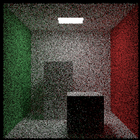

# 平移和旋转

> 这里介绍的平移旋转并不是对模型进行平移旋转，而是模拟光线与平移后的模型击中来计算着色，也就是说移动光线，达到平移物品的目的

## 平移变换 (Translation)

平移是最简单的变换。

- **目标**：我们想让一个物体沿着向量 `offset` 移动。

- 方法

  ：

  1. **变换光线**：在判断光线 `r` 是否与平移后的物体相交时，我们先将光线 **反向平移** `offset` 个单位，得到一条新的光线 `offset_r`。
  2. **求交**：用这条 `offset_r` 光线与**原始位置**的物体进行相交测试。
  3. **逆变换交点**：如果 `offset_r` 与原始物体相交于点 `p`，那么这个交点在世界空间中就位于 `p + offset` 的位置。我们将计算出的交点 `rec.p` 进行**正向平移**，得到最终的交点。

##  旋转变换 (Rotation)

旋转比平移复杂，因为它涉及到三角函数，并且还需要变换光线的方向向量和表面法向量。

- **目标**：我们想让一个物体绕 Y 轴旋转 `θ` 角。

- 方法

  ：

  1. **变换光线**：在判断光线 `r` 是否与旋转后的物体相交时，我们先将光线的**原点**和**方向**都进行 **反向旋转** `-θ`（即顺时针旋转 `θ`）。

  2. **求交**：用这条变换后的光线与**原始朝向**的物体进行相交测试。

  3. 逆变换交点和法向量

     ：

     - 如果相交，得到的交点 `p` 和法向量 `normal` 是在物体的局部空间中的。
     - 我们需要将它们**正向旋转** `θ`（逆时针旋转 `θ`），变换回世界空间，作为最终的结果。

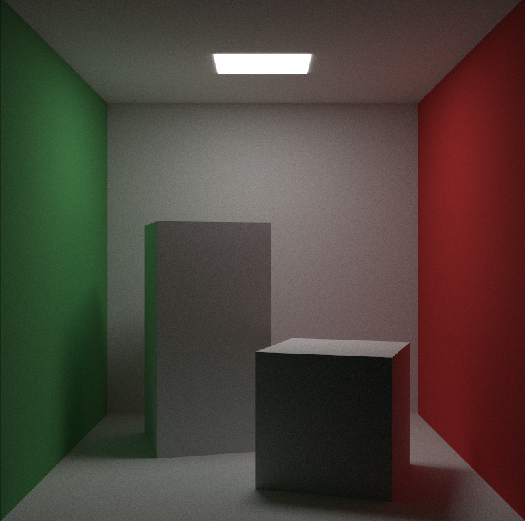
