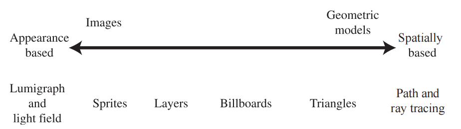
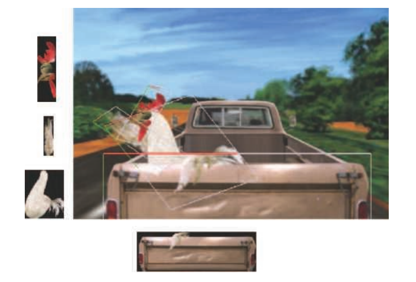
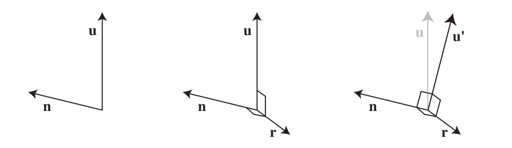
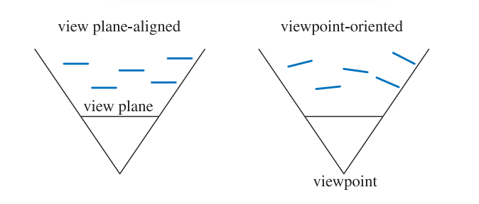
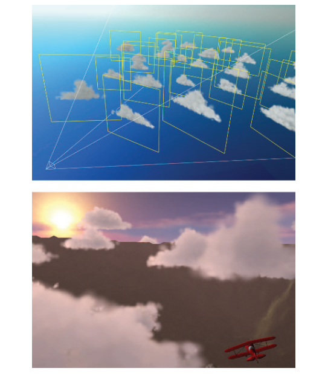
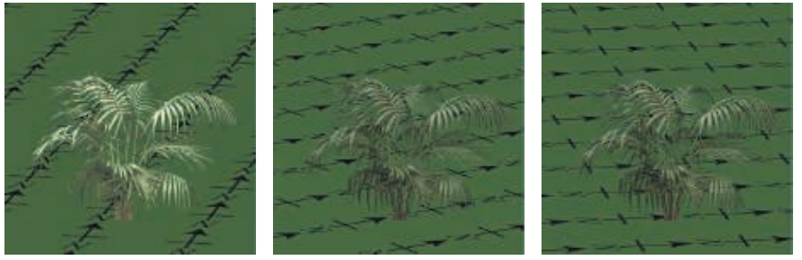
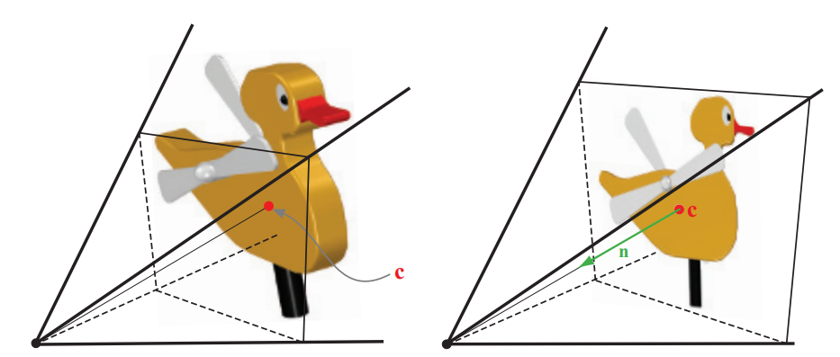
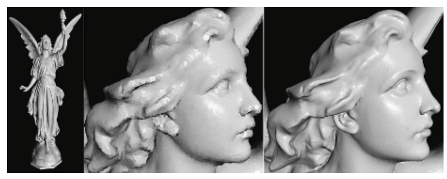

+++date = '2025-10-29T13:51:52+08:00'
draft = false
title = 'Beyond Polygons 超越多边形'
categories = ["学习笔记/RTR4th"]
tags = ["RTR4th"]
image = '202308191853823.png'
+++

> 这里主要说出了三角形渲染，还有其他的渲染方式，主要是了解各种优化渲染技巧

# 天空盒

> ...

# 光场渲染

###  Radiance 捕获与计算摄影

- **Radiance**（辐射亮度）可以在：
  - 不同位置
  - 不同方向
  - 不同时间
  - 不同光照条件
     下进行捕获。
- **计算摄影**领域研究如何从这些捕获的数据中提取有用结果，例如高动态范围成像（HDR）、光照重建等。

​	

### 基于图像的物体表示

- **Lumigraph** 和 **光场渲染（Light-field Rendering）**：
  - 通过一组离散观察点捕获物体。
  - 给定一个新视角，通过**在已存储视图之间插值**生成新视图。
  - 类似于**全息摄影（Holography）**：用二维视图数组表示物体。
- **优点**：
  - 能够表示任意复杂表面与光照。
  - 显示速率几乎恒定，与物体几何复杂度无关。
- **缺点**：
  - 数据量大，需要存储大量视图。

# Sprite和图层

**Sprite（精灵图）**：

- 屏幕上可移动的图像元素，例如鼠标光标、游戏角色。
- 不一定是矩形，支持透明像素。
- **简单sprite**：每个像素直接映射到屏幕像素。
- **动画sprite**：通过显示不同的sprite序列生成动画。

**通用sprite**：

- 将纹理渲染到始终面向观众的多边形（通常是四边形）上。
- 支持大小调整和拉伸。
- Alpha通道提供透明度和边缘抗锯齿。
- 可包含深度信息，使sprite有三维位置。

场景可以看作是一系列**sprite层**：

- 典型例子：二维序列帧动画（cel animation）。
- 每层都有深度信息，用于确定前后关系。

**渲染顺序**：

- 画家算法（Painter’s Algorithm）：从后向前渲染，无需z-buffer。
- 相机移动时：
  - 物体变大 → 可使用相同sprite或mipmap处理。
  - 前景与背景的相对覆盖可通过修改sprite层位置调整。

# 广告牌技术

基于观察方向来修改纹理矩形朝向的技术被称为广告牌技术（billboarding），这个矩形被称为广告牌（billboard）

这就是通过两个向量构建正交基的办法：首先，计算 **right 向量**：
$$
\mathbf{r} = \mathbf{u} \times \mathbf{n}
$$
然后，用 **right 向量** 和法线重新计算一个正交的 up 向量：
$$
\mathbf{u}' = \mathbf{n} \times \mathbf{r}
$$
最终得到一个标准正交基：
$$
\{\mathbf{r}, \mathbf{u}', \mathbf{n}\}
$$
这样 $\mathbf{r}$、$\mathbf{u}'$ 和 $\mathbf{n}$ 三个向量两两垂直。

有了这些初步的准备，剩下的主要任务就是决定用什么表面法线和up向量来定义广告牌的方向。**构建正交基 + 平移 + 缩放的操作，其核心目的就是生成模型变换矩阵（Model Matrix），也就是把广告牌从局部模型空间变换到世界空间的矩阵。**

## 屏幕对齐（screen-aligned）的广告牌

- **法线向量**：
  $$
  \mathbf{n} = -\mathbf{v}_n
  $$

  - $\mathbf{v}_n$ 是视平面法线，指向远离观察点。
  - 法线指向观察者。

- **Up 向量**：
  $$
  \mathbf{u} = \text{camera up vector}
  $$

  - 定义了广告牌在视平面上的上方向。

- **Right 向量**：
  $$
  \mathbf{r} = \mathbf{u} \times \mathbf{n}
  $$

  - 由 up 和法线叉乘得到，完成正交基。

- **旋转矩阵**：
  $$
  R = [\mathbf{r} \;\; \mathbf{u} \;\; \mathbf{n}]
  $$

## 面向世界（world oriented）的广告牌

两种不同对齐方式的广告牌的俯视图。根据不同的对齐方法，五块广告牌的朝向也不同。

| 特性       | 屏幕对齐（Screen-aligned）       | 面向视点（Viewpoint-oriented） |
| ---------- | -------------------------------- | ------------------------------ |
| 法线方向   | 固定指向视平面                   | 指向观察者                     |
| 扭曲情况   | 对所有sprite相同，远处可能被拉伸 | 遵循真实透视，投影形变正确     |
| 使用场景   | 小sprite、文本注释、地图标记     | 粒子效果、火焰、烟雾、爆炸等   |
| 渲染复杂度 | 低                               | 高，需要每帧计算法线           |

Wang [1839, 1840]详细介绍了微软飞行模拟器产品中所使用的云建模和渲染技术。每片云都由5到400块广告牌组成，但是只需要16种不同的基本sprite纹理即可实现各种各样的云，因为这些基本的sprite纹理可以使用非均匀缩放和旋转来进行修改，从而组合形成各种各样类型的云。还会根据距离云中心的距离来修改该点的透明度，从而模拟云的形成和消散。为了节省处理时间，远处的云都被渲染为一组环绕场景的8个全景纹理，类似于天空盒。

## 轴向广告牌

最后一种常见类型的广告牌被称为轴向广告牌（axial billboarding）。在这个方案中，被纹理化的物体通常并不会直接面对观察者。相反，它可以围绕一些固定的世界空间轴进行旋转，并在这个范围内尽可能多地面向观察者。

当观察者在场景中移动时，灌木广告牌会发生旋转以面向前方。在这个例子中，灌木从南面被照亮，因此不断变化的视野会使得整体着色随着旋转而发生变化。

| 广告牌类型                     | 法线朝向                   | Up 向量         | 特点                            | 示例                   |
| ------------------------------ | -------------------------- | --------------- | ------------------------------- | ---------------------- |
| 屏幕对齐（Screen-aligned）     | 固定视平面法线             | 相机 up         | 固定旋转矩阵，适合小sprite/文本 | HUD、标记              |
| 面向视点（Viewpoint-oriented） | 指向观察者                 | 尽量对齐世界 up | 可保持透视形变                  | 粒子效果、火焰、爆炸   |
| 轴向（Axial）                  | 尽量面向观察者，但绕固定轴 | 世界 up         | 保持直立，适合圆柱形对称物体    | 远景树木、光柱、激光束 |

## Impostor

Impostor 是一个广告牌，通过渲染复杂物体到纹理上，然后将纹理映射到广告牌上，替代原始几何体。

在左边，通过视锥体从侧面观察物体，从而创建了一个impostor。观察方向朝向物体的中心点\mathbf{c}，使用这个相机设置渲染一副图像，并将其用作impostor纹理。如右侧所示，将imposter纹理应用于一个四边形上。impostor的中心等于原始物体的中心，法线（从imposter中心发出）直接指向视点。

# 位移技术

**通过图像编码几何信息**：不仅是颜色，也包括高度、深度、法线

**优势**：

- 减少几何复杂度
- 与传统impostor或sprite相比，渲染更真实

**应用场景**：

- 远景人群、粒子系统、点云
- 复杂表面细节建模（纹理化模拟几何）

# 粒子系统

> 等学习GPU粒子时再记录

**定义**：由独立微小物体组成的集合，通过算法控制运动和生命周期（创建、移动、修改、删除）。

**应用**：火、烟、爆炸、水流、星系等自然现象和特效。

**渲染**：

- 每个粒子可以是单像素、轨迹线段或四边形广告牌（sprite）。
- 圆形粒子可只考虑位置，不必考虑旋转方向。
- 可以用几何着色器生成，也可用顶点着色器生成，后者更高效。

**纹理**：可使用颜色、法线、法线贴图等。

# 点渲染

- **概念**：使用点（point）作为基本图元来表示物体表面，然后通过高斯滤波填补点之间的空隙。
- **历史**：
  - 1985 年，Levoy 和 Whitted 首次提出。
  - 约 15 年后再次兴起，原因：
    1. 计算能力提升，支持交互速率渲染；
    2. 激光扫描仪等设备提供高密度点云数据（RGB-D、LIDAR、Kinect、iPhone TrueDepth、Tango、自动驾驶激光雷达等）。
- **点云数据**：每个点通常包含位置、颜色/强度，有时还有分类信息（建筑、路面等）。

# 体素

### **体素化输入来源**

- **点云**：扫描设备生成的任意位置点。
- **多边形网格**：通过 GPU 加速体素化。
- **医学影像**：通过切片堆叠生成体素。
- **图像集合**：可通过视觉外壳（visual hull）或轮廓切割生成体素。

### **常见体素化方法**

1. **六正交视图体素化**（Karabassi et al.）：
   - 从六个方向（上下左右前后）渲染深度。
   - 标记不可见体素为内部体素。
   - 优点：可识别内部体素；缺点：漏掉六视图不可见特征。
2. **视觉外壳体素化**（Loop et al.）：
   - 基于相机捕获的轮廓图像生成体素。
   - 只在可见像素位置生成体素，适合人体重建。
3. **切片渲染体素化**（Eisemann & Decoret）：
   - 使用 32bit 渲染目标存储多层体素（slicemap）。
   - 优点：可在 GPU 上一次渲染多层。
   - 局限：只生成表面体素，无法识别内部体素。
4. **现代 GPU 体素化**：
   - **计算着色器 + 图像加载/存储操作**：
     - 支持随机读写纹理。
     - 可进行保守光栅化，记录与体素重叠的三角形。
   - 可直接构建 **SVO（Sparse Voxel Octree）**：
     - 自上而下体素化非空节点。
     - 自下而上 mipmap 填充结构。
   - **动态场景处理**：
     - 渐进式更新体素（progressive voxelization）。
     - 使用深度缓冲清除/设置体素。

### **体素类型**

- **实体体素**：内部体素和外部体素完全分离。
- **26-分离体素**：内部体素不与外部体素共享面、边或顶点。
- **6-分离体素**：内部体素与外部体素共享边角（更保守的表面表示）。

### **存储方式**

- 体素数据通常存储在三维数组或三维纹理中。
- 每个体素可用 bit 或更高精度数据表示状态（内部/外部、密度、颜色、法线等）。

### **渲染方法**

1. **直接立方体渲染**：
   - 将每个体素绘制为立方体。
   - 相邻立方体共享面可剔除，减少多边形数量。
   - 可使用快速贪心算法进一步合并小面片。
2. **表面提取（Surface Extraction）**：
   - **Marching Cubes**：
     - 每个体素的 8 个角点确定表面穿过位置。
     - 通过查表生成三角形网格。
     - 可插值顶点位置以获得平滑表面。
   - **水平集（Level Set）**：
     - 体素存储到表面的距离（正内部，负外部）。
     - 可直接进行光线追踪或调整网格顶点位置。
3. **稀疏体素光线投射**：
   - 针对稀疏体素数据直接进行光线投射。
   - GPU 高效实现，支持交互式帧率。
4. **锥形追踪（Cone Tracing）**：
   - 类似 mipmap 的采样方法。
   - 支持软阴影、景深、可变法线滤波。
   - 利用体素规则性进行区域采样。

### **优化与数据结构**

- 八叉树（Octree）：
  - 优点：易构建，支持稀疏数据。
  - 缺点：树遍历开销大，动态变化不便。
- VDB 树 / 索引表：
  - 提高 GPU 光线追踪性能。
  - 支持动态体素变化。
  - 可分块流式加载，处理大规模场景。
