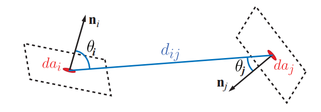
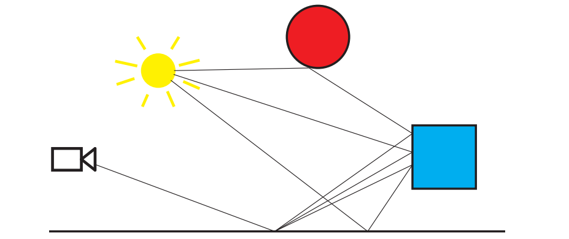
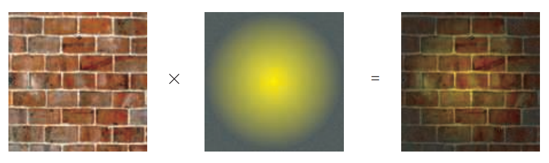
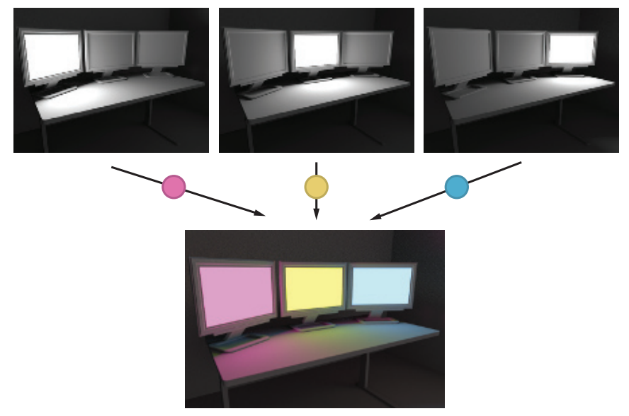
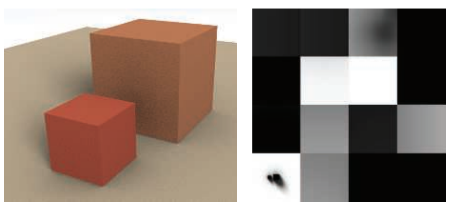
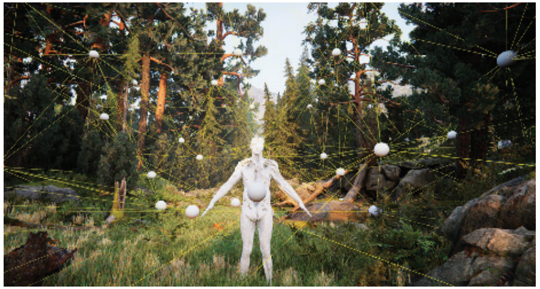
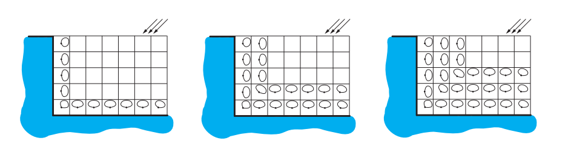
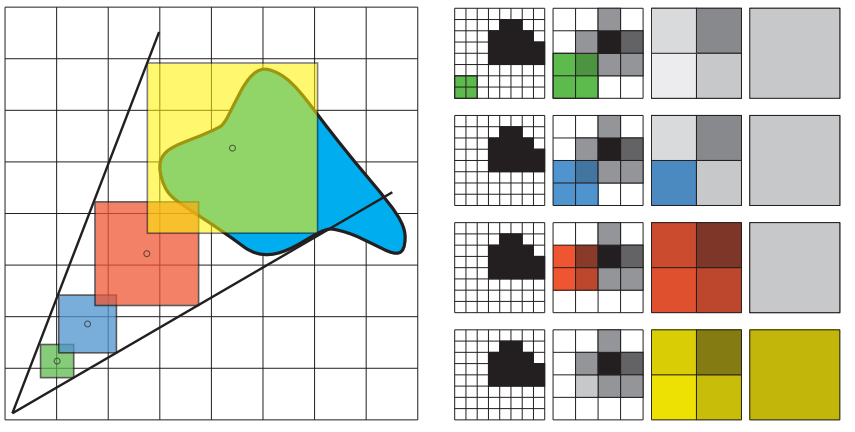
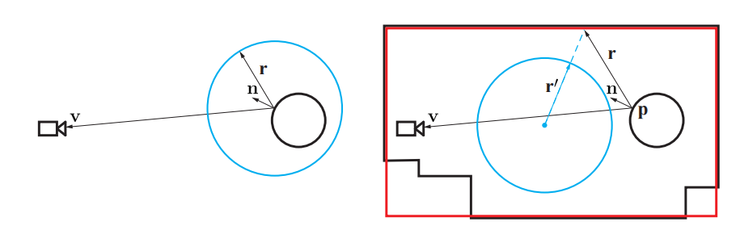
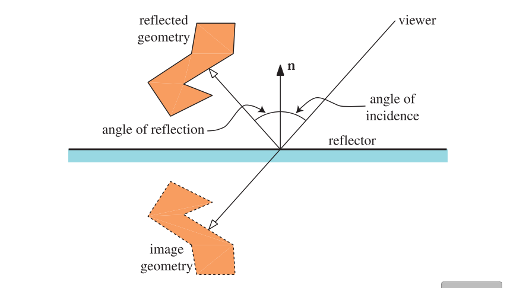

+++date = '2025-10-25T13:59:45+08:00'
draft = false
title = 'Global Illumination 全局光照'
categories = ["学习笔记/RTR4th"]
tags = ["看书笔记","实时渲染","Real-Time Rendering 4th"]
image = '202307031150341.png'
+++

渲染过程最终计算的是radiance，到目前为止，我们一直在使用反射方程（reflectance equation）来对其进行计算：

$$
L_{o}(\mathbf{p}, \mathbf{v})=\int_{\mathbf{l} \in \Omega} f(\mathbf{l}, \mathbf{v}) L_{i}(\mathbf{p}, \mathbf{l})(\mathbf{n} \cdot \mathbf{l})^{+} d \mathbf{l}
\tag{11.1} 
$$

其中$L_{o}(\mathbf{p}, \mathbf{v})$是表面位置$\mathbf{p}$在观察方向$\mathbf{v}$上的出射radiance；$\Omega$是表面位置$\mathbf{p}$的上半球范围；$f(\mathbf{l}, \mathbf{v})$是观察方向$\mathbf{v}$和当前光线入射方向$\mathbf{l}$上的BRDF；$L_{i}(\mathbf{p}, \mathbf{l})$是从光线方向$\mathbf{l}$到达表面位置$\mathbf{p}$的入射radiance；$(\mathbf{n} \cdot \mathbf{l})^{+}$是光线方向$\mathbf{l}$和表面法线$\mathbf{n}$之间的点积，并将负数结果clamp到0，即将来自表面下方的光线过滤掉。

#  通用全局光照算法

**通用** = **适用于所有类型的光照交互，不局限于特定材质或光源类型**。

它强调的是算法**完整求解渲染方程**，可以模拟现实世界中各种光线传输现象，而不是仅仅处理直接光或特定反射类型。

## 辐射度

- **目标**：模拟漫反射表面间的光线反弹，尤其是面光源产生的软阴影。
- **假设**：所有间接光来自漫反射表面（不适合镜面或高光材质）。
- **基本思想**：光在环境中弹射，直到达到稳定平衡，每个表面可以视为光源。
- **光传输路径**：通常记作 $LD*E$（光源 $L$ → 漫反射 $D$ → 眼睛 $E$）。

算法实现

1. **面片划分**

   - 场景表面分割为若干面片（patch），每个面片计算一个平均辐射度值。（就是把Mesh分成一个一个片来计算）
   - 面片大小不必与原始三角形网格一致，但要足够小以捕捉阴影和光照细节。

2. **辐射度方程**
   $$
   B_{i} = B_i^e + \rho_{\mathrm{ss}} \sum_j F_{ij} B_j
   $$

   - $B_i$：面片 $i$ 的辐射度
   - $B_i^e$：面片自身发出的辐射度
   - $\rho_{\mathrm{ss}}$：次表面反照率
   - $F_{ij}$：形状因子（form factor），表示面片 $i$ 发出的光有多少到达面片 $j$

   ### 通俗理解

   1. **自己发光的部分** → $B_i^e$
      - 面片本身是光源时才有
   2. **其他面片反射来的光** → $\rho_{\mathrm{ss}} \sum_j F_{ij} B_j$
      - 房间里其他面片反射的光经过漫反射照到面片 $i$
   3. **总和** → $B_i$
      - 面片 $i$ 的最终辐射度就是“自己发光 + 别人反射的光”

3. **形状因子**（描述一个面片受到另一个面片的影响程度）

   
   $$
   F_{ij} = \frac{1}{A_i} \int_{A_i} \int_{A_j} V(i,j) \frac{\cos \theta_i \cos \theta_j}{\pi d_{ij}^2} \, da_i da_j
   $$

   - $A_i$：面片面积
   - $V(i,j)$：可见性函数（1 = 可见，0 = 被遮挡）
   - $\theta_i, \theta_j$：法线与连线的夹角
   - $d_{ij}$：两面片中心距离

4. **求解方法**

   - 形状因子计算完成后，所有面片方程组成一个线性系统（一个由线性方程组成的数学模型）
   - 解线性系统得到每个面片的辐射度

5. **限制与应用**

   - 扩展性差，面片数量大时矩阵求解开销高
   - 不适合高光或镜面材质
   - 现代实时系统借鉴思想：预计算形状因子，然后在运行时进行光线传播

辐射度算法是一种基于有限元的全局光照方法，适合漫反射环境，通过面片划分、形状因子计算和线性系统求解，模拟间接光照。虽然计算量大，但其理论基础和预计算思想对实时渲染设计仍有重要参考价值。

## 光线追踪

这块倒是原理比较熟悉了

# 环境光遮蔽

上一小节中所介绍的通用全局光照算法，它们的计算成本都很高。虽然它们可以产生各种复杂的效果，但是生成一幅图像往往需要好几个小时。我们将首先介绍一些最简单的，但是在视觉上很有说服力的方法，并在本章节逐步探索实时替代方案，逐步构建更加复杂的效果。

AO的话也比较熟悉了，跳过。在GameEngine真正实现时，再回来看

# 漫反射全局光照

这部分针对漫反射的全局光照的各种技术进行介绍

## 表面预照明（静态场景，固定法线）

静态场景烘培

对于一个法线已知的Lambertian表面，其irradiance可以预先计算出来。在运行过程中，将这个值乘以实际的表面颜色（例如纹理颜色），从而获得反射的radiance。根据表面颜色的确切形式，可能还需要额外除以\pi 来确保能量守恒。

除了限制最为严格的硬件平台之外，如今已经很少使用预计算irradiance的方法了。因为根据定义，irradiance是针对给定的法线方向进行计算的，这意味着我们无法对物体的表面法线进行修改，我们无法使用法线映射来提供高频的表面细节。这也意味着只能对平面进行预计算irradiance。如果我们需要在动态几何物体上使用烘焙光照，我们就需要其他的方法来存储这些光照信息。这些限制条件促使人们寻找一种方法，来存储带有方向分量的预计算光照。

##  定向表面预照明（静态场景，法线可变）

1️⃣ 为什么需要定向表面预照明

- 对 **Lambertian 漫反射表面**，简单的环境光照（irradiance）只存储一个标量就够了，但如果要：
  - 使用 **法线贴图**（normal map）提高细节
  - 给动态几何提供间接光
- 就需要存储 **irradiance 随表面法线变化** 的信息，也就是方向性信息。

2️⃣ 常用表示方法

1. **球谐函数（Spherical Harmonics, SH）**
   - 可以存储完整的半球或球面光照函数。
   - 优点：插值简单，支持动态法线。
   - 缺点：系数多（3阶SH每通道9个系数），可能有振铃现象（振铃现象就是在用有限阶球谐函数近似光照时，高频细节无法精确表达，在边界或高对比区域出现的伪波纹或亮暗误差）。
   - 优化变体：
     - Chen 的方法：将主要方向光用一个方向+颜色存储，其余用二阶SH编码 → 18个系数，降低存储。
     - H-basis：仅对半球编码，可用更少系数（6个）获得三阶SH精度。
2. **半球基（AHD / Half-angle Basis）**
   - 《半条命2》使用：每个样本 3 颜色通道，总共 9 个系数。
   - 简单，成本低，效果可接受。
3. **切线空间高斯 / 环境波瓣**
   - Crytek 和《教团：1886》方法：
     - 存储 **平均光线方向 + 颜色 + 混合因子**。
     - 用球面高斯波瓣（cos^n 权重）表示光照分布。
   - 优点：高质量、可做漫反射和镜面高光卷积。
   - 缺点：存储和计算成本高。
4. **环境立方 / 环境骰子**
   - 用几个方向的余弦波瓣表示光照（cos² 或 cos⁴）。
   - 优点：存储少（6-12个方向），局部支持好，重建质量接近二阶SH。
   - 已应用在《半条命2》《使命召唤》《孤岛惊魂3》等游戏。

## 预计算传输 PRT（静态场景，但光源可变）

虽然上述的预计算光照看起来很惊艳，但是它本质上还是静态的。

如果我们假设场景中的几何物体没有发生变化，只有光照发生了变化，那么我们可以对光线与模型的相互作用进行预计算。物体之间的影响（例如相互反射或者次表面散射），可以预先进行一定程度的分析，并将结果存储下来，而不需要对实际的radiance进行操作。接收入射光线，并将其转换为整个场景的radiance分布，这个函数被称为传输函数（transfer function）。这样的方法被称为预计算传输（precomputed transfer）或者预计算radiance传输（precomputed radiance transfer，PRT）。

简单讲就是对于每种光源都可以提前对他单独进行预计算，最终场景光照可以由这些单独的光源预计算结果进行累加即可

使用预计算radiance传输的渲染示例。会预先计算三个显示器的完整光照传输，分别获得一个归一化的“单位”响应。由于光线传输的线性叠加特点，这些单独的解可以分别乘以显示器的颜色（本例中是粉色、黄色和蓝色），从而获得最终的光照效果。

上述过程可以写出如下数学形式：

$$
L(\mathbf{p})=\sum_{i} L_{i}(\mathbf{p}) \mathbf{w}_{i}
\tag{11.36} 
$$

其中$L(\mathbf{p})$是点$\mathbf{p}$的最终radiance；$L_{i}(\mathbf{p})$是来自显示器$i$的预计算单位（归一化）贡献；$\mathbf{w}_{i}$是该显示器的当前亮度。这个方程在数学意义上定义了一个向量空间（vector space），$L_i$是这个空间中的基向量。任何可能的光照效果，都可以通过这些光源贡献的线性组合来生成。

## 存储方法

光照信息存储的目的

- 无论是完全预计算的光照（例如光照贴图）还是只预计算部分传输信息（PRT等），都需要将结果数据存储在 **GPU友好的形式**。
- 存储的形式必须便于 **运行时高效访问**，以便着色器能快速获取光照信息。

光照贴图（Lightmap）

- **定义**：存储预计算光照的纹理。术语上可以涵盖irradiance贴图或其他光照存储。

- **特点**：

  - GPU上使用纹理机制进行访问，通常经过双线性过滤。
  - 有些表示方法（如AHD）是非线性的，插值后需要归一化。
  - 光照贴图通常 **不使用 mipmap**，因为贴图分辨率已经很低，每个纹素覆盖面积大（约 20×20 cm）。

- **参数化要求**：

  - 模型网格需要唯一的参数化（unique parameterization），每个三角形都有自己的纹理区域。
  - 网格通常被分成 **chart 或 shell**，然后打包到同一纹理中。
  - 需要注意 chart 之间不重叠，并保证过滤占用空间独立，以防颜色溢出。

- **接缝问题**：

  - 因为 chart 独立展开，纹素边界可能不连续。
  - 可以通过手动放置接缝、后处理或者约束优化来减小可见瑕疵。

  光照信息被烘焙到一个场景中，将光照贴图应用到物体表面上从而实现光照。光照贴图使用了一个唯一的参数化。场景会被划分成多个元素，这些元素被展开并打包成一个共同的纹理。例如：右图左下角的小块对应了地面，它展示了两个立方体的阴影。

顶点光照存储

- 预计算光照也可以存储在顶点上，但：
  - 光照质量依赖网格细分程度。
  - 网格过粗会导致光照表现不准确，过细会增加计算成本。
  - 在现代GPU上，顶点之间传递大量光照参数会降低效率，因此很少使用。

体积光照存储（Irradiance Volume / Light Probe）

- **概念**：

  - 在场景中预计算空间中多个点的光照信息。
  - 可用于动态物体，也可用于静态物体。也就是说光照信息分布在场景中，而不是物体上，即使新物体来了也能直接用

- **存储方式**：

  - 原始方法：每个样本点存储小纹理。
  - 现代方法：存储在三维纹理或其他体积结构中，可用GPU加速过滤。

- **常用表示方法**：

  - 二阶或三阶 **球谐函数（SH）**
  - 球面高斯函数
  - 环境立方体贴图（cube map）

- **采样方法**：

  - 可用最近探针插值，或者基于四面体网格/点云+重心坐标的插值（图11.30、11.31）。
  - 精度依赖探针密度和网格结构。

- **注意问题**：

  - 光照体素可能跨越不同光照特征的表面，需要处理边界问题。
  - 体积存储比光照贴图占用更多内存（立方关系）。

  Unity引擎使用了一个四面体网格，来从一组探针中插值出光照信息。

对于静态和动态的几何物体，通常会使用不同的光照存储方法。例如：静态物体可以使用光照贴图，而动态物体则可以从体积结构中获得光照信息。虽然这样做很流行，但是这种方案可能会导致不同类型的几何物体之间产生不一致的外观表现。其中一些差异可以通过正则化（regularization）来消除，即在这些表示方法中对光照信息进行平均。

## 动态漫反射全局光照

预计算光照的局限性

- **优点**：能产生高质量的光照效果。
- **缺点**：
  - 需要离线烘焙，耗时长（可能几个小时甚至更多）。
  - 烘焙-调整-再烘焙循环非常耗费时间，影响工作效率。
  - 不适用于动态几何或用户生成的场景，因为场景会在运行时变化。

为了适应场景动态变化，需要即时计算间接光照（无需长时间预计算），主要方法包括：

即时辐射度（Instant Radiosity）

- 思路：从光源向场景投射光线，每个被光线照到的点放置一个 **虚拟点光源（VPL, Virtual Point Light）** 来模拟间接照明。
- 实现：Tabellion & Lamorlette（《怪物史莱克2》）
  - 对场景表面做一次直接光照 Pass 并存储纹理。
  - 渲染时使用这些缓存数据生成一次弹射的间接光照。
- 优点：一次弹射即可产生合理效果。
- 缺点：仍然是部分离线，需要一定计算。

反射阴影贴图（Reflective Shadow Maps, RSM）

- 基于光源视角渲染的阴影贴图，不仅存储深度，还存储 **法线、反照率、直接光照** 等信息。
- 纹素视作虚拟点光源，在渲染时生成单次弹射的间接光照。
- 优化：
  - 不使用全部像素作为点光源，而是用 **重要性驱动选择子集**。
  - 可在屏幕空间 splat 虚拟光源，而不是每个着色点都选取纹素。
- 缺点：
  - 无法提供间接光照的遮挡信息（近似效果）。
  - 间接光源数量不足时，会出现闪烁。
  - 数量太多则性能挑战大。

其他改进

- **双抛物面阴影贴图**：逐步添加间接光源，保证每帧只用少量阴影贴图。
- **点场景表示 + 不完美阴影贴图（imperfect shadow maps）**：小贴图 + 后处理过滤，实现间接光照遮挡效果。
- 游戏应用示例：
  - 《Dust 514》使用多纹理图层收集间接光照。
  - UE 风筝 Demo 用类似方法处理地形间接光照。

## 光照传播体积（LPV）

场景被离散成一个规则的三维网格，每个单元格内都会维护一个穿过它的定向radiance分布，他使用二阶球谐函数来处理这些信息

LPV 的基本流程

1. **注入光照（Injection）**：
   - 将直接光照注入与表面接触的体素（volume cell）中。
   - 注入值是表面反射光（根据材质颜色调节）。
   - 可以使用 **反射阴影贴图（RSM）** 或其他方法找到这些体素。
2. **光照传播（Propagation）**：
   - 每个体素分析邻居体素的 radiance 分布，更新自身 radiance。
   - 每次迭代光照只传播一个体素的距离，所以需要多次迭代才能覆盖更大空间。
   - 优点：每个体素都有完整 radiance 场，任意 BRDF 都可用。
3. **级联体积（Cascaded LPV）**：
   - 为了覆盖更大空间并节省内存，使用嵌套、逐渐变大的体素层级。
   - 光照注入和传播在每个层级独立进行，查找光照时选用最细可用层级。
4. **遮挡信息（Occlusion）**：
   - 初始 LPV 不考虑间接光遮挡。
   - 后续改进引入 **RSM 深度信息** 或 **相机深度缓冲**，为体素添加遮挡近似。

## 体素化全局光照（Voxel Cone Tracing, VXGI）

**体素化场景**：将场景几何体用稀疏体素八叉树（Sparse Voxel Octree, SVO）表示，每个体素存储反射的光照信息（Radiance）。

**光照注入**：

1. 使用反射阴影贴图（RSM）或直接光照信息注入到最低层体素。
2. 再通过层次传播向上累积，形成整个体素空间的光照场。

**圆锥追踪近似射线积分**：

- 为了避免追踪大量射线，使用 **圆锥（Cone）近似** 来取代理想射线。
- 沿圆锥轴线在八叉树上进行层次查找，并根据体素覆盖率调节光照衰减。
- 多个圆锥组合可以模拟漫反射间接光。

性能优化

- **稀疏八叉树访问开销大**：
  - 查找叶子节点需要多次内存访问，GPU 上容易导致 warp 停滞。
- **级联三维纹理替代八叉树**：
  - 类似 **级联光照传播体积（LPV）**，每层覆盖更大的空间。
  - 只需一次纹理查找即可获得多层级信息。
- **屏幕空间过滤**：
  - 每像素只追踪一个圆锥，通过屏幕空间滤波得到最终漫反射响应。

VXGI 的优点

- 可支持 **动态全局光照**（直接光 + 间接光）。
- 允许 **动态物体和光源**。
- 能处理 **复杂遮挡和半透明间接光**（虽然近似）。

体素锥形追踪使用一系列体素树中的过滤查找，来对一个精确的锥形追踪进行近似。左图显示的是三维轨迹的二维模拟。右图展示了体素化几何的分层表示，从左到右每一列所展示的体素树，其层次越来越粗糙。在右图每一行中，展示了用于为给定样本提供覆盖率的层次结构节点。选择合适的级别进行使用，从而使得较粗级别节点的大小大于当前查找的大小，较细级别节点的大小小于当前查找的大小。会使用一个类似于三线性滤波的过程，来在这两个选定的级别之间进行插值。

#  镜面全局光照

漫反射 VS 光泽材质的不同需求

| 特性         | 漫反射                 | 光泽/镜面材质            |
| ------------ | ---------------------- | ------------------------ |
| 光照分布     | 宽余弦波瓣（整个半球） | 狭窄镜面波瓣（小立体角） |
| 光照采样     | 半球内积分             | 只需有限方向光线         |
| 实时渲染要求 | 低频、粗略表示即可     | 需高频、精确方向信息     |

- 漫反射光照可以用二阶球谐函数、LPV 或 VXGI 等低频方法表示。
- 光泽材质要求高频 radiance 表示，否则镜面反射高光会出现明显瑕疵。

## 局部环境贴图（反射探针）

最早将环境贴图与空间中特定点相绑定的游戏之一是《半条命2》，在他们的系统中，会由艺术家首先在整个场景中放置采样位置。在预处理阶段中，会在每个位置上渲染一个立方体贴图。在进行高光计算的时候，物体会使用最近位置上的结果来作为入射radiance的表示。相邻的物体可能会使用不同的环境贴图，这将会导致视觉效果的不匹配，但是艺术家可以手动调整立方体贴图所覆盖的范围。

常规环境贴图（EM）假设环境在“无限远”，即每个表面点采样反射方向时，环境似乎以这个点为中心。

对于**小物体或者贴图正好从物体中心生成**，结果几乎精确；但大多数物体：

- EM 是在某个中心点生成的（reflection probe）
- 高光表面离中心点越远 → 反射方向采样的结果就偏离真实情况 → 高光不真实

视差矫正：

**假设入射光来自一个有限大小的球体或盒子**（reflection proxy），而不是无限远。

- 用户可以定义半径/大小。
- 代理物体可以是球、盒子等形状，包围渲染到 EM 中的几何。

**计算校正方向**：

- 对于某个表面点 $\mathbf{p}$：
  1. 计算反射方向 $\mathbf{r}$（传统方式）
  2. 视作从表面点沿 $\mathbf{r}$ 发射一条射线，与**反射代理**相交
  3. 计算交点 $\mathbf{x}$
  4. 新方向 $\mathbf{r}' = \mathbf{x} - \mathbf{c}$，其中 $\mathbf{c}$ 是环境贴图的中心
- 使用 $\mathbf{r}'$ 去 EM 采样，而不是直接使用 $\mathbf{r}$

左边是常规的环境映射，它使用蓝色圆圈进行表示（它也可以是任何表示形式，例如立方体贴图）。左图中的效果是通过使用反射观察方向$\mathbf{r}$访问环境贴图来确定的。仅仅使用这个方向作为参数，蓝色圆圈EM会被视为半径无限大且遥远的。对于黑色圆表面上的任何点，EM好像都以该点为中心。右图中，我们希望EM能够把周围的黑色房间表示为本地的，而不是无限远的。蓝色圆圈EM是在房间的中心处生成的。要像访问房间一样访问这个EM，会从位置$\mathbf{p}$处，沿着反射观察方向发射一根反射光线，这个光线会在着色器中与一个简单的代理物体（房间周围的红色框）相交。这个交点与EM的中心形成一个新的方向$\mathbf{r}^{\prime}$，然后会像常规的环境映射一样，使用这个方向$\mathbf{r}^{\prime}$来访问EM。通过求解$\mathbf{r}^{\prime}$，这个过程会将EM视为具有一个实际的物理形状，即图中的红框。这个红色代理框的假设会在房间的左下角和右下角失效，因为代理形状与实际房间的几何形状并不匹配。

视差矫正从上图就很好理解，我反射采样点是R方向，但是物体并不在立方体贴图中间，如果按左图采样的方向是错的（他是假设着色点在立方体中心来采样的），按右图来看，他重新获取采样方向R'，才是正确的采样结果

多探针组合

- 当一个区域被多个探针覆盖时，需要一种规则来组合它们：
  - **优先级法**：用户可以为探针设置优先级，高优先级探针覆盖低优先级探针
  - **平滑插值法**：在相邻探针之间做线性/权重插值，保证过渡自然
- **问题**：简单的组合规则无法完全消除瑕疵，尤其是在高光或抛光材质上，容易出现反射拉伸或不自然。

------

反射代理形状问题

- 反射代理（reflection proxy）通常是简化的几何形状（球、盒子、平面），很少能完全匹配真实场景几何。
- 结果：
  - **反射拉伸**：高光表面上，反射看起来被拉伸或不真实
  - **BRDF不完全正确**：渲染到环境贴图的物体可能在不同位置看起来不一样
  - **漏光（light leaking）**：光线可能穿过代理，导致一些遮挡丢失
- 缓解方法：
  - **定向遮蔽（directional occlusion）**
  - **预计算漫反射光照**：将环境贴图反射值除以平均漫反射光照，只保留高频成分，再在着色时乘回漫反射

------

深度辅助方法

- **Szirmay-Kalos**：每个探针存储深度贴图，查找时做光线追踪 → 精度更高，但成本大
- **McGuire**：用探针深度缓冲追踪光线，如果主探针信息不足，选择备用探针继续追踪 → 提升可靠性和精度

------

预过滤环境贴图问题

- 对光泽材质（glossy BRDF）：
  - EM通常是预过滤的，每个 mipmap 层表示不同卷积半径的入射辐射
  - **问题**：视差校正会让反射方向在代理形状上的分布变化，使得卷积略不准确
  - Pesce 和 Iwanicki 分析了这些问题并提出了潜在解决方案

------

反射代理形状的灵活性

- 代理不必是闭合或凸形，可以是：
  - 平面矩形
  - 简单盒子
  - 球形代理
- 复杂代理能更精确表示周围几何，但会增加计算开销

## 反射探针的实时更新

- **传统方法**：局部反射探针一般在离线阶段渲染和预过滤，生成高质量立方体贴图。
- **问题**：
  - 开放世界游戏中，时间变化、动态几何体和大量环境探针使得离线渲染不现实
  - 存储大量环境贴图会消耗磁盘空间
- **解决方案**：
  - 一部分探针在加载阶段预渲染
  - 其他探针在进入相机视野时动态渲染

**低帧率更新**：动态物体的反射不需要每帧都更新

- 可以定义每帧更新的探针数量
- 使用启发式方法决定更新顺序，例如：探针到相机的距离、上次更新时间等

**拆分立方体贴图渲染**：一个立方体贴图的6个面可以分布到6帧渲染，降低每帧开销

高质量卷积通常需要多次采样，不适合高帧率实时更新

**解决方法**：

1. **重要性采样**（Colbert & Krivanek）：用少量样本（约64）进行近似滤波
2. **mipmap层级采样**：根据启发式选择每个样本的 mipmap 层
3. **基函数滤波**（Manson & Sloan）：先简单下采样+滤波，再组合 mipmap 构建最终贴图

**纹理压缩**：

- HDR 探针可压缩为 BC6H 半精度浮点格式
- 减少显存占用和带宽消耗

**G-buffer辅助渲染**：

- 离线生成场景的 G-buffer
- 运行时只需计算光照和卷积
- 可以在预生成 G-buffer 上渲染动态几何体，降低 CPU 开销

## 基于体素的方法

体素锥形追踪，无论是使用稀疏八叉树进行存储[307]，还是其级联版本（章节11.5.7）[1190]，同样可以用于渲染高光效果

对于光泽材质而言，使用锥形追踪的效率要高得多。在镜面光照的情况下，BRDF的波瓣会很狭窄，只需要考虑一个来自较小立体角的radiance，因此我们不再需要同时追踪多个圆锥区域，在大多数情况下，一个着色点只需要追踪一个圆锥就足够了。只有较为粗糙材质上的高光效果，才可能需要追踪多个圆锥，但是又因为这样的反射效果十分模糊，在这种情况下，我们只需要使用局部反射探针即可，根本不需要执行锥形追踪。

就是Voxel Cone Tracing来进行着色，因为glossy表面的lobe很狭窄，相比于漫反射效率要高得多

## 平面反射

#### 方法 A：反射场景副本

1. 对每个反射的物体创建一个**副本**
2. 将副本沿平面镜像变换到反射位置
3. 渲染副本物体生成反射图像
4. 光源也需进行镜像处理：
   - 光源位置和方向也要镜像
5. 将生成的图像用作反射贴图或者直接绘制到反射表面

#### 方法 B：反射观察者

- 不改变场景中的物体，而是**反射观察者（摄像机）位置和观察方向**
- 通过修改投影矩阵，实现从镜面后的视角渲染场景
- 优点：不需要复制场景物体
- 关键点：仍需镜像光源位置/方向

## 屏幕空间方法

> 这里讲的就是SSR，以及SSR的优化策略

## 统一方法

到目前为止我们所介绍的方法，它们可以组合成一个能够渲染漂亮图像的完整系统。然而，这些系统交错在一起，缺乏路径追踪的优雅性和概念简洁性。渲染方程的不同方面都会以不同的方式进行处理，在每个方面都做出了不同程度的妥协。尽管最终的生成图像看起来很逼真，但是在很多情况下，这些方法依然会失败，导致视错觉的中断。由于上述的这些原因，实时路径追踪一直是研究工作的重点。

**混合渲染管线（Hybrid Rendering Pipeline）**：更加合理、但不那么纯粹的方法是，使用路径跟踪方法来处理光栅化渲染框架内难以实现的效果。我们对相机可见的三角形进行光栅化，但是在计算反射效果的时候，我们不再依赖近似的反射代理或者不完整的屏幕空间信息，而是通过路径追踪来计算。我们不再尝试模拟具有模糊效果的面光源阴影，而是直接通过向光源追踪光线并计算正确的遮挡信息。

为了生成高质量的图像，可能需要对每个像素追踪成百上千条光线。即使是使用最优的BVH、最高效的树遍历算法和最快速的GPU，目前也只能在最简单的场景中实时做到这一点，而在稍微复杂一点的场景中则根本无法实现。在可用的性能限制下，我们所生成的图像会具有非常多的噪点，根本无法用于显示。然而幸运的是，这些充满噪声的图像可以使用降噪算法来进行处理，从而产生基本无噪声的图像，如图11.42和图24.2所示。最近在实时光追降噪领域取得了令人印象深刻的进展，并且开发出了一些算法，可以在每像素仅追踪一根光线的情况下（1spp），创建视觉上接近高质量的、路径追踪生成的图像 [95, 200, 247, 1124, 1563]。
