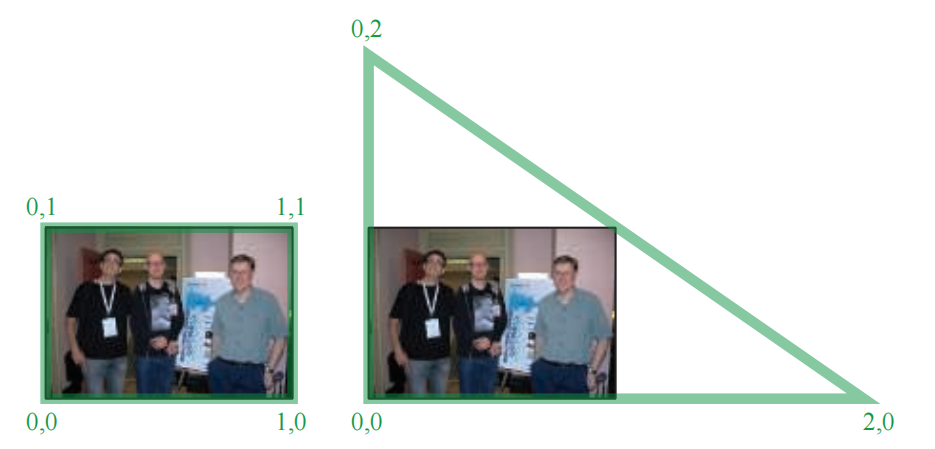
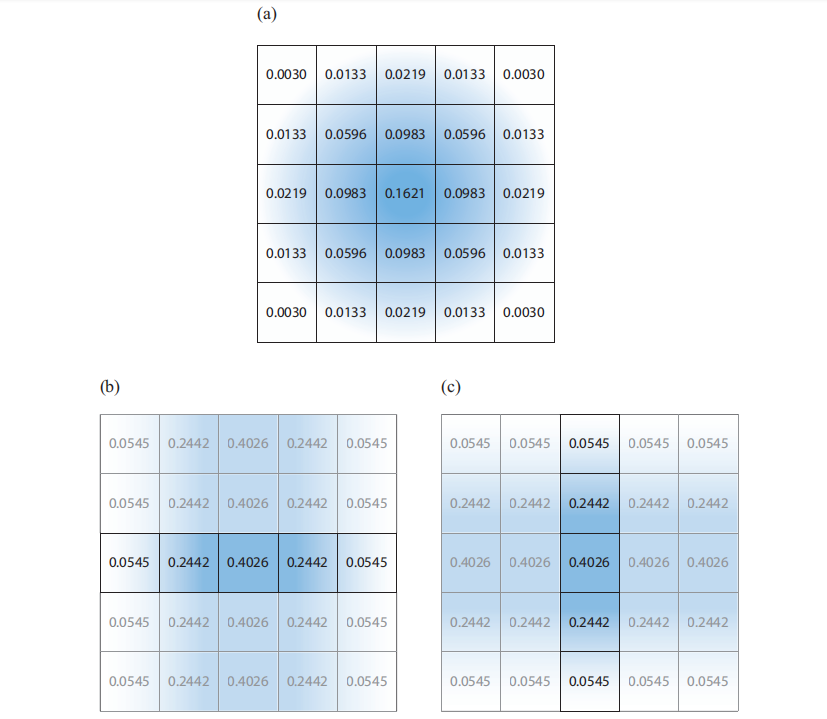
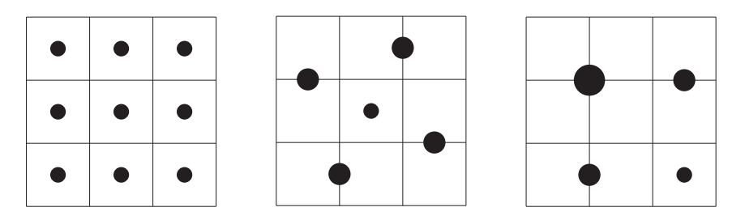
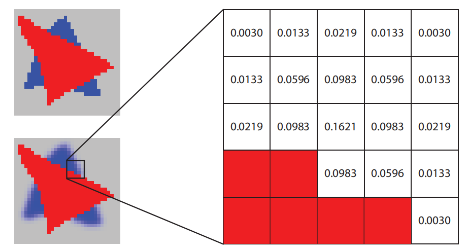
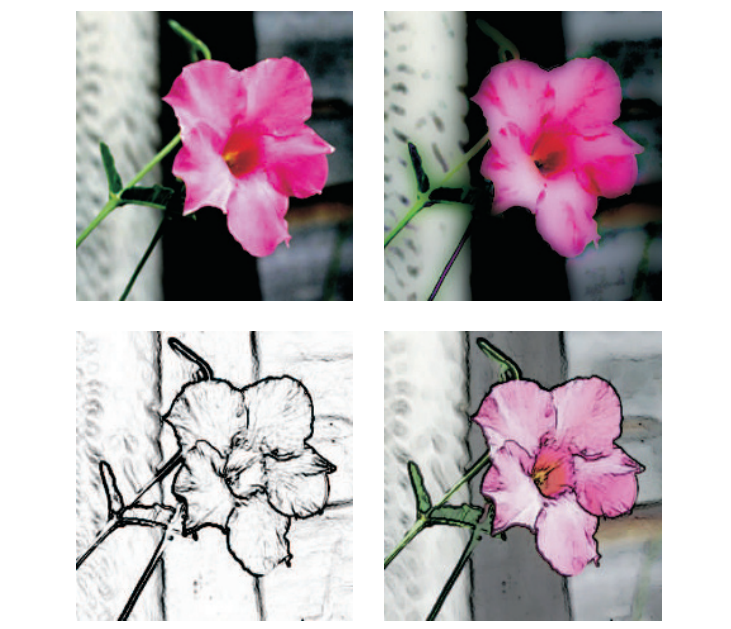
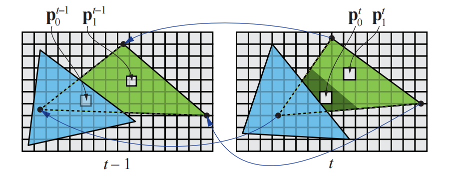
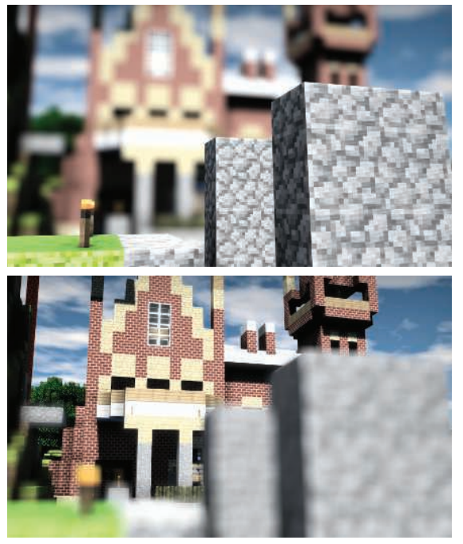
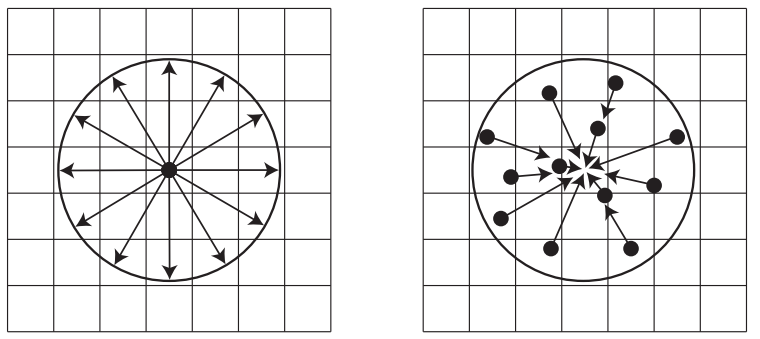
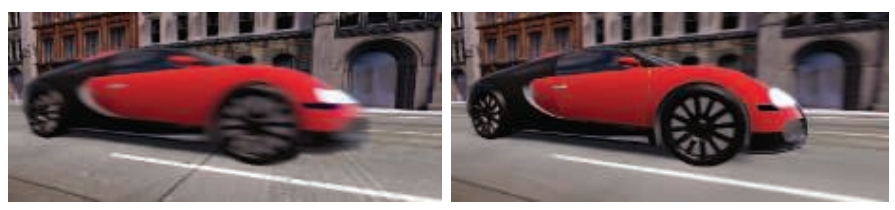

+++date = '2025-10-28T11:59:27+08:00'
draft = false
title = 'Image Space Effects 图像空间特效'
categories = ["学习笔记/RTR4th"]
tags = ["RTR4th"]
image= '202307131302667.png'
+++
# 图像处理
> 这里介绍的就是什么是后处理，以及用三角形代替四边形的方法，这个我在OpenGL渲染器已经在使用了

紧接着介绍图像处理的高斯滤波器是一种常用的滤波核，其形状是著名的钟形曲线：

$$
\operatorname{Gaussian}(x)=\left(\frac{1}{\sigma \sqrt{2 \pi}}\right) e^{-\frac{r^{2}}{2 \sigma^{2}}}
\tag{12.1}
$$

将（b）中的权重乘上（c）中的权重，可以得到与（a）相同的权重，这表明两个滤波器实际上是等效的，因此是可分离的。使用（a）对一个像素进行滤波需要25个样本，而单独使用（b）和（c）对一个像素进行滤波分别只要5个样本，总共10个样本，这大大降低了计算量。

边界像素怎么取？在 GPU 后处理里，一般有以下几种方式来“处理边界外的像素”：

| 策略                          | 名称                       | 含义                                       | 视觉效果                     |
| ----------------------------- | -------------------------- | ------------------------------------------ | ---------------------------- |
| **Clamp to Edge（边界钳制）** | 最常用                     | 超出范围的采样坐标自动钳制到最近的边界像素 | ✅ 边缘平滑、不会产生黑框     |
| **Repeat（平铺）**            | 重复采样                   | 超出范围部分从另一侧重头取样               | 🚫 不适合模糊，会出现重复图案 |
| **Mirror（镜像）**            | 对称反射                   | 超出边界部分以边界为轴镜像反射             | ✅ 比 clamp 更平滑，但略贵    |
| **Constant / Black（填充0）** | 超出范围直接返回黑色或常量 | 🚫 会产生黑边、亮度损失                     |                              |

因为Shader中采样本身就可以不在像素中心，他可以自动插值，所以3*3的滤波核不需要采样9次，而是把采样点放在两个像素之间。通过调整样本的权重，以及样本采样的位置达到原来滤波核的效果。（比如采样点偏向权重高的一边，那自然插值就会分配更高的权重）

下面讲了：

- 圆盘滤波器能产生漂亮的虚化，但代价高；可用复数技巧实现高效近似。
- ComputerShader做这种操作效果更好（线程组共享内容，随意写入）
- “移动平均（Moving Average）”技巧：对每行（或列）第一个像素计算完整滤波和；后续像素只需：加上进入核的新样本；减去离开核的旧样本；每个像素的模糊结果都能在 **O(1)** 时间更新。
- 下采样：先通过原图生成一张分辨率更低的图片，在低分辨率下进行滤波，再放大回去，效果类似，速度更快

## 双边滤波

图像处理中，双边滤波指的是 **滤波权重同时考虑两个“方面”**：

| 方面                                         | 解释                                                         |
| -------------------------------------------- | ------------------------------------------------------------ |
| **空间距离（Spatial）**                      | 像素离中心的物理距离：越近权重越大（普通高斯模糊的做法）     |
| **颜色差异 / 强度差异（Range / Intensity）** | 像素颜色或亮度差异：越相近权重越大，越不同权重越小（边缘保留） |

使用像素着色器进行图像处理操作。其中左上角为原始图像，在其基础上进行了各种处理。右上角为高斯差分运算（Gaussian difference operation），左下角为边缘检测，右下角为边缘检测与原始图像混合后的合成图像。

## 乒乓缓冲区（后处理Pass的资源管理方式）

- 使用 **两个离屏缓冲区（Framebuffer / Texture）** 交替作为输入和输出。
- 流程示例：

| Pass      | 输入     | 输出     |
| --------- | -------- | -------- |
| 第1个Pass | 缓冲区 A | 缓冲区 B |
| 第2个Pass | 缓冲区 B | 缓冲区 A |
| 第3个Pass | 缓冲区 A | 缓冲区 B |

- 每个 Pass 都可以使用前一个 Pass 的输出作为输入，同时写入另一个缓冲区。
- **优点**：不需要为每个中间结果创建新的纹理，节省 GPU 内存和管理成本。

# 重投影技术

> 利用上一帧已经渲染的数据来渲染本帧

## 反向重投影

会计算当前帧（t）和前一帧（t−1）的顶点位置。使用顶点着色中的z和w分量，像素着色器可以为t和t - 1时刻计算插值z/w，如果两帧之间的距离足够近，那么可以在前一帧的颜色缓冲中来对位置$\mathbf{p}_{i}^{t-1}$的颜色进行双线性查找，并使用这个颜色值来代替当前帧的颜色值，而不是重新计算一个新的着色值。

淡绿色的位置上一帧也是可见的，所以可以重用，暗绿色上一帧不可见，所以需要计算

为了获得更好的质量，还可以使用一个运行时平均滤波器（running-average filter）[1264, 1556]，它会逐步淘汰旧的着色值。它特别适用于空间抗锯齿（spatial antialiasing）、软阴影和全局光照。这个滤波器的描述如下：

$$
\mathbf{c}_{f}\left(\mathbf{p}^{t}\right)=\alpha \mathbf{c}\left(\mathbf{p}^{t}\right)+(1-\alpha) \mathbf{c}\left(\mathbf{p}^{t-1}\right)
\tag{12.2} 
$$

其中$\mathbf{c}\left(\mathbf{p}^{t}\right)$是点$\mathbf{p}^{t}$上的新着色值，$\mathbf{c}\left(\mathbf{p}^{t-1}\right)$是前一帧中的重投影颜色，$\mathbf{c}_{f}\left(\mathbf{p}^{t}\right)
 $是应用滤波器之后的最终颜色。Nehab等人在某些用例中使用$α = 3/5$，但是他建议根据具体的渲染内容来尝试使用不同的值。

## 正向重投影

正向重投影则是从第t - 1帧的像素开始，并将它们投影到第t帧中，因此不需要进行两次顶点着色。这意味着来自第t−1帧的像素会被分散到第t帧中，而反向重投影方法则会收集从第t−1帧到第t帧的像素值。反向重投影方法还需要处理那些变得可见的遮挡区域，通常会通过一些启发式的空洞填充方法来完成，即使用周围像素的信息来推断出缺失区域的值。Yu等人[1952]使用正向重投影方法，以一种廉价的方式来计算景深效果。Didyk等人[350]基于运动向量（motion vector），在第t−1帧中自适应地生成网格来避免空洞，而不是使用经典的空洞填充方法。这个网格是通过深度测试来进行渲染的，然后会将其投影到第t帧中，这意味着遮挡问题和折叠问题，是作为带深度测试的自适应三角形网格光栅化的一部分来进行处理的。Didyk等人将他们的方法从左眼重投影到右眼，从而为虚拟现实生成一对立体图像，这两个图像之间的相关性通常会很高。后来，Didyk等人[351]提出了一种感知驱动的方法（perceptually motivated method）来执行时域采样，例如：将帧率从40 Hz增加到120 Hz。

# 镜头光晕和泛光

光学现象

1. **光晕（Halo）**
   - 由镜头晶体结构的径向纤维引起。
   - 外缘红色，内部紫色，环绕光源。
   - 尺寸恒定，与光源距离无关。
2. **绒毛状光环（Ciliary corona）**
   - 由透镜密度波动造成。
   - 表现为从光源向外辐射的射线。
3. **其他次要效果**
   - 光圈叶片 → 多边形图案
   - 玻璃凹槽 → 条状光线
   - CCD溢出 → 泛光效果
   - 这些统称为 **炫光效果（glare effect）**

------

数字化实现

(1) 基本思路

- 将光源或高亮像素分离出来（bright-pass filter）。
- 对这些像素进行模糊处理（通常高斯模糊，也可以是径向或尖峰形状）。
- 将模糊后的结果叠加回原图。
- 可以下采样以降低计算量（½ 到 1/8 分辨率），再上采样回原图。

(2) 镜头光晕纹理（Lens Flare Texture）

- 使用纹理（例如一系列小正方块）模拟光晕效果。
- 光源远离屏幕中心 → 光晕小且透明
- 光源靠近屏幕中心 → 光晕大且不透明
- 可以结合 **屏幕空间可见性** 调整亮度（遮挡检测）。

(3) 条纹（Star streaks）

- 使用 **steerable filter** 在给定方向上累加像素值。
- 通常结合乒乓缓冲区和下采样，实现高效渲染。
- 常用于光源周围的线性光条或星状光晕。

(4) 泛光（Bloom）

- 只保留过亮区域，暗部变黑 → bright-pass。
- 对 bright-pass 图像进行模糊（高斯或锐化型）。
- 模糊结果叠加回原图（加法混合）。
- 可结合 HDR 渲染：先 tone-mapping，再叠加 bloom。

(5) 优化技巧

- **低分辨率渲染**：减少模糊计算量，扩大相对核尺寸。
- **多级下采样**：可产生更广泛的模糊效果。
- **遮挡采样**：如 Maughan 的 GPU 遮挡采样，调整光晕亮度。
- **累积历史帧**：对动画物体形成条纹光晕或持久感。

------

典型渲染流程（后处理管线）

1. **场景渲染** → 得到 HDR 场景缓冲。
2. **Bright-pass 提取高亮像素**。
3. **模糊处理**
   - 可以径向模糊（halo）
   - 可以方向模糊（star streaks）
   - 使用低分辨率或乒乓缓冲区优化
4. **光晕纹理叠加**
   - 根据光源位置、遮挡信息调整大小与亮度
5. **合成**
   - bloom 或 lens flare 结果加到原图
   - tone mapping & HDR → LDR

# 景深

**累积缓冲区方法（Accumulate Buffer）**

- 通过移动镜头位置（保持焦点固定），多次渲染图像并累积平均。
- 焦点附近的像素保持清晰，远近场模糊。
- 可以收敛到物理正确的ground-truth景深图像。
- 缺点：渲染成本高，不适合实时应用。

**分层渲染**：

- 焦点层：清晰聚焦。
- 远场层：模糊处理。
- 近场层：模糊处理。

- 通过改变裁剪平面和模糊处理，将层组合，形成景深。
- 缺点：物体跨越多层时会产生突变；模糊不随距离连续变化。

**焦点外像素被扩散到弥散圆内。**

**散射（Scatter）方法**：

- 将像素颜色散射到弥散圆覆盖的邻域像素。
- GPU上直接散射困难 → 可用Sprite渲染或可分离滤波。

**聚集（Gather / Backward Mapping）方法**：

- 对每个像素，采样其弥散圆内的邻域像素颜色并聚合。
- 可使用深度信息来调整模糊半径，效率高且可预测。

现代算法通常结合前景/背景分层 + 可分离滤波 + 聚集方法。

散射（scatter）操作是获取像素的着色值，并将其扩散到邻近区域的像素上，例如通过渲染一个圆形的sprite。在聚集操作中，相邻区域的值被采样并用于影响某一个像素。GPU的像素着色器经过优化，可以通过纹理采样来执行聚集操作。

**近场与远场模糊处理**

- **近场**：
  - 独立图像渲染并模糊。
  - 使用alpha通道控制混合，避免清晰边缘被模糊。
- **远场**：
  - 使用弥散圆半径插值焦点图像。
- **组合**：
  - 根据弥散圆半径插值焦点、远场图像。
  - 使用近场alpha覆盖合成，形成自然的景深。

# 运动模糊

- **本质**：运动模糊是由于物体或相机在快门打开时间内移动，导致图像在时间上被平均，从而产生模糊。
- **电影中的运动模糊**：
  - 电影每秒24帧（FPS），快门通常在1/40s-1/60s。
  - 每一帧画面本身已经有运动模糊，所以即使24 FPS，画面也看起来平滑。
  - 快门时间越短（如1/500s），会产生“hyperkinetic”效果，看起来非常快、清晰。
- **实时图形中的问题**：
  - FPS 低于一定值时，运动显得跳跃。
  - 高速物体在没有运动模糊时出现“时间锯齿”（temporal aliasing）。

多帧累积（Frame Accumulation）

- 思路：在一段时间内累积若干帧并求平均。
- 问题：
  - 会降低帧率（每帧需渲染多次）。
  - 快速移动物体容易出现鬼影。
- 优化：
  - 滑动累积（sliding accumulation）：只渲染新帧，减去最早帧，累加当前帧。

b. 速度缓冲区（Velocity Buffer / Motion Vector）

- 每个像素记录当前帧与上一帧在屏幕空间的位置差（速度向量）。
- 用法：
  1. 渲染当前帧图像。
  2. 根据速度缓冲区进行像素方向上的模糊。
  3. 可在GPU中通过滤波、瓦片处理加速（tile-based max velocity）。
- 优点：
  - 只需渲染一帧。
  - 可处理复杂场景的物体运动。
  - 支持遮挡处理（前景物体不被背景模糊覆盖）。

几何方法（Geometry-based Motion Blur）

- 对快速移动物体生成拉伸的几何（如剑挥动）。
- 缺点：
  - 计算复杂。
  - 需要对每个物体处理纹理和高光。

结合景深与运动模糊

- 通过对速度向量和弥散圆结合，统一处理景深模糊和运动模糊。
- 可使用随机采样、交错采样、快速重建等技术减少采样噪声。

