+++
date = '2025-10-22T14:19:43+08:00'
draft = false
title = 'Local Illumination 局部光照'
categories = ["Books/Real-Time Rendering 4th"]
tags = ["看书笔记","实时渲染","Real-Time Rendering 4th"]
image = '202306151248940.png'

+++

> 内容包括：1. 将点光源拓展到面光源，并且介绍了一些在Lambertian表面或Glossy表面的实现方案 2.环境光照针对高光和漫反射的模拟的各种实现方案 3. 引入SH预计算的概念

# 局部光照 (Local Illumination)

**局部光照模型只考虑光源直接照射到表面点的光照贡献**，忽略：

1. 来自其他物体表面反射的间接光（Global Illumination 的一部分）
2. 场景中可能存在的全局光能量传播效应（如颜色反弹、光子映射、环境光照等）

也就是说，它计算的 $L_o$ 只来自：
$$
L_o(\mathbf{p}, \mathbf{v}) = \sum_{\text{光源 } i} \int_{\omega_{L_i}} f_r(\mathbf{p}, \mathbf{l}, \mathbf{v}) L_i(\mathbf{p}, \mathbf{l}) (\mathbf{n}\cdot\mathbf{l})^+ d\mathbf{l}
$$

- 积分域 $\omega_{L_i}$ = 光源 i 在半球上所占立体角
- 如果光源面积很小 → 可以近似为点光源
- 只计算直接光照 → 计算量低，适合实时渲染

# 面光源

这一节主要是对一些面光源的积分运算在diffuse和glossy表面的实时渲染近似方案

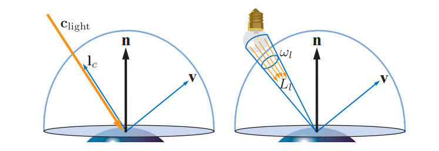

球体使用了GGX BRDF来进行渲染，从左到右，球体材质的表面粗糙度递增。最右侧图像和最左侧图像是一样的，只是将其垂直翻转了过来。请注意，在低粗糙度的材质上，由大圆盘灯引起的高光和着色效果，与较小光源在高粗糙度材质上所引起的高光效果，在视觉上面十分相似。

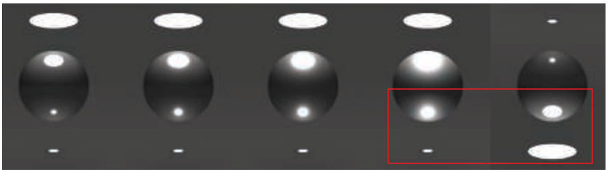

这张图意思是使用点光源，并且调整粗糙度后，可以用来近似面光源的镜面效果。

## Lambertian表面

对于Lambertian表面这种特殊情况，直接使用点光源来表示面光源是很精确的。对于这样的表面，其出射的radiance与irradiance成正比：

$$
L_{o}(\mathbf{v})=\frac{\rho_{\mathrm{ss}}}{\pi} E
\tag{10.2}
$$
也就是说对于Lambertian表面只要接受到的irrandance一致，那最终的radiance就是一样的。所以可以直接用点光源代替面光源（只是在Lambertian表面）

### 向量irradiance

> 这里说的一堆东西是一种用点光源代替面光源近似计算的实现方案，使用它的方法求出来的净辐照度来代替对整个面光源的积分运算

向量irradiance（vector irradiance）的概念对于当面光源存在时，理解irradiance的行为十分有用。向量irradiance的概念由Gershun [526]提出，他将其称之为光源向量（light vector），Arvo [73]将这个概念进一步推广。利用向量irradiance，可以将任意大小和任意形状的面光源，精确地转换为点光源或者方向光。

这里的向量irradiance计算过程

$$
\mathbf{e}(\mathbf{p})=\int_{\mathbf{l} \in \Theta} L_{i}(\mathbf{p}, \mathbf{l}) \mathbf{l} d \mathbf{l}
\tag{10.4}
$$
左图：点$\mathbf{p}$被各种具有形状、大小、radiance分布的光源所包围，其中黄色的明亮程度代表了光源发射出的radiance数量。以点$\mathbf{p}$为起点的橙色箭头代表了向量，它指向任何存在入射radiance的方向，每个向量的长度，等于来自该方向上的radiance乘以箭头所覆盖的无限小的立体角。原则上应当存在无穷多个箭头。右图：向量irradiance（橙色大箭头）是左图中所有橙色向量的总和。向量irradiance可以用来计算任意平面在点$\mathbf{p}$处的净irradiance。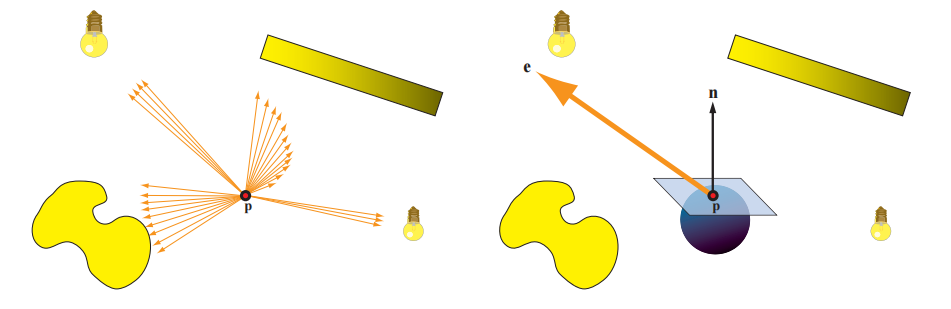

其中$\mathbf{n}$是平面的表面法线。通过平面的净irradiance，是指流经平面“正面”（表面法线$\mathbf{n}$所指向的方向）和流经平面“背面”的irradiance之差。虽然说净irradiance本身对于着色计算来说没有什么用处，但是如果说没有任何radiance被发射通过平面的“背面”的话（换句话说，对于所分析的光线分布，光线方向$\mathbf{l}$和表面法线$\mathbf{n}$之间的夹角都不会超过$90^{\circ}$，所有的入射光线都来自于着色点的正半球方向），即$E(\mathbf{p},-\mathbf{n})=0$，那么此时有：

$$
E(\mathbf{p}, \mathbf{n})=\mathbf{n} \cdot \mathbf{e}(\mathbf{p})
\tag{10.6}
$$

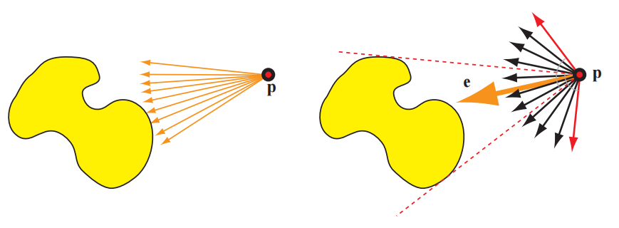

如果入射radiance $L_i$与波长无关的假设不成立的话，那么在一般情况下，我们就不能再定义单个向量irradiance $\mathbf{e}$了。然而，彩色光通常在所有点上都具有相同的相对光谱分布，这意味着我们可以将$L_i$分解为颜色$\mathbf{c}^{\prime}$，以及与波长无关的radiance分布$L_i^{\prime}$。在这种情况下，我们可以计算$L_i^{\prime}$的向量irradiance $\mathbf{e}$，并对方程10.6进行一些扩展，将$\mathbf{n} \cdot \mathbf{e}$乘上颜色$\mathbf{c}^{\prime}$。这样做的结果与计算方向光irradiance的方程相同，只是做了以下替换：

$$
\begin{aligned} \mathbf{l}_{c} & =\frac{\mathbf{e}(\mathbf{p})}{\|\mathbf{e}(\mathbf{p})\|}, \\ \mathbf{c}_{\text {light }} & =\mathbf{c}^{\prime} \frac{\|\mathbf{e}(\mathbf{p})\|}{\pi} .\end{aligned}
\tag{10.7}  
$$

到此为止，我们已经可以将任意形状和任意大小的面光源转换为方向光，同时不会引入任何误差。

对于一些简单情况，用于求取向量irradiance的方程10.4可以求出解析解。例如：想象现在有一个以$\mathbf{p}_l$为中心、半径为$r_l$的球形光源。球面上的每一点都会向各个方向发出具有恒定radiance $L_l$的光线。对于这种光源，将方程10.4和方程10.7联立，可以获得如下结果：

$$
\begin{aligned} \mathbf{l}_{c} & =\frac{\mathbf{p}_{l}-\mathbf{p}}{\left\|\mathbf{p}_{l}-\mathbf{p}\right\|}, \\ \mathbf{c}_{\text {light }} & =\frac{r_{l}^{2}}{\left\|\mathbf{p}_{l}-\mathbf{p}\right\|^{2}} L_{l} .\end{aligned}
\tag{10.8} 
$$

上述方程，与具有$\mathbf{c}_{\text {light }_{0}}=L_{l}, r_{0}=r_{l}$和标准距离平方反比衰减函数的泛光灯（章节5.2.2）完全相同。可以对这个衰减函数进行一些修正，使得光线从球体表面才开始发生衰减，并在光源的最大影响距离处衰减到0，有关这些调整的更多细节，详见章节5.2.2。

## Glossy表面

与 Lambertian 表面（仅依赖入射辐照度总量）不同，非 Lambertian 表面（如光泽、高光表面）的出射亮度，不仅依赖入射光总量，还依赖**入射光的方向分布**—— 面光源在这类表面的核心视觉效果是 “与光源形状相似、边缘随粗糙度模糊的高光”

在实时渲染中，大多数对面光源光照效果的实用近似，都是基于了这样的一个想法：为每个着色点都寻找一个等效的精确光源，从而模拟非无穷小光源的效果。这种方法经常被用于实时渲染中，以解决各种各样的问题

### 粗糙度修正

- 核心逻辑：找到面光源入射辐照度的 “有效圆锥体” 和 BRDF 镜面波瓣的 “有效圆锥体”，用两个圆锥体的立体角之和，修正材质的粗糙度参数，让镜面波瓣 “变宽”，模拟面光源的柔和高光。
- 典型实现：Karis 将该思路应用于 GGX BRDF，修改粗糙度参数$(\alpha_g' = \left(\alpha_{g}+\frac{r_{l}}{2\left\|\mathbf{p}_{l}-\mathbf{p}\right\|}\right)^{\mp})$（限制在 0-1 之间）。
- 优缺点：计算成本低，对中等光泽表面效果好；但对镜面级光滑表面失效（无法模拟锐利高光），且微表面 BRDF 的宽衰减特性会导致效果失真。

### 代表性点技术

- 核心逻辑：基于 “积分中值定理”，用面光源上对表面能量贡献最大的一个 “代表性点”，替代整个面光源（将面光源简化为一个点光源），类似蒙特卡洛积分的重要性采样思想。
- 关键操作：
  - 选择代表性点：优先选 “与反射光线夹角最小” 或 “距离反射光线最近” 的点（Karis 改进后更高效）；
  - 能量修正：通过简单公式缩放光线强度，保证能量守恒。
- 优缺点：推导简单、适用于多种光源形状；但会导致粗糙表面的高光偏 “尖锐”（与真实值有偏差），需额外优化。
- 扩展优化：Iwanicki 和 Pesce 通过拟合数值积分结果，引入软阈值、缩放因子等参数；de Carpentier 针对微表面 BRDF，改用 “最大化$(\mathbf{n} \cdot \mathbf{h})$（法线与半向量点积）” 选择代表性点，优化掠射角下的高光形状。

### 线性变换余弦（LTC）法：高精度通用解决方案

- 核心逻辑：用 “3×3 矩阵变换的余弦波瓣”（LTC）近似任意 BRDF 的镜面波瓣，通过矩阵对余弦波瓣进行缩放、拉伸、旋转，适配不同 BRDF 和光源形状；再利用逆矩阵变换积分定义域，将复杂积分转化为简单余弦波瓣的积分（可复用成熟算法）。
- 关键优势：
  - 通用性强：适用于任意纹理多边形面光源（卡片、圆盘、管状等）和一般 BRDF；
  - 准确性高：离线构建 BRDF 参数（粗糙度、入射角）的查找表，实时通过查找表快速求解。
- 缺点：计算成本高于前两种方法，但准确性更优。

### 一般光源形状的适配的处理

| 光源形状                         | 适用场景                   | 关键处理方式                                                 |
| -------------------------------- | -------------------------- | ------------------------------------------------------------ |
| 球形光源                         | 基础简化光源               | 粗糙度修正、代表性点技术（核心适配对象）                     |
| 管状（胶囊）光源                 | 模拟荧光灯管               | Lambertian 表面可用 Picott 的封闭积分解；非 Lambertian 表面用代表性点技术叠加点光源 |
| 平面光源（卡片 / 圆盘 / 多边形） | 柔光箱、反光板、发光面板等 | - 简单近似：Drobot 的代表性点方法（找积分最大值附近的点）；- 精确解析：Arvo 的辐照度张量 + 轮廓积分（实时成本高）；- 实用优化：Lecocq 的 O (1) 轮廓积分近似 |

# 环境光照

在实践中，通常我们会认为直接光具有较高的radiance和相对较小的立体角，而间接光往往会以中等或者较低的radiance，来覆盖半球方向上的其余部分。基于这种划分方式和理由，我们可以将二者**分开进行处理**。

## 恒定环境光

- **核心假设**：入射辐射度 $L_A$ 不随方向变化（全方向恒定），是最基础的环境光照模型。

  对不同表面的贡献

  1. Lambertian（漫反射）表面

  - **特点**：出射辐射度贡献恒定，与表面法线 $\mathbf{n}$ 和观察方向 $\mathbf{v}$ 无关。
  - **公式**：

  $$
  L_o(\mathbf{v}) = \rho_{\mathrm{ss}} L_A
  $$

  - **简化逻辑**：
     漫反射的 BRDF 为 $\frac{\rho_{\mathrm{ss}}}{\pi}$，半球积分为 $\int_{\Omega} (\mathbf{n} \cdot \mathbf{l}) d\mathbf{l} = \pi$，因此最终 $\frac{\rho_{\mathrm{ss}}}{\pi} \cdot L_A \cdot \pi = \rho_{\mathrm{ss}} L_A$。

  ------

  2. 任意 BRDF 表面

  - **特点**：贡献依赖定向反照率 $R(\mathbf{v})$。
  - **定向反照率定义**：

  $$
  R(\mathbf{v}) = \int_{\Omega} f(\mathbf{l}, \mathbf{v}) (\mathbf{n} \cdot \mathbf{l}) \, d\mathbf{l}
  $$

  - **出射辐射度公式**：

  $$
  L_o(\mathbf{v}) = L_A \cdot R(\mathbf{v})
  $$

  ------

  3. 老版本简化（近似方案）

  - **假设**：定向反照率 $R(\mathbf{v})$ 为恒定值（称为环境颜色 $\mathbf{c}_{\mathrm{amb}}$）。
  - **公式**：

  $$
  L_o(\mathbf{v}) = \mathbf{c}_{\mathrm{amb}} \cdot L_A
  $$

## 球面函数和半球函数

把环境光照 $L_A$ 视为一个常数，这意味着：

> 每个方向来的光强都是相同的。

但真实世界中并非如此。一个点从不同方向接收到的光强往往不同，例如：

- 左边可能是红墙 → 红色光；
- 右边可能是绿树 → 绿色光；
- 上方可能被遮挡 → 几乎没有光。

因此，要描述这种“**方向依赖的入射辐射度（radiance）**”，我们需要一个定义在**方向空间（sphere）**上的函数。

我们把所有方向的集合记为：
$$
S = \{\omega \in \mathbb{R}^3 : ||\omega|| = 1\}
$$
于是，一个方向依赖的入射辐射度可以写为：
$$
L_i(\omega) : S \rightarrow \mathbb{R}^+
$$
它表示从方向 $\omega$ 入射的 radiance。

这个函数定义在球面上（而非位置上），因此叫**球面函数（spherical function）**。

对于一个 Lambertian 表面，其出射辐射度与入射辐射度的关系是：
$$
L_o = \frac{\rho}{\pi} \int_{H(\mathbf{n})} L_i(\omega_i) (\mathbf{n} \cdot \omega_i) d\omega_i
$$
其中：

- $H(\mathbf{n})$：法线方向上的半球；
- $(\mathbf{n} \cdot \omega_i)$：余弦项；
- 这个积分就是**radiance 与余弦波瓣的卷积**。

因此，为了实时渲染，我们往往预计算：
$$
E(\mathbf{n}) = \int_{H(\mathbf{n})} L_i(\omega_i) (\mathbf{n} \cdot \omega_i) d\omega_i
$$
并把它称为 **irradiance function**，它是球面函数的卷积结果。预计算每个法线半球的irradiance。

球面函数是定义在球面上的连续函数，不可能直接存储。所以我们要找一种“基底”，用有限个系数表示它。这就类似于在平面上用傅立叶级数展开周期函数。

> 例如：
>  $f(\omega) = \sum_{l,m} c_{lm} Y_{lm}(\omega)$，
>  其中 $Y_{lm}$ 是**球谐函数（Spherical Harmonics）**。

这类基底称为：

- **球面基底（Spherical Base）**
- 包括球谐函数、Haar 小波基、径向基、环境高光基底（AHD）等。

**投影（Projection）**：
 把函数 $L_i(\omega)$ 投影到基底空间，求出系数：
$$
c_{lm} = \int_S L_i(\omega) Y_{lm}(\omega) d\omega
$$
**重建（Reconstruction）**：
 通过这些系数恢复函数：
$$
\tilde{L_i}(\omega) = \sum_{l,m} c_{lm} Y_{lm}(\omega)
$$

> 总结一下：一个定义在球面上的函数 $f(\omega)$，可以用一组球面基函数 $Y_l^m(\omega)$ 的线性组合来近似表示。
>  你只需要计算保存这些线性组合的**系数**，在任何方向上（角度）都可以通过这些系数 + 基函数重建出近似值。

### 球面基底的简单表示形式

1. 表格（采样点）表示球面函数

- **方法**：直接在球面上选若干方向 $\omega_i$，存储每个方向上的函数值 $f(\omega_i)$。
- **重建**：当需要某个方向 $\omega$ 的值时，找到附近的样本点，用插值（如双线性或三线性）求出近似值。
- **优点**：
  - 非常直观，易于理解和实现；
  - 表征能力强，只要采样足够密集，几乎可以精确还原原函数；
  - 函数相加/相乘简单：直接对对应采样点的值相加或相乘。
- **缺点**：
  - 样本少时重建误差大；
  - 旋转不变性差（函数旋转后，插值结果可能不准确，导致闪烁或脉动瑕疵）；
  - 高频函数需要大量样本，存储和计算量大；
  - 卷积等操作复杂，计算成本和样本数量成正比。

2. 环境立方体（Ambient Cube, AC）

   - **思想**：用 6 个值（立方体六个面）表示球面函数。
   - **公式**：

   $$
   F_{AC}(\mathbf{d}) = \mathbf{d} \cdot \operatorname{sel}_+(\mathbf{c}_+, \mathbf{c}_-, \mathbf{d})
   $$

   - $\mathbf{d}$ 是方向向量；
   - $\mathbf{c}_+$ 和 $\mathbf{c}_-$ 是立方体六个面的值；
   - $\operatorname{sel}_+$ 根据方向的正负性选择对应面。
   - **特点**：
     - 只需三个波瓣参与计算（x、y、z方向）；
     - 在软件重建上可能比 GPU 双线性过滤更快；
     - 精度低，但实现简单；
     - 可以和球谐 SH 互相转换（Sloan 提供方法）。

3. 环境骰子（Ambient Dice, AD）：

- 基底由二十面体顶点方向上的平方和四次余弦波瓣组成；
- 需要存储 12 个值中的 6 个来重建；
- 重建质量比环境立方体高，但逻辑稍复杂。

### 球面基底

基函数的一个例子。在这个例子中，输入值为0-5之间的一个数，函数会返回0-1之间一个值，左侧的图展示了这样一个函数。中间的图展示了一组基函数（每种颜色都代表了一个不同的基函数）。右图则展示了使用基函数来对目标函数的近似，通过将每个基函数乘以一个权重并将它们相加来完成这个近似。右图中的每个基函数都按照各自的权重进行了缩放，图中的黑色线条代表了基函数求和之后的结果，这是对原始函数的近似结果；图中灰色线条代表了原始函数，用于和近似函数进行比较。

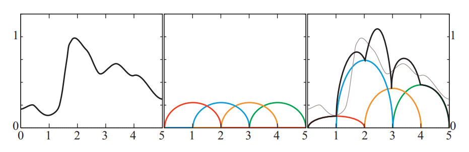

#### 球面径向基函数（SRBF）

- **定义**：一类沿轴旋转对称的函数，只依赖于 **方向之间的夹角**。
  - 输入参数 = 方向 $\mathbf{v}$ 与波瓣方向 $\mathbf{d}$ 的夹角。
- **构建方法**：
  - 将球面覆盖上若干固定方向的“波瓣”（lobe）；
  - 每个波瓣有大小/尖锐度参数；
  - 函数值 = 所有波瓣在该方向上的值加权求和。
- **优点**：
  - 可以获得比双线性插值更高质量的重建；
  - 可通过固定波瓣方向，简化投影（只需拟合权重）。

#### 球面高斯（SG, Spherical Gaussian）

- **定义**：一种常用的 SRBF，类似 von Mises-Fisher 分布：

$$
G(\mathbf{v}, \mathbf{d}, \lambda) = e^{\lambda(\mathbf{v} \cdot \mathbf{d}-1)}
$$

- $\mathbf{v}$：计算方向
- $\mathbf{d}$：波瓣主方向
- $\lambda$：尖锐度/扩散参数
- **球面函数表示**：

$$
F_G(\mathbf{v}) = \sum_k w_k G(\mathbf{v}, \mathbf{d}_k, \lambda_k)
$$

- 通过拟合 $w_k$ 来最小化重建误差。
- 如果波瓣方向和扩散参数固定，投影成基就简单 → 线性最小二乘法。
- 如果方向/扩散参数可变 → 非线性优化，难度大。

#### 球谐函数（spherical harmonic，SH）

球谐函数（spherical harmonic，SH）是球面上的一组正交的基函数。一组基函数的正交集（orthogonal set）具有如下特点：任意两个**不同基函数之间的内积（inner product）为零**。内积是一个类似于点积的概念。两个向量之间的内积就是它们的点积，即各个分量对应相乘再相加的结果。我们可以类似地推导出**两个函数的内积的定义**，即将这两个函数相乘再进行积分，其数学表达如下：

$$
\left\langle f_{i}(\mathbf{n}), f_{j}(\mathbf{n})\right\rangle \equiv \int_{\mathbf{n} \in \Theta} f_{i}(\mathbf{n}) f_{j}(\mathbf{n}) d \mathbf{n}
$$

> 下面说的是为了说明什么是标准正交基，以及他的优势对比普通基底

标准正交集（orthonormal set）也是一个正交集，其附加条件是该集合中的任意一个函数与自身的内积都为1。更加正式的表述方式为，一组函数$\{f_j()\}$是标准正交的条件是：

$$
\left\langle f_{i}(), f_{j}()\right\rangle=\left\{\begin{array}{ll}0, & \text { where } i \neq j, \\ 1, & \text { where } i=j .\end{array}\right.
$$
展示了一个类似于图10.18的例子，不同之处在于，其中的基函数都是标准正交的。请注意，图10.20中的所展示的标准正交基函数都是互不重叠的，这个条件对于非负函数的标准正交集合是十分必要的，因为任何的重叠都意味着内积非零。而对于那些在部分范围内为负的基函数，则可以发生重叠，它们仍然可以形成标准正交集。这种重叠通常会得到更好的近似结果，因为它允许使用更加平滑的基底。而那些互不重叠的基函数，往往会导致近似结果的不连续性。

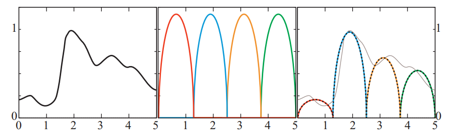

标准正交基的优点在于，想要找到最接近目标函数的近似值十分简单。为了完成投影操作，每个基函数的权重系数都是目标函数$f_{\text {target }}() $与相应基函数的内积：

$$
\begin{array}{c}k_{j}=\left\langle f_{\text {target }}(), f_{j}()\right\rangle, \\[2mm]
 f_{\text {target }}() \approx \sum_{j=1}^{n} k_{j} f_{j}() .\end{array}
 \tag{10.23}
$$
SH的基

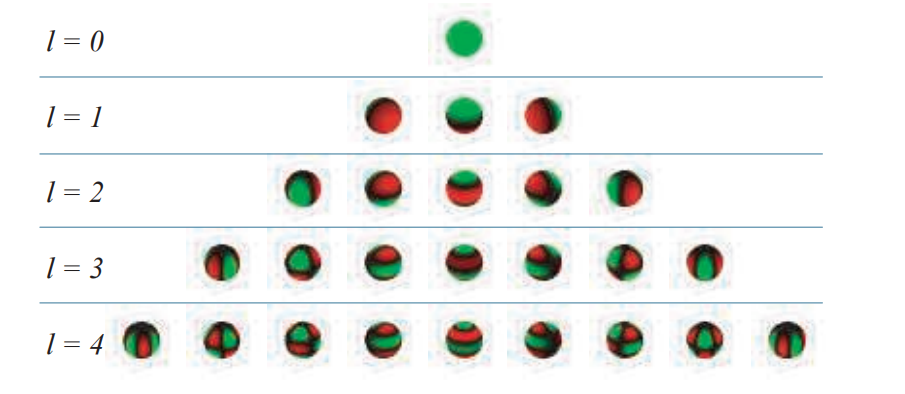

SH 的特点

1. **旋转不变性**：
   - 基函数在旋转下有解析变换公式，旋转投影函数方便。
2. **计算成本低**：
   - 基函数是 $x, y, z$ 坐标的多项式。
3. **全局支持**：
   - 类似球面高斯，每个基函数影响球面上所有方向。
4. **频带排列**：
   - 第 0 频带：常数函数
   - 第 1 频带：线性函数
   - 第 2 频带：二次函数
   - … → 低频分量变化慢，高频分量变化快
   - 光照积分等低频函数可以用少量系数表示（比如 irradiance）。
5. **积分和乘积解析**：
   - 两个函数在球面上的积分可以转化为它们系数的点积 → 高效计算光照积分。

#### 其他球面表示方法

除了 SH，还有：

| 方法                          | 特点                    | 用途         |
| ----------------------------- | ----------------------- | ------------ |
| 线性变换余弦（LTC）           | 近似 BRDF               | 高效积分     |
| 球面小波（spherical wavelet） | 空间局部性 + 频率局部性 | 高频函数压缩 |
| 球面分段常数基函数            | 球面划分为常数区域      | 环境光照表示 |
| 双聚类近似（biclustering）    | 矩阵分解方法            | 环境光照压缩 |

### 半球基底

为什么要用半球基底

- 上节讲的 SH、球面高斯等基底都是定义在 **整个球面** 上。
- 但是很多光照相关函数 **天然只定义在半球**（例如 BRDF、入射辐照度、到达表面的光照），另一半球（向下）是零。
- 如果用全球基底来表示半球函数，会 **浪费一半的表示能力**。
- 因此研究者提出了 **直接在半球域上构造的基底**。

#### AHD基底

最简单的半球表示方法：

- A：恒定环境光
- H：高光方向光
- D：入射光集中的方向

存储：

- 8 个参数（2 个角度 + 6 个 RGB 颜色）

投影：

- 非线性 → 通常先投影到 SH，再用最优方向确定余弦波瓣方向 → 最小二乘求权重

用途：

- 表面 irrandiance 存储

- 游戏应用：《雷神之锤3》《使命召唤》

  

#### 半条命2基底（Radiosity Normal Mapping）

- 用 3 个 **互相垂直的基向量**表示半球函数
- 基向量在切线空间中：

$$
\mathbf{m}_0, \mathbf{m}_1, \mathbf{m}_2
$$

- 重建公式：

$$
E(\mathbf{n}) = \frac{\sum_{k=0}^{2} \max(\mathbf{m}_k \cdot \mathbf{n}, 0)^2 E_k}{\sum_{k=0}^{2} \max(\mathbf{m}_k \cdot \mathbf{n}, 0)^2} \quad \text{(10.25)}
$$

- 优化后可简化为线性加权形式：

$$
E(\mathbf{n}) = \sum_{k=0}^{2} d_k E_k \quad \text{(10.27)}
$$

- 特点：
  - 存储少、计算快
  - 可与法线贴图结合
  - 实际效果优于低阶 SH

#### 半球谐波 / H-Basis

将 SH 特化到半球域：

- 半球谐波（HSH）：类似 SH，但只定义在半球
- 可以使用 Zernike 多项式（单位圆盘上的正交函数）来表示半球函数

H-Basis（Habel）：

- 混合部分球谐函数 + HSH
- 正交
- 计算效率较高
- 可以对系数向量进行矩阵运算完成旋转

# 环境映射

将一个球面函数记录在一个或者多个图像中的做法，被称为环境映射（environment mapping）

##  经纬度映射

> 就是把环境光贴图表达为经纬度采样，计算要采样方向的经纬度，去对应位置读取

**起源**：1976年，Blinn 和 Newell 实现了第一个环境映射算法。

**原理**：

- 把球面上的环境信息“展开”到二维纹理。

- 类似地球上的经纬度系统：

  - $\phi$（经度） → $[-π, π]$
  - $\rho$（纬度） → $[0, π]$

- 将反射向量 $\mathbf{r} = (r_x, r_y, r_z)$ 转换为球坐标：
  $$
  \rho = \arccos(r_z), \quad 
  \phi = \text{atan2}(r_y, r_x) \quad \text{(10.30)}
  $$

- 用 $(\rho, \phi)$ 来访问纹理，获取环境颜色。

**注意**：

- 纬度-经度映射 ≠ Mercator 投影：
  - 纬度-经度映射保持纬度线之间的距离恒定。
  - Mercator 投影在两极会极度拉伸。

## 球面映射

球面映射把环境光照记录在一个**圆形纹理图像**中，就像在一个完全反射的球体上看到环境一样。这个纹理也称为**光照探针（light probe）**，因为它捕捉了球体位置处的光照。

计算流程

1. **固定观察向量** $\mathbf{v} = (0,0,1)$：
    球面贴图是在一个固定视角下拍摄或者生成的，反映了这个方向的环境信息。

2. **求半角向量** $\mathbf{n}$：
    反射观察向量 $\mathbf{r}$ 和原始观察向量 $\mathbf{v}$ 的和：
   $$
   \mathbf{n} = \frac{(r_x, r_y, r_z + 1)}{\sqrt{r_x^2 + r_y^2 + (r_z + 1)^2}}
   $$

3. **映射到纹理坐标** $(u,v)$：
   $$
   u = \frac{r_x}{2 m} + 0.5, \quad v = \frac{r_y}{2 m} + 0.5
   $$

   - 这里 $m = \sqrt{r_x^2 + r_y^2 + (r_z + 1)^2}$
   - 将 $[-1,1]$ 范围映射到 $[0,1]$

4. **纹理查找**：

   - 使用 $(u,v)$ 在球面贴图中查找对应的入射辐射 $L_i(\mathbf{r})$

## 立方体映射

将环境投影到以相机位置为中心的立方体六个面上，每个面90° FOV。

六张正方形纹理分别对应立方体的 +X、-X、+Y、-Y、+Z、-Z。

访问纹理时，直接用方向向量 $\mathbf{r}$ 指向哪个面，再根据面内坐标取值即可。 **这个在LearnOpenGL中实现过**

# 基于图像的高光照明

> 这里讲的就是LearnOpenGL的IBL实现，高光就是反射的一个范围内都能接收到

环境映射最初是作为一种镜面渲染技术发展起来的，但是也可以将它扩展到光泽（glossy）反射中。当用于模拟无限远处光源的镜面效果时，这样的环境贴图也被称为高光探针（specular light probe）。（这里的镜面反射就是只有反射方向的颜色，光泽反射就是反射的一个范围内都能接收到）

> 先解释一下lobe是什么，lobe说的都是BRDF的lobe

- 对于一个 **给定的入射方向** $\mathbf{l}$，BRDF $f_r(\mathbf{l}, \mathbf{v})$ 会定义出 **所有出射方向** $\mathbf{v}$ 上的反射强度。

- **波瓣（lobe）**就是指这个方向空间中 **反射值显著非零的区域**。

  - 理想镜面 → 波瓣无限尖锐，只在反射方向上非零。
  - 光泽表面 → 波瓣稍宽，附近方向也有非零反射。
  - 漫反射 → 波瓣非常宽，几乎整个半球都有非零反射。

  下图展示镜面和高光的区别

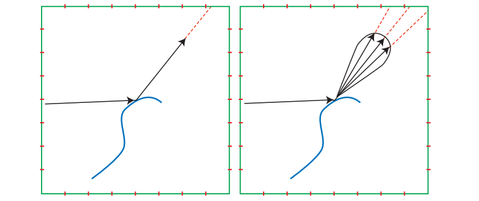

径向对称的镜面波瓣：反射方向在lobe中心

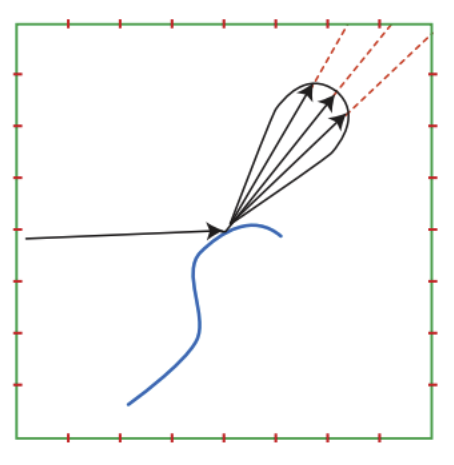

径向对称的镜面波瓣是一种渲染的假设，但会存在地平线裁剪问题

对于上边这种情况，观察球的表面时lobe会被地平线裁剪，这时候经径向对称的镜面波瓣假设是错的，会让表面高光过亮

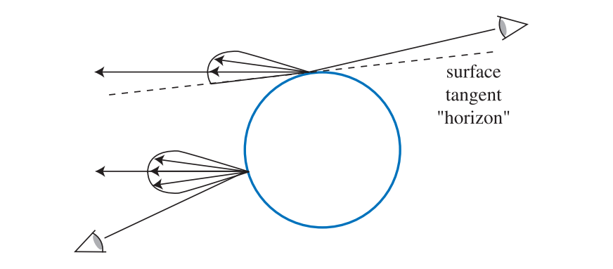

 环境贴图 + mipmap 模拟粗糙度

- **Heidrich 和 Seidel 方法**：用一个环境贴图来模拟表面模糊反射。
- **粗糙度的处理**：
  - 环境立方体贴图生成多级 mipmap。
  - **低级别 mipmap**：高分辨率，对应光滑表面（高光尖锐）。
  - **高级别 mipmap**：低分辨率，对应粗糙表面（高光模糊）。
  - 渲染时，通过 **反射向量索引贴图** 并选择对应 mipmap 层，实现不同粗糙度的反射。

> 图10.36显示了不同粗糙度波瓣对应的 mipmap 层级及渲染结果。

## 卷积环境贴图

想要生成预过滤的环境贴图意味着，要对与方向$\mathbf{v}$相关的每个纹素上，计算环境radiance与镜面波瓣$D$的积分：

$$
\int_{\Omega} D(\mathbf{l}, \mathbf{v}) L_{i}(\mathbf{l}) d \mathbf{l}.
$$

这个积分是一个球面卷积（spherical convolution），由于其中的$L_i$只能通过环境贴图的表格形式获得，因此这个积分通常无法解析求解，只能通过数值方法进行求解。一种流行的数值方法是采用蒙特卡罗方法：

$$
\int_{\Omega} D(\mathbf{l}, \mathbf{v}) L_{i}(\mathbf{l}) d \mathbf{l} \approx \lim _{N \rightarrow \infty} \frac{1}{N} \sum_{k=1}^{N} \frac{D\left(\mathbf{l}_{k}, \mathbf{v}\right) L_{i}\left(\mathbf{l}_{k}\right)}{p\left(\mathbf{l}_{k}, \mathbf{v}\right)}
\tag{10.36}
$$
蒙特卡罗积分

- 通过随机采样球面方向近似积分：
  $$
  \int_\Omega D(\mathbf{l}, \mathbf{v}) L_i(\mathbf{l}) \, d\mathbf{l} \approx \frac{1}{N} \sum_{k=1}^{N} \frac{D(\mathbf{l}_k, \mathbf{v}) L_i(\mathbf{l}_k)}{p(\mathbf{l}_k, \mathbf{v})}
  $$

  - $\mathbf{l}_k$ 是球面样本方向
  - $p(\mathbf{l}_k, \mathbf{v})$ 是采样概率密度

- **问题**：

  - 高光波瓣很尖，很多样本 $D(\mathbf{l}_k, \mathbf{v})\approx 0$ → 浪费计算
  - 第一级 mipmap（高分辨率，低粗糙度）尤其慢

------

重要性采样（Importance Sampling）

- 通过选择采样概率 $p(\mathbf{l}_k, \mathbf{v})$ 更贴近波瓣形状
- 减少无效样本，降低方差
- 可以结合 **环境贴图的 radiance 分布** 和镜面波瓣进一步优化
- 适合 **离线渲染** 或生成 ground-truth 数据

------

用锥形 / 区域采样降低方差

- 不用单点采样，而是用 **锥形区域** 样本代替一个方向
- 可以对应 mipmap 层级进行近似
- 会引入偏差，但显著降低样本数，甚至可以 **GPU 实时计算**
- **示例技术**：
  - McGuire 等人：实时近似卷积，通过混合不同 mipmap 层级来重建波瓣
  - Hensley 等人：使用 SAT（前缀和）加速积分
  - Kautz / Manson & Sloan：B 样条滤波生成 mipmap，提高精度与速度

**缺点**：

- 忽略了 shadowing-masking 和半向量菲涅尔。
- 仅适合粗略镜面近似或 Phong 模型。
- 会产生误差，如地平线裁剪或掠射角下波瓣尖锐变化

### split-sum

- **改进**：将镜面环境光积分拆分为两个部分：
  1. **环境光卷积**：波瓣 $D$ 与环境光 $L_i$ 的积分，依赖于反射方向和粗糙度，可预计算到立方体贴图 mipmap。
  2. **半球定向反射率 $R_\text{spec}$**：包含 BRDF 权重（菲涅尔、shadowing-masking），依赖于视角、粗糙度，可预计算到二维或三维查找表。
- 优势：
  - 对任意微表面 BRDF 都适用，不只是 Phong。
  - 运行时快速查表即可获得高光结果。
- 注意：
  - 假设波瓣径向对称（仍会有误差）。
  - 可以通过轻微调整查询方向来补偿半球裁剪误差。

### 不对称和各向异性波瓣

传统预过滤环境贴图的假设

- 早期方法（如 10.5.1）假设**镜面波瓣是径向对称**，仅依赖于反射向量。
- 这种方法在 Phong 或简单各向同性 BRDF 下有效。
- 波瓣的径向对称意味着：
  - 波瓣围绕反射向量旋转时，形状不变。
  - 高光大小只由粗糙度决定，与光线方向旋转无关。

------

 微表面 BRDF 的复杂性

- 微表面 BRDF（如 GGX）是围绕**半向量 $\mathbf{h}=(\mathbf{l}+\mathbf{v})/\|\mathbf{l}+\mathbf{v}\|$** 定义的。
- 半向量依赖入射方向 $\mathbf{l}$，环境光下 $\mathbf{l}$ 并不唯一。
- 因此即便各向同性，也**无法满足反射向量径向对称**。
- 直接将微表面 BRDF 转换为径向对称波瓣会引入较大误差（高光形状偏离真实情况，尤其在掠射视角）。
  - 图10.38 显示 GGX 原生波瓣（红） vs. 径向对称近似波瓣（绿），差异明显。

改进方法

- **Kautz & McCool**：

  1. 使用单个最佳样本拟合 BRDF，而不是恒定修正因子。
  2. 对多个样本平均，近似半向量模型的拉伸高光。

  - 引入能量修正因子，补偿径向对称近似的能量损失。

- **Iwanicki & Pesce**：

  - 对 GGX BRDF 做环境立方体贴图近似，利用 Nelder-Mead 最小化优化样本位置。
  - 可以结合 GPU 各向异性过滤加速采样。

- **Revie / McAuley**：

  - 在延迟渲染和毛皮渲染中，调整单个样本位置以匹配复杂 BRDF 峰值。

- **McAllister / Lafortune BRDF**：

  - 利用 Lafortune BRDF（多个广义 Phong 波瓣叠加）表达复杂材质。
  - 依然可以用传统预过滤环境贴图和 mipmap 编码不同 Phong 指数。

# irradiance环境映射

上一小节中我们讨论了如何使用预过滤环境贴图来实现光泽反射，这些贴图同样也可以用于实现漫反射

计算irradiance环境贴图的过程。在原始环境纹理（本例中是一个立方体贴图）中对表面法线周围的余弦加权半球进行采样，并对采样结果进行求和，从而获得与视图无关的irradiance。图中绿色的方块代表了立方体贴图的横截面，红色的虚线代表了纹素之间的边界。这里使用的是一个立方体贴图，但实际上任何环境表示都是可以使用的。

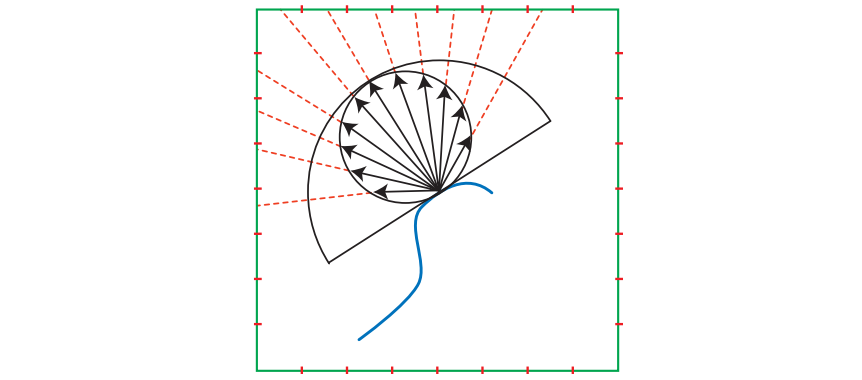

## 球谐irradiance

**漫反射光照低频**：irradiance 随表面法线变化平滑，适合用低阶 SH 表示。

**低阶 SH 足够**：前 9 个系数（每个 RGB 通道）就能表示环境光，误差约 1%；间接光照甚至只需 4 个系数（12 个浮点数）。

**卷积方法高效**：

- 从 radiance 贴图计算 irradiance 实际上是与 clamped 余弦函数卷积。

- 卷积在 SH 空间中可通过系数相乘快速完成：
  $$
  k_{E j} = k_{\cos^+ j}' \, k_{L j}
  $$

- $k_{L j}$ 是 radiance 的 SH 系数，$k_{\cos^+ j}'$ 是 clamped 余弦函数系数的缩放

**紧凑**：比立方体贴图或抛物线贴图节省存储。

**高效**：渲染时可通过多项式计算重建 irradiance，而无需纹理采样。

**动态光源支持**：

- 新光源的 SH 系数可以累加到已有 SH 系数中，无需重算整个贴图。
- 点光源、圆盘光源、球光源等均有解析 SH 表达式，可快速叠加。

## 其他方法

| 方法                                | 特点                                                         | 优缺点                               |
| ----------------------------------- | ------------------------------------------------------------ | ------------------------------------ |
| **半球光照（hemisphere lighting）** | 使用天空颜色 $L_{sky}$ 和地面颜色 $L_{ground}$ 两种均匀radiance表示上半球和下半球 | 简单、存储少、计算快；精度低         |
| **环境立方体（ambient cube）**      | 将半球光照扩展为6个方向的立方体                              | 较SH更直观，可用于快速计算；存储略大 |
| **球面高斯函数**                    | 对irradiance使用旋转对称的高斯函数表示                       | 平滑，适合低频光照                   |
| **H-basis**                         | 只能表示一个半球方向                                         | 有局限，法线向下时不可用             |
| **SH（球谐函数）**                  | 低频光照的紧凑表示，可做卷积、动态光源累加                   | 高频光照不足，振铃现象存在           |

