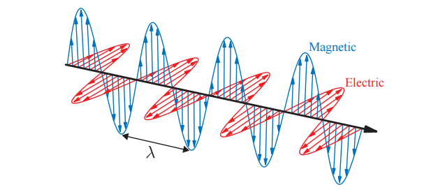
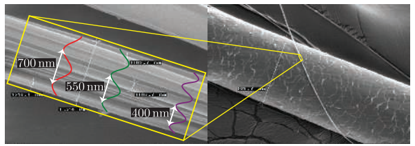
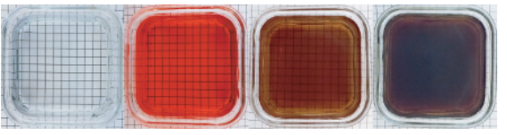
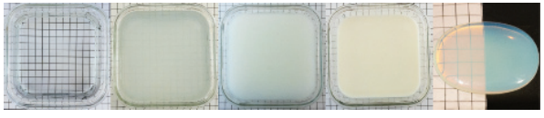
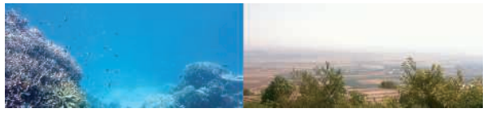
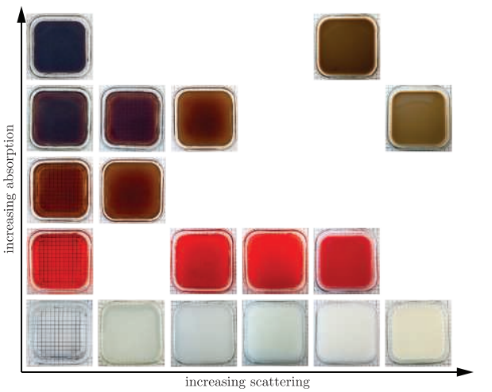
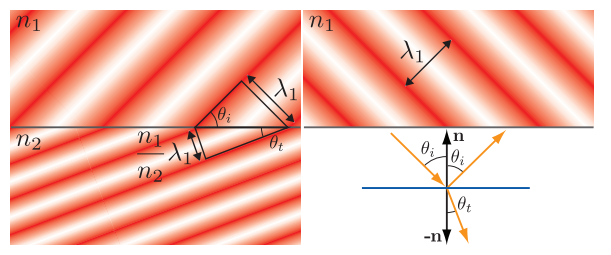
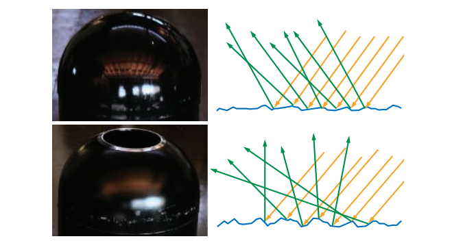
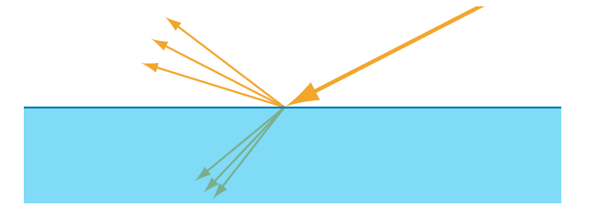
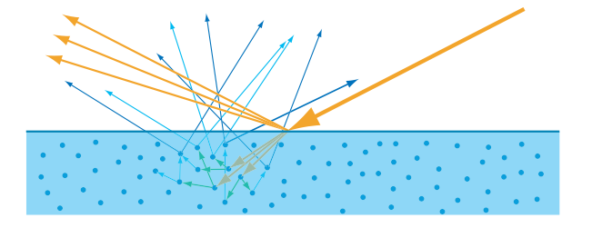

+++
date = '2025-10-20T13:29:19+08:00'
draft = true
title = 'Physically Based Shading'
categories = ["Books/Real-Time Rendering 4th"]
tags = ["看书笔记","实时渲染","Real-Time Rendering 4th"]
+++

# 光的物理学

在物理光学（physical optic）中，光被认为是一种电磁横波（electromagnetic transverse wave），它使得电场（electric field）和磁场（magnetic field）在其传播方向的垂直面上来回振荡。电场和磁场的振荡是耦合的，二者的矢量相互垂直，并且长度之比也是固定的，这个比值等于相位速度（phase velocity），我们将在稍后进行讨论。

光是一种电磁横波。电场和磁场的矢量垂直于光线的传播方向，并以90度夹角相互振荡。本图中所展示的是最简单的光波，它是单色光（仅有一个固定的波长\lambda），并且是线性偏振的（电场和磁场各自沿着一条直线进行振荡）。

单个波长的大小大约在400纳米-700纳米，这个长度大约是一根蜘蛛丝的一半到三分之一左右，而一根蜘蛛丝还不到人类头发直径的五分之一，如图9.2所示。在光学中，通常都会使用相对于波长的尺度来描述尺寸大小，例如：我们会说蜘蛛丝的宽度大约为$2\lambda - 3\lambda$（即2-3倍的波长），头发的宽度为$100\lambda - 200\lambda$。

光波会携带能量，这个能量流的强度等于电场强度和磁场强度的乘积，由于电场和磁场交替振荡，二者强度是成比例的，因此光线能量流的强度与电场强度的平方成正比。这里我们会关注电场，这是因为电场对物质的影响要比磁场大得多。

在渲染中，我们关注的是随着时间变化的平均能量流，它与振幅的（amplitude）平方成正比，这个平均能量流的强度就是irradiance，通常使用字母E来进行表示。

当光波被发射出来之后，它们穿过空间，直到遇到一些可以相互作用的物质。大多数光与物质交互作用，其核心现象都很简单，振荡的电场会推动和拉动物质中的电荷，使它们也依次发生振荡。振荡的电荷会发射出新的光波，这个过程会将入射光波的一些能量重新定向到新的方向。这个作用过程被称为散射（scattering），它是各种光学现象的基础。散射出的光波与原始光波具有相同的频率。通常情况下，当原始光波包含多个频率的光波时，每个频率的光波都会单独与物质发生作用。而对于某个频率的入射光，也不会对其他频率的散射光产生能量贡献。

一个孤立的分子会使光波向着各个方向进行散射，并使光的强度发生一些方向性的变化。但是更多的光线还是会沿着接近原始传播轴的方向进行散射，包括向前的方向或者向后的方向。分子作为散射体（scatterer）的有效性（分子附近的光波被散射的可能性），会随着波长的变化而发生很大的改变。在渲染中，我们主要关心的是包含许多分子的集合，光线在与这些聚集体发生相互作用的时候，其结果可能会与孤立分子的情况有所不同。从附近分子散射出的光波通常是相干的，因此会相互干涉，因为它们大概率都具有相同的入射波。本小节的剩余部分将专门讨论若干种多分子散射的特殊情况。

下面例子、介质、表面、次表面描述的是光接触到这些不同的模型时会产生什么反应

## 粒子

这里讲的是瑞丽散射和米氏散射，不同的散射情况与粒子大小与光的波长的比较有关，我在OpenGL渲染器的大气渲染原理部分已经记录过了

## 介质

光在均匀介质（homogeneous medium）中进行传播是另一种重要的情况，均匀介质是指一个充满均匀分布的相同分子的空间。这里所说的均匀分布，并不是指分子间距要像晶体一样完全规则，如果液体和非晶体是纯净物（所有的分子都是相同的），并且没有间隙或者气泡的话，也可以认为它们在光学上是均匀的。

在均匀介质中，光的传播核心特点是**散射波的相消干涉**：

1. 分子散射产生的次级波会整齐排列，除原始传播方向外，所有其他方向的散射波会因相位相反相互抵消（相消干涉）；

2. 原始波与所有单分子散射波叠加后，最终波形与原始波基本一致，仅**相位速度**和（部分情况下的）**振幅**发生改变；

3. 相消干涉完全抑制了散射现象，因此均匀介质不会表现出明显的散射效果。

   

   四个装有不同吸收性质液体的小容器。从左到右分别是：纯净水，石榴汁，茶，咖啡

非均匀介质可简化为 “**嵌有散射粒子的均匀介质**”，其光学行为的核心是 “相消干涉的破坏”：

从左到右分别是：水，加了几滴牛奶的水，加了大约10%牛奶的水，全脂牛奶，乳白色玻璃。大多数牛奶的散射粒子都要比可见光的波长大，因此它的散射主要是无色的，在中间的图像上有明显的淡蓝色。在最右侧图像中，乳白色玻璃中的散射粒子要比可见光的波长小，因此蓝光的散射强度要比红光强；同时由于明暗背景的分割，透射光在左边更加明显，而散射光则在右边更加明显。

介质对光的影响本质是**散射与吸收的组合效应**：均匀介质通过相消干涉抑制散射，其光学性质由复折射率（*n*+*iκ*）描述；非均匀介质因结构无序破坏相消干涉，散射成为主要特征，且散射 / 吸收的效果均与尺度、粒子尺寸、波长密切相关。这一规律是理解自然现象（如天空蓝、水的蓝色、牛奶的白色）和渲染技术中介质模拟的基础。

散射和吸收现象都与尺度有关。在小场景中不产生任何明显散射的介质，在较大的尺度上也可能会有相当明显的散射现象。例如：当在房间内观察一杯水时，光在空气中的散射与在水中的吸收是几乎不可见的；然而在一个较大尺度的环境中，这两种效果可能都会十分显著，如图9.7所示。

左图中：在超过几米的范围内，水会对光产生强烈的吸收作用，尤其是红光，因此整体看起来会很蓝。右图中：光在没有严重空气污染或者雾的情况下，也会在数英里尺度的空气中发生散射。

具有不同吸收作用和散射作用组合的液体容器。

## 表面

从光学角度来看，物体的表面（surface）是一个二维界面，它分隔了具有不同折射率的空间体积。在一般的渲染情况下，由空气组成的外部空间，其折射率约为1.003，为简单起见，通常假设空气的折射率为1；而内部空间的折射率则取决于构成物体的物质。

一个光波撞击一个平面，平面两侧物质的折射率分别为n_1 和n_2。左侧图展示了入射波的侧视图，这个入射波从左上角进入，红色的强度代表了波的相位。表面下方的波间距与(n_1/n_2)成正比，本例中为0.5。相位沿着表面排列，因此间距的变化会弯曲（折射）透射波的方向。图中三角形的构造展示了Snell定律的推导过程。为了清晰起见，右上方的图显示了反射波的情况，它与入射波具有相同的波间距，因此其方向与表面法线具有相同的夹角。右下方展示了入射波、透射波和反射波方向的矢量图。

最终结果如图9.9所示。反射波和入射波的方向，与表面法线之间具有相同的夹角$\theta_i$；透射波的方向会以$\theta_t$的角度进行弯曲（折射），它与$\theta_{i}$的关系如下：

$$
\sin \left(\theta_{t}\right)=\frac{n_{1}}{n_{2}} \sin \left(\theta_{i}\right).
\tag{9.1}
$$
上边主要描述了在光在表面发生的反射与折射，下面描述的是微表面模型

左侧展示了两个表面的照片，右侧使用示意图的形式，展示了它们所对应的微观几何结构。上方的表面拥有略微粗糙的微观几何形状，入射光线击中了表面上不同的点，每个点的法线方向略有差异，并在一个狭窄的锥形方向上被反射，其宏观效果是具有轻微模糊的反射。下方表面具有更加粗糙的微观几何形状，入射光线照射到的表面点，具有明显不同的法线方向，反射光线会以一个较宽的锥体进行扩散，从而导致宏观的反射效果变得更加模糊。

在渲染中，我们并不会对微观几何形状进行明确的建模，而是会以一种统计的方式对其进行处理，将该表面视为一个具有微观结构法线的随机分布。因此，我们将表面建模为，会在一个连续方向上（译者注：一定的立体角范围内），对光线进行反射和折射。其中这个连续方向的宽度（锥形范围的大小，或者是立体角的大小），以及反射细节和折射细节的模糊程度，取决于微观几何法线的统计方差，即表面微尺度的粗糙度（roughness），如图9.13所示。

## 次表面散射

进入物体内部的折射光线，会继续与内部物质发生相互作用。前面我们提到，金属具有较高的吸收率和较高的反射率，即金属表面会反射大部分的入射光线，进入金属内部的折射光线也会被迅速吸收；相比之下，非金属物体则会表现出广泛的散射行为和吸收行为

这种次表面散射（subsurface scatter）的光线，会以相对于入射点的不同距离从表面射出，这个进出距离（entry-exit distances）的分布取决于材料中散射粒子的密度和性质，这些距离与着色尺度（像素的大小，以及着色样本之间的距离）之间的关系是很重要的。如果这个进出距离比着色尺度要小，那么可以假定它们为零，这样我们就可以将次表面散射与表面反射整合到同一个局部着色模型中，即某个着色点上的出射光线，只依赖于该点的入射光线。由于次表面散射与表面反射具有明显不同的外观表现，因此可以很容易地将它们划分为单独的着色选项，使用镜面项（specular term）控制表面反射现象，使用漫反射项（diffuse term）控制局部次表面散射（local subsurface scattering）现象。

就是说镜面项是表面反射结果，漫反射项是次表面反射的结果（前提是光进入表面的距离很小）。光线进出的距离很长（＞着色尺度）—— 比如牛奶、蜡烛、玉石、厚玻璃这些材料，光在内部跑了毫米级甚至厘米级距离才出来（比如用手电筒照牛奶杯，对面会透出光，还会有颜色渐变）；这种 “远距离的次表面散射”，就不能再用简单的漫反射项模拟了，需要专门的次表面散射模型（比如 SSS 材质、BSSRDF 模型），因为它的出射光不仅和入射点有关，还和周围区域的入射光有关（比如玉石的 “通透感”“温润感”，就是这种长距离 SSS 的效果）。

值得注意的是，局部次表面散射技术和全局次表面散射技术模拟的是完全相同的物理现象。每种情况下的最佳选择（即到底使用哪种模型和技术），不仅取决于材质的属性，还取决于观察的尺度。例如：当渲染一个孩子在玩塑料玩具的场景时，我们很可能需要使用全局次表面散射技术来准确地渲染孩子的皮肤，而对于塑料玩具而言，可能一个局部的漫反射着色模型就足够了。这是因为皮肤中的散射距离，要比在塑料中的散射距离大得多，但是如果相机足够远的话，皮肤的散射距离也可能会小于一个像素，此时局部的着色模型对于儿童和玩具而言都是十分准确的。相反，在一个极端的特写镜头中，塑料也可能会表现出明显的非局部次表面散射现象，这时候就需要全局次表面散射技术来对玩具进行准确地渲染。

**在观察尺度大于次表面散射尺度时，用漫反射来控制局部sss即可，但是观察尺度很小时，局部sss就不够了，需要全局sss（也就是漫反射不能只考虑当前像素，光进入物体距离大于一个像素）**

# 相机

在渲染的时候，我们会计算从表面着色点到相机位置的radiance。这模拟了一个简化了的成像系统，例如胶片相机、数码相机或者人眼。
