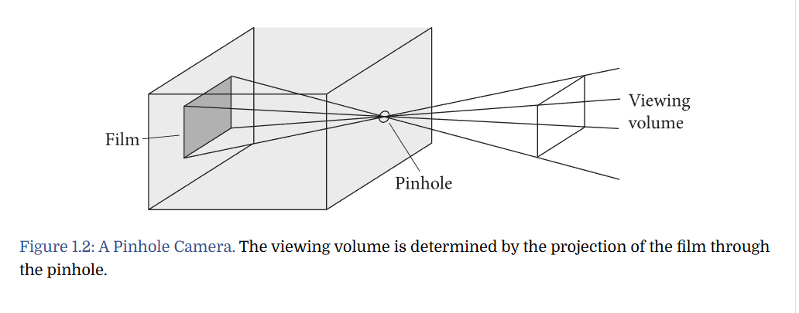
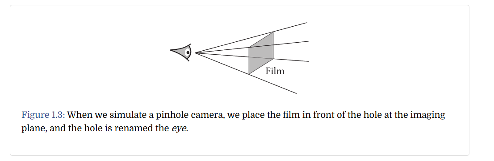
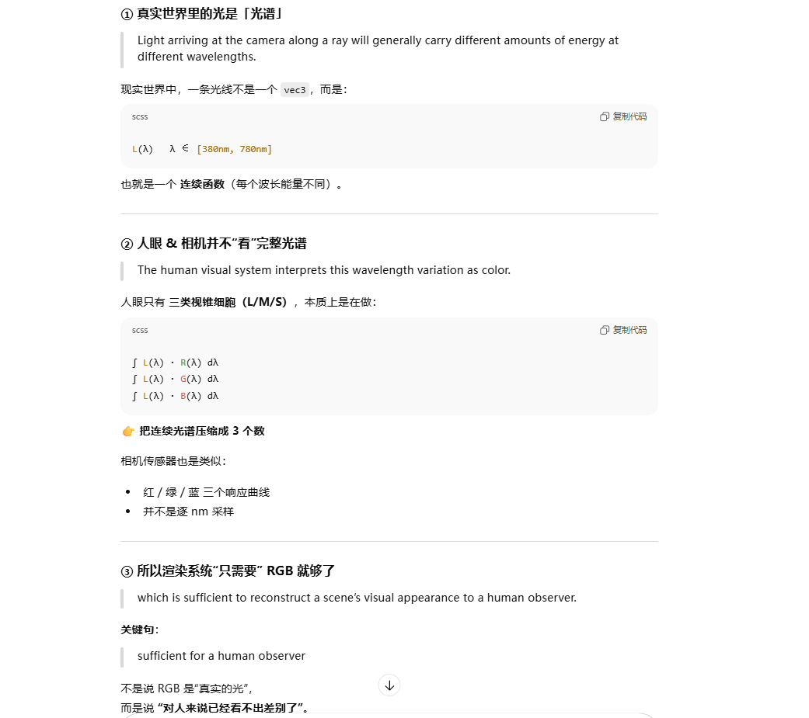

+++date = '2025-12-21T20:09:22+08:00'
draft = true
title = 'PBRT（1）'
categories = ["学习笔记/PBRT"]
+++

# PBRT入门

> 这篇博客只是简单过一下[Introduction](https://www.pbr-book.org/4ed/Introduction.html)写了那些值得记录的东西

这张图是小孔成像

在模拟时，可以认为平面在小孔之前，小孔也就变成了眼睛。 

> 好像可以用这个例子来理解为什么需要一个成像平面，或者说为什么成像平面在摄像机前面

> 之前看RTR4时，理解过这个东西，它解释了为什么RGB可以代替世界中连续波长的光

