+++date = '2025-12-22T13:17:37+08:00'
draft = false
title = 'PBRT（Monte Carlo Integration）'
categories = ["学习笔记/PBRT"]
tags = ["PBRT"]
+++
# 蒙特卡洛积分
> 开头一句话就解释了为什么渲染要用蒙特卡洛积分
>
> 虽然梯形积分法或高斯求积等标准数值积分技术在求解低维光滑积分时效果显著，但对于渲染中常见的高维不连续积分，其收敛速度却明显不足。蒙特卡洛积分技术为此提供了解决方案，通过随机采样评估积分，其收敛速度与被积函数的维度无关

## 概率论Review

> 读一遍，关键是回顾一下PMF/PDF  CDF都是什么

随机变量

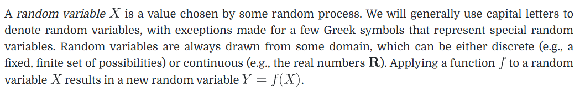

p(X)表达概率，称为PMF

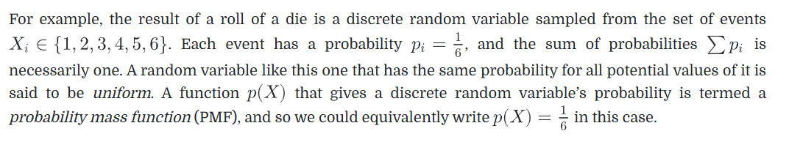

这个是真忘了

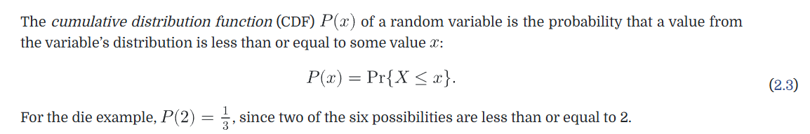

>  对于连续随机变量，PMF取值始终是0，所以另外引入了PDF（概率密度函数）来表达连续性随机变量的概率情况
>
> 计算PDF的理论方法就是，在随机域上对PDF进行积分的结果得=1，反退出来的PDF函数是什么
>
> 另外PDF是累积分布函数的导数

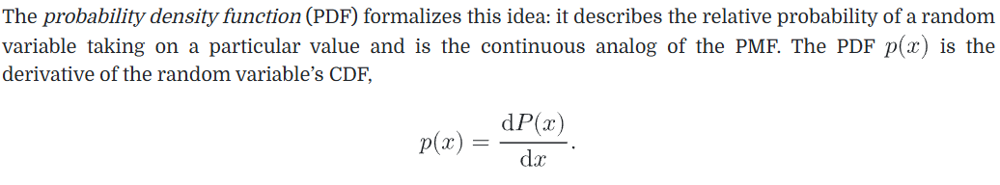

PDF作用就很好理解了，他表示当前取值的概率密度，计算ab范围内的概率，就进行积分就是一段区域内的概率

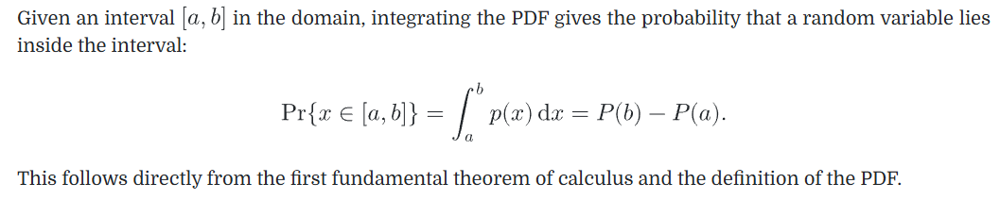

期望，X的期望就可以通过   积分X*PDF来计算

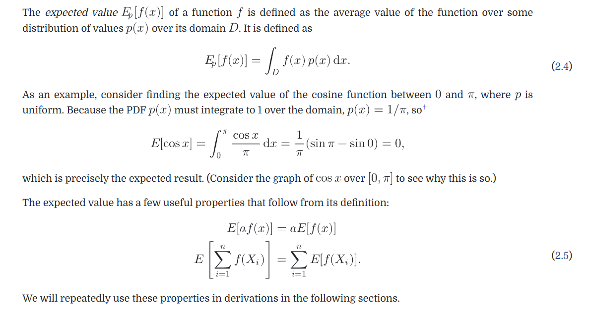

## The Monte Carlo Estimator

> 蒙特卡洛公式的期望就等于原始需要计算的积分

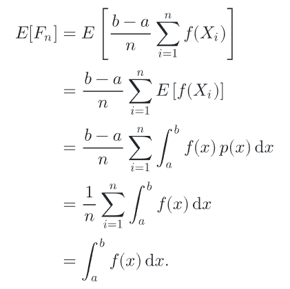

蒙特卡洛公式，代码流程就是从PDF表示的分布中随机采样，计算积分值 / pdf值，多个采样点求和后除以采样数

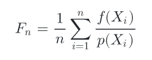

可以看出一般形式的蒙特卡洛公式的期望仍然等于要求的积分

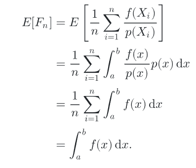

## Error in Monte Carlo Estimators 蒙特卡洛积分的误差

> 使用方差与收敛时间评估蒙特卡洛积分

回顾方差的含义就是函数与其期望值的预期平方偏差

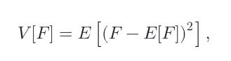

经典公式

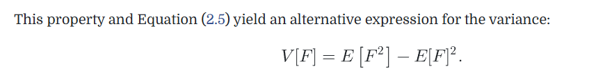

多个独立随机变量的方差可以直接求和得到总的方差

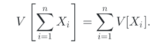

蒙特卡洛积分相当于多个独立的随机变量的和，他的方差相当于每个随机变量的方差的和，因为另外因为蒙特卡洛积分要除以/N（样本数量），所以蒙特卡洛积分的方差会随着样本数量的增加而线性递减。

下面这段话是想说明**蒙特卡洛算法的收敛速度不受维度影响，因此成为高维积分唯一实用的数值积分算法**，TODO: 其实不是特别理解在说什么

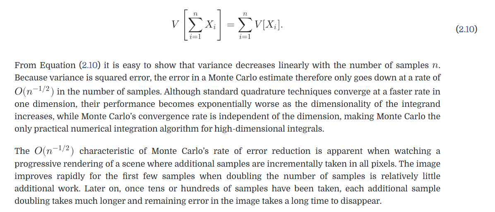

使用方差线性递减这一特性，使用方差与运行实践来评估一个蒙特卡洛，方差和运行时间越小越好

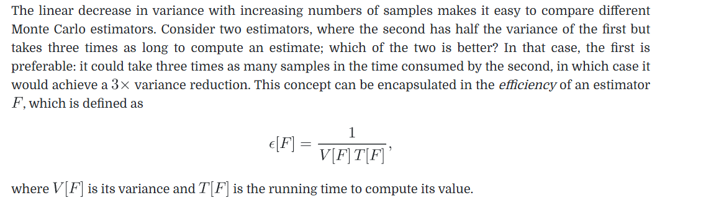

并非所有积分估计量的期望值都等于积分本身。这类估计量被称为有偏估计量

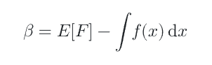

> 虽然有偏，但随着样本数 N→∞N \to \inftyN→∞，误差会趋近 0，这类估计器称为一致（consistent）估计器
>
> **在积分估计中，有偏估计器虽然期望值不等于真实值，但可能方差更小、收敛更快，而且一致估计器随着样本数增加仍能得到正确结果；在 Monte Carlo 渲染中，绝大多数估计器是无偏的，光子映射是一个例外**。

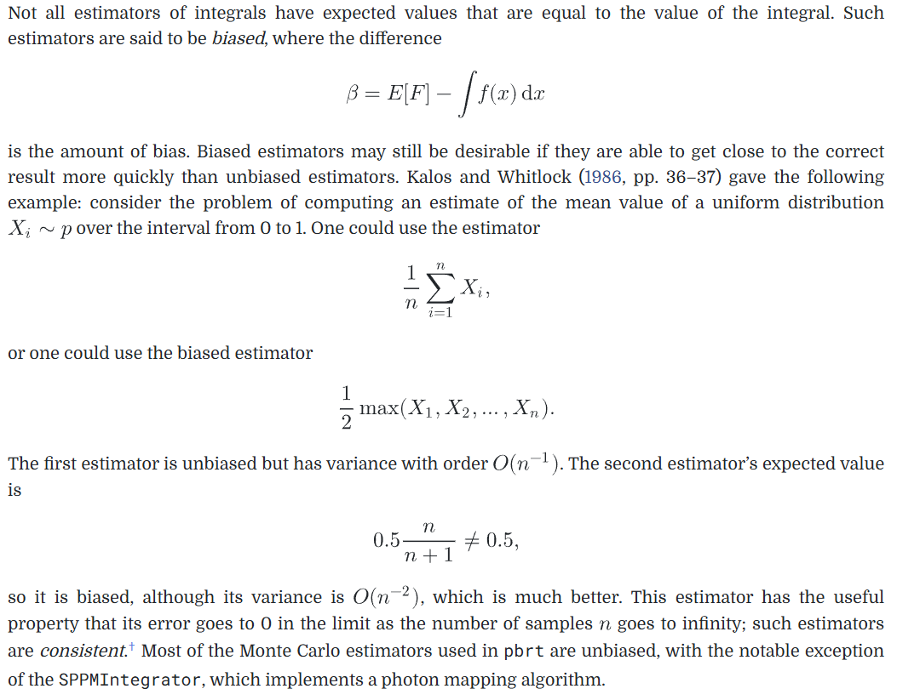

MSE（均方误差）：估计值与真实值之间的平方误差的期望（方差是估计值与估计值比较，均方误差是估计值与实际值比较）

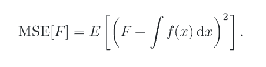

对于无偏估计，那MSE就等于方差，否则即为方差与估计量偏差平方之和。

> 最后这点东西介绍，需要明白 蒙特卡洛积分本身也是一个随机变量（因为他通过采样多个独立的随机变量来进行的），所以可以求蒙特卡洛的方差和均方误差，求法就是用样本进行估计，下边两幅图就是如何通过样本估计蒙特卡洛的方差和均方误差

这里提到的应该就是用样本估计随机变量的方差（也就是如何量化一个蒙特卡洛积分的方差）

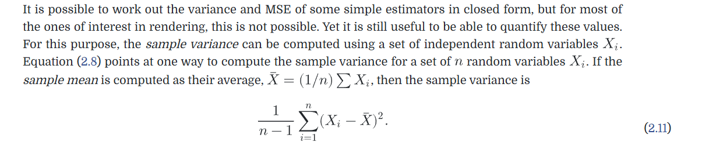

利用样本估计的方差，是实际方差的估计值，所以本身也有方差

另外提到了MSE如何估计

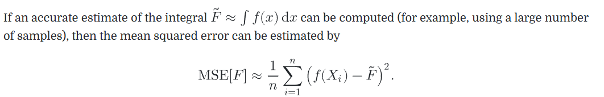

## Improving Efficiency 提升效率

### Stratified Sampling 分层采样

> 简单理解就是把积分域划分为多个区域，每个区域按照自己的PDF去进行蒙特卡洛积分
>
> 把随机采样改成了在每个子区域随机采样，

下图i代表第i个积分区域，j代表第j个样本

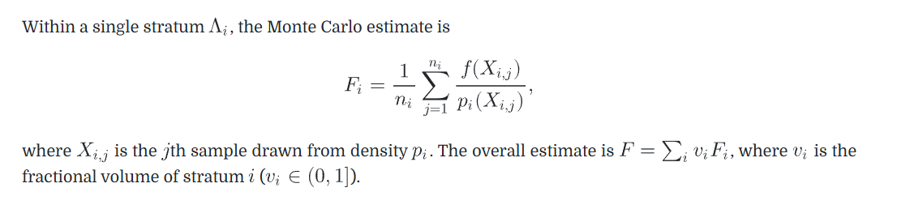

随机采样结果

分层采样结果，对比能看出噪声更小了

分层采样的缺点与维度有关，维度太多分层也变得复杂

### Importance Sampling 重要性采样

> 重要性抽样是一种强大的方差缩减技术，其原理基于蒙特卡洛估计量的特性
>
> 原理：若样本取自与被积函数函数形式相似的分布，则收敛速度更快。

如果被积函数是上图，PDF用下图，那最终得到的蒙特卡洛的方差要比随机采样好很多

PDF中间高，说明在这些点采样的概率高，在采样时也就更逼近真实的数据，很好理解的效果好

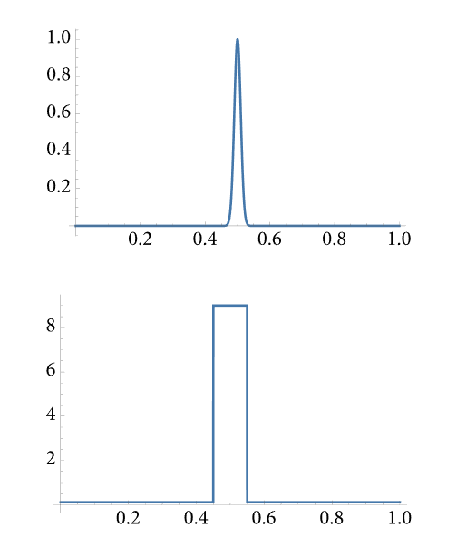

### Multiple Importance Sampling 多重重要性采样

> 在面对被积函数是多个函数相乘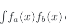（比如渲染方程就是BRDF Li cos 三项)的情况下的优化方案

首先举个例子，假如有两个PDF，刚好对应两个f(x)，如果我们使用PDFa作为采样的PDF时，最终样本都会只剩下fb(x)，因为PDFa与fa(x)更好成比例

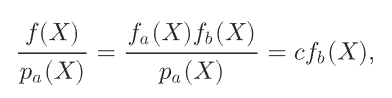

此时蒙特卡洛积分的方差完全由fb(x)的方差决定，但他的方差可能是很高的，另外这是不可控的，因为被积函数是不能变动的。所以单纯依赖被积函数某一项的形状设计PDF，是不可靠的

MIS就是用来解决这个问题的

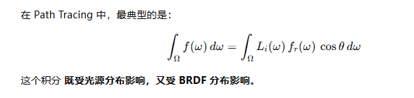

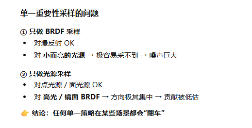

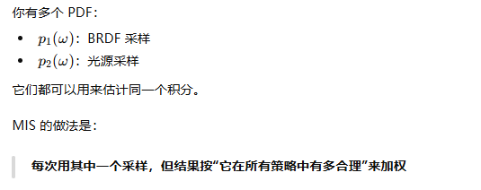

MIS的采样方案是

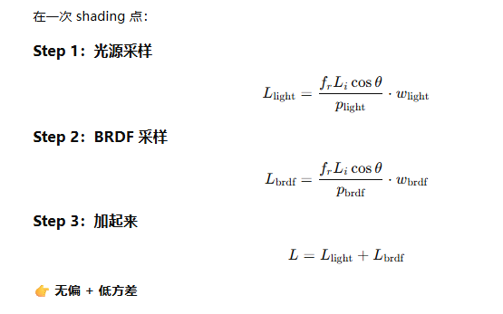

也就是用光源相关的PDF采样一次，用BRDF相关的PDF采样一次，并乘以各自的权重。

总结成公式就是

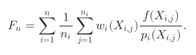

那权重如何计算呢（**MIS 的权重来自一个要求：在保持无偏的前提下，让方差尽可能小。**）**PBRT 默认使用的是 Balance Heuristic**。

抛开每种PDF生成的样本数量不谈，权重就是 PDF/所有PDF

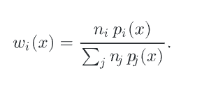

更进一步，乘个幂次

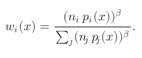

紧接着提到单样本模型（Single-Sample MIS），其实就是上边的n都=1，就是每个PDF都只采样一次，方差就很低了

### MIS Compensation 多重重要性采样补偿

> 比如一个渲染场景，光源项PDF与BRDF的PDF两个PDF进行多重重要性采样
>
> 这个东西必须学习完MIS并且实践后才能感悟他在干什么，这里先简单理解一下

此时的蒙特卡洛估计的MIS

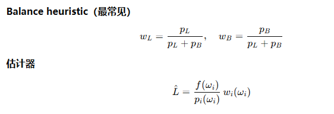

BRDF在高光方向大量采样，但是这里的光源=0，最终采样样本=0

光源方向采样也因为权重被削弱

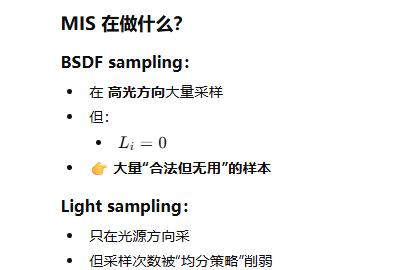

MIS虽然考虑到了不同的PDF的配合，但是如果一个PDF大量覆盖了积分接近0的区域，方差并不是最优

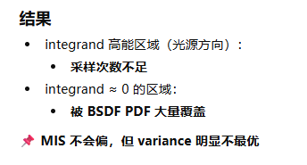

> **BSDF PDF 在“根本没有光”的方向仍然给了概率**，总之就是在MIS的情况下，仍然会让积分区域接近0的位置分布大量的采样

一种MIS补偿方案是锐化概率分布，就是说在概率很小的地方，直接让他概率为0，不进行采样

- **低于阈值的概率 → 直接砍掉**
- **剩下的概率 → 重新归一化**
- 结果：PDF 更“尖锐”（sharpened）

###  Russian Roulette 

> 跳过贡献度较小的样本，提升蒙特卡洛性能，同时保证无偏

C通常是0，q是一个[0-1]均匀分布的随机变量，有1-q的概率继续计算，有q的概率停止

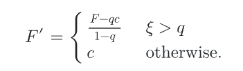

可以看出来这样做并没有改变蒙特卡洛积分的无偏性

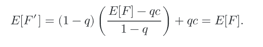

### Splitting

> 同样需要结合具体场景来学习，这里先简单过一下

对于一个二重积分

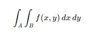

每次采样都需要重新计算x样本和y样本

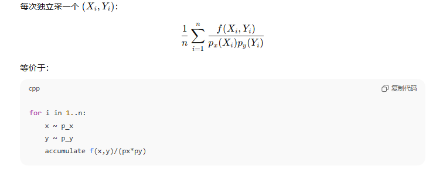

每次都要重新采 `x`

如果 `x` 很贵（比如一次主光线 / 路径前缀）

 Splitting：核心思想

> **x 很贵，y 很便宜，那就：**
>
> - 先采一次 x
> - 对这个 x，多采几个 y

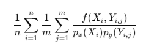

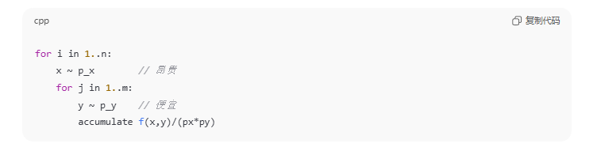

## Sampling Using the Inversion Method 逆变换法采样

> 已知PDF情况下，解决如何按照这个PDF进行采样的方法：反演变换法     从CDF来进行采样
>
> 一句话解释思路就是：1. 根据$\xi$ 得到一个[0-1]直接的随机数，然后让 CDF函数 = 这个值，反向求出X

CDF图像的斜率就是PDF值，斜率越大，说明这个采样点的概率越大，同时斜率越大的区域在Y坐标被均匀采样的概率越大，总结结果就是用一个均匀分布采样结果为 PDF越大的区域越容易被采样

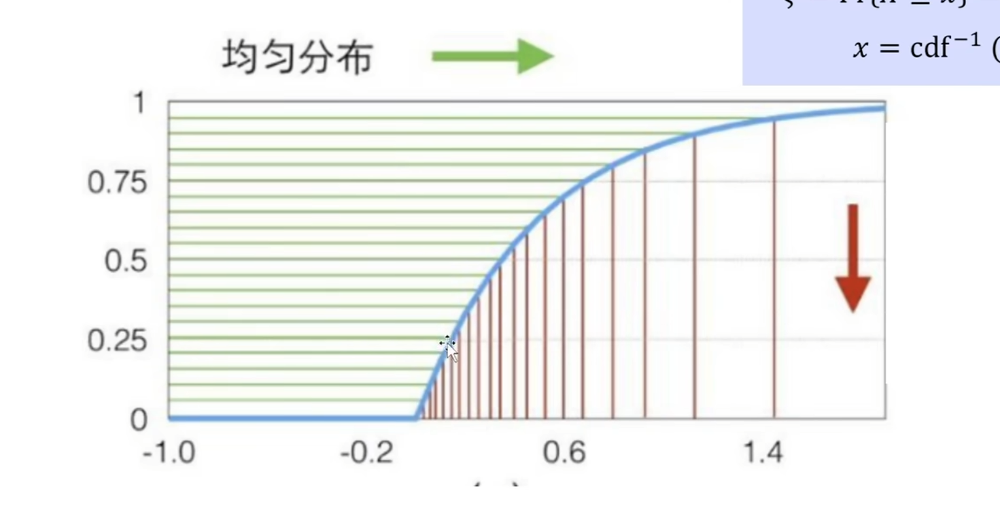

### 离散情况

> 利用均匀采样配合权重来按照权重进行采样，最终结果是按照权重来提高概率，算法本质是均匀采样

需要前边的公式，$\xi$ 是[0-1]之间均匀分布的随机变量，  X是离散的随机变量，这个公式展示了如何从$\xi$去随机选择哪个X作为样本。 也就是说用均匀分布的随机变量来采样X

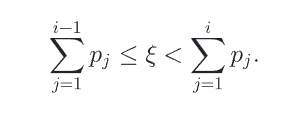

这一操作在CDF图像上就是$\xi$ 取值作为Y轴位置，向右看对齐到哪一列就去Xi

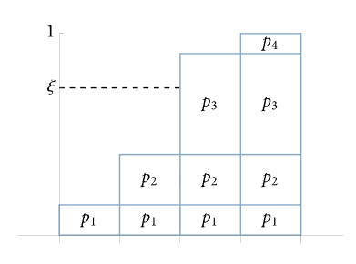

这个东西的作用是在一个权重数组中，通过均匀分布来选择其中一个   **最终结果不是均匀采样的，而是按照权重大小来进行的， 但是过程本质利用的是均匀采样**

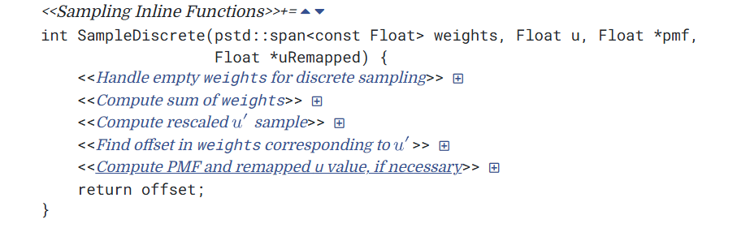

这个代码最终返回一个权重索引，满足

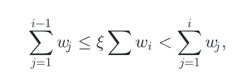

### 连续情况

> 利用PDF对应的CDF来进行

​	从PDF采样的步骤：

1. 计算CDF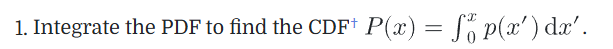

2. 还是利用均匀分布产生的随机数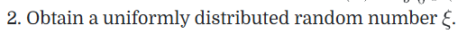
3. 构建等式$\xi$  = CDF(X)，反过来就算出来X是什么了 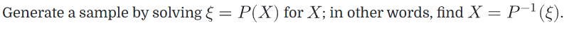

## Transforming between Distributions

> 把上一章讲的逆变换法推演到任意情况，随机变量X的信息都知道，现在利用X对随机变量Y=f(X）进行抽样的方法
>
> 感觉目前不会遇到这样的问题，先跳过，不然学了也是忘
