+++date = '2025-12-25T14:10:44+08:00'
draft = false
title = 'PBRT（Reflection Models）'
image = 'image-20260102161357849.png'
categories = ["学习笔记/PBRT"]
+++

> 未完结
>
> 因为直接看了第7章，第4章还没看，需要先回去看一下4.3.1的BRDF、BTDF、BSSRDF

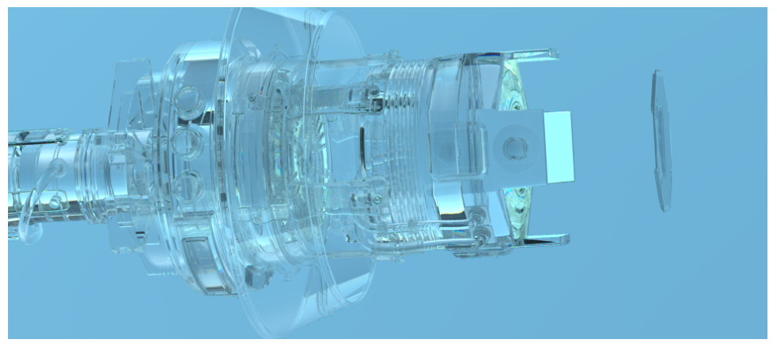

# BXDF框架

## BSDF

### BRDF

> 很熟悉了，只定义了反射如何进行

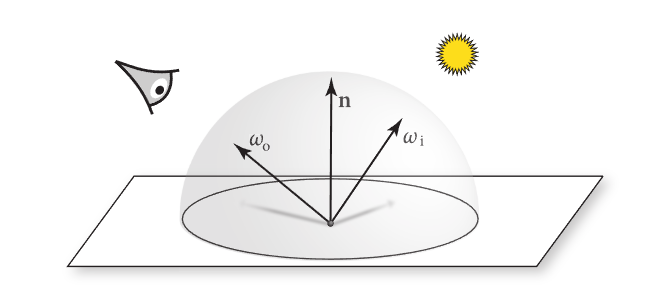

#### Hemispherical–Directional Reflectance（半球–方向反射率）

> 从BRDF延申出的一个概念，把光照设置为常量1，这时候的渲染方程就变成了这个东西
>
> 它的意义是不关心光照，不关心各个方向的Radiance（均匀分布的光照），只关心材质本身往W0方向的Radiance

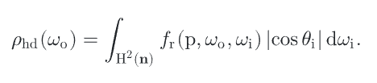

它可以用来检查物理守恒，物理正确的材质必须满足：

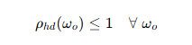

#### hemispherical–hemispherical reflectance（半球–半球反射率）

> 描述了一个面在所有入射方向上平均收到光照后，向所有方向反射的平均能量比例

这不就是把上一个半球–方向反射率求了一个半球积分后的平均么

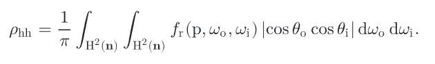

上述两个东西，感觉是用在表达材质的反射效果的一个指标，并不是渲染需要的东西，写论文用的东西？

### BTDF

> T 表示*transmittance* ，BTDF用于描述透射的分布
>
> 这里特别提到BTDF并没有reciprocity 的特性，就是不能反着来

BTDF和BRDF被统称为BSDF，因为他们都可以表达为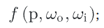

最终BSDF作用到渲染中为（注意这里绝对值符号是PBRT自己加的，他们意思是并不会修改模型的法线朝向模型外侧，可能有他们的考虑）

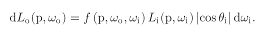

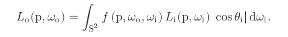

整了半天4.3.1 原来并没有介绍具体的BSDF模型，只是引入了概念

## BSSRDF

今天属于是理清楚了 scattering是各种各样的改变光方向的行为的统称，并不是额外的效果。。。

折射是透射的一种，透射是更上层的概念，透射就是进入某种介质的行为。。。

> ***bidirectional scattering surface reflectance distribution function* (BSSRDF)** 描述的是此表面反射的理论框架

参数多了一个Pi，也就是Pi对着色点P0的贡献比例，比BSDF多一个维度，BSDF只考虑当前着色点

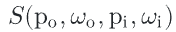

看这张图能看出光先进入物体内部，不断散射后从着色点穿出后到达摄像机

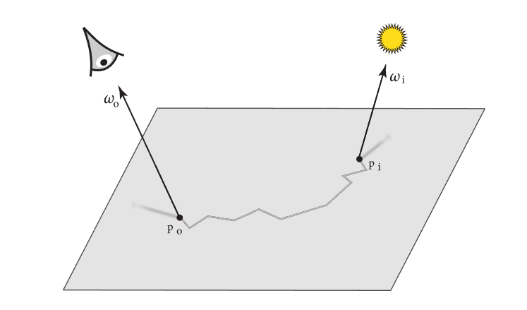

计算过程需要遍历每一个Pi，BSSDF定义这个Pi点的贡献值

内层积分定义一个Pi点的渲染贡献，外层积分累积所有Pi点

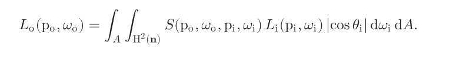

# 

下图展示了(a) 漫反射 (b)高光反射 (c) 镜面反射（接近）（d）逆反射的Lobe

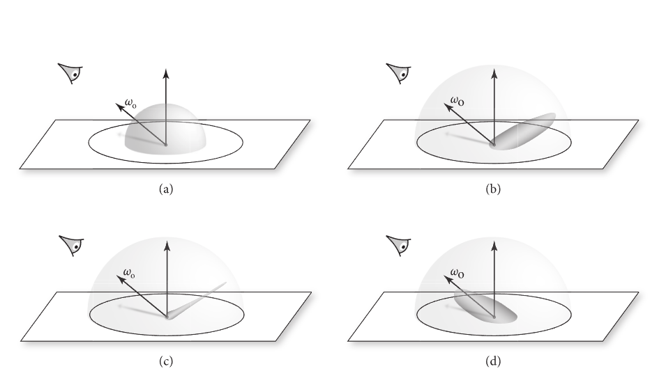

另外也理解了各项同性和异性，  同性就是指如上图的摄像机位置，如果绕着法线进行旋转，得到的结果应该是一致的

# 基础理论

> 为可见光的波长（量级为米级）远小于渲染场景中物体的尺寸（毫米到米级），因此波动相关的现象通常不会在渲染图像中体现.
>
> 但要深入理解光线撞击表面时的行为，就需要借助**波动光学**的理论，而且在几何光学的模拟框架中融入波动光学的结论，已经成为计算机图形学的常用设计模式。

> 当光线照射到物体表面时，会激发材料原子外层的电子，使其发生快速振荡；振荡的电荷会产生次级电场振荡，这些次级振荡会发生**相长干涉和相消干涉**，这就是原子反射光线的核心机制。而干涉的具体表现，则由原子的种类和原子间的结合方式决定。

## 材料种类

### 电介质（Dielectrics）

这是一大类**电绝缘体**，包括玻璃、水、矿物油、空气等气态、液态、固态物质。这类材料中，电子与原子的结合非常牢固，不会自由移动。

### 导体（Conductors）

包括金属、合金以及类金属（如石墨）。这类材料的原子晶格中存在**自由电子**，入射电磁波激发的电子振荡可以让电子在较大范围内移动；同时，电子在晶格中移动时会以热量的形式耗散部分入射能量，导致光线在深入材料的过程中被快速吸收。

关键特性：光线通常在材料表面**0.1 米的深度内被完全吸收**，只有极薄的金属薄膜才能透射可观的光线。

### 半导体（Semiconductors）

如硅、锗，兼具电介质和导体的特性。例如硅在可见光波段表现出金属的特性，但在红外波段是透明的，因此可用于红外相机的光学元件。

> PBRT后面介绍了IOR（折射率）的原理就是光速与在真空中的光速的比值，两种介质的折射率差值越大，分界面的反射效果越强。

## 反射定律

这张图解释了反射是如何计算的，分解成平行于法线和垂直于法线的两个向量后很容易计算

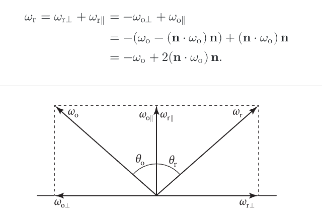

## 折射定律

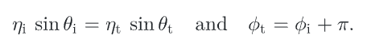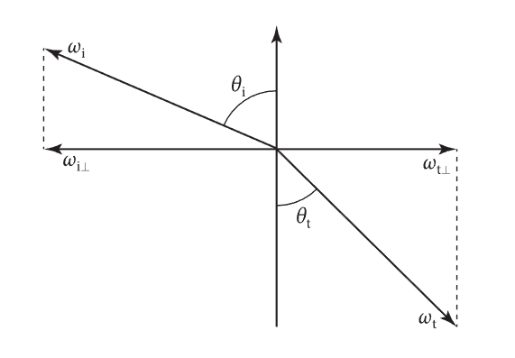

经过一些推导最终折射的向量可以通过下面这个公式计算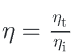

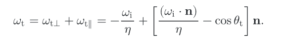

折射需要有一个注意的地方：从折射率高进入折射率低（从水中看向空气）时，入射角度过大会导致折射算出来sin大于1了，此时发生的是全内反射，没有折射了

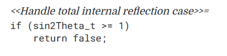

## 菲涅耳方程

> 上述的折射和反射是会同时发生的，对于导体来说，折射会迅速消失。
>
> 菲涅耳方程用来计算反射光的比例

这块东西解释了入射波可以分解为垂直（垂直于入射向量和法线组成的平面）和平行两个，单独进行建模。菲涅尔方程描述了给定已知振幅的入射波时，反射波振幅与入射波振幅之间的关系。（这些内容没必要特别细看）

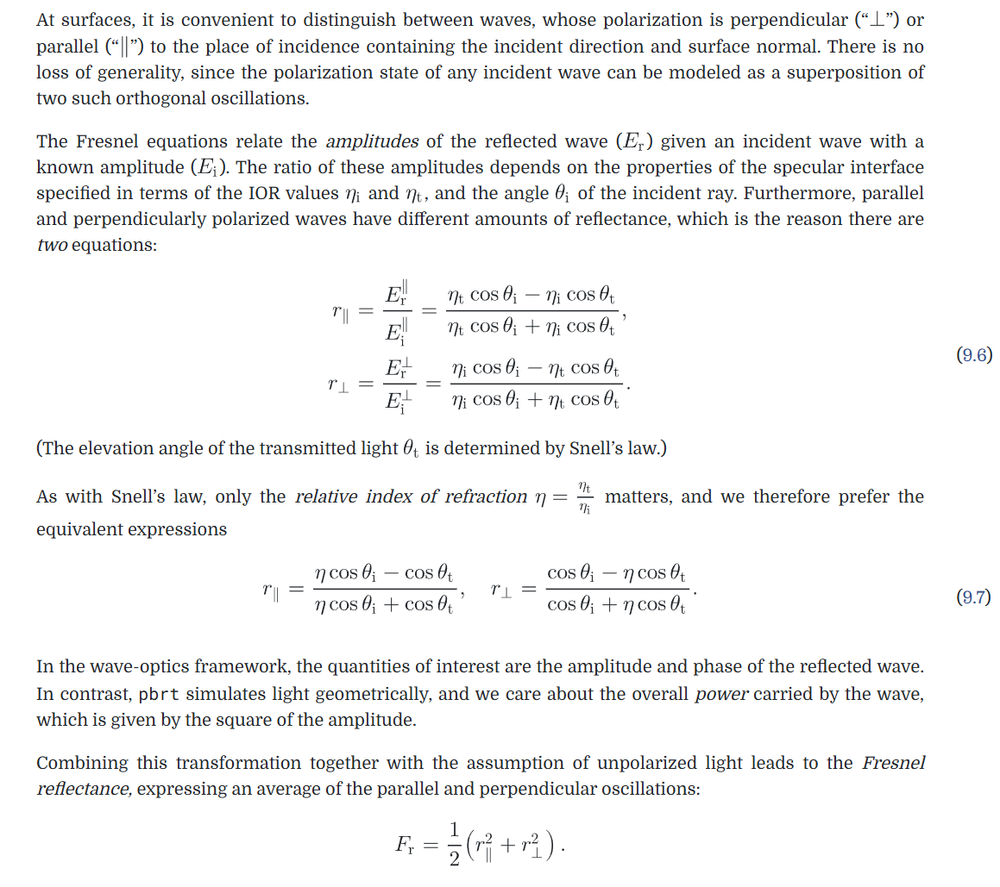

> 电介质、导体和半导体均遵循相同的菲涅尔方程。

对于电介质，就按照上边的公式计算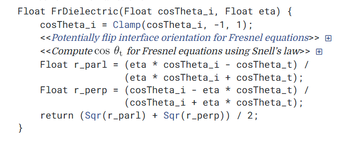

对于导体，折射率之比变成用复数表示，然后各种解释，不太理解，看这里最终eta是一个复数，而不是简单的float比值，这种东西就不细看了

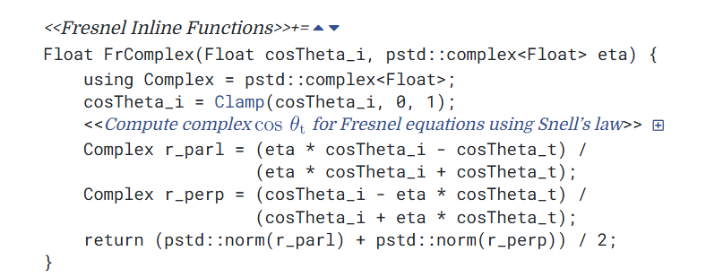

# 常见BXDF

## 完美模型

### Diffuse Reflection（完美漫反射）

> 介绍了最简单的Lambertian model，完全均匀反射率的漫反射表面使用的模型

下图解释了为什么要除以/Pi。 因为这样才能保证使总反射能量=R（反射率，用RGB就是albedo）

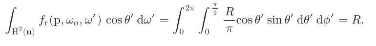

### Conductor BRDF（完美反射）

> 导体的BRDF依据两个观点：
>
> 1. 镜面反射定律为每条光线分配特定的反射方向，菲涅耳方程则确定反射光的分布范围。
> 2. 任何残余光线都会折射进入导体，并被迅速吸收转化为热能
>
> 所以光滑导体只考虑BRDF、采样只会采样反射方向、PDF=1

非常简单，对W0有贡献的点只有反射方向，所以不需要算积分了，F()是菲涅尔方程

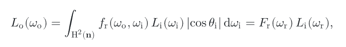

计算积分时的采样函数不需要什么工具，而是直接找反射方向，然后用菲涅尔公式计算反射比值，返回对这个方向的采样结果，另外PDF直接取1即可

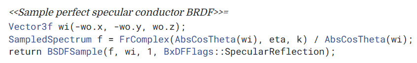

### Dielectric BSDF（完美反射+完美折射）

> 不像导体，这里就必须考虑反射和折射了
>
> 设置采样方向的方法是根据入射光角度，计算菲涅耳方程的反射比例，然后去一个随机数来概率选择BRDF还是BTDF

1. 等比例选择BRDF和BTDF

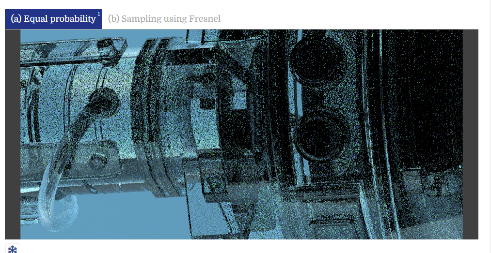

2. 根据反射比例来选择BRDF和BTDF，效果明显变好了，因为少了很多低贡献的采样

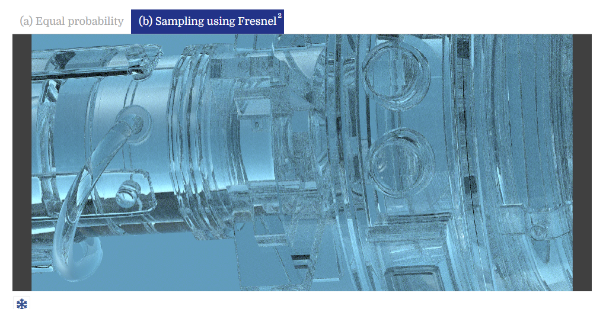

采样方式代码，会根据概率选择BRDF和BTDF

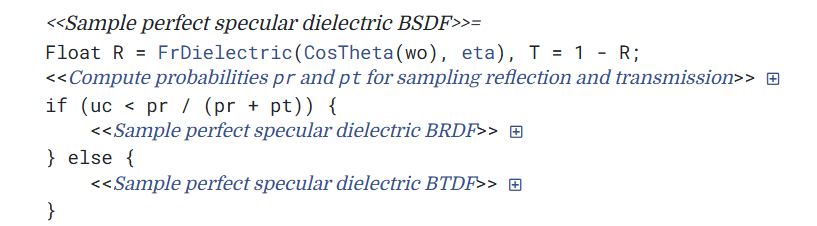

此时的PDF为

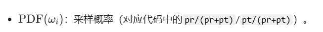

如果选择反射，和导体的采样方向一样

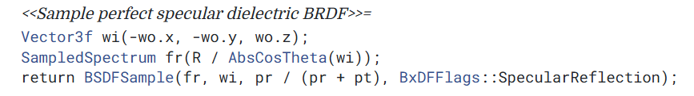

如果选择折射

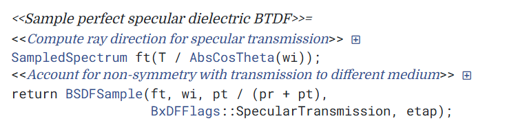

### Thin Dielectric BSDF（薄电介质，比如玻璃（跳过））

先理解薄电介质的物理背景（为什么需要单独建模）：

普通电介质（DielectricBxDF）只模拟 “单界面”（比如空气 - 玻璃），但实际的薄玻璃有**两个平行界面**（空气→玻璃→空气）：

1. 光线入射到第一层界面：一部分反射，一部分透射进入玻璃；
2. 透射光到达第二层界面：一部分透射出去，一部分反射回玻璃内部；
3. 反射回的光又会在第一层界面反射 / 透射…… 这个过程**无限递归**（如图 9.16）；
4. 薄电介质的核心假设：玻璃厚度极薄，光线的空间偏移可忽略，只需计算 “所有内部反射的总贡献”。

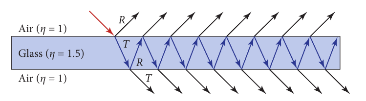

这个模型主要就是：多层内部反射的总反射率可以用**几何级数**求和简化（避免追踪无限次反射）

具体就先不看了！

### Non-Symmetric Scattering and Refraction（跳过）

> BTDF不能和BRDF一样反转使用，反转后必须修正系数才能保证物理正确。
>
> 这就不看了，看了一时半会也用不着

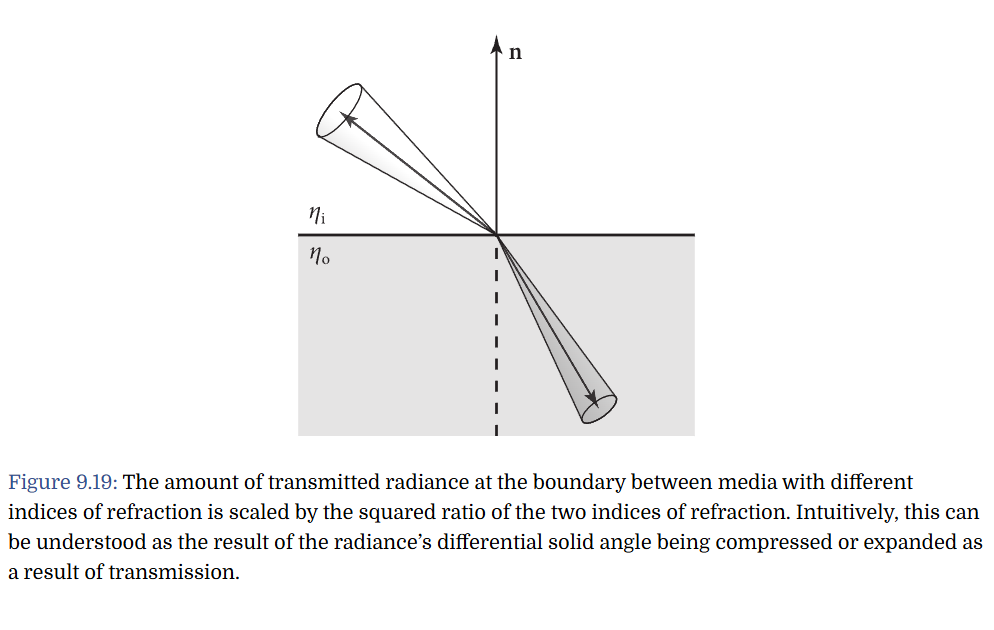

## 粗糙模型

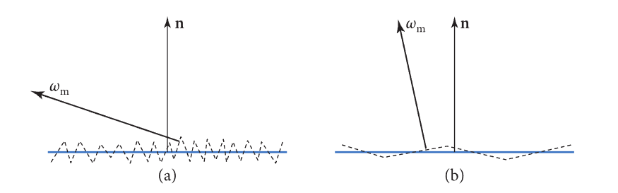

> 微平面理论的关键洞见在于：**无需对每个微平面进行显式几何建模，而是通过统计方法描述其集体行为**

微面反射模型需考虑的三个重要几何效应。

(a)遮蔽效应：目标微面因被其他微面遮挡而不可见。

(b)阴影效应：类似地，光线无法抵达该微面。

(c)反射间效应：光线在到达观察者前会在微面间发生多次反射。

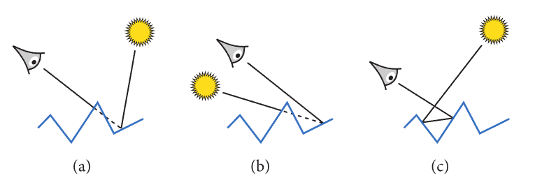

用法线分布来描述微表面，这里提到要让一小块微平面dA上方的面积投影下面积等于dA的面积

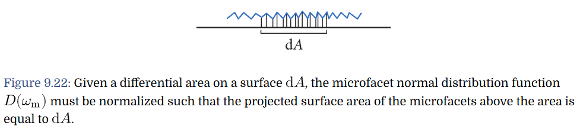

GGX法线分布

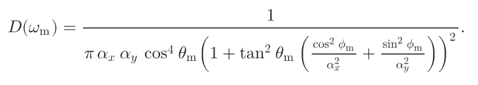

还有一种Beckmann法线分布

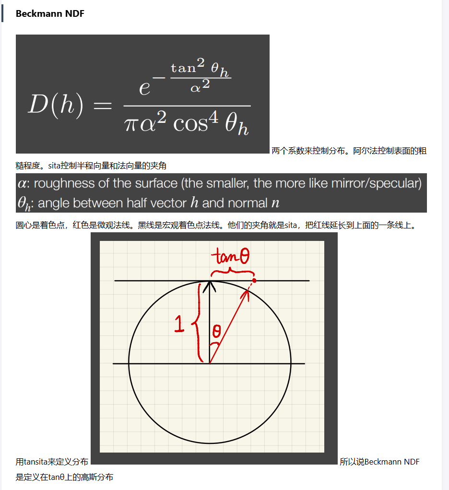

GGX的有点是拖尾，它的尾巴比较长，如下图橙色尾巴很长。而beckmannNDF在90°时已经衰减为非常接近0。如果把高出定义为高光，那backmannNDF高光周围会迅速衰减。而GGX会缓慢衰减，形成光晕的效果

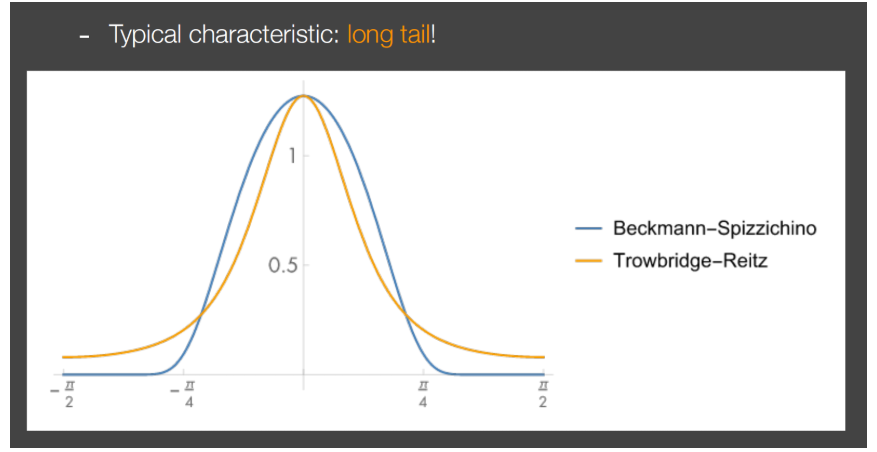

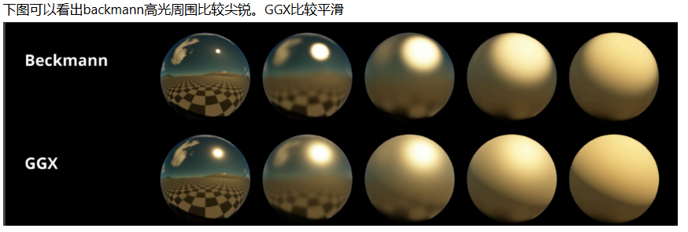

> 后面介绍的过于理论了，感觉对目前帮助不大，先能进入行业再说，否则也没什么意义
