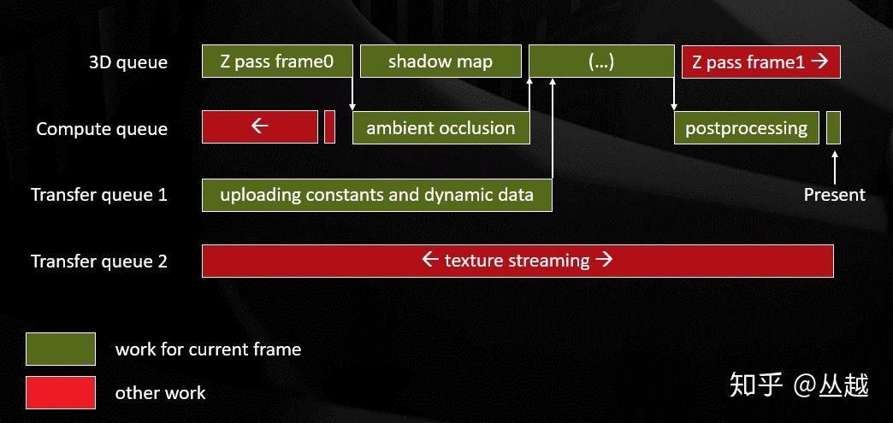
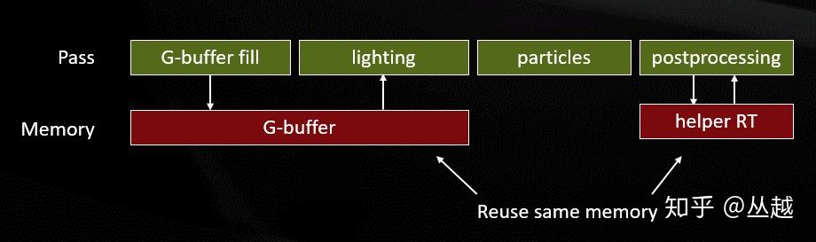
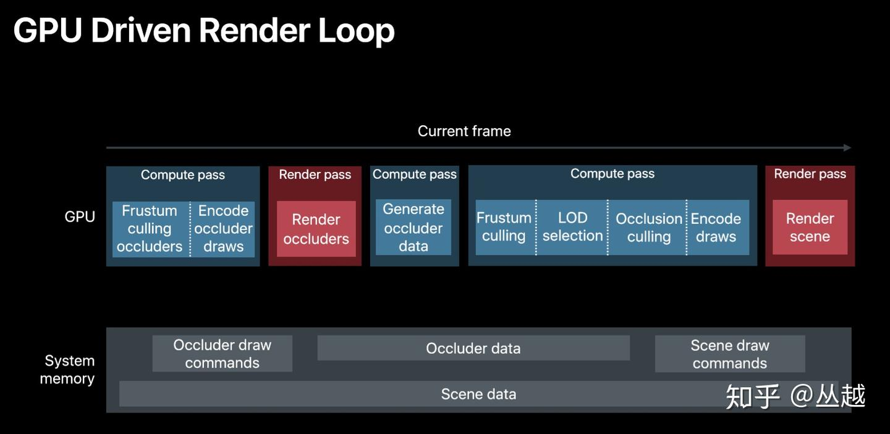
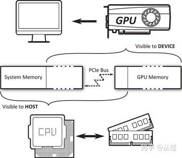
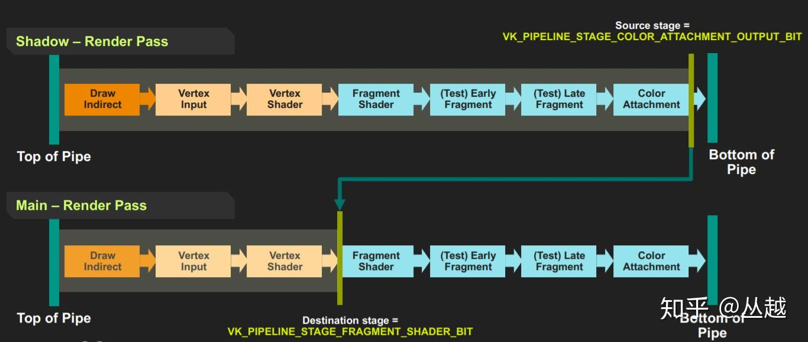
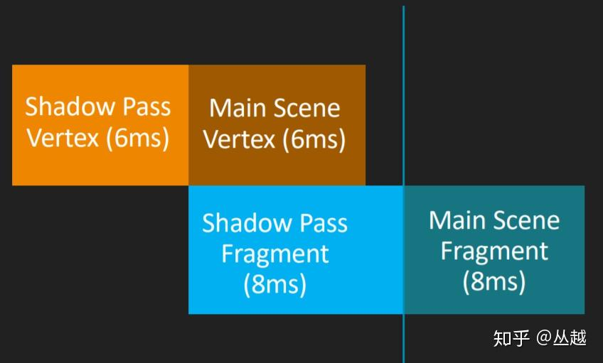
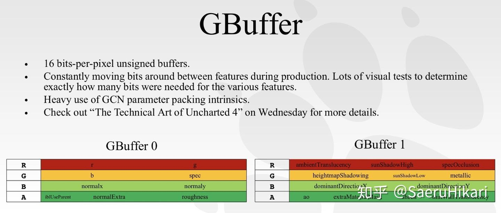
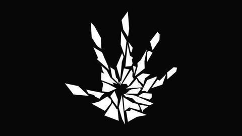
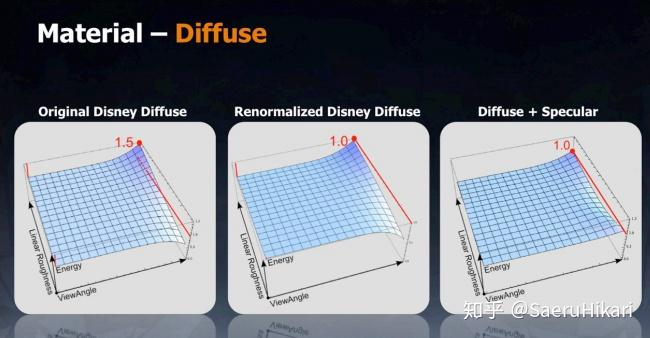
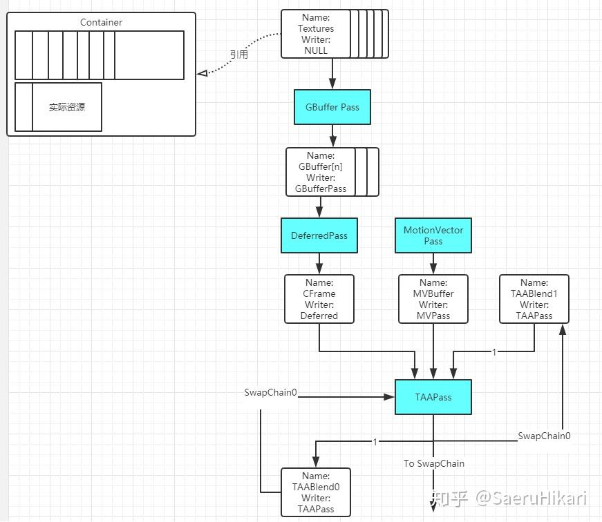

+++
date = '2025-11-11T13:43:46+08:00'
draft = false
title = '博客日记（记录看大佬博客的一些思考）'
tags = ["随笔"]

+++

# 2025.11.21 [丛越](https://www.zhihu.com/people/li-xiang-da-sheng)

https://zhuanlan.zhihu.com/p/73016473

> 看了人家的管线设计才发现自己费那么多劲琢磨架构是多么的无知，当前阶段还是多输入少输出吧

> 原来Buffer还能这么复用（在不同时段通过别名资源重用内存）

> GPU驱动管线（下一步学习计划！）

## Vulkan的内存模型

> Vulkan 的内存分为 Host 和 Device 两大类，下图可以看到哪些是Device可见的，哪些是Host可见的

## **并行 Command**

尽管从 API 层面来看 Command 是依次录制的，但 GPU 在执行时是将 Queue 中的指令同时分发给 GPU 多核中的 Pipeline 执行，这就是 GPU 的并行计算机制。而这种并行，是不会保证执行的顺序，所以对于提交到 GPU 执行的 Command，需要了解以下几个事实：

- Command 在 Command Buffer 中顺序并不代表在 GPU 内部执行的顺序。
- 提交到同一 Command Queue 中不同 Command Buffer 的顺序并不代表在 GPU 内部执行的顺序。
- 不同 Command Queue 的提交顺序不代表在 GPU 内部执行的顺序。

## Pipeline Barrier

> TODO： https://zhuanlan.zhihu.com/p/100162469

下面图片的每个块表示一个Pipeline Stage

# 2025.11.11 [SaeruHikari](https://www.zhihu.com/people/SaeruHikari)

## GBuffer压缩

> Gbuffer是可以压缩的(https://zhuanlan.zhihu.com/p/95824400)。

> GBuffer会带来显卡的带宽压力, 所以现在的游戏一般会把GBuffer压缩到2~3张。比如把法线压缩到2通道并在使用时进行Decode, 或者不保存PosW到GBuffer, 而是在使用时使用深度重建。可以参照顽皮狗在Sig16分享的方案:

## 不同的BRDF方案

> 可以学习并实践一下不同的BRDF方案，而不是就还是Lambert + Cook-Torrance

Diffuse

首先看漫反射部分, 目前比较流行的公式有这些可选:

- Lambert
- Burley(Disney)[sig2012]
- Renormalized Disney Diffuse[sig2014]
- PBR diffuse for GGX_Smith[GDC 2017]
- MultiScattering Diffuse BRDF[sig2018]

在五个模型都尝试一遍过后选择了RenormalizedDisneyDiffuse。

这里特别要提一句的是MultiScattering版本的diffuse BRDF, 在今年的sig也有对它实现的补充以及改进分享。但是实测之后发现效果并不好, 因为多散射对diffuse的影响实在太小, 这个模型并不能带来太多可见的改善。

而Frostbite在14年sig[[3\]](https://zhuanlan.zhihu.com/p/95824400#ref_3)提出的Renormalized Disney Diffuse是带来观感改善较大的一个:

[Moving Frostbite To PBRwww.ea.com/frostbite/news/moving-frostbite-to-pb](https://link.zhihu.com/?target=https%3A//www.ea.com/frostbite/news/moving-frostbite-to-pb)

它主要对Burley模型进行了改进, 根据视角入射角对Diffuse进行补正来维持能量守恒, 在视角移动时产生的视觉效果更加细腻(当然光源太复杂就没那么明显了...)。

Specular

接下来来到BRDF里最重要, 组装起来也最好玩的Specular BRDF项:

 (Cook-Torrance)

- **D(h):** 法线分布函数, 描述微面元法线分布的概率, 具有正确朝向，能够将来自l的光反射到v的表面点的相对于表面面积的浓度。
- **F(l,h) :** 菲涅尔方程, 描述不同的表面角下表面所反射的光线所占的比率。
- **G(l,v,h) :** 几何函数/几何遮蔽，描述微平面自成阴影的属性，即m = h的未被遮蔽的表面点的百分比。
- **分母 4(n·l)(n·v）：**校正因子，作为微观几何的局部空间和整个宏观表面的局部空间之间变换的微平面量的校正。

这里不再细致解释, 列出常用的模型, 这些模型在UE4几乎都有实现, 可以到BRDF.ush去参考(抄):

**Specular D:**

- **Blinn-Phong[1977]**
- **GGX/GTR[2007/2012] (GGX(GTR2)作为GTR的特例)**
- **以及各种各向异性版本...**

**SpecularF**

- **Cook-Torrance[1982]**
- **Schlick[1994] (一般选用这个, 便宜且曲线非常贴紧参考值)**

**SpecularG**

- **Cook-Torrance[1982]**
- **Smith[1967] (被拓展为l, v的联合遮蔽函数, 具有多种变体)**

## TAA

> 一直没管过引擎的走样问题。。。待学习完善

## RGD

> https://zhuanlan.zhihu.com/p/97022384 这里有RGD的实现思路，学习RGD可以参考

## 反射

> https://link.zhihu.com/?target=https%3A//github.com/rttrorg/rttr ， [SaeruHikari](https://www.zhihu.com/people/SaeruHikari)用的这个反射

## 多线程渲染?

> 博客提到的多线程是指多个queue，和我现在实现不一样啊

# 2025.11.12

## 匿名资源、临时资源

> 这个东西我的项目有进行规整，所有资源都做了保存    （应该：无名未注册的资源会被保持在一个池内, 并由系统进行自动化的复用。）

## RDG

蓝色表示PassNode, 白色圆角表示ResourceNode, 实际资源存储在Container中。

纹理、Buffer、Pass创建都是走的RDG

> RDG需要处理多帧资源比如TAA
