+++date = '2025-11-11T13:43:46+08:00'
draft = false
title = '博客日记（记录看大佬博客的一些思考）'
tags = ["浏览笔记"]
categories = ["学习笔记/其他"]
+++

# API差异图

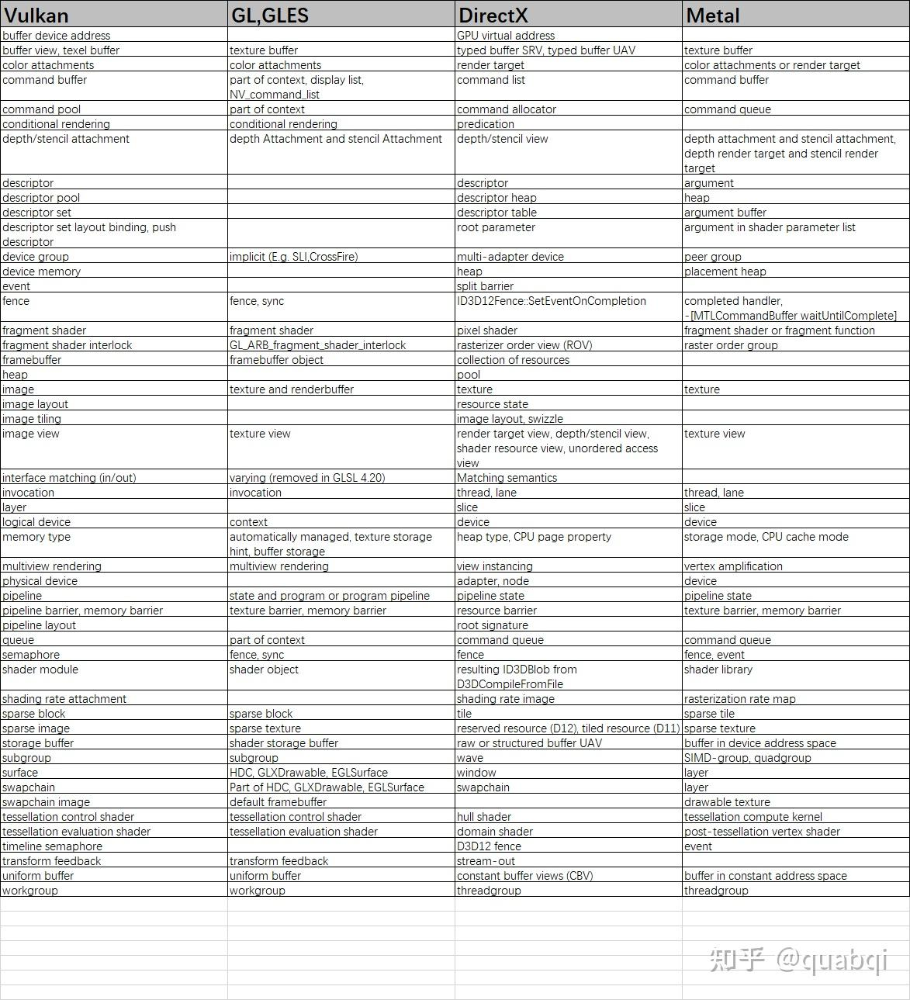

# 2025.12.16 

> https://zhuanlan.zhihu.com/p/582237962 全局光照浅析

1. 现实中的反射大部分情况下并不是mirror reflections也不是diffuse reflections，而是介于两者之间，这种反射叫做**glossy reflections**，对应的材质也叫做**glossy** 。   这下把这些名词都对应上了~

> **Caustics**焦散在图形学中的定义是指光线经过高光物体的反射或折射，然后弹射到漫反射表面，再弹射到眼睛的效果，如上图中书下面阴影中高亮的部分。Caustics很难实现，即便在离线渲染中使用**path tracing**也很难实现，通常会借助**Photon Mapping**光子映射技术来实现Caustics。  **第一次接触这个词！**

下图可以看到在书下面的阴影中也有很亮的地方，叫做焦散

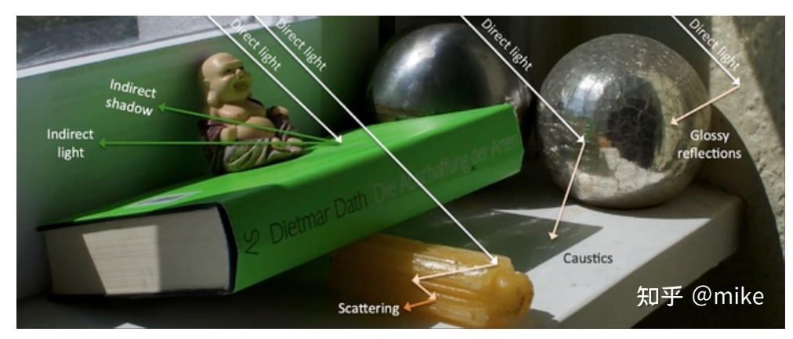

下面是几种离线渲染的全局光照方案

**Whitted-Style Ray Tracing**

- 从视点发射光线。
- 光线碰撞到物体表面，如果表面材质是diffuse材质则光线停止传播，否则沿着反射方向继续传播。
- 每个碰撞点都需要发射一条shadow ray做遮挡查询。
- shading point需要累加所有碰撞点的Irradiance，作为最终的光照结果。

> Whitted-Style Ray Tracing算法无法实现右边的glossy reflection效果，因为光线是按照镜面反射的方式传播的，真实世界大部分物体都不是mirror materail。

原来 Mirror和Glossy是要区分的。另外Games101讲的Whitted-Style Ray Tracing原来就是丐版的pathTracing，因为只进行镜面反射，所以没法实现glossy的反射

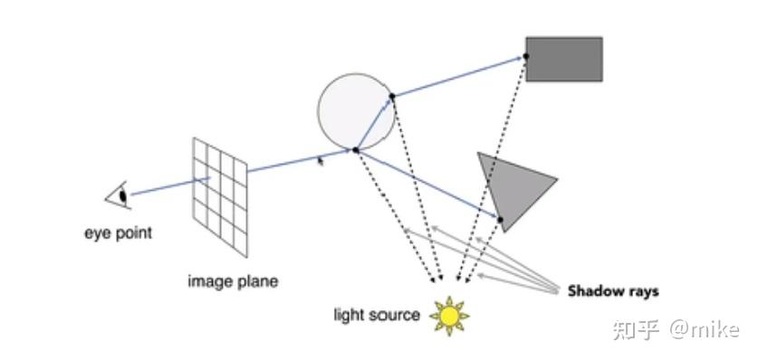

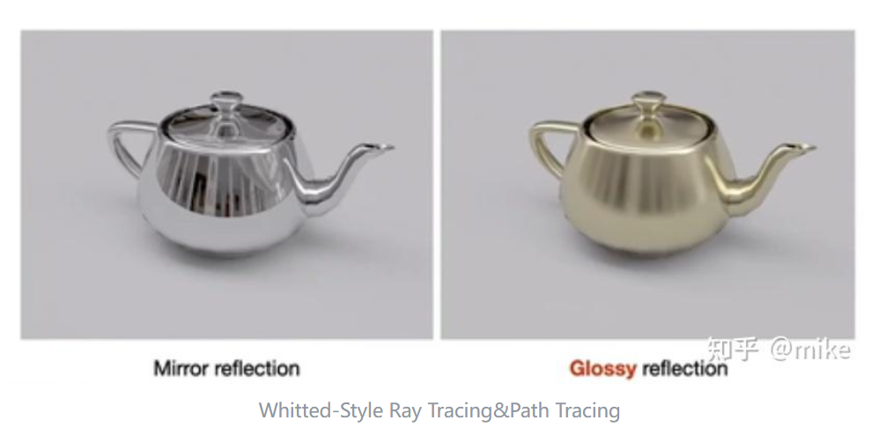

因为漫反射不递归，所以漫反射全局光照效果肯定是没有的

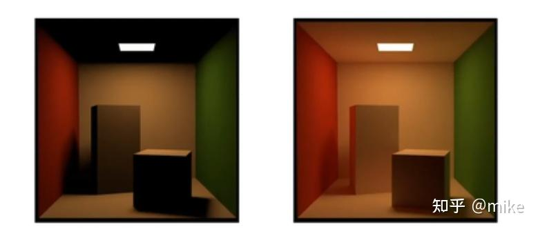

**Distributed Ray Tracing**

> 基本思路和Whitted-Style Ray Tracing一样，只是为了解决漫反射光线传播，在每一个碰撞点上的半球空间都会发射多条光线来模拟漫反射。

算法的缺点非常明显就是计算量爆炸，这个算法即便是离线渲染也是不能接受的，不过这个算法应该是最朴素也是效果最好的光线追踪算法，说不定以后硬件性能爆炸，这个算法也有回春的一天。

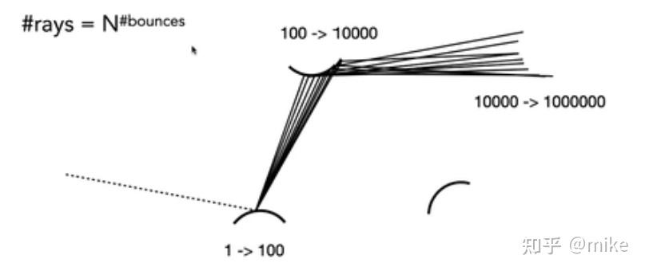

**Path Tracing**

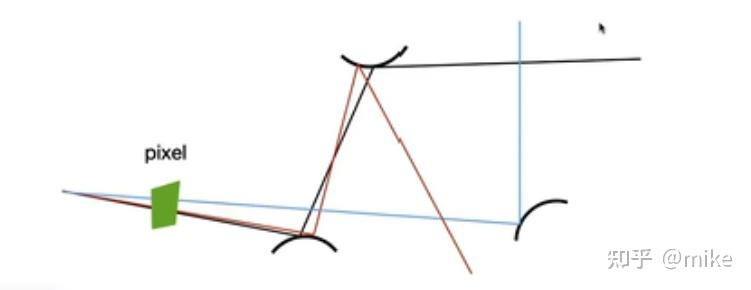

> 这个算法的最大问题是光线命中光源的概率很低，因此会有很多噪点。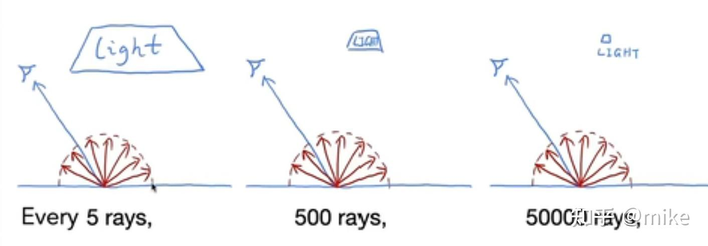

> 通过加大光源面积和投射光线的数量可以缓解这个问题。另外可以把每个碰撞点的光照分为直接光照和间接光照，直接光照从光源中进行采样以保证命中概率，并且直接光照会做shadow ray，而间接光照还是使用上面的算法，这样噪点仅存在于间接光照的部分

 **Bidirectional Path Tracing**

这里能看出PathTracing的缺点：如果场景主要是间接光照照亮的，那PathTracing效果就会很差

有的时候光源的环境很复杂，使用上面的Path Tracing依然会获得很低的光源命中率，如下图：

> 现实中这种情形，照亮场景的应该是间接光照，而间接光照的命中率又很低，所以上面的算法不太适用这种场景

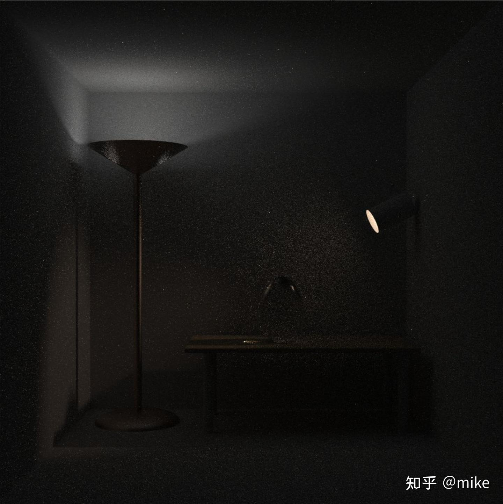

> 双向路径跟踪算法（Bidirectional Path Tracing，BDPT）在路径跟踪算法的基础之上，额外从光源出发创建光路，再连接从照相机追溯的光路和从光源出发的光路上的点，创建多条光路，并根据光线从这些光路传播的概率，合并各个光路传递的辐射亮度，即进行所谓的多重重要性抽样（multiple importance sampling），计算光线最后进入照相机生成图像的光照结果，如下图：

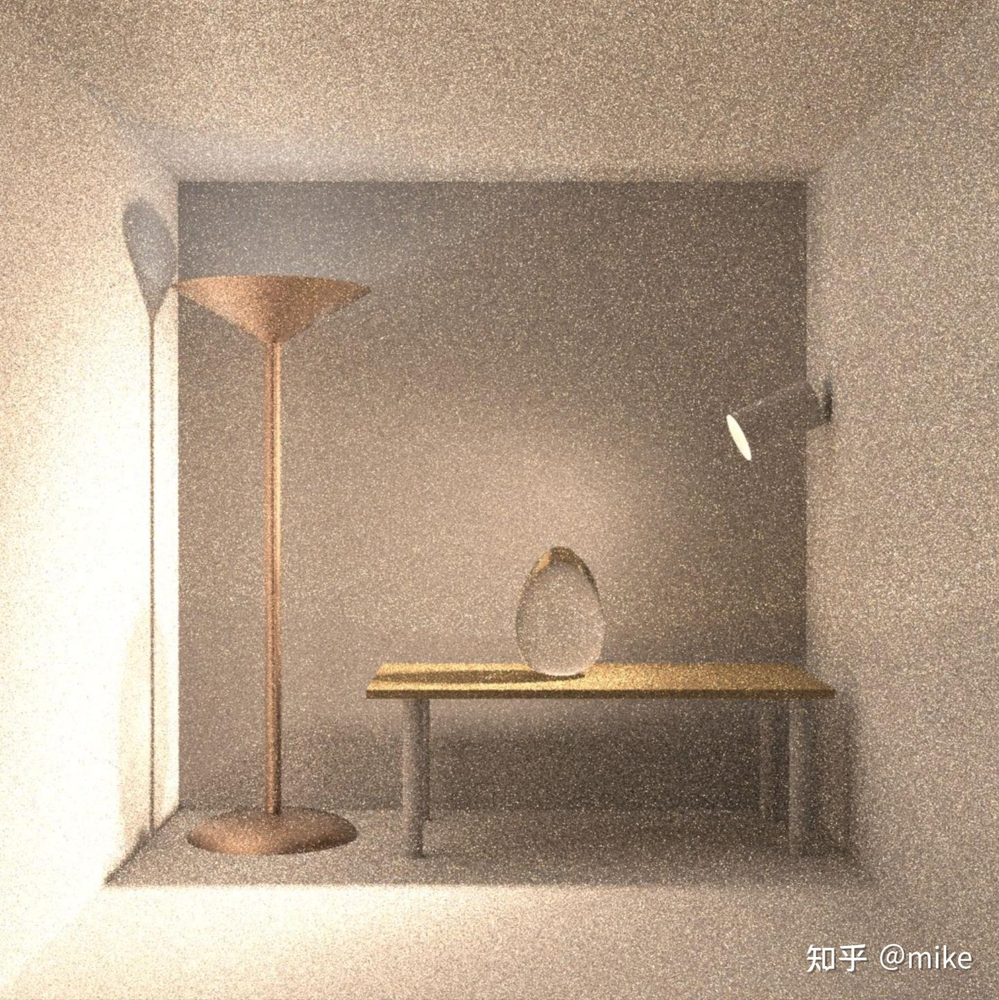

**光子映射**Photon Mapping

> [Path Tracing算法](https://zhida.zhihu.com/search?content_id=217520473&content_type=Article&match_order=1&q=Path+Tracing算法&zhida_source=entity)最大的问题就是光路命中光源的概率太低，即便是使用大量的SPP也会产生很多高频的噪点。另外在光线传播的过程中光路都是随机生成的，Caustics这种需要先弹射到镜面然后再弹射到漫反射物体的命中概率就更低了，因此Path Tracing很难模拟Caustics效果。

光子映射的基本算法分成两个Pass。

- Pass1-光源从随机方向发射光子，并在一切表面上弹射，如果弹射的表面是diffuse材质则记录光子信息包括光子的POS，光子的能量POWER，光子的入射方向Dir，可以把这些光子理解成为次级光源，使用俄罗斯轮盘算法结束光子的递归弹射，这样可以保证能量守恒。这些光子信息与视点无关，所以可以保存起来供后续pass使用，这也是空间换时间的算法。
- Pass2-从相机射出的光线，打到非diffuse材质表面进行反射或折射，打到diffuse材质表面则根据收集半径检索附近的光子进行间接光照计算。

下面是实时渲染的全局光照解决方案

**[Light Probe](https://zhida.zhihu.com/search?content_id=217520473&content_type=Article&match_order=1&q=Light+Probe&zhida_source=entity)(Irradiance Volume**)

> light probe就是在空间中摆放很多的probe，这些probe可以当成次级光源，在离线的时候将irradiance保存到probe中，通常使用球鞋函数来缓存光照信息。

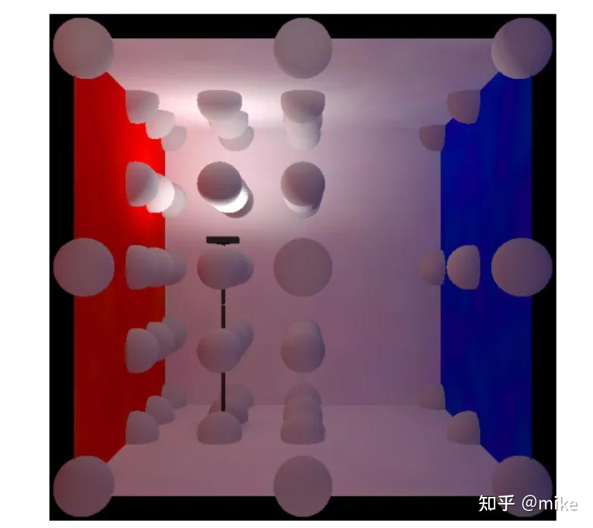

这样空间中的每个点都可以找到离它最近的四个probe，这四个probe可以构成一个四面体，然后计算四面体的重心位置，通过重心位置和坐标点进行差值来计算最终的光照信息，如下图：

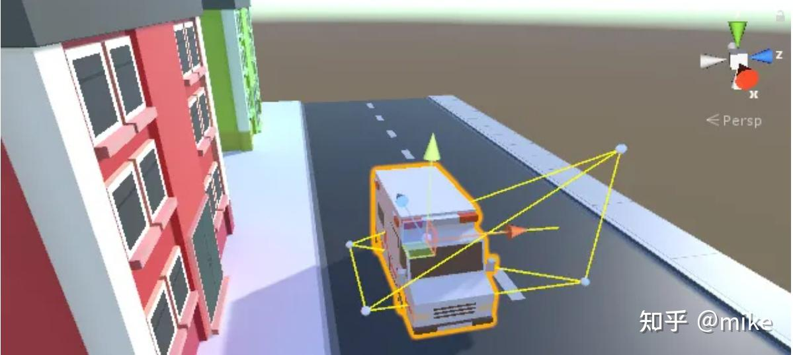

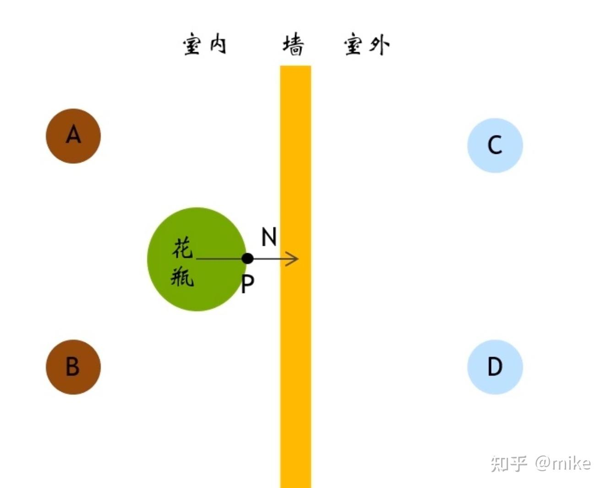

> DDGI其实就是Irradiance Volume的实时版本，它利用实时光线追踪来计算probe信息，而Irradiance Volume是离线计算的，从这点上来说DDGI是完全支持动态光源的算法，但是它依赖可以做实时光线追踪的硬件或者是使用Ray Marching。另外DDGI使用了切比雪夫不等式来预测probe是否被遮挡，减缓漏光问题。DDGI的核心是优化Irradiance volume的更新

漏光的原因是采样到了实际上被遮挡的探针，DDGI使用切比雪夫不等式原来就是用来预测Probe是否被遮挡

下面还介绍了LPV、VXGI，这个等实现时再看

**[GIBS](https://zhida.zhihu.com/search?content_id=217520473&content_type=Article&match_order=1&q=GIBS&zhida_source=entity)**  

> GIBS与VXGI不同之处是VXGI将场景的物体表面离散成了voxel，而GIBS将场景表面离散成了surfel。描述一个surfel的基本数据结构是位置，法线和半径，这就定义了一个2D的圆形表面

**PRT**

> PRT就是将光照方程进行拆解，然后用球谐函数记录每个部分，利用球谐函数的性质还原光照方程，因为light transport部分包含场景的遮挡关系且这部分是预计算的所以PRT只支持静态场景动态光源。   

**SSGI**

ssgi是基于屏幕空间的全局光照算法，利用深度信息进行Ray Marching，效率不如SDF，但是不需要额外的存储空间，因为是基于屏幕空间的光照算法，所以缺少屏幕外的光照信息。

**Lumen**

ue5的lumen主要是实现了一套软光线追踪算法，其中涉及的内容几乎包括了上面所有介绍的实时全局光照算法，会单独写一篇文章介绍，这里就不详细介绍了。

总结一下实时全局光照算法，基本分为三个步骤：

1. 离散化场景空间或物体表面，probe，voxel，surfel，均匀网格，还有一个lumen的mesh card后面介绍。
2. 计算Irradiance cache。
3. 利用Irradiance cache还原光照方程。

>  另外 有一个东西是 SDF实现的raymarch不太了解

# 2025.11.21 [丛越](https://www.zhihu.com/people/li-xiang-da-sheng)

https://zhuanlan.zhihu.com/p/73016473

> 看了人家的管线设计才发现自己费那么多劲琢磨架构是多么的无知，当前阶段还是多输入少输出吧

> 原来Buffer还能这么复用（在不同时段通过别名资源重用内存）

> GPU驱动管线（下一步学习计划！）

## Vulkan的内存模型

> Vulkan 的内存分为 Host 和 Device 两大类，下图可以看到哪些是Device可见的，哪些是Host可见的

## **并行 Command**

尽管从 API 层面来看 Command 是依次录制的，但 GPU 在执行时是将 Queue 中的指令同时分发给 GPU 多核中的 Pipeline 执行，这就是 GPU 的并行计算机制。而这种并行，是不会保证执行的顺序，所以对于提交到 GPU 执行的 Command，需要了解以下几个事实：

- Command 在 Command Buffer 中顺序并不代表在 GPU 内部执行的顺序。
- 提交到同一 Command Queue 中不同 Command Buffer 的顺序并不代表在 GPU 内部执行的顺序。
- 不同 Command Queue 的提交顺序不代表在 GPU 内部执行的顺序。

## Pipeline Barrier

> TODO： https://zhuanlan.zhihu.com/p/100162469

下面图片的每个块表示一个Pipeline Stage

# 2025.11.11 [SaeruHikari](https://www.zhihu.com/people/SaeruHikari)

## GBuffer压缩

> Gbuffer是可以压缩的(https://zhuanlan.zhihu.com/p/95824400)。

> GBuffer会带来显卡的带宽压力, 所以现在的游戏一般会把GBuffer压缩到2~3张。比如把法线压缩到2通道并在使用时进行Decode, 或者不保存PosW到GBuffer, 而是在使用时使用深度重建。可以参照顽皮狗在Sig16分享的方案:

## 不同的BRDF方案

> 可以学习并实践一下不同的BRDF方案，而不是就还是Lambert + Cook-Torrance

Diffuse

首先看漫反射部分, 目前比较流行的公式有这些可选:

- Lambert
- Burley(Disney)[sig2012]
- Renormalized Disney Diffuse[sig2014]
- PBR diffuse for GGX_Smith[GDC 2017]
- MultiScattering Diffuse BRDF[sig2018]

在五个模型都尝试一遍过后选择了RenormalizedDisneyDiffuse。

这里特别要提一句的是MultiScattering版本的diffuse BRDF, 在今年的sig也有对它实现的补充以及改进分享。但是实测之后发现效果并不好, 因为多散射对diffuse的影响实在太小, 这个模型并不能带来太多可见的改善。

而Frostbite在14年sig[[3\]](https://zhuanlan.zhihu.com/p/95824400#ref_3)提出的Renormalized Disney Diffuse是带来观感改善较大的一个:

[Moving Frostbite To PBRwww.ea.com/frostbite/news/moving-frostbite-to-pb](https://link.zhihu.com/?target=https%3A//www.ea.com/frostbite/news/moving-frostbite-to-pb)

它主要对Burley模型进行了改进, 根据视角入射角对Diffuse进行补正来维持能量守恒, 在视角移动时产生的视觉效果更加细腻(当然光源太复杂就没那么明显了...)。

Specular

接下来来到BRDF里最重要, 组装起来也最好玩的Specular BRDF项:

 (Cook-Torrance)

- **D(h):** 法线分布函数, 描述微面元法线分布的概率, 具有正确朝向，能够将来自l的光反射到v的表面点的相对于表面面积的浓度。
- **F(l,h) :** 菲涅尔方程, 描述不同的表面角下表面所反射的光线所占的比率。
- **G(l,v,h) :** 几何函数/几何遮蔽，描述微平面自成阴影的属性，即m = h的未被遮蔽的表面点的百分比。
- **分母 4(n·l)(n·v）：**校正因子，作为微观几何的局部空间和整个宏观表面的局部空间之间变换的微平面量的校正。

这里不再细致解释, 列出常用的模型, 这些模型在UE4几乎都有实现, 可以到BRDF.ush去参考(抄):

**Specular D:**

- **Blinn-Phong[1977]**
- **GGX/GTR[2007/2012] (GGX(GTR2)作为GTR的特例)**
- **以及各种各向异性版本...**

**SpecularF**

- **Cook-Torrance[1982]**
- **Schlick[1994] (一般选用这个, 便宜且曲线非常贴紧参考值)**

**SpecularG**

- **Cook-Torrance[1982]**
- **Smith[1967] (被拓展为l, v的联合遮蔽函数, 具有多种变体)**

## TAA

> 一直没管过引擎的走样问题。。。待学习完善

## RGD

> https://zhuanlan.zhihu.com/p/97022384 这里有RGD的实现思路，学习RGD可以参考

## 反射

> https://link.zhihu.com/?target=https%3A//github.com/rttrorg/rttr ， [SaeruHikari](https://www.zhihu.com/people/SaeruHikari)用的这个反射

## 多线程渲染?

> 博客提到的多线程是指多个queue，和我现在实现不一样啊

# 2025.11.12

## 匿名资源、临时资源

> 这个东西我的项目有进行规整，所有资源都做了保存    （应该：无名未注册的资源会被保持在一个池内, 并由系统进行自动化的复用。）

## RDG

蓝色表示PassNode, 白色圆角表示ResourceNode, 实际资源存储在Container中。

纹理、Buffer、Pass创建都是走的RDG

> RDG需要处理多帧资源比如TAA

