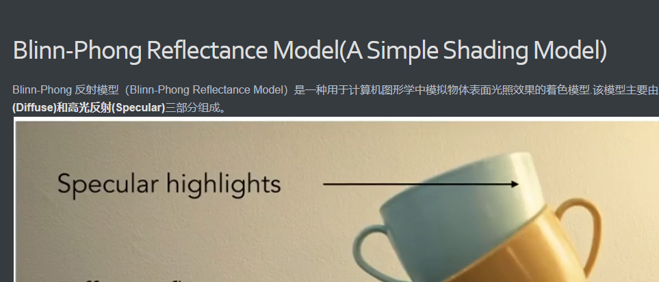

+++
date = '2025-10-19T00:57:01+08:00'
draft = false
title = 'GAMES101 现代计算机图形学入门 Shading'
categories = ["Course/Games202","Engines"]
+++
@[TOC](目录)
>[GitHub主页](https://github.com/sdpyy1)：https://github.com/sdpyy1
[games101项目作业代码](https://github.com/sdpyy1/CppLearn/tree/main/games101)：https://github.com/sdpyy1/CppLearn/tree/main/games101

# 什么是shading？
shading 负责计算物体表面每个采样点的颜色，具体考虑光照、材质属性、观察角度等因素，生成具有真实感的视觉效果（如漫反射、镜面高光、环境光等）‌，之前的光栅化将是几何图元（如三角形）转换为屏幕上的像素，确定哪些像素被图元覆盖，是几何层面的处理
# Blinn-Phong Reflectance Model(A Simple Shading Model)
Blinn-Phong 反射模型（Blinn-Phong Reflectance Model）是一种用于计算机图形学中模拟物体表面光照效果的着色模型.该模型主要由**环境光(Ambient)、漫反射(Diffuse)和高光反射(Specular)**三部分组成。

定义一些基本向量，默认为单位向量：

- `Viewer Direction` ：观察方向,用`v`	表示
- `Surface normal`：法线方向，使用`n`表示
- `Light direction`：光线方向，用`l`表示
 

 ## Diffuse Reflection（漫反射）

 是投射在粗糙表面上的光向各个方向反射的现象。当一束平行的入射光线射到粗糙的表面时，表面会把光线向着四面八方反射，所以入射线虽然互相平行，由于各点的法线方向不一致，造成反射光线向不同的方向无规则地反射，这种反射称之为“漫反射”或“漫射”。正是因为反射是完全随机的，因此可以认为漫反射光在任何反射方向上的分布都是一样的。
 
 漫反射强度影响因素：
 1. 入射光线与法线的夹角
`lambert's cosine law`: 当夹角为θ时，能量要乘`cosθ = l.dot(v)`(单位向量)

 2. 入射光线自身的强度
入射光自身的强度与距离有关 
结合两个影响因素，得到漫反射能量公式
$$L_d = k_d (I / r^2) \max(0, \mathbf{n} \cdot \mathbf{l})$$

其中$k_d$表示反射系数指光（入射光）投向物体时，其表面反射光的强度与入射光的强度之比值，受入射光的投射角度、强度、波长、物体表面材料的性质以及反射光的测量角度等因素影响。一般来讲，在颜色系列中，黑色的反射系数较小，为0.03，白色的反射系数较大，为0.8

 最后，漫反射与观察方向`v`没有关系，漫反射能量会均匀反射到各个方向上去。
  ## Specular highlights(高光/镜面反射)
  若物体表面很光滑，光线会被反射，如图所示`R`为镜面反射方向，观察方向`v`与反射方向`R`接近时，能看见反射光，反射光强度与`R`和`v`的夹角有关

`R`和`v`的夹角 **等价于**`l`和`v`的half vector与法线方向`n`之间的夹角，通过向量相加的平行四边形法则获取到half vector，再单位化

最终得到镜面反射能量公式
$$
\begin{align*}
L_s &= k_s (I / r^2) \max(0, \cos\alpha)^p \\
&= k_s (I / r^2) \max(0, \mathbf{n} \cdot \mathbf{h})^p
\end{align*}
$$
其中$k_s$为镜面反射系数，通常取白色的系数

因为镜面反射对角度很敏感，所以设置参数p来控制夹角的影响

## Ambient Term（环境光）
环境光不依赖任何项，任何方向射入，任何方向观察都不影响环境光的强度（该模型的简化，精确计算需要用到全局光照技术）

最后，展示结合效果

# Shading Frequencies（着色频率）
3个几何形状完全相同的球，为什么着色结果各不相同？计算作色的频率不同，球1一个平面取一个法线，做一次着色，球3每个像素都求法线后都做一次着色

- shade each triangle(flat shading)：每个三角形求一个法线（边向量叉积），对整个三角形进行相同的shading，当三角形面很多，效果也不一定差，反而计算量少
- shade each vertex（Gouraud shading）：三角形的三个顶点都求法线，三个顶点进行shading，三角形内部用插值填充
- shade each pixel(Phong shading)：每个像素都求法线，每个像素都进行shading

如何求顶点的法线？利用顶点关联的面的法线进行加权平均
# Graphics（Real time Rendering）Pipeline
`Pipeline`：从场景到图的流程
⚠️：Shading根据Shading Frequencies（着色频率）的不同发生在不同阶段，如果是每个顶点进行着色，就发生在顶点处理阶段，如果是每个像素shading么就在光栅化之后，下面图也解释的shader编程中的vertexShader和fragmentShader

GPU模型

# Texture Mapping
考虑球和地板，不同的位置有不同的颜色，每个位置都有自己的漫反射系数，引入纹理映射对每一个点定义不同的属性

模型上任意一个三角形的顶点，都能在纹理图找到对应的顶点。 至于如何一一对应，是美工的任务。
纹理图通过UV坐标来进行定位（UV取值范围都是0-1之间），这样每个三角形的顶点都对应一个UV坐标

如果我已经知道每个三角形顶点对于的UV坐标，那如何知道三角形内部每个点的UV坐标呢？ （插值解决）
# 如何插值？
为什么要用插值？因为我们希望处理完顶点后，三角形内部进行平滑的过度
首先引入**重心坐标 Barycentric Coordinates** 重心坐标可以表示为顶点的线性组合（如下图所示），三角形内任意一点的坐标(x,y)，找到满足$\alpha+\beta+\gamma=1$ 和 (x, y) = $\alpha A + \beta B + \gamma C$的（$\alpha$,$\beta$,$\gamma$）, 就可以用（$\alpha$,$\beta$,$\gamma$）表示该点的重心坐标

重心坐标（$\alpha$,$\beta$,$\gamma$）可以通过面积比求出，如下图

由此可得三角形的重心的重心坐标为(1/3,1/3,1/3), 除此之外，也有直接的公式求出任意一点的重心坐标，如下图
 其实重心坐标显示出的内容就是该点对于三角形三个顶点的权重应该是多少。（$\alpha$,$\beta$,$\gamma$）就分别是A、B、C顶点的权重。
 ⚠️：投影后重心坐标会变化
 # Texture Magnification（纹理图太小）
 A pixel on a texture - a texel(纹理元素、纹素)
 场景：纹理图片2*2，但需要把它渲染到4*4的屏幕，那在渲染中间像素时，他的UV坐标无法对应texel，所以需要处理，下图为三种处理方式
 
## Nearest
落在哪个texel附近，就选择哪个texel

## Bilinear Interpolation
综合考虑周围4个texel的值，水平方向得到两个插值，再垂直方向再做一次插值，所以叫双线性插值，插值函数就是 $$lerp(x,v_0,v_1) = v_0 + x(v_1 - v_0)$$

### Bicubic
更复杂的插值，取周围16的texel

## Texture Magnification（纹理图太大）
例如纹理图被重复使用用来帖地板
如果只进行简单操作，得到结果为
问题的原因：在远处一个Pixel就覆盖了多个texel，下图大框是Pixel，在远处，一个像素就覆盖了多个纹理，很大范围只采样一次，就会导致信息丢失，导致走样。最简单解决思路就是Supersampling，采样点增多，获得的信息就多，但计算量太大

### Mipmap
为一张纹理图生成多个低分辨率纹理图，每次分辨率减半，将4个相邻像素点求均值合为一个像素点。从存储容量上看，根据等比数列求和，存储只增加了$1/3$

那在映射时应该选择哪一Level 作为纹理呢？利用屏幕相邻的像素点的距离估计纹理的大小，如图红色像素距离上和右两个像素的距离反应到纹理图上的距离变大的程度来选择，取最大

但通过$D = log_2L$计算的是一个连续值，并不一定直接表面使用第几层，如何处理？
使用三线性插值，例如D=1.8，就在第1层和第2层分别做一次双线性插值，最后根据D的大小，对两次插值结果再插值一次

使用该技术得到结果，如下图所示，远处仍然比较模糊

### 各向异性过滤
Mipmap所规定的区域查询
必须是正方形，而纹理映射中可不仅仅只有正方形，如下图所示，某些像素对应的纹理图位置并不是正方形，针对这种情况，有时候需要水平方向的高Level，有时候需要竖直方向上的高Level，因此也启发了各向异性过滤，生成各种方向上压缩的材质，最终存储容量收敛到原来的3倍

看下图一个像素点在纹理上对应的并不是一个正方形区域，使用Mipmap就不合适了

## 纹理的应用
 ### Environment Map
 纹理不一定非得一副图片，可以用纹理描述环境光效果

### Bump Mapping 凹凸贴图
欺骗人眼，看着像是用模型做出来的凹凸效果，其实只是材质的原因。在贴图上定义每个点的高度进而改变法向量，这就回影响shading，因为法线参与了color生成过程。

### Displacement Mapping 位移贴图
真的去移动了顶点，Bump会露馅，因为最外圈显然是一个完整的球。Bump Maps是逻辑上的高度改变，它实则并没有改变内部的模型，是假的改变；而Displacement Map则是物理上的高度改变。它真正改变了模型。二者的区别就在此处，可以通过物体阴影的边缘发现这点

### 3维纹理

