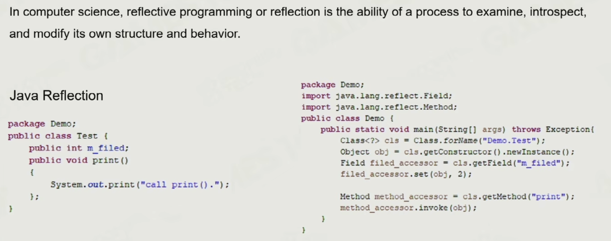

+++date = '2025-10-29T14:42:31+08:00'
draft = false
title = 'Games104：引擎工具链'
categories = ["学习笔记/GAMES104"]
tags = ["Games104"]
+++

> 讲了 GUI架构、Asset的序列化和反序列化、Redo undo实现、反射等技术

# 反射

## 为什么需要反射

我定义一个定向光组件，刚开始有方向和强度，我想在GUI实时修改，就需要在imgui添加两个按钮来调整，但是定向光的属性越来越多，我并不希望每次都要修改imgui界面来修改，这种就可以让imgui拿到定向光的反射来自动生成

## C++实现

Piccolo 借助 Clang AST，相当于直接复用了编译器的语法分析，通过在需要反射的类和属性上做标记，让clang AST分析后就会带上这个标记，从而知道了这些信息。 再下一步就是生成对应的反射类（就是自动生成的一些cpp文件，这些文件就包含了GetSet方法来设置原本被反射的类的信息

这节内容主要是反射了解一下
