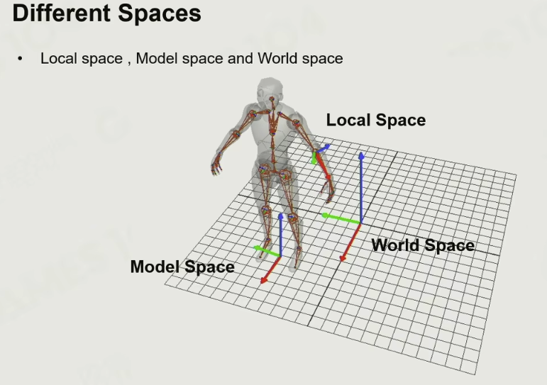
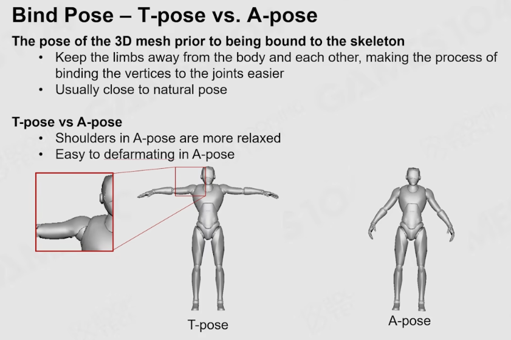
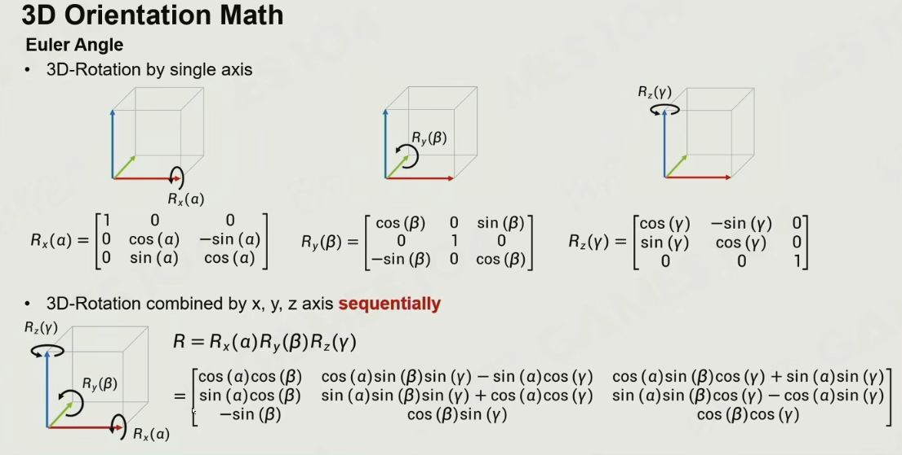
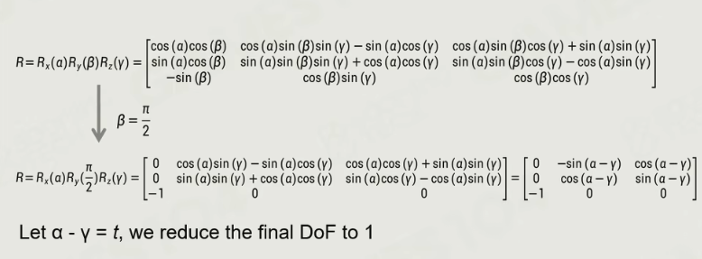
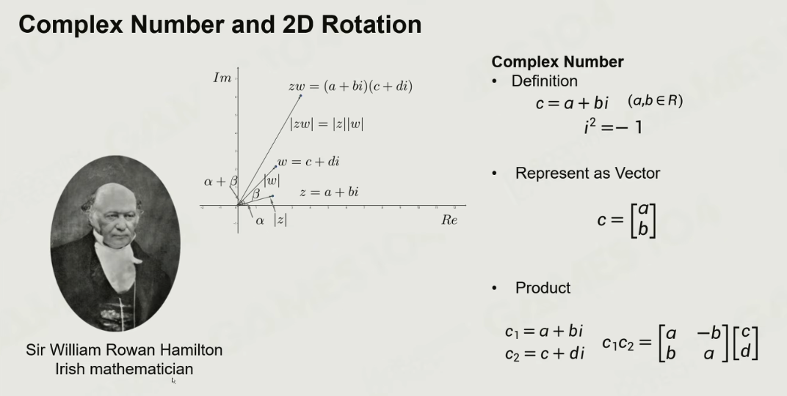
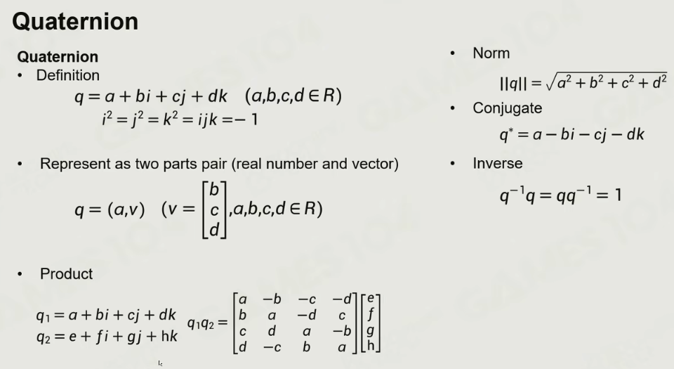
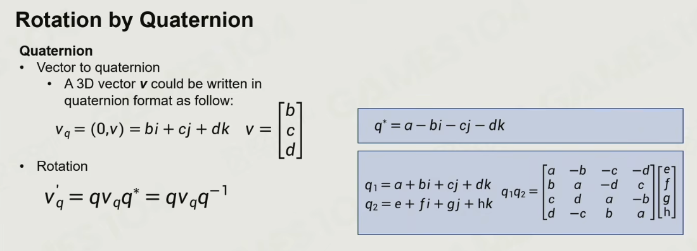

+++
date = '2025-10-20T15:00:44+08:00'
draft = false
title = 'Games105：游戏引擎的动画技术基础'
categories = ["Course/Games104"]
tags = ["课程笔记","Games104","计算机动画"]

+++

# 蒙皮动画

这里讲的就是科普了一下

坐标系

实际存储的数据是关节数据

Root关节一般存在脚底，为了方便计算移速、跳跃高度。髋关节是第一个子关节

T-pose和A-pose：

A-pose 下，肩关节旋转角度为 0°，肘部微弯 15°，手掌自然朝向大腿关节，旋转轴处于中性位置，绑定师可以更精确地绘制顶点权重，控制手臂摆动和肌肉变形，提高工作效率和质量。T-pose 中，肩部会受到挤压，当手臂放下时，可能会出现肌肉穿模等问题。A-pose 则能避免这种情况，其腋下、胯部等容易穿帮的区域自然展开，为后续的动画制作提供了更好的基础，减少了调整和修正的工作量。

# 3D空间的旋转

**这块东西在Games105数学原理博客部分已总结**

## 欧拉角

分别沿着三个轴旋转，旋转矩阵可以合并成一个

缺点：

1. 顺序依赖
2. 万向锁，直接用公式也能解释，把y轴旋转带入后，整个旋转公式只剩下x轴旋转部分了，z轴的都没了

欧拉角的插值有问题

## 四元数

在二维平面上可以用复数代表旋转。另外旋转的叠加可以直接通过Product运算算出

拓展到3D旋转

### 欧拉角转四元数

### 用四元数旋转一个顶点

总结后：直接表达成旋转矩阵如下

### 用四元数表达从U旋转到V

可以通过下面的公式计算出对应的旋转四元数是多少

### 四元数表达给定轴的旋转

