+++
date = '2025-10-20T15:00:44+08:00'
draft = false
title = 'Games105：游戏引擎的动画技术基础'
categories = ["Course/Games104"]
tags = ["课程笔记","Games104","计算机动画"]
image = '截屏2025-10-20-15.21.05.png'
+++

# 蒙皮动画

这里讲的就是科普了一下

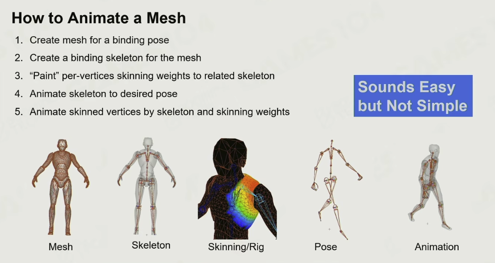

坐标系

实际存储的数据是关节数据

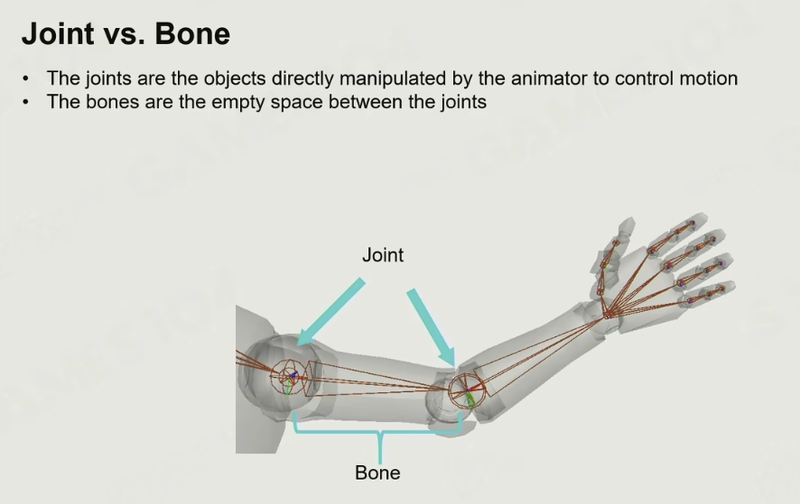

Root关节一般存在脚底，为了方便计算移速、跳跃高度。髋关节是第一个子关节

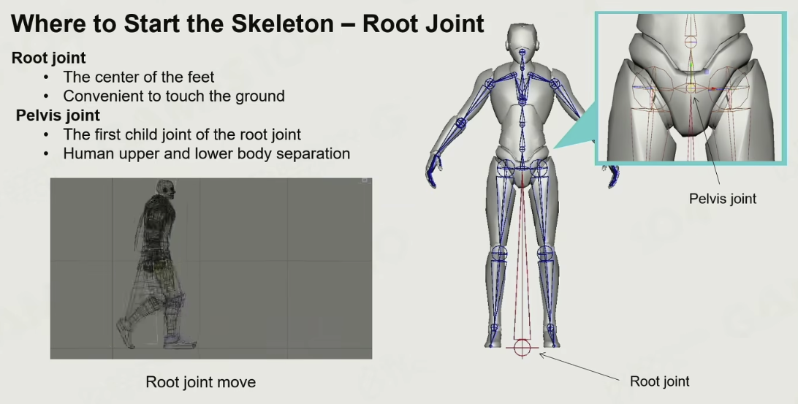

T-pose和A-pose：

A-pose 下，肩关节旋转角度为 0°，肘部微弯 15°，手掌自然朝向大腿关节，旋转轴处于中性位置，绑定师可以更精确地绘制顶点权重，控制手臂摆动和肌肉变形，提高工作效率和质量。T-pose 中，肩部会受到挤压，当手臂放下时，可能会出现肌肉穿模等问题。A-pose 则能避免这种情况，其腋下、胯部等容易穿帮的区域自然展开，为后续的动画制作提供了更好的基础，减少了调整和修正的工作量。

# 3D空间的旋转

**这块东西在Games105数学原理博客部分已总结**

## 欧拉角

分别沿着三个轴旋转，旋转矩阵可以合并成一个

缺点：

1. 顺序依赖
2. 万向锁，直接用公式也能解释，把y轴旋转带入后，整个旋转公式只剩下x轴旋转部分了，z轴的都没了

欧拉角的插值有问题

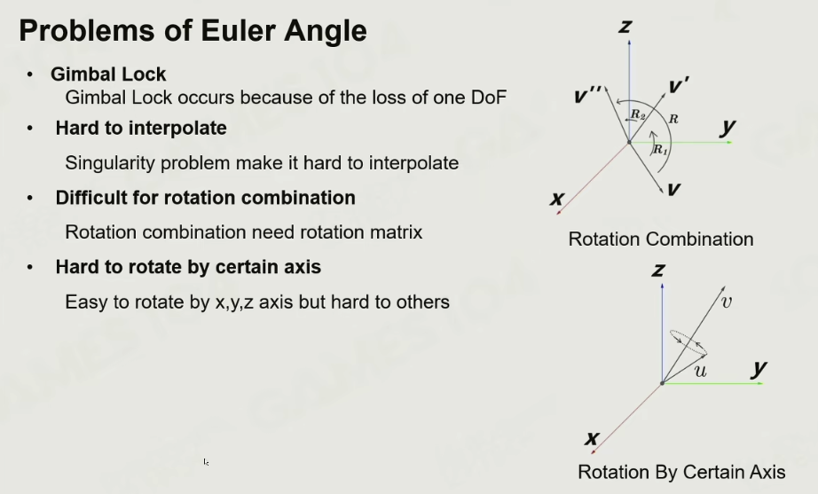

## 四元数

在二维平面上可以用复数代表旋转。另外旋转的叠加可以直接通过Product运算算出

拓展到3D旋转

### 欧拉角转四元数

### 用四元数旋转一个顶点

总结后：直接表达成旋转矩阵如下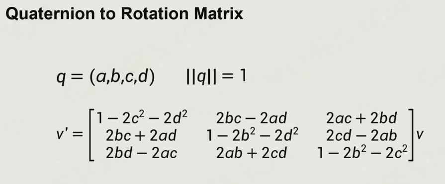

### 用四元数表达从U旋转到V

可以通过下面的公式计算出对应的旋转四元数是多少

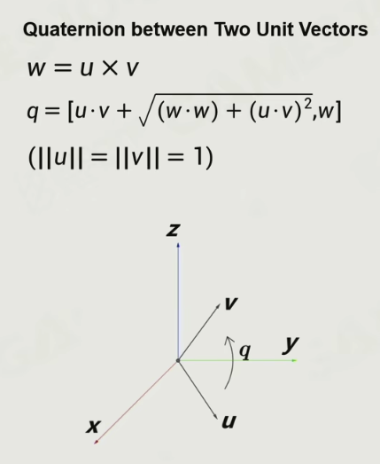

### 四元数表达给定轴的旋转

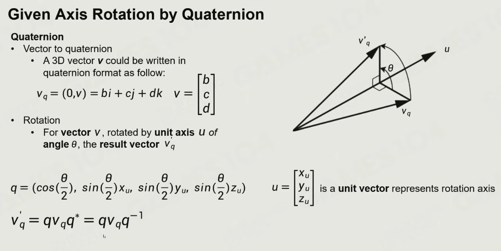

# 蒙皮动画

## 骨骼信息

旋转，大部分都是以旋转为主

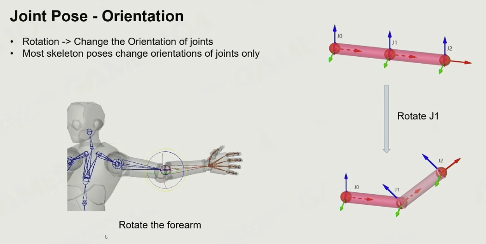

平移

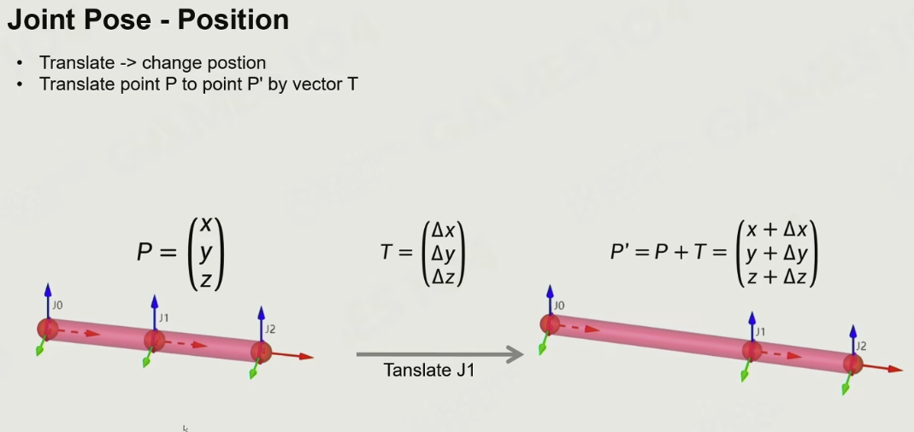

平移还是有用的，比如站立和蹲下是时Root和髋关节就发生了平移

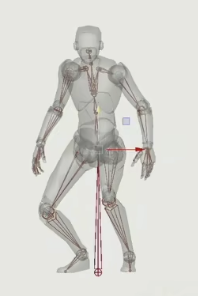

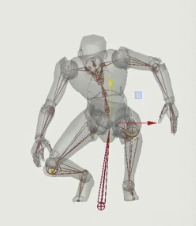

放缩

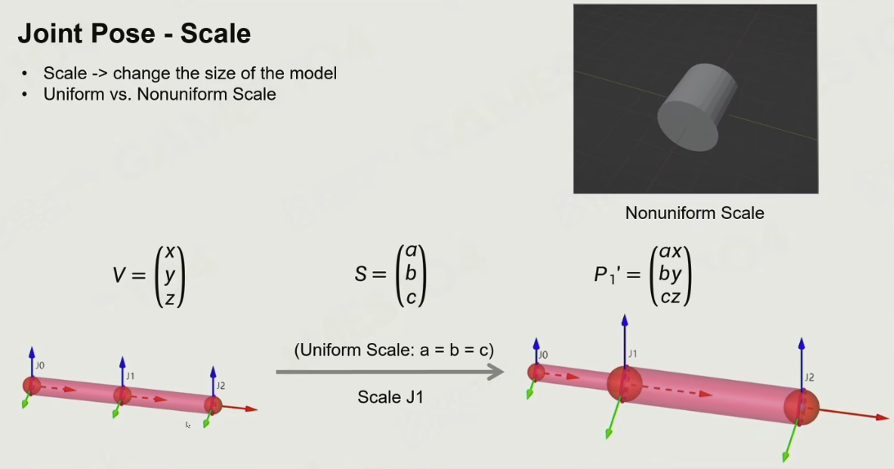

所以Joint Pose就是，其中旋转矩阵可以通过四元数转化而来（注意这个变换不需要透视除法）

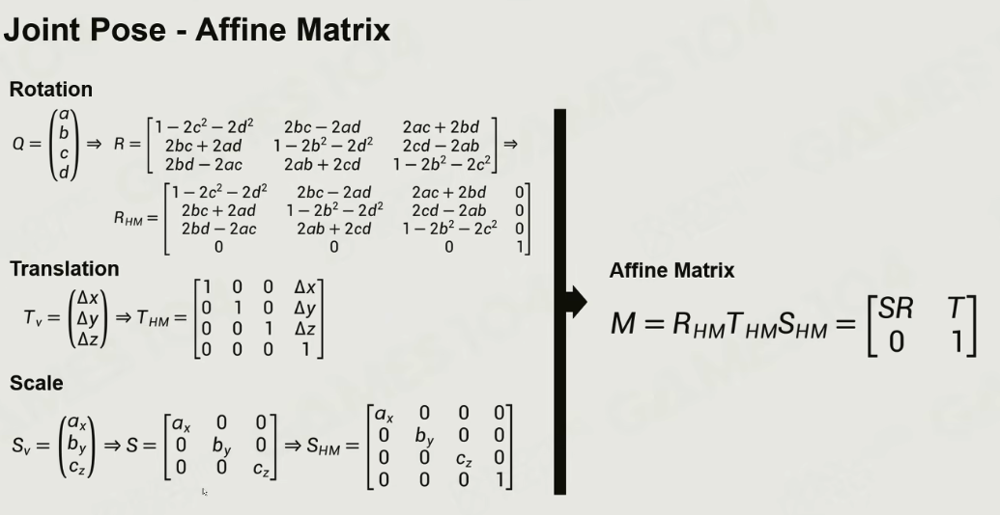

另外骨骼信息存储的都在局部坐标系，也就是说骨骼信息存储的实际是它相对于父骨骼的变换信息，而不是相对于整个模型。

如果使用局部坐标系：

- 只需更新父骨骼的变换，就能自动影响子骨骼。
- 方便做**层级动画**，比如抬手动作只需要改手臂局部变换，身体会自动跟随。

如果存储在模型坐标系：

- 每个骨骼的世界变换必须单独存储或重复计算。
- 当父骨骼旋转时，需要手动更新所有子骨骼的世界位置，**计算复杂且容易出错**。

动画混合（比如走路 + 挥手）通常对**局部骨骼变换**进行插值或加权，而不是对世界位置插值：

- 局部空间插值保持层次一致性，不会出现骨骼分离或错位。
- 世界空间插值容易导致骨骼错位或姿势破坏，因为子骨骼的位置依赖父骨骼。

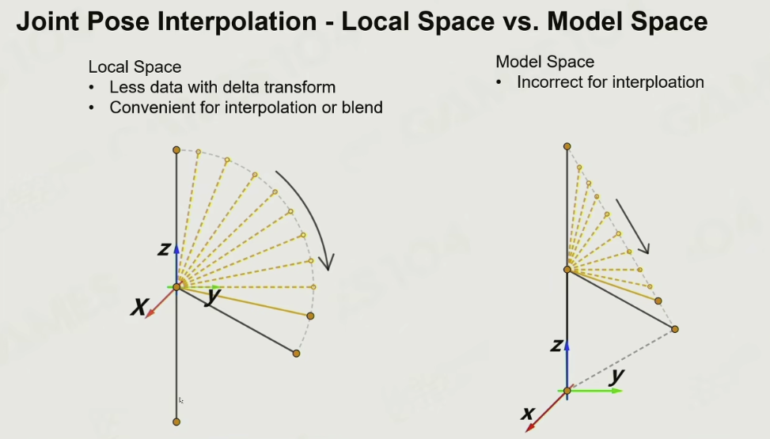

## 蒙皮矩阵

现在已经理解了骨骼信息如何存储，下面介绍骨骼信息如何作用到顶点上

下图说明即使骨骼移动，顶点与骨骼的相对位置并不会变化

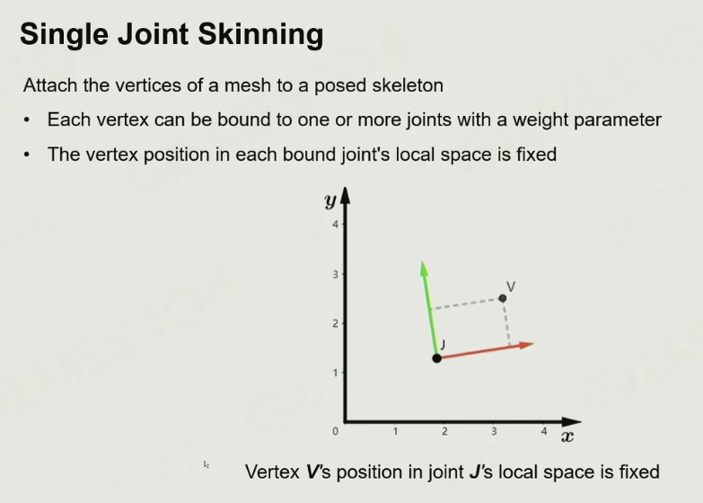

Bind Pose：默认姿态用于绑定骨骼和顶点

下面三个参数分别是某个顶点：

1. 绑定姿态下的模型空间位置
2. 绑定姿态下的局部空间位置
3. 绑定姿态下的骨骼在模型空间的位置

顶点相对于骨骼的位置在任何时候都不会变，并且等于骨骼在模型空间位置的逆矩阵 x 顶点在模型空间中的位置

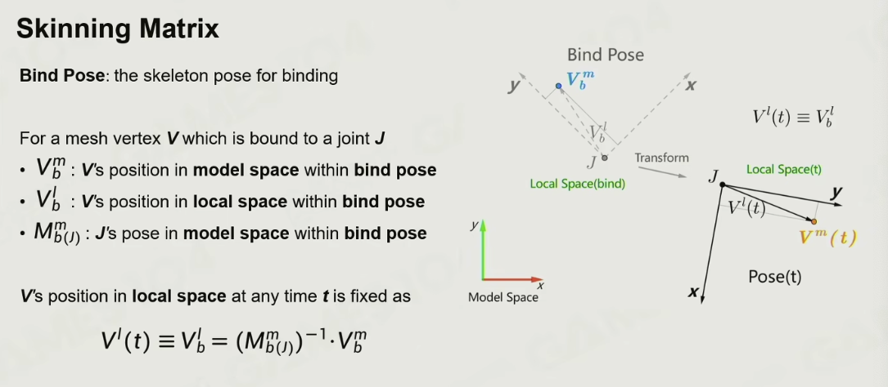

顶点的位置 = BindPose下顶点位置先转到骨骼的局部坐标系再跟着骨骼运动后的位置

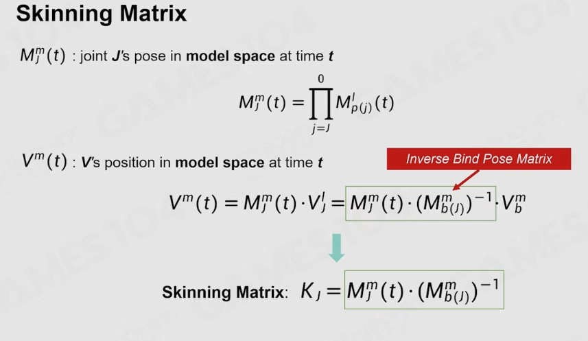

在存储骨骼信息时，需要存储Inverse BindPose Matrix，它是把变换矩阵一路从父节点传递下来，得到当前骨骼的模型坐标系下的变换信息，然后求逆。

Inverse BindPose Matrix的作用是把一个在模型坐标系下的顶点坐标（bindpose下的）转移到这根骨骼上，所以不管任何时候，转移后得到的结果都应该是一样的

把顶点信息（bindpose下）转移到骨骼后，再乘以现在的骨骼变换矩阵，就得到了顶点的现在的位置（实际位置），这样也就得到了一帧动画下这个顶点的位置

## 蒙皮变换

总结下：在骨骼蒙皮动画中，每个顶点在 **Bind Pose（绑定姿态）** 下的模型空间位置，通过 **Skinning Matrix**（即 $M_i \cdot B_i^{-1}$ 的加权和）进行变换后，就得到了该顶点在当前动画帧下的最终渲染位置。
$$
v_\text{final} = \sum_i w_i \, (M_i \cdot B_i^{-1}) \, v_\text{bind}
$$

- $v_\text{bind}$ —— 顶点在绑定姿态下的模型空间坐标
- $B_i^{-1}$ —— 骨骼绑定姿态的逆矩阵（Inverse Bind Pose）
- $M_i$ —— 当前帧骨骼的变换矩阵
- $w_i$ —— 顶点对骨骼的权重

另外再乘上Model变换矩阵，就转移到世界坐标系，所以传递给GPU的变换信息应该是下面这个整体的变换公式

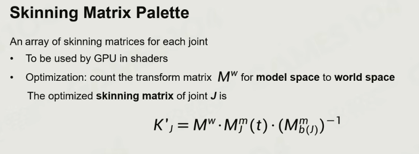

**多个骨骼影响的加权平均应该放在模型坐标系**

# 动画的插值

Games105（2）已经详细记录

四元数的NLearp插值的角速度不同

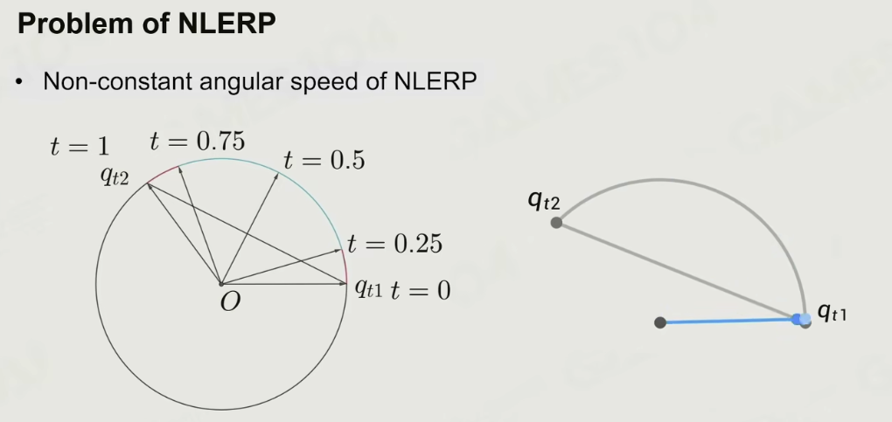

解决上述问题的办法

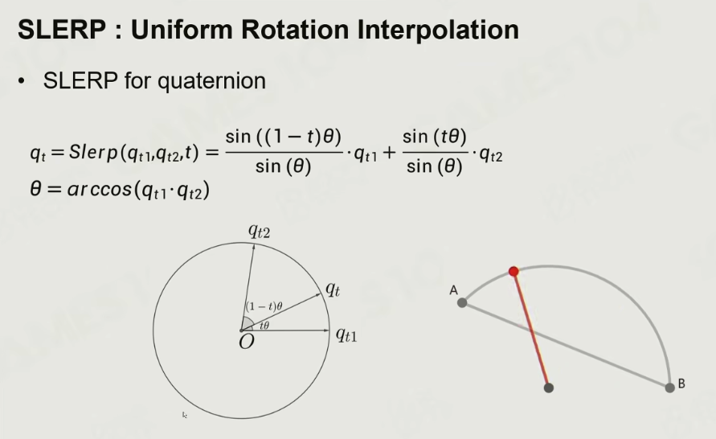

# 动画的Runtime Pipeline

1. 计算运行时间
2. 计算插值
3. 计算骨骼信息
4. 计算蒙皮矩阵
5. 更新顶点信息

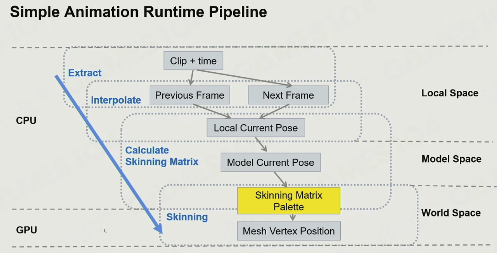

# 动画压缩

5S的动画数据要求2GB存储空间

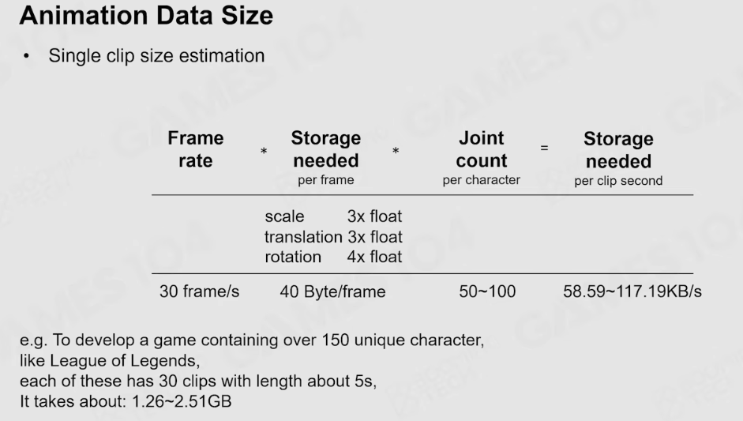

骨骼信息大量变化的都是旋转

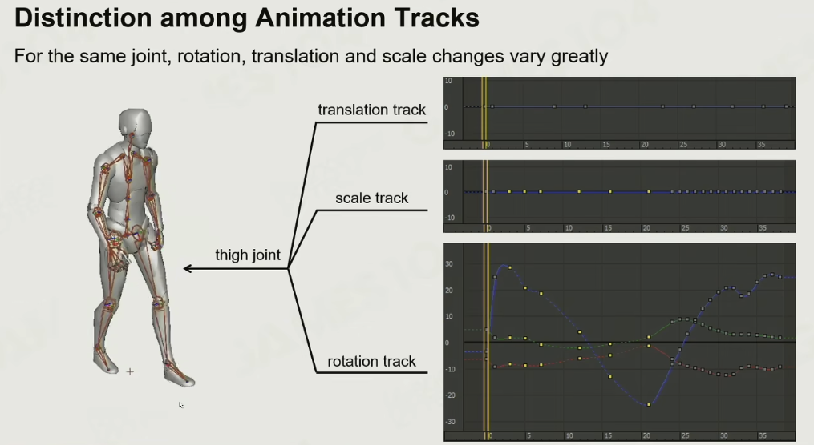

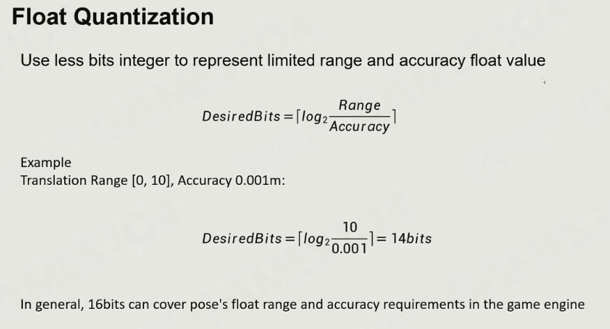
