+++date = '2025-10-25T15:45:35+08:00'
draft = false
title = 'Games104：高级动画技术：动画树、IK和表情动画'
categories = ["学习笔记/GAMES104"]
tags = ["Games104", "计算机动画"]
image = '截屏2025-10-20-15.21.05.png'
+++

> 这节主要讲了动画在实践时需要的一些技术

# 动画混合

在一个Clip内部，使用KeyFrame之间进行插值

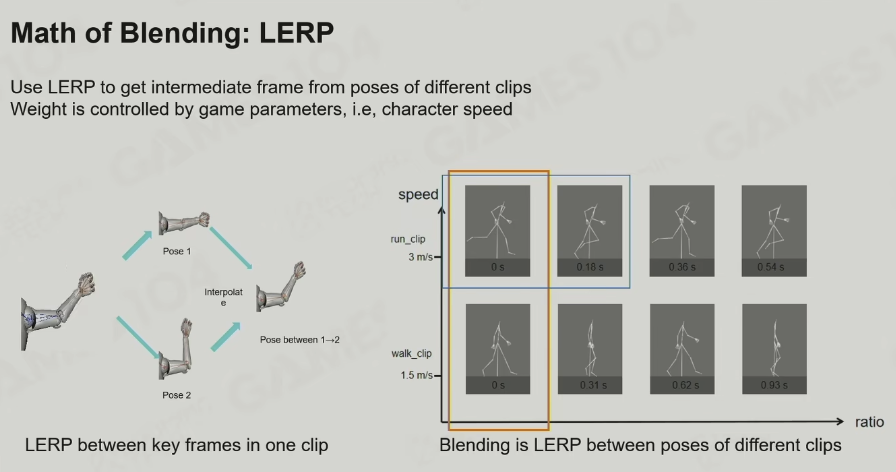

Clip之间进行插值，就涉及到如何设置两个Clip的权重，这里静态到走路可以用速度进行插值

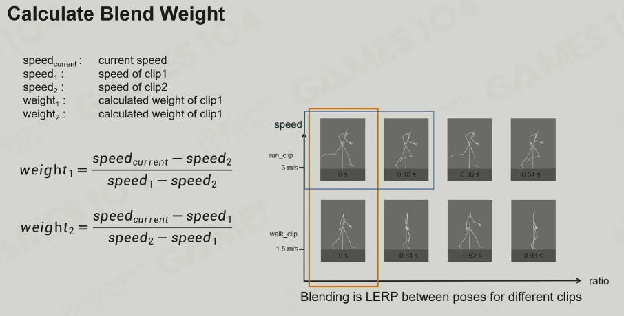

Clip之间插值取哪一的KeyFrame进行插值呢？

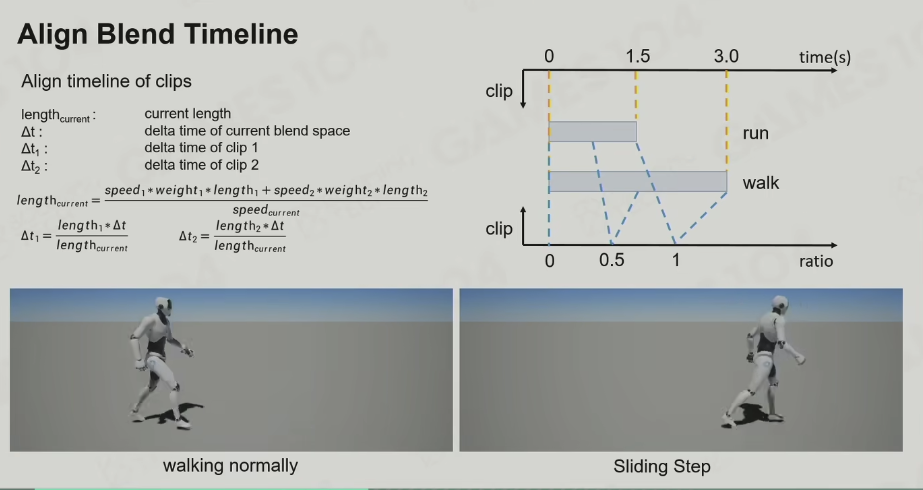

# 混合空间

## 1D/2D混合空间

一维混合就是类似从走到跑的混合，只需要一个速度变量就可以进行权重插值

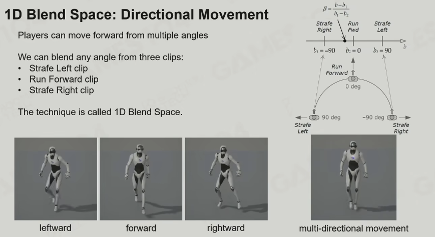

二维混合空间就需要x,y两个参数来确定很多的动画的插值

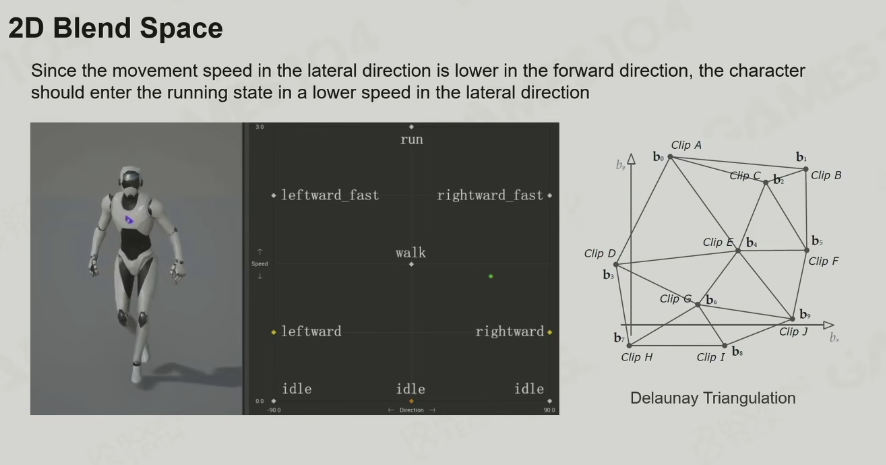

Delaunay Triangulation（德劳内三角剖分）：解决众多动画中那些动画参与插值（并不是所有动画都需要参与）

**二维插值的问题**

- 假设你有 2D Blend Space，点 `(x, y)` 表示某个动作（如走、跑、斜向走）。
- 当角色的当前参数 `(px, py)` 落在这些点之间时，需要根据它周围的动画点计算混合权重。
- 问题是：怎么快速找到 `(px, py)` 所在的区域，并确定参与混合的动画点？

**三角剖分的思路**

- 把二维平面上的所有动画点用三角形连起来（Delaunay Triangulation），满足：
  - 没有点在任意三角形的外接圆内（Delaunay性质）。
  - 三角形形状尽量接近等边三角形，避免“瘦长三角形”，这样插值更稳定。
- 这样每个三角形的顶点就是 **参与插值的动画点**。

## Skeleton Masked Blending

用来解决两个动画分别作用于不同的骨骼的情况（一个动画控制上半身，一个动画控制下半身）

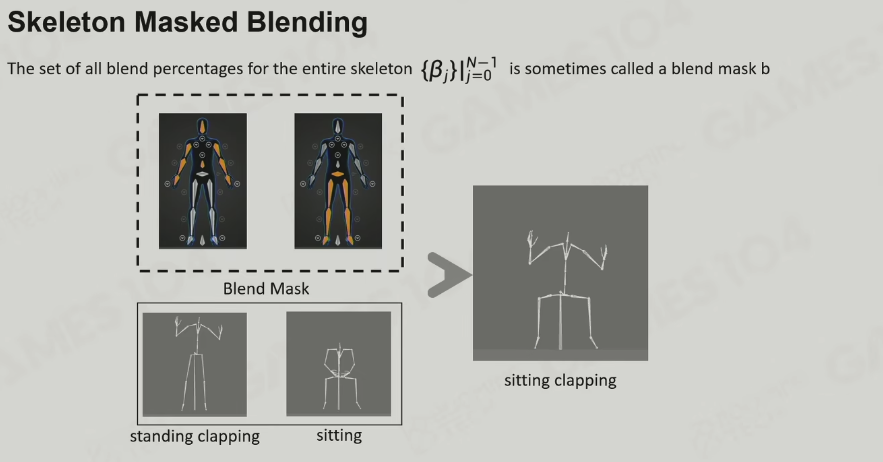

## Additive Blending

Blending做完后还可以再加一个修饰

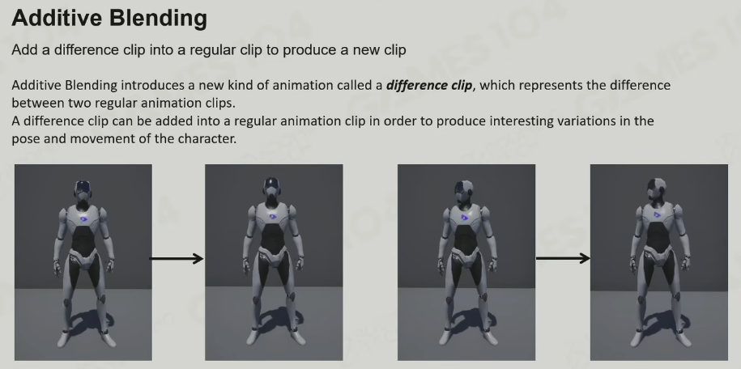

# 动作状态机（ASM）

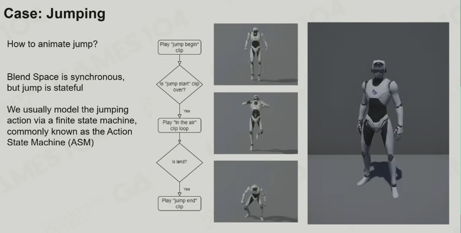

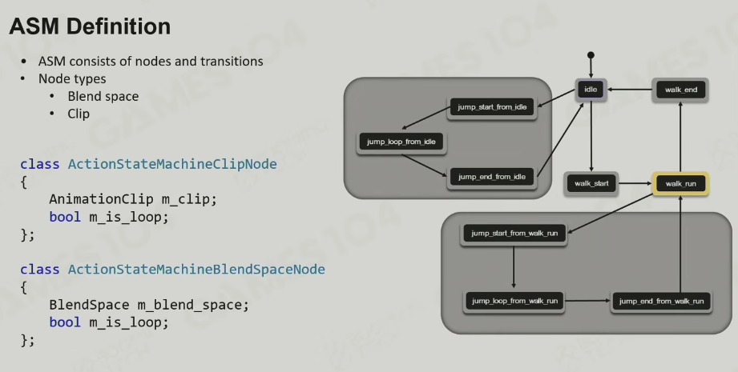

# 动画混合树

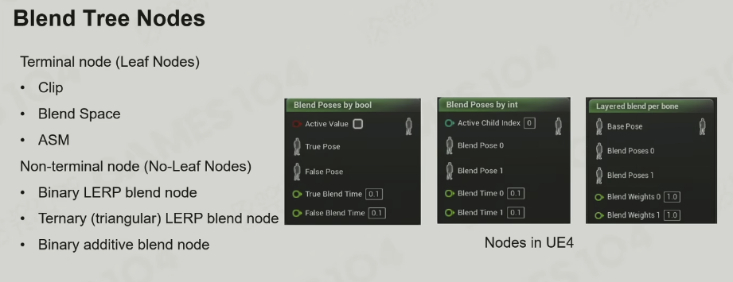

# IK

这块东西在Games105详细记录过了

# 面部动画

就是用很多的表情单元进行混合

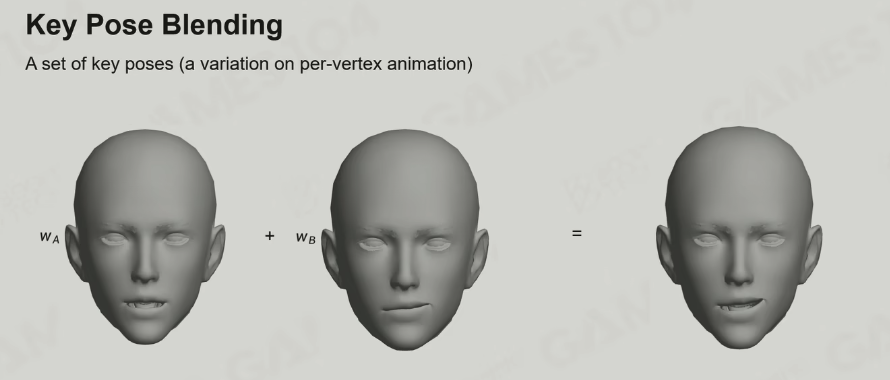 

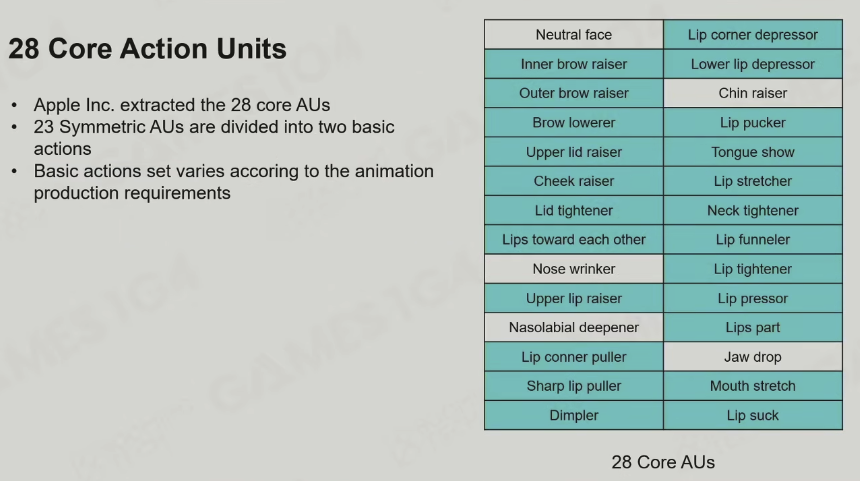

直接混合也不行

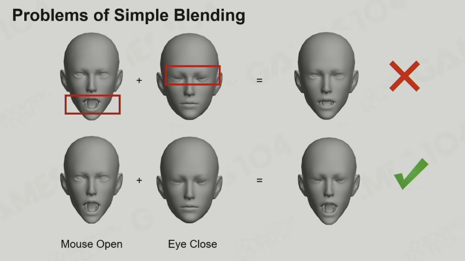

真实存AU存的是一个表情相对于正常面部的便宜

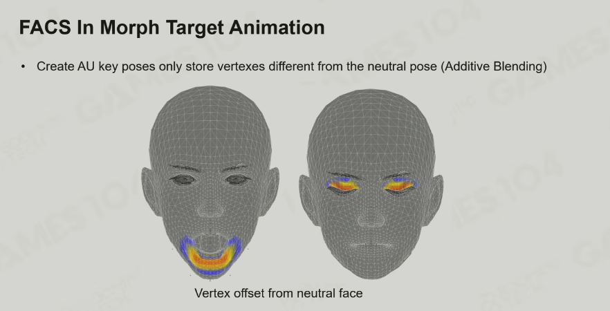

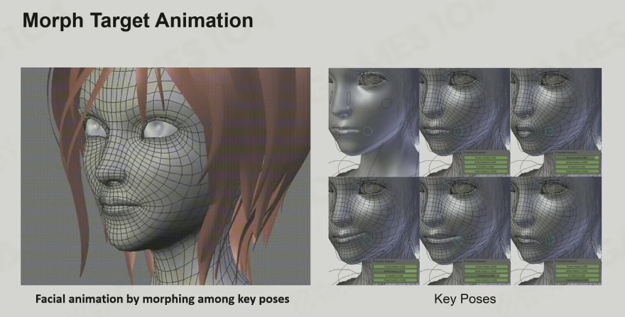

# 动画重定向

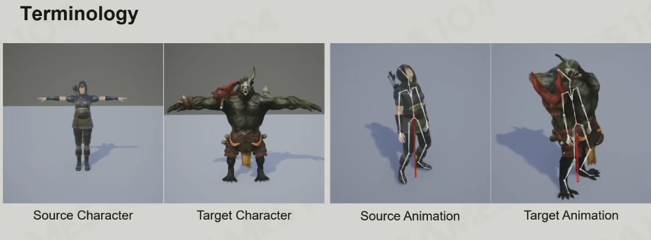

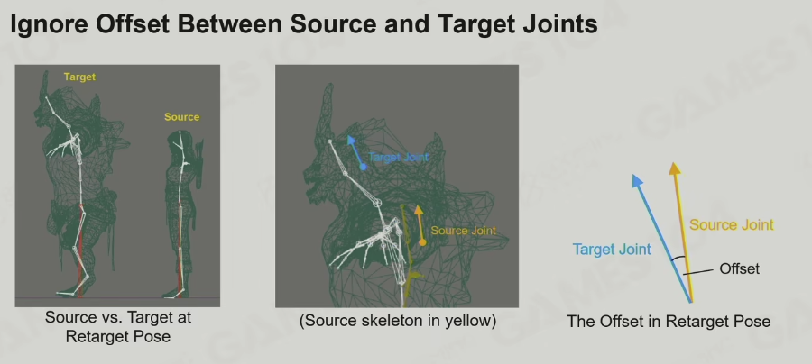
