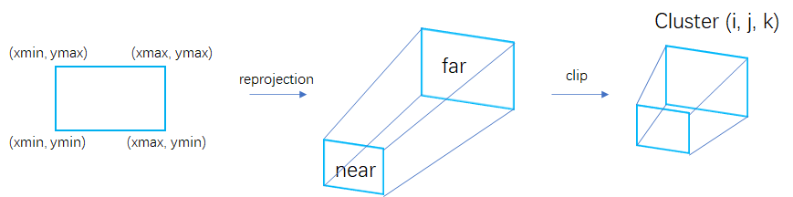
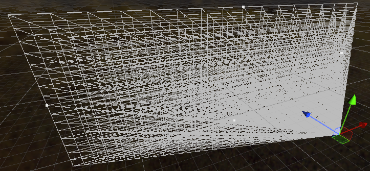

+++date = '2025-11-24T11:14:58+08:00'
draft = false
title = 'Cluster Based Lighting'
tags = ['渲染Pass学习']
categories = ["虚幻引擎"]
+++

# Cluster Based Lighting

> 这里只介绍原理，实现篇放在游戏引擎开发实践（GPU-Driven）中

> 将相机视锥体分为若干簇，并为仅为每个簇分配若干有效的光源，可以避免大量无效的光照计算
>
> 在着色阶段的流程则比较简单。首先根据像素坐标计算像素所属 Cluster，然后遍历该 Cluster 的 “有效光源” 列表，逐一计算光照

## 分簇


> ComputerShader中每个线程一个簇，XY上分簇，Z上进行切分，每个簇就对应XYZ


所以执行时就是 `command->Dispatch(  1, 1, LIGHT_CLUSTER_DEPTH);`  LIGHT_CLUSTER_DEPTH就是Z坐标划分次数

在Shader中进行每个Group的在XY上进行划分。

```glsl
#define THREAD_SIZE_X LIGHT_CLUSTER_WIDTH
#define THREAD_SIZE_Y LIGHT_CLUSTER_HEIGHT
#define THREAD_SIZE_Z 1
layout (local_size_x = THREAD_SIZE_X, local_size_y = THREAD_SIZE_Y, local_size_z = THREAD_SIZE_Z) in;

void main(){
    uvec3 gID = gl_GlobalInvocationID.xyz;   // 获得的就是每个簇的索引
}
```

接下来要找每个簇对应的视锥体范围的角点坐标



根据上边的信息可以屏幕空间上每个簇的角点UV，下面顺序是  屏幕UV->NDC->View，最终目的是拿到每个簇在View下的每个角点的坐标（转到世界坐标计算也行）




## 求交光照剔除

> 在每个簇中遍历场景中的所有光源范围，如果光源范围覆盖到了这个簇的位置，就把这个光源的索引信息存储到这个簇的信息中，具体怎么存就看具体光源是怎么管理的了

求交可以简单的判断簇的角点在不在光源位置内，或者用簇做一个包围盒，用包围盒与光源的球形包围盒进行求交运算来判断该光源是否会影响当前簇
