+++
date = '2025-12-20T16:09:45+08:00'
draft = true
title = 'UE客户端学习'
+++

> 一边实现一款FPS游戏，一边学习UE的使用
>
> 参考教程：https://www.bilibili.com/video/BV1iN4y1i7dZ?spm_id_from=333.788.videopod.episodes&vd_source=9df9034e2f1978b1018f5b387ec3eacd&p=6

# 蓝图

> 创建蓝图时看到的那些“可放进场景的选项”，本质上都是 `AActor` 的某个子类；
>  创建一个蓝图 = 创建一个“继承自你所选父类”的新子类（运行时生成的 UClass）。

## 蓝图的界面

> Construction Scirpt 相当于类构造器执行，这里初始化时把这个Actor的StaticMesh设置为WeaponDa中定义的默认值

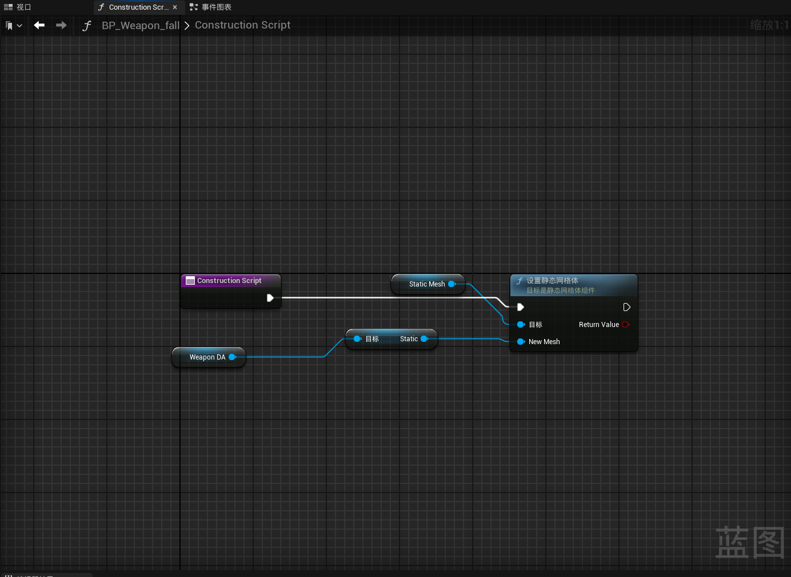

> 事件图表，就是在设置类函数的执行流程，比如这里三个就是默认就有的三个函数，这里做了在第一次执行时，把静态网格体的物理模拟打开

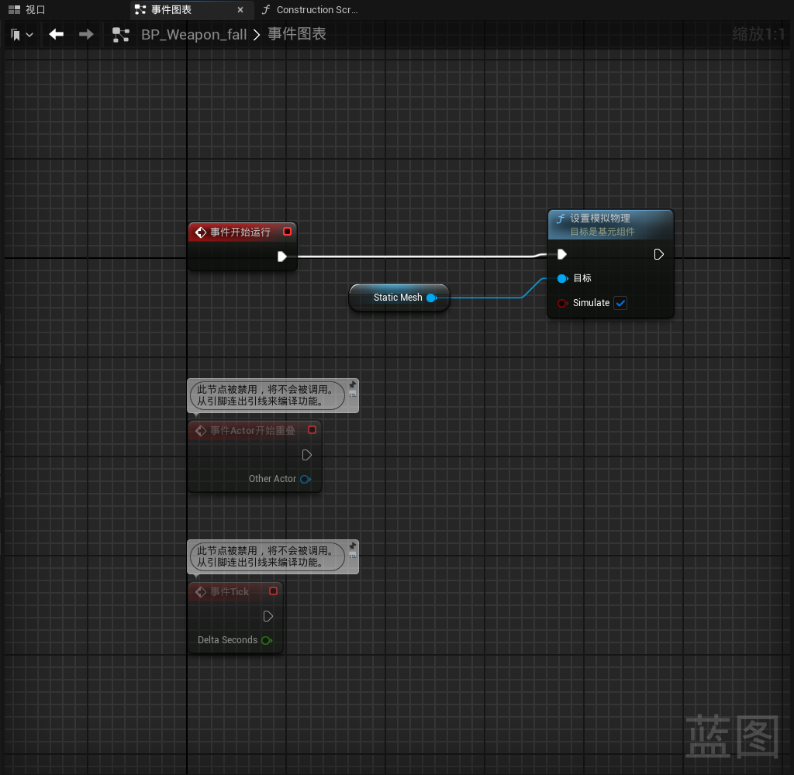

## 宏

> 蓝图中定义的宏相当于设置了一个函数

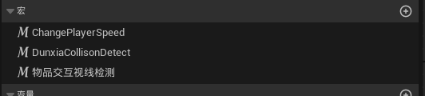

## 蓝图接口

> 和C++的纯虚类一样，定义函数

其他蓝图可以在类设置中添加接口，把这些函数进行实现

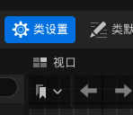

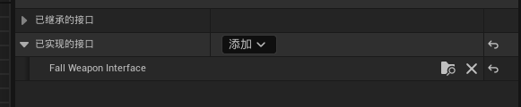

## 数据资产	

> 目前看起来就是一个结构体，用来定义一些属性的合集

定义武器资产的属性，只有一些变量

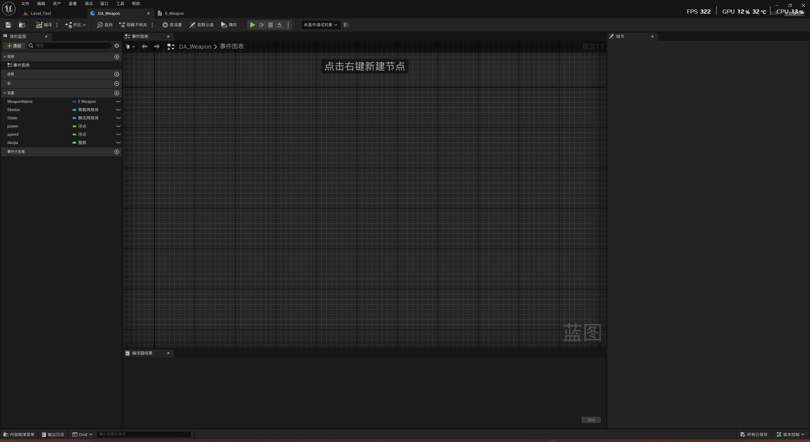

## 枚举

> UE有直接可以用的enum

这里用于定义武器类型的枚举

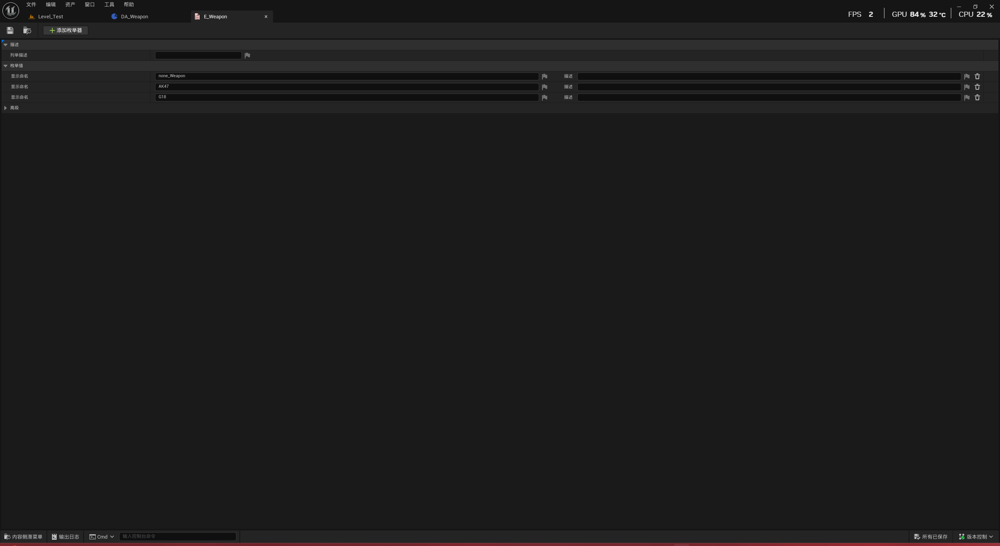

目前的结构就是武器类数据资产，有两个子类用来定义每种武器的属性

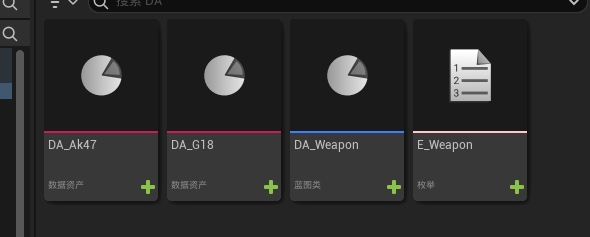

# 物理

## 碰撞

>  在 UE 中，碰撞有三个核心属性

1️⃣ **Collision Enabled（碰撞启用）**

- None → 不参与碰撞
- Query Only → 只参与射线 / 检测，不会阻挡物理
- Physics Only → 只参与物理模拟阻挡，不可被射线检测
- Query and Physics → 射线检测 + 阻挡

2️⃣ **Object Type（对象类型）**

- 定义这个组件是什么类型的对象
- 比如 WorldStatic / WorldDynamic / Pawn / Camera / Vehicle …

3️⃣ **Collision Response（碰撞响应）**

- 对不同 Object Type 的响应
- Block → 阻挡
- Overlap → 触发重叠事件
- Ignore → 忽略

>  碰撞预设（Collision Presets）就是组合好的快捷方式

- **BlockAll** → 对所有类型都阻挡
- **Pawn** → 对玩家阻挡，对其他忽略
- **PhysicsActor** → 对物理物体阻挡，对射线可检测
- **Custom** → 自己手动设置 Object Type 和 Response

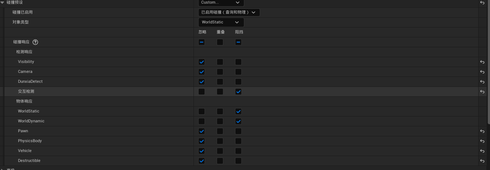

## 通道

> 用于指定射线检测“想看哪类对象”
>
> 系统自带：
>
> - Visibility → 可视检测（枪瞄准、视线）
> - Camera → 摄像机遮挡检测
>
> 可以自定义 Trace Channel（Project Settings → Collision → Trace Channels）
>
> 通道相当于指定一种射线查询类型，射线查询即使命中某个actor，也不会返回，先看看是不是对这个通道有响应，有响应才会算检测到

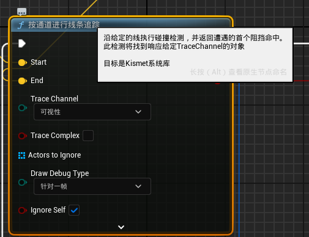

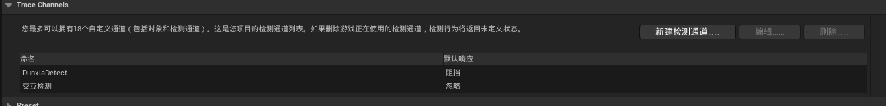

当某个Mesh的交互检测通道设置为阻挡时，才会被这个通道的射线检测到

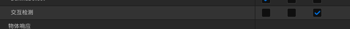

## 物理表面

> 用于物理材质，物理材质又应用于材质

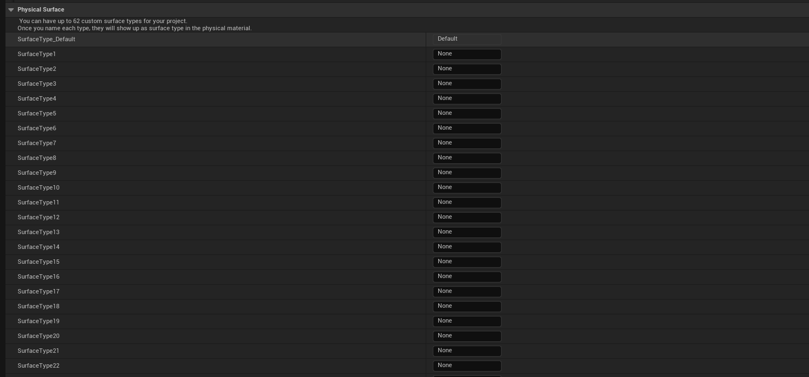

物理材质是一个可创建的资产对象

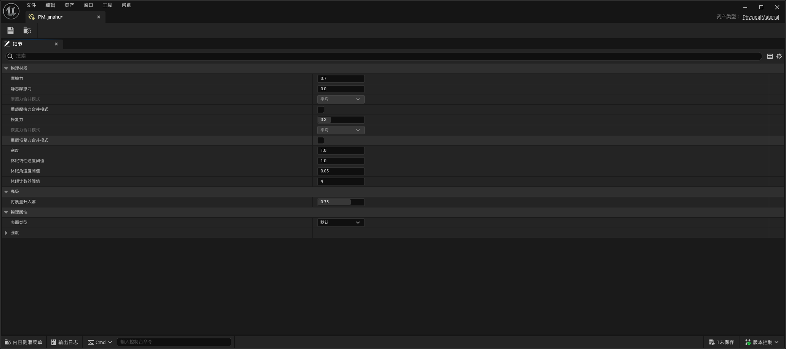

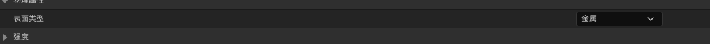这一项的设置就来自上边在项目设置中设置的自定义物理表面

这个东西是设置在材质设置中的

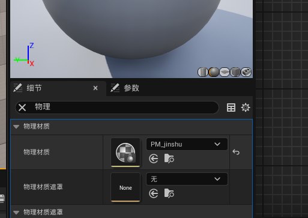

# Mesh

## 骨骼插槽

> Socket = 骨骼上的一个挂点（Transform），可以附加 Static Mesh、Skeletal Mesh、粒子、光源等物体。

# 动画

## 动画蒙太奇

