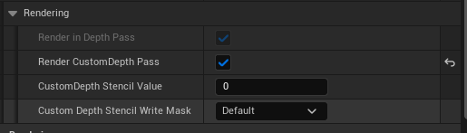
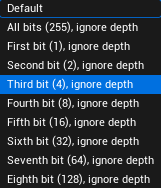
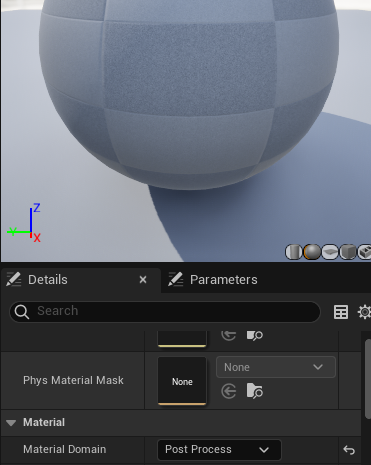
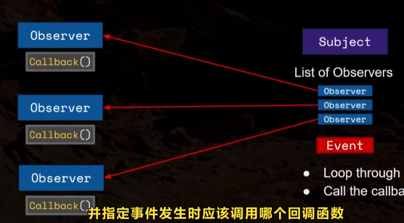
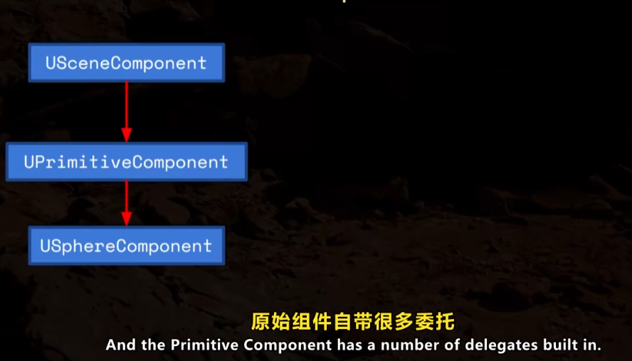

+++date = '2025-12-20T16:09:45+08:00'
draft = true
title = 'UE客户端学习'
categories = ["虚幻引擎"]
tags = ["UE源码"]
+++

> 一边实现一款RPG游戏，一边学习UE的使用
>
> 参考教程：https://www.bilibili.com/video/BV1L7JczbEwZ?spm_id_from=333.788.player.switch&vd_source=9df9034e2f1978b1018f5b387ec3eacd&p=14

# 渲染相关

## CustomDepth Pass

带有Mesh的Entity可以开启这个功能，开启后可以设置这个Mesh的Stencil和深度写入	

它就是额外增加一个DepthPass，只渲染开启的Mesh,可以选择一个Mesh的模板值，而且可以设置Mask，指定只写入模板的哪一位

使用时，创建一个后处理材质，可以获取这张帖图蓝图结点来使用

可以用来个Mesh描边

# 委托

观察者模式

一个Subject维护一个观察者的List，当Subject的事件触发时，遍历list，调用每个观察者自己的回调函数

UE的委托就是这里收集List的Subject

UPrimitiveComponent本身带了很多委托

## GAS系统

1. PlayerState
