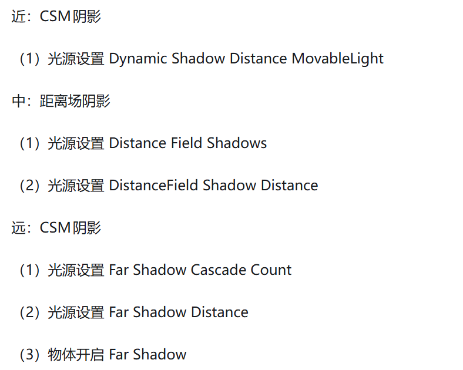
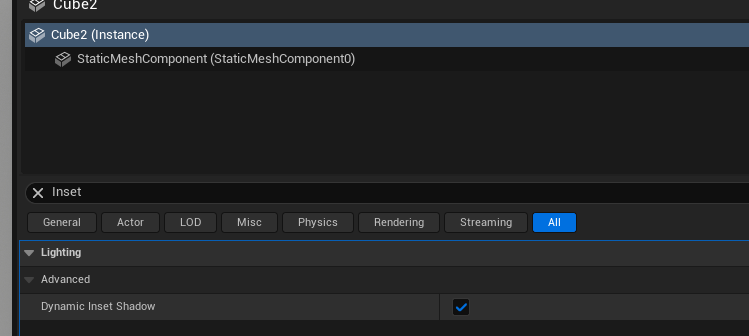

+++
date = '2026-01-03T19:32:37+08:00'
draft = true
title = 'UE客户端（光影）'
+++

# 定向光的阴影

> **根据物体离摄像机的距离，可以应用三种不同的阴影**

距离场本身记录的信息是每个体素到距离最近的Mesh的距离，   RayMarch时，根据当前位置的距离场信息就能知道是否击中了物体。所以距离场阴影本质上和RT阴影思路是一样的

Mesh可以开启自己的**`PerObjectShadow`**，精度很高，但是需要实时计算，不会预计算

