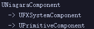
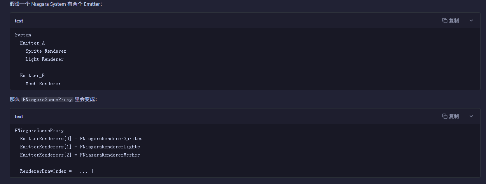
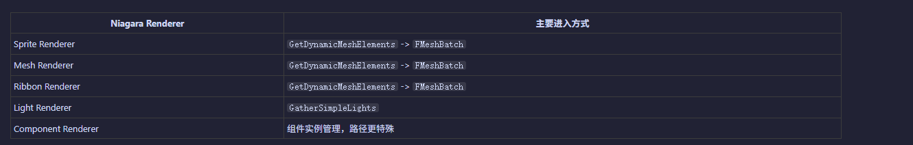

+++
date = '2026-06-15T18:33:45+08:00'
draft = false
title = 'UE源码学习（Niagara System）'
categories = ["虚幻引擎"]
tags = ["UE源码"]
+++

# Niagara System
## UNiagaraComponent
它继承自UPrimitiveComponent，所以会进行渲染


```cpp
class NIAGARA_API UNiagaraComponent : public UFXSystemComponent{

    // NS的实例，控制粒子计算
	TUniquePtr<FNiagaraSystemInstance> SystemInstance;

    // 在这个组件Tick时，会驱动SystemInstance计算更新 （注意：Solo的走这里，不是Solo的有一个批量的Tick） 
	virtual void TickComponent(float DeltaTime, enum ELevelTick TickType, FActorComponentTickFunction* ThisTickFunction) override; // 内部会	check(SystemInstance->IsSolo());

    // 组件注册时，创建渲染状态（创建FNiagaraSceneProxy，发送动态数据）
	virtual void CreateRenderState_Concurrent(FRegisterComponentContext* Context) override;

    // 创建代理
	virtual FPrimitiveSceneProxy* CreateSceneProxy() override;
}


```
> 代理对象

```cpp
class NIAGARA_API FNiagaraSceneProxy : public FPrimitiveSceneProxy
{
private:
	// 每个发射器的Renderer，会在创建Proxy时，创建
	TArray<FNiagaraRenderer*> EmitterRenderers;
	
	// Renderer 的绘制顺序
	TArray<int32> RendererDrawOrder;

	NiagaraEmitterInstanceBatcher* Batcher = nullptr;
}


```

> FNiagaraRenderer 记录每个发射器设置的渲染器,四种渲染器对于四种FNiagaraRenderer的子类


> 在CreateRenderState_Concurrent中，会执行	SendRenderDynamicData_Concurrent();
```cpp
void UNiagaraComponent::CreateRenderState_Concurrent(FRegisterComponentContext* Context)
{
	Super::CreateRenderState_Concurrent(Context);
	// The emitter instance may not tick again next frame so we send the dynamic data here so that the current state
	// renders.  This can happen when while editing, or any time the age update mode is set to desired age.
	SendRenderDynamicData_Concurrent();
}
```
在SendRenderDynamicData_Concurrent内部会遍历每个发射器下的每个Renderer，执行它的
`NewData = Renderer->GenerateDynamicData(NiagaraProxy, Properties, EmitterInst);`并设置到渲染线程

## 渲染流程
> 在标准渲染流程中，UE Renderer 收集场景 Primitive 时，会调用 FPrimitiveSceneProxy::GetDynamicMeshElements，就会进入NS的GetDynamicMeshElements,此时NS系统会向渲染器注册MeshBatch，进入渲染流程
> 所有粒子系统和其他可渲染组件原来是一样的
```cpp
void FNiagaraSceneProxy::GetDynamicMeshElements(const TArray<const FSceneView*>& Views, const FSceneViewFamily& ViewFamily, uint32 VisibilityMap, FMeshElementCollector& Collector) const
{
	SCOPE_CYCLE_COUNTER(STAT_NiagaraOverview_RT);
	SCOPE_CYCLE_COUNTER(STAT_NiagaraComponentGetDynamicMeshElements);

#if STATS
	FScopeCycleCounter SystemStatCounter(SystemStatID);
#endif

	for (int32 RendererIdx : RendererDrawOrder)
	{
		FNiagaraRenderer* Renderer = EmitterRenderers[RendererIdx]; // 这就是前边的每个渲染器组织
		if (Renderer && (Renderer->GetSimTarget() != ENiagaraSimTarget::GPUComputeSim || FNiagaraUtilities::AllowGPUParticles(ViewFamily.GetShaderPlatform())))
		{
			Renderer->GetDynamicMeshElements(Views, ViewFamily, VisibilityMap, Collector, this);  // 实际会进入每个Renderer自己的GetDynamicMeshElements，内部就是收集MeshBatches
		}
	}

	if (ViewFamily.EngineShowFlags.Particles && ViewFamily.EngineShowFlags.Niagara)
	{
		for (int32 ViewIndex = 0; ViewIndex < Views.Num(); ViewIndex++)
		{
			if (VisibilityMap & (1 << ViewIndex))
			{
				RenderBounds(Collector.GetPDI(ViewIndex), ViewFamily.EngineShowFlags, GetBounds(), IsSelected());
				if (HasCustomOcclusionBounds())
				{
					RenderBounds(Collector.GetPDI(ViewIndex), ViewFamily.EngineShowFlags, GetCustomOcclusionBounds(), IsSelected());
				}
			}
		}
	}
}
```
并不是所有Renderer都走这个路径，LightRenderer走GatherSimpleLights，组件Renderer更特殊
