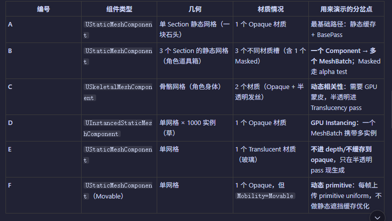
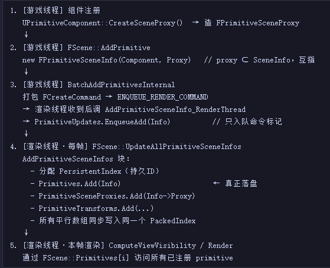
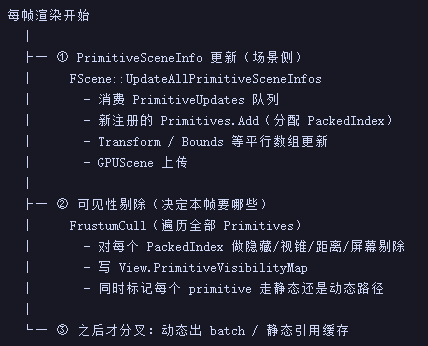
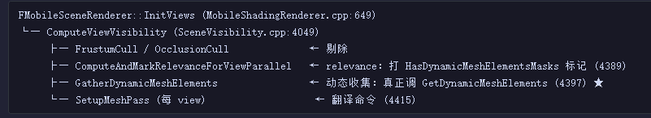
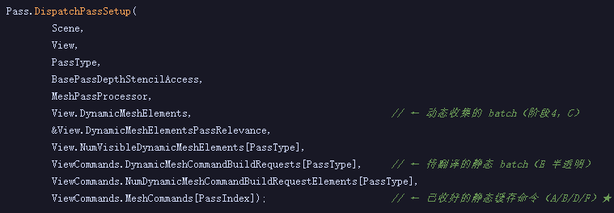
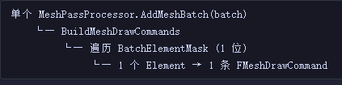
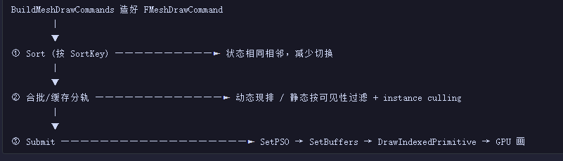

+++
date = '2026-07-19T16:36:45+08:00'
draft = false
title = 'UE源码学习（Mesh流转）'
categories = ["虚幻引擎"]
tags = ["UE源码"]
+++
# 各种情形

# 游戏线程创建Proxy，同步到渲染线程



每个继承自UPrimitiveComponent的Component都可以定义自己的Proxy，Proxy用于表示这个组件在渲染器的代表

```cpp
/**
 * Creates a proxy to represent the primitive to the scene manager in the rendering thread.
 * @return The proxy object.
 */
virtual FPrimitiveSceneProxy* CreateSceneProxy()
{
    return NULL;
}
```

比如StaticMeshComponent

```c++
FPrimitiveSceneProxy* FStaticMeshComponentHelper::CreateSceneProxy(T& Component, FStaticMeshComponentHelper::ESceneProxyCreationError* OutError)
{
UStaticMesh* StaticMesh = Component.GetStaticMesh();

auto SetError = [OutError](FStaticMeshComponentHelper::ESceneProxyCreationError InError)
{
    if (OutError)
    {
        *OutError = InError;
    }
};

if constexpr (!bAssumeRenderDataIsReady)
{
    if (StaticMesh == nullptr)
    {
        UE_LOG(LogStaticMesh, Verbose, TEXT("Skipping CreateSceneProxy for StaticMeshComponent %s (StaticMesh is null)"), *UObjectHelper::GetFullNameIfAvailable(Component));
        SetError(ESceneProxyCreationError::InvalidMesh);
        return nullptr;
    }

    // Prevent accessing the RenderData during async compilation. The RenderState will be recreated when compilation finishes.
    if (StaticMesh->IsCompiling())
    {
        UE_LOG(LogStaticMesh, Verbose, TEXT("Skipping CreateSceneProxy for StaticMeshComponent %s (StaticMesh is not ready)"), *UObjectHelper::GetFullNameIfAvailable(Component));
        SetError(ESceneProxyCreationError::MeshCompiling);
        return nullptr;
    }

    if (StaticMesh->GetRenderData() == nullptr)
    {
        UE_LOG(LogStaticMesh, Verbose, TEXT("Skipping CreateSceneProxy for StaticMeshComponent %s (RenderData is null)"), *UObjectHelper::GetFullNameIfAvailable(Component));
        SetError(ESceneProxyCreationError::InvalidMesh);
        return nullptr;
    }

    if (!StaticMesh->GetRenderData()->IsInitialized())
    {
        UE_LOG(LogStaticMesh, Verbose, TEXT("Skipping CreateSceneProxy for StaticMeshComponent %s (RenderData is not initialized)"), *UObjectHelper::GetFullNameIfAvailable(Component));
        SetError(ESceneProxyCreationError::InvalidMesh);
        return nullptr;
    }
}
else
{
    check(StaticMesh);
    check(!StaticMesh->IsCompiling());
    check(StaticMesh->GetRenderData());
    check(StaticMesh->GetRenderData()->IsInitialized());		
}

EPSOPrecachePriority PSOPrecachePriority = GetStaticMeshComponentBoostPSOPrecachePriority();
if (Component.CheckPSOPrecachingAndBoostPriority(PSOPrecachePriority) && GetPSOPrecacheProxyCreationStrategy() == EPSOPrecacheProxyCreationStrategy::DelayUntilPSOPrecached)
{
    UE_LOG(LogStaticMesh, Verbose, TEXT("Skipping CreateSceneProxy for StaticMeshComponent %s (Static mesh component PSOs are still compiling)"), *UObjectHelper::GetFullNameIfAvailable(Component));
    SetError(ESceneProxyCreationError::WaitingPSOs);
    return nullptr;
}

const bool bIsMaskingAllowed = Nanite::IsMaskingAllowed(Component.GetWorld(), Component.GetForceNaniteForMasked());

Nanite::FMaterialAudit NaniteMaterials{};

// Is Nanite supported, and is there built Nanite data for this static mesh?
const bool bUseNanite = Component.ShouldCreateNaniteProxy(&NaniteMaterials);

if (bUseNanite)
{
    // Nanite is fully supported
    return Component.CreateStaticMeshSceneProxy(NaniteMaterials, true);
}

// If we didn't get a proxy, but Nanite was enabled on the asset when it was built, evaluate proxy creation
if (Component.HasValidNaniteData())
{
    if (NaniteMaterials.IsValid(bIsMaskingAllowed))
    {
        const bool bAllowProxyRender = Nanite::GetProxyRenderMode() == Nanite::EProxyRenderMode::Allow
#if WITH_EDITORONLY_DATA
            // Check for specific case of static mesh editor "proxy toggle"
            || (Component.IsDisplayNaniteFallbackMesh() && Nanite::GetProxyRenderMode() == Nanite::EProxyRenderMode::AllowForDebugging)
#endif
            ;

        if (!bAllowProxyRender) // Never render proxies
        {
            // We don't want to fall back to Nanite proxy rendering, so just make the mesh invisible instead.
            return nullptr;
        }
    }

    // Fall back to rendering Nanite proxy meshes with traditional static mesh scene proxies

    FSceneInterface* Scene = Component.GetScene();
    const EShaderPlatform ShaderPlatform = Scene ? Scene->GetShaderPlatform() : GMaxRHIShaderPlatform;

    // TODO: handle Nanite representation being overriden using OnGetNaniteResources
    // for now need to check UStaticMesh::HasValidNaniteData() directly here
    const bool bFallbackGenerated = !StaticMesh->HasValidNaniteData() || StaticMesh->HasNaniteFallbackMesh(ShaderPlatform);

    if (!bFallbackGenerated)
    {
        // TODO: automatically enable fallback on the static mesh asset?

        UE_LOG(LogStaticMesh, Warning, TEXT("Unable to create a proxy for StaticMeshComponent [%s] because it doesn't have a fallback mesh."), *UObjectHelper::GetFullNameIfAvailable(Component));
        SetError(ESceneProxyCreationError::InvalidMesh);
        return nullptr;
    }
}

// Validate the LOD resources here
const FStaticMeshLODResourcesArray& LODResources = StaticMesh->GetRenderData()->LODResources;
const int32 SMCurrentMinLOD = StaticMesh->GetMinLODIdx();
const int32 EffectiveMinLOD = Component.GetOverrideMinLOD() ? FMath::Max(Component.GetMinLOD(), SMCurrentMinLOD) : SMCurrentMinLOD;
if (LODResources.Num() == 0 || LODResources[FMath::Clamp<int32>(EffectiveMinLOD, 0, LODResources.Num() - 1)].VertexBuffers.StaticMeshVertexBuffer.GetNumVertices() == 0)
{
    UE_LOG(LogStaticMesh, Verbose, TEXT("Skipping CreateSceneProxy for StaticMeshComponent %s (LOD problems)"), *UObjectHelper::GetFullNameIfAvailable(Component));
    SetError(ESceneProxyCreationError::InvalidMesh);
    return nullptr;
}

return Component.CreateStaticMeshSceneProxy(NaniteMaterials, false);
}
```

创建完的Proxy会包在一个FPrimitiveSceneInfo中

```c++
// Create the primitive scene info.
FPrimitiveSceneInfo* PrimitiveSceneInfo = new FPrimitiveSceneInfo(Primitive, this);
PrimitiveSceneProxy->PrimitiveSceneInfo = PrimitiveSceneInfo;

```

之后会入队一个命令，用来在渲染线程传入新添加的FPrimitiveSceneInfo到FScene的PrimitiveUpdates （到这里渲染线程就知道这批渲染资源了）

```c++
void FScene::AddPrimitiveSceneInfo_RenderThread(FPrimitiveSceneInfo* PrimitiveSceneInfo, const TOptional<FTransform>& PreviousTransform)
{
	// Must always be a novel primitive that is added
	check(PrimitiveSceneInfo->PackedIndex == INDEX_NONE);
	PrimitiveUpdates.EnqueueAdd(PrimitiveSceneInfo);

	if (PreviousTransform.IsSet())
	{
		PrimitiveUpdates.Enqueue<FUpdateOverridePreviousTransformData>(PrimitiveSceneInfo, FUpdateOverridePreviousTransformData(PreviousTransform.GetValue().ToMatrixWithScale()));
	}
}
```

# UpdateAllPrimitiveSceneInfos
在每帧开始时会用FScene::UpdateAllPrimitiveSceneInfos 处理这个update数组，放在真正的FScene::Primitives中

## 静态路径缓存
此时会对静态Mesh进行缓存（proxy提供自己的MeshBatch，翻译为FMeshDrawCommand并进行缓存），同时也标记好了每个StaticMeshBatch的StaticMeshRelevances
```c++
UpdateAllPrimitiveSceneInfos (RendererScene.cpp:3878)
  └─ FPrimitiveSceneInfo::AddToScene (PrimitiveSceneInfo.cpp:645)
       ├─ AddStaticMeshes (530)
       │    ├─ Proxy->DrawStaticElements (StaticMeshRender.cpp:1120)  ← 产出 FStaticMeshBatch
       │    └─ CacheMeshDrawCommands (224)                            ← 预翻译成 FMeshDrawCommand
       └─ 加入 FScene 各种加速结构（八叉树、GPUScene primitive buffer 等）
```
在Proxy->DrawStaticElements时，就会让Proxy吐出StaticMeshBatch
比如内部
``` c++
if (MeshBatch.xxxx)
{
    FMeshBatch HairBlendMeshBatch;
    HairBlendMeshBatch.Clone(MeshBatch);
    HairBlendMeshBatch.bSMGHairBlend = true;
    PDI->DrawMesh(HairBlendMeshBatch, FLT_MAX);  // 每次调用都会输出一个新的MeshBatch
}
```
之后在PDI->DrawMesh内部会根据材质进行StaticMeshRelevances的设置（其实就是一些常用的判断存储起来）

# 可见性剔除



对于每个View，都会组织一个View.PrimitiveVisibilityMap，存储每个PrimitiveInfo的可见性。

**`PrimitiveVisibilityMap` 的下标就是 `FScene::Primitives` 的下标，两者一一对应**

# ComputeAndMarkRelevanceForViewParallel
对primitive根据各种情况进行分流，动态路径的收集还没开始，只是打了个标记

# 动态路径收集



此时每个Proxy就可以提供自己需要渲染的动态MeshBatch

# MeshProcessor
收集后开始调用SetupMeshPass，内部会dispatch，多个Pass的MeshProcessor并行运行


绝大多数情况MeshBatch只有一个Element，所以只会生成一个FMeshDrawCommand



# 排序与合批
发生在每个SetupPass线程的末尾
同时还会进行排序和合批，  在各个Pass进行中直接Submit整理好的MeshDrawCommand

  （TODO）
