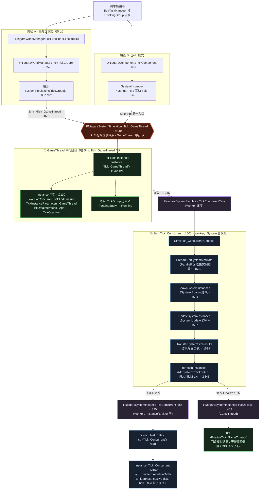
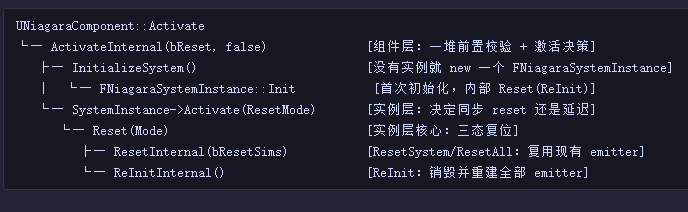

+++
date = '2026-06-15T18:33:45+08:00'
draft = false
title = 'UE源码学习（Niagara System）'
categories = ["虚幻引擎"]
tags = ["UE源码"]
+++

# Niagara System
## UNiagaraComponent
它继承自UPrimitiveComponent，所以会进行渲染


```cpp
class NIAGARA_API UNiagaraComponent : public UFXSystemComponent{

    // NS的实例，控制粒子计算
	TUniquePtr<FNiagaraSystemInstance> SystemInstance;

    // 在这个组件Tick时，会驱动SystemInstance计算更新 （注意：Solo的走这里，不是Solo的有一个批量的Tick） 
	virtual void TickComponent(float DeltaTime, enum ELevelTick TickType, FActorComponentTickFunction* ThisTickFunction) override; // 内部会	check(SystemInstance->IsSolo());

    // 组件注册时，创建渲染状态（创建FNiagaraSceneProxy，发送动态数据）
	virtual void CreateRenderState_Concurrent(FRegisterComponentContext* Context) override;

    // 创建代理
	virtual FPrimitiveSceneProxy* CreateSceneProxy() override;

	// NS资产对应的一个到这个component的实例
	TUniquePtr<FNiagaraSystemInstance> SystemInstance;

}


```
## GameTick
> Niagara的GameTick分为两种模式，一种是Solo， 走自己的UNiagaraComponent::TickComponent，另外一种走批量，走FNiagaraWorldManager::Tick。并行处理同一个NS资产下的所有实例。
> 他们的tick最终都会落到FNiagaraSystemSimulation::Tick_GameThread。下面是整体架构



```cpp
void FNiagaraSystemSimulation::Tick_Concurrent(FNiagaraSystemSimulationTickContext& Context)
{
	SCOPE_CYCLE_COUNTER(STAT_NiagaraSystemSim_TickCNC);
	SCOPE_CYCLE_COUNTER(STAT_NiagaraOverview_GT_CNC);
	CSV_SCOPED_TIMING_STAT_EXCLUSIVE(Effects);
	LLM_SCOPE(ELLMTag::Niagara);

	FScopeCycleCounterUObject AdditionalScope(Context.System, GET_STATID(STAT_NiagaraOverview_GT_CNC));

	FNiagaraSystemInstance* SoloSystemInstance = bIsSolo && Context.Instances.Num() == 1 ? Context.Instances[0] : nullptr;

	FNiagaraCrashReporterScope CRScope(this);

	if (bCanExecute && Context.Instances.Num())
	{
		if (GbDumpSystemData || Context.System->bDumpDebugSystemInfo)
		{
			UE_LOG(LogNiagara, Log, TEXT("=========================================================="));
			UE_LOG(LogNiagara, Log, TEXT("Niagara System Sim Tick_Concurrent(): %s"), *Context.System->GetName());
			UE_LOG(LogNiagara, Log, TEXT("=========================================================="));
		}

		FScopeCycleCounter SystemStatCounter(Context.System->GetStatID(true, true));

		for (FNiagaraSystemInstance* SystemInstance : Context.Instances)
		{
			SystemInstance->TickInstanceParameters_Concurrent();
		}
		
		// 跑System脚本
		PrepareForSystemSimulate(Context);

		if (Context.SpawnNum > 0)
		{
			SpawnSystemInstances(Context);
		}

		UpdateSystemInstances(Context);

		TransferSystemSimResults(Context);

		// 整理每个Instance到TickBatch，内部每4个为一批，Flush一次
		for (FNiagaraSystemInstance* Instance : Context.Instances)
		{
			AddSystemToTickBatch(Instance, Context);
		}
		FlushTickBatch(Context);

		// When not running async we can finalize straight away
		if ( !Context.IsRunningAsync() )
		{
			check(IsInGameThread());
			int32 InstanceIndex = 0;
			while (InstanceIndex < Context.Instances.Num())
			{
				FNiagaraSystemInstance* Instance = Context.Instances[InstanceIndex];
				Instance->FinalizeTick_GameThread();

				// Finalize can complete the instance and potentially reactivate
				if (Context.Instances.IsValidIndex(InstanceIndex) && (Context.Instances[InstanceIndex] == Instance))
				{
					++InstanceIndex;
				}

				check(Context.DataSet.GetCurrentDataChecked().GetNumInstances() == Context.Instances.Num());
			}
		}

	#if WITH_EDITORONLY_DATA
		if (SoloSystemInstance)
		{
			SoloSystemInstance->FinishCapture();
		}
	#endif

		INC_DWORD_STAT_BY(STAT_NiagaraNumSystems, Context.Instances.Num());
	}
}
```
在Sim跑Tick_Concurrent内部，会并发对每个Instance执行Tick_Concurrent
```cpp
void FNiagaraSystemInstance::Tick_Concurrent(bool bEnqueueGPUTickIfNeeded)
{
	SCOPE_CYCLE_COUNTER(STAT_NiagaraSystemInst_TickCNC);
	SCOPE_CYCLE_COUNTER(STAT_NiagaraOverview_GT_CNC);
	CSV_SCOPED_TIMING_STAT_EXCLUSIVE(Effects);
	LLM_SCOPE(ELLMTag::Niagara);
	FScopeCycleCounterUObject AdditionalScope(GetSystem(), GET_STATID(STAT_NiagaraOverview_GT_CNC));

	FNiagaraCrashReporterScope CRScope(this);

	// Reset values that will be accumulated during emitter tick.
	TotalGPUParamSize = 0;
	ActiveGPUEmitterCount = 0;
	GPUParamIncludeInterpolation = false;
	UNiagaraSystem* System = GetSystem();

	if (IsComplete() || System == nullptr || CachedDeltaSeconds < SMALL_NUMBER)
	{
		return;
	}

	const int32 NumEmitters = Emitters.Num();
	const TConstArrayView<FNiagaraEmitterExecutionIndex> EmitterExecutionOrder = GetEmitterExecutionOrder();
	checkSlow(EmitterExecutionOrder.Num() <= NumEmitters);

	//Determine if any of our emitters should be ticking.
	TBitArray<TInlineAllocator<8>> EmittersShouldTick;
	EmittersShouldTick.Init(false, NumEmitters);

	bool bHasTickingEmitters = false;
	for (const FNiagaraEmitterExecutionIndex& EmitterExecIdx : EmitterExecutionOrder)
	{
		FNiagaraEmitterInstance& Inst = Emitters[EmitterExecIdx.EmitterIndex].Get();
		if (Inst.ShouldTick())
		{
			bHasTickingEmitters = true;
			EmittersShouldTick.SetRange(EmitterExecIdx.EmitterIndex, 1, true);
		}
	}

	if ( !bHasTickingEmitters )
	{
		return;
	}

	FScopeCycleCounter SystemStat(System->GetStatID(true, true));

	for (const FNiagaraEmitterExecutionIndex& EmitterExecIdx : EmitterExecutionOrder)
	{
		if (EmittersShouldTick[EmitterExecIdx.EmitterIndex])
		{
			FNiagaraEmitterInstance& Inst = Emitters[EmitterExecIdx.EmitterIndex].Get();
			Inst.PreTick();
		}
	}

	int32 TotalCombinedParamStoreSize = 0;

	// now tick all emitters
	for (const FNiagaraEmitterExecutionIndex& EmitterExecIdx : EmitterExecutionOrder)
	{
		FNiagaraEmitterInstance& Inst = Emitters[EmitterExecIdx.EmitterIndex].Get();
		if (EmittersShouldTick[EmitterExecIdx.EmitterIndex])
		{
        	Inst.Tick(CachedDeltaSeconds);   // ← 真正的粒子模拟！
		}

		if (Inst.GetCachedEmitter() && Inst.GetCachedEmitter()->SimTarget == ENiagaraSimTarget::GPUComputeSim && !Inst.IsComplete())
		{
			// Handle edge case where an emitter was set to inactive on the first frame by scalability
			// Since it will not tick we should not execute a GPU tick for it, this test must be symeterical with FNiagaraGPUSystemTick::Init
			const bool bIsInactive = (Inst.GetExecutionState() == ENiagaraExecutionState::Inactive) || (Inst.GetExecutionState() == ENiagaraExecutionState::InactiveClear);
			if (Inst.HasTicked() || !bIsInactive)
			{
				if (const FNiagaraComputeExecutionContext* GPUContext = Inst.GetGPUContext())
				{
					TotalCombinedParamStoreSize += GPUContext->CombinedParamStore.GetPaddedParameterSizeInBytes();
					GPUParamIncludeInterpolation = GPUContext->HasInterpolationParameters || GPUParamIncludeInterpolation;
					ActiveGPUEmitterCount++;
				}
			}
		}
	}

	if (ActiveGPUEmitterCount)
	{
		const int32 InterpFactor = GPUParamIncludeInterpolation ? 2 : 1;

		TotalGPUParamSize = InterpFactor * (sizeof(FNiagaraGlobalParameters) + sizeof(FNiagaraSystemParameters) + sizeof(FNiagaraOwnerParameters));
		TotalGPUParamSize += InterpFactor * ActiveGPUEmitterCount * sizeof(FNiagaraEmitterParameters);
		TotalGPUParamSize += TotalCombinedParamStoreSize;
	}

	// Update local bounds
	if ( System->bFixedBounds )
	{
		LocalBounds = System->GetFixedBounds();
	}
	else
	{
		FBox NewLocalBounds(EForceInit::ForceInit);
		for (const auto& Emitter : Emitters)
		{
			NewLocalBounds += Emitter->GetBounds();
		}

		if (NewLocalBounds.IsValid)
		{
			LocalBounds = NewLocalBounds.ExpandBy(NewLocalBounds.GetExtent() * GNiagaraBoundsExpandByPercent);				
		}
		else
		{
			LocalBounds = FBox(FVector::ZeroVector, FVector::ZeroVector);
		}
	}

	//Enqueue a GPU tick for this sim if we're allowed to do so from a concurrent thread.
	//If we're batching our tick passing we may still need to enqueue here if not called from the regular async task. The caller will tell us with bEnqueueGPUTickIfNeeded.
	FNiagaraSystemSimulation* Sim = SystemSimulation.Get();
	check(Sim);
	ENiagaraGPUTickHandlingMode Mode = Sim->GetGPUTickHandlingMode();
	if (Mode == ENiagaraGPUTickHandlingMode::Concurrent || (Mode == ENiagaraGPUTickHandlingMode::ConcurrentBatched && bEnqueueGPUTickIfNeeded))
	{
		GenerateAndSubmitGPUTick();
	}
}
```
之后会串行执行每个EmitterInstance的Tick
在内部会并行tick所有粒子


## 渲染

```cpp
class NIAGARA_API FNiagaraSceneProxy : public FPrimitiveSceneProxy
{
private:
	// 每个发射器的Renderer，会在创建Proxy时，创建
	TArray<FNiagaraRenderer*> EmitterRenderers;
	
	// Renderer 的绘制顺序
	TArray<int32> RendererDrawOrder;

	NiagaraEmitterInstanceBatcher* Batcher = nullptr;
}


```

> FNiagaraRenderer 记录每个发射器设置的渲染器,四种渲染器对于四种FNiagaraRenderer的子类


> 在CreateRenderState_Concurrent中，会执行	SendRenderDynamicData_Concurrent();
```cpp
void UNiagaraComponent::CreateRenderState_Concurrent(FRegisterComponentContext* Context)
{
	Super::CreateRenderState_Concurrent(Context);
	// The emitter instance may not tick again next frame so we send the dynamic data here so that the current state
	// renders.  This can happen when while editing, or any time the age update mode is set to desired age.
	SendRenderDynamicData_Concurrent();
}
```
在SendRenderDynamicData_Concurrent内部会遍历每个发射器下的每个Renderer，执行它的
`NewData = Renderer->GenerateDynamicData(NiagaraProxy, Properties, EmitterInst);`并设置到渲染线程

## 渲染流程
> 在标准渲染流程中，UE Renderer 收集场景 Primitive 时，会调用 FPrimitiveSceneProxy::GetDynamicMeshElements，就会进入NS的GetDynamicMeshElements,此时NS系统会向渲染器注册MeshBatch，进入渲染流程
> 所有粒子系统和其他可渲染组件原来是一样的
```cpp
void FNiagaraSceneProxy::GetDynamicMeshElements(const TArray<const FSceneView*>& Views, const FSceneViewFamily& ViewFamily, uint32 VisibilityMap, FMeshElementCollector& Collector) const
{
	SCOPE_CYCLE_COUNTER(STAT_NiagaraOverview_RT);
	SCOPE_CYCLE_COUNTER(STAT_NiagaraComponentGetDynamicMeshElements);

#if STATS
	FScopeCycleCounter SystemStatCounter(SystemStatID);
#endif

	for (int32 RendererIdx : RendererDrawOrder)
	{
		FNiagaraRenderer* Renderer = EmitterRenderers[RendererIdx]; // 这就是前边的每个渲染器组织
		if (Renderer && (Renderer->GetSimTarget() != ENiagaraSimTarget::GPUComputeSim || FNiagaraUtilities::AllowGPUParticles(ViewFamily.GetShaderPlatform())))
		{
			Renderer->GetDynamicMeshElements(Views, ViewFamily, VisibilityMap, Collector, this);  // 实际会进入每个Renderer自己的GetDynamicMeshElements，内部就是收集MeshBatches
		}
	}

	if (ViewFamily.EngineShowFlags.Particles && ViewFamily.EngineShowFlags.Niagara)
	{
		for (int32 ViewIndex = 0; ViewIndex < Views.Num(); ViewIndex++)
		{
			if (VisibilityMap & (1 << ViewIndex))
			{
				RenderBounds(Collector.GetPDI(ViewIndex), ViewFamily.EngineShowFlags, GetBounds(), IsSelected());
				if (HasCustomOcclusionBounds())
				{
					RenderBounds(Collector.GetPDI(ViewIndex), ViewFamily.EngineShowFlags, GetCustomOcclusionBounds(), IsSelected());
				}
			}
		}
	}
}
```
并不是所有Renderer都走这个路径，LightRenderer走GatherSimpleLights，组件Renderer更特殊


## Niagara生命周期
### Activate
