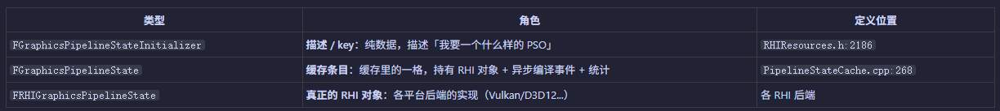
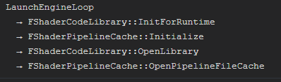
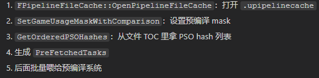

+++
date = '2026-06-12T20:04:41+08:00'
draft = false
title = 'UE源码学习（PSO编译）'
categories = ["虚幻引擎"]
tags = ["UE源码"]
+++
# PSO编译
## PSO对象

> FGraphicsPipelineStateInitializer描述一个PSO对象
```cpp
	FGraphicsPipelineStateInitializer()
		: BlendState(nullptr)
		, RasterizerState(nullptr)
		, DepthStencilState(nullptr)
		, RenderTargetsEnabled(0)
		, RenderTargetFormats(PF_Unknown)
		, RenderTargetFlags(0)
		, DepthStencilTargetFormat(PF_Unknown)
		, DepthStencilTargetFlag(0)
		, DepthTargetLoadAction(ERenderTargetLoadAction::ENoAction)
		, DepthTargetStoreAction(ERenderTargetStoreAction::ENoAction)
		, StencilTargetLoadAction(ERenderTargetLoadAction::ENoAction)
		, StencilTargetStoreAction(ERenderTargetStoreAction::ENoAction)
		, NumSamples(0)
		, SubpassHint(ESubpassHint::None)
		, SubpassIndex(0)
		, bDepthBounds(false)
		, MultiViewCount(0)
		, bHasFragmentDensityAttachment(false)
		, ShadingRate(EVRSShadingRate::VRSSR_1x1)
		, Flags(0)
	{
#if PLATFORM_WINDOWS
		static_assert(sizeof(TRenderTargetFormats::ElementType) == sizeof(uint8/*EPixelFormat*/), "Change TRenderTargetFormats's uint8 to EPixelFormat's size!");
		static_assert(sizeof(TRenderTargetFlags::ElementType) == sizeof(uint32/*ETextureCreateFlags*/), "Change TRenderTargetFlags's uint32 to ETextureCreateFlags's size!");
#endif
		static_assert(PF_MAX < MAX_uint8, "TRenderTargetFormats assumes EPixelFormat can fit in a uint8!");
	}

```

> FGraphicsPipelineState 持有RHI层的PSO指针
```cpp
class FGraphicsPipelineState : public FPipelineState
{
public:
	FGraphicsPipelineState() 
	{
	}

	virtual bool IsCompute() const
	{
		return false;
	}

	TRefCountPtr<FRHIGraphicsPipelineState> RHIPipeline;
#if PIPELINESTATECACHE_VERIFYTHREADSAFE
	FThreadSafeCounter InUseCount;
#endif
};
```
> FRHIGraphicsPipelineState 代表RHI抽象PSO
```cpp
class FRHIGraphicsPipelineState : public FRHIResource 
{
#if ENABLE_RHI_VALIDATION
	friend class FValidationContext;
	friend class FValidationRHI;
	FExclusiveDepthStencil DSMode;
#endif
};
```

## 设置PSO
> 在RDG.AddPass中会创建一个FGraphicsPipelineStateInitializer来填充字段，再调用SetGraphicsPipelineState来设置PSO
```cpp
GraphBuilder.AddPass(
		RDG_EVENT_NAME("Tonemapper %dx%d (PS)", OutputViewport.Extent.X, OutputViewport.Extent.Y),
		PSShaderParameters,
		ERDGPassFlags::Raster,
		[VertexShader, VSShaderParameters, PixelShader, PSShaderParameters, OutputViewport](FRHICommandList& RHICmdList)
	{
		RHICmdList.SetViewport(OutputViewport.Rect.Min.X, OutputViewport.Rect.Min.Y, 0.0f, OutputViewport.Rect.Max.X, OutputViewport.Rect.Max.Y, 1.0f);

		FGraphicsPipelineStateInitializer GraphicsPSOInit;
		RHICmdList.ApplyCachedRenderTargets(GraphicsPSOInit);

		GraphicsPSOInit.BlendState = TStaticBlendState<>::GetRHI();
		GraphicsPSOInit.RasterizerState = TStaticRasterizerState<>::GetRHI();
		GraphicsPSOInit.DepthStencilState = TStaticDepthStencilState<false, CF_Always>::GetRHI();

		GraphicsPSOInit.BoundShaderState.VertexDeclarationRHI = GFilterVertexDeclaration.VertexDeclarationRHI;
		GraphicsPSOInit.BoundShaderState.VertexShaderRHI = VertexShader.GetVertexShader();
		GraphicsPSOInit.BoundShaderState.PixelShaderRHI = PixelShader.GetPixelShader();
		GraphicsPSOInit.PrimitiveType = PT_TriangleList;

		SetGraphicsPipelineState(RHICmdList, GraphicsPSOInit);

		SetShaderParameters(RHICmdList, VertexShader, VertexShader.GetVertexShader(), *VSShaderParameters);
		SetShaderParameters(RHICmdList, PixelShader, PixelShader.GetPixelShader(), *PSShaderParameters);

		DrawRectangle(
			RHICmdList,
			0, 0,
			OutputViewport.Extent.X, OutputViewport.Extent.Y,
			0, 0,
			OutputViewport.Rect.Width(), OutputViewport.Rect.Height(),
			OutputViewport.Extent,
			OutputViewport.Extent,
			VertexShader,
			EDRF_UseTriangleOptimization);
	});
```

> Set的流程就是先插缓存，查到就调用RHI的指令去写入SetPSO的操作
``` cpp
void SetGraphicsPipelineState(FRHICommandList& RHICmdList, const FGraphicsPipelineStateInitializer& Initializer, EApplyRendertargetOption ApplyFlags, bool bApplyAdditionalState)
{
	FGraphicsPipelineState* PipelineState = PipelineStateCache::GetAndOrCreateGraphicsPipelineState(RHICmdList, Initializer, ApplyFlags);   // 获取Cache或者创建PSO
	if (PipelineState && (PipelineState->RHIPipeline || !Initializer.bFromPSOFileCache))
	{
		check(IsInRenderingThread() || IsInParallelRenderingThread());
		RHICmdList.SetGraphicsPipelineState(PipelineState, Initializer.BoundShaderState, bApplyAdditionalState); // RHI层去执行SetPSO
	}
}
```

> 具体的存取缓存操作，这里涉及到了异步CreatePSO的操作，但也需要在RHI翻译前把这个操作做完，保证本帧渲染正确
```cpp
FGraphicsPipelineState* PipelineStateCache::GetAndOrCreateGraphicsPipelineState(FRHICommandList& RHICmdList, const FGraphicsPipelineStateInitializer& OriginalInitializer, EApplyRendertargetOption ApplyFlags)
{
	LLM_SCOPE(ELLMTag::PSO);

	checkf(OriginalInitializer.BoundShaderState.VertexShaderRHI, TEXT("GraphicsPipelineState must include a vertex shader"));

	FGraphicsPipelineStateInitializer NewInitializer;
	const FGraphicsPipelineStateInitializer* Initializer = &OriginalInitializer;

	check(OriginalInitializer.DepthStencilState && OriginalInitializer.BlendState && OriginalInitializer.RasterizerState);

	bool DoAsyncCompile = IsAsyncCompilationAllowed(RHICmdList);

	FGraphicsPipelineState* OutCachedState = nullptr;

	bool bWasFound = GGraphicsPipelineCache.Find(*Initializer, OutCachedState);   // 查缓存   HashMap

	if (bWasFound == false)
	{
		FPipelineFileCache::CacheGraphicsPSO(GetTypeHash(*Initializer), *Initializer);  // 没找到先缓存一下

		// create new graphics state
		OutCachedState = new FGraphicsPipelineState();
		OutCachedState->Stats = FPipelineFileCache::RegisterPSOStats(GetTypeHash(*Initializer));   // 先登记，用于导出.upipelinecache

		// 异步或者实时创建PSO   这里的异步是指RHI线程翻译命令之前，需要等待PSO创建完成。 对于画面来说还是同步的
		// create a compilation task, or just do it now...
		if (DoAsyncCompile)
		{
			OutCachedState->CompletionEvent = TGraphTask<FCompilePipelineStateTask>::CreateTask().ConstructAndDispatchWhenReady(OutCachedState, *Initializer);
			RHICmdList.AddDispatchPrerequisite(OutCachedState->CompletionEvent);
		}
		else
		{
			OutCachedState->RHIPipeline = RHICreateGraphicsPipelineState(*Initializer);
			if(!OutCachedState->RHIPipeline)
			{
				HandlePipelineCreationFailure(*Initializer);
			}
		}

		// GGraphicsPipelineCache.Add(*Initializer, OutCachedState, LockFlags);
		GGraphicsPipelineCache.Add(*Initializer, OutCachedState);
	}
	else
	{
		if (DoAsyncCompile)
		{
			FGraphEventRef& CompletionEvent = OutCachedState->CompletionEvent;
			if ( CompletionEvent.IsValid() && !CompletionEvent->IsComplete() )
			{
				RHICmdList.AddDispatchPrerequisite(CompletionEvent);
			}
		}

#if PSO_TRACK_CACHE_STATS
		OutCachedState->AddHit();
#endif
	}

	// return the state pointer
	return OutCachedState;
}

```

## PSO Cache
> UE的PSO Caching中不会直接保存Shader代码（不管是源代码或是编译好的二进制Shader)，也不保存Shader的路径，它保存的是Shader路径的SHA1 Hash做为Shader唯一的索引，真正的Shader是由FShaderCodeLibrary管理。

读取.upipelinecache的路径


在执行编译任务时，RHI层会读取磁盘上的PSO缓存，来参与创建PSO对象
## PSO改进
1. 原生PSO编译可以选择异步，但是必须在RHI翻译前等待异步编译完成，也就是说本帧渲染时必须准备好，可以改成真正异步编译，减少PSO编译导致的卡顿