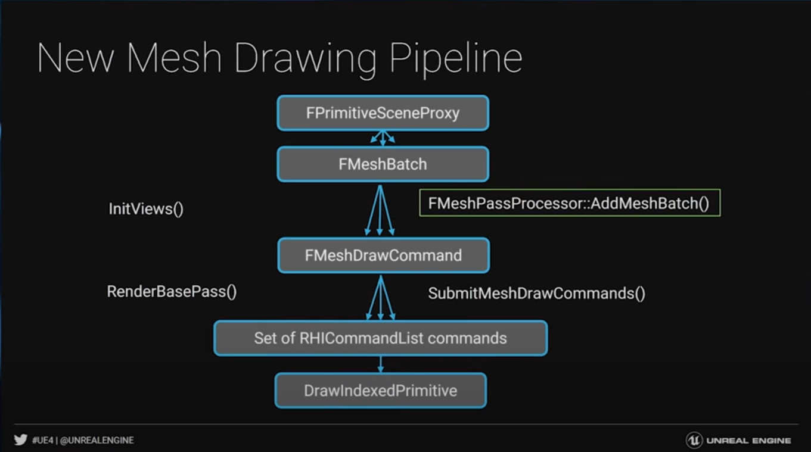
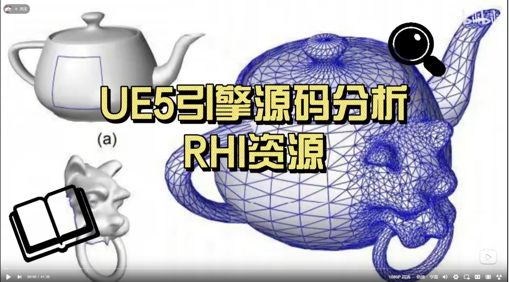

+++
date = '2025-11-13T20:22:40+08:00'
draft = false
title = '初识UE源码（RHI）'
categories = ["Engines/UE"]
tags = ["UE源码"]
image = 'image-20251121130145117.png'
+++


# 向下

## FRHIResource

> /** The base type of RHI resources. */

~~~c++
const ERHIResourceType ResourceType; // 说明了那些被认为是RHI资源
enum ERHIResourceType : uint8
{
	RRT_None,

	RRT_SamplerState,
	RRT_RasterizerState,
	RRT_DepthStencilState,
	RRT_BlendState,
	RRT_VertexDeclaration,
	RRT_VertexShader,
	RRT_MeshShader,
	RRT_AmplificationShader,
	RRT_PixelShader,
	RRT_GeometryShader,
	RRT_RayTracingShader,
	RRT_ComputeShader,
	RRT_GraphicsPipelineState,
	RRT_ComputePipelineState,
	RRT_RayTracingPipelineState,
	RRT_BoundShaderState,
	RRT_UniformBufferLayout,
	RRT_UniformBuffer,
	RRT_Buffer,
	RRT_Texture,
	// @todo: texture type unification - remove these
	RRT_Texture2D,
	RRT_Texture2DArray,
	RRT_Texture3D,
	RRT_TextureCube,
	// @todo: texture type unification - remove these
	RRT_TextureReference,
	RRT_TimestampCalibrationQuery,
	RRT_GPUFence,
	RRT_RenderQuery,
	RRT_RenderQueryPool,
	RRT_Viewport,
	RRT_UnorderedAccessView,
	RRT_ShaderResourceView,
	RRT_RayTracingAccelerationStructure,
	RRT_RayTracingShaderBindingTable,
	RRT_StagingBuffer,
	RRT_CustomPresent,
	RRT_ShaderLibrary,
	RRT_PipelineBinaryLibrary,
	RRT_ShaderBundle,
	RRT_WorkGraphShader,
	RRT_WorkGraphPipelineState,
	RRT_StreamSourceSlot,
	RRT_ResourceCollection,

	RRT_Num
};

~~~

`ERHIResourceType` 枚举包含的资源类型可归纳为以下大类：

1. 渲染状态资源（管线状态配置类）
2. 着色器及相关资源（各类着色器程序与绑定布局类）
3. 缓冲与数据存储资源（数据载体及布局描述类）
4. 纹理及纹理访问资源（图像数据及访问接口类）
5. 光线追踪专用资源（光线追踪加速与绑定类）
6. 查询与同步资源（GPU/CPU 交互及数据查询类）
7. 其他辅助资源（视口、自定义呈现、资源集合等）

这里的每个实现都用子类实现

```c++
class FRHIUniformBuffer : public FRHIResource
#if ENABLE_RHI_VALIDATION
	, public RHIValidation::FUniformBufferResource
#endif
{
public:
	FRHIUniformBuffer() = delete;
    ...
}
```

再进一步就到了具体API的子类

```c++
class FVulkanUniformBuffer : public FRHIUniformBuffer
{
public:
	FVulkanUniformBuffer(FVulkanDevice& Device, const FRHIUniformBufferLayout* InLayout, const void* Contents, EUniformBufferUsage InUsage, EUniformBufferValidation Validation);
	virtual ~FVulkanUniformBuffer();
	...
}
```

其他资源都一样的继承思路

这套架构已经简单实现

## FDynamicRHI

> 类似创建操作(上下文无关操作)是在FDynamicRHI，上下文有关的操作（也就是在固定生命周期内执行的操作）是在IRHICommandContext

一些图形渲染场景的操作API都定义在这里，创建shader、更新纹理等等

```c++
/** The interface which is implemented by the dynamically bound RHI. */
class FDynamicRHI
{
public:
	using FRHICalcTextureSizeResult = ::FRHICalcTextureSizeResult;

	/** Declare a virtual destructor, so the dynamic RHI can be deleted without knowing its type. */
	RHI_API virtual ~FDynamicRHI();

	/** Initializes the RHI; separate from IDynamicRHIModule::CreateRHI so that GDynamicRHI is set when it is called. */
	virtual void Init() = 0;

	/** Called after the RHI is initialized; before the render thread is started. */
	virtual void PostInit() {}

	/** Shutdown the RHI; handle shutdown and resource destruction before the RHI's actual destructor is called (so that all resources of the RHI are still available for shutdown). */
	virtual void Shutdown() = 0;

	virtual const TCHAR* GetName() = 0;

	virtual ERHIInterfaceType GetInterfaceType() const { return ERHIInterfaceType::Hidden; }
	virtual FDynamicRHI* GetNonValidationRHI() { return this; }

	/** Called after PostInit to initialize the pixel format info, which is needed for some commands default implementations */
	void InitPixelFormatInfo(const TArray<uint32>& PixelFormatBlockBytesIn)
	{
		PixelFormatBlockBytes = PixelFormatBlockBytesIn;
	}

	/////// RHI Methods

	RHI_API virtual void RHIEndFrame_RenderThread(FRHICommandListImmediate& RHICmdList);

	struct FRHIEndFrameArgs
	{
		// Increments once per call to RHIEndFrame
		uint32 FrameNumber;

#if WITH_RHI_BREADCRUMBS
		const TRHIPipelineArray<FRHIBreadcrumbNode*>& GPUBreadcrumbs;
#endif
	};
	virtual void RHIEndFrame(const FRHIEndFrameArgs& Args) = 0;

	// FlushType: Thread safe
	virtual FSamplerStateRHIRef RHICreateSamplerState(const FSamplerStateInitializerRHI& Initializer) = 0;

	// FlushType: Thread safe
	virtual FRasterizerStateRHIRef RHICreateRasterizerState(const FRasterizerStateInitializerRHI& Initializer) = 0;

	// FlushType: Thread safe
	virtual FDepthStencilStateRHIRef RHICreateDepthStencilState(const FDepthStencilStateInitializerRHI& Initializer) = 0;

	// FlushType: Thread safe
	virtual FBlendStateRHIRef RHICreateBlendState(const FBlendStateInitializerRHI& Initializer) = 0;

	// FlushType: Wait RHI Thread
	virtual FVertexDeclarationRHIRef RHICreateVertexDeclaration(const FVertexDeclarationElementList& Elements) = 0;

	// FlushType: Wait RHI Thread
	virtual FPixelShaderRHIRef RHICreatePixelShader(TArrayView<const uint8> Code, const FSHAHash& Hash) = 0;

	// FlushType: Wait RHI Thread
	virtual FVertexShaderRHIRef RHICreateVertexShader(TArrayView<const uint8> Code, const FSHAHash& Hash) = 0;

	// FlushType: Wait RHI Thread
	virtual FGeometryShaderRHIRef RHICreateGeometryShader(TArrayView<const uint8> Code, const FSHAHash& Hash) = 0;

	// FlushType: Wait RHI Thread
	virtual FMeshShaderRHIRef RHICreateMeshShader(TArrayView<const uint8> Code, const FSHAHash& Hash)
      
    ...
}
```


封装了渲染所需的核心资源创建与管理逻辑，包括：

- 缓冲（顶点缓冲、索引缓冲、常量缓冲等）的创建 / 更新 / 销毁；
- 纹理（2D 纹理、立方体贴图等）的加载 / 格式转换 / 内存管理；
- 渲染管线状态（着色器、混合状态、深度测试等）的配置与绑定；
- 绘制命令（Draw Call）的提交与执行。

## IRHICommandContext

> 定义上下文相关的操作，比如RHIDispatchComputeShader，这明显需要在Pass中间调用。`RHIDrawPrimitive``RHIDrawPrimitiveIndirect``RHIDrawIndexedIndirect`这些，内部都是虚函数，由具体平台实现

```c++
/** The interface RHI command context. Sometimes the RHI handles these. On platforms that can processes command lists in parallel, it is a separate object. */
class IRHICommandContext : public IRHIComputeContext
{
public:
	virtual ~IRHICommandContext()
	{
	}

	virtual ERHIPipeline GetPipeline() const override
	{
		return ERHIPipeline::Graphics;
	}

	virtual void RHIDispatchComputeShader(uint32 ThreadGroupCountX, uint32 ThreadGroupCountY, uint32 ThreadGroupCountZ) = 0;
	...
}
```

进入API层，类内部都会有一个用于定义当前上下文的对象，比如FVulkanCommandListContext,在执行上边那些命令时，会使用Manager来获得当前激活的commandBuffer来记录命令

```c++
	class FVulkanCommandListContext : public IRHICommandContext{
        ...
    private:
        ...
        FVulkanCommandBufferManager* CommandBufferManager;
        ...
    }

```

当创建一个IRHICommandContext时，在Vulkan中就是创建一个新的CommandBuffer

```c++
// Create CommandBufferManager, contain all active buffers
CommandBufferManager = new FVulkanCommandBufferManager(InDevice, this);
CommandBufferManager->Init(this);
```

# 向上

## FRHICommand

> UE的命令是用链表串起来的

```c++
struct FRHICommandBase
{
	FRHICommandBase* Next = nullptr;  // 命令是链表连起来的
	virtual void ExecuteAndDestruct(FRHICommandListBase& CmdList) = 0; // 具体执行方法
};

// 封装了lambda来执行命令
template <typename RHICmdListType, typename LAMBDA>
struct TRHILambdaCommand final : public FRHICommandBase
{
	LAMBDA Lambda;
#if CPUPROFILERTRACE_ENABLED
	const TCHAR* Name;
#endif

	TRHILambdaCommand(LAMBDA&& InLambda, const TCHAR* InName)
		: Lambda(Forward<LAMBDA>(InLambda))
#if CPUPROFILERTRACE_ENABLED
		, Name(InName)
#endif
	{}

	void ExecuteAndDestruct(FRHICommandListBase& CmdList) override final
	{
		TRACE_CPUPROFILER_EVENT_SCOPE_TEXT_ON_CHANNEL(Name, RHICommandsChannel);
		Lambda(*static_cast<RHICmdListType*>(&CmdList));
		Lambda.~LAMBDA();
	}
};
```

FRHICommand继承Base后只添加了一个函数 （调用命令）

```c++
template<typename TCmd, typename NameType = FUnnamedRhiCommand>
struct FRHICommand : public FRHICommandBase
{
	void ExecuteAndDestruct(FRHICommandListBase& CmdList) override final
	{
		LLM_SCOPE_BYNAME(TEXT("RHIMisc/CommandList/ExecuteAndDestruct"));
		TRACE_CPUPROFILER_EVENT_SCOPE_ON_CHANNEL_STR(NameType::TStr(), RHICommandsChannel);

		TCmd* ThisCmd = static_cast<TCmd*>(this);
		ThisCmd->Execute(CmdList);   // 调用命令
		ThisCmd->~TCmd(); // 释放命令
	}
};
```

再下一层就是各种具体命令 比如FRHICommandSetShaderParameters、FRHICommandSetViewport等等，每个具体命令都有一个Execute方法

```c++
void FRHICommandDrawPrimitive::Execute(FRHICommandListBase& CmdList)
{
	RHISTAT(DrawPrimitive);
	INTERNAL_DECORATOR(RHIDrawPrimitive)(BaseVertexIndex, NumPrimitives, NumInstances);
}

void FRHICommandDrawIndexedPrimitive::Execute(FRHICommandListBase& CmdList)
{
	RHISTAT(DrawIndexedPrimitive);
	INTERNAL_DECORATOR(RHIDrawIndexedPrimitive)(IndexBuffer, BaseVertexIndex, FirstInstance, NumVertices, StartIndex, NumPrimitives, NumInstances);
}

void FRHICommandSetBlendFactor::Execute(FRHICommandListBase& CmdList)
{
	RHISTAT(SetBlendFactor);
	INTERNAL_DECORATOR(RHISetBlendFactor)(BlendFactor);
}

void FRHICommandSetStreamSource::Execute(FRHICommandListBase& CmdList)
{
	RHISTAT(SetStreamSource);
	INTERNAL_DECORATOR(RHISetStreamSource)(StreamIndex, VertexBuffer, Offset);
}

void FRHICommandSetViewport::Execute(FRHICommandListBase& CmdList)
{
	RHISTAT(SetViewport);
	INTERNAL_DECORATOR(RHISetViewport)(MinX, MinY, MinZ, MaxX, MaxY, MaxZ);
}
```

再下面就是各个API具体的实现了

## FRHICommandList

它内部的函数也是这种API，根据情况`Bypass()`选择直接调用API还是把命令缓存起来

```c++
FORCEINLINE_DEBUGGABLE void DrawPrimitive(uint32 BaseVertexIndex, uint32 NumPrimitives, uint32 NumInstances)
{
	//check(IsOutsideRenderPass());
	if (Bypass())
	{
		GetContext().RHIDrawPrimitive(BaseVertexIndex, NumPrimitives, NumInstances);
		return;
	}
	ALLOC_COMMAND(FRHICommandDrawPrimitive)(BaseVertexIndex, NumPrimitives, NumInstances);
}
```

主要看两个指针

```c++
class FRHICommandListBase{
    protected:
	FRHICommandBase*    Root            = nullptr;  // 命令链表的起始
	FRHICommandBase**   CommandLink     = nullptr; // 命令结束的位置，用于添加新命令
}

// 新建一个命令的流程
FORCEINLINE_DEBUGGABLE void* AllocCommand(int32 AllocSize, int32 Alignment)
{
    checkSlow(!IsExecuting());
    checkfSlow(!Bypass(), TEXT("Invalid attempt to record commands in bypass mode."));
    FRHICommandBase* Result = (FRHICommandBase*) MemManager.Alloc(AllocSize, Alignment);  // 内存中申请空间
    ++NumCommands;
    *CommandLink = Result; 
    CommandLink = &Result->Next;  // 其实就是链表添加一个尾结点的操作
    return Result;
}
```

Base下一层FRHIComputeCommandList

```c++
class FRHIComputeCommandList : public FRHICommandListBase{}
```

再下一层才是FRHICommandList。听了UE的RHI介绍视频，我觉得这样设计是因为渲染Queue可以进行渲染命令也可以是计算命令（我现在自己的项目的ComputeShader都是放在渲染Queue中进行的）。是有包含关系的。

```c++
class FRHICommandList : public FRHIComputeCommandList
```

再下一层是立即模式

```c++
class FRHICommandListImmediate : public FRHICommandList
```

> 再进到API层面还有封装

# Mesh的DrawCall流程

> 数据流转：
>
> FPrimitiveSceneProxy->FMeshBatch->FMeshDrawCommand->RHICommandList->GPU



## FMeshDrawCommand

> 存储渲染一个Mesh的具体信息，粒度是DrawCall级别的了，上层的收集工作目的就是生成各种FMeshDrawCommand，FMeshDrawCommand进一步才转化成RHI层指令（CommandList）

```c++
class FMeshDrawCommand
{
public:
	
	/**
	 * Resource bindings
	 */
	FMeshDrawShaderBindings ShaderBindings;  // 着色器顶点输入信息
	FVertexInputStreamArray VertexStreams; // 顶点数据
	FRHIBuffer* IndexBuffer; // 索引数据
    
	/**
	 * PSO
	 */
	FGraphicsMinimalPipelineStateId CachedPipelineId; // PSO
    
     /**
	 * Draw command parameters    三角形相关信息
	 */
	uint32 FirstIndex;
	uint32 NumPrimitives;
	uint32 NumInstances;   // 实例数量，这也就是说DrawCommand对应的是一个SubMesh的所有实例

    /** Submits commands to the RHI Commandlist to draw the MeshDrawCommand. */
    /** 提交这个DrawCall到CommandList **/
static bool SubmitDraw(
	const FMeshDrawCommand& RESTRICT MeshDrawCommand,
	const FGraphicsMinimalPipelineStateSet& GraphicsMinimalPipelineStateSet,
	const FMeshDrawCommandSceneArgs& SceneArgs,
	uint32 InstanceFactor,
	FRHICommandList& CommandList,
	class FMeshDrawCommandStateCache& RESTRICT StateCache);
 .....   
}

```

SubmitDraw主要是一个Begin和一个End组成

```c++
// SubmitDraw的实现
bool FMeshDrawCommand::SubmitDraw(
	const FMeshDrawCommand& RESTRICT MeshDrawCommand,
	const FGraphicsMinimalPipelineStateSet& GraphicsMinimalPipelineStateSet,
	const FMeshDrawCommandSceneArgs& SceneArgs,
	uint32 InstanceFactor,
	FRHICommandList& RHICmdList,
	FMeshDrawCommandStateCache& RESTRICT StateCache)
{
#if WANTS_DRAW_MESH_EVENTS
	RHI_BREADCRUMB_EVENT_CONDITIONAL(RHICmdList, GShowMaterialDrawEvents != 0, "%s %s (%u instances)"
		, MeshDrawCommand.DebugData.MaterialRenderProxy->GetMaterialName()
		, MeshDrawCommand.DebugData.ResourceName
		, MeshDrawCommand.NumInstances * InstanceFactor
	);
#endif

	bool bAllowSkipDrawCommand = true;
	if (SubmitDrawBegin(MeshDrawCommand, GraphicsMinimalPipelineStateSet, SceneArgs, InstanceFactor, RHICmdList, StateCache, bAllowSkipDrawCommand))
	{
		SubmitDrawEnd(MeshDrawCommand, SceneArgs, InstanceFactor, RHICmdList);
		return true;
	}

	return false;
}
// Begin 调用RHI设置各种参数
bool FMeshDrawCommand::SubmitDrawBegin(
	const FMeshDrawCommand& RESTRICT MeshDrawCommand, 
	const FGraphicsMinimalPipelineStateSet& GraphicsMinimalPipelineStateSet,
	const FMeshDrawCommandSceneArgs& SceneArgs,
	uint32 InstanceFactor,
	FRHICommandList& RHICmdList,
	FMeshDrawCommandStateCache& RESTRICT StateCache,
	bool bAllowSkipDrawCommand)
{
    // 1. PipeLineState的设置，下到RHI层
    RHICmdList.SetGraphicsPipelineState(PipelineState, Initializer.BoundShaderState, StencilRef, bApplyAdditionalState);
	.....
}

// End中主要就是调用RHI的DrawIndexedPrimitive（上层是把对应的Command存储的RHICommandList而已）
void FMeshDrawCommand::SubmitDrawEnd(const FMeshDrawCommand& MeshDrawCommand, const FMeshDrawCommandSceneArgs& SceneArgs, uint32 InstanceFactor, FRHICommandList& RHICmdList)
{
    .....
	if (MeshDrawCommand.IndexBuffer)
	{
		if (MeshDrawCommand.NumPrimitives > 0 && !bDoOverrideArgs)
		{
			RHICmdList.DrawIndexedPrimitive(
				MeshDrawCommand.IndexBuffer,
				MeshDrawCommand.VertexParams.BaseVertexIndex,
				0,
				MeshDrawCommand.VertexParams.NumVertices,
				MeshDrawCommand.FirstIndex,
				MeshDrawCommand.NumPrimitives,
				MeshDrawCommand.NumInstances * InstanceFactor
			);
		}
	.....
}
```


## FMeshBatch

> 比如相同材质、相同xxx的一组模型放在一个Batch，一个Batch有一组FMeshBatchElement，FmeshBatch由FSceneRenderer的Gatherxxx这个函数来收集，这个函数有一个参数是


MeshDrawCommand里没有材质信息，材质信息来自MeshBatch

## FMeshPassProcessor

> 上层收集组装成FMeshBatch，通过FMeshPassProcessor的BuildMeshDrawCommands来构建FMeshDrawCommand（有历史原因，4.22之前是没有FMeshDrawCommand的）

```cpp
// 代码里这个For可以看出来，Batch的每个element都变成了一个FMeshDrawCommand
for (int32 BatchElementIndex = 0; BatchElementIndex < NumElements; BatchElementIndex++)
{
	if ((1ull << BatchElementIndex) & BatchElementMask)
	{
		const FMeshBatchElement& BatchElement = MeshBatch.Elements[BatchElementIndex];
		FMeshDrawCommand& MeshDrawCommand = DrawListContext->AddCommand(SharedMeshDrawCommand, NumElements);
```

# RDG

## FRDGResource

> RDG层面也封装了一层Resource，其内部就是FRHIResource

```c++
/** Generic graph resource. */
class FRDGResource
{
    .....
private:
	FRHIResource* ResourceRHI = nullptr;
	.....
};
```

> FRDGTexture继承来自FRDGResource。但是在RDG层的Resource不能自己创建，必须统一经过RDGBuilder来创建

```c++
/** A render graph resource with an allocation lifetime tracked by the graph. May have child resources which reference it (e.g. views). */
class FRDGViewableResource
	: public FRDGResource
{
/** Render graph tracked Texture. */
class FRDGTexture final
	: public FRDGViewableResource
{....}
```


## FRDGPass

> 把一个Pass的渲染指令进行存储

## FRDGBuilder

> 比如贴图的创建需要RDGBuilder的CreateTexture来创建

```c++
RENDERCORE_API FRDGTextureRef CreateTexture(const FRDGTextureDesc& Desc, const TCHAR* Name, ERDGTextureFlags Flags = ERDGTextureFlags::None);
```

> 对于已经存在的资源，也需要通过RDGBuilder进行注册，生命周期不经过RDG管理

```c++
** Registers a external pooled render target texture to be tracked by the render graph. The name of the registered RDG texture is pulled from the pooled render target. */
RENDERCORE_API FRDGTextureRef RegisterExternalTexture(
    const TRefCountPtr<IPooledRenderTarget>& ExternalPooledTexture,
    ERDGTextureFlags Flags = ERDGTextureFlags::None);
```

> 一个Pass需要输出的资源需要经过Extraction来输出

```c++
	/** Queues a pooled render target extraction to happen at the end of graph execution. For graph-created textures, this extends
	 *  the lifetime of the GPU resource until execution, at which point the pointer is filled. If specified, the texture is transitioned
	 *  to the AccessFinal state, or kDefaultAccessFinal otherwise.
	 */
	RENDERCORE_API void QueueTextureExtraction(FRDGTextureRef Texture, TRefCountPtr<IPooledRenderTarget>* OutPooledTexturePtr, ERDGResourceExtractionFlags Flags = ERDGResourceExtractionFlags::None);
	RENDERCORE_API void QueueTextureExtraction(FRDGTextureRef Texture, TRefCountPtr<IPooledRenderTarget>* OutPooledTexturePtr, ERHIAccess AccessFinal, ERDGResourceExtractionFlags Flags = ERDGResourceExtractionFlags::None);
```

上面三种情况就定义了资源在一个Pass的创建、输入、输出设置

> 添加一个Pass到RDG，ExecuteLambda就是存储具体的渲染流程

```c++
template <typename ParameterStructType, typename ExecuteLambdaType>
FRDGPassRef AddPass(FRDGEventName&& Name, const ParameterStructType* ParameterStruct, ERDGPassFlags Flags, ExecuteLambdaType&& ExecuteLambda){
    // 创建一个Pass对象
    FRDGDispatchPass* Pass = Allocators.Root.AllocNoDestruct<DispatchPassType>(
	Forward<FRDGEventName&&>(Name),
	ParametersMetadata,
	ParameterStruct,
	OverridePassFlags(NameString, Flags),
	Forward<LaunchLambdaType&&>(LaunchLambda));

	IF_RDG_ENABLE_DEBUG(ClobberPassOutputs(Pass));
    // 存储Pass数组  	FRDGPassRegistry Passes;
	Passes.Insert(Pass);
    
    
    // 设置Pass的资源	
	SetupParameterPass(Pass);

}

// 收集Passzi
FRDGPass* FRDGBuilder::SetupParameterPass(FRDGPass* Pass)
{
	IF_RDG_ENABLE_DEBUG(UserValidation.ValidateAddPass(Pass, AuxiliaryPasses.IsActive()));
	CSV_SCOPED_TIMING_STAT_EXCLUSIVE_CONDITIONAL(RDGBuilder_SetupPass, GRDGVerboseCSVStats != 0);

#if RDG_EVENTS
	TOptional<TRDGEventScopeGuard<FRDGScope_RHI>> PassNameScope;
	if (ScopeState.ScopeMode == ERDGScopeMode::AllEventsAndPassNames)
	{
		FRDGEventName Name = Pass->GetEventName();
		PassNameScope.Emplace(*this, ERDGScopeFlags::None, FRHIBreadcrumbData(__FILE__, __LINE__, TStatId(), NAME_None), MoveTemp(Name));
	}
#endif

	SetupPassInternals(Pass);

	if (ParallelSetup.bEnabled)
	{
		MarkResourcesAsProduced(Pass);
		AsyncSetupQueue.Push(FAsyncSetupOp::SetupPassResources(Pass));
	}
	else
	{
		SetupPassResources(Pass);
	}

	SetupAuxiliaryPasses(Pass);
	return Pass;
}
```


