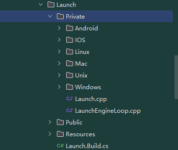
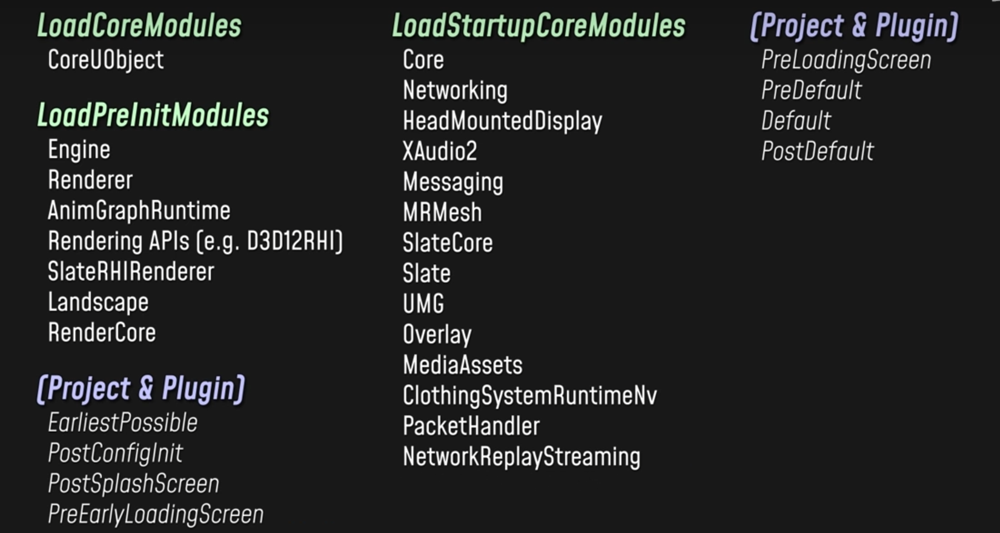
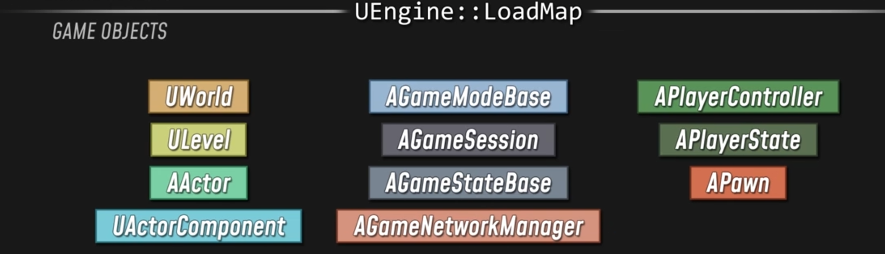

+++
date = '2026-01-28T13:38:19+08:00'
draft = true
title = 'UE源码学习（启动）'
+++

Launch中定义了各个平台的启动逻辑



然后他们都会进入`int32 GuardedMain( const TCHAR* CmdLine )`来执行main逻辑

首先是`int32 ErrorLevel = EnginePreInit( CmdLine );`，用于加载各种模块



然后进入`ErrorLevel = EngineInit();`

它创建了Engine实例

```c++
int32 FEngineLoop::Init(){
    ...
    GEngine = NewObject<UEngine>(GetTransientPackage(), EngineClass);
    ...
    GEngine->Init(this);

    
    // Call init callbacks   触发已完成引擎加载的委托
	{
		SCOPED_BOOT_TIMING("OnPostEngineInit.Broadcast");
		FCoreDelegates::OnPostEngineInit.Broadcast();
	}
    ...
}

```

Engine的Init函数创建一些对象


Engine类提供加载地图的流程`bool UEngine::LoadMap( FWorldContext& WorldContext, FURL URL, class UPendingNetGame* Pending, FString& Error )`



序列化文件中存储的就是UWorld这一列的数据（UWorld 、ULevel、AActor、UActorComponent）


```c++
// FWorldContext& WorldContext是一个全局的Context，新加载的Map会存储到这里
bool UEngine::LoadMap( FWorldContext& WorldContext, FURL URL, class UPendingNetGame* Pending, FString& Error ){
    // 加载UWorld
    ....

    // 注册世界中所有Actor以及他们的component，并执行他们的初始化
    WorldContext.World()->InitializeActorsForPlay(URL, true, &Context);
    ...

    // BeginPlay，调用所有Actor以及Component的BeginPlay
    WorldContext.World()->BeginPlay();

}
```

