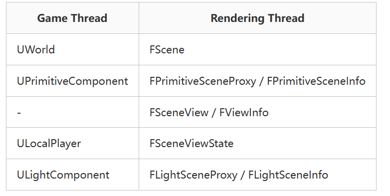
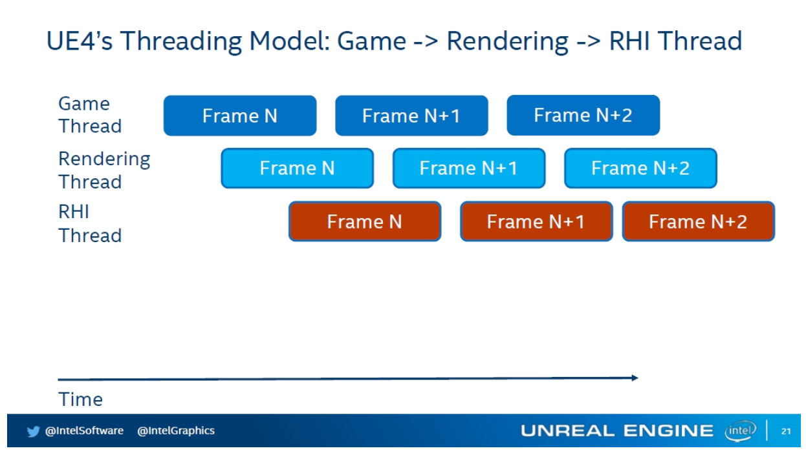
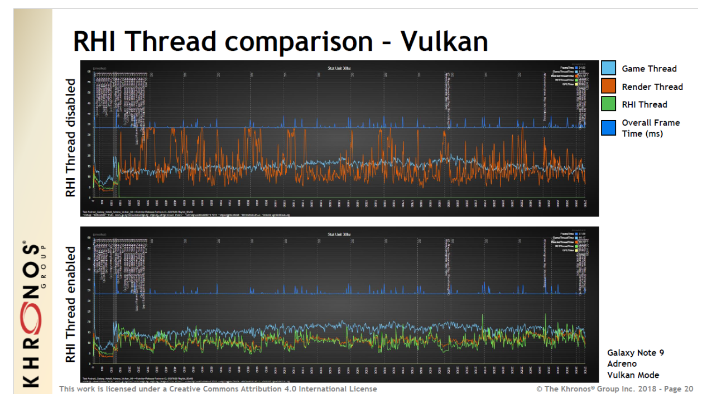
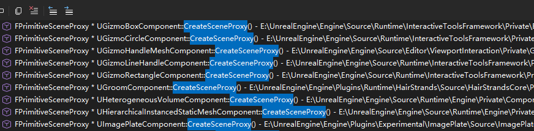
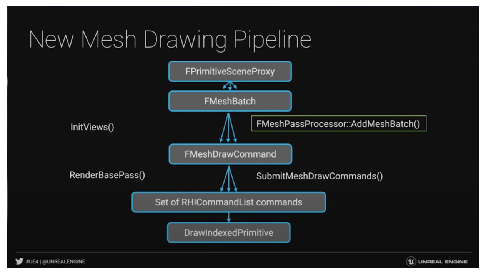
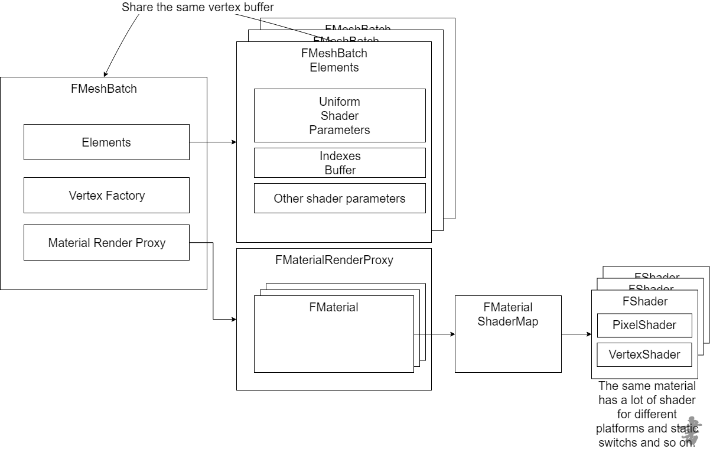
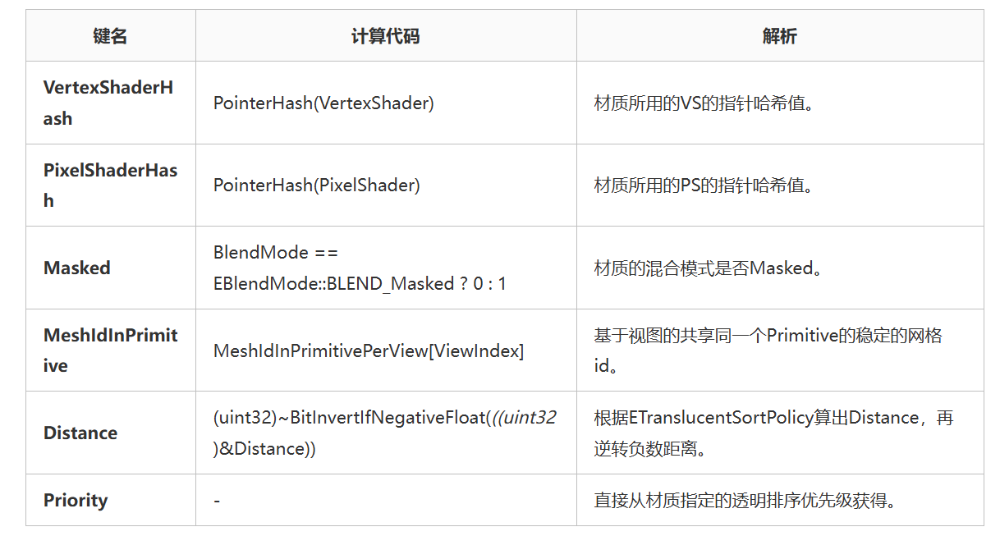

+++
date = '2025-12-13T12:29:39+08:00'
draft = false
title = 'UE源码学习（渲染机制）'
categories = ["Engines/UE"]
tags = ["UE源码"]

+++
> 内容参考https://www.cnblogs.com/timlly/p/14588598.html、https://www.cnblogs.com/timlly/p/14327537.html#25-ue%E7%9A%84%E5%A4%9A%E7%BA%BF%E7%A8%8B%E6%B8%B2%E6%9F%93


> 内容总结:
>
> 1. 游戏线程的组件如何与渲染线程的Proxy进行交互
> 2. 从proxy到RHI层命令之间的转换流程

# 多线程渲染

> 这块东西，如果想深入看代码的话，需要先学习UE的多线程架构，TaskGraph什么的，目前还没看。游戏线程->渲染线程->RHI线程   （这个分工我的渲染器已经简单实现了一个版本，不过RHI没有单独开线程，放在渲染线程之后执行 https://github.com/sdpyy1/GameEngine-dev/tree/mutliThread）
>
> emmm 看到后边发现，上边说的是错的， 我实现的实际上只是RHI线程，渲染线程其实还是主线程执行的

游戏线程的对象通常做逻辑更新，在内存中有一份持久的数据，为了避免游戏线程和渲染线程产生竞争条件，会在渲染线程额外存储一份内存拷贝，并且使用的是另外的类型，以下是UE比较常见的类型映射关系（游戏线程对象以U开头，渲染线程以F开头）






单独划分出RHI线程，让渲染线程更稳定了。  不理解。。



# 游戏线程和渲染线程的交互

> 先弄清楚游戏组件向SceneProxy传递数据的机制，下面内容主要是如何把组件信息传递给渲染线程，如果把组件修改信息传递给渲染线程

三个基础概念：

​	- **UPrimitiveComponent**：图元组件，是所有可渲染或拥有物理模拟的物体父类。是CPU层裁剪的最小粒度单位

​	- **FScene**：是UWorld在渲染模块的代表。只有加入到FScene的物体才会被渲染器感知到。渲染线程拥有FScene的所有状态（游戏线程不可直接修改）。

​	- **FPrimitiveSceneProxy**：图元场景代理，是UPrimitiveComponent在渲染器的代表，镜像了UPrimitiveComponent在渲染线程的状态。

下面也就是把这个组件传入FScene的过程，就是在渲染器的FScene中创建一个代理对象，并把收集到的信息传递给渲染线程

```c++
// 输入一个UPrimitiveComponent组件，把他加到渲染器可感知的FScene中
void FScene::AddPrimitive(UPrimitiveComponent* Primitive)
{	
	// If the bulk reregister flag is set, add / remove will be handled in bulk by the FStaticMeshComponentBulkReregisterContext
	if (Primitive->bBulkReregister)
	{
		return;
	}
	BatchAddPrimitivesInternal(MakeArrayView(&Primitive, 1));
}

void FScene::BatchAddPrimitivesInternal(TArrayView<T*> InPrimitives){
    ...
        
    for (T* Primitive : InPrimitives){
		FPrimitiveSceneProxy* PrimitiveSceneProxy  = nullptr;
      	...
            // 创建代理
		PrimitiveSceneProxy = Primitive->GetPrimitiveComponentInterface()->CreateSceneProxy();
        ...
    }
    
    // 把批量创建信息传递到渲染线程  ENQUEUE_RENDER_COMMAND（内部的lambda会放在渲染线程中执行）
    ...
    ENQUEUE_RENDER_COMMAND(AddPrimitiveCommand)(
	[this, CreateCommands = MoveTemp(CreateCommands)](FRHICommandListBase& RHICmdList)
    {
        for (const FCreateCommand& Command : CreateCommands)
        {
            FScopeCycleCounter Context(Command.PrimitiveSceneProxy->GetStatId());
            Command.PrimitiveSceneProxy->SetTransform(RHICmdList, Command.RenderMatrix, Command.WorldBounds, Command.LocalBounds, 		                   Command.AttachmentRootPosition);
            Command.PrimitiveSceneProxy->CreateRenderThreadResources(RHICmdList);
		    // 在渲染线程中将SceneInfo加入到场景中.
            AddPrimitiveSceneInfo_RenderThread(Command.PrimitiveSceneInfo, Command.PreviousTransform);
        }
    });
}

```

下面看看创建代理对象的过程

看这个情况，是每个组件都有自己创建场景代理的流程



随便翻一翻他们干了什么

```c++
// 聚光组件
FLightSceneProxy* USpotLightComponent::CreateSceneProxy() const
{
	if (IsSpotLightSupported(this))
	{
		return new FSpotLightSceneProxy(this);
	}
	return nullptr;
}
// skyLight组件
FSkyLightSceneProxy* USkyLightComponent::CreateSceneProxy() const
{
	if (ProcessedSkyTexture || IsRealTimeCaptureEnabled())
	{
		return new FSkyLightSceneProxy(this);
	}

	return NULL;
}

// staticMesh组件比较复杂，不过翻到最后也是进入了	
auto* Proxy = ::new FStaticMeshSceneProxy(this, false);

```

他们都进入了各自的复杂的构造函数链，一直翻到最顶层

比如灯光代理

```c++
FLightSceneProxy::FLightSceneProxy(const ULightComponent* InLightComponent)
	: LightComponent(InLightComponent)
	, SceneInterface(InLightComponent->GetScene())
	, IndirectLightingScale(InLightComponent->IndirectLightingIntensity)
	, VolumetricScatteringIntensity(FMath::Max(InLightComponent->VolumetricScatteringIntensity, 0.0f))
	, ShadowResolutionScale(InLightComponent->ShadowResolutionScale)
	, ShadowBias(InLightComponent->ShadowBias)
	, ShadowSlopeBias(InLightComponent->ShadowSlopeBias)
	, ShadowSharpen(InLightComponent->ShadowSharpen)
	, ContactShadowLength(InLightComponent->ContactShadowLength)
	, ContactShadowCastingIntensity(InLightComponent->ContactShadowCastingIntensity)
	, ContactShadowNonCastingIntensity(InLightComponent->ContactShadowNonCastingIntensity)
	, SpecularScale(InLightComponent->SpecularScale)
	, DiffuseScale(InLightComponent->DiffuseScale)
	, LightGuid(InLightComponent->LightGuid)
	, RayStartOffsetDepthScale(InLightComponent->RayStartOffsetDepthScale)
	, IESTexture(0)
	, bContactShadowLengthInWS(InLightComponent->ContactShadowLengthInWS ? true : false)
	, bMovable(InLightComponent->IsMovable())
	, bStaticLighting(InLightComponent->HasStaticLighting())
	, bStaticShadowing(InLightComponent->HasStaticShadowing())
	, bCastDynamicShadow(InLightComponent->CastShadows&& InLightComponent->CastDynamicShadows)
	, bCastStaticShadow(InLightComponent->CastShadows&& InLightComponent->CastStaticShadows)
	, bCastTranslucentShadows(InLightComponent->CastTranslucentShadows)
	, bTransmission(InLightComponent->bTransmission && bCastDynamicShadow && !bStaticShadowing)
	, bCastVolumetricShadow(InLightComponent->bCastVolumetricShadow)
	, bCastHairStrandsDeepShadow(InLightComponent->bCastDeepShadow)
	, bCastShadowsFromCinematicObjectsOnly(InLightComponent->bCastShadowsFromCinematicObjectsOnly)
	, bForceCachedShadowsForMovablePrimitives(InLightComponent->bForceCachedShadowsForMovablePrimitives)
	, CastRaytracedShadow(InLightComponent->CastShadows == 0 ? (TEnumAsByte<ECastRayTracedShadow::Type>) ECastRayTracedShadow::Disabled : InLightComponent->CastRaytracedShadow)
	, bAffectReflection(InLightComponent->bAffectReflection)
	, bAffectGlobalIllumination(InLightComponent->bAffectGlobalIllumination)
	, bAffectTranslucentLighting(InLightComponent->bAffectTranslucentLighting)
	, bUsedAsAtmosphereSunLight(InLightComponent->IsUsedAsAtmosphereSunLight())
	, bUseRayTracedDistanceFieldShadows(InLightComponent->bUseRayTracedDistanceFieldShadows)
	, bUseVirtualShadowMaps(false)	// See below
	, bCastModulatedShadows(false)
	, bUseWholeSceneCSMForMovableObjects(false)
	, bSelected(InLightComponent->IsSelected() || InLightComponent->IsOwnerSelected())
	, bAllowMegaLights(InLightComponent->bAllowMegaLights)
	, MegaLightsShadowMethod(InLightComponent->MegaLightsShadowMethod)
	, LightFunctionAtlasLightIndex(0)
	, AtmosphereSunLightIndex(InLightComponent->GetAtmosphereSunLightIndex())
	, AtmosphereSunDiskColorScale(InLightComponent->GetAtmosphereSunDiskColorScale())
	, LightType(InLightComponent->GetLightType())
	, LightingChannelMask(GetLightingChannelMaskForStruct(InLightComponent->LightingChannels))
	, StatId(InLightComponent->GetStatID(true))
	, ComponentName(InLightComponent->GetFName())
	, LevelName(InLightComponent->GetOwner() ? InLightComponent->GetOwner()->GetLevel()->GetOutermost()->GetFName() : NAME_None)
	, FarShadowDistance(0)
	, FarShadowCascadeCount(0)
	, ShadowAmount(1.0f)
	, SamplesPerPixel(1)
	, DeepShadowLayerDistribution(InLightComponent->DeepShadowLayerDistribution)
	, IESAtlasId(~0u)
```

staticMesh代理，这些图元相关的对象，最上层都是FPrimitiveSceneProxy::FPrimitiveSceneProxy

```c++
FPrimitiveSceneProxy::FPrimitiveSceneProxy(const FPrimitiveSceneProxyDesc& InProxyDesc, FName InResourceName) :
#if !(UE_BUILD_SHIPPING || UE_BUILD_TEST)
	WireframeColor(FLinearColor::White)
,	
#endif
	CustomPrimitiveData(InProxyDesc.GetCustomPrimitiveData())
,	TranslucencySortPriority(FMath::Clamp(InProxyDesc.TranslucencySortPriority, SHRT_MIN, SHRT_MAX))
,	TranslucencySortDistanceOffset(InProxyDesc.TranslucencySortDistanceOffset)
,	Mobility(InProxyDesc.Mobility)
,	LightmapType(InProxyDesc.LightmapType)
,	StatId()
,	DrawInGame(InProxyDesc.IsVisible())
,	DrawInEditor(InProxyDesc.IsVisibleEditor())
,	bReceivesDecals(InProxyDesc.bReceivesDecals)
,	bVirtualTextureMainPassDrawAlways(true)
,	bVirtualTextureMainPassDrawNever(false)
,	bOnlyOwnerSee(InProxyDesc.bOnlyOwnerSee)
,	bOwnerNoSee(InProxyDesc.bOwnerNoSee)
,	bParentSelected(InProxyDesc.ShouldRenderSelected())
,	bIndividuallySelected(InProxyDesc.IsComponentIndividuallySelected())
,	bLevelInstanceEditingState(InProxyDesc.GetLevelInstanceEditingState())
,	bHovered(false)
,	bUseViewOwnerDepthPriorityGroup(InProxyDesc.bUseViewOwnerDepthPriorityGroup)
,	StaticDepthPriorityGroup((uint8)InProxyDesc.GetStaticDepthPriorityGroup())
,	ViewOwnerDepthPriorityGroup(InProxyDesc.ViewOwnerDepthPriorityGroup)
,	bStaticLighting(InProxyDesc.HasStaticLighting())
,	bVisibleInReflectionCaptures(InProxyDesc.bVisibleInReflectionCaptures)
,	bVisibleInRealTimeSkyCaptures(InProxyDesc.bVisibleInRealTimeSkyCaptures)
,	bVisibleInRayTracing(InProxyDesc.bVisibleInRayTracing)
,	bRenderInDepthPass(InProxyDesc.bRenderInDepthPass)
,	bRenderInMainPass(InProxyDesc.bRenderInMainPass)
,	bForceHidden(false)
,	bCollisionEnabled(InProxyDesc.IsCollisionEnabled())
,	bTreatAsBackgroundForOcclusion(InProxyDesc.bTreatAsBackgroundForOcclusion)
,	bSupportsParallelGDME(true)
,	bSinglePassGDME(false)
,	bVisibleInLumenScene(false)
,	bOpaqueOrMasked(true)
,	bCanSkipRedundantTransformUpdates(true)
,	bGoodCandidateForCachedShadowmap(true)
,	bNeedsUnbuiltPreviewLighting(!InProxyDesc.IsPrecomputedLightingValid())
,	bHasValidSettingsForStaticLighting(InProxyDesc.HasValidSettingsForStaticLighting())
,	bWillEverBeLit(true)
        ...
```

基本上来看，主要工作是把组件信息手动填充到proxy中，来构造proxy。拷贝数据之后，游戏线程修改的是PrimitiveComponent的数据，而渲染线程修改或访问的是PrimitiveSceneProxy的数据，彼此不干扰，避免了临界区和锁的同步，也保证了线程安全。

>  但在创建完之后，PrimitiveComponent是如何向PrimitiveSceneProxy更新数据的呢？

这里涉及到UActorComponent是所有组件的父类。在UActorComponent 有一些标志来说明组件是否被被修改

```c++
class UActorComponent : public UObject, public IInterface_AssetUserData
{
	GENERATED_BODY()
    // 下面四个虚函数用于管理后边的四个uint8的状态信息，子类可以重新他们的逻辑，在这里只修改脏读状态
    virtual void DoDeferredRenderUpdates_Concurrent()
    {
        (......)
        
        if(bRenderStateDirty)
        {
            RecreateRenderState_Concurrent();
        }
        else
        {
            if(bRenderTransformDirty)
            {
                SendRenderTransform_Concurrent();
            }
            if(bRenderDynamicDataDirty)
            {
                SendRenderDynamicData_Concurrent();
            }
        }
    }
    virtual void CreateRenderState_Concurrent(FRegisterComponentContext* Context)
    {
        bRenderStateCreated = true;

        bRenderStateDirty = false;
        bRenderTransformDirty = false;
        bRenderDynamicDataDirty = false;
    }
    virtual void SendRenderTransform_Concurrent()
    {
        bRenderTransformDirty = false;
    }
    virtual void SendRenderDynamicData_Concurrent()
    {
        bRenderDynamicDataDirty = false;
    }
	...
	/** Is this component in need of its whole state being sent to the renderer? */
	uint8 bRenderStateDirty:1;

	/** Is this component's transform in need of sending to the renderer? */
	uint8 bRenderTransformDirty:1;

	/** Is this component's dynamic data in need of sending to the renderer? */
	uint8 bRenderDynamicDataDirty:1;

	/** Is this component's instanced data in need of sending to the renderer? */
	uint8 bRenderInstancesDirty:1;	
    ...
}
```

比如灯光组件的更新

```c++
// 灯光组件更新变换矩阵
void ULightComponent::SendRenderTransform_Concurrent()
{
	// Update the scene info's transform for this light.
    // 也能看出UE的设计框架是任何地方都可以访问这些全局Context
	GetWorld()->Scene->UpdateLightTransform(this);
	Super::SendRenderTransform_Concurrent();
}

// update内部可以看出首先Scene指的就是Fscene他是渲染器感知的场景，其次，更新时传入的是proxy，这也就实现了组件更新的传递
// 另外说明SceneProxy是在这个组件内部存好指针的
void FScene::UpdateLightTransform(ULightComponent* Light)
{
	UpdateLightInternal(Light->SceneProxy, FUpdateLightTransformParameters{.LightToWorld = Light->GetComponentTransform().ToMatrixNoScale(), .Position = Light->GetLightPosition()});
}

// 再内部，把更新信息传递到渲染线程
template <typename UpdatePayloadType>
void FScene::UpdateLightInternal(FLightSceneProxy* LightSceneProxy, UpdatePayloadType&& InUpdatePayload)
{
	if (LightSceneProxy)
	{
		FLightSceneInfo* LightSceneInfo = LightSceneProxy->GetLightSceneInfo();
		if (LightSceneInfo->bVisible)
		{
			ENQUEUE_RENDER_COMMAND(UpdateLightTransform)(
				[this, LightSceneInfo, UpdatePayload = MoveTemp(InUpdatePayload)] (FRHICommandListBase&) mutable
				{
					FScopeCycleCounter Context(LightSceneInfo->Proxy->GetStatId());
					SceneLightInfoUpdates->Enqueue(LightSceneInfo, MoveTemp(UpdatePayload));
				});
		}
	}
}
```

# 渲染流程

> 上一节拿捏了Proxy的创建，现在渲染器就是要收集Proxy，然后布拉布拉变成RHICommandList😄



## 顶点工厂

> 定义了顶点数据从CPU->GPU的框架

先过一些需要的类

**FStaticMeshDataType** 定义了顶点属性

```c++
struct FStaticMeshDataType
{
	/** The stream to read the vertex position from. */
	FVertexStreamComponent PositionComponent;   // 每一项底层都是一个RHIBuffer
	/** The streams to read the tangent basis from. */
	FVertexStreamComponent TangentBasisComponents[2];
	/** The streams to read the texture coordinates from. */
	TArray<FVertexStreamComponent, TFixedAllocator<MAX_STATIC_TEXCOORDS / 2> > TextureCoordinates;
	/** The stream to read the shadow map texture coordinates from. */
	FVertexStreamComponent LightMapCoordinateComponent;
	/** The stream to read the vertex color from. */
	FVertexStreamComponent ColorComponent;
	FRHIShaderResourceView* PositionComponentSRV = nullptr;
	FRHIShaderResourceView* TangentsSRV = nullptr;
	/** A SRV to manually bind and load TextureCoordinates in the vertex shader. */
	FRHIShaderResourceView* TextureCoordinatesSRV = nullptr;
	/** A SRV to manually bind and load Colors in the vertex shader. */
	FRHIShaderResourceView* ColorComponentsSRV = nullptr;
	uint32 ColorIndexMask = ~0u;
	int8 LightMapCoordinateIndex = -1;
	uint8 NumTexCoords = 0;
	uint8 LODLightmapDataIndex = 0;
};

// 翻开一个StreamComponent，基本就看懂了，所以StreamComponent是存储了具体的Buffer的
struct FVertexStreamComponent
{
	/** The vertex buffer to stream data from.  If null, no data can be read from this stream. */
	const FVertexBuffer* VertexBuffer = nullptr;
	/** The offset to the start of the vertex buffer fetch. */
	uint32 StreamOffset = 0;
	/** The offset of the data, relative to the beginning of each element in the vertex buffer. */
	uint8 Offset = 0;
	/** The stride of the data. */
	uint8 Stride = 0;
	/** The type of the data read from this stream. */
	TEnumAsByte<EVertexElementType> Type = VET_None;
	EVertexStreamUsage VertexStreamUsage = EVertexStreamUsage::Default;
}

//FVertexBuffer 底层就是RHI层的Buffer
class FVertexBuffer : public FRenderResource
{
public:
	FBufferRHIRef VertexBufferRHI;
};
using FBufferRHIRef  = TRefCountPtr<FRHIBuffer>;

```

FVertexStream也是类似FVertexStreamComponent，底层封装了一个FVertexBuffer

```c++
/**
 * Information needed to set a vertex stream.
 */
struct FVertexStream
{
	const FVertexBuffer* VertexBuffer = nullptr;
	uint32 Offset = 0;
	uint16 Stride = 0;
	EVertexStreamUsage VertexStreamUsage = EVertexStreamUsage::Default;
	uint8 Padding = 0;
};
```

FVertexElement 描述 StreamIndex对应的Stream 与 AttributeIndex的对应关系 Attribute就是在Vulkan中是VkVertexInputAttributeDescription的location， 进一步再对应Shader就是 layout (location = 0) in vec3 inPos;

“从哪个 Vertex Buffer（StreamIndex），在什么偏移和格式下，读数据，送到 Vertex Shader 的哪个输入槽（AttributeIndex）。”

```c++
struct FVertexElement
{
	uint8 StreamIndex;
	uint8 Offset;
	TEnumAsByte<EVertexElementType> Type;
	uint8 AttributeIndex;
	uint16 Stride;
	/**
	 * Whether to use instance index or vertex index to consume the element.  
	 * eg if bUseInstanceIndex is 0, the element will be repeated for every instance.
	 */
	uint16 bUseInstanceIndex;
}
```

在`VertexFactory`的`FVertexFactory::InitDeclaration`中，就是拿一批FVertexElement去初始化一个`FVertexDeclarationRHIRef`

```c++
// 拿一堆Element去创建Declaration
void FVertexFactory::InitDeclaration(const FVertexDeclarationElementList& Elements, EVertexInputStreamType StreamType)
{
	
	if (StreamType == EVertexInputStreamType::PositionOnly)
	{
		PositionDeclaration = PipelineStateCache::GetOrCreateVertexDeclaration(Elements);
	}
	else if (StreamType == EVertexInputStreamType::PositionAndNormalOnly)
	{
		PositionAndNormalDeclaration = PipelineStateCache::GetOrCreateVertexDeclaration(Elements);
	}
	else // (StreamType == EVertexInputStreamType::Default)
	{
		// Create the vertex declaration for rendering the factory normally.
		Declaration = PipelineStateCache::GetOrCreateVertexDeclaration(Elements);
	}
}
```

上面提到的Declaration`FVertexDeclarationRHIRef PositionDeclaration`，在UE也被抽象成了RHI资源，这粒度太细了。这个东西就是用来在创建PSO时使用的

```c++
typedef TArray<struct FVertexElement,TFixedAllocator<MaxVertexElementCount> > FVertexDeclarationElementList;

class FRHIVertexDeclaration : public FRHIResource
{
public:
	FRHIVertexDeclaration() : FRHIResource(RRT_VertexDeclaration) {}
	virtual bool GetInitializer(FVertexDeclarationElementList& Init) { return false; }
	virtual uint32 GetPrecachePSOHash() const { return 0; }
};

```

回过头再看顶点工厂内部存储了  Stream（数据从哪来，VertexBuffer）   以及 对应的RHI资源FVertexDeclarationRHIRef 

```c++
/**
 * Encapsulates a vertex data source which can be linked into a vertex shader.
 */
class FVertexFactory : public FRenderResource
{
public:
	/**
	 * Information needed to set a vertex stream.
	 */
	struct FVertexStream
	{
		const FVertexBuffer* VertexBuffer = nullptr;
		uint32 Offset = 0;
		uint16 Stride = 0;
		EVertexStreamUsage VertexStreamUsage = EVertexStreamUsage::Default;
		uint8 Padding = 0;

		friend bool operator==(const FVertexStream& A,const FVertexStream& B)
		{
			return A.VertexBuffer == B.VertexBuffer && A.Stride == B.Stride && A.Offset == B.Offset && A.VertexStreamUsage == B.VertexStreamUsage;
		}

		FVertexStream()
		{
		}
	};

	typedef TArray<FVertexStream, TInlineAllocator<8> > FVertexStreamList;
		
	/** The vertex streams used to render the factory. */
	FVertexStreamList Streams;
	
private:

	/** The position only vertex stream used to render the factory during depth only passes. */
	TArray<FVertexStream,TInlineAllocator<2> > PositionStream;
	TArray<FVertexStream, TInlineAllocator<3> > PositionAndNormalStream;

	/** The RHI vertex declaration used to render the factory normally. */
	FVertexDeclarationRHIRef Declaration;

	/** The RHI vertex declaration used to render the factory during depth only passes. */
	FVertexDeclarationRHIRef PositionDeclaration;
	FVertexDeclarationRHIRef PositionAndNormalDeclaration;

};
```

再看`FLocalVertexFactory` 他继承VertexFactory，定义一个最基础的VertexFactory

```c++
 /**
 * A vertex factory which simply transforms explicit vertex attributes from local to world space.
 */
class FLocalVertexFactory : public FVertexFactory
{
    
    	FDataType Data;  // 这个东西就是来自上边提到的FStaticMeshDataType
}

struct FDataType : public FStaticMeshDataType
{
    FVertexStreamComponent PreSkinPositionComponent;
    FRHIShaderResourceView* PreSkinPositionComponentSRV = nullptr;
#if WITH_EDITORONLY_DATA
    const class UStaticMesh* StaticMesh = nullptr;
    bool bIsCoarseProxy = false;
#endif
};
```

`FLocalVertexFactory` 内主要的方法

```c++
void FLocalVertexFactory::InitRHI(FRHICommandListBase& RHICmdList)
{
	SCOPED_LOADTIMER(FLocalVertexFactory_InitRHI);
	// We create different streams based on feature level
	check(HasValidFeatureLevel());
	// VertexFactory needs to be able to support max possible shader platform and feature level
	// in case if we switch feature level at runtime.
	const bool bCanUseGPUScene = UseGPUScene(GMaxRHIShaderPlatform, GetFeatureLevel());
	const bool bUseManualVertexFetch = SupportsManualVertexFetch(GetFeatureLevel());
	// If the vertex buffer containing position is not the same vertex buffer containing the rest of the data,
	// then initialize PositionStream and PositionDeclaration.
	if (Data.PositionComponent.VertexBuffer != Data.TangentBasisComponents[0].VertexBuffer)
	{
		auto AddDeclaration = [this](EVertexInputStreamType InputStreamType, bool bAddNormal)
		{
			FVertexDeclarationElementList StreamElements;
			StreamElements.Add(AccessStreamComponent(Data.PositionComponent, 0, InputStreamType));
			bAddNormal = bAddNormal && Data.TangentBasisComponents[1].VertexBuffer != NULL;
			if (bAddNormal)
			{
				StreamElements.Add(AccessStreamComponent(Data.TangentBasisComponents[1], 2, InputStreamType));
			}
			AddPrimitiveIdStreamElement(InputStreamType, StreamElements, 1, 1);
			// 在这里就执行了前边提到的InitDeclaration
			InitDeclaration(StreamElements, InputStreamType);
		};
		AddDeclaration(EVertexInputStreamType::PositionOnly, false);
		AddDeclaration(EVertexInputStreamType::PositionAndNormalOnly, true);
	}
	FVertexDeclarationElementList Elements;
	GetVertexElements(GetFeatureLevel(), EVertexInputStreamType::Default, bUseManualVertexFetch, Data, Elements, Streams, ColorStreamIndex);
	AddPrimitiveIdStreamElement(EVertexInputStreamType::Default, Elements, 13, 13);
	check(Streams.Num() > 0);
	InitDeclaration(Elements);
	check(IsValidRef(GetDeclaration()));
	const int32 DefaultBaseVertexIndex = 0;
	const int32 DefaultPreSkinBaseVertexIndex = 0;
	if (RHISupportsManualVertexFetch(GMaxRHIShaderPlatform) || bCanUseGPUScene)
	{
		SCOPED_LOADTIMER(FLocalVertexFactory_InitRHI_CreateLocalVFUniformBuffer);
		UniformBuffer = CreateLocalVFUniformBuffer(this, Data.LODLightmapDataIndex, nullptr, DefaultBaseVertexIndex, DefaultPreSkinBaseVertexIndex);
	}
	FLocalVertexFactoryLooseParameters LooseParameters;
	LooseParameters.FrameNumber = -1;
	LooseParameters.GPUSkinPassThroughPositionBuffer = GNullVertexBuffer.VertexBufferSRV;
	LooseParameters.GPUSkinPassThroughPreviousPositionBuffer = GNullVertexBuffer.VertexBufferSRV;
	LooseParameters.GPUSkinPassThroughPreSkinnedTangentBuffer = GNullVertexBuffer.VertexBufferSRV;
	LooseParametersUniformBuffer = TUniformBufferRef<FLocalVertexFactoryLooseParameters>::CreateUniformBufferImmediate(LooseParameters, UniformBuffer_MultiFrame);
	check(IsValidRef(GetDeclaration()));
}
```

总结来看，顶点工厂的粒度是Mesh级别的，也就是说，顶点数据不一致 就得新创建一个顶点工厂

> 总之 顶点工厂就是一个模型在渲染器的代表

## 从FPrimitiveSceneProxy到FMeshBatch

> FMeshBatch是本节才接触的新概念，它它包含了绘制Pass所需的所有信息，解耦了网格Pass和FPrimitiveSceneProxy，所以FPrimitiveSceneProxy并不知道会被哪些Pass绘制。

首先看看FMeshBatchElement，网格批次元素, 存储了FMeshBatch单个网格所需的数据

```c++
struct FMeshBatchElement
{
    // 存储实例的信息比如变换矩阵、材质信息，这里是RHIBuffer，说明他是GPU端的handle
	FRHIUniformBuffer* PrimitiveUniformBuffer;

    // 网格的UniformBuffer在CPU侧的数据.
	const TUniformBuffer<FPrimitiveUniformShaderParameters>* PrimitiveUniformBufferResource;

	/** Uniform buffer containing the "loose" parameters that aren't wrapped in other uniform buffers. Those parameters can be unique per mesh batch, e.g. view dependent. */
	FUniformBufferRHIRef LooseParametersUniformBuffer;

    // 索引缓冲
	const FIndexBuffer* IndexBuffer;

	// 实例数量
	uint32 NumInstances;
	uint32 BaseVertexIndex;
	uint32 MinVertexIndex;
	uint32 MaxVertexIndex;
	int32 UserIndex;
	float MinScreenSize;
	float MaxScreenSize;

    ...
};

```

再看FMeshBatch，这里注释可以看出来，如果顶点缓冲和材质是一致的就再一个Batch中（所以自己实现的话，同一个SubMesh+一个材质，就可以定义一个Batch）

```c++
/**
 * A batch of mesh elements, all with the same material and vertex buffer
 */
struct FMeshBatch
{
	TArray<FMeshBatchElement,TInlineAllocator<1> > Elements; // 包含的FMeshBatchElement

	/** Vertex factory for rendering, required. */
	const FVertexFactory* VertexFactory;  // 顶点工厂

	/** Material proxy for rendering, required. */  
	const FMaterialRenderProxy* MaterialRenderProxy; // 材质信息
	...

};
```



>  一个FMeshBatch拥有一组FMeshBatchElement、一个顶点工厂和一个材质实例，同一个FMeshBatch的所有FMeshBatchElement共享着相同的材质和顶点缓冲（可可被视为Vertex Factory）。但通常情况（大多数情况）下，FMeshBatch只会有一个FMeshBatchElement。


在进入渲染函数后，会执行可见性测试和剔除，以便剔除被遮挡和被隐藏的物体，在此阶段的末期会调用`GatherDynamicMeshElements`收集当前场景所有的FPrimitiveSceneProxy

```c++
void FDynamicMeshElementContext::GatherDynamicMeshElementsForPrimitive(FPrimitiveSceneInfo* Primitive, uint8 ViewMask)
{
	SCOPED_NAMED_EVENT(DynamicPrimitive, FColor::Magenta);

	TArray<int32, TInlineAllocator<4>> MeshBatchCountBefore;
	MeshBatchCountBefore.SetNumUninitialized(Views.Num());
	for (int32 ViewIndex = 0; ViewIndex < Views.Num(); ViewIndex++)
	{
		MeshBatchCountBefore[ViewIndex] = MeshCollector.GetMeshBatchCount(ViewIndex);
	}

	MeshCollector.SetPrimitive(Primitive->Proxy, Primitive->DefaultDynamicHitProxyId);

	// If Custom Render Passes aren't in use, there will be only one group, which is the common case.
	if (ViewFamilyGroups.Num() == 1 || Primitive->Proxy->SinglePassGDME())
	{
		Primitive->Proxy->GetDynamicMeshElements(FirstViewFamily.AllViews, FirstViewFamily, ViewMask, MeshCollector);  // 关键是这里 Proxy自己有方法封装出一个MeshElement
	}
	else
	{
		for (FViewFamilyGroup& Group : ViewFamilyGroups)
		{
			if (uint8 MaskedViewMask = ViewMask & Group.ViewSubsetMask)
			{
				Primitive->Proxy->GetDynamicMeshElements(FirstViewFamily.AllViews, *Group.Family, MaskedViewMask, MeshCollector);
			}
		}
	}

	for (int32 ViewIndex = 0; ViewIndex < Views.Num(); ViewIndex++)
	{
		FViewInfo& View = *Views[ViewIndex];

		if (ViewMask & (1 << ViewIndex))
		{
			FDynamicPrimitive& DynamicPrimitive = DynamicPrimitives.Emplace_GetRef();
			DynamicPrimitive.PrimitiveIndex = Primitive->GetIndex();
			DynamicPrimitive.ViewIndex = ViewIndex;
			DynamicPrimitive.StartElementIndex = MeshBatchCountBefore[ViewIndex];
			DynamicPrimitive.EndElementIndex = MeshCollector.GetMeshBatchCount(ViewIndex);
		}
	}
}
```

这里边proxy会进行GetDynamicMeshElements(),他是每个proxy子类自己实现的方法

```c++
	virtual void GetDynamicMeshElements(const TArray<const FSceneView*>& Views, const FSceneViewFamily& ViewFamily, uint32 VisibilityMap, class FMeshElementCollector& Collector) const {} 


// 骨骼mesh的实现
void FSkeletalMeshSceneProxy::GetDynamicMeshElements(const TArray<const FSceneView*>& Views, const FSceneViewFamily& ViewFamily, uint32 VisibilityMap, FMeshElementCollector& Collector) const
{
	QUICK_SCOPE_CYCLE_COUNTER(STAT_FSkeletalMeshSceneProxy_GetMeshElements);
	GetMeshElementsConditionallySelectable(Views, ViewFamily, true, VisibilityMap, Collector);
}
void FSkeletalMeshSceneProxy::GetMeshElementsConditionallySelectable(const TArray<const FSceneView*>& Views, const FSceneViewFamily& ViewFamily, bool bInSelectable, uint32 VisibilityMap, FMeshElementCollector& Collector) const
{
	if (!MeshObject)
	{
		return;
	}

	TRACE_CPUPROFILER_EVENT_SCOPE(SkeletalMesh);

	const FEngineShowFlags& EngineShowFlags = ViewFamily.EngineShowFlags;

	const int32 FirstLODIdx = SkeletalMeshRenderData->GetFirstValidLODIdx(FMath::Max(SkeletalMeshRenderData->PendingFirstLODIdx, SkeletalMeshRenderData->CurrentFirstLODIdx));
	if (FirstLODIdx == INDEX_NONE)
	{
#if DO_CHECK
		UE_LOG(LogSkeletalMesh, Warning, TEXT("Skeletal mesh %s has no valid LODs for rendering."), *GetResourceName().ToString());
#endif
	}
	else
	{
		const int32 LODIndex = MeshObject->GetLOD();
		check(LODIndex < SkeletalMeshRenderData->LODRenderData.Num());
		const FSkeletalMeshLODRenderData& LODData = SkeletalMeshRenderData->LODRenderData[LODIndex];

		if (LODSections.Num() > 0 && LODIndex >= FirstLODIdx)
		{
			check(SkeletalMeshRenderData->LODRenderData[LODIndex].GetNumVertices() > 0);
			const FLODSectionElements& LODSection = LODSections[LODIndex];
			check(LODSection.SectionElements.Num() == LODData.RenderSections.Num());
			for (FSkeletalMeshSectionIter Iter(LODIndex, *MeshObject, LODData, LODSection); Iter; ++Iter)
			{
				const FSkelMeshRenderSection& Section = Iter.GetSection();
				const int32 SectionIndex = Iter.GetSectionElementIndex();
				const FSectionElementInfo& SectionElementInfo = Iter.GetSectionElementInfo();
				bool bSectionSelected = false;
#if WITH_EDITORONLY_DATA
				// TODO: This is not threadsafe! A render command should be used to propagate SelectedEditorSection to the scene proxy.
				if (MeshObject->SelectedEditorMaterial != INDEX_NONE)
				{
					bSectionSelected = (MeshObject->SelectedEditorMaterial == SectionElementInfo.UseMaterialIndex);
				}
				else
				{
					bSectionSelected = (MeshObject->SelectedEditorSection == SectionIndex);
				}
#endif
				// If hidden skip the draw
				if (MeshObject->IsMaterialHidden(LODIndex, SectionElementInfo.UseMaterialIndex) || Section.bDisabled)
				{
					continue;
				}

				GetDynamicElementsSection(Views, ViewFamily, VisibilityMap, LODData, LODIndex, SectionIndex, bSectionSelected, SectionElementInfo, bInSelectable, Collector);
			}
		}
	}
#
}
```

代码比较复杂，总之，渲染开始后会收集所有需要渲染的FPrimitiveSceneProxy组成FMeshBatch

## 从FMeshBatch到FMeshDrawCommand

紧接着进入`SetupMeshPass`来创建`FMeshPassProcessor`,这里关注到一个点，各种需要Mesh信息的Pass都会在这里统一并行处理，而不是等Pass自己渲染时才处理

> UE事先罗列了所有可能需要绘制的Pass，在SetupMeshPass阶段对需要用到的Pass并行化地生成DrawCommand

```c++
void FSceneRenderer::SetupMeshPass(FViewInfo& View, FExclusiveDepthStencil::Type BasePassDepthStencilAccess, FViewCommands& ViewCommands, FInstanceCullingManager& InstanceCullingManager)
{
	SCOPE_CYCLE_COUNTER(STAT_SetupMeshPass);
	const EShadingPath ShadingPath = GetFeatureLevelShadingPath(Scene->GetFeatureLevel());
    // 遍历所有的EMeshPass定义的pass
	for (int32 PassIndex = 0; PassIndex < EMeshPass::Num; PassIndex++)
	{
		const EMeshPass::Type PassType = (EMeshPass::Type)PassIndex;
		// 每个MeshPass创建一个FMeshPassProcessor
        FMeshPassProcessor* MeshPassProcessor = FPassProcessorManager::CreateMeshPassProcessor(ShadingPath, PassType, Scene->GetFeatureLevel(), Scene, &View, nullptr);

        FParallelMeshDrawCommandPass& Pass = View.ParallelMeshDrawCommandPasses[PassIndex];
        TArray<int32, TInlineAllocator<2> > ViewIds;
        ViewIds.Add(View.GPUSceneViewId);
        // Only apply instancing for ISR to main view passes
        const bool bIsMainViewPass = PassType != EMeshPass::Num && (FPassProcessorManager::GetPassFlags(ShadingPath, PassType) & EMeshPassFlags::MainView) != EMeshPassFlags::None;
        
        FName PassName(GetMeshPassName(PassType));
        // 并行地处理可见Pass的处理任务，创建此Pass的所有绘制命令
        Pass.DispatchPassSetup(
            Scene,
            View,
            FInstanceCullingContext(PassName, ShaderPlatform, &InstanceCullingManager, ViewIds, bAllowInstanceOcclusionCulling ? View.PrevViewInfo.HZB : nullptr, InstanceCullingMode, CullingFlags),
            PassType,
            BasePassDepthStencilAccess,
            MeshPassProcessor,
            View.DynamicMeshElements,
            &View.DynamicMeshElementsPassRelevance,
            View.NumVisibleDynamicMeshElements[PassType],
            ViewCommands.DynamicMeshCommandBuildRequests[PassType],
            ViewCommands.DynamicMeshCommandBuildFlags[PassType],
            ViewCommands.NumDynamicMeshCommandBuildRequestElements[PassType],
            ViewCommands.MeshCommands[PassIndex]);
		}
	}
}

```

这里展示一下所有的MeshPassEnum

```c++
// 罗列所有需要Mesh数据的Pass，比如深度Pass
namespace EMeshPass
{
	enum Type : uint8
	{
		DepthPass,
		SecondStageDepthPass,
		BasePass,
		AnisotropyPass,
		SkyPass,
		SingleLayerWaterPass,
		SingleLayerWaterDepthPrepass,
		CSMShadowDepth,
		VSMShadowDepth,
		OnePassPointLightShadowDepth,
		Distortion,
		Velocity,
		TranslucentVelocity,
		TranslucencyStandard,
		TranslucencyStandardModulate,
		TranslucencyAfterDOF,
		TranslucencyAfterDOFModulate,
		TranslucencyAfterMotionBlur,
		TranslucencyHoldout, /** A standalone pass to render all translucency for holdout, inferring the background visibility*/
		TranslucencyAll, /** Drawing all translucency, regardless of separate or standard.  Used when drawing translucency outside of the main renderer, eg FRendererModule::DrawTile. */
		LightmapDensity,
		DebugViewMode, /** Any of EDebugViewShaderMode */
		CustomDepth,
		MobileBasePassCSM,  /** Mobile base pass with CSM shading enabled */
		VirtualTexture,
		LumenCardCapture,
		LumenCardNanite,
		LumenTranslucencyRadianceCacheMark,
		LumenFrontLayerTranslucencyGBuffer,
		DitheredLODFadingOutMaskPass, /** A mini depth pass used to mark pixels with dithered LOD fading out. Currently only used by ray tracing shadows. */
		NaniteMeshPass,
		MeshDecal_DBuffer,
		MeshDecal_SceneColorAndGBuffer,
		MeshDecal_SceneColorAndGBufferNoNormal,
		MeshDecal_SceneColor,
		MeshDecal_AmbientOcclusion,
		WaterInfoTextureDepthPass,
		WaterInfoTexturePass,

#if WITH_EDITOR
		HitProxy,
		HitProxyOpaqueOnly,
		EditorLevelInstance,
		EditorSelection,
#endif

		Num,
		NumBits = 6,
	};
}
```

看看`DispatchPassSetup`分发时干了什么

```c++
void FParallelMeshDrawCommandPass::DispatchPassSetup(
	FScene* Scene,
	const FViewInfo& View,
	FInstanceCullingContext&& InstanceCullingContext,
	EMeshPass::Type PassType,
	FExclusiveDepthStencil::Type BasePassDepthStencilAccess,
	FMeshPassProcessor* MeshPassProcessor,
	const TArray<FMeshBatchAndRelevance, SceneRenderingAllocator>& DynamicMeshElements,
	const TArray<FMeshPassMask, SceneRenderingAllocator>* DynamicMeshElementsPassRelevance,
	int32 NumDynamicMeshElements,
	TArray<const FStaticMeshBatch*, SceneRenderingAllocator>& InOutDynamicMeshCommandBuildRequests,
	TArray<EMeshDrawCommandCullingPayloadFlags, SceneRenderingAllocator> InOutDynamicMeshCommandBuildFlags,
	int32 NumDynamicMeshCommandBuildRequestElements,
	FMeshCommandOneFrameArray& InOutMeshDrawCommands,
	FMeshPassProcessor* MobileBasePassCSMMeshPassProcessor,
	FMeshCommandOneFrameArray* InOutMobileBasePassCSMMeshDrawCommands
)
{
	TRACE_CPUPROFILER_EVENT_SCOPE(ParallelMdcDispatchPassSetup);
	check(!TaskEventRef.IsValid() && MeshPassProcessor != nullptr && TaskContext.PrimitiveIdBufferData == nullptr);
	check((PassType == EMeshPass::Num) == (DynamicMeshElementsPassRelevance == nullptr));

	MaxNumDraws = InOutMeshDrawCommands.Num() + NumDynamicMeshElements + NumDynamicMeshCommandBuildRequestElements;
	// 设置TaskContext的数据，收集生成MeshCommand所需的数据
	TaskContext.MeshPassProcessor = MeshPassProcessor;
	TaskContext.MobileBasePassCSMMeshPassProcessor = MobileBasePassCSMMeshPassProcessor;
	TaskContext.DynamicMeshElements = &DynamicMeshElements;
	TaskContext.DynamicMeshElementsPassRelevance = DynamicMeshElementsPassRelevance;
	
	TaskContext.View = &View;
	TaskContext.Scene = Scene;
	TaskContext.ShadingPath = GetFeatureLevelShadingPath(View.GetFeatureLevel());
	TaskContext.ShaderPlatform = Scene->GetShaderPlatform();
	TaskContext.PassType = PassType;
	TaskContext.bUseGPUScene = UseGPUScene(GMaxRHIShaderPlatform, View.GetFeatureLevel());
	TaskContext.bDynamicInstancing = IsDynamicInstancingEnabled(View.GetFeatureLevel());
	TaskContext.bReverseCulling = View.bReverseCulling;
	TaskContext.bRenderSceneTwoSided = View.bRenderSceneTwoSided;
	TaskContext.BasePassDepthStencilAccess = BasePassDepthStencilAccess;
	TaskContext.DefaultBasePassDepthStencilAccess = Scene->DefaultBasePassDepthStencilAccess;
	TaskContext.NumDynamicMeshElements = NumDynamicMeshElements;
	TaskContext.NumDynamicMeshCommandBuildRequestElements = NumDynamicMeshCommandBuildRequestElements;

	// Only apply instancing for ISR to main view passes

	const bool bIsMainViewPass = PassType != EMeshPass::Num && (FPassProcessorManager::GetPassFlags(TaskContext.ShadingPath, TaskContext.PassType) & EMeshPassFlags::MainView) != EMeshPassFlags::None;
	// GPUCULL_TODO: Note the InstanceFactor is ignored by the GPU-Scene supported instances, but is used for legacy primitives.
	TaskContext.InstanceFactor = (bIsMainViewPass && View.IsInstancedStereoPass()) ? 2 : 1;

	TaskContext.InstanceCullingContext = MoveTemp(InstanceCullingContext); 

    // 设置基于view的透明排序键 
	TaskContext.TranslucencyPass = ETranslucencyPass::TPT_MAX;
	TaskContext.TranslucentSortPolicy = View.TranslucentSortPolicy;
	TaskContext.TranslucentSortAxis = View.TranslucentSortAxis;
	TaskContext.ViewOrigin = View.ViewMatrices.GetViewOrigin();
	TaskContext.ViewMatrix = View.ViewMatrices.GetViewMatrix();
	TaskContext.PrimitiveBounds = &Scene->PrimitiveBounds;

	switch (PassType)
	{
		case EMeshPass::TranslucencyStandard: TaskContext.TranslucencyPass			= ETranslucencyPass::TPT_TranslucencyStandard; break;
		case EMeshPass::TranslucencyStandardModulate: TaskContext.TranslucencyPass	= ETranslucencyPass::TPT_TranslucencyStandardModulate; break;
		case EMeshPass::TranslucencyAfterDOF: TaskContext.TranslucencyPass			= ETranslucencyPass::TPT_TranslucencyAfterDOF; break;
		case EMeshPass::TranslucencyAfterDOFModulate: TaskContext.TranslucencyPass	= ETranslucencyPass::TPT_TranslucencyAfterDOFModulate; break;
		case EMeshPass::TranslucencyAfterMotionBlur: TaskContext.TranslucencyPass	= ETranslucencyPass::TPT_TranslucencyAfterMotionBlur; break;
		case EMeshPass::TranslucencyHoldout: TaskContext.TranslucencyPass			= ETranslucencyPass::TPT_TranslucencyHoldout; break;
		case EMeshPass::TranslucencyAll: TaskContext.TranslucencyPass				= ETranslucencyPass::TPT_AllTranslucency; break;
	}

	Swap(TaskContext.MeshDrawCommands, InOutMeshDrawCommands);
	Swap(TaskContext.DynamicMeshCommandBuildRequests, InOutDynamicMeshCommandBuildRequests);
	Swap(TaskContext.DynamicMeshCommandBuildFlags, InOutDynamicMeshCommandBuildFlags);

	if (TaskContext.ShadingPath == EShadingPath::Mobile && TaskContext.PassType == EMeshPass::BasePass)
	{
		Swap(TaskContext.MobileBasePassCSMMeshDrawCommands, *InOutMobileBasePassCSMMeshDrawCommands);
	}
	else
	{
		check(MobileBasePassCSMMeshPassProcessor == nullptr && InOutMobileBasePassCSMMeshDrawCommands == nullptr);
	}
// 真正去分发任务
	if (MaxNumDraws > 0)
	{
		// Preallocate resources on rendering thread based on MaxNumDraws.
		TaskContext.PrimitiveIdBufferDataSize = TaskContext.InstanceFactor * MaxNumDraws * sizeof(int32);
		TaskContext.PrimitiveIdBufferData = FMemory::Malloc(TaskContext.PrimitiveIdBufferDataSize);
#if DO_GUARD_SLOW
		FMemory::Memzero(TaskContext.PrimitiveIdBufferData, TaskContext.PrimitiveIdBufferDataSize);
#endif // DO_GUARD_SLOW
		TaskContext.MeshDrawCommands.Reserve(MaxNumDraws);
		TaskContext.TempVisibleMeshDrawCommands.Reserve(MaxNumDraws);

		const bool bExecuteInParallel = FApp::ShouldUseThreadingForPerformance()
			&& CVarMeshDrawCommandsParallelPassSetup.GetValueOnRenderThread() > 0
			&& GIsThreadedRendering; // Rendering thread is required to safely use rendering resources in parallel.
        
        // 如果是并行方式, 便创建并行任务实例并加入TaskGraph系统执行.
		if (bExecuteInParallel)
		{
			if (IsOnDemandShaderCreationEnabled())
			{
				TaskEventRef = TGraphTask<FMeshDrawCommandPassSetupTask>::CreateTask().ConstructAndDispatchWhenReady(TaskContext);
			}
			else
			{
				FGraphEventArray DependentGraphEvents;
				DependentGraphEvents.Add(TGraphTask<FMeshDrawCommandPassSetupTask>::CreateTask().ConstructAndDispatchWhenReady(TaskContext));
				TaskEventRef = TGraphTask<FMeshDrawCommandInitResourcesTask>::CreateTask(&DependentGraphEvents).ConstructAndDispatchWhenReady(TaskContext);
			}
		}
		else
		{
			QUICK_SCOPE_CYCLE_COUNTER(STAT_MeshPassSetupImmediate);
			FMeshDrawCommandPassSetupTask Task(TaskContext);
			Task.AnyThreadTask();
			if (!IsOnDemandShaderCreationEnabled())
			{
				FMeshDrawCommandInitResourcesTask DependentTask(TaskContext);
				DependentTask.AnyThreadTask();
			}
		}

		// This work needs to be deferred until at least BuildRenderingCommands (to ensure the DynamicPrimitiveCollector is uploaded), so we use the async mechanism either way 
		auto FinalizeInstanceCullingSetup = [this, Scene](FInstanceCullingContext& InstanceCullingContext)
		{
			WaitForMeshPassSetupTask();

#if DO_CHECK
			for (const FVisibleMeshDrawCommand& VisibleMeshDrawCommand : TaskContext.MeshDrawCommands)
			{
				if (VisibleMeshDrawCommand.PrimitiveIdInfo.bIsDynamicPrimitive)
				{
					uint32 PrimitiveIndex = VisibleMeshDrawCommand.PrimitiveIdInfo.DrawPrimitiveId & ~GPrimIDDynamicFlag;
					TaskContext.View->DynamicPrimitiveCollector.CheckPrimitiveProcessed(PrimitiveIndex, Scene->GPUScene);
				}
			}
#endif
			InstanceCullingContext.SetDynamicPrimitiveInstanceOffsets(TaskContext.View->DynamicPrimitiveCollector.GetInstanceSceneDataOffset(), TaskContext.View->DynamicPrimitiveCollector.NumInstances());
		};
		TaskContext.InstanceCullingContext.BeginAsyncSetup(FinalizeInstanceCullingSetup);
	}
}
```

上边设置的context会被放在`FMeshDrawCommandPassSetupTask`中，并执行createTask, 所以Task是这个流程中的关键

```c++

// 并行设置网格绘制指令的任务. 包含动态网格绘制命令的生成, 排序, 合并等.
class FMeshDrawCommandPassSetupTask
{
public:
    // context封装到这里了
	FMeshDrawCommandPassSetupTask(FMeshDrawCommandPassSetupTaskContext& InContext)
		: Context(InContext)
	{
	}
	
    ...
    // 生成动态和静态网格绘制指令(通过MeshPassProcessor将FMeshBatch转换成MeshDrawCommand).
    GenerateDynamicMeshDrawCommands(
	*Context.View,
	Context.ShadingPath,
	Context.PassType,
	Context.MeshPassProcessor,
	*Context.DynamicMeshElements,
	Context.DynamicMeshElementsPassRelevance,
	Context.NumDynamicMeshElements,
	Context.DynamicMeshCommandBuildRequests,
	Context.DynamicMeshCommandBuildFlags,
	Context.NumDynamicMeshCommandBuildRequestElements,
	Context.MeshDrawCommands,
	Context.MeshDrawCommandStorage,
	Context.MinimalPipelineStatePassSet,
	Context.NeedsShaderInitialisation
    
    // 开始处理生成的MeshDrawCommands
    if (Context.MeshDrawCommands.Num() > 0)
    {
	    // 用view相关的数据更新网格排序键. 排序键的类型是FMeshDrawCommandSortKey, 包含了BasePass和透明的键值, 其中透明物体的排序以其到摄像机的距离为依据.  点进去看发现他处理了距离信息并且把他写入SortKey，在下边才真正开始排序
    UpdateTranslucentMeshSortKeys(
                    Context.TranslucentSortPolicy,
                    Context.TranslucentSortAxis,
                    Context.ViewOrigin,
                    Context.ViewMatrix,
                    *Context.PrimitiveBounds,
                    Context.TranslucencyPass,
                    bInverseSorting,
                    Context.MeshDrawCommands
		);
        
                        // 执行MeshDrawCommand的排序, FCompareFMeshDrawCommands首先以FMeshDrawCommandSortKey作为排序依据, 其次再用StateBucketId.
        {
            QUICK_SCOPE_CYCLE_COUNTER(STAT_SortVisibleMeshDrawCommands);
            Context.MeshDrawCommands.Sort(FCompareFMeshDrawCommands());
        }
    }
    
    ...
}
```

`Context.MeshDrawCommands.Sort(FCompareFMeshDrawCommands());` Sort就是一个基础的方法，传入的是一个比较器

```c++
struct FCompareFMeshDrawCommands
{
	FORCEINLINE bool operator() (const FVisibleMeshDrawCommand& A, const FVisibleMeshDrawCommand& B) const
	{
		// First order by a sort key.
		if (A.SortKey != B.SortKey)
		{
			return A.SortKey < B.SortKey;
		}

		// Next order by instancing bucket.
		if (A.StateBucketId != B.StateBucketId)
		{
			return A.StateBucketId < B.StateBucketId;
		}

		return false;
	}
};
```

所以FMeshDrawCommands的排序就是主要依赖`SortKey`的。  下面看一下这个SortKey的设计。 他是一个union，也就是说有三种排序模式只能三选一，越靠前的数据优先级越高

```c++
/** FVisibleMeshDrawCommand sort key. */
class FMeshDrawCommandSortKey
{
public:
	union 
	{
		uint64 PackedData;

		struct
		{
			uint64 VertexShaderHash		: 16; // Order by vertex shader's hash.
			uint64 PixelShaderHash		: 32; // Order by pixel shader's hash.
			uint64 Background			: 1;
			uint64 Masked				: 15; // First order by masked.
		} BasePass;

		struct
		{
			uint64 MeshIdInPrimitive	: 16; // Order meshes belonging to the same primitive by a stable id.
			uint64 Distance				: 32; // Order by distance.
			uint64 Priority				: 16; // First order by priority.
		} Translucent;

		struct 
		{
			uint64 VertexShaderHash : 32;	// Order by vertex shader's hash.
			uint64 PixelShaderHash : 32;	// First order by pixel shader's hash.
		} Generic;
	};

	FORCEINLINE bool operator!=(FMeshDrawCommandSortKey B) const
	{
		return PackedData != B.PackedData;
	}

	FORCEINLINE bool operator<(FMeshDrawCommandSortKey B) const
	{
		return PackedData < B.PackedData;
	}

	static RENDERER_API const FMeshDrawCommandSortKey Default;
};

```

下面是这些key的计算



这里需要弄清楚这个union的工作机制

```c++
    union {
        uint64_t PackedData;
        struct {
            uint64_t VertexShaderHash : 16;
            uint64_t PixelShaderHash : 32;
            uint64_t Background : 1;
            uint64_t Masked : 15;
        } BasePass;
    } test;

    test.PackedData = 0;
    test.BasePass.VertexShaderHash = 0x1234;
    std::cout << "PackedData = 0x" << std::hex << std::setfill('0') << std::setw(16) << test.PackedData << std::endl;
// 这个例子打印出来是PackedData = 0x0000000000001234   所以越上边的内容，其实是越低优先级  Masked优先级最高
```

上边例子也说明了，最终把这些字段都填充后，直接比较两个SortKey的大小就可以进行排序了~

接下来看看什么是FMeshDrawCommand，从注释能开出来，到RHI层之上最后一层就是FMeshDrawCommand

```c++
/** 
 * FMeshDrawCommand fully describes a mesh pass draw call, captured just above the RHI.  
		FMeshDrawCommand should contain only data needed to draw.  For InitViews payloads, use FVisibleMeshDrawCommand.
 * FMeshDrawCommands are cached at Primitive AddToScene time for vertex factories that support it (no per-frame or per-view shader binding changes).
 * Dynamic Instancing operates at the FMeshDrawCommand level for robustness.  
		Adding per-command shader bindings will reduce the efficiency of Dynamic Instancing, but rendering will always be correct.
 * Any resources referenced by a command must be kept alive for the lifetime of the command.  FMeshDrawCommand is not responsible for lifetime management of resources.
		For uniform buffers referenced by cached FMeshDrawCommand's, RHIUpdateUniformBuffer makes it possible to access per-frame data in the shader without changing bindings.
 */
class FMeshDrawCommand
{
public:
	
	// 资源信息  Shader、顶点、索引信息
	FMeshDrawShaderBindings ShaderBindings;
	FVertexInputStreamArray VertexStreams;
	FRHIBuffer* IndexBuffer;
    
    // PSO信息
	FGraphicsMinimalPipelineStateId CachedPipelineId;
	
	// DrawCall用的信息
	uint32 FirstIndex;
	uint32 NumPrimitives;
	uint32 NumInstances;

    // 包含两种模式，直接绘制或者间接绘制，间接绘制就是包含一个间接绘制Buffer
	union
	{
		struct 
		{
			uint32 BaseVertexIndex;
			uint32 NumVertices;
		} VertexParams;
		
		struct  
		{
			FRHIBuffer* Buffer;
			uint32 Offset;
		} IndirectArgs;
	};
	... 
};
```

下面接着看`FMeshPassProcessor` 它就是把FMeshBatch`转换成`FMeshDrawCommands的工具

```c++
/** 
 * Base class of mesh processors, whose job is to transform FMeshBatch draw descriptions received from scene proxy implementations into FMeshDrawCommands ready for the RHI command list
 */
class FMeshPassProcessor : public IPSOCollector
{
public:

	EMeshPass::Type MeshPassType;
	const FScene* RESTRICT Scene;
	ERHIFeatureLevel::Type FeatureLevel;
	const FSceneView* ViewIfDynamicMeshCommand;
	FMeshPassDrawListContext* DrawListContext;
		
	UE_DEPRECATED(5.4, "Use the below Ctor instead which provides either EMeshPass::Type or the name of the mesh pass directly.")
	FMeshPassProcessor(const FScene* InScene, ERHIFeatureLevel::Type InFeatureLevel, const FSceneView* InViewIfDynamicMeshCommand, FMeshPassDrawListContext* InDrawListContext) :
		FMeshPassProcessor(EMeshPass::Num, InScene, InFeatureLevel, InViewIfDynamicMeshCommand, InDrawListContext) { }

	RENDERER_API FMeshPassProcessor(EMeshPass::Type InMeshPassType, const FScene* InScene, ERHIFeatureLevel::Type InFeatureLevel, const FSceneView* InViewIfDynamicMeshCommand, FMeshPassDrawListContext* InDrawListContext);
	RENDERER_API FMeshPassProcessor(const TCHAR* InMeshPassName, const FScene* InScene, ERHIFeatureLevel::Type InFeatureLevel, const FSceneView* InViewIfDynamicMeshCommand, FMeshPassDrawListContext* InDrawListContext);

	virtual ~FMeshPassProcessor() {}

	void SetDrawListContext(FMeshPassDrawListContext* InDrawListContext)
	{
		DrawListContext = InDrawListContext;
	}

	// FMeshPassProcessor interface
	// Add a FMeshBatch to the pass    是否处理一个MeshBatch是由子类实现的，也就是各个MeshPass自己定义自己需要哪些MeshBatch
	virtual void AddMeshBatch(const FMeshBatch& RESTRICT MeshBatch, uint64 BatchElementMask, const FPrimitiveSceneProxy* RESTRICT PrimitiveSceneProxy, int32 StaticMeshId = -1) = 0;
		
	// By default no PSOs collected 
	virtual void CollectPSOInitializers(const FSceneTexturesConfig& SceneTexturesConfig, const FMaterial& Material, const FPSOPrecacheVertexFactoryData& VertexFactoryData, const FPSOPrecacheParams& PreCacheParams, TArray<FPSOPrecacheData>& PSOInitializers) override {}

	static FORCEINLINE_DEBUGGABLE ERasterizerCullMode InverseCullMode(ERasterizerCullMode CullMode)
	{
		return CullMode == CM_None ? CM_None : (CullMode == CM_CCW ? CM_CW : CM_CCW);
	}

	struct FMeshDrawingPolicyOverrideSettings
	{
		EDrawingPolicyOverrideFlags	MeshOverrideFlags = EDrawingPolicyOverrideFlags::None;
		EPrimitiveType				MeshPrimitiveType = PT_TriangleList;
	};

	RENDERER_API static FMeshDrawingPolicyOverrideSettings ComputeMeshOverrideSettings(const FPSOPrecacheParams& PrecachePSOParams);
	RENDERER_API static FMeshDrawingPolicyOverrideSettings ComputeMeshOverrideSettings(const FMeshBatch& Mesh);

	RENDERER_API static ERasterizerFillMode ComputeMeshFillMode(const FMaterial& InMaterialResource, const FMeshDrawingPolicyOverrideSettings& InOverrideSettings);
	RENDERER_API static ERasterizerCullMode ComputeMeshCullMode(const FMaterial& InMaterialResource, const FMeshDrawingPolicyOverrideSettings& InOverrideSettings);

	template<typename PassShadersType, typename ShaderElementDataType>
	void BuildMeshDrawCommands(
		const FMeshBatch& RESTRICT MeshBatch,
		uint64 BatchElementMask,
		const FPrimitiveSceneProxy* RESTRICT PrimitiveSceneProxy,
		const FMaterialRenderProxy& RESTRICT MaterialRenderProxy,
		const FMaterial& RESTRICT MaterialResource,
		const FMeshPassProcessorRenderState& RESTRICT DrawRenderState,
		const PassShadersType& PassShaders,
		ERasterizerFillMode MeshFillMode,
		ERasterizerCullMode MeshCullMode,
		FMeshDrawCommandSortKey SortKey,
		EMeshPassFeatures MeshPassFeatures,
		const ShaderElementDataType& ShaderElementData);

	template<typename PassShadersType>
	void AddGraphicsPipelineStateInitializer(
		const FPSOPrecacheVertexFactoryData& VertexFactoryData,
		const FMaterial& RESTRICT MaterialResource,
		const FMeshPassProcessorRenderState& RESTRICT DrawRenderState,
		const FGraphicsPipelineRenderTargetsInfo& RESTRICT RenderTargetsInfo,
		const PassShadersType& PassShaders,
		ERasterizerFillMode MeshFillMode,
		ERasterizerCullMode MeshCullMode,
		EPrimitiveType PrimitiveType,
		EMeshPassFeatures MeshPassFeatures,
		bool bRequired,
		TArray<FPSOPrecacheData>& PSOInitializers);

	template<typename PassShadersType>
	static void AddGraphicsPipelineStateInitializer(
		const FPSOPrecacheVertexFactoryData& VertexFactoryData,
		const FMaterial& RESTRICT MaterialResource,
		const FMeshPassProcessorRenderState& RESTRICT DrawRenderState,
		const FGraphicsPipelineRenderTargetsInfo& RESTRICT RenderTargetsInfo,
		const PassShadersType& PassShaders,
		ERasterizerFillMode MeshFillMode,
		ERasterizerCullMode MeshCullMode,
		EPrimitiveType PrimitiveType,
		EMeshPassFeatures MeshPassFeatures,
		ESubpassHint SubpassHint,
		uint8 SubpassIndex,
		bool bRequired,
		int32 PSOCollectorIndex,
		TArray<FPSOPrecacheData>& PSOInitializers);

protected:
	RENDERER_API FMeshDrawCommandPrimitiveIdInfo GetDrawCommandPrimitiveId(
		const FPrimitiveSceneInfo* RESTRICT PrimitiveSceneInfo,
		const FMeshBatchElement& BatchElement) const;

	RENDERER_API bool ShouldSkipMeshDrawCommand(
		const FMeshBatch& RESTRICT MeshBatch,
		const FPrimitiveSceneProxy* RESTRICT PrimitiveSceneProxy
	) const;

	RENDERER_API bool PipelineVariableRateShadingEnabled() const;
	RENDERER_API bool HardwareVariableRateShadingSupportedByScene() const;
};
```


由此可见，`FMeshPassProcessor`的主要作用是：

- Pass过滤。将该Pass无关的MeshBatch给过滤掉，比如深度Pass过滤掉透明物体。(通过子类重载AddBatch)
- 选择绘制命令所需的Shader及渲染状态（深度、模板、混合状态、光栅化状态等）。
- 收集绘制命令涉及的Shader资源绑定。
  - Pass的Uniform Buffer，如ViewUniformBuffer、DepthPassUniformBuffer。
  - 顶点工厂绑定（顶点数据和索引）。
  - 材质绑定。
  - Pass的与绘制指令相关的绑定。
- 收集Draw Call相关的参数。

## 从FMeshDrawCommand到RHICommandList

> FMeshBatch转换成FMeshDrawCommand后，每个Pass都对应了一个FMeshPassProcessor，每个FMeshPassProcessor保存了该Pass需要绘制的所有FMeshDrawCommand，以便渲染器在合适的时间触发并渲染。

也就是说，在前边流程，已经把每个Pass需要的FMeshDrawCommand准备好了，可以进行每个Pass的绘制流程了。

```c++
// 传入单个MeshDrawCommand，
bool FMeshDrawCommand::SubmitDraw(
	const FMeshDrawCommand& RESTRICT MeshDrawCommand,
	const FGraphicsMinimalPipelineStateSet& GraphicsMinimalPipelineStateSet,
	const FMeshDrawCommandSceneArgs& SceneArgs,
	uint32 InstanceFactor,
	FRHICommandList& RHICmdList,
	FMeshDrawCommandStateCache& RESTRICT StateCache)
{
#if WANTS_DRAW_MESH_EVENTS
	RHI_BREADCRUMB_EVENT_CONDITIONAL(RHICmdList, GShowMaterialDrawEvents != 0, "%s %s (%u instances)"
		, MeshDrawCommand.DebugData.MaterialRenderProxy->GetMaterialName()
		, MeshDrawCommand.DebugData.ResourceName
		, MeshDrawCommand.NumInstances * InstanceFactor
	);
#endif

	bool bAllowSkipDrawCommand = true;
	if (SubmitDrawBegin(MeshDrawCommand, GraphicsMinimalPipelineStateSet, SceneArgs, InstanceFactor, RHICmdList, StateCache, bAllowSkipDrawCommand))
	{
        // 在这里边就是RHICmdList.DrawIndexedPrimitive 这种RHI指令了~
		SubmitDrawEnd(MeshDrawCommand, SceneArgs, InstanceFactor, RHICmdList);
		return true;
	}

	return false;
}

// 这就进入了CommandList中
RHICmdList.DrawIndexedPrimitive(
    MeshDrawCommand.IndexBuffer,
    MeshDrawCommand.VertexParams.BaseVertexIndex,
    0,
    MeshDrawCommand.VertexParams.NumVertices,
    MeshDrawCommand.FirstIndex,
    MeshDrawCommand.NumPrimitives,
    MeshDrawCommand.NumInstances * InstanceFactor
);
```

后续RHICommandList->具体API，这个我的仓库已经写了一版，这里就不解析了
