+++date = '2025-12-07T20:36:06+08:00'
draft = false
title = '游戏引擎开发实践（DDGI）'
tags = ['全局光照','光线追踪']
categories = ["Projects/游戏引擎"]
image = 'image-20251211235847350.png'
+++

> 总体流程
>
> 1. 探针收集光照信息：探针向四面八方发射256条光线，计算击中点的光照并存储 （此处可以额外计算击中点的间接光照，来模拟无限弹射的全局光照效果），另外还要存储hitT用来评估可见性
> 2. 混合光照信息：每个探针分配6*6的像素，每个像素代表一个法线方向，通过蒙特卡洛积分来估计法线方向上的Irrandiance（其实和IBL思路一致），并进行时域加权混合，来获得更多的样本？
> 3. 混合距离信息：每个探针分配 14*14的像素，计算每个方向上HitT的期望和平方的期望，时域混合（这两部都采用了八面体映射，另外这两步涉及到采样边界的问题，在像素外扩充一圈，用特定规则填充后存储）类似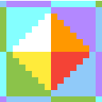，保证在一个探针内采样时，不会采样到别的探针数据
> 4. 光照Pass使用探针：根据着色点位置找到周围8个探针，从8个探针中获取对应法线位置的数据进行加权平均，有3种权重系数
>    1. 如果probe离着色点较远，降低probe的权重（三线性插值系数）
>    2. 如果着色点到probe的方向与表面法线的夹角过大，降低probe的权重（方向系数）
>    3. 如果着色点与probe之间有较大的概率存在遮挡物，降低probe的权重（切比雪夫系数）

# DDGI Probe

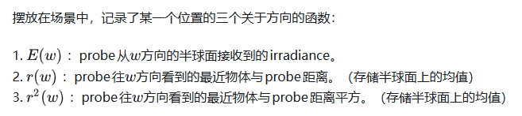

# DDGIVolume

> 把探针组组成一个包围盒，定义探针数量和间距，以及DDGI的各种参数，这里实现了一个新的探针组件来表达它，并实现了他的可视化

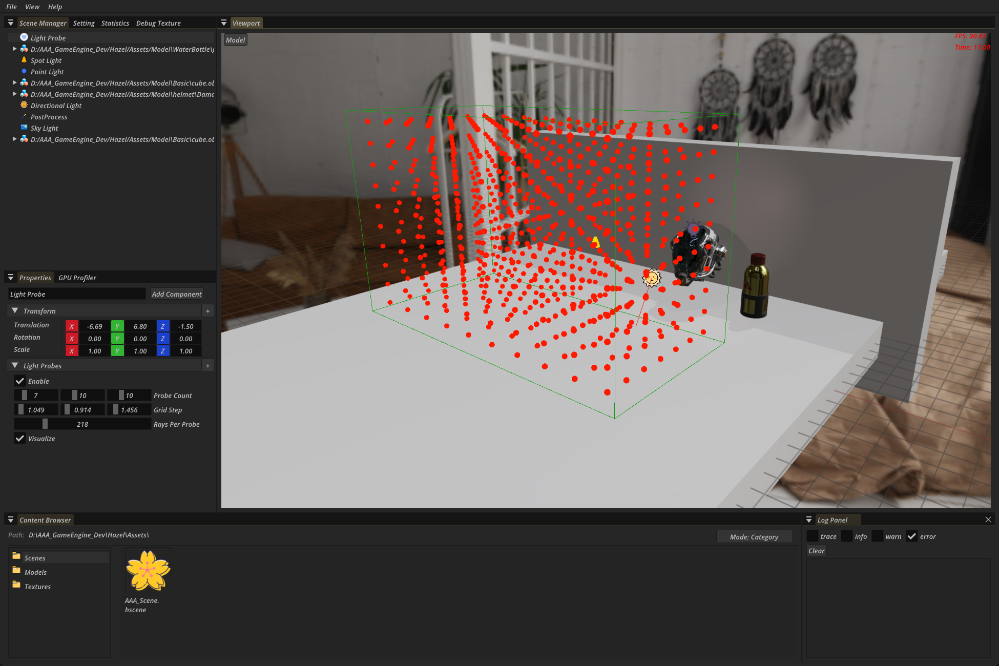

## 

# ProbeTrace

> 这个阶段利用光追，计算并保存每个探针发射四面八方的光线的Radiance 信息（在每个击中点进行一次光照计算）

1. 获取volume的设置，采用y-up方向，作为Image2Darray的layer，所以每层的探针数量为probeCount.x * probeCount.z

```c++
DDGISetting ddgiSetting = RENDER_RESOURCEMANAGER->GetGlobalSettingInfo().ddgiSetting;

glm::uvec3 probeCount = ddgiSetting.probeCount;
uint32_t raysPerProbe = ddgiSetting.raysPerProbe;
uint32_t probeCountPreLayer = probeCount.x * probeCount.z;
uint32_t volumeLayerCount = probeCount.y;  // y-up
```

2. 执行光追TraceRays(raysPerProbe，probeCountPreLayer，volumeLayerCount)

```c++
// VolumeTrace
{
	auto& build = builder.CreateRayTracingPass(GetName() + "_VolumeTrace")
		.PassIndex(raysPerProbe, probeCountPreLayer, volumeLayerCount)
		.RootSignature(m_VolumeTraceRootSignature)
		.ReadWrite(1, 0, 0, rayTexture, VIEW_TYPE_2D_ARRAY, { TEXTURE_ASPECT_COLOR ,0,1,0,volumeLayerCount })
		.Read(1, 1, 0, dirShadowMap, VIEW_TYPE_2D_ARRAY, { TEXTURE_ASPECT_DEPTH ,0,1,0,4 })
		.Read(1, 3, 0, skyBox, VIEW_TYPE_CUBE, { TEXTURE_ASPECT_COLOR ,0,1,0,6 })
		.Read(1, 4, 0, irrandiance, VIEW_TYPE_2D_ARRAY, { TEXTURE_ASPECT_COLOR,0,1,0,volumeLayerCount })
		.Read(1, 5, 0, distance, VIEW_TYPE_2D_ARRAY, { TEXTURE_ASPECT_COLOR,0,1,0,volumeLayerCount })
		.Execute([&](RDGPassContext context) {
		RHICommandListRef command = context.command;
		command->SetRayTracingPipeline(m_VolumeTracePipeline);
		command->BindDescriptorSet(RENDER_RESOURCEMANAGER->GetGlobalResourcePerFrameDescriptorSet(), 0);
		command->BindDescriptorSet(context.descriptors[1], 1);
		command->TraceRays(context.passIndex[0], context.passIndex[1], context.passIndex[2]);
			});
	LightInfo& lightInfo = LightCollector::GetLightInfo();
	if (lightInfo.pointLightCount > 0) {
		RDGTextureHandle pointShadowMap = builder.GetTexture("Point Shadow Color[0]");
		build.Read(1, 2, 0, pointShadowMap, VIEW_TYPE_CUBE, { TEXTURE_ASPECT_COLOR,0,1,0,6 });
	}
}
```

3. 光追Shader

   > RayGen中需要为每个探针的每条光线的击中点计算光照和阴影，并且混合历史信息（计算击中点的周围8个探针历史信息的irrandiance，作为击中点的间接光照（只计算漫反射部分））

   ```glsl
   struct Payload {
       vec3 albedo;
   	float roughness; 
   	vec3 worldPosition;
   	float metallic;
   	vec3 normal;
   	float  hitT;
   };
       
   
   void main(){
   
       uint rayIndex = gl_LaunchIDEXT.x;
       uint probePlaneIndex = gl_LaunchIDEXT.y;
       uint planeIndex = gl_LaunchIDEXT.z;
       uint probeCountPrePlane = DDGIGetProbesPerPlane(volume.probeCount);  // x * z（y-up）
   	uint probeIndex = (planeIndex * probeCountPrePlane) + probePlaneIndex; 
   	uvec3 probeCoords = DDGIGetProbeCoords(probeIndex,volume); // 探针在探针网格的坐标
   	vec3 probeWorldPosition = DDGIGetProbeWorldPosition(probeCoords, volume); 
   	vec3 rayDirection = normalize(RTXGISphericalFibonacci(rayIndex,volume.raysPerProbe)); // 生成光线方向
       // 最终每根光线的计算结果都需要存储， Texture2DArray(x:rayIndex, y:probeIndexInLayer, z:layerIndex)
   	uvec3 outputCoords = DDGIGetRayDataTexelCoords(rayIndex,probeIndex,volume);
   
       // 启动射线
   	traceRayEXT(TLAS, 					// acceleration structure
   		gl_RayFlagsOpaqueEXT,       	// rayFlags 控制光线的行为，比如是否忽略背面、是否启用 any-hit、是否可用 conservative tracing 等
   		0xFF,           				// cullMask 0xFF → 匹配所有实例
   		0,              				// sbtRecordOffset 索引到 Shader Binding Table (SBT) 的起始记录位置
   		1,              				// sbtRecordStride SBT 中每条记录的间隔（单位是记录数，不是字节）
   		0,              				// missIndex 当光线没有击中任何几何体时，使用 SBT 中 miss shader 的索引
   		probeWorldPosition.xyz,     	// ray origin
   		0,       						// ray min range
   		rayDirection.xyz,  				// ray direction
   		MAX_RAY_TRACING_DISTANCE,       // TODO:这个应该换成DDGI自己的参数设置
   		0               				// payload (location = 0) payload的位置
     	);
       
       // Miss，返回天空的Radiance
       if(payload.hitT == -1.f){
           imageStore(out_RAYDATA, ivec3(outputCoords), vec4(payload.albedo, 1e27f));
           return;
   	}
   	
       // 击中背面，参考RTXGI的做法
       // Make the hit distance negative to mark a backface hit for blending, probe relocation, and probe classification.
   	// Shorten the hit distance on a backface hit by 80% to decrease the influence of the probe during irradiance sampling.
       if(payload.hitKind == gl_HitKindBackFacingTriangleEXT){
       	imageStore(out_RAYDATA, ivec3(outputCoords), vec4(vec3(0), -payload.hitT * 0.2));
       	return;
   	}
       
   /////////////////////////////////////////////
   // Directional Light TODO: 点光源和聚光   这里也是通过TraceRays来判断阴影的
   /////////////////////////////////////////////
   	vec3 brdf = (payload.albedo / PI);
   	vec3 lighting = vec3(0.f);
   	DirectionLight dirLight = GetDirectionLight();
   	// 硬件在找到第一个 hit 后立即停止 | 跳过ClosestHitShader，直接返回rayGen | 所有模型都被视为不透明
   	const uint rayFlags =gl_RayFlagsTerminateOnFirstHitEXT | gl_RayFlagsSkipClosestHitShaderEXT | gl_RayFlagsOpaqueEXT;
   	// 发射光线计算遮挡
   	traceRayEXT(TLAS,
   		rayFlags,
   		0xFF, 
   		0, 
   		1,
   		1, 
   		payload.worldPosition,
   		0,   
   		-dirLight.direction,
   		MAX_RAY_TRACING_DISTANCE,
   		1
     	);
   	float shadowScale = 1.0;
   	if(shadowPayload.hitT !=  -1.f){
   		shadowScale = 0.0;
   	}
       vec3 lightDirection = -normalize(dirLight.direction);
       float  nol = max(dot(payload.normal, lightDirection), 0.f);
   	vec3 dirLighting = nol * dirLight.radiance * shadowScale;
   	lighting += dirLighting;
   	vec3 diffuse = lighting * brdf;
   
       
   /////////////////////////////////////////////
   // Indirection Light
   /////////////////////////////////////////////
   	vec3 irradiance = vec3(0);
   	float volumeBlendWeight = DDGIGetVolumeBlendWeight(payload.worldPosition, volume);
   	if (volumeBlendWeight > 0){
   
           irradiance = DDGIGetIrrandianceByWorldPosition(
               payload.worldPosition,
               payload.normal,
               volume,
               ddgi_Irrandiance,ddgi_Distance);
   	}
   	// Perfectly diffuse reflectors don't exist in the real world.
       // Limit the BRDF albedo to a maximum value to account for the energy loss at each bounce.
       float maxAlbedo = 0.9f;
   	
       vec3 radiance = diffuse + ((min(payload.albedo, vec3(maxAlbedo, maxAlbedo, maxAlbedo)) / PI) * irradiance * volumeBlendWeight);
   
   	// 最终存储rayData radiance(3) + hitT(1)
   	imageStore(out_RAYDATA, ivec3(outputCoords), vec4(Saturate(radiance), payload.hitT));
   }
   ```

   > closestHit需要获取击中点的模型信息

   ```glsl
   #ifdef RAYCLOSEST_HIT_SHADER
   layout(location = 0) rayPayloadInEXT Payload payload;
   hitAttributeEXT vec2 attribs;
   void main()
   {
   	uint instanceID       = gl_InstanceCustomIndexEXT;   // 在构建TLAS时，给每个实例分配的ID
   	uint primitiveID     = gl_PrimitiveID;  // 击中的三角形索引
   
   	vec3 barycentrics = vec3(1.0 - attribs.x - attribs.y, attribs.x, attribs.y); 
   
   	// 收集MeshInfo
   	mat4 model = GetModelMatrix(instanceID);
   	uvec3 triangleIndex = GetTriangleIndex(instanceID, primitiveID);
   	vec4 position = GetTrianglePosition(instanceID,triangleIndex,barycentrics);
   	vec3 meshNormal = GetTriangleMeshNormal(instanceID,triangleIndex,barycentrics);
   	vec4 tangent = GetTriangleTangent(instanceID,triangleIndex,barycentrics);
   
   	vec3 worldNormal = GetWorldNormal(meshNormal,model);
   	vec4 worldTangent = GetWorldTangent(tangent,model);
   	vec2 texCoord  = GetTriangleTexCoord(instanceID, triangleIndex, barycentrics);    
       vec4 worldPos       = model * position; 
   	MaterialInfo material   = GetMaterialInfo(instanceID);
   	vec4 albedo = GetDiffuse(material,texCoord);
   	vec3 normal = GetNormal(material, texCoord, worldNormal, worldTangent);
       vec4 emission = GetEmission(material,texCoord);
   	albedo += emission;
   	float roughness = GetRoughness(material,texCoord);
       float metallic = GetMetallic(material, texCoord);
   
   	payload.worldPosition = worldPos.xyz;
   	payload.normal = normal;
   	payload.roughness = roughness;
   	payload.metallic = metallic;
   	payload.albedo = albedo.rgb;
   	payload.hitT = gl_HitTEXT;
   	payload.hitKind = gl_HitKindEXT;
   }
   #endif
   ```

   > Miss处理未击中的情况，需要两个，一个处理天空，一个处理阴影判断标记（因为MissShader只支持一个Payload，好像只有RayGen可以定义多个PayLoad，其他都只能用于处理一个PayLoad）

   ```glsl
   #ifdef RAYMISS_SHADER
   layout(location = 0) rayPayloadInEXT Payload payload;    // rayPayloadInEXT 注意是InEXT
   
   layout(set = 1, binding = 3) uniform textureCube skyCube;
   void main()
   {
   	vec3 rayDir = normalize(gl_WorldRayDirectionEXT);
       payload.albedo = texture(samplerCube(skyCube,SAMPLER[0]),rayDir).rgb;
   	payload.hitT = -1;
   }
   #endif
   ```

   ```glsl
   #ifdef RAYMISS_SHADER
   layout(location = 1) rayPayloadInEXT ShadowPayLoad shadowPayload;
   
   void main()
   {
   	shadowPayload.hitT = -1;
   }
   #endif
   ```

   RayTrace结束后，获得了每个探针的每条光线携带的Radiance信息

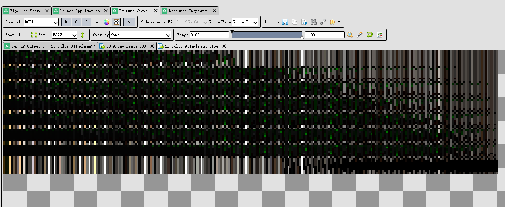

>  另外还会在着色点采样它周围8个探针的光照数据（就是上一帧的记录，也是该着色点的间接光照）这样做相当于得到了采样点的间接光照


# ProbeBlend

> 根据RayData来更新探针信息

## IrrandianceBlend

> 探针理论上需要存储每个方向上的半球积分来得到该位置的Irrandiance，但是存储所有方向不太可能，DDGI采用6*6的像素存储一个探针36个方向上的Irrandiance，使用时进行插值即可，另外使用八面体映射，遍历每个探针，保存一个6 * 6区域，每个区域都被映射到八面体上的一个方向，再把这个方向挪到球面，遍历所有光线与该方向的权重进行混合

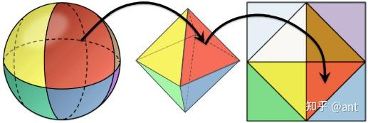

> 注意Texture2DArray的采样的uvw的w不是0-1,用第几层就传递几，这点疏忽了给我整麻了

```c++
// dispatch 需要处理网格中的每一个探针，所以传入的是probeCount.x, probeCount.y, probeCount.z
{
        // Irrandiance Blend
        builder.CreateComputePass(GetName() + "_ProbeIrrandianceBlend")
            .ReadWrite(1, 0, 0, irrandiance, VIEW_TYPE_2D_ARRAY, { TEXTURE_ASPECT_COLOR ,0,1,0,volumeLayerCount })
            .ReadWrite(1, 1, 0, rayTexture, VIEW_TYPE_2D_ARRAY, { TEXTURE_ASPECT_COLOR ,0,1,0,volumeLayerCount })
            .RootSignature(m_ProbeIrrandianceBlendRootSignature)
            .PassIndex(probeCount.x, probeCount.z, probeCount.y)
            .Execute([&](RDGPassContext context) {
            RHICommandListRef command = context.command;
            command->SetComputePipeline(m_ProbeIrrandianceBlendPipeline);
            command->BindDescriptorSet(RENDER_RESOURCEMANAGER->GetGlobalResourcePerFrameDescriptorSet(), 0);
            command->BindDescriptorSet(context.descriptors[1], 1);
            command->Dispatch(context.passIndex[0], context.passIndex[1], context.passIndex[2]);
                })
            .Finish();
    }
```

```glsl
layout(set = 1, rgba32f, binding = 0) uniform image2DArray o_Texture;
layout(set = 1, rgba32f, binding = 1) uniform image2DArray  IN_RayData;
// 每个探针需要8*8的区域，所以这里线程组设置就是8*8（内部6*6是数据，外部一圈是填充，为了保证双线性插值的正确性）
layout(local_size_x = DDGI_PROBE_NUM_TEXELS_IRRANDIANCE, local_size_y = DDGI_PROBE_NUM_TEXELS_IRRANDIANCE, local_size_z = 1) in;

void main(){
    // 索引探针在RayData的位置
    DDGISetting volume = GetDDGISetting();
    uvec3 groupID = gl_WorkGroupID;  // 对于dispatch的ID
    uvec3 invocationID = gl_GlobalInvocationID; // 相对于全局的调用ID 用于最后存储像素位置
    uvec3 LocalInvocationID = gl_LocalInvocationID; // 相对于组内的调用ID 用于区别边界和内部
    // 用LocalInvocationID是不是0，0或者 7，7 马上就能判断是不是边界
    bool isBorderTexel = (LocalInvocationID.x == 0 || LocalInvocationID.x == (DDGI_PROBE_NUM_TEXELS_IRRANDIANCE_INTERIOR + 1)) || (LocalInvocationID.y == 0 || LocalInvocationID.y == (DDGI_PROBE_NUM_TEXELS_IRRANDIANCE_INTERIOR + 1));
    
    // 
    uint probeIndex = (groupID.y * DDGIGetProbesPerPlane(volume.probeCount)) + groupID.z * volume.probeCount.x + groupID.x ;

    // Early out: no probe maps to this thread 感觉不会出现这种情况
    uint numProbes = (volume.probeCount.x * volume.probeCount.y * volume.probeCount.z);
    if (probeIndex >= numProbes || probeIndex < 0) return;
    
    vec4 result = vec4(0.0);
    
    // 首先处理内部6*6
    if(!isBorderTexel){
        // 对于6*6区域的一个像素，对应到探针的一个方向上，需要计算这个方向上的半球积分来存储Irrandiance
        // 1. 获取这个像素对应的方向
        uvec3 threadCoords = uvec3(groupID.x * DDGI_PROBE_NUM_TEXELS_IRRANDIANCE_INTERIOR, groupID.y * DDGI_PROBE_NUM_TEXELS_IRRANDIANCE_INTERIOR, invocationID.z) + LocalInvocationID - uvec3(1, 1, 0); // 计算出抛开边界后当前线程是的坐标（没有边界填充的2DArray坐标）
        // 把6*6区域当作一个纹理，下面获得当前线程处理的位置的UV坐标[-1,1]
        vec2 probeOctantUV = DDGIGetNormalizedOctahedralCoordinates(uvec2(threadCoords.xy), DDGI_PROBE_NUM_TEXELS_IRRANDIANCE_INTERIOR);
        // 获取这个UV对应到八面体上的方向
    	vec3 probeRayDirection = DDGIGetOctahedralDirection(probeOctantUV);

        
        // 遍历当前探针的所有光线，为当前八面体上的方向计算irrandiance
        for (uint rayIndex = 0; rayIndex < volume.raysPerProbe; rayIndex++){
            // 获取ray的方向，RTXGISphericalFibonacci是可以复现的所以不需要提前存储
            vec3 rayDirection = normalize(RTXGISphericalFibonacci(rayIndex,volume.raysPerProbe));  // TODO: 优化点，因为每个探针计算这个都是一模一样的
            // 当前要存储的方向与这跟光线的cos，两个方向夹角越小，权重越大
            float weight = max(0.0, dot(probeRayDirection, rayDirection));
            // 解析RayData中的信息
            uvec3 rayDataTexCoords = DDGIGetRayDataTexelCoords(rayIndex, probeIndex, volume);  
            vec4 storedData = imageLoad(IN_RayData, ivec3(rayDataTexCoords));
            vec3 probeRayRadiance = storedData.xyz;
            float probeRayDistance = storedData.w;
            if(probeRayDistance < 0){ // 击中的是背面
                continue;
            }
            result += vec4(probeRayRadiance * weight, weight);
        }

        // 到这里 用vec4存储了所有光线的加权和，并且w分量存储了权重和，方便计算
//////////////////////////////工程化修正/////////////////////////////////////////////
        float epsilon = float(volume.raysPerProbe);
        epsilon *= 1e-9f;
        result.rgb *= 1.f / (1.f * max(result.a, epsilon));

        // 时域加权混合
        vec4 history = imageLoad(o_Texture,ivec3(gl_GlobalInvocationID));
        vec3 delta = (result.rgb - history.rgb);

        float  hysteresis = 0.97; // TODO：混合系数是参数
        if (dot(history, history) == 0) hysteresis = 0.f;
        float probeIrradianceEncodingGamma = 5.0f;  // TODO：编码Gamma是参数
        
        result.rgb = pow(result.rgb, vec3(1.f / probeIrradianceEncodingGamma));
        vec3 irradianceSample = result.rgb;
        float probeIrradianceThreshold = 0.25f; // TODO：阈值是参数
        if (RTXGIMaxComponent(history.rgb - result.rgb) > probeIrradianceThreshold)
        {
            // Lower the hysteresis when a large lighting change is detected
            hysteresis = max(0.f, hysteresis - 0.75f);
        }
        float probeBrightnessThreshold  = 0.10f; // TODO：阈值是参数
        if (RGBtoLuminance(delta) > probeBrightnessThreshold)
        {
            // Clamp the maximum per-update change in irradiance when a large brightness change is detected
            delta *= 0.25f;
        }
        const float c_threshold = 1.f / 1024.f;
        vec3 lerpDelta = (1.f - hysteresis) * delta;
        if (RTXGIMaxComponent(result.rgb) < RTXGIMaxComponent(history.rgb))
        {
            lerpDelta = min(max(vec3(c_threshold), abs(lerpDelta)), abs(delta)) * sign(lerpDelta);
        }
        result = vec4(history.rgb + lerpDelta, 1.f);
        imageStore(o_Texture, ivec3(gl_GlobalInvocationID), result);
///////////////////////////////////////////////////////////////////////////
        
        
        // 边界处理
       else{
        // 边界
        // AllMemoryBarrierWithGroupSync();   这里有一个同步点 

        bool isCornerTexel = (LocalInvocationID.x == 0 || LocalInvocationID.x == (DDGI_PROBE_NUM_TEXELS_IRRANDIANCE - 1)) && (LocalInvocationID.y == 0 || LocalInvocationID.y == (DDGI_PROBE_NUM_TEXELS_IRRANDIANCE - 1));
        bool isRowTexel = (LocalInvocationID.x > 0 && LocalInvocationID.x < (DDGI_PROBE_NUM_TEXELS_IRRANDIANCE - 1));

        uvec3 copyCoordinates = uvec3(groupID.x * DDGI_PROBE_NUM_TEXELS_IRRANDIANCE, groupID.y * DDGI_PROBE_NUM_TEXELS_IRRANDIANCE, invocationID.z);

        if(isCornerTexel)
        {
            copyCoordinates.x += LocalInvocationID.x > 0 ? 1 : DDGI_PROBE_NUM_TEXELS_IRRANDIANCE_INTERIOR;
            copyCoordinates.y += LocalInvocationID.y > 0 ? 1 : DDGI_PROBE_NUM_TEXELS_IRRANDIANCE_INTERIOR;
        }
        else if(isRowTexel)
        {
            copyCoordinates.x += (DDGI_PROBE_NUM_TEXELS_IRRANDIANCE - 1) - LocalInvocationID.x;
            copyCoordinates.y += LocalInvocationID.y + ((LocalInvocationID.y > 0) ? -1 : 1);
        }
        else // Column Texel
        {
            copyCoordinates.x += LocalInvocationID.x + ((LocalInvocationID.x > 0) ? -1 : 1);
            copyCoordinates.y += (DDGI_PROBE_NUM_TEXELS_IRRANDIANCE - 1) - LocalInvocationID.y;
        }

        imageStore(o_Texture, ivec3(gl_GlobalInvocationID), imageLoad(o_Texture, ivec3(copyCoordinates)));
    }
}

```

## DistanceBlend

对于distance，只有一些地方不一样

```glsl
#version 450 core
#include "../common/common.glsl"
#include "../common/DDGI.glsl"
layout(set = 1, rgba32f, binding = 0) uniform image2DArray o_Texture;
layout(set = 1,rgba32f, binding = 1) uniform image2DArray  IN_RayData;
#ifdef COMPUTE_SHADER
layout(local_size_x = DDGI_PROBE_NUM_TEXELS_DISTANCE, local_size_y = DDGI_PROBE_NUM_TEXELS_DISTANCE, local_size_z = 1) in;  
void main(){
	DDGISetting volume = GetDDGISetting();
    uvec3 groupID = gl_WorkGroupID;  // 对于dispatch的ID
    uvec3 invocationID = gl_GlobalInvocationID; // 相对于全局的调用ID
    uvec3 LocalInvocationID = gl_LocalInvocationID; // 相对于组内的调用ID
    bool isBorderTexel = (LocalInvocationID.x == 0 || LocalInvocationID.x == (DDGI_PROBE_NUM_TEXELS_DISTANCE_INTERIOR + 1)) || (LocalInvocationID.y == 0 || LocalInvocationID.y == (DDGI_PROBE_NUM_TEXELS_DISTANCE_INTERIOR + 1));
    uint probeIndex = (groupID.y * DDGIGetProbesPerPlane(volume.probeCount)) + groupID.z * volume.probeCount.x + groupID.x ;

    vec4 result = vec4(0.0);

    if(!isBorderTexel){
        uvec3 threadCoords = uvec3(groupID.x * DDGI_PROBE_NUM_TEXELS_DISTANCE_INTERIOR, groupID.y * DDGI_PROBE_NUM_TEXELS_DISTANCE_INTERIOR, invocationID.z) + LocalInvocationID - uvec3(1, 1, 0);
        vec2 probeOctantUV = DDGIGetNormalizedOctahedralCoordinates(uvec2(threadCoords.xy), DDGI_PROBE_NUM_TEXELS_DISTANCE_INTERIOR);
        vec3 probeRayDirection = DDGIGetOctahedralDirection(probeOctantUV);
        // 遍历当前探针的所有光线
        for (uint rayIndex = 0; rayIndex < volume.raysPerProbe; rayIndex++){
            vec3 rayDirection = normalize(RTXGISphericalFibonacci(rayIndex, volume.raysPerProbe));
            float weight = max(0.f, dot(probeRayDirection, rayDirection));
            float probeDistanceExponent = 50.f; // TODO:参数
             // Increase or decrease the filtered distance value's "sharpness"
            weight = pow(weight, probeDistanceExponent);
            uvec3 rayDataTexCoords = DDGIGetRayDataTexelCoords(rayIndex, probeIndex, volume);
            // 光线最大能射到probe间距的1.5倍
            float probeMaxRayDistance = length(volume.gridStep) * 1.5f;
            vec4 storedData = imageLoad(IN_RayData, ivec3(rayDataTexCoords));
            float probeRayDistance = storedData.w;
            probeRayDistance = min(abs(probeRayDistance),probeMaxRayDistance);
            result += vec4(probeRayDistance * weight, (probeRayDistance * probeRayDistance) * weight, 0.f, weight);
        }
//////////////////////////////工程化修正/////////////////////////////////////////////
        float epsilon = float(volume.raysPerProbe);
        epsilon *= 1e-9f;
        result.rgb *= 1.f / (1.f * max(result.a, epsilon));

        // 时域加权混合
        vec4 history = imageLoad(o_Texture,ivec3(gl_GlobalInvocationID));
        float  hysteresis = 0.97; // TODO：混合系数是参数
        if (dot(history, history) == 0) hysteresis = 0.f;
        result = vec4(Lerp(result.rg, history.rg, hysteresis), 0.f, 1.f);
//////////////////////////////工程化修正/////////////////////////////////////////////
        imageStore(o_Texture, ivec3(gl_GlobalInvocationID), result);
        return;

    }else{
        // 边界
        memoryBarrier();        // 所有全局内存类型的屏障
        memoryBarrierShared();  // 对 shared 内存屏障
        barrier();   //这里有一个同步点 


        bool isCornerTexel = (LocalInvocationID.x == 0 || LocalInvocationID.x == (DDGI_PROBE_NUM_TEXELS_DISTANCE - 1)) && (LocalInvocationID.y == 0 || LocalInvocationID.y == (DDGI_PROBE_NUM_TEXELS_IRRANDIANCE - 1));
        bool isRowTexel = (LocalInvocationID.x > 0 && LocalInvocationID.x < (DDGI_PROBE_NUM_TEXELS_DISTANCE - 1));

        uvec3 copyCoordinates = uvec3(groupID.x * DDGI_PROBE_NUM_TEXELS_DISTANCE, groupID.y * DDGI_PROBE_NUM_TEXELS_DISTANCE, invocationID.z);

        if(isCornerTexel)
        {
            copyCoordinates.x += LocalInvocationID.x > 0 ? 1 : DDGI_PROBE_NUM_TEXELS_DISTANCE_INTERIOR;
            copyCoordinates.y += LocalInvocationID.y > 0 ? 1 : DDGI_PROBE_NUM_TEXELS_DISTANCE_INTERIOR;
        }
        else if(isRowTexel)
        {
            copyCoordinates.x += (DDGI_PROBE_NUM_TEXELS_DISTANCE - 1) - LocalInvocationID.x;
            copyCoordinates.y += LocalInvocationID.y + ((LocalInvocationID.y > 0) ? -1 : 1);
        }
        else // Column Texel
        {
            copyCoordinates.x += LocalInvocationID.x + ((LocalInvocationID.x > 0) ? -1 : 1);
            copyCoordinates.y += (DDGI_PROBE_NUM_TEXELS_DISTANCE - 1) - LocalInvocationID.y;
        }

        imageStore(o_Texture, ivec3(gl_GlobalInvocationID), imageLoad(o_Texture, ivec3(copyCoordinates)));
    }

}

#endif
```


## IndirectLight

```glsl
/*
    根据一个世界坐标，计算从探针中获取的Irrandiance
*/
vec3 DDGIGetIrrandianceByWorldPosition(vec3 worldPosition, vec3 direction, DDGISetting volume, texture2DArray IrrdianceTexture,texture2DArray distanceTexture){

    // 如果WorldPosition不在DDGIvolume内，直接返回
    // if(!DDGICheckPostion(worldPosition,volume)){
    //     return vec3(0.f, 0.f, 0.f);
    // }
    vec3  sumIrradiance = vec3(0.0f);
    float sumWeight = 0.0f;

    vec3 irradiance = vec3(0.f, 0.f, 0.f);
    float accumulatedWeights = 0.f;
    // 得到离worldPosition最近的探针坐标
    ivec3 baseProbeCoords = DDGIGetBaseProbeGridCoords(worldPosition, volume);
    vec3 baseProbeWorldPosition = DDGIGetProbeWorldPosition(baseProbeCoords,volume);
    vec3 alpha = clamp(((worldPosition - baseProbeWorldPosition) / volume.gridStep), vec3(0.f, 0.f, 0.f), vec3(1.f, 1.f, 1.f));

    for(int i = 0; i < 8; i++){
        float weight = 1.0;
        // 使用魔法获得一个探针😄
        ivec3  offset  = ivec3(i, i >> 1, i >> 2) & ivec3(1);
        ivec3  probeGridCoord   = clamp(baseProbeCoords + offset, ivec3(0), ivec3(volume.probeCount) - ivec3(1));
        uint probeIndex =  (probeGridCoord.y * DDGIGetProbesPerPlane(volume.probeCount)) + probeGridCoord.z * volume.probeCount.x + probeGridCoord.x;
        vec3 probePos = DDGIGetProbeWorldPosition(probeGridCoord, volume);

        // 方向系数
        {
            vec3 directionToProbe = normalize(probePos - worldPosition);
            weight *= Square(max(0.0001, (dot(directionToProbe, direction) + 1.0) * 0.5)) + 0.2;  
        }

        //切比雪夫系数
        {
            vec3 probeToPoint   = worldPosition - probePos;
            vec3 dir            = normalize(-probeToPoint);
            float dist          = length(probeToPoint);
            vec2 octantCoords = DDGIGetOctahedralCoordinates(dir);
            vec3 probeTextureUV = DDGIGetProbeUV(int(probeIndex), octantCoords, int(DDGI_PROBE_NUM_TEXELS_DISTANCE_INTERIOR), volume);
            vec2 temp = texture(sampler2DArray(distanceTexture,SAMPLER[0]),probeTextureUV).rg;  // 采样距离纹理
            float mean      = temp.x;
            float variance  = abs(Square(temp.x) - temp.y);

            float chebyshev = variance / (variance + Square(max(dist - mean, 0.0)));
            chebyshev       = max(Pow3(chebyshev), 0.0);  //以切比雪夫系数三次方作为权重

            weight *= (dist <= mean) ? 1.0 : chebyshev;
        }

        //避免计算精度问题
        {
            weight = max(0.000001, weight); 

            const float crushThreshold = 0.2f;
            if (weight < crushThreshold)
                weight *= weight * weight * (1.0f / Square(crushThreshold)); 
        }

        //三线性插值系数
        {
            vec3 trilinear = mix(1.0 - alpha, alpha, offset);
            weight *= trilinear.x * trilinear.y * trilinear.z;  
        }

        //采样，累计光照      
        {
            vec3 irradianceDir  = direction;
            vec2 octantCoords = DDGIGetOctahedralCoordinates(direction);
            vec3 probeTextureUV = DDGIGetProbeUV(int(probeIndex), octantCoords, int(DDGI_PROBE_NUM_TEXELS_IRRANDIANCE_INTERIOR), volume);
            vec3 probeIrradiance = texture(sampler2DArray(IrrdianceTexture,SAMPLER[0]),probeTextureUV).rgb;
            sumIrradiance += weight * probeIrradiance;
            sumWeight += weight;
        }

    }

    vec3 netIrradiance = sumIrradiance / sumWeight;
    return 2 * PI * netIrradiance; 
}
```

> 下图显示只渲染间接光

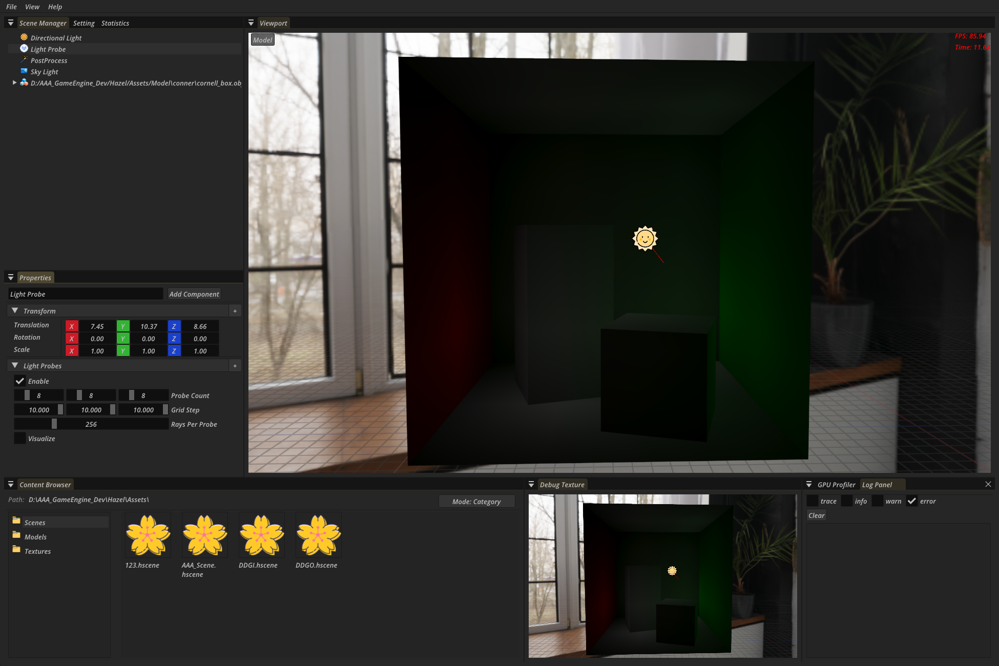

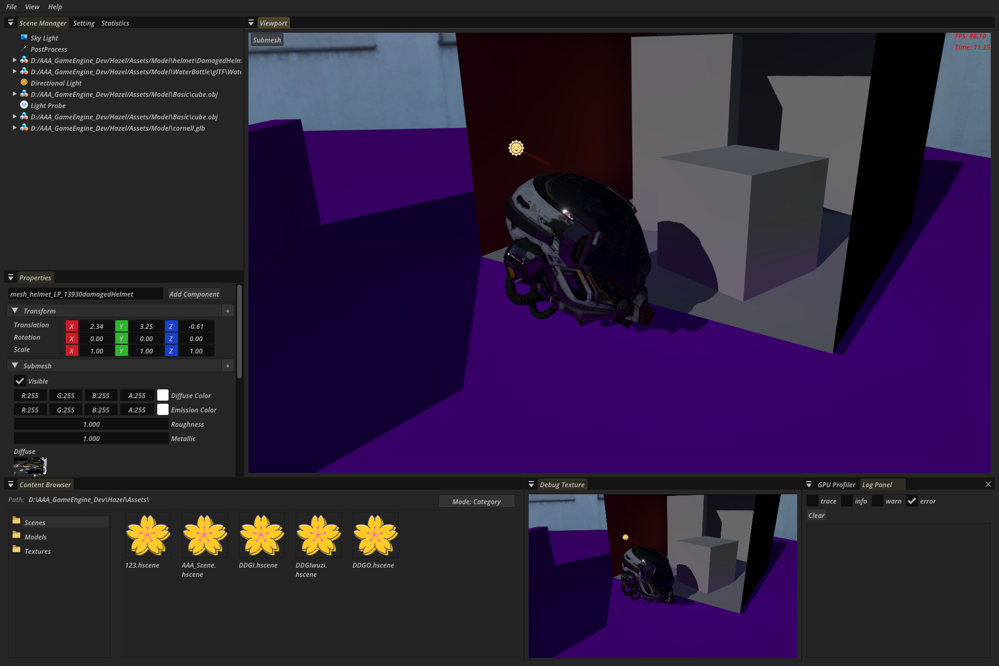

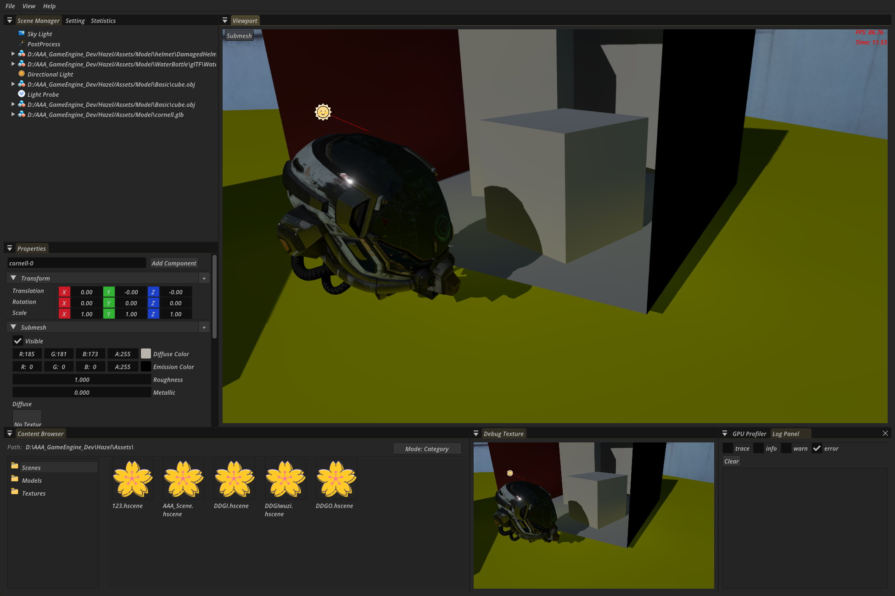

# Math

首先回顾Irrandiance是单位半球上各个方向的Radiance的积分（×cos）

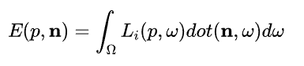

均匀分布的蒙特卡洛积分来近似上边这个积分式

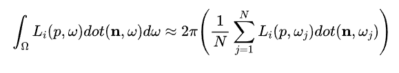

DDGI存储一个Irrandiance时，并不是/N，而是/余弦权重之和，目的是减少方差

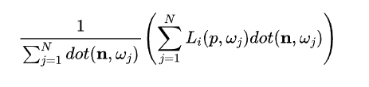

他的期望是N/2,对比蒙特卡洛积分还需要*2

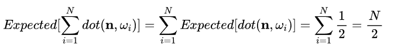

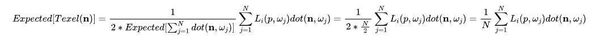

# 总结

1. 第一次实现比较复杂的全局光照效果，还是太逞能，总想抄RTXGI的各种实践Tick，实际根本理解不了。甚至还想着用Y-Up来构建Imager2DArray，导致逻辑十分混乱。大量时间用在了无用的调试Bug上。
2. 还有一些DDGI的内容没有实现
   1. **RelocationVolumeProbes**：读取一个探针交中背面的次数，如果大于阈值，说明Probe在墙里边，就朝着交中背面的方向偏移，或者交中正面的距离太短了，也进行偏移 
   2. **ClassifyVolumeProbes**：Classify主要是为了给probe进行分类，对于一些卡在墙中或者不在视野内的probe则不进行计算，以节省开销，当然，更重要的是，这个还能避免计算墙外probe，一定程度上减少漏光

3.  总体来看第一次搞大动作比较失败~ 
