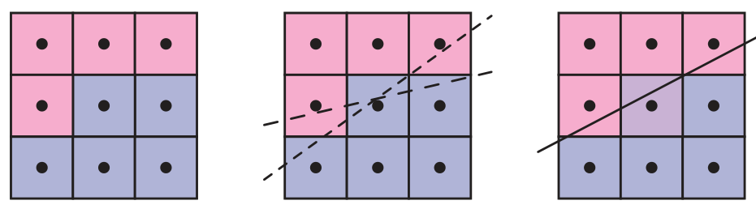
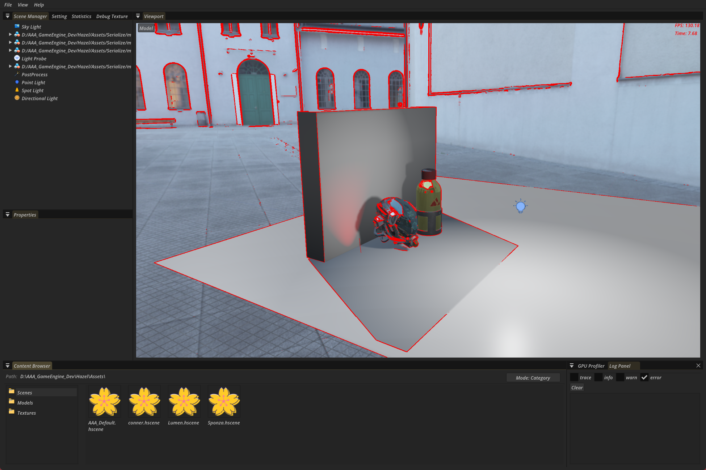
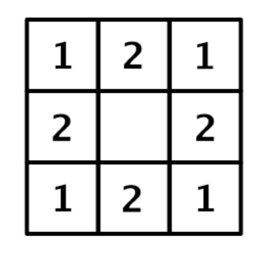
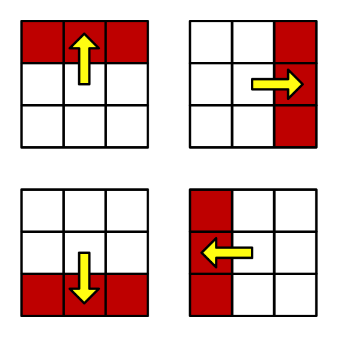
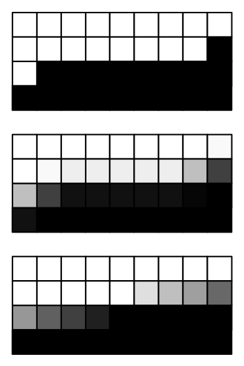
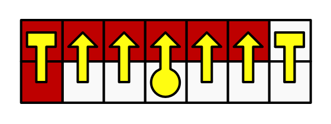
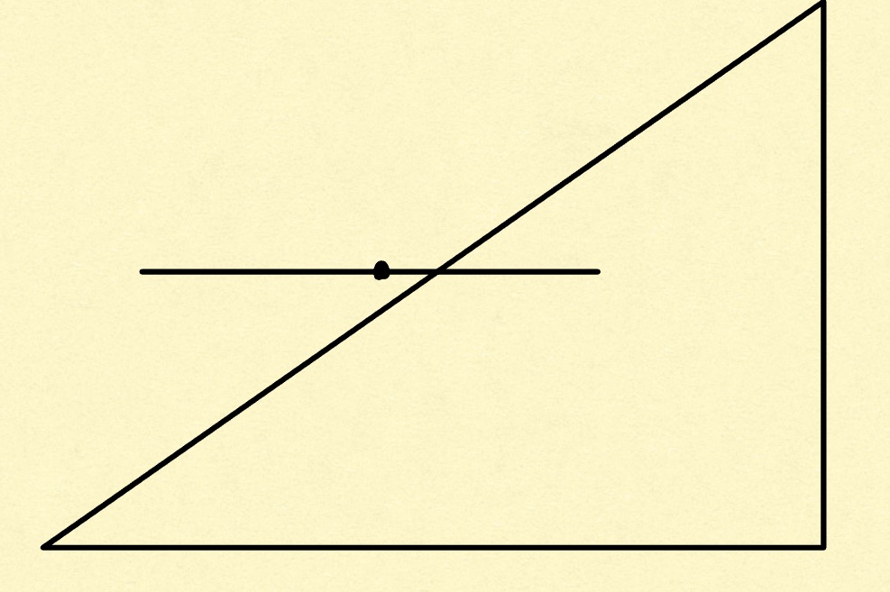

+++date = '2026-01-25T16:21:06+08:00'
draft = false
title = '游戏引擎开发实践（FXAA）'
categories = ["Projects/游戏引擎"]
tags = ["游戏引擎", "抗锯齿"]
+++

> FXAA（**fast approximate antialiasing**） 的思路是检测图像的边界，只在边界处进行滤波，达到抗锯齿的效果，确实锯齿效果就是发生在边界
>
> 这种思路被称为形变抗锯齿，SMAA也是这个类型
>
> FXAA只需要一个Pass，是一种快速抗锯齿



> FXAA 的流程：
>
> 1. 边缘检测：比较当前像素上下左右四个方向上的亮度差，过大才进行抗锯齿操作
> 2. 确定混合系数：计算当前像素与周围一圈像素的平均亮度（考虑距离，斜角距离更大）与当前像素亮度的差作为依据来确定混合系数
> 3. 确定锯齿方向，判断垂直和水平四个方向上的变化，取最大变化的方向
> 4. 在锯齿方向上进行左右搜素直到锯齿边界，离得越近的边界贡献应该越大
> 5. 用上边的混合系数和第四步的边界距离来指导最终的混合系数，得到采样时的偏移量（在采样时偏移像素中心，就相当于混合其他像素了～）

# 边缘检测

> 计算当前处理的像素点和周围像素点的亮度对比值，FXAA 通过确定水平和垂直方向上像素点的亮度差，来计算对比值。当对比度值较大时，我们认为需要进行抗锯齿处理。

实现比较容易，计算上下左右中间五个像素，求亮度，之后取最大值和最小值，如果差距过小，就当作不是边界，直接返回原数据

```c++
//////////////////////////////////////////// 1. 求亮度差 ////////////////////////////////////////////
vec2 texCoords = (vec2(invocID) + 0.5f) / vec2(textureSize);
float up = RGBtoLuminance(texture(sampler2D(historyTexture, SAMPLER[0]), texCoords + stepUV * Kernel_Map[1]).xyz);
float down = RGBtoLuminance(texture(sampler2D(historyTexture, SAMPLER[0]), texCoords + stepUV * Kernel_Map[7]).xyz);
float left = RGBtoLuminance(texture(sampler2D(historyTexture, SAMPLER[0]), texCoords + stepUV * Kernel_Map[3]).xyz);
float right = RGBtoLuminance(texture(sampler2D(historyTexture, SAMPLER[0]), texCoords + stepUV * Kernel_Map[5]).xyz);
float center = RGBtoLuminance(texture(sampler2D(historyTexture, SAMPLER[0]), texCoords).xyz);

float maxLum = max(center, max(max(up, down), max(left, right)));
float minLum = min(center, min(min(up, down), min(left, right)));
float Contrast =  maxLum - minLum;
if(Contrast < max(EDGE_THRESHOLD_MIN, maxLum * EDGE_THRESHOLD_MAX)) {
    vec4 outcolor = texture(sampler2D(historyTexture, SAMPLER[0]), texCoords);
    return;
}    
imageStore(out_texture, invocID, vec4(1,0,0,1));
```

看看效果，可以看到大部分点都认为是不需要进行处理的地方



# 基于亮度的混合系数计算

> 一方面考虑亮度差，另一方面考虑距离（对角线上的像素距离中心像素远一些）



```c++
//////////////////////////////////////////// 2. 计算基于亮度的混合系数计算 ////////////////////////////////////////////

float Filter = 2.0 * (N + E + S + W) + NE + NW + SE + SW;
Filter = Filter / 12.0;

Filter = abs(Filter - M);
Filter = saturate(Filter / Contrast);

float PixelBlend = smoothstep(0.0, 1.0, Filter);
PixelBlend = PixelBlend * PixelBlend;
```

# 计算混合方向与混合

> 锯齿的方向不一定一样，通过亮度差异来计算锯齿方向



计算完偏移方向后，最终采样点就往锯齿方向偏移，偏移量就是上一步获得的权重

```c++
    //////////////////////////////////////////// 3. 计算锯齿方向并混合 ////////////////////////////////////////////
    float Vertical = abs(N + S - 2 * M) * 2+ abs(NE + SE - 2 * E) + abs(NW + SW - 2 * W);
    float Horizontal = abs(E + W - 2 * M) * 2 + abs(NE + NW - 2 * N) + abs(SE + SW - 2 * S);
    bool IsHorizontal = Vertical > Horizontal;  // 垂直方向上亮度变化大，说明锯齿是水平的
    vec2 PixelStep = IsHorizontal ? vec2(0, stepUV.y) : vec2(stepUV.x, 0);
    float Positive = abs((IsHorizontal ? N : E) - M);
    float Negative = abs((IsHorizontal ? S : W) - M);
    if(Positive < Negative) PixelStep = -PixelStep;   // PixelStep往亮度大方向移动

    vec4 outcolor = texture(sampler2D(historyTexture, SAMPLER[0]), texCoords + PixelStep * PixelBlend);
```

# 更准确的混合系数

上述简化的方法是有问题的：

如下图1是要进行抗锯齿的图片

图2是上述方法的结果，在边界上很多像素结果都是一致的，因为在9宫格范围内他们的表现一致，但实际上考虑到这个锯齿是斜向的，所以越靠右的像素（第二排应该越靠近黑色去采样，而不是白色）

图三效果就好了



计算混合时，在锯齿方向上左右采样，直到找到锯齿的边界



看左右两边到达锯齿边界的距离远近，像素的混合系数应该更趋向于离得更近的锯齿边界的颜色

锯齿的边界其实可以理解为上下像素差距不大的地方，如上图的左右边界， 他们要么是全红了，要么是全白了，

所以离全红更近，就偏向红，否则偏向白色

如下图点离右侧锯齿边界更近，那它应该更黑一点（假设三角形内部是黑色）


