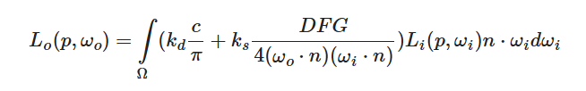
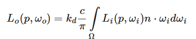
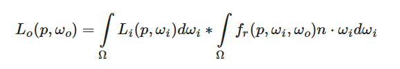
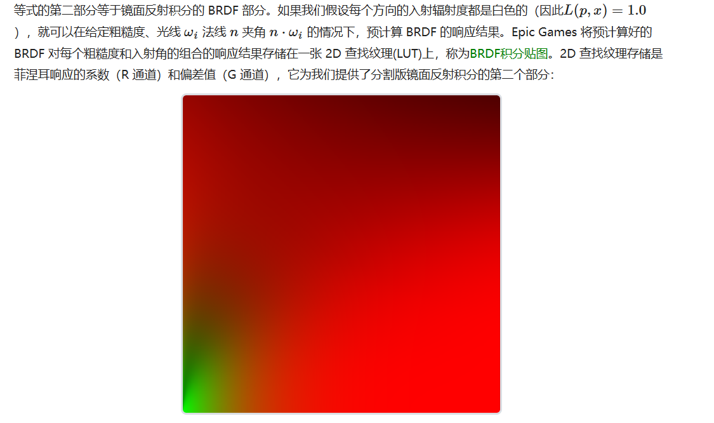

+++
date = '2026-01-11T12:51:02+08:00'
draft = true
title = '游戏引擎开发实践（IBL）'
+++

> IBL就是把一个CubeMap都当作光源，但是光照模型需要采样一个方向时要在半球上进行积分，IBL就是考虑如何在已知的CubeMap作为光照时怎么预计算一些流程，简化积分运算


> **其实IBL第一就是解决了渲染方程中 每个方向的Radiance是什么的问题, 剩下就是怎么设计预计算**



# HDR转CubeMap

> HDR图就存储的是6个面，用一些坐标映射来重建CubeMap

```c++
#version 450 core
#ifdef COMPUTE_SHADER
#include "../common/constant.glsl"
layout(set = 0, binding = 0, rgba32f) restrict writeonly uniform imageCube o_CubeMap;
layout(set = 0, binding = 1) uniform texture2D u_EquirectangularTex;
layout(set = 1, binding = 0) uniform sampler u_Samplers[];

/*
	从HDR图UV 求3D坐标
*/
vec3 GetCubeMapTexCoord(vec2 imageSize)
{
    vec2 st = gl_GlobalInvocationID.xy / imageSize;
    vec2 uv = 2.0 * vec2(st.x, 1.0 - st.y) - vec2(1.0);    // Y-反转

    vec3 ret;
    if (gl_GlobalInvocationID.z == 0)      ret = vec3(  1.0, uv.y, -uv.x);
    else if (gl_GlobalInvocationID.z == 1) ret = vec3( -1.0, uv.y,  uv.x);
    else if (gl_GlobalInvocationID.z == 2) ret = vec3( uv.x,  1.0, -uv.y);
    else if (gl_GlobalInvocationID.z == 3) ret = vec3( uv.x, -1.0,  uv.y);
    else if (gl_GlobalInvocationID.z == 4) ret = vec3( uv.x, uv.y,   1.0);
    else if (gl_GlobalInvocationID.z == 5) ret = vec3(-uv.x, uv.y,  -1.0);
    return normalize(ret);
}

layout(local_size_x = 32, local_size_y = 32, local_size_z = 1) in;
void main()
{
	vec3 cubeTC = GetCubeMapTexCoord(vec2(imageSize(o_CubeMap)));

    // Calculate sampling coords for equirectangular texture
	// https://en.wikipedia.org/wiki/Spherical_coordinate_system#Cartesian_coordinates
	float phi = atan(cubeTC.z, cubeTC.x);
	float theta = acos(cubeTC.y);
    vec2 uv = vec2(phi / (2.0 * PI) + 0.5, theta / PI);

	vec4 color = texture(sampler2D(u_EquirectangularTex,u_Samplers[0]), uv);
	color = min(color, vec4(500.0));
	imageStore(o_CubeMap, ivec3(gl_GlobalInvocationID), color);
}
#endif
```

# IrradianceMap

> 只考虑PBR模型的漫反射部分
>
> 核心思想： 漫反射部分的积分实际上是对法线半球的  Radiance * cos 的积分，所以可以预计算所有法线方向上的积分
>
> 当然IBL的问题就是  我始终假设我在CubeMap的正中心

参数很少，可以看出我要计算一个W0的积分，只需要在法线半球进行一个加权平均即可




因为漫反射是低频信息，所以每个面用32*32来存储，每个像素存储一个法线方向上的半球积分，这里其实可以换成余弦重要性采样，但是因为是预计算，其实性能没有什么要求

```glsl
layout(local_size_x=32, local_size_y=32, local_size_z=1) in;
void main()
{
    // 当前像素代表的法线方向
	vec3 N = GetCubeMapTexCoord(vec2(imageSize(o_IrradianceMap)));
	
	vec3 S, T;
	ComputeBasisVectors(N, S, T);

	uint samples = 64 * u_Uniforms.Samples;

    // 使用蒙特卡洛进行半球积分
	// Monte Carlo integration of hemispherical irradiance.
	// As a small optimization this also includes Lambertian BRDF assuming perfectly white surface (albedo of 1.0)
	// so we don't need to normalize in PBR fragment shader (so technically it encodes exitant radiance rather than irradiance).
	vec3 irradiance = vec3(0);
	for(uint i = 0; i < samples; i++)
	{
		vec2 u  = SampleHammersley(i, samples);
        // 为什么在切线空间进行采样：因为切线空间可以把N作为(0,1,0) ，不需要关心法线方向，只需要生成法线位置0，1，0情况下的采样点，
		vec3 Li = TangentToWorld(SampleHemisphere(u.x, u.y), N, S, T);
		float cosTheta = max(0.0, dot(Li, N));
		// 剩余就是基本的蒙特卡洛积分了
		// PIs here cancel out because of division by pdf.
		vec3 radianceSample = textureLod(samplerCube(u_RadianceMap, u_Samplers[0]), Li, 0).rgb;
		irradiance += 2.0 * radianceSample * cosTheta;
	}
	irradiance /= vec3(samples);

	imageStore(o_IrradianceMap, ivec3(gl_GlobalInvocationID), vec4(irradiance, 1.0));
}
```

> 这里捎带学一个从一个N向量构建标准正交基，并且避免if分支的方法
>
> 总结就是：判断两个数的大小比较 用 step
>
> 根据某个条件分成两种情况可以用mix    判断条件用step （也就是说step 返回0或1  然后用mix进行插值）

```c++
/*
	输入法向量 N，输出与 N 正交的两个向量 S、T，构成标准正交基
*/
void ComputeBasisVectors(const vec3 N, out vec3 S, out vec3 T)
{
	// Branchless select non-degenerate T.
	T = cross(N, vec3(0.0, 1.0, 0.0));
    
    // 主要的优化点在这里，如果T接近vec3(0.0, 1.0, 0.0) 那 叉乘返回是接近0向量，就需要重新换个方向构建正交基了
	T = mix(cross(N, vec3(1.0, 0.0, 0.0)), T, step(Epsilon, dot(T, T)));

	T = normalize(T);
	S = normalize(cross(N, T));
}


// 1. Step 判断T是不是0向量（注意判断方法是dot(T,T) 是否接近0）
float step(float edge, float x);  // 如果 x ≥ edge → 返回 1.0（或向量每个分量返回 1.0）。   避免用if来比较

// 2. mix 来避免 是不是0后的分支
// 如果step = 0，说明需要切换方向，用mix避免if(step == 0)
```

到这里 每个着色点的漫反射部分就完成了，使用时直接用法线方向去采样漫反射贴图就能得到天空光照对着色点的贡献了

# PrefilterMap

> 镜面反射部分用splitSum分成了两部分，一部分是光照的积分，一部分是 BRDF * cos的积分



PrefilterMap就是第一部分，对光照进行滤波, 用mipmap来代表不同的粗糙度，毕竟粗糙度越高反射效果越模糊


后边这些内容记一次忘一次，不理解为什么可以分，为什么可以直接把入射方向改成用反射方向代替，死记住也没什么意义

# Lut


