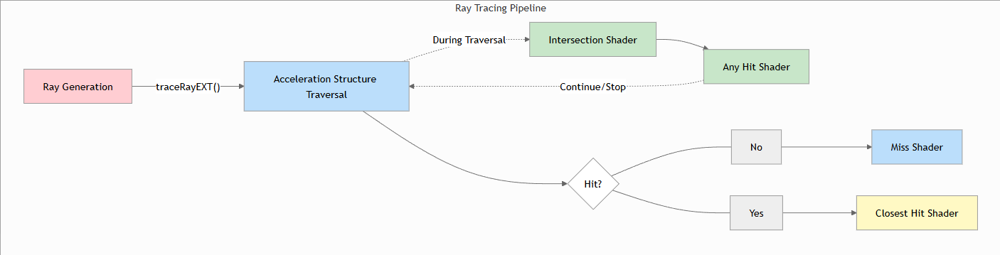
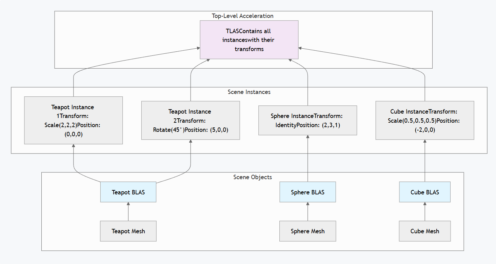
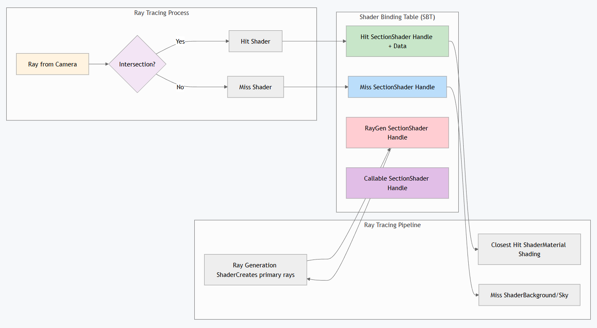

+++
date = '2025-12-02T16:22:18+08:00'
draft = false
title = '游戏引擎开发实践（Vulkan接入光线追踪光线）'
tags = ["Vulkan","光线追踪"]

+++

# Vulkan接入光追管线

> 参考https://nvpro-samples.github.io/vk_raytracing_tutorial_KHR 、 https://docs.vulkan.org/tutorial/latest/courses/18_Ray_tracing/02_Acceleration_structures.html



# 加速结构

> 在 Vulkan 中，用户创建的加速结构分为两个部分：**底层加速结构（bottom level acceleration structure，BLAS）** 和**顶层加速结构（top level acceleration structure，TLAS）**。



## BLAS (Bottom-Level Acceleration Structure)

包含：各网格单元（三角形、顶点、索引）的实际几何数据。注：法线、UV及其他属性未存储于BLAS本身——需在着色器中单独访问。

每个Mesh对应一个BLAS

## TLAS (Top-Level Acceleration Structure)

包含：对BLAS结构的引用及其世界空间变换（位置、旋转、缩放）

整个场景一个TLAS

示例：TLAS包含如下实例：“位于（1,0,1）位置的茶壶BLAS，旋转角度为45°，比例为2.0”

两层结构目的：TLAS存储BLAS的实例化信息，每个Mesh的BLAS只需要存储一次

## RT过程

- **Ray Generation**
- 射线与TLAS相交以确定**可能**被击中的实例
- 对于每个潜在命中，射线均经过转换并针对相应的BLAS进行测试
- 最近交点确定命中点与材质

# Shader Binding Table (SBT)

> 着色器绑定表（SBT）是“蓝图”，它告诉光线追踪器在不同类型的光线交点上执行哪些着色器。与光栅化中着色器按顺序绑定不同，光线追踪需要所有着色器同时可用，因为光线可以随时击中任何表面。

1. **Ray Generation Shaders**: Entry point for each pixel’s primary ray
2. **Miss Shaders**: Executed when rays don’t hit any geometry (background/sky)
3. **Hit Shaders**: Executed when rays intersect with geometry (material shading)
4. **Callable Shaders**: Optional shaders that can be invoked from other shaders

也就是一个Shader池，Hit或者Miss时都可以从池中拿不同的Shader来执行



为什么需要SBT：在光线追踪中，单条光线可能击中场景中的任何物体，不同的物体可能需要不同的着色器（例如，不同的材质、透明度效果）

一些概念：

**Shader Handles**: 显然需要给池子中每个Shader一个唯一标识

**SBT Regions**：不同类型的Shader存储在不同的Regions

**Instance Association**：TLAS实例可通过hitGroupId字段指定所使用的命中着色器。

**Data Attachment**:着色器可附加自定义数据（材质属性、实例数据）至着色器句柄，应该就是给Shader

# Shader

> shader写起来思路很清晰，设计的很好

```glsl
#version 460
#extension GL_EXT_ray_tracing : enable
#extension GL_ARB_separate_shader_objects : enable
#extension GL_GOOGLE_include_directive : enable
#include "../common/common.glsl"
// RayPayLoad是自定义的，定义layout时需要前缀rayPayloadEXT，任何需要的 Hit/ Miss/ ClosestHit 等 shader 会写回 payload
struct Payload {
    vec3 color;
};
#ifdef RAYGEN_SHADER
/*
	RayGenShader目的很简单，他是GPU与CPU交换的中间，负责定义payLoad，负责计算Ray的生成，就是从摄像机射向各个像素中心，整体来看就是一个工作组是二维，处理一张Image的ComputerShader
*/
// layout(set = 0, binding = 0) uniform accelerationStructureEXT topLevelAS;  这个已经在全局资源中

layout(set = 1, binding = 0, rgba32f) uniform image2D OUT_COLOR;  // 定义数据


layout(location = 0) rayPayloadEXT Payload payload ;   // 必须有rayPayloadEXT前缀

void main() 
{
	// 相当于一个自动的二维dipatch
	// gl_LaunchIDEXT.xy;   线程ID
	// gl_LaunchSizeEXT; 总线程数

	// 1. 计算屏幕坐标，并转到NDC坐标
	const vec2 pixelCenter = vec2(gl_LaunchIDEXT.xy) + vec2(0.5);  // 移动到像素中心
	const vec2 inUV = pixelCenter / vec2(gl_LaunchSizeEXT.xy);  // UV坐标
	vec2 ndc = inUV * 2.0 - 1.0; // 屏幕坐标转NDC[-1,1]
	// 2. Ray参数
	vec3 origin = CAMERAINFO.data.position;  // 相机位置
	vec4 target = CAMERAINFO.data.invProj * vec4(ndc.x, ndc.y, 0, 1) ; // 射线终点， 设置在像素NDC坐标，深度最近的位置  并转到View空间
	target /= target.w;   // 透视除法
	target = CAMERAINFO.data.invView * target;
	vec3 direction = normalize(target.xyz - origin.xyz);

	payload.color = vec3(0.0);


	traceRayEXT(TLAS, 					// acceleration structure
		gl_RayFlagsOpaqueEXT,       	// rayFlags 控制光线的行为，比如是否忽略背面、是否启用 any-hit、是否可用 conservative tracing 等
		0xFF,           				// cullMask 0xFF → 匹配所有实例
		0,              				// sbtRecordOffset 索引到 Shader Binding Table (SBT) 的起始记录位置
		1,              				// sbtRecordStride SBT 中每条记录的间隔（单位是记录数，不是字节）
		0,              				// missIndex 当光线没有击中任何几何体时，使用 SBT 中 miss shader 的索引
		origin.xyz,     				// ray origin
		MIN_RAY_TRACING_DISTANCE,           				// ray min range
		direction.xyz,  				// ray direction
		MAX_RAY_TRACING_DISTANCE,           				// ray max range
		0               				// payload (location = 0) payload的位置
  	);
    vec4 outColor = vec4(payload.color, 1.0);
	imageStore(OUT_COLOR, ivec2(gl_LaunchIDEXT.xy), outColor);
}

#endif

#ifdef RAYCLOSEST_HIT_SHADER
/*

	Hit是具体到Mesh的某一个三角形以及击中点，并且会给hitAttributeEXT来表示重心坐标，需要手动插值来计算击中点的信息
	gl_WorldRayTmaxEXT 可以获得击中的时间 t 
*/
layout(location = 0) rayPayloadInEXT Payload payload;    // rayPayloadInEXT 注意是InEXT

// Hit shader 可以访问击中的 geometry 信息
hitAttributeEXT vec2 attribs;   // 用来求重心坐标，表示击中点对于击中三角形的三个顶点的权重
void main()
{
	uint instanceID       = gl_InstanceCustomIndexEXT;   // 在构建TLAS时，给每个实例分配的ID
	uint primitiveID     = gl_PrimitiveID;  // 击中的三角形索引

	vec3 barycentrics = vec3(1.0 - attribs.x - attribs.y, attribs.x, attribs.y);   // 插值需要手动进行

	// 需要根据实例ID和三角形索引去Bindless找对应三个顶点的信息，再根据barycentrics进行插值


	// 根据插值后的结果计算着色信息
	MaterialInfo material   = GetMaterialInfo(instanceID);


	// 返回颜色
	payload.color = material.diffuse.xyz;

	// 或者继续递归
}
#endif

#ifdef RAYMISS_SHADER
/*
	MissShader是当Ray没有击中任何几何体时，会调用MissShader，MissShader可以返回一个颜色，或者继续递归
*/
layout(location = 0) rayPayloadInEXT Payload payload;    // rayPayloadInEXT 注意是InEXT

void main()
{
    payload.color = vec3(0.6, 0.8, 1.0);  // 也可以采样天空盒纹理
}
#endif
```


