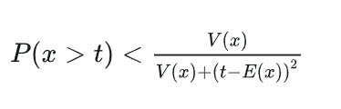
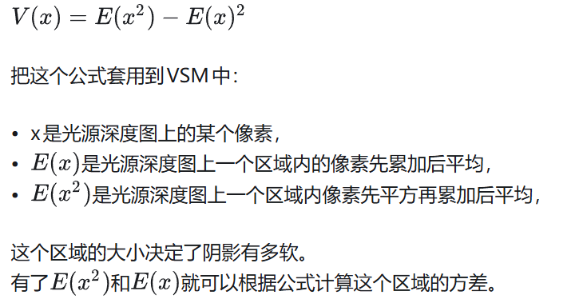
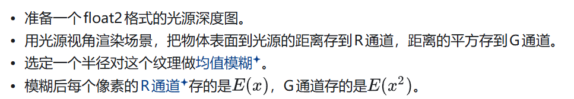
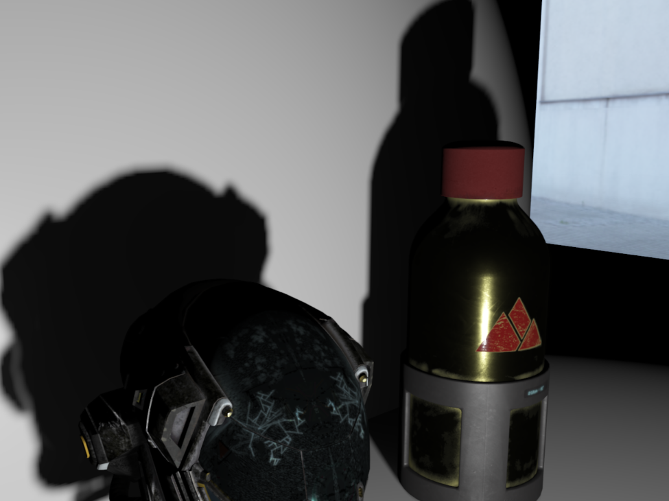
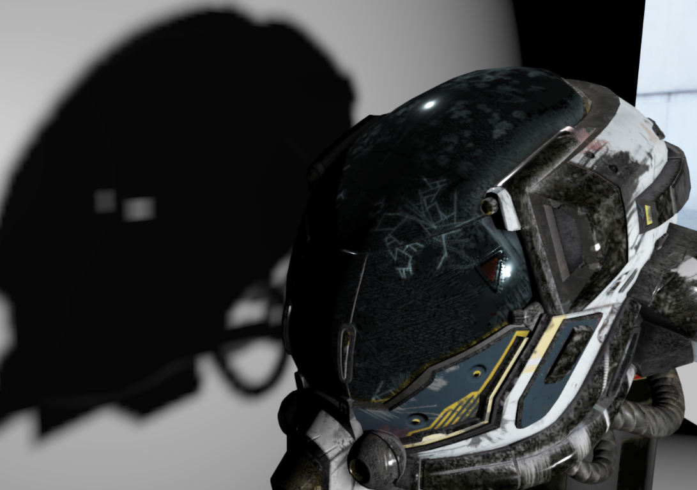
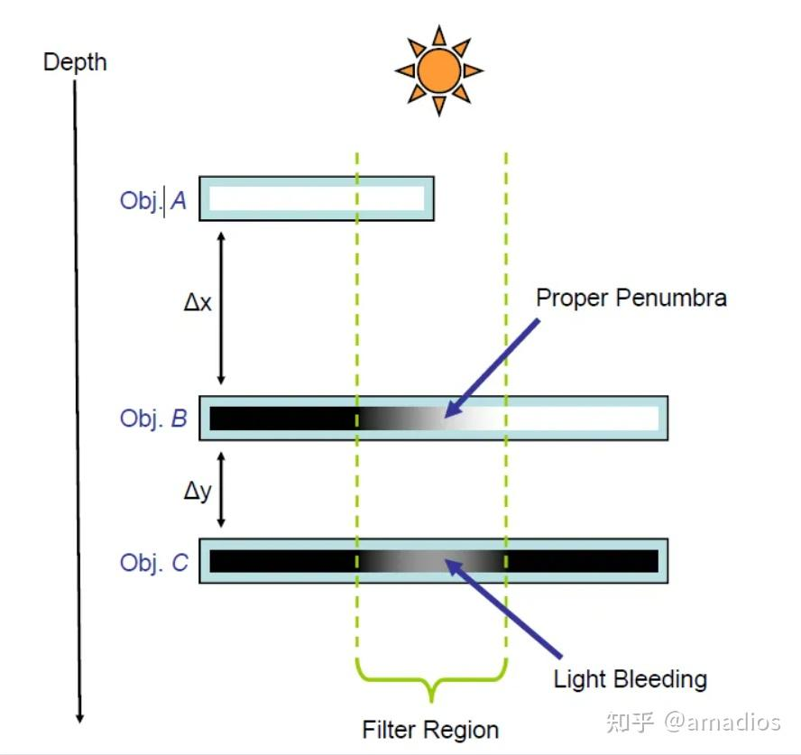
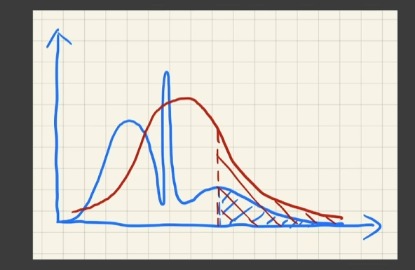
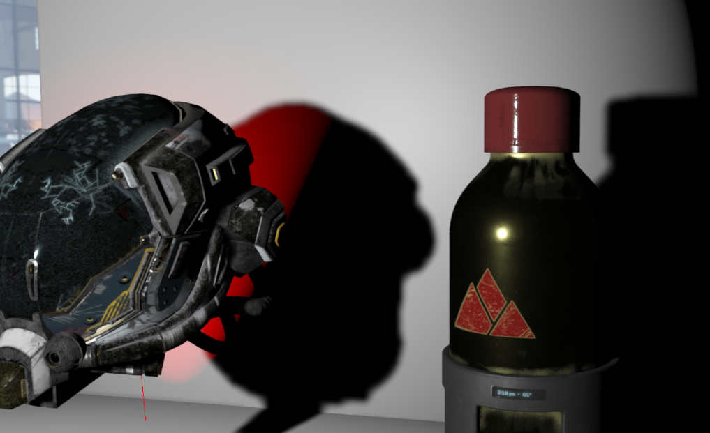
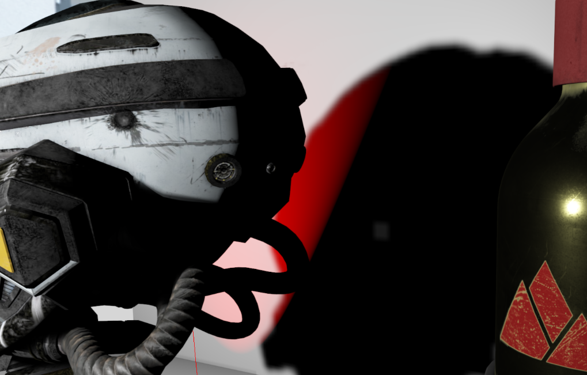

+++date = '2025-12-31T21:34:50+08:00'
draft = false
title = '游戏引擎开发实践（切比雪夫不等式的应用）'
categories = ["Projects/游戏引擎"]
+++

随机变量X大于t的概率可以用随机变量X的均值和方差进行估计

这个是单边切比雪夫不等式，它给出的是概率上限，也就是X大于t的概率不会大于这个

# VSM

> 软阴影需要在shadowMap上多次采样才行，采样点越多越软，但是并不能提前模糊光源深度图，模糊深度图后只是改变了比较的深度值，最终采样结果还是0-1，而VSM的思想就是通过概率论的公式直接估计一片区域内ShadowMap的深度比着色点深度更大的概率，只需要采样深度图一次即可（不过多了一个对深度图进行模糊的Pass）

流程很简单

操作简单，但是效果非常好。但是！漏光了！头盔左侧

如果直接用的话问题还是很大的

网上对漏光的解释是当我算C的阴影时，应该按照B的深度来估计，但是A也参与了，AB深度差距大，方差大，估算不准确

大概理解一下就是一片区域进行采样的filter时，这片区域的深度变化非常大，不能称之为类似一个正态分布的情况，这就会导致你用切比雪夫不等式估算不准确。

实际测试下来就是发现深度变化大的地方就容易漏光

解决漏光可以使用ESVM，用指数函数$e^{kd}$对深度做变换，将多峰分布拉成单峰，压缩方差

改完之后确实有效果

但是并不能完全消除阴影，有些视角下还是有漏光的

