+++
date = '2025-11-07T18:08:43+08:00'
draft = false
title = '游戏引擎开发实践（大气渲染）'

+++

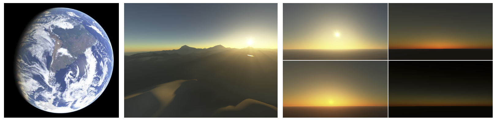

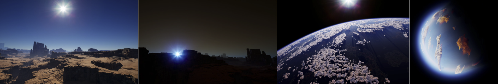

> 其实OpenGL渲染器已经完成的单次散射的大气渲染，但是对原理理解不透彻，这次准备更完善一点，并且实现整套的多重散射大气渲染，参考UE的实现，以及几篇论文

# Precomputed Atmospheric Scattering

> Eric Bruneton, Fabrice Neyret在2008年发表的论文，在2017年有了一个示例代码

## Transmittance 透射率

基本概念：透射是可乘的

- 对于 **三点共线** $p, q, r$（顺序为 $p \to q \to r$）
- **从 p 到 r 的透射率** = 从 p 到 q 的透射 × 从 q 到 r 的透射

$$
T(p,r) = T(p,q) \cdot T(q,r)
$$

- 这是光线传输的乘法性质，因为大气衰减是指数衰减，连续段可以相乘。

处理大气边界

- 对于点对 $p, q$
- 将从 $p$ 出发到 $q$ 的射线延长，找到它 **与大气上下边界的最近交点 $i$**
- 透射可以表示为：

$$
T(p,q) = \frac{T(p,i)}{T(q,i)}
$$

- 特殊情况：如果 $[p,q]$ 与地面相交 → 透射为 0（光被阻挡）
- **直观理解**：
   你只需要知道从大气内部某点到大气边界的透射，再通过除法就能得到任意点对的透射。

###   透射率的预计算

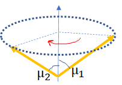

离地心的距离 r 和天顶角的余弦$\mu = \cos\theta$这两个参数，就可以描述从任意点出发沿着任意方向到大气层的路径上的传输衰减。

所以预计算的是摄像机在任意高度，不同抬头角度看向大气层的边界的投射率

// TODO: 知乎https://zhuanlan.zhihu.com/p/595576594上对坐标到纹理的重映射方法与论文不一样

## 单次散射

光路即使没有经过太阳，太阳也对这条光路有贡献，因为本来不应该经过视线的光由于空气粒子的反弹进入了视线，形成光路

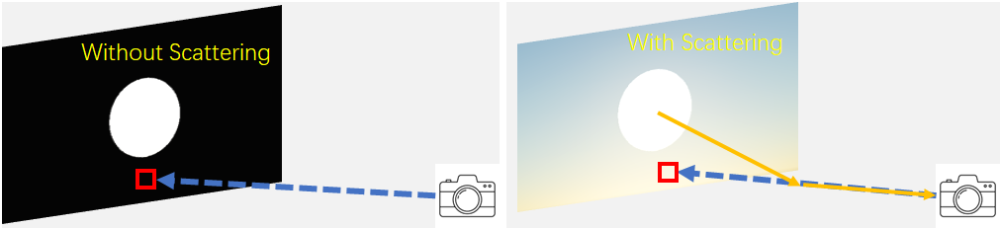

光线在空气中主要会发生两种物理现象：散射和透射。

- 散射：散射是指一束光和大气层中的微粒发生碰撞之后，众多粒子各奔东西四散而逃的物理现象。我们把逃逸到视线方向进而产生颜色贡献的光照能量记作 ：S

  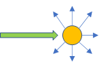

- 透射（Transmittance）描述的是光在介质中穿行所造成的能量衰减，记作 ：$I = T(I_0)$

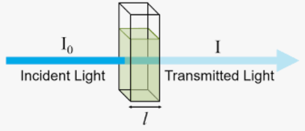

所以单次散射的流程：

1. T1透射 （衰减）
1. S点散射
1. T2透射 （衰减）

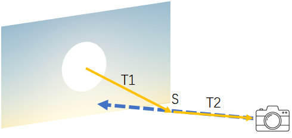

事实上在大气层内太阳光可以被看做是平行光，因此需要对视线方向做积分来重建无数条光路的总和：

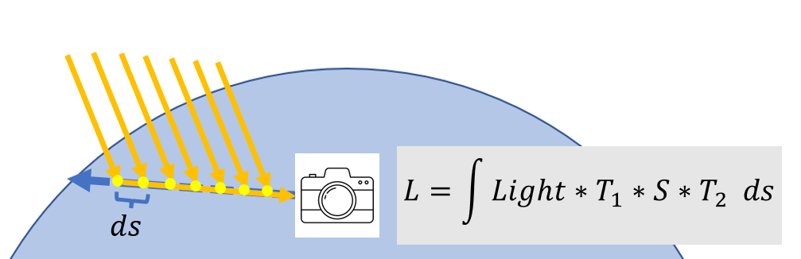

### 散射理论

> 解决散射系数和相位函数是什么

在大气渲染中也是类似的，我们通过 “散射系数” 和 “相位函数” 来描述光线散射的现象。散射系数$\sigma$ 描述了光线和空气分子发生一次反弹之后逃逸到各个方向的（失去的）能量 **总和**

剩下的能量并非完全进入我们的视线，而是会四下逃窜。因此相位函数 $phase(\theta)$ 表述了反弹后剩下的能量有多少能够逃到指定的方向上。相位函数和 BRDF 一样在定义域上积分等于 1.0，这保证了能量守恒：

> 理解就是：1. 散射系数决定有多少能量会进行散射 2. 相位函数决定这些散射的能量有多少会沿着$\theta$方向进行散射（注意散射的能量才是渲染用的，而不是剩下的）

将散射系数和相位函数简单相乘就能得到在某点发生一次散射之后，逃逸到某个方向上的能量大小

$S = \sigma \cdot \text{phase}(\theta)$

大气层并非完全均匀，大气分子的密度随着高度的增加而减少。越少的分子数目意味着发生散射的概率越低。此外大气对红、黄、蓝三种波长的光有着不同的散射量。因此散射系数通常是波长和高度的函数

$\sigma(\lambda, h)$

对于空气这种介质，它的密度通常随着海拔的增高而降低。密度的高低反应在数值上就是散射概率的减少，散射概率的减少对应着散射后剩余能量的增加。因此可以用海平面（Y=0）处的散射系数和海平面 h 处的高度密度衰减函数来描述任意高度的散射系数

$\sigma(\lambda, h) = \sigma(\lambda, 0)\rho(h)$

### 单次散射预计算

这篇论文使用的是4D表，属于是把计算结果全部打表了

单次散射函数依赖 4 个参数：
$$
(r, \mu, \mu_s, \nu)
$$

- $r$：观察点到地心的距离
- $\mu = \cos(\theta_v)$：视线方向与地心方向余弦
- $\mu_s = \cos(\theta_s)$：太阳方向与地心方向余弦
- $\nu = \cos(\theta_{vs})$：视线方向与太阳方向余弦

## 多重散射

> 二次散射的计算需要一次散射，三次需要二次，所以一层一层往上算来得到多重散射效果。

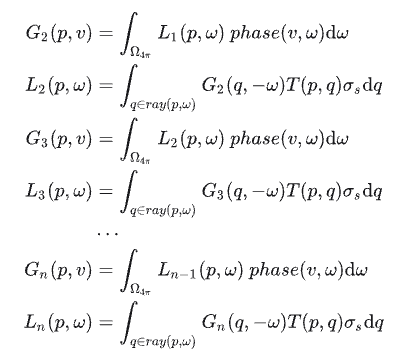

太阳光可能散射两次才散射到ViewDir

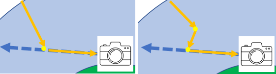

沿着ViewDir上某一点的计算不仅要计算来自太阳的散射，而是一个球面积分（也就是说任意方向都可能散射到这个点），对于球面上任何一点的贡献计算又是一层积分运算（球面积分的每一个采样方向，都要逐步进行 raymarch 到大气层边缘。如下图最右边蓝色线条）。所有2次多重散射就需要3重积分来求解

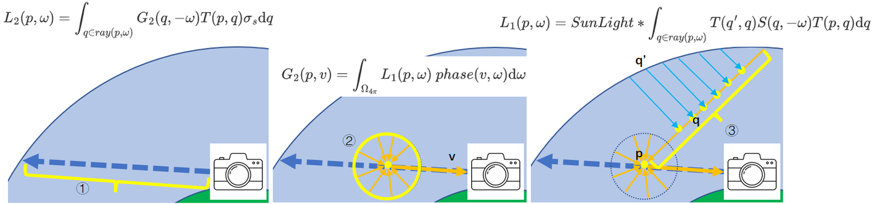

设：

- $L^{(1)}(p, \omega)$：点 p 向方向 ω 的单次散射光。
- $L^{(2)}(p, \omega)$：点 p 向方向 ω 的二次散射光。
- $L^{(3)}(p, \omega)$：点 p 向方向 ω 的三次散射光。

那么：
$$
L^{(2)}(p, \omega)
= \int_{q, \omega'} L^{(1)}(q, \omega') \cdot f_s(\omega', \omega)
$$
以此类推：
$$
L^{(n)}(p, \omega)
= \int_{q, \omega'} L^{(n-1)}(q, \omega') \cdot f_s(\omega', \omega)
$$
所以：

> 计算第 n 阶散射，必须先有第 n−1 阶的结果。

> 有点懂，但没完全懂....

#

# A Scalable and Production Ready Sky and Atmosphere Rendering Technique

> 2020年Epic发表介绍大气渲染的论文

## 多重散射的优化

这篇论文主要对多重散射需要一层一层计算迭代来实现的情况做了简化。作者通过做出一些对结果影响不大的简化假设，大幅度地降低了Multiple Scattering计算的消耗，并且使用数值方法计算无穷阶Scattering之和变为可能。

论文提到的**Sky-View LUT**就是最终渲染结果存储的纹理

TODO: 在靠近地平线部分大气散射会变得高频，因此UV的映射不是线性，而是靠近地平线部分会分配更多像素

## 大气透视查找表

除了天空，远处被大气覆盖的物体也要受到大气的影响。远处的物体对相机的贡献主要来自于两点，物体自身的颜色乘以着色点到相机的 transmittance，以及相机到着色点这段路径中间受到的大气散射。对应下图两条不同颜色的路径：

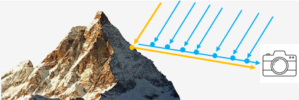

1. 分割Camera Frustum（和Cluster Rendering中的分割一样），计算每个格子到Camera方向的In-Scattering和Transmittance，保存在Volume Texture中；
2. 在Volume Texture的z轴方向上根据Transmittance累加In-Scattering，使得每一个单元格保存的是该单元格到Camera的Luminance；
3. 在Opaque渲染之后，做一次Post Processing，采样上述的Volume Texture，对场景中的物体添加Aerial Perspective；
4. Transparent物体渲染时在VS中采样Volume Texture添加Aerial Perspective。

# 引擎实践

