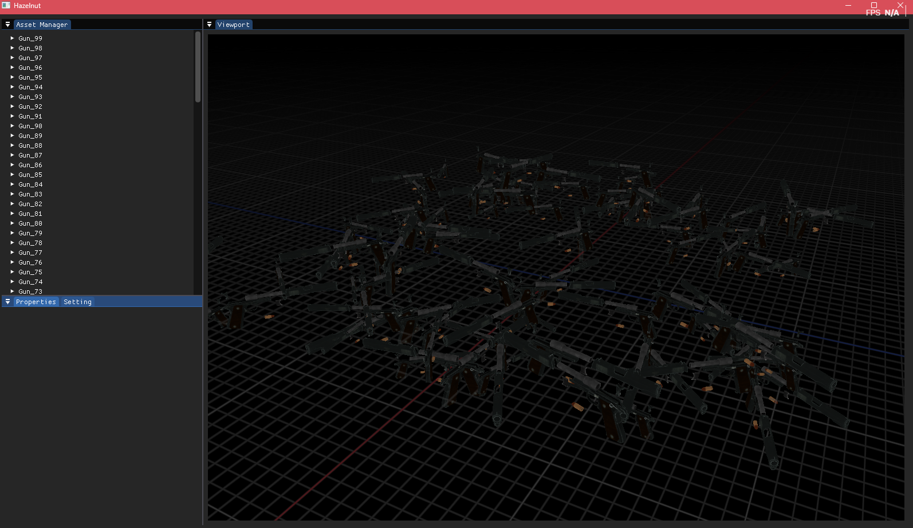
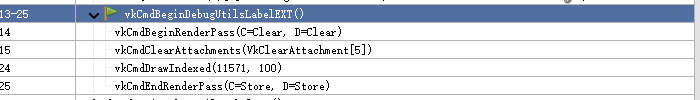

+++date = '2025-10-21T20:11:16+08:00'
draft = false
title = '游戏引擎开发实践（实例化渲染）'
categories = ["Projects/游戏引擎"]
tags = ["Vulkan","渲染架构"]
image = 'image-20251022010105969.png'
+++
> 废弃

# StaticMesh收集
首先从Scene的Entity找到包含StaticMesh组件的Entity，第一步剔除不显示的Mesh

```c++
void Scene::CollectRenderableEntities(Ref<SceneRender> sceneRender)
{
	// 收集StaticMesh
	auto allEntityOwnMesh = GetAllEntitiesWith<StaticMeshComponent>();
	for (auto entity : allEntityOwnMesh) {
		auto& staticMeshComponent = allEntityOwnMesh.get<StaticMeshComponent>(entity);
		if (!staticMeshComponent.Visible) continue;
		Ref<MeshSource> mesh = AssetManager::GetAsset<MeshSource>(staticMeshComponent.StaticMesh);
		if (mesh == nullptr) continue;
		Entity e = Entity(entity, this);
		glm::mat4 transform = GetWorldSpaceTransformMatrix(e);
		sceneRender->SubmitStaticMesh(mesh, transform);
	}
}
```

另外因为层级结构，需要递归处理每个Mesh的模型变换矩阵

```c++
	glm::mat4 Scene::GetWorldSpaceTransformMatrix(Entity entity)
	{
		glm::mat4 transform(1.0f);

		Entity parent = GetEntityByUUID(entity.GetParentUUID());
		if (parent)
			transform = GetWorldSpaceTransformMatrix(parent);

		return transform * entity.Transform().GetTransform();
	}
```

最后注册这个Mesh，携带它的模型变换。

# 注册Mesh到StaticDrawList

遍历每个SubMesh

- 计算他的全局变换矩阵
- 获取MeshKey（用于实例化，这样做自动把一样的SubMesh自动放在了一起），这里Key就表示同一个SubMesh同一个材质，就属于实例化的一个
- 缓存对应的变换矩阵
- 增加对应DrawCommand的实例数量，**最终每一个MeshKey对应的DrawCommand都会变成一个DrawCall**

```c++
struct StaticDrawCommand
{
    Ref<MeshSource> MeshSource;
    uint32_t SubmeshIndex;
    Ref<MaterialAsset> MaterialAsset;
    uint32_t InstanceCount = 0;
};
void SceneRender::SubmitStaticMesh(Ref<MeshSource> meshSource, const glm::mat4& transform) {
	const auto& submeshData = meshSource->GetSubmeshes();
	for(uint32_t submeshIndex = 0; submeshIndex <submeshData.size(); submeshIndex++){
		glm::mat4 submeshTransform = transform * submeshData[submeshIndex].Transform;  // subMesh的全局变换
		AssetHandle materialHandle = meshSource->GetMaterialHandle(submeshData[submeshIndex].MaterialIndex);
		Ref<MaterialAsset> material = AssetManager::GetAsset<MaterialAsset>(materialHandle);// subMesh的材质索引;
		HZ_CORE_VERIFY(material);
		MeshKey meshKey = { meshSource->Handle, materialHandle, submeshIndex, false };
		// 缓存变换矩阵
		auto& transformStorage = m_MeshTransformMap[meshKey].Transforms.emplace_back(); // 对于每一种MeshKey，都存储多个Transforms矩阵，表示多个实例
		transformStorage.MRow[0] = { submeshTransform[0][0], submeshTransform[1][0], submeshTransform[2][0], submeshTransform[3][0] };
		transformStorage.MRow[1] = { submeshTransform[0][1], submeshTransform[1][1], submeshTransform[2][1], submeshTransform[3][1] };
		transformStorage.MRow[2] = { submeshTransform[0][2], submeshTransform[1][2], submeshTransform[2][2], submeshTransform[3][2] };
		// 缓存绘制命令
		auto& destDrawList = m_StaticMeshDrawList;
		auto& dc = destDrawList[meshKey];
		dc.MeshSource = meshSource;
		dc.SubmeshIndex = submeshIndex;
		dc.MaterialAsset = material;
		dc.InstanceCount++;
	}
};
```

# 缓存所有DrawCommand的变换矩阵

注册完成后，处理模型变换信息，这里使用的是顶点缓冲区来存储模型变换信息，下面代码作用就是把每个要渲染的SubMesh的变换矩阵按顺序存在一个顶点缓冲区，等待渲染时绑定

```c++
// 收集所有参与渲染的Mesh的变换矩阵存储在m_SubmeshTransformBuffers
{
    uint32_t frameIndex = Renderer::GetCurrentFrameIndex();

    uint32_t offset = 0;
    for (auto& [key, transformData] : m_MeshTransformMap)
    {
        transformData.TransformOffset = offset * sizeof(TransformVertexData);
        for (const auto& transform : transformData.Transforms)
        {
            m_SubmeshTransformBuffers[frameIndex].Data[offset] = transform; 
            offset++;
        }
    }
    // 在这里所有的变换矩阵已经上传到GPU（RT线程）
    m_SubmeshTransformBuffers[frameIndex].Buffer->SetData(m_SubmeshTransformBuffers[frameIndex].Data, offset * sizeof(TransformVertexData)); 
}
```

下面要渲染时就按顺序渲染

```c++
for (auto& [meshKey, drawCommand] : m_StaticMeshDrawList)
{
    const auto& transformData = m_MeshTransformMap.at(meshKey); // 其中已经记录好了每个DrawCall对应的变换矩阵偏移
    Renderer::RenderStaticMeshWithMaterial(m_CommandBuffer, m_GeoPipeline,drawCommand.MeshSource, drawCommand.SubmeshIndex, drawCommand.MaterialAsset->GetMaterial(), m_SubmeshTransformBuffers[frameIndex].Buffer, transformData.TransformOffset, drawCommand.InstanceCount);
}
```

# 实例化渲染

1. 绑定整个Mesh的顶点数据
2. 绑定所有变换矩阵的缓冲区也作为顶点数据，并设置正确的偏移量
3. 绑定索引
4. 材质相关

```c++
void VulkanRenderer::RenderStaticMeshWithMaterial(Ref<RenderCommandBuffer> renderCommandBuffer, Ref<Pipeline> pipeline, Ref<MeshSource> meshSource, uint32_t submeshIndex, Ref<Material> material, Ref<VertexBuffer> transformBuffer, uint32_t transformOffset, uint32_t instanceCount)
{
	HZ_CORE_ASSERT(meshSource);
	HZ_CORE_ASSERT(material);
	Ref<VulkanMaterial> vulkanMaterial = material.As<VulkanMaterial>();
	Renderer::Submit([renderCommandBuffer, pipeline,meshSource, submeshIndex, vulkanMaterial, transformBuffer, transformOffset, instanceCount]() mutable {
		uint32_t frameIndex = Renderer::RT_GetCurrentFrameIndex();
		VkCommandBuffer commandBuffer = renderCommandBuffer.As<VulkanRenderCommandBuffer>()->GetActiveCommandBuffer();
		Ref<VulkanVertexBuffer> meshVertBuffer = meshSource->GetVertexBuffer().As<VulkanVertexBuffer>();
		VkBuffer vkMeshVertBuffer = meshVertBuffer->GetVulkanBuffer();
		VkDeviceSize vertexOffsets[1] = { 0 };
		vkCmdBindVertexBuffers(commandBuffer, 0, 1, &vkMeshVertBuffer, vertexOffsets);  // 把整个Mesh的顶点都绑定
		Ref<VulkanVertexBuffer> vulkanTransformBuffer = transformBuffer.As<VulkanVertexBuffer>();
		VkBuffer vkTransformBuffer = vulkanTransformBuffer->GetVulkanBuffer();
		VkDeviceSize instanceOffsets[1] = { transformOffset };
		vkCmdBindVertexBuffers(commandBuffer, 1, 1, &vkTransformBuffer, instanceOffsets); // 第二个顶点缓冲区绑定当前SubMesh的变换矩阵数据

		auto vulkanMeshIB = Ref<VulkanIndexBuffer>(meshSource->GetIndexBuffer());
		VkBuffer ibBuffer = vulkanMeshIB->GetVulkanBuffer();
		vkCmdBindIndexBuffer(commandBuffer, ibBuffer, 0, VK_INDEX_TYPE_UINT32); // 索引缓冲区全绑定

		// 每个材质绑定自己的 Set=1
		VkDescriptorSet matSet = vulkanMaterial->GetDescriptorSets()[frameIndex];
		vkCmdBindDescriptorSets(commandBuffer, VK_PIPELINE_BIND_POINT_GRAPHICS,
			pipeline.As<VulkanPipeline>()->GetVulkanPipelineLayout(),
			1, // Set=1
			1, &matSet,
			0, nullptr);
		const auto& submeshes = meshSource->GetSubmeshes();
		const auto& submesh = submeshes[submeshIndex];
		vkCmdDrawIndexed(commandBuffer, submesh.IndexCount/*索引数量*/, instanceCount/*实例数量*/, submesh.BaseIndex/*索引缓冲区的偏移*/, submesh.BaseVertex/*顶点偏移*/, 0/*实例化ID开始的编号*/);
		
	});
}
```

另外要注意实例的变换矩阵的切换时机要在Pipeline创建时设置好,下面可以看到实例顶点布局的inputRate是设置的VK_VERTEX_INPUT_RATE_INSTANCE，这样他就会每个实例切换一次

```c++

    VkVertexInputBindingDescription& vertexInputBinding = vertexInputBindingDescriptions.emplace_back();
    vertexInputBinding.binding = 0;
    vertexInputBinding.stride = vertexLayout.GetStride();
    vertexInputBinding.inputRate = VK_VERTEX_INPUT_RATE_VERTEX;

    if (instanceLayout.GetElementCount())
    {
        VkVertexInputBindingDescription& instanceInputBinding = vertexInputBindingDescriptions.emplace_back();
        instanceInputBinding.binding = 1;
        instanceInputBinding.stride = instanceLayout.GetStride();
        instanceInputBinding.inputRate = VK_VERTEX_INPUT_RATE_INSTANCE;
    }

```

# Shader

```glsl
#version 450 core
#ifdef VERTEX_SHADER
layout(binding = 0) uniform UniformBufferObject {
    mat4 view;
    mat4 proj;
	float width;
	float height;
	float Near;
	float Far;
} ubo;

layout(location = 0) in vec3 inPosition;
layout(location = 1) in vec3 inNormal;
layout(location = 2) in vec3 inTangent;
layout(location = 3) in vec3 inBinormal; 
layout(location = 4) in vec2 inTexCoord;
layout(location = 5) in vec4 a_MRow0;
layout(location = 6) in vec4 a_MRow1;
layout(location = 7) in vec4 a_MRow2;

layout(location = 0) out vec3 fragWorldPos;
layout(location = 1) out vec3 fragWorldNormal;
layout(location = 2) out vec3 fragWorldTangent;
layout(location = 3) out vec3 fragWorldBinormal;
layout(location = 4) out vec2 fragTexCoord;

void main() {
    mat4 transform = mat4(
		vec4(a_MRow0.x, a_MRow1.x, a_MRow2.x, 0.0),
		vec4(a_MRow0.y, a_MRow1.y, a_MRow2.y, 0.0),
		vec4(a_MRow0.z, a_MRow1.z, a_MRow2.z, 0.0),
		vec4(a_MRow0.w, a_MRow1.w, a_MRow2.w, 1.0)
	);
    vec4 worldPos = transform * vec4(inPosition, 1.0);
    fragWorldPos = worldPos.xyz;

    mat3 modelRot = mat3(transform);
    fragWorldNormal = normalize(modelRot * inNormal);
    fragWorldTangent = normalize(modelRot * inTangent);
    fragWorldBinormal = normalize(modelRot * inBinormal);
    fragTexCoord = inTexCoord;
    gl_Position = ubo.proj * ubo.view * worldPos;
}
#endif
```



RenderDoc可以看到，只有一个DrawCall


