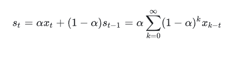
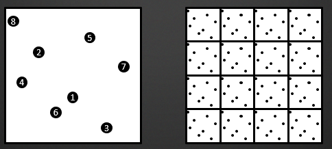
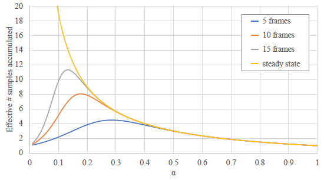
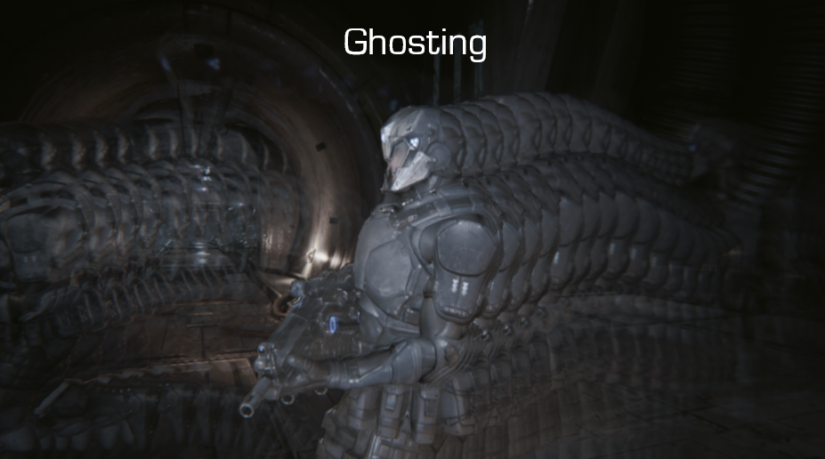
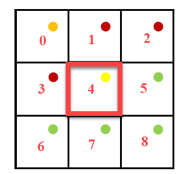
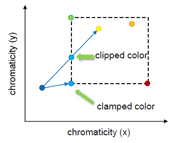
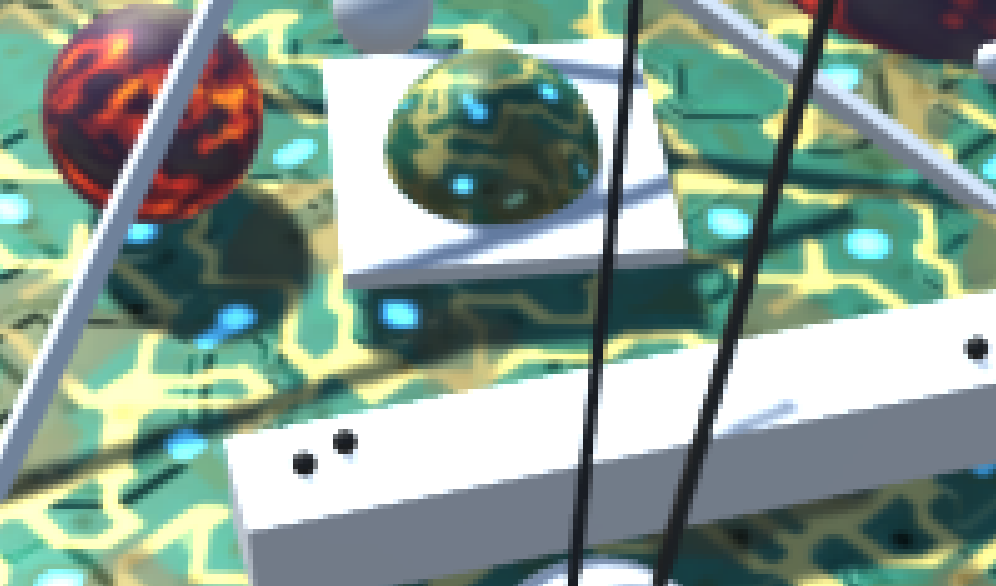
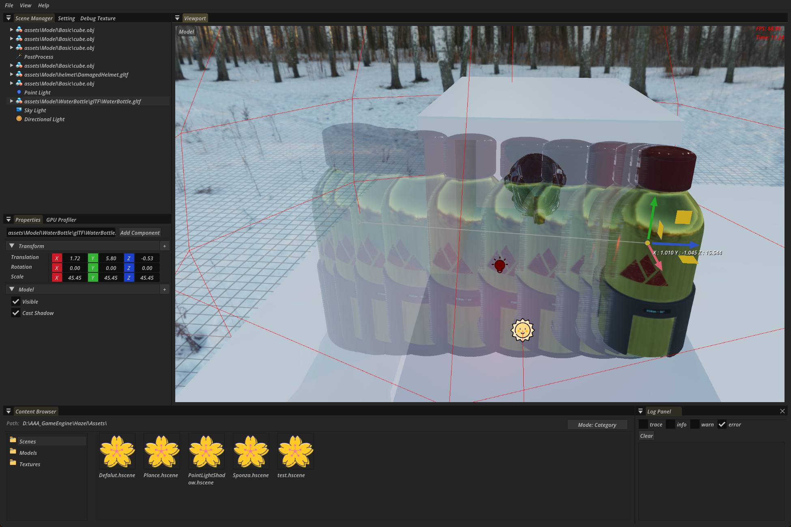
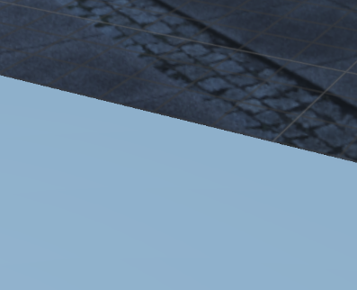
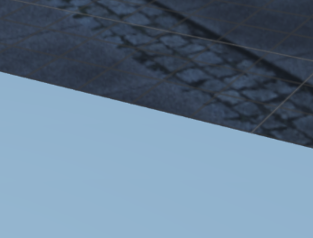

+++
date = '2025-12-04T18:58:15+08:00'
draft = false
title = '游戏引擎开发实践（抗锯齿）'
tags = ['抗锯齿']
image = 'image-20251207191240613.png'
categories = ["Projects/GameEngine"]

+++

> 总体来看TAA思想比较简单易懂，实现思路更多是实践性的经验总结

# TAA

> **TAA (Temporal Anti-Aliasing)** 综合历史帧的数据来实现抗锯齿，这样会将每个像素点的多次采样均摊到多个帧中，相对的开销要小得多。在 MSAA 中，我们在一帧中，在每个像素中放置了多个次像素采样点。在 TAA 中，我们实现的方式，就是在每帧采样时，将采样的点进行偏移，实现**抖动 (jitter)**。

## 静态场景

>  在静态场景下，上一帧与本帧的颜色信息很好获得，只需要取相同位置进行采样，然后进行一个插值即可，然后用jitter进行抖动

```glsl
float3 currColor = currBuffer.Load(pos);
float3 historyColor = historyBuffer.Load(pos);
return lerp(historyColor, currColor, 0.05f);
```

这里的取混合系数为0.05，意味着最新的一帧渲染结果，只对最终结果产生了5%的贡献。

将累计的过程展开来看的话，可以看出当前帧 TAA 后的结果，是包含了所有的历史帧结果的，说明这种方式是合理的：



在 TAA 中，我们实现的方式，就是在每帧采样时，将采样的点进行偏移，实现**抖动 (jitter)**。采样点抖动的偏移，是和 MSAA 的次像素采样点放置是相同的，都需要使用低差异的采样序列，来实现更好的抗锯齿效果。TAA 中都会直接使用 [Halton 序列](https://zhida.zhihu.com/search?content_id=182626622&content_type=Article&match_order=1&q=Halton+序列&zhida_source=entity)，采样的点位置如下所示：



```c++
// 先将Halton序列的值转化为 -0.5~0.5范围的偏移；再除以屏幕长度，得到UV下的偏移值；最后乘以2，是转化到裁剪空间中的偏移值
ProjectionMatrix.m02 += (HaltonSequence[Index].x - 0.5f) / ScreenWidth * 2;
ProjectionMatrix.m12 += (HaltonSequence[Index].y - 0.5f) / ScreenHeight * 2;
```




## 动态物体

> 要对历史数据进行混合，就要能够还原出当前物体在屏幕中投影的位置。为了能够精确地记录物体在屏幕空间中的移动，我们使用 Motion Vector 贴图来记录物体在屏幕空间中的变化距离，表示当前帧和上一帧中，物体在屏幕空间投影坐标的变化值

记录上一帧的投影矩阵和上一帧的模型位置，在本帧使用上一帧的透视变换逆变换就能把模型还原到上一帧的视角下，在上一帧视角下对比两帧模型的位置来拿到Motion Vector（这种有点麻烦，实战不用这种方案）

**使用 MotionVector**

> 已经知道模型的运动变化了，在本帧中复原模型到上一帧的位置，算出对应的屏幕坐标

```c++
// 减去抖动坐标值，得到当前实际的像素中心UV值
uv -= _Jitter;
// 减去Motion值，算出上帧的投影坐标
float2 uvLast = uv - motionVectorBuffer.Sample(point, uv);
//使用双线性模式采样
float3 historyColor = historyBuffer.Sample(linear, uvLast);
```

这样使用也是有问题的。比如 一扇门，本来模型在门后，现在向右位移模型出现，但是按照MontionVector去采样上一帧的颜色时，其实采样到了门上。


因此为了得到更加平滑的数据，可以在当前像素点周围判断深度，取距离镜头最近的点位置，来采样 Motion Vector 的值，这样可以减弱遮挡错误的影响。

> **优化手法**：使用 `lerp` 代替 if-else，可以在 GPU 并行计算中避免分支，提高效率

```glsl
float2 GetClosestFragment(float2 uv)
{
    float2 k = _CameraDepthTexture_TexelSize.xy;
    //在上下左右四个点
    const float4 neighborhood = float4(
        SAMPLE_DEPTH_TEXTURE(_CameraDepthTexture, sampler_PointClamp, clamp(uv - k)),
        SAMPLE_DEPTH_TEXTURE(_CameraDepthTexture, sampler_PointClamp, clamp(uv + float2(k.x, -k.y))),
        SAMPLE_DEPTH_TEXTURE(_CameraDepthTexture, sampler_PointClamp, clamp(uv + float2(-k.x, k.y))),
        SAMPLE_DEPTH_TEXTURE(_CameraDepthTexture, sampler_PointClamp, clamp(uv + k))
    );
    // 获取离相机最近的点
    #if defined(UNITY_REVERSED_Z)
        #define COMPARE_DEPTH(a, b) step(b, a)
    #else
        #define COMPARE_DEPTH(a, b) step(a, b)
    #endif
    // 获取离相机最近的点，这里使用 lerp 是避免在shader中写分支判断
    float3 result = float3(0.0, 0.0, SAMPLE_DEPTH_TEXTURE(_CameraDepthTexture, sampler_PointClamp, uv));
    result = lerp(result, float3(-1.0, -1.0, neighborhood.x), COMPARE_DEPTH(neighborhood.x, result.z));
    result = lerp(result, float3( 1.0, -1.0, neighborhood.y), COMPARE_DEPTH(neighborhood.y, result.z));
    result = lerp(result, float3(-1.0,  1.0, neighborhood.z), COMPARE_DEPTH(neighborhood.z, result.z));
    result = lerp(result, float3( 1.0,  1.0, neighborhood.w), COMPARE_DEPTH(neighborhood.w, result.z));
    return (uv + result.xy * k);
}

//在周围像素中，寻找离相机最近的点
float2 closest = GetClosestFragment(uv);
//使用周围最近点，得到Velocity值，来计算上帧投影位置
float2 uvLast = uv - motionVectorBuffer.Sample(point, closest);
//...
```

> 另外对应历史点的采样，可以使用 Catmull–Rom 采样进行进一步优化，而不是使用默认的双线性采样

因为使用了双线性采样，所以得到的值会混合周围像素的颜色，造成结果略微模糊。如果想要使得到的历史结果质量更好，也可以使用一些特殊的过滤方式进行处理。比如UE4中使用 Catmull–Rom 的方式进行锐化过滤。**Catmull-Rom**方式的采样，会在目标点周围进行 5 次采样，然后根据相应权重进行过滤混合，额外的开销也非常大。


## 历史结果处理

> 由于像素抖动，模型变化，渲染光照变化导致渲染结果发生变化时，会导致历史帧得到的像素值失效，就会产生 **鬼影/ghosting** 和 **闪烁 /flicking** 问题。



为了缓解鬼影和闪烁的问题，我们还要对采样的历史帧和当前帧数据进行对比，将历史帧数据 **clamp/截断** 在合理的范围内。要确定当前帧目标像素的亮度范围，就需要读取当前帧数据目标像素周围 5 个或者 9 个像素点的颜色范围：



简单的做法就是直接进行 clamp：就是先在当前位置像素领域内判断颜色范围，之后采样历史点时把历史点的颜色clamp到这个范围内，防止它颜色变化太大

```c++
float3 AABBMin, AABBMax;
AABBMax = AABBMin = RGBToYCoCg(Color);
// 取得YCoCg色彩空间下，Clip的范围
for(int k = 0; k < 9; k++)
{
    float3 C = RGBToYCoCg(_MainTex.Sample(sampler_PointClamp, uv, kOffsets3x3[k]));
    AABBMin = min(AABBMin, C);
    AABBMax = max(AABBMax, C);
}
// 需要 Clip处理的历史数据
float3 HistoryYCoCg = RGBToYCoCg(HistoryColor);

// 简单地进行Clmap
float3 ResultYCoCg =  clmap(History, AABBMin, AABBMax);
//还原到RGB色彩空间，得到最终结果
HistoryColor.rgb = YCoCgToRGB(ResultYCoCg));
```

另外一种做法是进行 clip，clip的效果会更好，计算量也会相对较大二者的差别可从下图看出：

Clip和Clamp的区别，clamp简单粗暴地把颜色固定到范围角点上，clip则效果更好，首先获取范围内颜色的中间值，然后从历史点颜色 发送射线到中间值，取射线与AABB盒交点位置的颜色值



## 混合结果

```c
// 与上帧相比移动距离越远，就越倾向于使用当前的像素的值
blendFactor = saturate(0.05 + length(motion) * 100);
return lerp(historyColor, currColor, blendFactor);
```

因为我们用到了很多双线性采样，会使得得到的结果有些模糊，因此我们根据情况选择是否对结果进行一次简单的锐化。



# 实战

## MotionVector

> 这块逻辑很清晰。  因为模型在世界的位置只取决于模型实例的Model变换。  而模型在屏幕像素的位置取决于投影矩阵和摄像机矩阵。  所以 每个模型都需要额外存储一个glm::mat4来存储上一帧的模型变换，摄像机也需要额外存储上一帧的投影矩阵（不过这个一般不会变），已经上一帧的View矩阵

在GBufferPass时，获取模型上一帧的Model矩阵，在FragShader中，根据像素存储插值出来的本帧Position和上帧Position进行计算，得到MotionVector

```glsl
vec2 CalculateVelocity(vec4 pos, vec4 prevPos){
    vec4 curNDC  = CAMERAINFO.data.proj * CAMERAINFO.data.view * pos;
    curNDC /= curNDC.w;
    vec2 curUV = curNDC.xy * 0.5 + 0.5;
    vec4 prevNDC = CAMERAINFO.data.prevProj * CAMERAINFO.data.prevView * prevPos;
    prevNDC /= prevNDC.w;
    vec2 prevUV = prevNDC.xy * 0.5 + 0.5;
    return vec2(curUV.xy - prevUV.xy);  // MotionVector存储的是当前像素与上一帧中该位置信息所在的像素的偏移增量
}
```

## 混合历史信息

> 在TAApass，读取当前ViewPort，根据MotionVector把像素值偏移到上一帧位置，读取历史信息，混合历史信息和当前信息

```glsl
#version 450 core
#include "../common/common.glsl"
#ifdef COMPUTE_SHADER

layout(set = 1,binding = 0,rgba32f) uniform image2D out_texture;
layout(set = 1,binding = 1) uniform texture2D velocityTexture;
layout(set = 1,binding = 2) uniform texture2D historyTexture;
layout(set = 1,binding = 3) uniform texture2D curTexture;
layout(set = 1,binding = 4) uniform texture2D depthTexture;


vec2 GetClosestFragment(vec2 uv)
{
    vec2 k = 1.0 / vec2(imageSize(out_texture)); 
    
    float depth0 = texture(sampler2D(depthTexture, SAMPLER[0]), clamp(uv - k, 0.0, 1.0)).r;
    float depth1 = texture(sampler2D(depthTexture, SAMPLER[0]), clamp(uv + vec2(k.x, -k.y), 0.0, 1.0)).r;
    float depth2 = texture(sampler2D(depthTexture, SAMPLER[0]), clamp(uv + vec2(-k.x, k.y), 0.0, 1.0)).r;
    float depth3 = texture(sampler2D(depthTexture, SAMPLER[0]), clamp(uv + k, 0.0, 1.0)).r;
    
    vec4 neighborhood = vec4(depth0, depth1, depth2, depth3);

    #define COMPARE_DEPTH(a, b) step(a, b)


    vec3 result = vec3(0.0, 0.0, texture(sampler2D(depthTexture, SAMPLER[0]), uv).r);
    
    result = mix(result, vec3(-1.0, -1.0, neighborhood.x), COMPARE_DEPTH(neighborhood.x, result.z));
    result = mix(result, vec3( 1.0, -1.0, neighborhood.y), COMPARE_DEPTH(neighborhood.y, result.z));
    result = mix(result, vec3(-1.0,  1.0, neighborhood.z), COMPARE_DEPTH(neighborhood.z, result.z));
    result = mix(result, vec3( 1.0,  1.0, neighborhood.w), COMPARE_DEPTH(neighborhood.w, result.z));

    #undef COMPARE_DEPTH
    return uv + result.xy * k;
}

layout(local_size_x = 16, local_size_y = 16, local_size_z = 1) in;
void main()
{
    // TODO: 此处的重投影逻辑可能在别的地方一会用到，应该写成单独的一个pass,把重投影后的UV写在一个纹理中
    ivec2 imgSize = ivec2(imageSize(out_texture));
    ivec2 invocID = ivec2(gl_GlobalInvocationID.xy);
    if (invocID.x >= imgSize.x || invocID.y >= imgSize.y) 
        return;
    vec2 texCoords = (vec2(invocID) + 0.5f) / vec2(imgSize);

    vec2 ClosestUv = GetClosestFragment(texCoords);

    vec2 velocity = texture(sampler2D(velocityTexture,SAMPLER[0]), ClosestUv).rg;  // 用采样点周围离摄像头最近的深度的UV来采样速度值
    vec2 historyTexCoords = texCoords - velocity;
    bool valid = historyTexCoords.x > 0.0f ? true : false;

    float blend = 0.95f;
    if(!valid)  blend = 1.0f;

    vec3 historyColor = texture(sampler2D(historyTexture,SAMPLER[0]), historyTexCoords).rgb;
    vec3 curColor = texture(sampler2D(curTexture,SAMPLER[0]), texCoords).rgb;
    vec3 mixColor = mix(curColor,historyColor, blend);
    imageStore(out_texture, invocID, vec4(mixColor, 1.0));
}

#endif
```

当然目前只是简单混合了颜色，渲染结果能看出来TAA的效果，但是移动物体或者摄像机时，鬼影十分严重



## 处理拖影

> 对比当前数据和历史数据，把历史数据clamp到合理范围内

```glsl
#version 450 core
#include "../common/common.glsl"
#include "../common/TAA.glsl"
#include "../common/math.glsl"
#ifdef COMPUTE_SHADER

layout(set = 1,binding = 0,rgba32f) uniform image2D out_texture;
layout(set = 1,binding = 1) uniform texture2D velocityTexture;
layout(set = 1,binding = 2) uniform texture2D historyTexture;
layout(set = 1,binding = 3) uniform texture2D curTexture;
layout(set = 1,binding = 4) uniform texture2D depthTexture;

layout(local_size_x = 16, local_size_y = 16, local_size_z = 1) in;

void main()
{
    ivec2 invocID = ivec2(gl_GlobalInvocationID.xy);
    ivec2 imgSize = ivec2(imageSize(out_texture));
    if (invocID.x >= imgSize.x || invocID.y >= imgSize.y) 
        return;
    if(GetPostprocessSetting().TaaSetting.enable == 0){
        vec2 texCoords = (vec2(invocID) + 0.5f) / vec2(imgSize);
        vec3 curColor = texture(sampler2D(curTexture,SAMPLER[0]), texCoords).rgb;
        imageStore(out_texture, invocID, vec4(curColor, 1.0));
        return;
    }
    vec2 texelSize = 1.0 / vec2(imgSize);
    vec2 baseTexCoords = (vec2(invocID) + 0.5f) / vec2(imgSize);
    vec2 jitterUV = GetPostprocessSetting().TaaSetting.UVjetter * texelSize;
    vec2 texCoordsWithJitter = baseTexCoords + jitterUV;

    vec2 ClosestUv = GetClosestFragment(baseTexCoords, texelSize, depthTexture);
    vec2 velocity = texture(sampler2D(velocityTexture,SAMPLER[0]), ClosestUv).rg;
    vec2 historyTexCoords = baseTexCoords - velocity; 

    // 采样当前帧（带抖动）、历史帧（无抖动）颜色
    vec3 historyColor = texture(sampler2D(historyTexture,SAMPLER[0]), historyTexCoords).rgb;
    vec3 curColor = texture(sampler2D(curTexture,SAMPLER[0]), texCoordsWithJitter).rgb;

    const vec2 kOffsets3x3[9] = {
        vec2(-1.0, -1.0), vec2( 0.0, -1.0), vec2( 1.0, -1.0),
        vec2(-1.0,  0.0), vec2( 0.0,  0.0), vec2( 1.0,  0.0),
        vec2(-1.0,  1.0), vec2( 0.0,  1.0), vec2( 1.0,  1.0)
    };

    // fix 拖影：3x3邻域使用带抖动的UV，且钳位边界
    vec3 AABBMin = RGBToYCoCg(curColor);
    vec3 AABBMax = AABBMin;
    for(int k = 0; k < 9; k++)
    {
        vec2 uvOffset = kOffsets3x3[k] * texelSize;
        vec2 neighborUV = texCoordsWithJitter + uvOffset;
        neighborUV = clamp(neighborUV, 0.0, 1.0);
        vec3 C = RGBToYCoCg(texture(sampler2D(curTexture, SAMPLER[0]), neighborUV).rgb);
        AABBMin = min(AABBMin, C);
        AABBMax = max(AABBMax, C);
    }

    // Clip处理核心逻辑（无问题）
    vec3 HistoryYCoCg = RGBToYCoCg(historyColor);
    vec3 Filtered = (AABBMin + AABBMax) * 0.5f;
    vec3 RayOrigin = HistoryYCoCg;
    vec3 RayDir = Filtered - RayOrigin;
    float epsilon = 1.0 / 65536.0;
    RayDir = mix(vec3(epsilon), RayDir, greaterThan(abs(RayDir), vec3(epsilon)));
    vec3 InvRayDir = 1.0 / RayDir;
    vec3 MinIntersect = (AABBMin - RayOrigin) * InvRayDir;
    vec3 MaxIntersect = (AABBMax - RayOrigin) * InvRayDir;
    vec3 EnterIntersect = min(MinIntersect, MaxIntersect);
    float ClipBlend = max(EnterIntersect.x, max(EnterIntersect.y, EnterIntersect.z));
    ClipBlend = clamp(ClipBlend, 0.0, 1.0);
    vec3 ResultYCoCg = mix(HistoryYCoCg, Filtered, ClipBlend);
    historyColor = YCoCgToRGB(ResultYCoCg);

    float motionLength = length(velocity);
    float blendFactor = Saturate(0.05 + motionLength * 1000.0);
    bool valid = (historyTexCoords.x >= 0.0 && historyTexCoords.x <= 1.0) && 
                 (historyTexCoords.y >= 0.0 && historyTexCoords.y <= 1.0);
    if (!valid) {blendFactor = 1.0;}

    if (GetPostprocessSetting().TaaSetting.shaper == 1)
    {
        float strength = GetPostprocessSetting().TaaSetting.shaperStrength;
        vec2 topUV     = clamp(texCoordsWithJitter + vec2(0.0, -texelSize.y), 0.0, 1.0);
        vec2 leftUV    = clamp(texCoordsWithJitter + vec2(-texelSize.x, 0.0), 0.0, 1.0);
        vec2 rightUV   = clamp(texCoordsWithJitter + vec2(texelSize.x, 0.0), 0.0, 1.0);
        vec2 bottomUV  = clamp(texCoordsWithJitter + vec2(0.0, texelSize.y), 0.0, 1.0);

        vec3 topColor    = RGBToYCoCg(texture(sampler2D(curTexture, SAMPLER[0]), topUV).rgb);
        vec3 leftColor   = RGBToYCoCg(texture(sampler2D(curTexture, SAMPLER[0]), leftUV).rgb);
        vec3 centerColor = RGBToYCoCg(curColor);
        vec3 rightColor  = RGBToYCoCg(texture(sampler2D(curTexture, SAMPLER[0]), rightUV).rgb);
        vec3 bottomColor = RGBToYCoCg(texture(sampler2D(curTexture, SAMPLER[0]), bottomUV).rgb);

        vec3 sharpenSum = vec3(0.0);
        sharpenSum += (-1.0 * strength) * topColor;
        sharpenSum += (-1.0 * strength) * leftColor;
        sharpenSum += (5.0 * strength) * centerColor;
        sharpenSum += (-1.0 * strength) * rightColor;
        sharpenSum += (-1.0 * strength) * bottomColor;

        vec3 sharpenedColor = YCoCgToRGB(sharpenSum);
        sharpenedColor = max(sharpenedColor, vec3(0.0));
        curColor = sharpenedColor;
    }

    // HDR需要先转为LDRmix后再恢复， 如果不这样，目前测试发现会出现一个黑点，然后移动后越来越大
    historyColor = ToneMapping(max(historyColor, 0.0f));
    curColor = ToneMapping(max(curColor, 0.0f));
    vec3 mixColor = mix(historyColor, curColor, blendFactor);
    mixColor = InverseToneMapping(max(mixColor, 0.0f));

    imageStore(out_texture, invocID, vec4(mixColor, 1.0));
}

#endif
```




