+++
date = '2026-02-20T20:02:28+08:00'
draft = true
title = '游戏引擎开发实践（空间加速结构）'

+++

# 基础理论

## 均匀网格划分

把整个场景 AABB 均匀划分成 `Nx × Ny × Nz` 的三维网格，每个 cell 里存放与其相交的 primitive（如三角形）列表

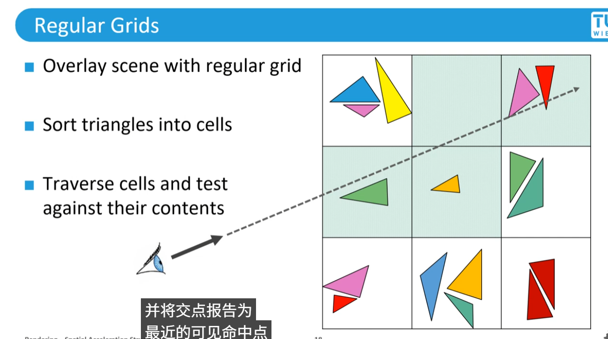

但是实际场景中Mesh很容易是按簇分布的，此时如果击中左上角这个cell，会导致大量的相交计算

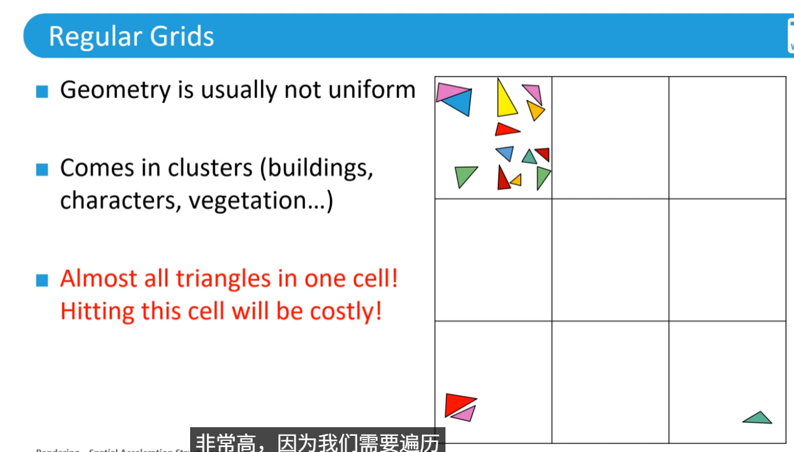

最容易的解决办法是提高grid的分辨率

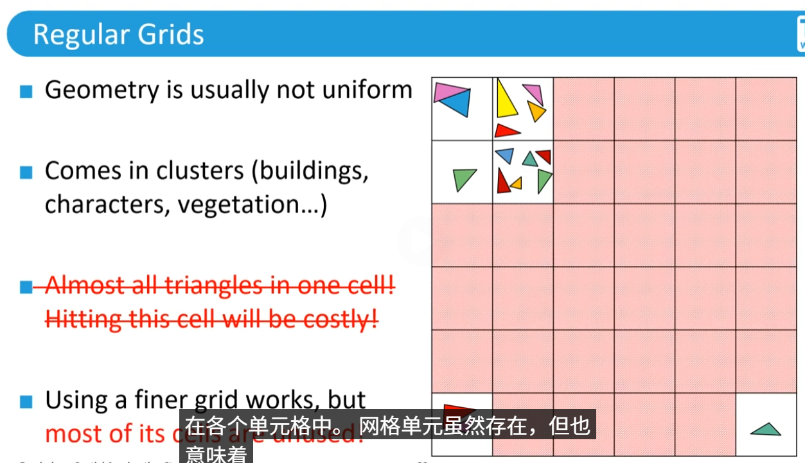

## 四叉树/八叉树

> 这种方法是从顶向下划分，Root表示整个场景，先切4刀，检查每个区域是否Mesh数量小于阈值了，如果不小于，继续划分
>
> 如下图中区域1就需要继续划分，而234就不需要了

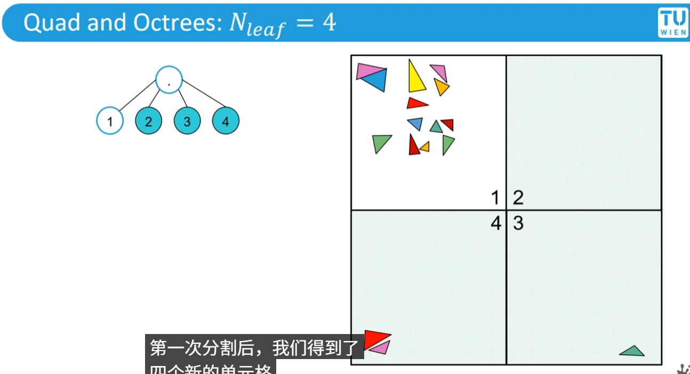

区域1中Mesh还是很多，继续划分

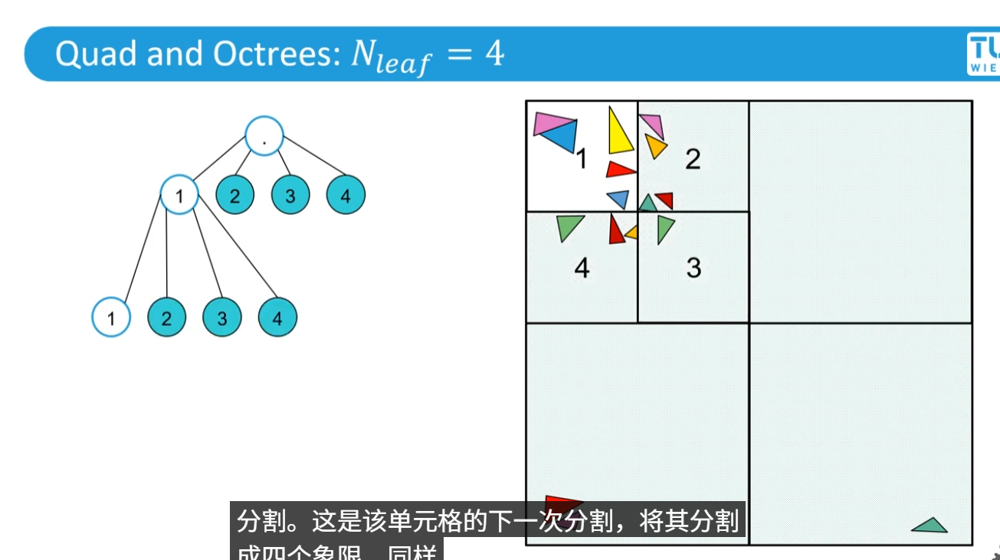

继续划分新的区域1

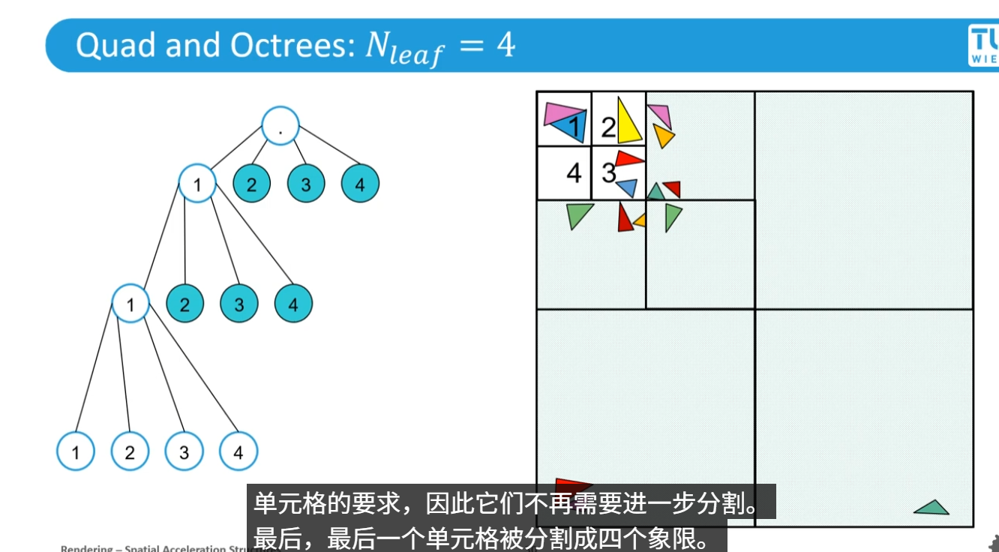

上述流程假定一个情况：每个三角形都能刚好划分到不同的区域，但实际上一个三角形可能分布在不同的区域内，所以每个涉及的区域都需要存储这个三角形，如下图

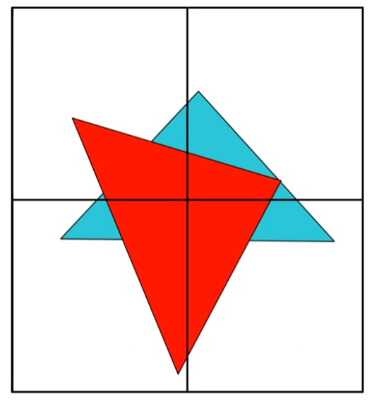

## BSP树

> 递归的用一个超平面去划分场景为两半，划分可以是任意的

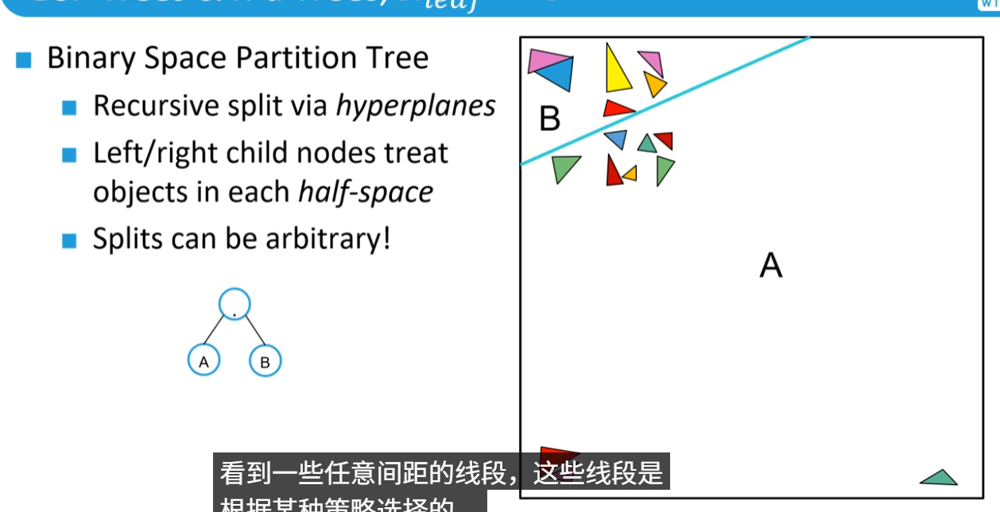

继续对AB两个区域进行划分

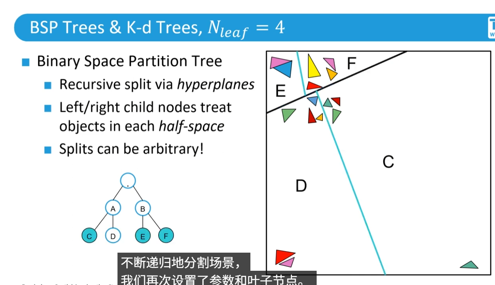

与四叉树类似，当一个区域内的Mesh数量小于阈值后停止分割

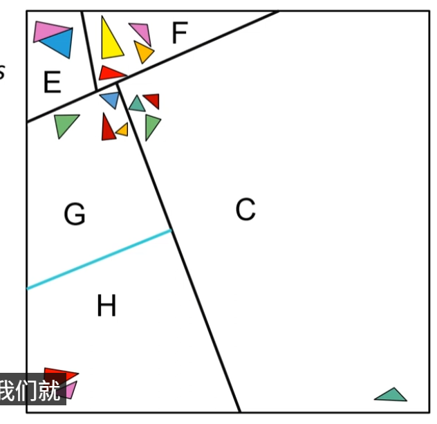

## K-d Tree

> 是BSP树的一种特殊形式，横平竖直地进行分割，而不是随意分割

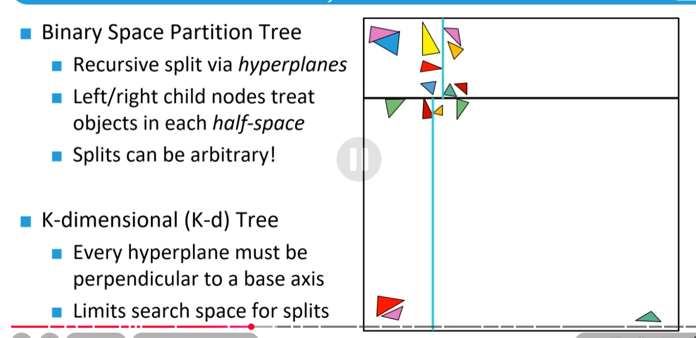

## BVH

> 上述方法都是自顶向下对空间进行划分，看Mesh落在哪个区域，而BVH是从底向上，合并多个Mesh为一个结点，直到合并场景中所有结点
>
> **一个关键区别是：BVH运行划分重叠，所以mesh可以安心得只落在一个结点**

**这里注意：以前理解的 BVH构建是自底向上是不全面的，分CPU和GPU两种情况，如下图文字所示**

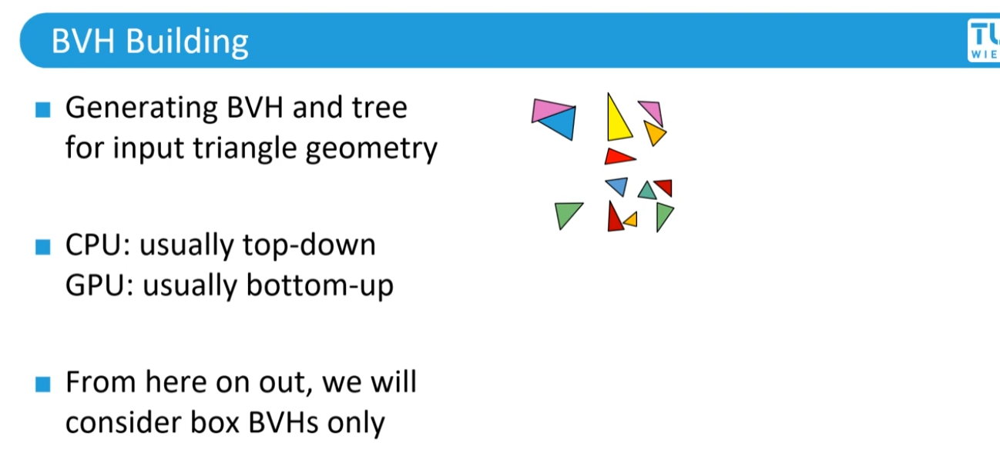

下面是TopDown的流程，Root表示整个场景（这里一个问题是：怎么去划分）

