+++date = '2026-02-20T20:02:28+08:00'
draft = false
title = '游戏引擎开发实践（空间加速结构）'
image = 'image-20260220203337299.png'
categories = ["Projects/游戏引擎"]
tags = ["游戏引擎"]
+++

# 基础理论

## 均匀网格划分

把整个场景 AABB 均匀划分成 `Nx × Ny × Nz` 的三维网格，每个 cell 里存放与其相交的 primitive（如三角形）列表


但是实际场景中Mesh很容易是按簇分布的，此时如果击中左上角这个cell，会导致大量的相交计算


最容易的解决办法是提高grid的分辨率


## 四叉树/八叉树

> 这种方法是从顶向下划分，Root表示整个场景，先切4刀，检查每个区域是否Mesh数量小于阈值了，如果不小于，继续划分
>
> 如下图中区域1就需要继续划分，而234就不需要了


区域1中Mesh还是很多，继续划分


继续划分新的区域1


上述流程假定一个情况：每个三角形都能刚好划分到不同的区域，但实际上一个三角形可能分布在不同的区域内，所以每个涉及的区域都需要存储这个三角形，如下图


### 松散八叉树

扩大子节点的范围，这样可以保证这个结点是完全包含五角星

假设一条射线从上到下进行击中判断，正好落在左上角和右上角两个结点的中心偏右一点，那左图（如果只在左边存储五角星）只有右边结点会加入检测队列，导致五角星漏掉了，那五角星就会被误判，右边就能正常把左边结点加入判断流程

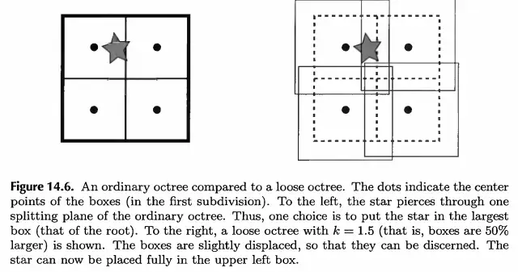

### 线性八叉树

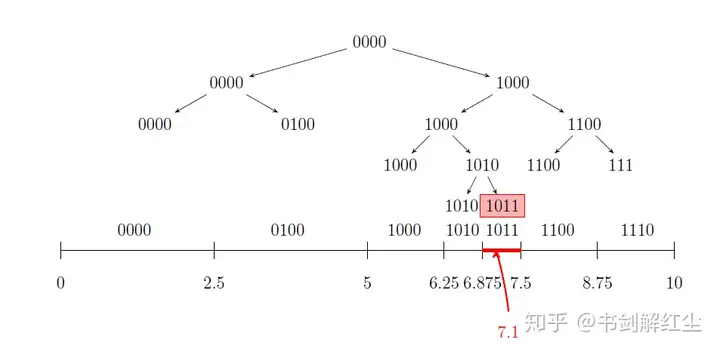

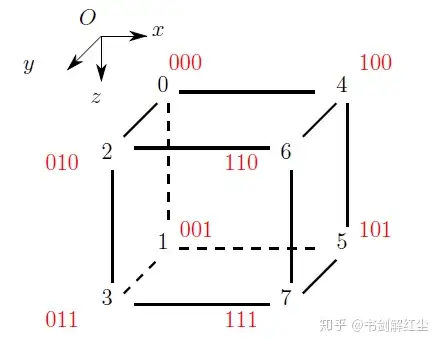

TODO:具体使用流程还不太清除

#### Morton Code

> 将多维数据映射到一维，同时保留数据点的局部性
>
> 空间中相近的坐标，编码后的数值也相近

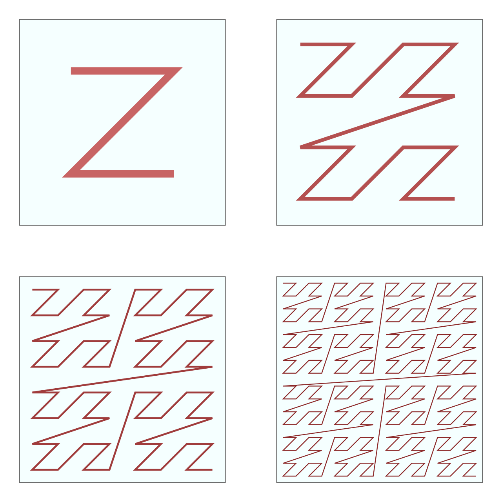

> 下图展示计算一个XYZ坐标的莫顿编码

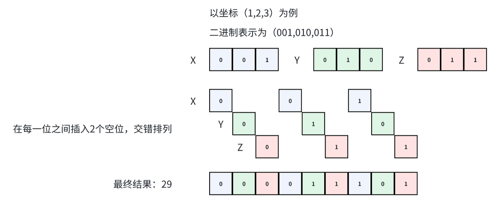

如果把空间中XYZ从0-10都编码并排序后连起来会发现，一维编码表示的空间坐标，在3D空间中有了局部连续性

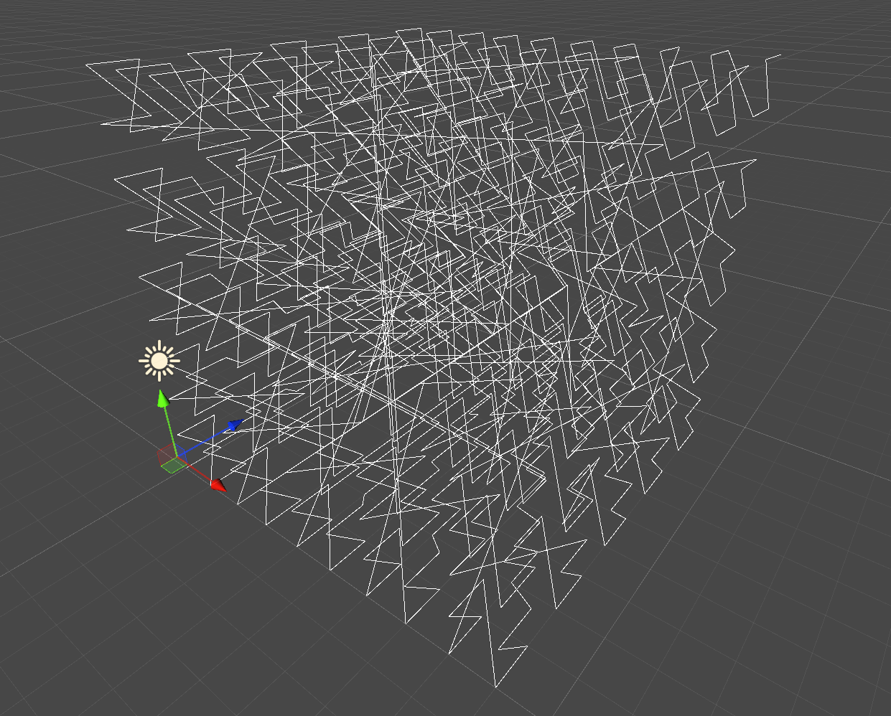


## BSP树

> 递归的用一个超平面去划分场景为两半，划分可以是任意的


继续对AB两个区域进行划分


与四叉树类似，当一个区域内的Mesh数量小于阈值后停止分割


## K-d Tree

> 是BSP树的一种特殊形式，横平竖直地进行分割，而不是随意分割


## BVH

> 上述方法都是自顶向下对空间进行划分，看Mesh落在哪个区域，而BVH是从底向上，合并多个Mesh为一个结点，直到合并场景中所有结点
>
> **一个关键区别是：BVH运行划分重叠，所以mesh可以安心得只落在一个结点**，不会出现一个Mesh落在两个子空间，需要额外处理的情况
>
> 构建BVH的关键在于，如果划分左右区间使得左右两个结点的AABB重叠最小
>
> BVH在GPU是bottomUp来构建的

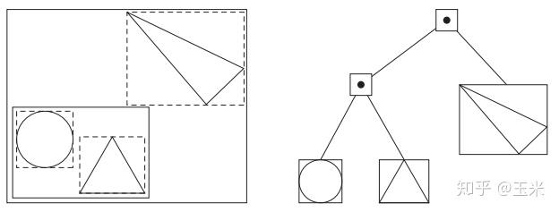

**这里注意：以前理解的 BVH构建是自底向上是不全面的，分CPU和GPU两种情况，如下图文字所示**


下面是TopDown的流程，Root表示所有三角形组成的AABB，每次都把大的AABB分成两个小的AABB，每个AABB表示一部分三角形组成的AABB

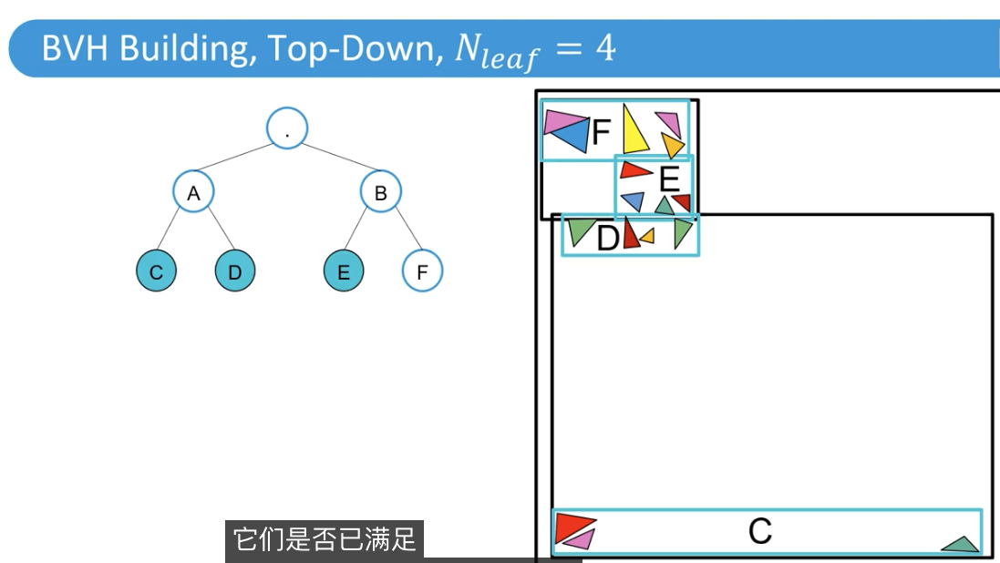

TopDown流程的问题是，怎么去划分呢？

可以选择沿着一条坐标轴进行，或者某个方向

划分可以使用空间的中心或者Mesh的中心

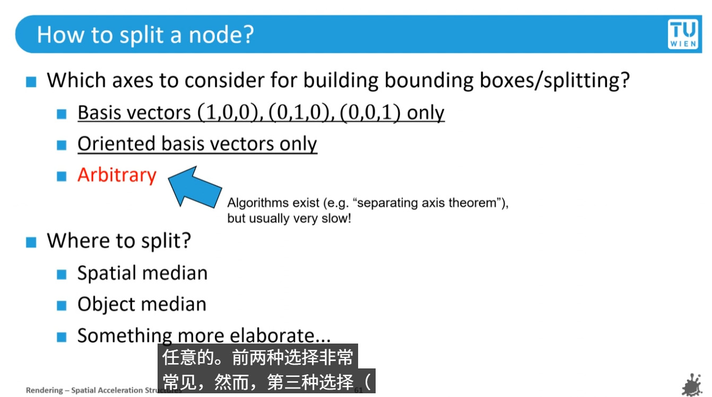

按照空间来划分流程如下，首先选择最长轴，找到终点，分析每个Mesh的中心在这个中点的左侧还是右侧，从而划分两个部分，计算两部分的AABB，这样就划分好了

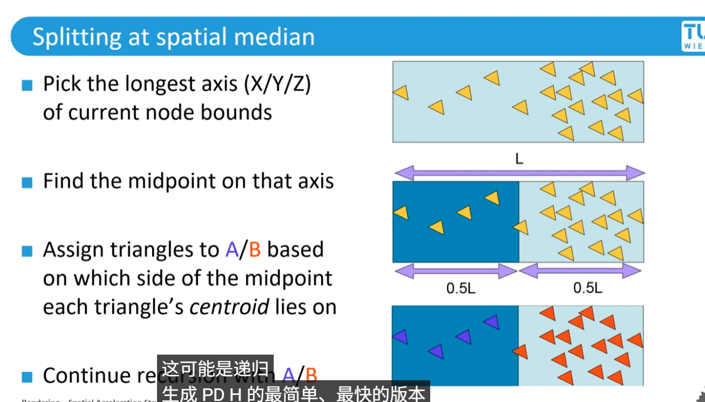

如何与BVH进行求交运算呢，用一个递归代码就能完成

```c++
HitInfo TraverseBVH(Node* node, Ray ray) {
    if (!IntersectAABB(ray, node->aabb)) return HitInfo::miss();  // 剪枝
    
    if (node->isLeaf) {
        return IntersectTriangles(ray, node->triangles); // 真正的遍历求交
    } else {
        HitInfo hitLeft = TraverseBVH(node->left, ray);
        HitInfo hitRight = TraverseBVH(node->right, ray);
        return hitLeft.hitDistance < hitRight.hitDistance ? hitLeft : hitRight;
    }
}
```

从下图可以理解坐标中点划分并不是一种很好的方式（左图），AABB重叠了，右图是比较好的方式

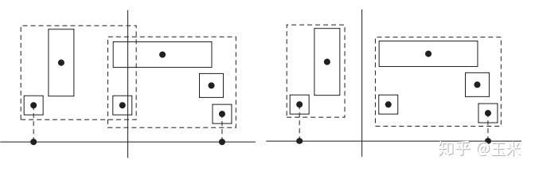

## BVH的SAH（表面积启发式的结点划分方法）

> 定义数学模型：
>
> 1. 对一个Mesh求交的代价为t(x)，那一批Mesh不分区情况下的总代价为：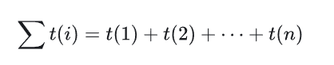
> 2. 如果将Mesh分为两区，光线击中某个区域的概率为p(x),此时的代价为（ttrav是表示遍历树状结构的代价）：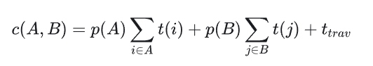
> 3. 结合BVH来看，AB分别表示划分后两个AABB的表面积，C是父结点的表面积，ab表示划分后各个区域的Mesh数量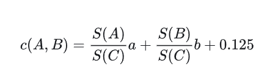
>
> **从理论上理解：SAH目的是减少求交次数，首先Mesh越多，求交次数就越多，那Mesh所在的区域被击中的概率越大，进入区域去遍历这些Mesh的概率就越大，AABB的表面积越大，选择当前区域的概率越大，所以这两个因素相乘就是代价**

# 八叉树实践

> 总体上就是递归构建，基本思路不难，估计难得是适配实际情况

```c++
#pragma once
#include "collision.h"
/*
	八叉树(目前这个代码跑不了，只是伪代码)：
	构建: 把所有物体分配给Root，如果Root的物体数量大于MAX_LEAF_OBJECT_COUNT，就创建它的8个孩子，并且把所有物体按照位置分配给孩子（如果没法精确分配给某个孩子，就还是存在Root上），再遍历8个孩子，如果某个孩子物体数量大于MAX_LEAF_OBJECT_COUNT，继续递归构建
	添加：判断物体是否包含在Root，包含的话，就判断8个孩子是否完美包含它，如果包含，就递归给孩子去添加，如果都不包含。就存储在当前Root
	更新物体位置：判断是否还在同一个结点，如果不在就删除后重写插入，或者有一些论文去查询邻近结点

	松散八叉树：


	八叉树的用途：（加速遍历Mesh的判断，如果对某个结点的判断失败了，那这个结点以下的Mesh的判断可以完全跳过）
	视锥裁剪：用视锥体和Root进行相交判断，如果AABB完全在视锥外，直接剔除Root（剪枝），如果视锥完全包含当前AABB，直接添加当前Root下所有Mesh，如果只是相交，递归检查8个孩子，递归到孩子结点，如果还相交，就添加到可见物体数组
*/
namespace GameEngine {

#define MAX_LEAF_OBJECT_COUNT 4

	template<class T>
	class OctreeNode {
	public:
		OctreeNode(BoundingBox& Box) {
			AABB = Box;
		}
		std::vector<T> Objects;
		BoundingBox AABB;
		std::array<OctreeNode<T>*, 8> children{nullptr};


		bool IsStrictContain(T& Object) {
			return AABB.IsContains(Object.box);
		}
	};

	template<class T>
	class Octree
	{
	public:
		Octree(std::vector<T>& Objects, BoundingBox& Box) {
			Root = std::make_shared<OctreeNode<T>>(Box);
			CreateChildNode(Root);
			GenOctree(Root, Objects);
		}

		void CreateChildNode(std::shared_ptr<OctreeNode<T>> Root)
		{
			// TODO: 八个子空间生成，规划每个子空间的范围
			// Root->children[0] = new OctreeNode({ xxxx});
		}

		void GenOctree(std::shared_ptr<OctreeNode<T>> Root,std::vector<T> &Objects) {
			// 1. 每个物体划分到当前Root的8个子空间或Root空间中
			for (T& obj : Objects) {
				bool isPushed = false;
				for (OctreeNode<T>* CurSpace : Root->children) {
					if(CurSpace->AABB.IsContains(obj.aabb))
					{
						CurSpace->Objects.push_back(obj);
						isPushed = true;
					}
				}
				if (!isPushed)	// 没有一个子空间能够完全包住物体，放在父空间中
				{
					Root->Objects.push_back(obj);
				}
				isPushed = false;
			}

			// 2. 判断子空间是否需要继续划分
			for (OctreeNode<T>* CurSpace : Root->children)
			{
				if (CurSpace->Objects.size() > MAX_LEAF_OBJECT_COUNT)
				{
					CreateChildNode(CurSpace);
					GenOctree(CurSpace,CurSpace->Objects);
					CurSpace->Objects.clear(); // TODO:如果有物体存在Root上，这行代码就把他删了。。。。
				}
			}
		}
		

		void AddObject(T& Object) {
			AddObjectInner(Object, Root);
		}
		bool AddObjectInner(T& Object, std::shared_ptr<OctreeNode<T>> Root) {
			if (!Root) return false;
			if (!Root->AABB.IsContains(Object.aabb)) {
				return false;
			}
			bool isHandled = false;
			for (OctreeNode<T>* CurSpace : Root->children) {
				if (CurSpace && CurSpace->AABB.IsContains(obj.aabb))
				{
					// 说明子结点插入失败,交给当前结点处理
					isHandled = AddObjectInner(object, CurSpace);
				}
			}
			if (!isHandled) {
				Root->Objects.push_back(object);
			}
			return true;
		}


	private:
		std::shared_ptr<OctreeNode<T>> Root = nullptr;
	};
}


```

# BVH + SAH实践(TODO)

## CPU（自顶向下）

> CPU上构建BVH主要是TopDown的，SAH用来划分区间

为了减少SAH的计算量，在最长轴上均匀分成若干桶，来减少计算,最终划分只会出现在桶内

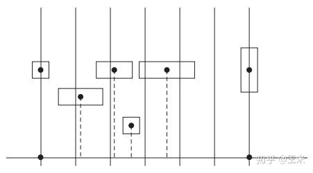

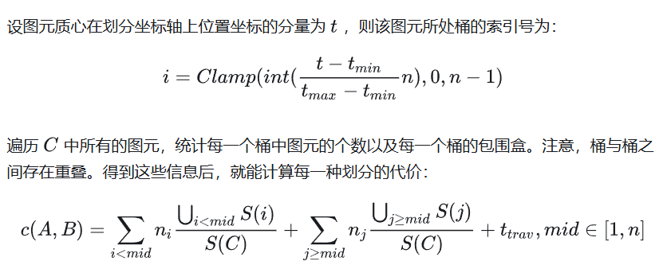

另外插入新结点时插入到哪个叶子结点也是根据SAH，如下图插入L的Cost = 新增的11结点的表面积 +  沿路向上的父结点表面积变化的和

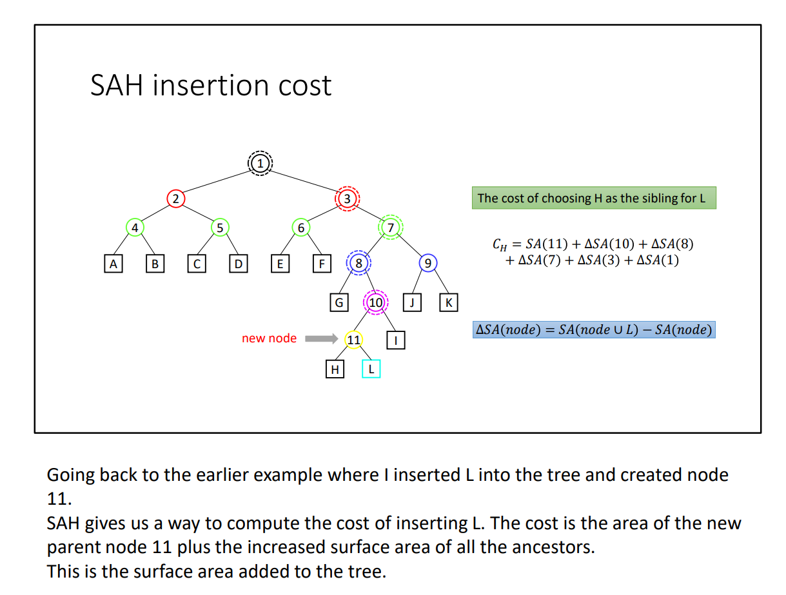

```c++
#pragma once
#include "collision.h"
/*
	BVH:（TODO：目前是伪代码，SAH未完成）
	构建方式： 计算所有Mesh的AABB在哪个轴上最宽，在这个轴上对Mesh进行排序,根据某种划分算法把Mesh数组分成两部分，分别递归构建子树，直到叶子结点
	添加Mesh：首先插入一定发生在叶子结点，依据SAH，判断依哪一个节点的插入会有“最小表面积”的变化，具体计算公式看Blog
*/
namespace GameEngine 
{
	template<typename T>
	class BVHNode {
	public:
		BVHNode* left = nullptr;
		BVHNode* right = nullptr;
		BVHNode* parent = nullptr;
		std::vector<T> objects;
		BoundingBox AABB;
	};


	template<typename T>
	class BVH
	{
	public:
		BVHNode<T>* BuildBVHInner(std::vector<T>&objects, BVHNode<T>* Root) {
			// 1. 计算Root的AABB
			for (auto& object : objects) {
				Root->AABB.Merge(object.aabb);
			}

			// 创建Root
			if(!Root) Root = new BVHNode<T>();
			if (objects.size() <= 1) {
                Root->objects = objects;
                return Root;
			}
			// 2. 利用SAH算法，对Root进行划分
			int lefeMaxIndex = SAHSplit(Root, objects,int left, int right);

			// 3. 递归构建左右子树
			BVHNode<T>* left = BuildBVHInner(objects.begin() + left, objects.begin() + lefeMaxIndex, Root);
            BVHNode<T>* right = BuildBVHInner(objects.begin() + left + lefeMaxIndex, objects.begin() + right, Root);
			Root->left = left;
            Root->right = right;
            left->parent = right->parent = Root;
            return Root;
		}


		// SAH算法，返回划分后left的最大Index
		int SAHSplit(BVHNode<T>* node, std::vector<T>& objects, int left, int right) {

		}
		BVHNode<T>* Root = nullptr;
	};


}
```

## GPU(自底向上，线性BVH)

以二维坐标和三维坐标为例，对于每一个点计算其对应的莫顿码，然后利用莫顿码对其进行排序，再将排序后的点按照顺序连接起来就会得到如下图所示的Z形曲线z-order curve

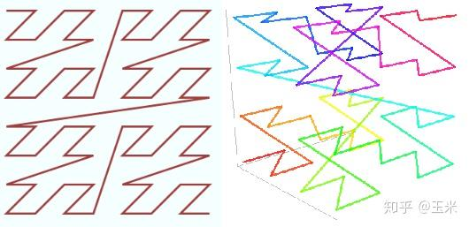

构建莫顿码就是把多维数组成的坐标的每个维度交错排布

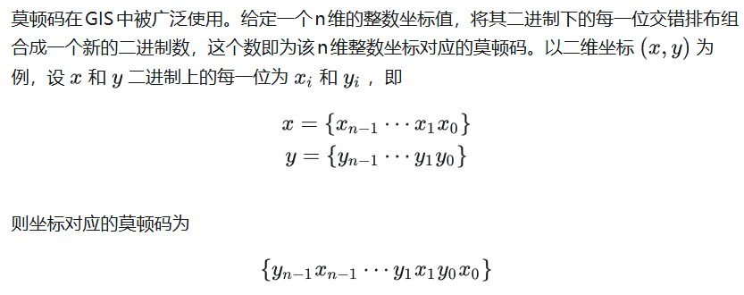

比如二维平面上[0-3]范围内的点，全部编码为莫顿编码后，排序连线如下

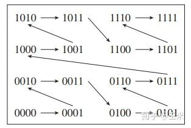

主要观察一点，用最高位0或1就可以把区域划分为上下两部分！

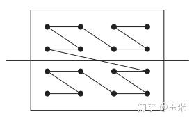

只看第二位，又可以左右划分，这样就划分 成了四个区域

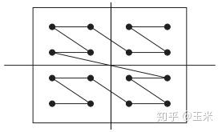

所以莫顿编码 第一位为1，第二位为0的区域一定在左上角！

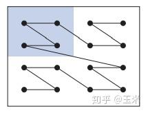

对于三角形图元，编码它的方式为 xyzmin表示整个场景的最小点，lwh是场景的宽度

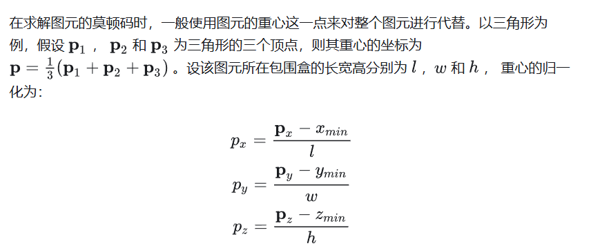

按这种方式计算后P就代表这个三角形在AABB盒中的位置，接下来对P进行莫顿编码

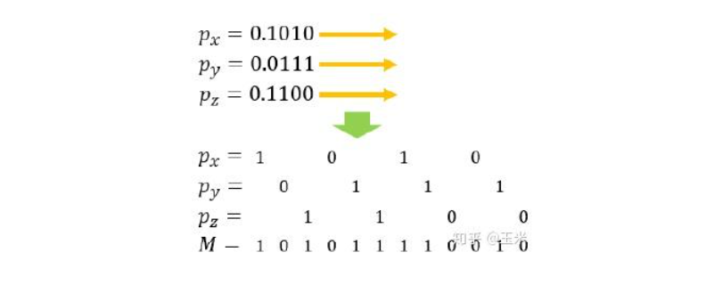

构建BVH时，按照上边方法生成所有图元的编码，然后进行基数排序

这里基数排序回忆一下

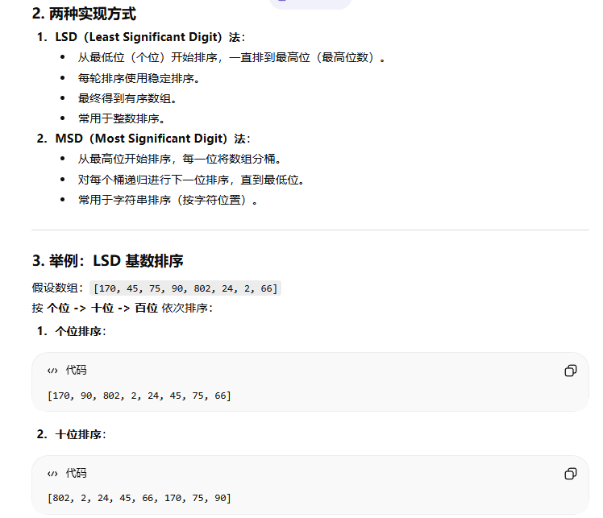

排序完成后，再按照最长公共前缀来进行切分

切分就是按照当前位是0还是1（其实不是看一位，而是最长公共前缀，比如前几个都是00），同样是0的说明在空间上是接近的

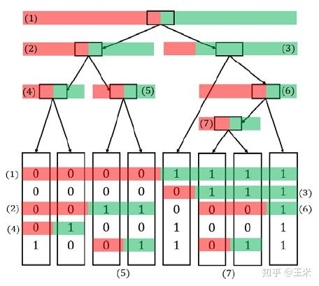

这种方式仍然是自顶向下的，下面介绍从底向上的GPU的构建办法

首先第一点：一个二叉树，叶子结点有N个时，非叶子结点一定有N-1个


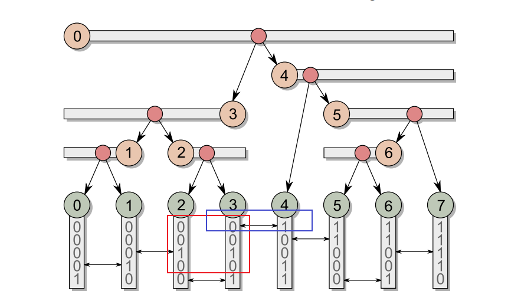
