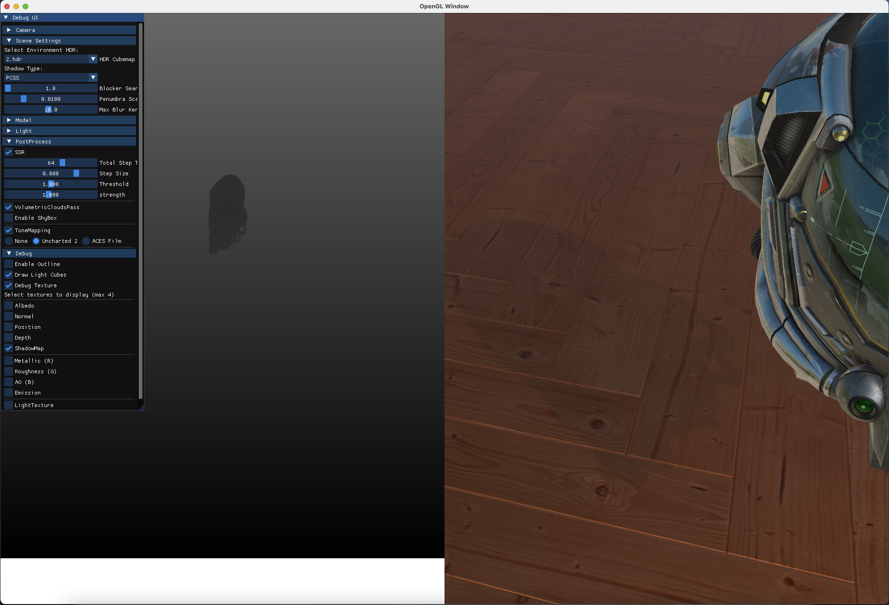
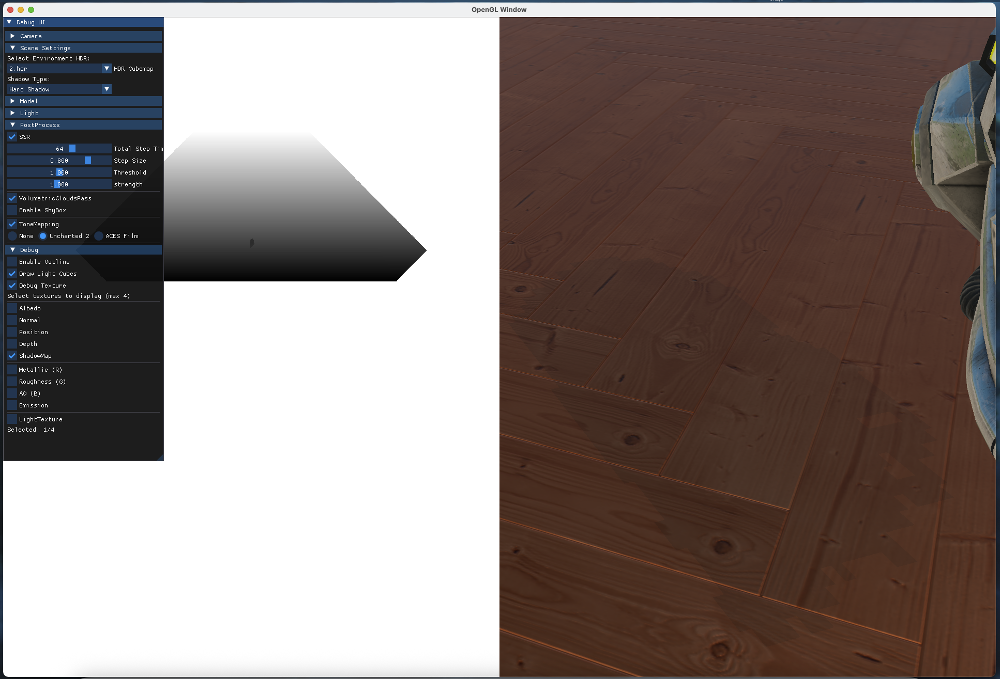
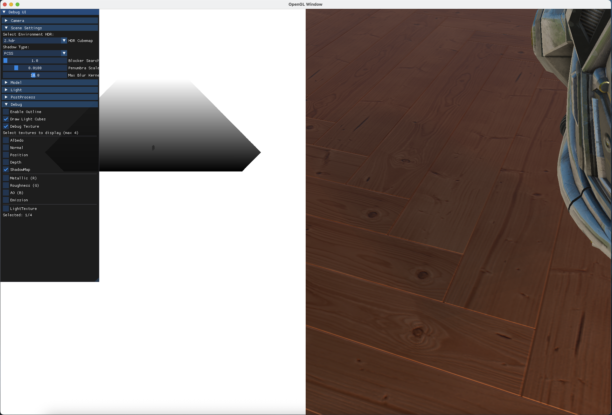
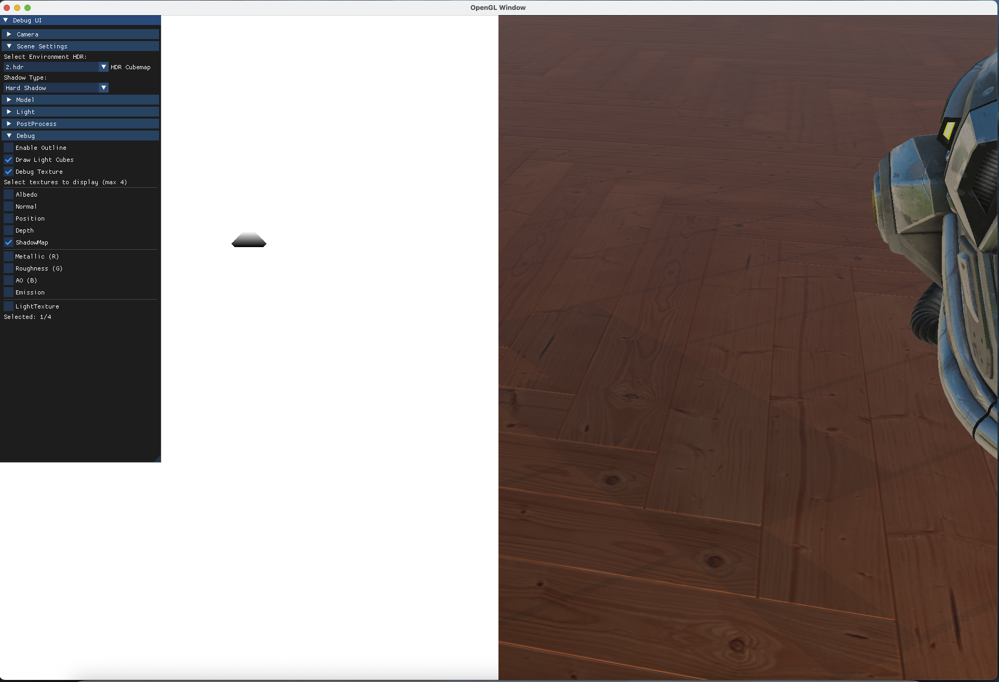
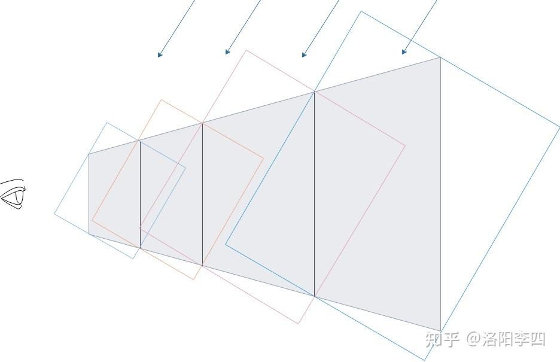
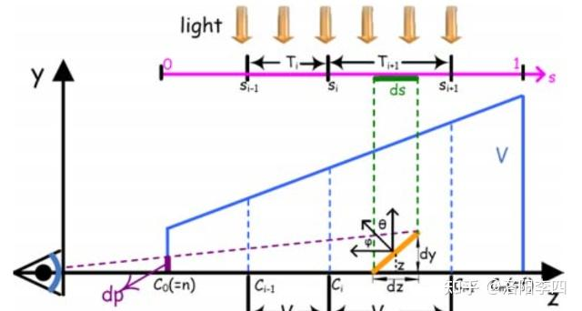
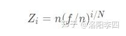
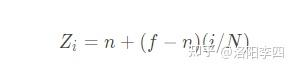
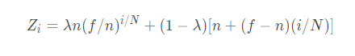

+++
date = '2025-10-25T20:49:55+08:00'
draft = false
title = '游戏引擎开发实践（阴影篇）'
categories = ["Projects/GameEngine"]
tags = ["游戏引擎","Vulkan","渲染管线","Hazel"]
+++

>  在OpenGL渲染器中已经实现了硬阴影以及PCF，PCSS，在这里再引入级联阴影

# 级联阴影

## 传统阴影做法与问题

> 截图来自我的OpenGL延迟渲染器

```c++
float orthoSize = 10.0f;
glm::mat4 lightProjection = glm::ortho(-orthoSize, orthoSize, -orthoSize, orthoSize, near_plane, far_plane);
```

这行代码决定了从光源位置渲染阴影贴图的正交投影矩阵，他决定了阴影的覆盖范围，当设置为10时，硬阴影以及PCSS效果如下




当设置为100时，硬阴影与PCSS效果如下,可以看到硬阴影锯齿变得严重起来，软阴影也糊成一片了





最后设置为1000,阴影以及完全失效了，因为覆盖区域太大了，整个模型也就占几个像素，导致模型边缘区域都是一样的判断结果，另外bias也失效了



> 所以使用大场景时，阴影需要覆盖很大的区域，导致一大片位置只在阴影贴图中占一小部分，会导致近处模型阴影明显出问题

## 级联阴影的原理



1. 首先对摄像机坐标系下的视锥体分割，分割为不同深度的分段
2. 在光源的视角下，生成每个视锥体分段的“包围盒”，这个包围盒是生成阴影贴图时正交投影的重要参考

### 视锥体分段

> 目的是把相机的视锥体（camera frustum）沿深度方向划分成多个“级联”

常用方法叫PSSM



1. ds表示阴影贴图的像素长度
2. dp屏幕像素长度
3. dp/ds可以理解为阴影的锯齿误差
4. 为了使整个画面的阴影看起来质量一致，不因到相机的距离而发生明显质量变化， 应该让dp/ds 是一个常数（**dp/ds**：表示“一个阴影贴图像素在屏幕上看起来有多大”）
5. 由dp/dy = n/z，得出dp = ndy/z
6. φ和θ分别表示曲面法线与屏幕和阴影贴图平面之间的角度。由dz/cosθ = dy/cosφ，得出dy = dzcosφ/cosθ
7. 所以dp = ndzcosφ/zcosθ，dp/ds = ndzcosφ/zdscosθ

看看这个式子：
$$
\frac{dp}{ds} = \frac{n dz \cos\phi}{z \, ds \cos\theta}
$$
它告诉你阴影质量受哪些因素影响：

| 因素                         | 影响                         | 含义                                      |
| ---------------------------- | ---------------------------- | ----------------------------------------- |
| **n / z**                    | ↓ 随距离增大而减小           | 物体越远，阴影在屏幕上越小 → 锯齿更明显   |
| **cosφ / cosθ**              | 与法线角度相关               | 面倾斜时投影面积不同，阴影更“拉伸”        |
| **dz/ds**                    | 光源深度变化与贴图分辨率关系 | 光源投影范围越大（dz 大），每个像素越模糊 |
| **→ dp/ds 越大，阴影越锯齿** |                              |                                           |

- 最后如果用对数拆分方案，可以推导出



其中Z是视锥体分段处的值,对应上图中的Ci，n是近平面距离，f是远平面距离，N是视锥体分割的个数，一般是1~4个

- 如果使用均匀拆分方案



- 而PSSM方法是他们的折中，用系数λ来加权平均，



```c++
float nd = camera->near;
float fd = camera->far;
float lambda = 0.75;
float ratio = fd / nd;
frustums[0].near(nd);
for(int i = 1 ; i < 分段个数 ; i++) 
{
	float si = i / (float)分段个数;
	float t_near = lambda * (nd * powf(ratio, si)) + (1 - lambda) * (nd + (fd - nd) * si);
	float far = near * 1.005f;//略微增加重合，避免断裂
	frustums[i].near(near);
	frustums[i-1].far(far);
}
frustums[分段个数-1].far(fd);
```

到这里就拿到了每个视锥体切片的Near和Far是多少，就是上图中的C0，C1...

### 光源空间中正交投影

1. 先计算出摄像机视锥体分块在世界空间中的坐标（就是计算了近平面和远平面组成的立方体的8个顶点的世界坐标）

```c++
glm::vec3 viewPos = camera->Position;
glm::vec3 viewDir = camera->Front;
glm::vec3 up(0.0f, 1.0f, 0.0f);
glm::vec3 right = glm::cross(viewDir, up);
for(int i = 0 ; i < 分块个数 ; i++) 
{
   Frustum& frustum = m_frustums[i];
   glm::vec3 fc = viewPos + viewDir * frustum.far(); // 当前的Near
   glm::vec3 nc = viewPos + viewDir * frustum.near(); // 当前的Far
   right = glm::normalize(right);   // 相机的右方向
   up = glm::normalize(glm::cross(right, viewDir)); // 计算正交基的上方向
   // 计算当前分片的近平面和远平面宽高的一半
   float near_height = tan(frustum.fov() / 2.0f) * frustum.near();
   float near_width = near_height * frustum.ratio();
   float far_height = tan(frustum.fov() / 2.0f) * frustum.far();
   float far_width = far_height * frustum.ratio();
   //记录视锥8个顶点
   frustum.m_points[0] = nc - up * near_height - right * near_width;
   frustum.m_points[1] = nc + up * near_height - right * near_width;
   frustum.m_points[2] = nc + up * near_height + right * near_width;
   frustum.m_points[3] = nc - up * near_height + right * near_width;
   frustum.m_points[4] = fc - up * far_height - right * far_width;
   frustum.m_points[5] = fc + up * far_height - right * far_width;
   frustum.m_points[6] = fc + up * far_height + right * far_width;
   frustum.m_points[7] = fc - up * far_height + right * far_width;
}
```

2. 利用分块的各顶点坐标，计算摄像机视锥体分段的“包围盒”，从而计算出分块对应的正交投影矩阵（最终结果就是每个级联块都有了自己的变换矩阵，我想把模型放在哪个级联块中，就乘以他的变换矩阵）

```c++
glm::mat4 lightProjMat;
for(int i = 0 ; i < 分块个数 ; i++) 
{
   //1. 找出光空间中八个顶点的最大最小z值（光源视角下z的范围）
   Frustum& frustum = m_frustums[i];
   glm::vec3 max(-1000.0f, -1000.0f, 0.0f);
   glm::vec3 min(1000.0f, 1000.0f, 0.0f);
   glm::vec4 transf = lightViewMat * glm::vec4(frustum.m_points[0], 1.0f);
   min.z = transf.z;
   max.z = transf.z;
   for(int j = 1 ; j < 8 ; j++) 
   {
     transf = lightViewMat * glm::vec4(frustum.m_points[j], 1.0f);
     if(transf.z > max.z) { max.z = transf.z; }
     if(transf.z < min.z) { min.z = transf.z; }
   }
//1.1 扩展光视锥体的大小，使其包括所有的遮挡物
   for(int j=0; j<场景中物体包围球个数; j++)
   {
   	transf = lightViewMat * vec4f(objBSphereCenter[j], 1.0f);
		if(transf.z + objBSphereRadius[j] > max.z)
		{
			max.z = transf.z + objBSphereRadius[j];
		}
   }
   //2. 设光空间的正交投影矩阵为ortho，他的x,y∈[-1,1]，z∈[-tmax.z,-tmin.z]
   //使用x,y∈[-1,1]，是因为每个分块的投影矩阵都可以使用单位x,y缩放平移后获得
   //使用z∈[-tmax.z,-tmin.z]，是因为摄像机空间指向负Z方向，而glm::ortho传入的是近平面和远平面指向正Z方向
   glm::mat4 ortho = glm::ortho(-1.0f, 1.0f, -1.0f, 1.0f, -tmax.z, -tmin.z);
//2.1 在光空间中，找出视锥体切片各顶点的x、y的标准设备坐标范围。因为我们设的投影矩阵的x、y都是标准设备坐标，我们需要求出x、y的变化范围，以便对ortho进行缩放平移
   glm::mat4 lightVP = ortho * lightViewMat;
   for(int j = 0 ; j < 8 ; j++) 
   {
     transf = lightVP * glm::vec4(frustum.m_points[j], 1.0f);
     transf.x /= transf.w;
     transf.y /= transf.w;
     if(transf.x > max.x) { max.x = transf.x; }
     if(transf.x < min.x) { min.x = transf.x; }
     if(transf.y > max.y) { max.y = transf.y; }
     if(transf.y < min.y) { min.y = transf.y; }
   }
//2.2 根据正交投影矩阵的公式，设置缩放平移量(计算过程在后面)
   glm::vec2 scale(2.0f / (max.x - min.x), 2.0f / (max.y - min.y));
   glm::vec2 offset(-0.5f * (max.x + min.x) * scale.x, -0.5f * (max.y + min.y) * scale.y);
   glm::mat4 crop = glm::mat4(1.0);
//2.3 设置缩放平移的变换矩阵
   crop[0][0] = scale.x;
   crop[1][1] = scale.y;
   crop[0][3] = offset.x;
   crop[1][3] = offset.y;
   crop = glm::transpose(crop);//注意glm按列储存，实际矩阵要转置
//2.4 计算出光空间中的正交投影矩阵
   lightProjMat = crop * ortho;
   //保存光空间的投影矩阵
   projection_matrices[i] = lightProjMat;
   //保存世界坐标到光空间变换的矩阵
   crop_matrices[i] = lightProjMat * lightViewMat;
}
```

3. 计算出摄像机视锥体分块的远平面在摄像机空间中投影后的位置，并把他变换到[0.0，1.0]。这么做的目的是为了在中判断某个片段属于哪个分块

```c++
for(int i = 0 ; i < 分块个数 ; i++) 
{
   far_bounds[i] =0.5f*((-1.0f * frustums[i].far() * projMat[2][2] + projMat[3][2])/
   frustums[i].far())+0.5f;
 }
```

# 游戏引擎实践

