+++date = '2025-12-26T15:26:32+08:00'
draft = false
title = '游戏引擎开发实践（降噪算法 SVGF）'
categories = ["Projects/游戏引擎"]
tags = ["光线追踪"]
+++

# 降噪算法

## 高斯滤波器

 很简单就是拿一个高斯滤波核遍历一遍像素

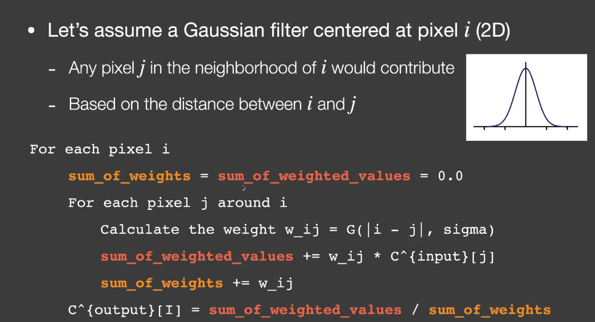

高斯公式回顾一下

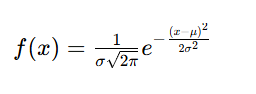


## 双边滤波

这张图是高斯滤波的结果，它任何地方都会被均等的糊掉

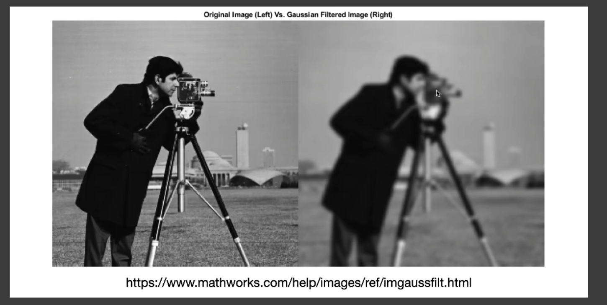

下面是双边滤波器的公式 (i,j)(k,l)两个点的之间的权重计算，前半部分就是高斯分布，后半部分（也是一个高斯分布，颜色越相近，越接近最高点 ）表示：如果两个点颜色差距越大，权重越小 

这个式子可以拆成两个指数函数的乘积，第二项如果颜色一致就=1，颜色不一致程度越大，越小，这样就达到了根据颜色差异调整权重的能力

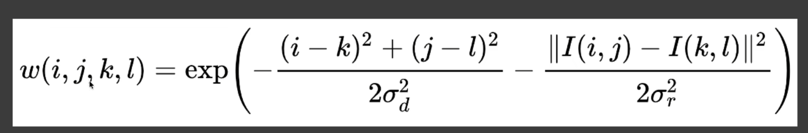

这个算法的问题是分不清是边界还是噪声

## 联合双边滤波

高斯滤波的标准：距离

双边滤波的标准：距离+颜色差异

联合双边滤波思想就是用更多的指标，比如GBuffer那些信息

比如量化深度差异，法线差异来指导权重，这里并没有说具体公式 

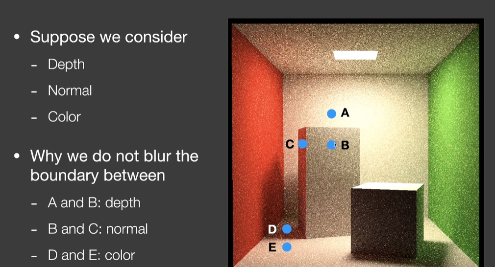

## 大滤波器优化

> 如果滤波核很大，如何进行优化

### 拆分2个Pass

> 水平一遍，竖直一遍，经典
>
> 再配合groupshared，减少ComputeShader的采样次数

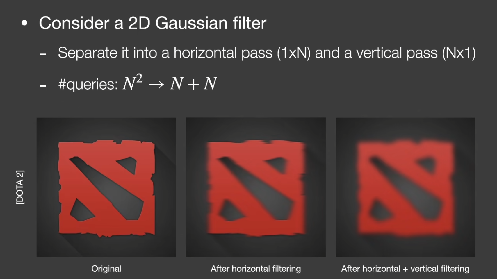

原理上来讲二维高斯就可以拆成两个一维高斯的乘积，卷积写成二重积分后，对于高斯滤波核来说可以拆成内部x积分完成后，再y积分

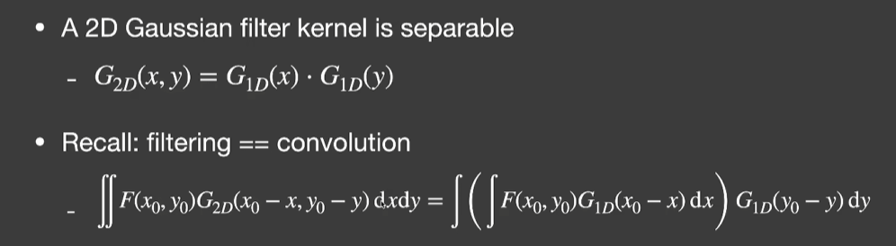

但是复杂的滤波核不适用

### 小波变换卷积\空洞卷积 [À-Trous wavelet](https://link.zhihu.com/?target=https%3A//jo.dreggn.org/home/2010_atrous.pdf) 

> 思路也是多个Pass进行卷积，比如5x5的核，每次都是5x5但是采样点的间距变了，变成$2^i$
>
> 复杂度从**n2**变成 卷积核的平方 * 卷积次数

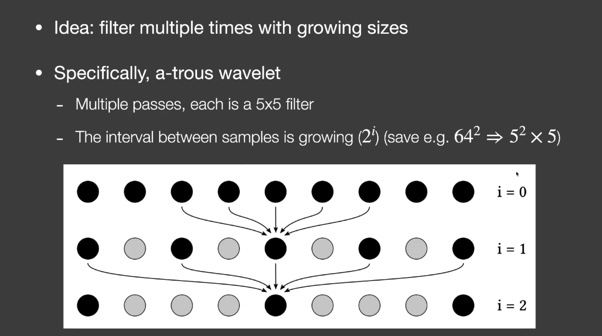

## 处理过亮像素

> 噪声中很亮的点如果做滤波，会变成一片亮

亮点探测:

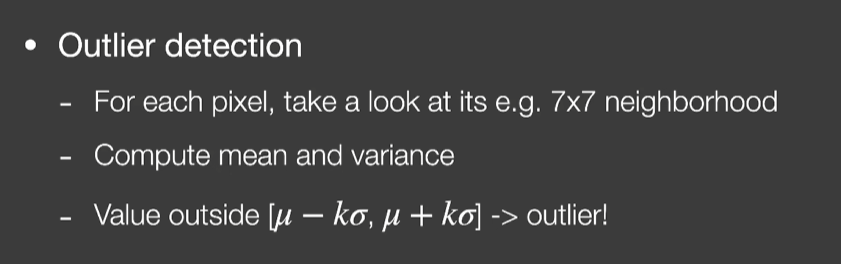

处理亮点


## SVGF （Spatiotemporal Variance-Guided Filter）时空方差引导滤波

> SVGF就是融合了上边介绍的这些技术点，从时间和空间上都进行了滤波

3个因素引导的联合双边滤波

1. 深度

它的深度指数衰减不仅仅是考虑空间深度，还会考虑法线投影上的深度大小（分母），这样建模是为了表达虽然空间上深度差异较大，但是xxxx(TODO:其实没懂为什么这样)

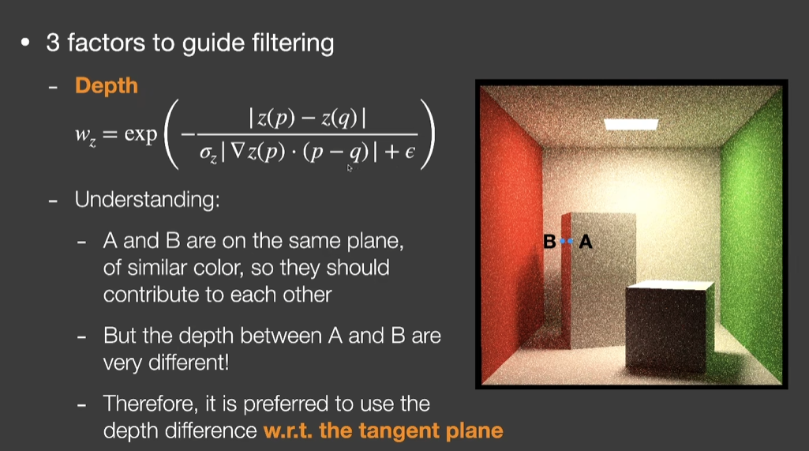

2. 法线

两个法线的点乘来控制，并用指数控制衰减速度

另外一点不要用法线贴图的数据，直接用模型原始法线

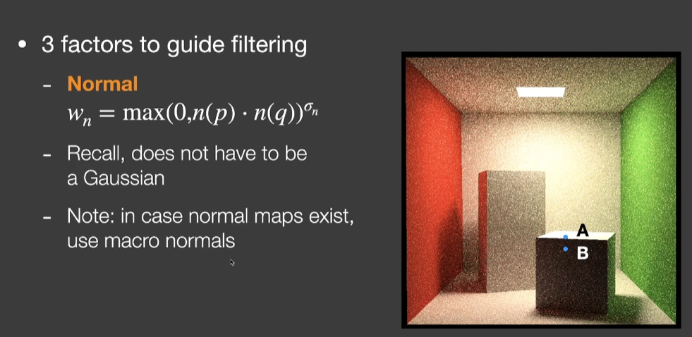

3. Luminance

> 颜色差异会被噪声干扰，比如一个点在阴影里，但是因为噪声，它变得特别亮，解决办法就是利用方差来指导，方差信息会先计算一次空间上的方差，再时域累积，再空间滤波

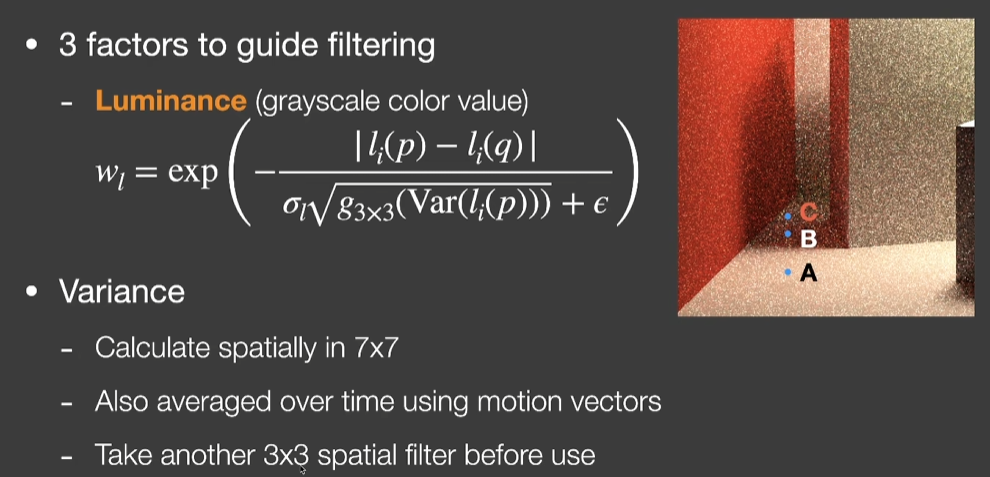

SVGF解决不掉的问题是，场景没有变化也就是MotionVector没有数据，但是阴影一直在移动，这时候的阴影就会有噪声

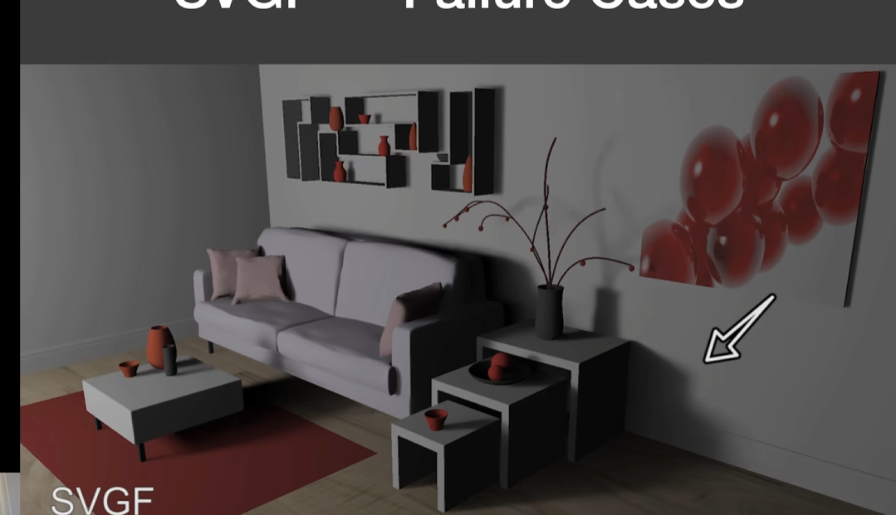再后来出现了A-SVGF,处理场景突变的延迟问题

## RAE

> 利用神经网络来滤波，目前没兴趣

# SVGF实践

> 参考文刀秋二大佬的https://zhuanlan.zhihu.com/p/28288053，与https://zhuanlan.zhihu.com/p/699706592

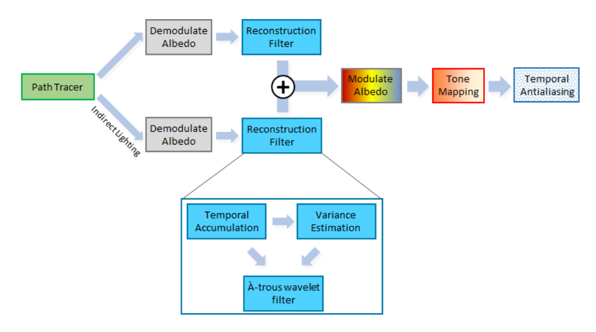

## Demodulate Albedo

第一步要存储SPP=1的情况下，直接光照和间接光照的结果，并且在存储时要/albedo来保存，过滤过后再乘回来，文刀秋二的解释是（纹理的细节并不会因为Filter的强度过于大而丢失掉）目前不太理解，先做出来再说。 另外这样做的前提应该是当前场景是Diffuse的

这张（右侧）表示直接光照/albedo

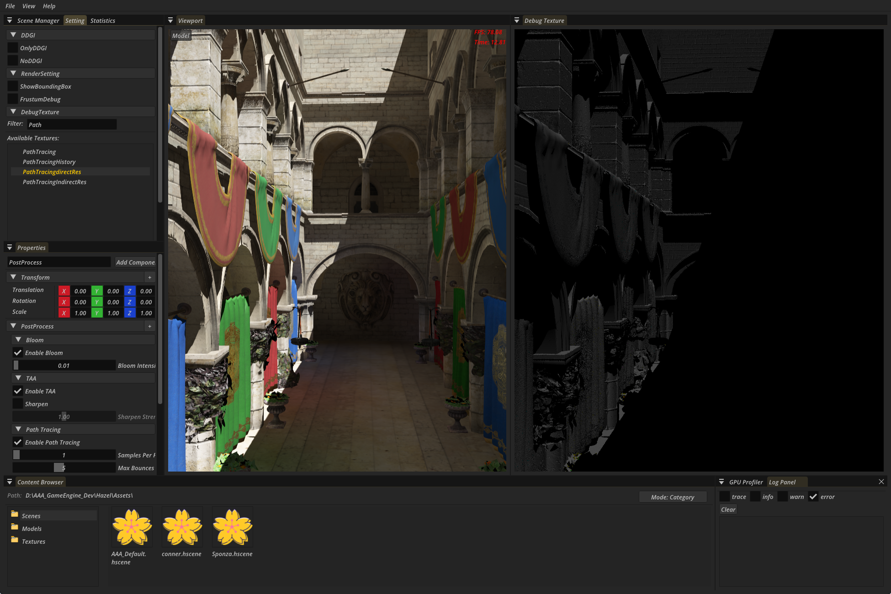

这张（右侧）表示间接光照/albedo

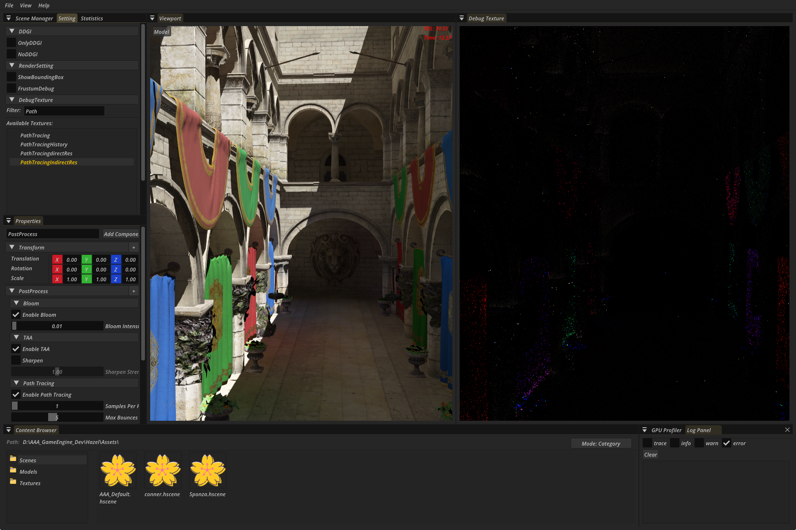

## Reconstruction Filter

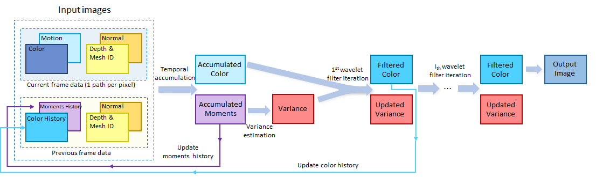

先实现空洞滤波

```glsl
#version 450 core
#include "../common/common.glsl"
#include "../common/math.glsl"
#ifdef COMPUTE_SHADER
layout(set = 1, binding = 0, rgba32f) uniform image2D OUT_COLOR;
layout(set = 1, binding = 1, rgba32f) uniform image2D IN_COLOR;
layout(set = 1,binding = 2, rgba32f) uniform image2D velocityTexture;
layout(push_constant) uniform Uniforms
{
    int curPassIndex; // 当前 Atrous pass 索引
};

layout(local_size_x = 16, local_size_y = 16, local_size_z = 1) in;

void main(){
    ivec2 invocID = ivec2(gl_GlobalInvocationID.xy);
    ivec2 imgSize = ivec2(imageSize(OUT_COLOR));
    if (invocID.x >= imgSize.x || invocID.y >= imgSize.y) 
        return;

    vec3 colorSum = vec3(0.0);
    float weightSum = 0.0;


    // 5x5 Atrous 核心 做了空洞滤波，相当于64*64的卷积核
    int curStep = 1 << curPassIndex;
    for (int dy = -2; dy <= 2; ++dy) {
        for (int dx = -2; dx <= 2; ++dx) {
            ivec2 samplePos = invocID + ivec2(dx, dy) * curStep;

            // 边界检查
            samplePos = clamp(samplePos, ivec2(0), imgSize - 1);

            vec3 sampleColor = imageLoad(IN_COLOR, samplePos).xyz;

            // Atrous 权重，这里先用 1.0，之后可以换成高斯或 bilateral 权重
            float weight = 1.0;

            colorSum += sampleColor * weight;
            weightSum += weight;
        }
    }

    vec3 result = colorSum / weightSum;
    imageStore(OUT_COLOR, invocID, vec4(result, 1.0));
}
#endif

```

```c++
#include "hzpch.h"
#include "SVGFPass.h"
#include "Hazel/Core/Application.h"
#include "Hazel/Scene/SceneManager.h"
#include "Hazel/Renderer/RenderResource/RenderResourceManager.h"
#include "Hazel/Renderer/RenderResource/PipelineCache.h"
#include <Hazel/Renderer/RenderResource/Shader.h>
namespace GameEngine {
	void SVGFPass::Init()
	{
		m_Shader = std::make_shared<Shader>("postprocess/SVGF", SHADER_FREQUENCY_COMPUTE)->GetRHIShader();
		RHIRootSignatureInfo info = {};
		info.AddEntryFromReflect(m_Shader);
		info.AddEntry(RENDER_RESOURCEMANAGER->GetGlobalResourcePreFrameRootSignature()->GetInfo())
			.AddPushConstant({4,SHADER_FREQUENCY_COMPUTE });
		m_RootSignature = APP_DYNAMICRHI->CreateRootSignature(info);
		RHIComputePipelineInfo pipelineInfo = {};
		pipelineInfo.computeShader = m_Shader;
		pipelineInfo.rootSignature = m_RootSignature;
		m_Pipeline = APP_DYNAMICRHI->CreateComputePipeline(pipelineInfo);
	}

	void SVGFPass::Build(RDGBuilder& builder)
	{
		auto& [w, h] = APP_WINDOWSIZE;
		RDGTextureHandle pathTracingDirectRes = builder.GetTexture("PathTracingdirectRes");
		if (pathTracingDirectRes.ID() == UINT32_MAX) { return; }
		RDGTextureHandle pathTracingIndirectRes = builder.GetTexture("PathTracingIndirectRes");
		RDGTextureHandle velocity = builder.GetTexture("GBufferVelocity");
		RDGBufferHandle exposureData = builder.GetBuffer("ExposureData");

		RDGTextureHandle directFilterRes = builder.CreateTexture("PathTracing_SVGF_directFilterRes")
			.Exetent({ w, h ,1 })
			.Format(FORMAT_R32G32B32A32_SFLOAT)
			.AllowRenderTarget()
			.AllowReadWrite()
			.Finish();

		RDGTextureHandle forPinpongTexture = builder.CreateTexture("PathTracing_SVGF_forPinpongTexture")
			.Exetent({ w, h ,1 })
			.Format(FORMAT_R32G32B32A32_SFLOAT)
			.AllowRenderTarget()
			.AllowReadWrite()
			.Finish();


		RDGTextureHandle inDirectFilterRes = builder.CreateTexture("PathTracing_SVGF_inDirectFilterRes")
			.Exetent({ w, h ,1 })
			.Format(FORMAT_R32G32B32A32_SFLOAT)
			.AllowRenderTarget()
			.AllowReadWrite()
			.Finish();


		// 直接光
		for (int i = 0; i < 5; i++) {
			builder.CreateComputePass(GetName() + "_DirectRes" + std::to_string(i))
				.RootSignature(m_RootSignature)
				.PassIndex(i)
				.ReadWrite(1, 0, 0, i == 0 ? directFilterRes : i % 2 == 1 ? forPinpongTexture : directFilterRes)
				.ReadWrite(1, 1, 0, i == 0 ? pathTracingDirectRes : i % 2 == 1 ? directFilterRes : forPinpongTexture)
				.ReadWrite(1, 2, 0, velocity)
				.Execute([&](RDGPassContext context) {
				auto& [w, h] = APP_WINDOWSIZE;
				RHICommandListRef command = context.command;
				command->SetComputePipeline(m_Pipeline);
				command->BindDescriptorSet(context.descriptors[1], 1);
				uint32_t curIndex = context.passIndex[0];
				command->PushConstants(&curIndex, sizeof(uint32_t), SHADER_FREQUENCY_COMPUTE);
				command->BindDescriptorSet(RENDER_RESOURCEMANAGER->GetGlobalResourcePerFrameDescriptorSet(), 0);
				command->Dispatch((w + 15) / 16, (h + 15) / 16, 1);
					})
				.Finish();
		}


		// 间接光
		for (int i = 0; i < 5; i++) {
			builder.CreateComputePass(GetName() + "_DirectRes" + std::to_string(i))
				.RootSignature(m_RootSignature)
				.PassIndex(i)
				.ReadWrite(1, 0, 0, i == 0 ? inDirectFilterRes : i % 2 == 1 ? forPinpongTexture : inDirectFilterRes)
				.ReadWrite(1, 1, 0, i == 0 ? pathTracingIndirectRes : i % 2 == 1 ? inDirectFilterRes : forPinpongTexture)
				.ReadWrite(1, 2, 0, velocity)
				.Execute([&](RDGPassContext context) {
				auto& [w, h] = APP_WINDOWSIZE;
				RHICommandListRef command = context.command;
				command->SetComputePipeline(m_Pipeline);
				command->BindDescriptorSet(context.descriptors[1], 1);
				uint32_t curIndex = context.passIndex[0];
				command->PushConstants(&curIndex, sizeof(uint32_t), SHADER_FREQUENCY_COMPUTE);
				command->BindDescriptorSet(RENDER_RESOURCEMANAGER->GetGlobalResourcePerFrameDescriptorSet(), 0);
				command->Dispatch((w + 15) / 16, (h + 15) / 16, 1);
					})
				.Finish();
		}


	}

}
```

直接光模糊后结果

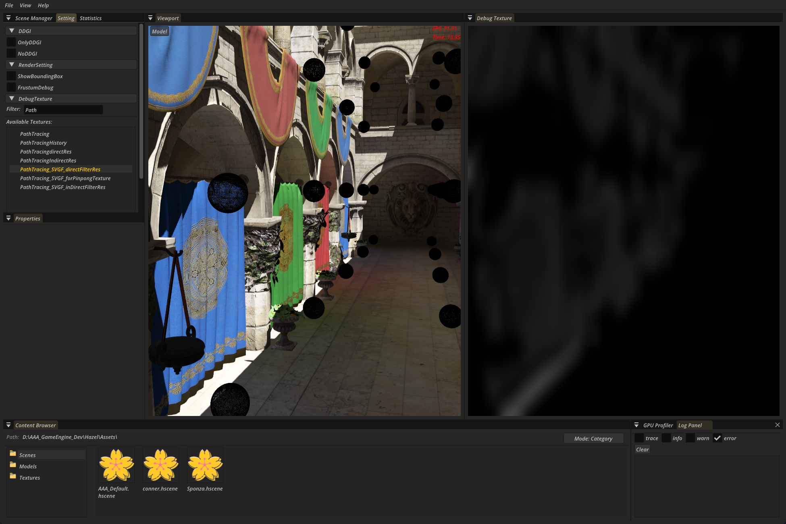

间接光会有闪烁的情况

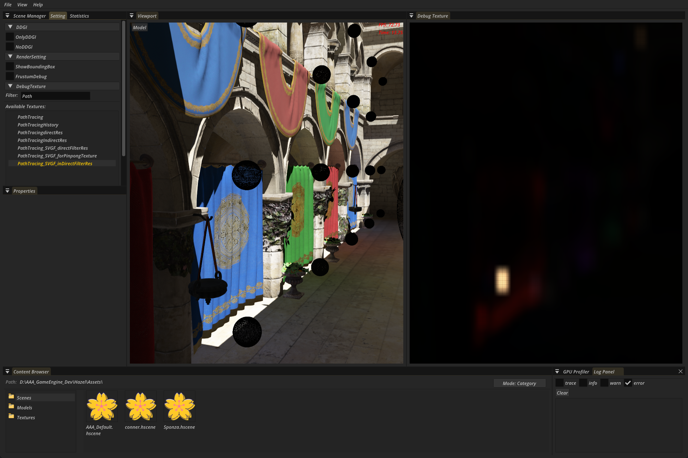

滤波公式，每次滤波时都是一个联合双边滤波

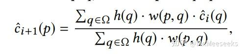

具体的联合双边滤波有三部分组成

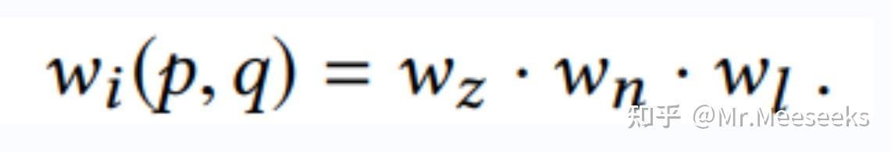

先加入法线贡献

```glsl
// 5x5 Atrous 核心 做了空洞滤波，相当于64*64的卷积核
uint curStep = 1 << curPassIndex;
for (int dy = -2; dy <= 2; ++dy) {
    for (int dx = -2; dx <= 2; ++dx) {
        ivec2 samplePos = invocID + ivec2(dx, dy) * int(curStep);

        // 边界检查
        samplePos = clamp(samplePos, ivec2(0), imgSize - 1);

        vec3 sampleColor = imageLoad(IN_COLOR, samplePos).xyz;
        // 高斯
        float gaussWeight = gaussKernel5x5[dx + 2 + (dy + 2) * 5];
        // 法线
        vec3 sampleNormal = imageLoad(NORMAL, samplePos).xyz;
        float normalWeight = pow(max(dot(normal, sampleNormal), 0.0), 128.0);

        float weight = gaussWeight*normalWeight;

        colorSum += sampleColor * weight;
        weightSum += weight;
    }
}
```


明显还是有问题的，因为小正方形上面和地面法线都朝上，所以贡献偏大了，阴影跑到了正方形上边

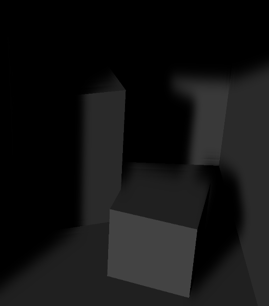

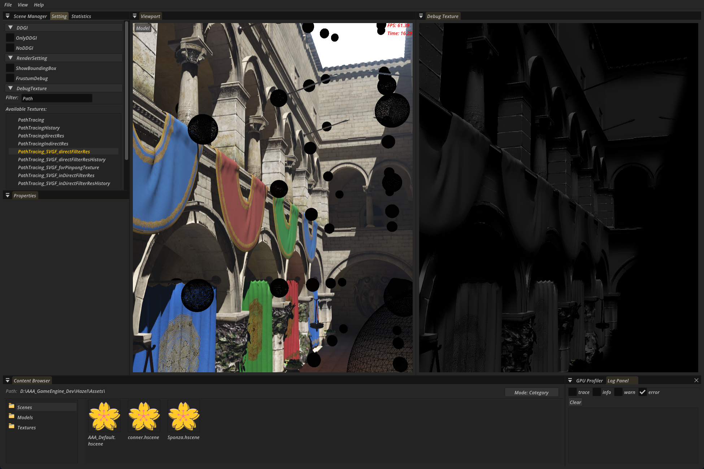

需要引入颜色差异来解决这个问题，毕竟阴影里的颜色和阴影外的最大区别就是颜色，很容易区分，另外还需要注意颜色差异是噪声造成的还是场景造成的（方差越大，越不应该作为权重评判的指标）

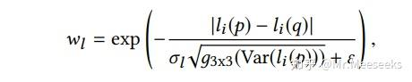

分子表示亮度差，差异越大权重越小，但差异过大也可能是噪声导致的，**所以差异大并不一定表示颜色边界**

所以引入方差来表示颜色的变化，方差越大，权重越大。就是越不考虑颜色差异的影响

这里的方差是指时间维度的方差，这样的话就得用MotionVector来找上一帧的位置，也就可以理解为如果一个像素位置颜色一直在变化，那它就很有可能只是噪声，就不应该用颜色差异来知道滤波，所以这一项权重就会变大

先根据一阶矩和二阶矩计算出方差

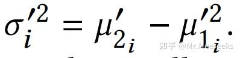

时间上的方差结果只用于第一次滤波，后续4次滤波用一个公式来更新方差值

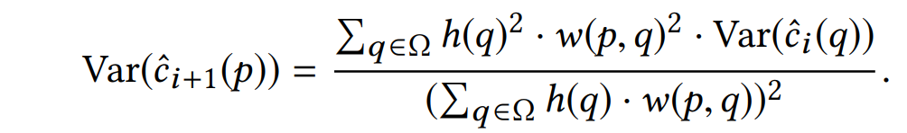
