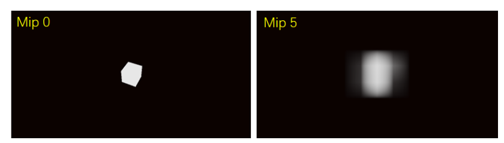
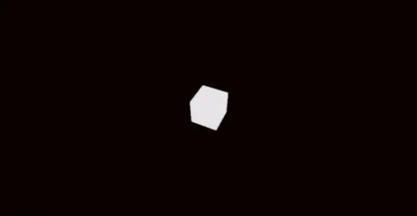
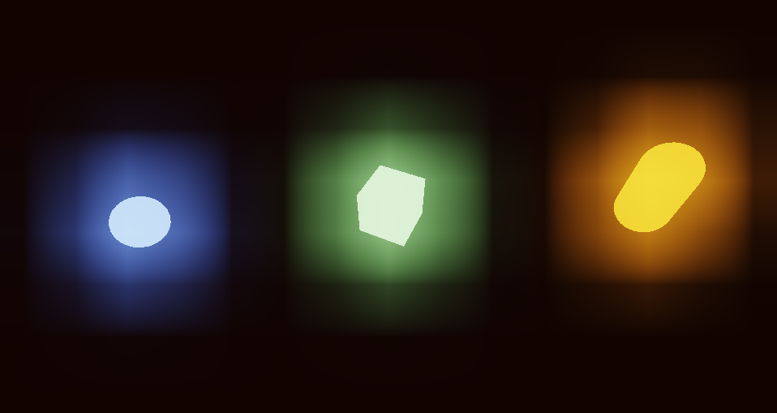
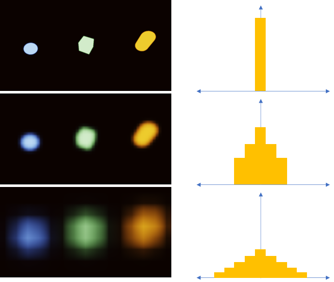
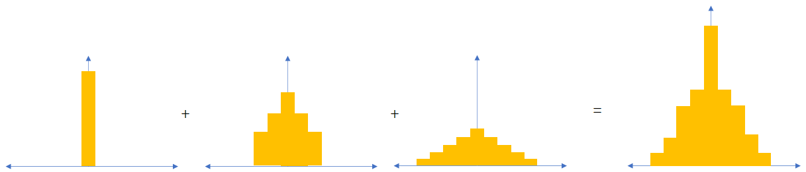
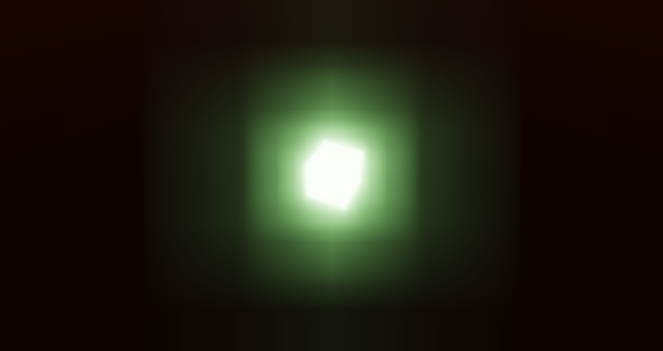
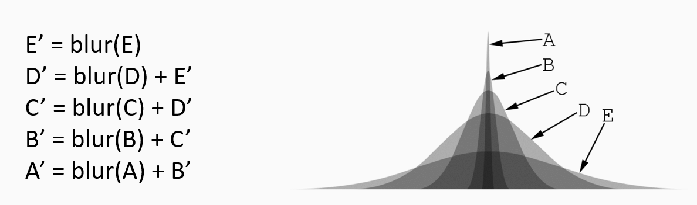
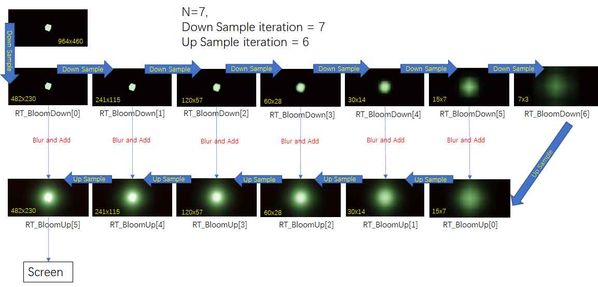

+++date = '2025-11-10T10:09:12+08:00'
draft = false
title = '游戏引擎开发实践（高质量Bloom）'
categories = ["Projects/游戏引擎"]
tags = ["PostProcess","渲染Pass"]
+++

# 下采样

## 为什么要下采样

- 要想光晕扩的足够大，第一件事情就是扩大模糊的范围。一种非常简单的思路就是死命加大滤波盒的尺寸，使用一个巨大的 kernal 对纹理进行模糊。但是性能上肯定是吃不消，单 pass 的纹理采样次数是 N^2 而双 pass 是 N+N

  此外还有一个问题，在处理高分辨率纹理时你需要等比地增加滤波盒的尺寸，才能形成同等大小的模糊。比如在 1000x1000 分辨率下用 250 像素的 kernal，模糊的结果占 1/4 屏幕，当分辨率增加到 2000x2000 的时候，要使用 500 像素的 kernal 才能达到同样的效果

  回到模糊的问题，模糊滤波的本质是查询 kernal 范围内的所有像素并加权平均，即范围查询问题。在计算机图形学中实现快速范围查询，通常会请到老朋友 [Mipmap](https://zhida.zhihu.com/search?content_id=204910516&content_type=Article&match_order=1&q=Mipmap&zhida_source=entity) 出场。Mipmap 将图像大小依次折半形成金字塔，mip[i] 中的单个像素代表了 mip[i-1] 中的 2x2 像素块均值，也代表 mip[i-2] 中的 4x4 像素块均值：

## 为什么不直接平均，而是用高斯模糊

为什么不直接用平均，而是用高斯模糊。 下图为直接使用mipmap，进行下采样

下图为高斯模糊，明显更加圆滑，直接MipMap还是方形的

所以进行下采样时，使用高斯模糊，而不是普通的平均。  这只是第一步

直接将最高层级 mip 叠加到图像上虽然能够产生足够大的光晕扩散，但是发光物的中心区域不够明亮。此外，发光物和泛光之间没有过度而是直接跳变

亮度跳变导致的

为了实现发光物和最高层 mip 之间的过渡，我们需要叠加所有的 mip 层级到原图上。因为 mip[i] 是基于 mip[i-1] 进行计算的，相邻层级之间相对连续则不会产生跳变

# 上采样

# 引擎实践

