+++date = '2025-12-16T13:30:40+08:00'
draft = false
title = '游戏引擎开发实践（GPU Driven）'
image = 'image-20251221171023893.png'
categories = ["Projects/游戏引擎"]
+++
> 上图展示了Mesh被另外一个摄像机剔除（剩下了AABB盒）、摄像机视锥被灯光影响的分簇结果
# 间接绘制

```c++
	void VulkanRHICommandContext::DrawIndirect(RHIBufferRef argumentBuffer, uint32_t offset, uint32_t drawCount)
	{
		/*
		*	绘制指令参数：
		   //indexed draw
			VKAPI_ATTR void VKAPI_CALL vkCmdDrawIndexedIndirect(
				VkCommandBuffer                             commandBuffer,
				VkBuffer                                    buffer, // 存储绘制参数的Buffer
				VkDeviceSize                                offset, // Buffer起始偏移 
				uint32_t                                    drawCount,  // 绘制的次数
				uint32_t                                    stride); // Buffer中每个绘制指令的大小

			//non indexed draw
			VKAPI_ATTR void VKAPI_CALL vkCmdDrawIndirect(  // 参数与vkCmdDrawIndirect一致
				VkCommandBuffer                             commandBuffer,
				VkBuffer                                    buffer,
				VkDeviceSize                                offset,
				uint32_t                                    drawCount,
				uint32_t                                    stride);

			绘制Buffer参数：这个Buffer中存储的参数实际就是直接调用vkCmdDrawIndexed、vkCmdDraw需要的参数
			//indexed
			struct VkDrawIndexedIndirectCommand {
				uint32_t    indexCount;		// 索引数量
				uint32_t    instanceCount;	// 实例数量
				uint32_t    firstIndex;		// 索引偏移
				int32_t     vertexOffset;	// 顶点偏移
				uint32_t    firstInstance;	// 实例偏移
			};

			//non indexed
			typedef struct VkDrawIndirectCommand {
				uint32_t    vertexCount;   // 顶点数量
				uint32_t    instanceCount; // 实例数量
				uint32_t    firstVertex;   // 顶点偏移
				uint32_t    firstInstance; // 实例偏移
			} VkDrawIndirectCommand;

		*/
		vkCmdDrawIndirect(handle, CAST<VulkanRHIBuffer>(argumentBuffer)->GetHandle(), offset, drawCount, sizeof(RHIIndirectCommand));
	}
```

在支持Multi Draw时，一次API可以提交多个IndirectCommand绘制指令，`drawCount`参数为执行指令的数量，这样在多个Mesh共享同一个VBO和IBO的情况下，可以做到画多种Mesh只需要一次API提交。

> 这样使用的前提是Draw的context是一致的，中间不能切换（如果使用bindless的话，需要弄清楚怎么把Id传递进去）
>
> 另外一点，这个属于新特性，老的设备不支持Multi Draw

图片来自：https://zhuanlan.zhihu.com/p/362994106

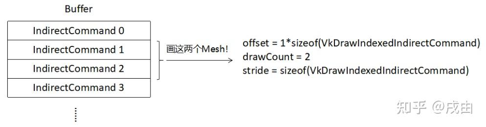

# Mesh剔除

> 基本思路就是使用ComputerShader提前剔除不需要渲染的DrawCall，**创建Buffer->准备好剔除前的数据->上传到GPU->用HiZ对这些instance剔除 ->写buffer->传给api去绘制**
>
> 这里的Hiz是用的上一帧的Hiz，毕竟还没处理好Mesh信息，这一帧还没有深度信息

> 是否支持实例化？
>
> 增加实例化后，每个RHIIndirectCommand的instanceCount将不再是1，也就是说一个DrawCallBuffer需要包含多个实例。 但剔除并不是连续操作，比如实例100、101、102、103合并到一个DrawCallBuffer后，如果101被剔除。剩下100、102。DrawCallBuffer很好改（实例数量-1，起始实例仍然是100），但是因为101被剔除，那顶点着色器就无法连续操作。必须添加额外信息Buffer来支持。让顶点着色器知道自己处理的是哪个实例！**总之，考虑到实例化会大大增加流程的复杂性。不考虑合并实例。**

// TODO:DrawIndirectCountKHR 可以间接填写Buffer的数量，这样的话，可以在剔除时把没有被剔除的Buffer紧密排布，并且更新BufferCount,这样的好处就是剔除后的DrawCall不会像老方法一样，生成一条空的DrawCall


最终架构：

1. CPU端：每个Pass收集自己需要的MeshBatch，将MeshBatch按照PSO进行分类。相同PSO的MeshBatch最终被放在同一个MeshDrawCommand，通过一次DrawCall全部上传，同时把所有对应的间接渲染指令组成一个Buffer，一并上传至GPU（并且携带InstanceCount和CullingType用于GPU执行不同的剔除流程）

```c++
enum CullingType :uint32_t {
	CULLING_TYPE_BASE,
	CULLING_TYPE_DIRECTIONLIGHT_SHADOW,
	CULLING_TYPE_POINTLIGHT_SHADOW,
	CULLING_TYPE_MAX_CNT
};

/*
	为了方便剔除时拿到详细信息，上传的Buffer不能只包含绘制指令,还需要记录实例数量,如果后续需要更多信息，可以扩展这个结构体
*/
struct MeshIndirectDrawData {
	 uint32_t instanceCount;
	 CullingType passType;
	 uint32_t _padding[2];

	 std::array<RHIIndirectCommand, MAX_PER_FRAME_INSTANCE_SIZE> indirectCommands;
};

/*
	最终定义一次DrawCall需要的信息
	1. 使用的PSO
	2. 间接绘制Buffer的Batch（PSO一致的绘制指令可以一次性全部上传）
*/
struct MeshDrawCommand
{
	RHIGraphicsPipelineRef pipeline;
	IndexRange meshCommandRange = { 0, 0 };
};

class MeshPassProcessor {
public:
	void Init(CullingType PassType);
	void Process(const std::vector<MeshBatch>& drawBatches);
	void Draw(RHICommandListRef command);
	void AddBatch(const MeshBatch& batch) { m_MeshBatches.push_back(batch); }
	void OnBuildDrawCommands(RHIGraphicsPipelineRef pipeline, std::vector<MeshBatch>& meshBatch);
	uint32_t GetDrawCommandCount() { return m_MeshBatches.size(); }
	RHIBufferRef GetMeshIndirectDrawDataBuffer() { return m_MeshIndirectDrawDataBuffer[APP_FRAMEINDEX]->GetRHIBuffer(); }

protected:
	virtual void MeshPassProcessor::AddMeshBatch(const MeshBatch& batch) = 0;
	virtual RHIGraphicsPipelineRef OnCreatePipeline(const DrawPipelineState& first) = 0;
private:
	void MapMeshBatches(MeshBatch& batch);
private:
	std::vector<MeshBatch> m_MeshBatches; // 收集当前Pass需要的batch
	CullingType m_PassType;
	std::array<std::shared_ptr<RenderBuffer<MeshIndirectDrawData>>, FRAMES_IN_FLIGHT> m_MeshIndirectDrawDataBuffer;
	std::map<DrawPipelineState, std::vector<MeshBatch>> m_MeshBatchMap;
	std::vector<MeshDrawCommand> m_MeshDrawCommands;  // 存储这个是为了Draw的时候遍历
	std::vector<RHIIndirectCommand> m_IndirectCommands; // 存储这个是为了把Commands一口气上传
};
using MeshPassProcessorRef = std::shared_ptr<MeshPassProcessor>;

```

2. 渲染时，通过MeshDrawCommand中提前记录的偏移，直接指定Buffer的offset和DrawCount(此时的Buffer已经被剔除了，被提出的渲染指令实例数量被设置为0)

```c++
	void MeshPassProcessor::Draw(RHICommandListRef command) {
		for (auto& drawCommand : m_MeshDrawCommands)
		{
			auto [w, h] = APP_WINDOWSIZE;

			command->SetGraphicsPipeline(drawCommand.pipeline);

			if (drawCommand.meshCommandRange.size > 0)
			{
				command->DrawIndirect(
					m_MeshIndirectDrawDataBuffer[APP_FRAMEINDEX]->GetRHIBuffer(),
					4 * sizeof(uint32_t) + drawCommand.meshCommandRange.begin * sizeof(RHIIndirectCommand),
					drawCommand.meshCommandRange.size);
			}
		}
	}
```


GPU端：通过 `gl_GlobalInvocationID.x`获取实例ID，通过`gl_GlobalInvocationID.y`获取剔除类型，将不可见的实例buffer的实例数量设置为0

```c++
#version 450 core
#include "../common/common.glsl"
#include "../common/constant.glsl"
#include "../common/intersection.glsl"
#ifdef COMPUTE_SHADER

const uint MESH_PASS_TYPE_BASE = 0u;
const uint MESH_PASS_TYPE_DIRECTIONLIGHT_SHADOW = 1u;
const uint MESH_PASS_TYPE_POINTLIGHT_SHADOW = 2u;


#define LOCAL_X 32   // instance
#define LOCAL_Y 1    // MeshPassType
#define LOCAL_Z 1
layout(set = 1,binding = 0) buffer drawbuffer{
    uint instanceCount;
    uint passType;
    uint _padding[2];
    RHIIndirectCommand buffers[MAX_PER_FRAME_INSTANCE_SIZE];
} ALL_CULLING_BUFFERS[4];
layout(local_size_x = LOCAL_X, local_size_y = LOCAL_Y, local_size_z = LOCAL_Z) in;
void main()
{ 
    uint threadInstanceId = gl_GlobalInvocationID.x;
    uint passTypeId = gl_GlobalInvocationID.y;
    if(threadInstanceId >= ALL_CULLING_BUFFERS[passTypeId].instanceCount){
        return;
    }
    uint instanceId = ALL_CULLING_BUFFERS[passTypeId].buffers[threadInstanceId].firstInstance;

    // 摄像机剔除
    if(ALL_CULLING_BUFFERS[passTypeId].passType == MESH_PASS_TYPE_BASE){

    }else if(ALL_CULLING_BUFFERS[passTypeId].passType == MESH_PASS_TYPE_DIRECTIONLIGHT_SHADOW){ // 定向光剔除
        ALL_CULLING_BUFFERS[passTypeId].buffers[threadInstanceId].instanceCount = 0u;

    }else if(ALL_CULLING_BUFFERS[passTypeId].passType == MESH_PASS_TYPE_POINTLIGHT_SHADOW){ // 点光剔除

    }
}

#endif
```

剩下的工作就是各种求交测试，判断可见性了

## 相交判断

> 摄像机的范围定义为视锥Frustum，一个平面定义为$ax + by + cz + d = 0$,每个平面可以用glm::vec4来表示，摄像机的视锥范围就可以用6个平面代替，根据平面方程的性质，(a,b,c)就是这个平面的法线

### 获取视锥平面

> 首先需要定义视锥，视锥体由六个面组成
>
> 使用union来方便给Shader进行统一架构，因为GPU剔除时并不需要知道当前判断的是哪个平面的相交，只需要一次遍历6个面即可

```c++
    struct Frustum
    {
        union
        {
            struct
            {
                glm::vec4 planeRight;
                glm::vec4 planeLeft;
                glm::vec4 planeTop;
                glm::vec4 planeBottom;
                glm::vec4 planeNear;
                glm::vec4 planeFar;
            };
            glm::vec4 planes[6];
        };
    };
```

下面工作就是如何计算当前摄像机的6个平面了

> 如何构造一个平面？
>
> 1. 法线量 + 一个点 定义一个平面
> 2. 三个点确定一个平面（其实通过三个点构造两个向量，对两个向量叉乘即可得到法向量，这样也就转化成了第一种情况）

1. 对于Far和Near两个平面，法向量: 摄像机的forward向量，点: 用camera.position + forward * (near或者far的距离)

2. 对与上下左右四个平面，摄像机的位置始终经过四个平面，点就确定了。法向量需要叉乘来实现，具体步骤就是先计算远平面的4个交点的坐标，与摄像机位置构成两个向量叉乘后得到法向量

求Far平面坐标用Fov来求

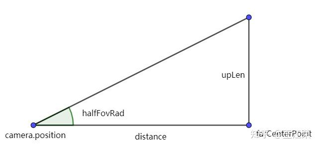

> 上面的方法从理论上很好理解，但是下面的方法是直接从viewPorj矩阵中计算出来6个平面的vec4
>
> 下面这种方案是在寻找对空间中点的约束，来构造平面方程。  约束条件就是 视锥平面上任何一点（世界坐标系下）进行VP变换后，要在NDC范围的边界上，从而构建一个等式求解的

首先VP矩阵的意义就是把世界坐标下的点$\vec{P}=(x,y,z,1)$转移到NDC空间，经过变换后的点表示为$\vec{P_{clip}}=(x_c, y_c, z_c, w_c)$

以右裁剪面为例。$(x_c = w_c)$是NDC最大支持的右边界（这个本质就是透视除法后，xc=1是最大边界）。


再来看VP矩阵 * 一个列向量（世界空间顶点位置），计算过程就是（注意这里的取值是按照列主序进行的）

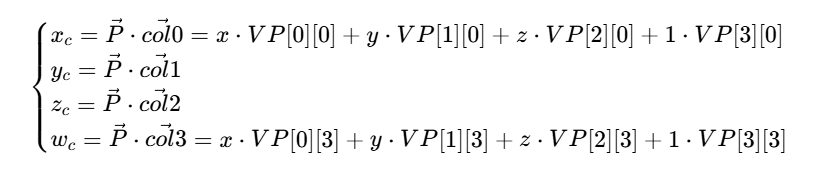

把计算过程带入$(x_c = w_c)$得到

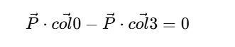

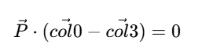

这也就是说世界空间点P与VP矩阵满足上边这个关系的点都在视锥的右面。把这个约束展开

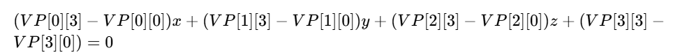

也就得到了平面方程（本质就是空间中的点满足这个约束的点集组成的平面，这种方法就是在寻找这种约束）

```c++
    Frustum CreateFrustumFromMatrix(const glm::mat4& VP)
    {
        Frustum frustum;
        // 右平面
        frustum.planeRight = glm::vec4(
            VP[0][3] - VP[0][0],
            VP[1][3] - VP[1][0],
            VP[2][3] - VP[2][0],
            VP[3][3] - VP[3][0]
        );

        // 左平面
        frustum.planeLeft = glm::vec4(
            VP[0][3] + VP[0][0],
            VP[1][3] + VP[1][0],
            VP[2][3] + VP[2][0],
            VP[3][3] + VP[3][0]
        );

        // 上平面
        frustum.planeTop = glm::vec4(
            VP[0][3] - VP[0][1],
            VP[1][3] - VP[1][1],
            VP[2][3] - VP[2][1],
            VP[3][3] - VP[3][1]
        );

        // 下平面
        frustum.planeBottom = glm::vec4(
            VP[0][3] + VP[0][1],
            VP[1][3] + VP[1][1],
            VP[2][3] + VP[2][1],
            VP[3][3] + VP[3][1]
        );

        // 远平面
        frustum.planeFar = glm::vec4(
            VP[0][3] - VP[0][2],
            VP[1][3] - VP[1][2],
            VP[2][3] - VP[2][2],
            VP[3][3] - VP[3][2]
        );

        // 近平面
        frustum.planeNear = glm::vec4(
            VP[0][3] + VP[0][2],
            VP[1][3] + VP[1][2],
            VP[2][3] + VP[2][2],
            VP[3][3] + VP[3][2]
        );

        // 归一化
        auto normalizePlane = [](glm::vec4& p)
            {
                float len = glm::length(glm::vec3(p));
                p /= len;
            };

        normalizePlane(frustum.planeRight);
        normalizePlane(frustum.planeLeft);
        normalizePlane(frustum.planeTop);
        normalizePlane(frustum.planeBottom);
        normalizePlane(frustum.planeNear);
        normalizePlane(frustum.planeFar);

        return frustum;
    }
```

上边第二个方案相比第一个方案计算量就少很多了


### 视锥与AABB相交

> 计算AABB的8个角点，是否都在视锥体外部
>
> 判断思路就是，如果8个角点都在面的同一侧，那么整个AABB盒都在面的一侧（与面没有相交）
>
> 判断如果AABB盒在6个面的同一侧，那他肯定就没有相交

首先注意，不能反过来求是否有角点在视锥体内部，来判断相交，原因如下图，D的角点都在外部，但是他在视锥体内部

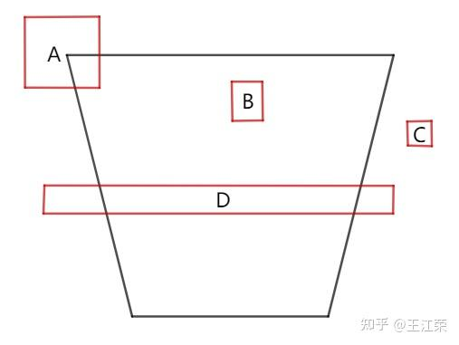

如何判断一个点在平面的哪一侧呢？

在下图场景中，OA与法线的cos即可判断，大于0不就是与法线在同一侧呗，或者直接把点带入平面方程，如果结果大于0，那他就在法向量的同侧

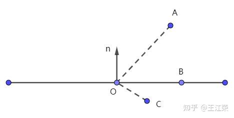

如果8个点在任意一个视锥面的外侧，那这个AABB盒就在视锥体外侧

> 同样，以上方法是逻辑上很清晰的代码，但是实践中为了效率，有更好的方法

#### SAT 分离轴定理

> 对于两个凸几何体 A 和 B，若存在一条直线（轴），使得 A 和 B 在这条轴上的投影互不重叠，则称这条轴为「分离轴」，此时 A 和 B 不相交；若不存在这样的分离轴，则 A 和 B 相交（或包含）。也就是说只要找到一条轴能分离，那两个物体肯定不相交

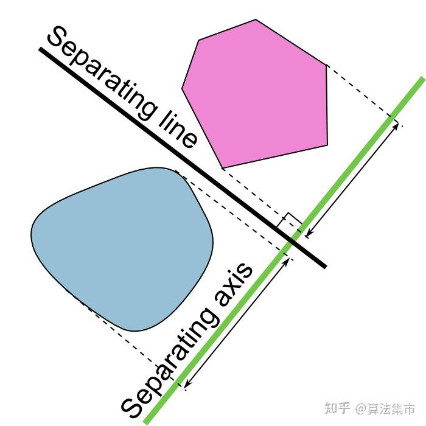

对于很规则的形状，只需要依次在每条边的垂直线做投影即可

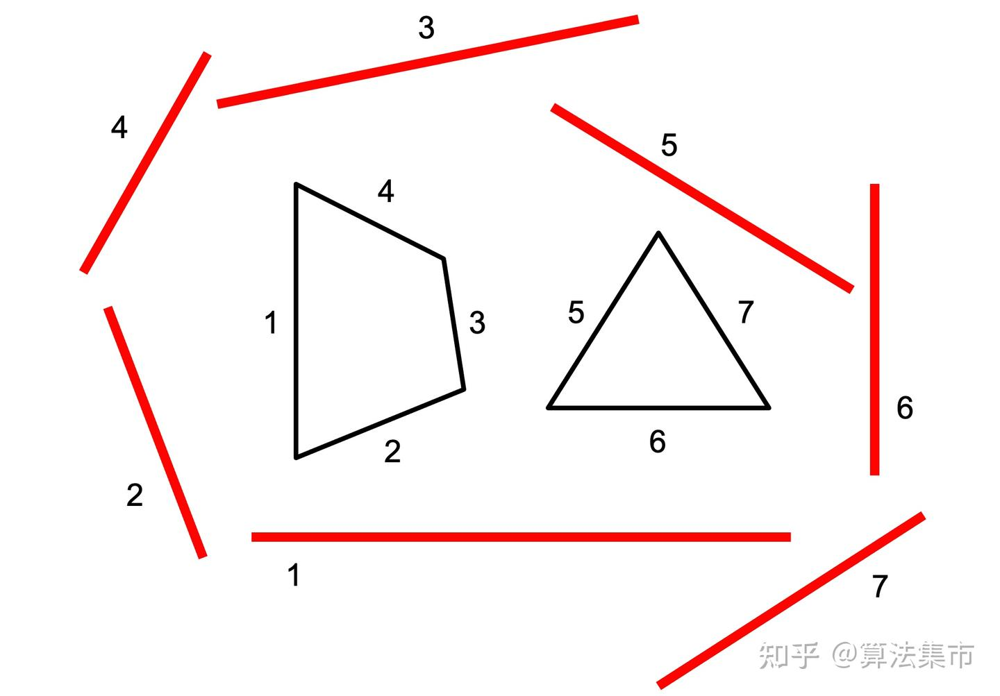

注意不适用于凹多面体

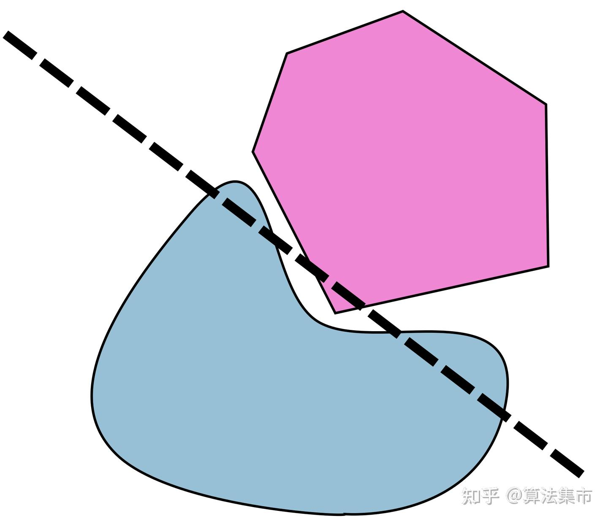

在当前场景下，视锥的分离轴就只有6个（6个平面的法向量）

所有AABB盒与平面的相交判断，集中在平面的法向量这条分离轴上。十分精炼的代码还是需要一步步理解

首先平面在分离轴上如何定义？

因为分离轴是平面的法线，所以在分离轴上来看，平面是一个点。

那如何表达平面在分离轴的位置呢？（也就是说得先定义一个分离轴的原点）  **把原点作为分离轴的原点**   （在写这个的时候忽略了一个点，法线肯定是过原点来定义的，所以分离轴肯定是过原点的，另外分离轴的空间位置是没有意义的，因为投影后结果都是一样的，所以放在原点也比较合理）

这时平面在分离轴的坐标就是(-d) (拿一个简单的平面画图推一下就能看出来)

到这里 分离轴代表的1D坐标系已经有了。

下一步理解AABB如何投影到这个坐标系上

AABB的每个点都可以定义为从000到点位置的向量，然后把他投影到了分离轴上，下一步就是求AABB在分离轴上的范围

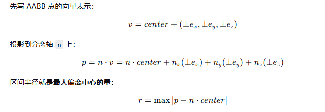

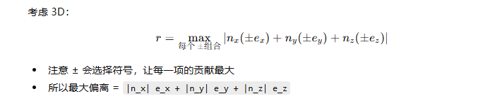

到这里就理解了最大偏移，也理解了项目代码中那个蜜汁操作的含义

```c++
/*
	当前Frustum的6个平面的法向量都指向内部

	这里的相交判断利用的是SAT（分离轴定理），平面的法向量方向作为分离轴，这时，整个平面在分离轴上就只是一个点，
	
*/
bool FrustumIntersectBox(Frustum frustum, BoundingBox box)
{
    vec3 center = (box.maxBound + box.minBound) * 0.5;
    vec3 extent = (box.maxBound - box.minBound) * 0.5;

    for (int i = 0; i < 6; i++)
    {
        vec4 plane = frustum.planes[i];

		// 这段蜜汁代码需要结合记录的博客来看，真的不理解清除，这代码写的简直是顶级防御性编程
        vec3 absN = abs(plane.xyz);
        float radius = dot(absN, extent); // AABB中心到AABB的所有投影位置的最大距离
        float distance = dot(plane.xyz, center) + plane.w;  // -plane.w是平面的投影
        if (distance < -radius)
            return false;
    }

    return true;
}
```

## 点光源剔除

> 点光源的范围是一个球，只需要做一个球和AABB的相交判断

```c++
bool SphereIntersectBox(BoundingSphere sphere, BoundingBox box)
{
    vec3 closestPoint = clamp(
        sphere.center,
        box.minBound,
        box.maxBound
    );
    vec3 delta = closestPoint - sphere.center;
    float distSq = dot(delta, delta);
    return distSq <= sphere.radius * sphere.radius;
}
```

```c++
#version 450 core
#include "../common/common.glsl"
#include "../common/constant.glsl"
#include "../common/intersection.glsl"
#ifdef COMPUTE_SHADER

const uint MESH_PASS_TYPE_BASE = 0u;
const uint MESH_PASS_TYPE_DIRECTIONLIGHT_SHADOW = 1u;
const uint MESH_PASS_TYPE_POINTLIGHT_SHADOW = 2u;

#include "../common/gizmo.glsl"

#define LOCAL_X 32   // instance
#define LOCAL_Y 1    // MeshPassType
#define LOCAL_Z 1
layout(set = 1, binding = 0) buffer drawbuffer{
    uint instanceCount;
    uint passType;
    uint _padding[2];
    RHIIndirectCommand buffers[MAX_PER_FRAME_INSTANCE_SIZE];
} ALL_CULLING_BUFFERS[4];
layout(local_size_x = LOCAL_X, local_size_y = LOCAL_Y, local_size_z = LOCAL_Z) in;
void main()
{ 
    uint threadInstanceId = gl_GlobalInvocationID.x;
    uint passTypeId = gl_GlobalInvocationID.y;
    if(threadInstanceId >= ALL_CULLING_BUFFERS[passTypeId].instanceCount){
        return;
    }
    uint instanceId = ALL_CULLING_BUFFERS[passTypeId].buffers[threadInstanceId].firstInstance;
    mat4 modelMatrix = GetModelMatrix(instanceId);
    BoundingBox aabb = GetOriginBoundingBox(instanceId);    
    aabb = BoundingBoxTransform(aabb,modelMatrix);

    // 摄像机剔除  TODO：用前一帧的HIZ进行遮挡剔除？
    if(ALL_CULLING_BUFFERS[passTypeId].passType == MESH_PASS_TYPE_BASE){

        Camera camera = GetCamera();

        if(GetRenderSetting().renderBoundingBox == 1){
            AddGizmoBoundingBox(aabb, vec4(1,0,0,1));
        }

        bool isVisiable = FrustumIntersectBox(camera.frustum, aabb);

        if(!isVisiable){
            ALL_CULLING_BUFFERS[passTypeId].buffers[threadInstanceId].instanceCount = 0u;
        }

    }else if(ALL_CULLING_BUFFERS[passTypeId].passType == MESH_PASS_TYPE_DIRECTIONLIGHT_SHADOW){ 
        DirectionLight light = GetDirectionLight();
        
        bool isVisiable = FrustumIntersectBox(light.frustum[0], aabb);   // TODO: 现在只考虑一个级联的剔除（导致现在只有CSM=0距离内有阴影），也就是后三个级联的剔除用的第一个视锥，这是错的！！！解决需要想办法把当前是处理第几个级联的信息传递进来~现在架构不够灵活，还不太好传递呢~
        if(!isVisiable){
            ALL_CULLING_BUFFERS[passTypeId].buffers[threadInstanceId].instanceCount = 0u;
        }


    }else if(ALL_CULLING_BUFFERS[passTypeId].passType == MESH_PASS_TYPE_POINTLIGHT_SHADOW){ // 点光剔除

        BoundingSphere sphere = GetPointLight(0).sphere;

        bool isVisiable = SphereIntersectBox(sphere, aabb);
        if(!isVisiable){
            ALL_CULLING_BUFFERS[passTypeId].buffers[threadInstanceId].instanceCount = 0u;
        }

    }
}


#endif
```

> 目前的剔除完成了最简单的版本，每个Pass都会进行自己需要的Mesh的剔除，在间接渲染时拿着被修改的IndirectDrawBuffer去渲染


# Cluster Based Lighting

> 把摄像机视锥分簇，每个簇记录会影响它的光源信息，计算光照时，先判断着色点属于哪个簇，只遍历影响它的光源

## 数据结构

目前灯光存储依靠两个结构

```c++
// 获取灯光信息的地方
struct LightInfo
{
	uint32_t directionLightCount = 0;
	uint32_t pointLightCount = 0;
	uint32_t spotLightCount = 0;
	uint32_t _padding0;

	DirectionLight dirLights;
	PointLight pointLights[MAX_POINT_LIGHT_SIZE];
	SpotLight spotLights[MAX_SPOT_LIGHT_SIZE];
};

// 所有的光源信息统一存储在
layout(set = 0, binding = GLORBAL_RESOURCE_BINDING_LIGHTINFO) readonly buffer LightInfoBuffer {
    LightInfo data;
} LIGHTINFO;
LightInfo GetLightInfo()
{
    return LIGHTINFO.data;
}
DirectionLight GetDirectionLight()
{
    return LIGHTINFO.data.dirLights;
}
PointLight GetPointLight(uint index)
{
    return LIGHTINFO.data.pointLights[index];
}
SpotLight GetSpotLight(uint index)
{
    return LIGHTINFO.data.spotLights[index];
}
uint GetPointLightCount()
{
    return LIGHTINFO.data.pointLightCount;
}
uint GetSpotLightCount()
{
    return LIGHTINFO.data.spotLightCount;
}
```

参考下图进行架构簇，每个簇存储起始位置和数量，所有簇的灯光id信息统一存储在lightAssignBuffer中，在簇Buffer中只存储起始索引和数量

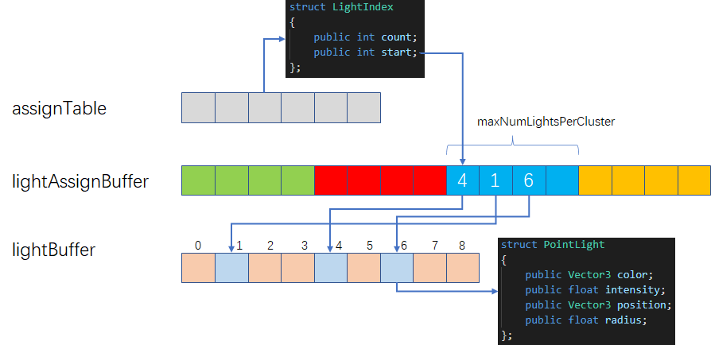

## 簇的划分

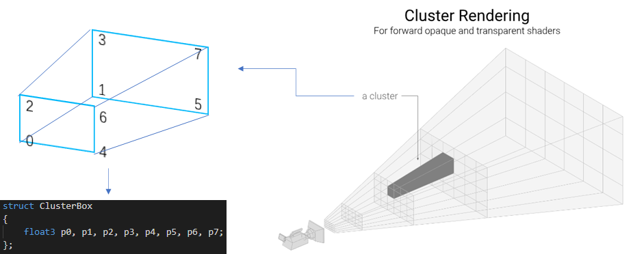

先存Forward方向进行深度划分，可以采样平均切分或者对数切分

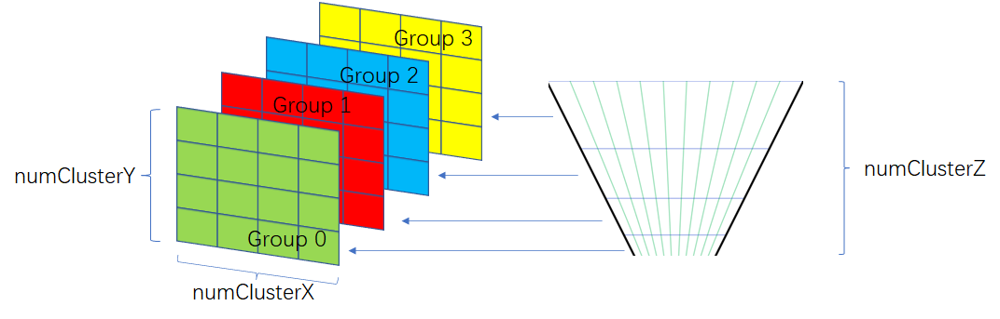

在写Shader时疏忽了一个很早之前的知识点，线性深度和非线性深度。

在当前场景下，如果在near-far之间定义深度，是线性深度，但是如果想通过逆变换把屏幕空间坐标转回世界坐标，必须提供非线性深度，但是直接把自己自定义的深度转为非线性后配合当前UV来计算是错的，因为深度与XY的计算是有联系的，自定义深度破坏了这种联系

```c++
float minZ 	= (far - near) / LIGHT_CLUSTER_DEPTH * float(globalID.z) + near;
float maxZ 	= (far - near) / LIGHT_CLUSTER_DEPTH * float(globalID.z + 1) + near;
```

所以采用射线来定义方向，再用深度来计算最终的世界位置深度

```c++
/*
	传入自定义深度（线性深度[near-far]）
*/
vec3 SceenToWorldCustomDepth(vec2 uv, float viewZ, Camera camera)
{
    vec2 ndcXY = uv * 2.0 - 1.0;
    vec4 ndcPos = vec4(ndcXY, 0.0, 1.0);
    vec4 viewPos = camera.invProj * ndcPos;
    viewPos /= viewPos.w;
    vec3 viewDir = normalize(viewPos.xyz);
    float t = viewZ / (-viewDir.z);
    vec3 finalViewPos = viewDir * t;
    vec4 worldPos = camera.invView * vec4(finalViewPos, 1.0);
    return worldPos.xyz;
}
```

> 哎这种写起来太麻烦，重新看了一眼博客，它的做法是直接拿near和Far进行映射，然后再切分，也就是转为世界坐标的点都在Near和Far上，然后调整按比例调整

最终版本，还捎带实现了多摄像机系统，为了方便调试

```c++
#version 450 core
#include "../common/common.glsl"
#include "../common/constant.glsl"
#include "../common/intersection.glsl"
#include "../common/math.glsl"
#include "../common/gizmo.glsl"
#ifdef COMPUTE_SHADER

layout(set = 1, binding = 0, rg32ui) uniform  uimage2DArray u_Clusters;   // FORMAT_R32G32_UINT
layout(set = 1, binding = 1) buffer lightIDs{

    uint lightID[];

}u_lightIDs;

#define THREAD_SIZE_X 8
#define THREAD_SIZE_Y 8
#define THREAD_SIZE_Z 1
layout (local_size_x = THREAD_SIZE_X, 
		local_size_y = THREAD_SIZE_Y, 
		local_size_z = THREAD_SIZE_Z) in;

void main()
{
    uvec3 globalID = gl_GlobalInvocationID;
    Camera camera;
    if(GetRenderSetting().ClusterLightFrustum == 1){ 
        camera = GetDefaultCamera();
    }else{
        camera = GetCamera();
    }
    camera.InverseViewProj = inverse(camera.projNoJetter * camera.view);  // 后续都用的projNoJetter
    float w = camera.width;
    float h = camera.height;
	uint clusterX = uint((w + LIGHT_CLUSTER_GRID_SIZE - 1) / LIGHT_CLUSTER_GRID_SIZE);
    uint clusterY = uint((h + LIGHT_CLUSTER_GRID_SIZE - 1) / LIGHT_CLUSTER_GRID_SIZE);
    uint clusterZ = LIGHT_CLUSTER_DEPTH;
    uint clusterCount = clusterX * clusterY * clusterZ;


    if (globalID.x >= clusterX || globalID.y >= clusterY || globalID.z >= clusterZ) {
        return;
    }

    //////////////////////////////////////// 计算每个簇的世界坐标（先计算NDC坐标下8个顶点位置，转到世界空间即可） ///////////////////////////////////////////
    float ndcMinx = float(globalID.x) / float(clusterX);
    float ndcMiny = float(globalID.y) / float(clusterY);
    float ndcMaxx = (float(globalID.x) + 1) / float(clusterX);
    float ndcMaxy = (float(globalID.y) + 1) / float(clusterY);

    // 线性划分
    float minZ = float(globalID.z) / float(clusterZ);
    float maxZ = float((globalID.z + 1)) / float(clusterZ);

    // 一长条的簇
    vec3 p0 = SceenToWorld(vec2(ndcMinx, ndcMiny), 0, camera);
    vec3 p1 = SceenToWorld(vec2(ndcMinx, ndcMiny), 1, camera);
    vec3 p2 = SceenToWorld(vec2(ndcMinx, ndcMaxy), 0, camera);
    vec3 p3 = SceenToWorld(vec2(ndcMinx, ndcMaxy), 1, camera);
    vec3 p4 = SceenToWorld(vec2(ndcMaxx, ndcMiny), 0, camera);
    vec3 p5 = SceenToWorld(vec2(ndcMaxx, ndcMiny), 1, camera);
    vec3 p6 = SceenToWorld(vec2(ndcMaxx, ndcMaxy), 0, camera);
    vec3 p7 = SceenToWorld(vec2(ndcMaxx, ndcMaxy), 1, camera);


    // 在World下切分深度
    vec3 clusterP0 = p0 + minZ * (p1-p0);
    vec3 clusterP1 = p0 + maxZ * (p1-p0);
    vec3 clusterP2 = p2 + minZ * (p3-p2);
    vec3 clusterP3 = p2 + maxZ * (p3-p2);
    vec3 clusterP4 = p4 + minZ * (p5-p4);
    vec3 clusterP5 = p4 + maxZ * (p5-p4);
    vec3 clusterP6 = p6 + minZ * (p7-p6);
    vec3 clusterP7 = p6 + maxZ * (p7-p6);


    vec3 clusterCenter = (clusterP0 + clusterP1 + clusterP2 + clusterP3 + clusterP4 + clusterP5 + clusterP6 + clusterP7) / 8;

    // 构建视锥
    Frustum frustum;
    frustum.planes[0] = calculatePlane(clusterP0, clusterP2,clusterP4, clusterCenter); // 近平面
    frustum.planes[1] = calculatePlane(clusterP5, clusterP7, clusterP1, clusterCenter); // 远平面
    frustum.planes[2] = calculatePlane(clusterP0, clusterP1, clusterP2, clusterCenter); // 左平面
    frustum.planes[3] = calculatePlane(clusterP4, clusterP6,clusterP5, clusterCenter); // 右平面
    frustum.planes[4] = calculatePlane(clusterP0, clusterP4, clusterP5, clusterCenter); // 下平面
    frustum.planes[5] = calculatePlane(clusterP2, clusterP3, clusterP6, clusterCenter); // 上平面

    //////////////////////////////////////// 相加测试与记录数据 ///////////////////////////////////////////
	uint lightIDs[MAX_LIGHTS_PER_CLUSTER];
    uint lightCount = 0;
    for(int i = 0; i < GetPointLightCount(); i++){
	    BoundingSphere sphere = GetPointLight(i).sphere;
        bool isVisiable = FrustumIntersectSphere(frustum, sphere);
        if(isVisiable){
            lightIDs[lightCount++] = i;
            if(GetRenderSetting().ClusterLightFrustum == 1){ // debug受影响的视锥
                DrawFrustumEdges(clusterP0, clusterP2,clusterP6, clusterP4, clusterP1, clusterP3,  clusterP7, clusterP5, vec4(1, 0, 0, 1.0));
            }
        }
	}

    // 记录数据
    uint startOffset = atomicAdd(LIGHTINFO.data.clusterAtomicOffset,lightCount);   // 它返回的是操作前的数据
    for(uint i = 0; i < lightCount; i++){
        u_lightIDs.lightID[startOffset + i] = lightIDs[i];
    }
    imageStore(u_Clusters, ivec3(globalID), uvec4(uvec2(lightCount, startOffset), 0, 0));

}
#endif
```

```c++
ivec3 GetClusterIndex(vec3 worldPos,Camera camera)
{
    vec3 viewPos = (camera.view * vec4(worldPos, 1.0)).xyz;

    float zView = -viewPos.z;

    if (zView <= camera.Near)
        zView = camera.Near;
    if (zView >= camera.Far)
        zView = camera.Far;


    vec4 clipPos = camera.proj * vec4(viewPos, 1.0);
    vec3 ndcPos  = clipPos.xyz / clipPos.w;   // [-1, 1]

    vec2 screenUV = ndcPos.xy * 0.5 + 0.5;     // [0, 1]
    vec2 pixelPos = screenUV * vec2(camera.width, camera.height);

    uint clusterX = uint((camera.width  + LIGHT_CLUSTER_GRID_SIZE - 1)
                          / LIGHT_CLUSTER_GRID_SIZE);
    uint clusterY = uint((camera.height + LIGHT_CLUSTER_GRID_SIZE - 1)
                          / LIGHT_CLUSTER_GRID_SIZE);
    uint clusterZ = LIGHT_CLUSTER_DEPTH;

    uint x = uint(pixelPos.x / LIGHT_CLUSTER_GRID_SIZE);
    uint y = uint(pixelPos.y / LIGHT_CLUSTER_GRID_SIZE);

    x = clamp(x, 0u, clusterX - 1);
    y = clamp(y, 0u, clusterY - 1);

    float zNorm = (zView - camera.Near) / (camera.Far - camera.Near);
    uint  z     = uint(zNorm * float(clusterZ));

    z = clamp(z, 0u, clusterZ - 1);

    return ivec3(x, y, z);
}
```

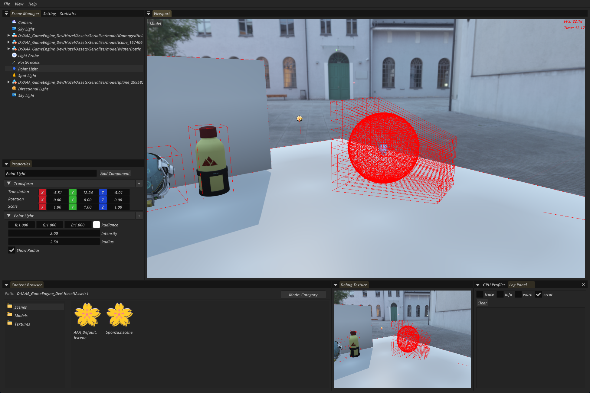

这张图展示了Mesh剔除和灯光分簇

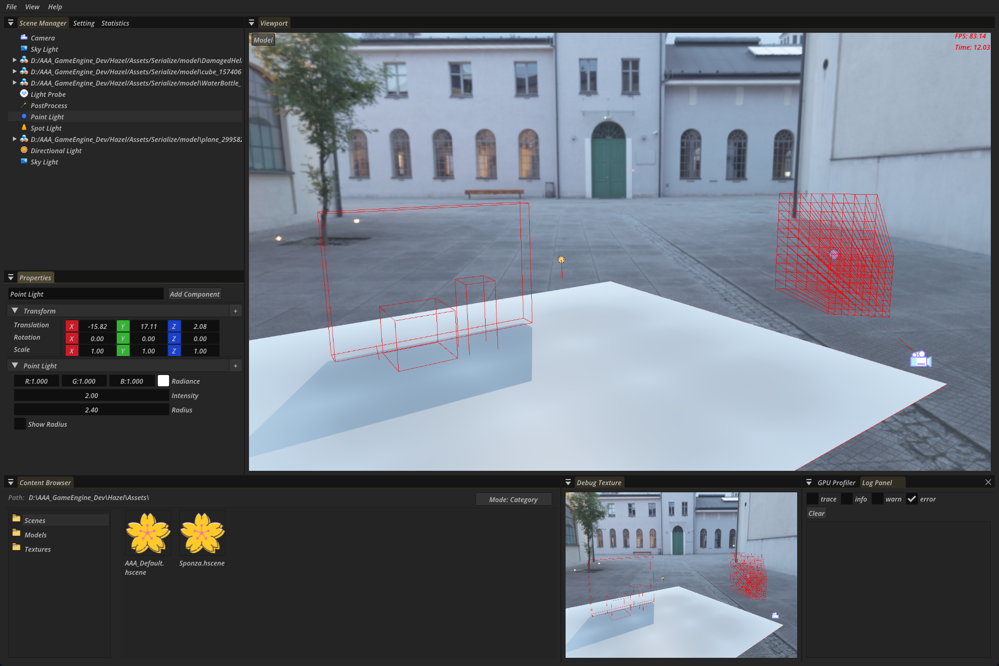
