+++
date = '2026-01-26T16:37:02+08:00'
draft = true
title = '面试突击'

+++

1. 面试官不知道我的灯光是ID的
2. MeshProcessor逻辑理清楚
3. Bindless的好处（减少资源描述符集、合批），Bindless理清楚
4. RHI（知不知道别的D3D，怎么互通）
5. const使用
6. RDG资源复用，具体用什么进行Hash的

7. CPP：vector迭代器失效（pushback）
8. #include头文件的循环引用问题（忘了指针）
9. pipelinebatti juti

# tx

1. 编写一个HelloWorld程序，从编写到显示经历了什么
2. 静态链接、动态连接
3. 内存分区
4. 堆快还是栈快
5. 进程的内存空间
6. 申请内存的运算符
7. 析构函数抛异常？  // TODO  抛异常的流程是栈展开，如果某个函数抛异常，并且没有Catch，就会沿着调用链一直往回找catch，并且会销毁调用栈上的局部遍历，此时就会进行析构，如果在析构中又抛异常，就属于同时存在两个异常了！ C++最多只能同时处理一个异常，因此程序这时会自动调用std::terminate()函数
8. This指针
9. 进程和线程（流水线不是进程把。。。。）
10. 左值、右值
11. 渲染流程
12. 剔除
13. Mip 怎么做
14. shadowMap

# 不鸣

1. MeshProcessor的目的：解耦上层MeshBatch和底层RHICommand， MeshBath不需要直知道它会被哪个Pass谁处理。FMeshDrawCommand，RHICommandList 收集到的DrawCall也不需要去知道它怎么来的


1. 六面体阴影怎么做的

六个view分别代表6个摄像机朝向，Mesh进入后的顶点在几何着色器中发射6个顶点，也就是每个顶点分别发射为6个摄像机朝向下的顶点，

2. VSM

方差= 平方的期望-期望的平方

每个像素存储他在摄像机视角下的深度和深度的平方，然后开一个ComputerPass，计算一片区域的均值，这就计算了平方的期望和期望

在计算阴影时，根据模糊结果计算 平方的期望-期望的平方得到方差，带入切比雪夫不等式

理解起来就是我在shadowMap中存储的不是具体的数据，而是周围一片区域的数据分布

当我得到实际的着色点深度后，可以通过切比雪夫不等式来估计shadowmap的一片区域内有多少区域深度比我的实际着色点更深

x代表这个分布，t代表实际采样点，这个概率表示一片区域内深度比t深度更大的占多大比例不会超过这个概率

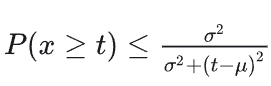

但是它估计的这个概率的上界，实际上概率可能更小

3. Cluster Based Light Culling

把视锥分簇，在一个computeShader中对每个簇计算每个灯光是否能影响到它，存储成一个Arr

具体做法：在屏幕空间下指定每个Tile的XY范围，然后把一长条Tile转到世界空间的8个顶点，然后根据深度比例得到簇的8个顶点

通过8个顶点构建6个平面，拿灯光的球形包围盒与6个平面进行相交测试

球和平面的相交直接计算圆心到平面的距离是否小于半径

每个簇收集<=8个灯光的id然后把8条数据添加在一个structBuffer中，并用一张贴图记录每个每个簇在这个巨大的structbuffer中的偏移

渲染时先计算当前着色点在哪个簇，然后去贴图找偏移量，然后根据偏移量到structBuffer中拿对应的8个lightID

如何计算世界位置对应的簇id呢？  1. 世界转屏幕后就能找到对应的xy，根据zView下的深度 计算z，然后去2DArray对应位置拿数据


4. 间接渲染怎么做的

1. 每个Pass一个PassProcessor，自己去定义自己需要哪些MeshBatch（也不一定只有一个，比如CSM，就需要4个）在渲染之前，就会预先并行地对每个MeshPass进行命令构建。

具体Process的流程：1. 收集自己需要的MeshBatch 2. 根据每个MeshBatch的材质信息进行分类，并创建缓存的Pipeline，用一个Map来分类不同的Pipeline的mesh，到这里得到了每个PSO下的Mesh合集 3. 构建DrawCommands（也就是一条一条的DrawCall）并封装为间接绘制需要的Buffer 4. 调用时绑定好对应的PSO后，直接通过间接渲染指令一口气上传所有相关的DrawCall （应该是只支持高版本，因为Draw的时候可以渲染DrawCount，表示Buffer里存了几个DrawCall）

5. MeshCulling

在渲染之前对封装好的DrawCullBuffer进行剔除，对每个Pass，每个Mesh都进行一次视锥剔除、距离剔除、遮挡剔除，如果被遮挡，就设置Instance数量为0

6. 大气渲染怎么做的？

当看向天空时，太阳光会在视线上发生散射，然后传递到人眼，即透射散射透射


另外视线上任何位置都可以收到天阳的透射

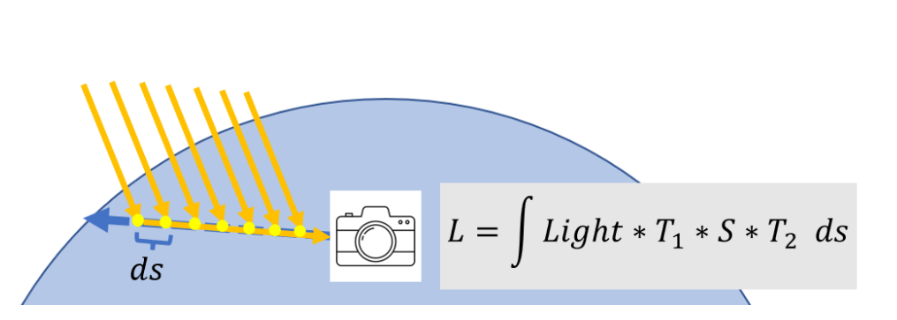

散射系数（表示S位置逃逸到其他方向上的占比，比如这里S = 0.3）

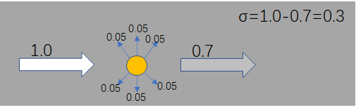

对于逃逸到各个方向上的比例，通过相函数来决定在特定方向的比例  也就是 0.3为总量下，逃逸到特定方向上的占比为多少  这里就是0.2

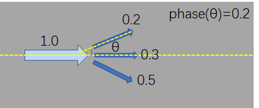

所以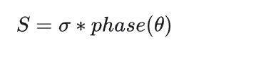

只需要建模出 散射系数和向函数两个 参数就可以计算S

瑞丽散射和米时散射都有自己各自的散射系数和向函数

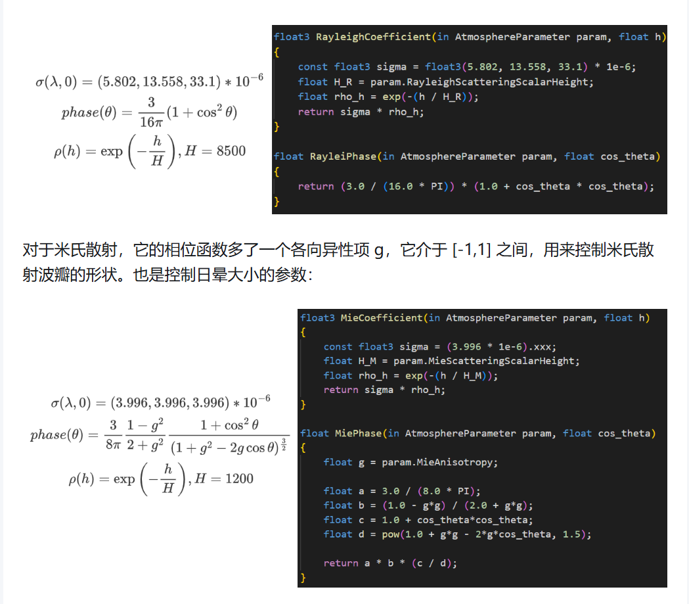

上述就解决了S如何计算的问题

剩下就是透射的衰减，光线在大气中前进就会不断的衰减

最后的积分计算使用的是黎曼积分   每一小段终点的渲染结果乘以高度

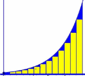

大气散射中的预计算透射率可以提前算好从 不同的高度和不同的天顶角，到达大气层外侧的透射率


viewlut 就是每一帧根据摄像机的高度，计算任何方向上的大气渲染结果


7. Shader优化

比如构建正交坐标系时，我只有一个向量，就是法线向量，  比如先用010来叉乘，结果为T，但是T可以是接近0的所以用step来让他 step(a,b)  b>a就是1，否则就是0，这样就避免的if判断，同时  用mix来选择 两条分支的渲染计算


8. PBR捋一遍

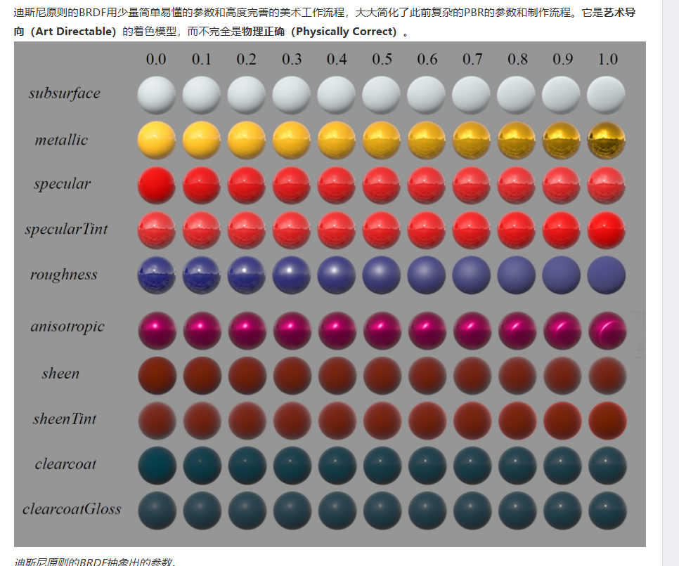

粗糙度越高 高光和反射越不明显，

**粗糙度（Roughness）**：表示材质表面的粗糙程度，值限定在0~1之间。越粗糙材质高光反射越不明显，金属和非金属的粗糙度有所区别。
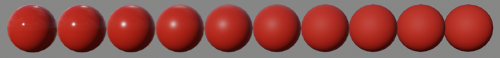
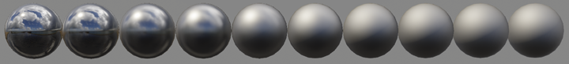

反射和折射。 碰到表面反射就是镜面反射，折射进入内部后又出来就是漫反射，如果在别的地方出来就是次表面散射


金属材质会立刻吸收折射，所以表现为反射材质

根据上面的能量守恒关系，可以先计算镜面反射部分，此部分等于入射光线被反射的能量所占的百分比。而折射部分可以由镜面反射部分计算得出。

```glsl
float kS = calculateSpecularComponent(...); // 反射/镜面部分
float kD = 1.0 - kS;                        // 折射/漫反射部分
```

BSDF在渲染方程中的意义就是依据着色点的材质对着色结果进行加权

Cook-Torrance镜面反射BRDF由3个函数（D，F，G）和一个标准化因子构成。D，F，G符号各自近似模拟了特定部分的表面反射属性：

- **D(Normal \*D\*istribution Function，NDF)**：法线分布函数，估算在受到表面粗糙度的影响下，取向方向与中间向量一致的微平面的数量。这是用来估算微平面的主要函数。
- **F(\*F\*resnel equation)**：菲涅尔方程，描述的是在不同的表面角下表面反射的光线所占的比率。
- **G(\*G\*eometry function)**：几何函数，描述了微平面自成阴影的属性。当一个平面相对比较粗糙的时候，平面表面上的微平面有可能挡住其他的微平面从而减少表面所反射的光线。


法线分布函数表达的含义是微平面中 法线与半程向量方向一致的概率，概率越大，反射光强度越大，所以粗糙度越大，反射光越弱

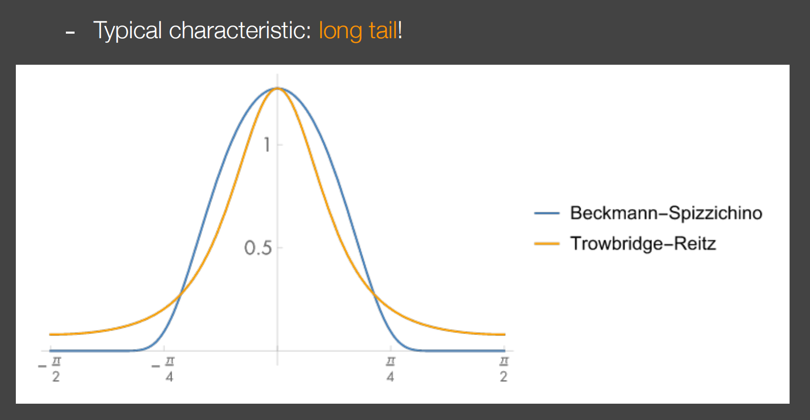D项主要由粗糙度控制

F项是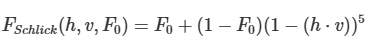

F0表示的是表面基础反射率，这个我们可以使用一种叫做**Indices of refraction(IOR)**的方法计算得到。运用在球面上的效果就是你看到的那样，观察方向越是接近**掠射角**（grazing angle，又叫切线角，与正视角相差90度），菲涅尔现象导致的反射就越强：
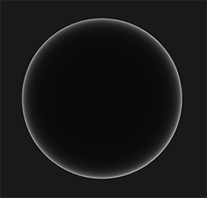

F0代表平行与法线方向观察下的反射率，如上图就是全黑的中心，掠射角（90°）时，反射率趋近 1，也就是上图的边缘

F0是需要自己指定的，不同材质的F0不同

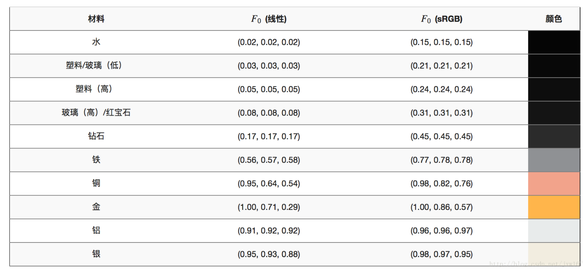

为了统一，可以用金属度来进行调和F0

```c++
vec3 F0 = vec3(0.04);
F0      = mix(F0, surfaceColor.rgb, metalness);
```

G项是几何项 表达了微平面的相互遮挡和自阴影的程度，因为光线射到微平面后虽然反射了，但是反射到了微平面的其他地方，导致反射变弱了，这一项也是粗糙度调控的，也就是说粗糙度越高，遮挡情况越严重


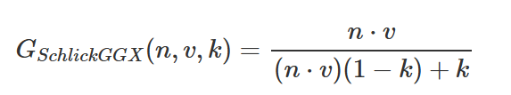

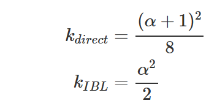

注意计算时包含了两种遮挡情况，一种是光线被遮挡，一种是视线被遮挡，两种都要考虑才形成了G项

```c++
float GeometrySchlickGGX(float NdotV, float k)
{
    float nom   = NdotV;
    float denom = NdotV * (1.0 - k) + k;
	
    return nom / denom;
}
  
float GeometrySmith(vec3 N, vec3 V, vec3 L, float k)
{
    float NdotV = max(dot(N, V), 0.0);
    float NdotL = max(dot(N, L), 0.0);
    float ggx1 = GeometrySchlickGGX(NdotV, k); // 视线方向的几何遮挡
    float ggx2 = GeometrySchlickGGX(NdotL, k); // 光线方向的几何阴影
	
    return ggx1 * ggx2;
}
```


世界上的“非金属”不都等于 0.04，UE的高光度其实控制的F0

- 皮肤 ≈ 0.028
- 水 ≈ 0.02
- 塑料 ≈ 0.04–0.06
- 橡胶 ≈ 更低

漫反射中积分内只有Radiance和N， 所以对于一个着色点，它的漫反射只和法线方向有关系，所以可以提前计算所有法线方向上的值，来表达漫反射

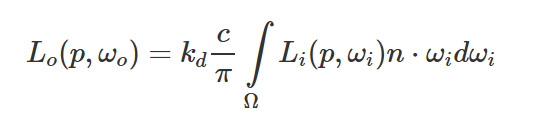

为什么漫反射要/pi呢，因为如果半球上Radiacne都是1时，积分结果为pi，说明能量溢出了 所以除以pi，让结果为1


  镜面反射部分 。UE把BRDF和光照项直接拆开了

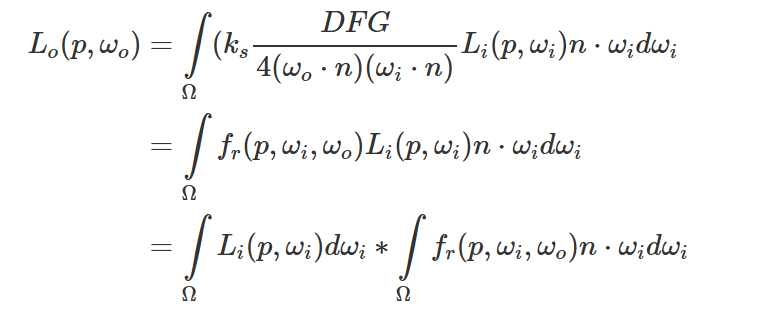

对于光照积分部分，用粗糙度调控的mipmap来表达，mipmapLevel越大，画面越胡

具体实现来说就是先把原来的CubeMap生成mipmap，然后采样时根据粗糙度来选择不同的mip层，这样也就达到了根据粗糙度来模糊的效果


8. 如何根据一个PDF来进行采样

逆CDF法，下面的线条表示CDF函数(从0累积到1)，均匀分布的结果当作y = f(x)  逆推出x是多少


9. BSSRDF

参数多一个p1，也就是任何着色点都可能对当前着色点有贡献，而不是只考虑当前着色点

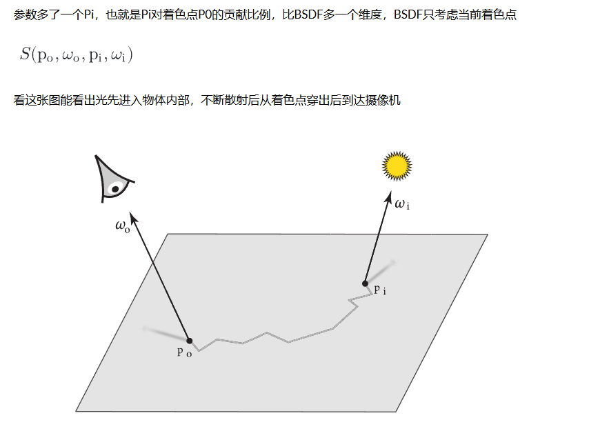

也就是写成了双层积分，内层考虑一个点的半球积分，外层积分是整个面积上的积分

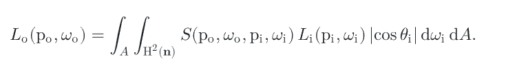

10 . BSDF模型有哪些

第一个完美导体，不考虑折射（进入表面立刻被吸收，只有反射）所以只需要菲涅尔方程控制反射即可

第二个完美电介质， 要考虑BRDF和BTDF 根据菲涅尔的比例作为概率，选择BRDF还是BTDF

11. LPV+ VXGI

LPV把整个场景分成格子，注入光照后，在格子之间进行传播

VXGI是直接把场景变成格子，在格子上建立八叉树，每个格子作为次级光源，缓存信息，  再一个Pass摄像机视线打到格子后根据BRDF的lobe去进行追踪，看哪些格子在他的lobe范围内  就是cone Tracing
