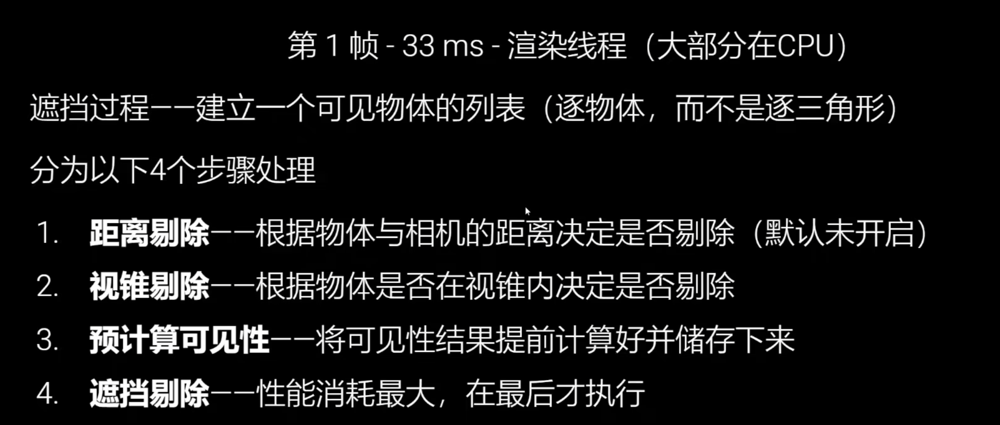
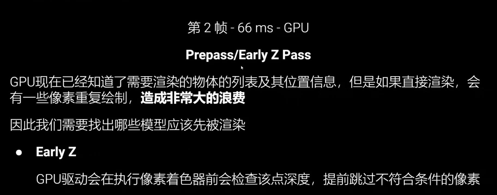
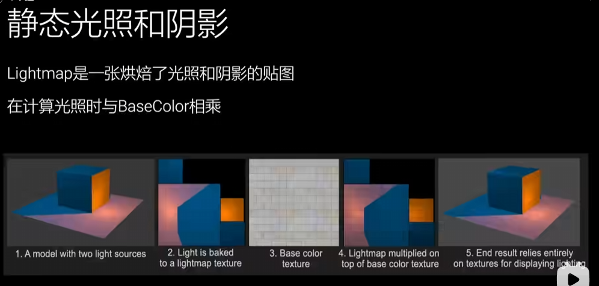
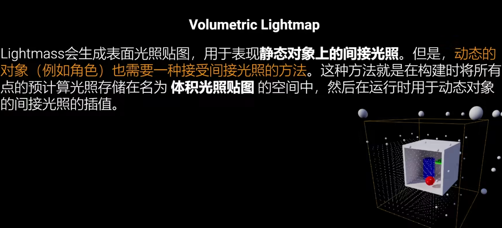

+++date = '2025-12-26T16:52:28+08:00'
draft = true
title = '面试（UE客户端）'
categories = ["面试"]
+++

# UE的渲染流程

1. 剔除

2. PreDepth

利用EarlyZ特性来跳过一些片段着色器的执行

# UE的反射

1. 默认开启Lumne就有反射
2. SSR在后处理体积中设置，有lumen就不生效了
3. 天空光也会提供反射
4. 没有上述这些时，利用反射捕获Actor来进行反射

对于静态物体，静态光源下的间接光和直接光都可以用lightmap。

对于动态物体需要Volumetric Lightmap

# 项目实现的功能

1. 使用单例模式 对 GameTag集中管理
1. Input 和 Tag 是用的lyra的思路
1. 击打动画逻辑是，受击是Enemy的一种能力，所以收到伤害时，激活这种能力，这种能力激活后会播放蒙太奇
1. 行为树管理敌人 

# GAS

## AbilitySystemComponent

## AttributeSet

## GameplayAbility

## GameplayTag

