+++
date = '2025-12-26T16:52:18+08:00'
draft = true
title = '面试（cpp）'

+++

# TODO

1. 智能指针代码学习
1. 设计模式：单例模式、委托
1. 关联性容器、红黑树

# 基础

## RAII

> Resource Acquistion Is Initialzation
>
>  资源获取即初始化
>
> 目的就是把手动管理的堆内存绑定到自动管理的栈内存上，把危险的工作委托给可靠的栈上对象

智能指针就是RAII的例子，用栈上创建的智能指针对象来管理堆内存，栈上的智能指针会在函数结束后析构，此时就会来判断是否需要析构堆上的对象

下图的代码是一个错误的智能指针用法，指针指针new出来的，放在堆山。离开作用域后并不会析构，这种错误原因就是没有按照RAII的理念来设计

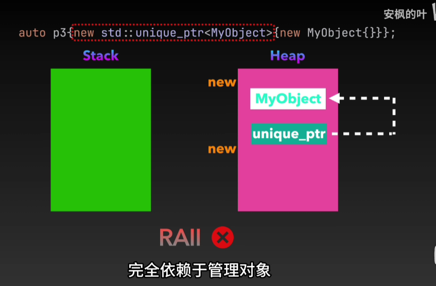


## 万能引用T&&和完美转发std::froward

> 使用场景：一个模板函数，接收一个参数，但是这个参数需要根据传入的是左值还是右值，调用不同的重载函数,但是不管左值还是右值进入这个模板函数后，都会变成左值

1. 当模板函数参数为T&&时，表示这个参数是万能引用，传递左值和右值都可以

```c++
// 注意这种函数是没法传入右值的，因为一个引用没法绑定临时的右值
void funcInner(int& x) {
    cout << "左值" << endl;
} // 错的

int & ref = 1;  // 这种绑定就是错的，所以上边的函数也没办法通过编译


void funcInner(int& x) {
    cout << "左值" << endl;
}

void funcInner(int&& x) {
    cout << "右值" << endl;
}
// 在模板函数中，T&& 就表示万能引用，可以传递左和右
template<class T>
void func(T&& x) {
	funcInner(x);   // 第二步就是要改这里为完美转发
}
```

2. 当进入func这个模板函数后，x无论是左还是右都变成了左值，因为他是参数，所以无论我外

```c++
// 不论左值右值传入func,最终打印都变成左值了
func(1);
func(a); 
```

3. 用完美转发来解决这个问题

```c++
void funcInner(int& x) {
    cout << "左值" << endl;
}

void funcInner(int&& x) {
    cout << "右值" << endl;
}
template<class T>
void func(T&& x) {
	funcInner(std::forward<T>(x));
}

func1(1);   // 打印左值
func1(a);	// 打印右值
```


## 内存对齐

> 未特殊说明时，按结构体中size最大的成员对齐（若有double成员，按8字节对齐。）
>
> 字节对齐目的是让访问一些大字节类型时可以按照它的字节的整数倍地址访问，比如一个double放在后边，那他前边的类型就会被填充为8的整数倍

```c++
struct AStruct {
	char a;
	uint32_t b;
	char c;
}; // sizeof = 12,因为第二个是4字节，为了访问时能以整数倍内存访问它，每个成员都填充为4字节

struct structB {
	char a;
	char c;
	uint32_t b;
}; // sizeof = 8   a和c可以放在同一个4字节内

struct structC {
	double a;
	char c;
	uint32_t b;
}; // sizeof =16, 8字节对齐，c占4字节，b占4字节组成第二个0字节


std::cout << alignof(structC) << std::endl;  // 输出对齐方式

```

## new和malloc

> malloc只做一件事，分配指定大小的内存`void* malloc(size_t size);`
>
> 而new创建内存后还会调用构造函数进行构造，delete也会进行析构
>
> 所以new是malloc的封装版，为了CPP构造和删除类实例时自动执行构造和析构函数

## 指针常量和常量指针

> 首先注意64位电脑上指针是8字节，一直以为是4字节。。。。

> 可以把(const int) * 这样来看，说明这个指针在指向一个const int的类型，它的内容肯定不能改
>
> int * (const ptr)   本质是int * 的指针，但是被const修饰，也就是指向不能改
> 太绕了，感觉过两天就忘了（事实是已经记过很多次了😄） 
>
> 总之看const右边是谁，谁就不能动，右边是int 数据不能改，右边是具体的ptr，ptr不能改指向

```c++
void PtrConstAndConstPtr()
{
	int a = 10;
	int b = 20;
	// const修饰指针，常量指针，可以修改指向，但不能修改内容
	const int* ptr = &a;
	ptr = &b; // 可以
	//*ptr = 20; // 不行

	// const修饰变量，指针常量，可以修改内容，但不能修改指针
	int* const ptr2 = &a;
	// ptr2 = &b;  不行
	*ptr2 = 20;
    std::cout << *ptr2 << std::endl;
}
```

## Struct和Class的区别

> struct默认是公有的，Class默认是私有的，继承也是这样

## Static

> 不在类内的情况：
>
> 不加static的全局变量和函数，可以在不同的文件中使用，比如两个.c文件`add_executable(test file1.c file2.c)`
>
> 加了static，只能在自己文件中访问
>
> `static int a;` 会自动初始化为0
>
> 函数内的static也会一直存在在静态区/全局区


> 类内的static：
>
> 类内定义，必须在类外初始化（这样设计：多个文件include了这个类的头文件，不希望都创建一份static，而是交给某一个具体的cpp文件单独进行一次初始化，不然每个包含的cpp都会有一个static变，导致重复定义）


## Const

> 不在类内的情况：
>
> const形参的函数，可以传const也可以传普通的
>
> 全局函数不能加const修饰符

> 类内的const:
>
> const成员变量：不能在类定义外部初始化，必须用初始化列表进行初始化（C11 可以直接在定义位置初始化）
>
> const成员函数：不能调用非const函数 `const int constFunc() {`是修饰返回值的，` int constFunc() const {`才是修饰这个函数的（内部可以使用普通的成员变量，但是不允许修改，除非这个变量被标记为mutable）

## 顶层和底层const

> 顶层const：修饰对象本身是个常量，如果const修饰的是指针（表示这个指针本身不能被修改，这就是顶层const）
>
> 底层const: 修饰对象所指向的数据是一个常量（const修饰的是指针指向的数据，指向的数据不能修改，这就是底层const）

## 初始化与赋值

> ```c++
> Class A;
> Class B = A;  // 这是初始化操作，会走拷贝构造函数
> Class C;
> C = A; // 这是赋值操作，会走重载的=逻辑，如果Class没有实现就会报错
> ```
>

## C++有几种构造函数

> C++类构造顺序是  父类构造->成员变量构造->构造函数

1. 默认构造
2. 带参数构造
3. 拷贝构造（注意需要在列表初始化中指定成员的拷贝构造，否则成员变量仍然走默认构造）、
4. 移动构造（自定义了拷贝构造，就不会默认生成移动构造了），移动构造的设计思路是转移other的数据，而不是拷贝他们，比如`	std::string anotherStr = std::move(str);`
5. 委托构造（交给其他构造器来执行）

```c++
class Dog : public Animal {
public:
	Dog() {
        print("Dog构造");
        a = std::make_shared<int>(10);
    }
	Dog(const Dog& other) {
		print("Dog拷贝构造");
	}
	Dog(Dog&& other) {
        print("Dog移动构造");
    }
	void makeSound() {
        print("Woof!\n");
	}
	std::shared_ptr<int> a;
	~Dog() {
        print("Dog析构");
    }
};

void STLLearn() {
	std::vector<Dog> arr;
	Dog dog;
	arr.push_back(std::move(dog));
}

// push_back内部 如果传入的是右值，会走移动构造（如果没有定义移动构造，退化为拷贝构造），如果传入的左值，会走拷贝构造
```


## std::move和std::forward

std::move用于把左值转为右值引用

std::forward用于完美转发，比如如果我传入一个左值引用，就调用拷贝构造，如果是右值引用就调用移动构造，保证不会改变语义

```cpp

class Product {
public:
	Product() {
		print("默认构造");
	}
	Product(const Product & other) {
		print("拷贝构造");
	}
	Product(Product&& other) {
		print("移动构造");
	}
};

// 比如这个模板函数，可以自动处理左值和右值，相当于构造Product时自动根据是左值还是右值来选择拷贝构造还是移动构造
template<typename... Args>
std::unique_ptr<Product> createProduct(Args&&... args) {
	return std::make_unique<Product>(std::forward<Args>(args)...);
}

int main(){
	Product p;
	auto p1 = createProduct(p);
	auto p2 = createProduct(std::move(p));
}

// 打印
默认构造
拷贝构造     // 说明左值走拷贝
移动构造 	 // 说明右值走移动

// 如果不使用std::forward就会都走拷贝函数
```

## volatile

> 用来表示一个变量是易变的，每次用到这个变量的值的适合都要去重新读取这个变量的值，而不是读寄存器内的缓存数据，防止把多线程都会使用的变量装进CPU缓存

## explicit

> ```c++
> void funcNeedProduct(Product a) {
> 
> }
> class Product{
>    explicit Product(int a) {
> 	// explicit会阻止隐式转换
> 	// funcNeedProduct(10);   比如这里需要product但是传入10，隐式转换就会走这个构造，添加了explicit就不行了
> 	} 
> }
> 
> ```

## new的不同类型

> 普通的new
>
> ```c++
> try {
>     char* p = new char[10e11];
> }
> catch (std::bad_alloc & ex)   // new失败会抛出异常
> {
>     print(ex.what());
> }
> ```

> 无异常的new
>
> ```c++
> try {
> 	char* p = new(std::nothrow) char[10e11];   // 这样写后就不会抛出异常，而是返回nullptr
> }
> catch (std::bad_alloc & ex)
> {
> 	print(ex.what());
> }
> ```

> placement new
>
> 在一块已经存在的内存上分配对象，而不是调用一块新的，主要用途是反复使用一块内存来构建不同的对象
>
> ```c++
> void* someMemory = malloc(sizeof(100));
> Person* aPerson = new(someMemory) Person;
> 
> //delete aPerson;  // delete会释放空间，但这块空间不是aPerson申请的，会出现问题，不能这样用
> aPerson::~Person() // 手动析构即可
> 
> ```

## C++ 的异常处理机制 **try-catch-throw**

> throw 还能直接throw一个普通类型
>
> ```c++
> try {
> 	if (n == 0) {
> 		throw 0.1;
> 	}
> 	int a = m / n;
> }
> catch (double a) {  // 接收throw的double
> 	print("double");
> }  	
> catch (...) {  // 捕获任何类型
>     print("other");
> }
> 
> 
> void f() noexcept {  // 指明函数内不会抛出异常，如果抛出了直接中断程序，而不是往栈上传递   编译器可以基于 noexcept 做优化（如不生成异常处理表）
> void f() noexcept(false) {  // 指明可能抛出异常
>     
> void ExceptionFunc() throw(int,double){  // 指明抛出异常的类型
> 
> ```
>
> 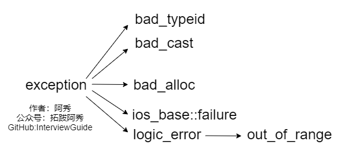
>
> 一些内建的异常类型

## 静态变量的初始化时机

1. 全局静态变量：编译期就初始化好放在文件的特定位置
2. 类中的静态变量：同上
3. 函数中的静态变量：第一次调用时进行初始化

## C++ 类成员在定义处初始化 vs 构造函数初始化列表，哪种方式更快？

初始化列表更快

1️⃣ 成员定义处初始化（In-class member initializer）

```
struct A {
    int x = 5;
    std::string s = "hello";
};
A a;
```

- 编译器会把初始化“转化”为构造函数内的赋值操作
- 对于**内置类型（int, double…）**：
  - 直接初始化常量 → 编译期常量，生成的代码和初始化列表差不多
  - **性能差别几乎可以忽略**
- 对于**类类型（std::string, std::vector…）**：
  - 默认先调用默认构造函数初始化
  - 然后再执行赋值（赋值构造或拷贝） → 会多一次构造/赋值开销
  - 也就是可能比列表初始化慢一点

------

2️⃣ 构造函数初始化列表（Constructor initializer list）

```
struct A {
    int x;
    std::string s;
    A() : x(5), s("hello") {}
};
```

- **直接初始化成员对象**，没有先默认构造再赋值
- 对于类类型 → **比在类定义处初始化快**（避免多余默认构造）
- 对于内置类型 → 差别可以忽略

## C++的四种强制转换

1. `reinterpret_cast`：对二进制数据的重新解释，将一段内存的二进制位**原封不动**地解释为另一种类型
2. `const_cast`：只负责修改const、volatile这两个限定符，**不会改变变量的类型、内存布局或二进制值**，用处是给一个指针移除const或者添加const

```c++
	int num1 = 100;
	const int* ptr = &num1;
	//&ptr = 11; //  不可以 因为是常量指针
	int* non_const_ptr = const_cast<int*>(ptr);  // 转成普通指针后就行了
	*non_const_ptr = 200;
	print(num1);
```

3. `static_cast`：转换的合法性由编译器在编译阶段判断，运行时不检查，在继承关系中用于向上转换（安全），向下转换（不安全，没有动态类型检查 ，因为每个子类都有自己独有的东西，但是并不会报错，会输出垃圾值）、基本数据类型之间的转换、空指针类型转换
4. `dynamic_cast`:**唯一支持运行时类型检查**的转换方式。转换时会通过 “运行时类型信息（RTTI）” 判断实际对象类型，而非仅做编译时语法检查，如果向下转换不合法会返回空指针，an'quan

## C++ 指针++会发生什么？

> 会根据这个指针指向的对象的sizeof来增加地址值

```c++
int main(){
    int * p = new int(10);
    char * q = new char(1);
    p ++;
    q++;
    return 0;
}

        add     QWORD PTR [rbp-8], 4    // 加4
        add     QWORD PTR [rbp-16], 1   // 加1
```

## 怎么判断两个浮点数是否相等

> 直接==是危险操作，必须设置一个EPSILON然后通过减法来判断
>
> 从思路上  不管是float还是double都无法精确表示0.1  每次累加都是 “近似值 + 近似值”，误差会被不断放大
>
> ```
> 十进制 0.1 → 二进制 0.00011001100110011...（循环节是0011）
> 十进制转二进制是一直乘2，取整数部分，如果小数部分=0则停止
> 
> ```

```c++
// 用double类型，精度更高，误差更易体现
float a = 1.1;
float b = 0.0;
for (int i = 0; i < 11; ++i) {
    b += 0.1; // 累加11次0.1，理论上=1.1，实际有精度误差
}

// 显示20位有效数字，暴露差异
cout.precision(20);
cout << "a = " << a << endl;
cout << "b = " << b << endl;
cout << "a == b ? " << boolalpha << (a == b) << endl;

// 正确的比较方式：判断差值小于阈值（double用1e-9）
const double EPSILON = 1e-5;
cout << "a ≈ b ? " << boolalpha << (fabs(a - b) < EPSILON) << endl;


// 输出
a = 1.1000000238418579102
b = 1.1000001430511474609
a == b ? false
a ≈ b ? true
```

## 从汇编上理解指针传参和引用传参的区别

> 两个汇编的函数都长得一样，但是main不一样
>
> 传递指针传递的是指针值
>
> 传递引用是直接把原数据在栈上的地址传递给函数了

```c++
void ptrFunc(int * p){
    *p  = 100;
}
void refFunc(int & p){
    p = 100;
}
int main(){
    int a = 10;
    int *p = &a;
    ptrFunc(p);    
}

// 能看出来两个函数的汇编是一模一样的
ptrFunc(int*):
        push    rbp
        mov     rbp, rsp
        mov     QWORD PTR [rbp-8], rdi
        mov     rax, QWORD PTR [rbp-8]
        mov     DWORD PTR [rax], 100
        nop
        pop     rbp
        ret
refFunc(int&):
        push    rbp
        mov     rbp, rsp
        mov     QWORD PTR [rbp-8], rdi
        mov     rax, QWORD PTR [rbp-8]
        mov     DWORD PTR [rax], 100
        nop
        pop     rbp
        ret
main:  // 指针
        push    rbp
        mov     rbp, rsp
        sub     rsp, 16
        mov     DWORD PTR [rbp-12], 10
        lea     rax, [rbp-12]
        mov     QWORD PTR [rbp-8], rax
        mov     rax, QWORD PTR [rbp-8]   // 把指针值传如rax，进一步作为参数传递给rdi，rdi在函数内使用
        mov     rdi, rax
        call    ptrFunc(int*)
        mov     eax, 0
        leave
        ret
            
main: // 引用
        push    rbp
        mov     rbp, rsp
        sub     rsp, 16
        mov     DWORD PTR [rbp-12], 10
        lea     rax, [rbp-12]
        mov     QWORD PTR [rbp-8], rax
        lea     rax, [rbp-12]    // 直接把数字的地址传递给rax，剩下都一样
        mov     rdi, rax
        call    refFunc(int&)
        mov     eax, 0
        leave
        ret
```


## 方法调用的原理

> 看下边的汇编

## 函数指针

```c++
void someF(int(*funcPtr)(int, int)) {  // 函数指针作为参数，调用时直接写入函数名即可
	print(funcPtr(1, 2));
}

void someF1(std::function<int(int, int)> a) {  // 这样也行

	print(a(1, 2));
}

// 方式1：typedef定义函数指针别名
typedef int (*CalcFunc)(int, int);

// 方式2：C++11 using（更直观，推荐）
using CalcFuncAlias = int (*)(int, int);

// 调用时
someF1(add);  // 函数指针作为参数    函数指针主要用于回调，可以传入不同的返回和参数一样的函数

```

从汇编来看

```c++
int main(){
     int(*funcPtr)(int, int) = add;
     funcPtr(1,2);
     add(1,2);
}

main:
        push    rbp
        mov     rbp, rsp
        sub     rsp, 16
        mov     QWORD PTR [rbp-8], OFFSET FLAT:add(int, int)   // 把这个函数的地址存入了栈中
        mov     rax, QWORD PTR [rbp-8]
        mov     esi, 2
        mov     edi, 1
        call    rax   // call的时候直接从寄存器拿函数地址
        mov     esi, 2
        mov     edi, 1
        call    add(int, int)   // 直接调用
        mov     eax, 0
        leave
        ret
```

## 模板类为什么一般都是放在.h文件

> TODO:先理清楚编译流程再说

## 模板的使用

```c++
template<typename T>
template<class T>   // 这两种写法一模一样，class是之前的写法，是历史原因
    
template<typename T=int>  // default
    
template<int N>    // 模板不一定是类型，也可以是某个类型的具体数值（模板本质上就是 编译期机制，所以调用是传入的实例必须是编译期就能确定的）
void printStars() {
    for(int i=0;i<N;i++) std::cout << "*";
    std::cout << std::endl;
}
```

## delete和delete[]

delete调用一次析构

delete[]调用每个元素的析构


## C++的内存分区

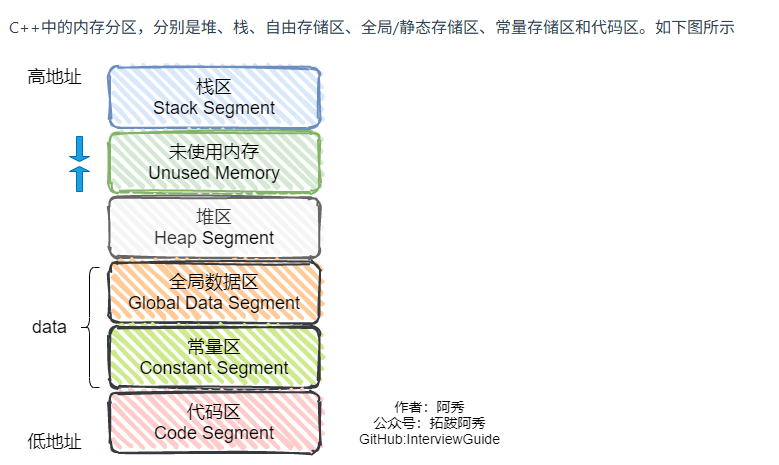

## 定义一个类占据的存储空间

> 1. 非静态成员的数据类型大小之和
> 2. 编译器加入的额外成员变量（如指向虚函数表的指针）
> 3. 为了边缘对齐优化加入的padding
>
> 定义一个空类时，size=1,  
>
> 作为父类时size=0（这句话的意思如下）

```c++
class EmptyClass {
};
class EmptyClassChild:public EmptyClass {
	int x;
};

	EmptyClass a;
	EmptyClassChild b;
	print(sizeof(a)); // 1
    print(sizeof(b)); // 4    (并没有加父类的1)
```

## 什么是RAII

> RAII（**R**esource **A**cquisition **I**s **I**nitialization）是由c++之父[Bjarne Stroustrup](https://zhida.zhihu.com/search?content_id=6054031&content_type=Article&match_order=1&q=Bjarne+Stroustrup&zhida_source=entity)提出的，中文翻译为资源获取即初始化，他说：使用局部对象来管理资源的技术称为资源获取即初始化；这里的资源主要是指操作系统中有限的东西如内存、网络套接字等等，局部对象是指存储在栈的对象，它的生命周期是由操作系统来管理的，无需人工介入；
>
> 资源的使用一般经历三个步骤a.获取资源 b.使用资源 c.销毁资源，但是资源的销毁往往是程序员经常忘记的一个环节，所以程序界就想如何在程序员中让资源自动销毁呢？c++之父给出了解决问题的方案：RAII，它充分的利用了C++语言局部对象自动销毁的特性来控制资源的生命周期。给一个简单的例子来看下局部对象的自动销毁的特性
>
> 已经习惯了用类管理资源，这种方式就叫RAII么？  TODO


## 智能指针


### enable_shared_from_this

> 使用场景 ：**只有this指针时，如何安全得到shared_ptr**
>
> ```c++
> class Widget{
> public:
>   void process();
>   ...  
> private:
>   vector<shared_ptr<Widget>> vec_;
> }
> 
> void Widget::process(){
>   ... // 做一些处理
>   vec_.emplace_back(this); // 这里会隐式转换this指针（Widget*类型）为shared_ptr<Widget>类型
> }
> ```
>
> 上述场景问题就是，emplace_back时会为this指针创建一个智能指针，如果外部代码还有一个共享指针指向这个对象，那这个对象就有两个共享指针，他们的生命周期独立，可能会导致两次析构，代码崩溃
>
> 解决思路就是让Widget继承: public std::enable_shared_from_this<Widget>，这个类中维护一个weakPtr
>
> 如果需要this表达的shared_ptr，可以调用shared_from_this()来获得
>
> ```c++
>     _NODISCARD shared_ptr<_Ty> shared_from_this() {
>         return shared_ptr<_Ty>(_Wptr);
>     }
> ```
>
> shared_from_this使用前提是当前对象已经被shared_ptr管理


# 类相关

## 构造函数相关

### 各种构造函数和=重载

> 基础语法

```c++
{	// 各种构造方法
	Base b1;					// 无参构造
	const Base b2;				// 无参构造
	Base b3(10);				// 有参构造  
	Base b4(b1);				// 拷贝构造（如果没有非const版本构造函数，则会走const拷贝构造）
	Base b5 = Base();			// c17之前，需要先无参构造，然后再拷贝构造 | c17优化成了单独一次调用无参构造函数
	Base b6 = b1;				// 拷贝构造
	Base b7 = b2;				// const 拷贝构造
	Base b8 = std::move(b1);	// 移动构造
	Base b9 = std::move(b2);	// 移动构造(一般移动时不能设置const，因为要转移内部成员)


	// 使用赋值还是构造，区别是当前对象是否已经存在
	b3 = b1;					// =重载
	b1 = b2;					// const = 重载
	b1 = std::move(b1);			// 移动 = 重载
	return 0;
}
```

> 函数返回

```c++
Base CreateBase() {
	Base b(10);
	b.num= 100;
	return b;   // 返回这个栈帧的对象是合法的，返回后会执行拷贝，在高版本中直接优化为单次构造
}

// 这个操作会被优化为一次构造函数操作，而不需要移动构造(CreateBase相当于一个右值)
Base a = CreateBase();
```

### 拷贝构造函数的参数可以不加引用吗？

```c++
// 没加&的这种写法是错的，他会导致无限递归
// 因为值传递Base参数本身也是一次拷贝构造流程，所以会导致无限递归
Base(Base b) :num(b.num) {
    cout << "拷贝构造函数" << endl;
}
```

### A(){} 和 A() = default 

> 在编译器视角下，一个是用户自定义的构造函数，一个是原厂配置，后边这个可以接收更好的优化

## 虚函数

### 菱形继承

当读取Base0中的int a时会报错，也就是说编译器不知道你是要Base1上的a还是base2上的a，（本身不会报错，每个继承链都会保存一个a，但是访问时会冲突，必须指明使用域）

```text
main.cpp(26): error C2385: 对“a”的访问不明确
main.cpp(26): note: 可能是“a”(位于基“A”中)
main.cpp(26): note: 也可能是“a”(位于基“A”中)
main.cpp(27): error C2385: 对“a”的访问不明确
main.cpp(27): note: 可能是“a”(位于基“A”中)
main.cpp(27): note: 也可能是“a”(位于基“A”中)
```

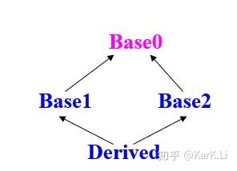

### 虚函数的实现原理

> 在 C++ 中，虚函数的实现原理基于两个关键概念：**虚函数表和虚函数指针**。
>
> **虚函数表**：每个包含虚函数的类都会生成一个虚函数表（Virtual Table），其中存储着该类中所有虚函数的地址。虚函数表是一个由指针构成的数组，每个指针指向一个虚函数的实现代码。
>
> **虚函数指针**：在对象的内存布局中，编译器会添加一个额外的指针，称为虚函数指针或虚表指针（Virtual Table Pointer，简称 VTable 指针）。这个指针指向该对象对应的虚函数表，从而让程序能够动态地调用正确的虚函数。

从下图可以看到A对象的虚函数表中记录的它自己的V1实现，而不是父类的V1实现，所以不会调用到父类的v1

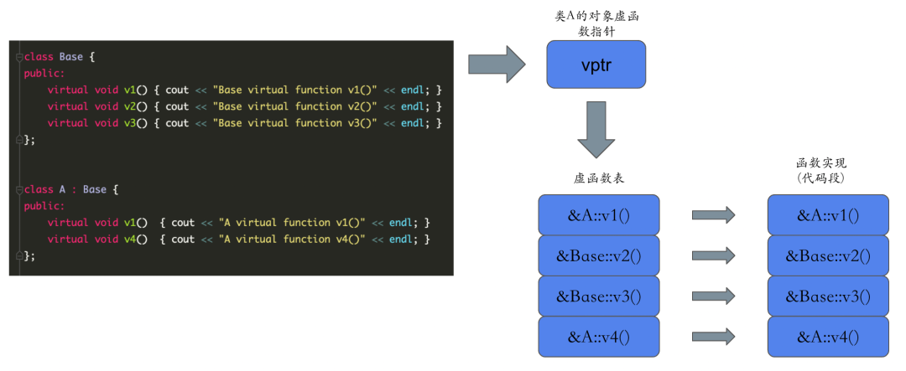

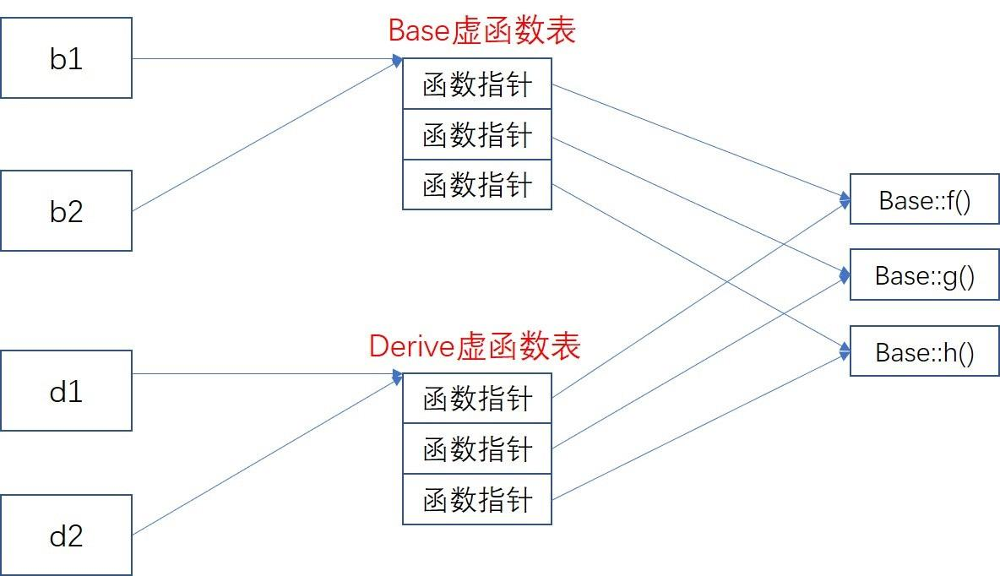

理解起来很容易，每个存在虚函数的类都会生成一张虚函数表，表内的函数地址会指向正确的函数，所以不会发生调用子类方法，反而调用成了父类方法的情况

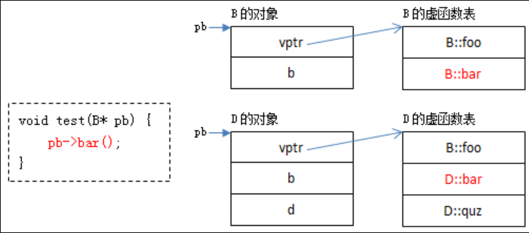

> 虚函数表除了函数指针外，还有一个RTTI信息，也是一个指针指向常量区，内容为改类表示的类型，也就是为了配合虚函数表来实现多态

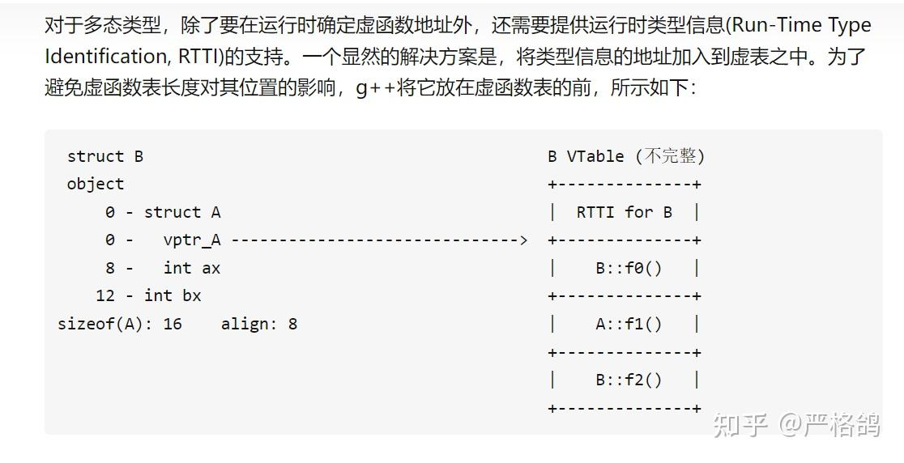

### 多态下的析构问题（什么情况下析构函数需要写  Virtual）

> 父类指针指向子类对象时，delete只会触发父类的析构
>
> 实测下裸指针有这个问题，智能指针没有这个问题

```c++
class Animal {
public:
	virtual void makeSound() {
		print("The animal makes a sound.\n");
	}
    ~Animal() {
        print("Animal析构");
    }
};

class Cat : public Animal {
public:
	void makeSound() {
		print("Meow!\n");
	}
    int * a = new int(10);
    ~Cat() {
       	delete a;
        print("Cat析构");
    }
	
};


int main(){
    Animal * animal = new Cat();
    animal->makeSound();

    delete animal;
}

// 打印：
//Meow!

//Animal析构   说明用的父类指针只调用了父类的析构，子类没有析构，这时候就会泄漏 Cat中的a
```

```c++
解决办法就是给父类的析构函数加上virtual
class Animal {
public:
    virtual void makeSound() {
        print("The animal makes a sound.\n");
    }
    virtual ~Animal() {
        print("Animal析构");
    }
};

```


### 静态绑定和动态绑定

> 编译期就可以确定函数的地址，就是静态绑定

```c++
class Shape {
public:
    void draw() { cout << "Drawing a shape." << endl; }
};

class Circle : public Shape {
public:
    void draw() { cout << "Drawing a circle." << endl; }
};

int main() {
    Shape* shapeObj = new Circle();
    shapeObj->draw(); // 编译时期确定方法调用，输出 "Drawing a shape."
}
```


# STL

> Standard Template Library，
>
> STL 的重要特点包括：
>
> - **数据结构与算法的分离**：通过迭代器将算法与容器解耦。
> - **非面向对象设计**：不依赖于继承和多态，而是通过模板和迭代器实现通用性。
> - **高性能**：模板在编译时实例化，避免了运行时多态的开销，通用设计减少重复代码。
> - **泛型编程**：基于模板实现，支持任意符合要求的类型（如支持拷贝、比较操作的类型）。

## STL的主要组件

> C++ STL 大体分为六大部件：容器 Container、算法 Algorithm、迭代器 Iterator、仿函数 Functor、适配器 Adaptor、空间配置器 Allocator

解耦具体的数据具体和访问方式

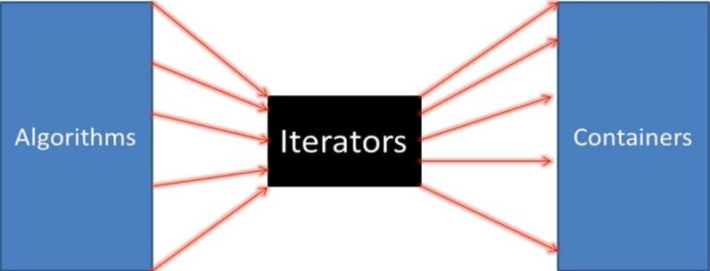

## STL的容器

### 序列式容器

STL 中的序列式容器是一类**按照元素插入顺序存储**的容器，它们维护了元素的插入顺序，但**不保证元素的排序**。有如下几种：vector、deque、list、forward_list、array 等。

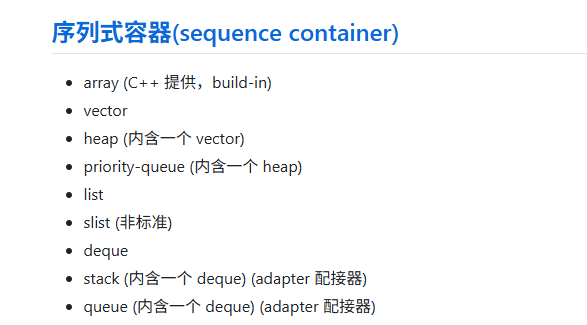

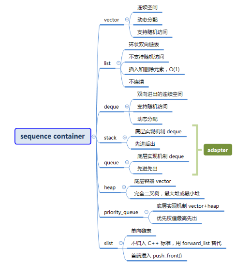

#### Vector

> 内部主要维护了三个指针，注意finish指向的下一个插入位置
>
> `_M_finish == _M_end_of_storage`就是初发扩容的时机

```c++
_Tp* _M_start;  // 表示目前使用空间的头
_Tp* _M_finish; // 表示目前使用空间的尾
_Tp* _M_end_of_storage; // 表示目前可用空间的尾
```


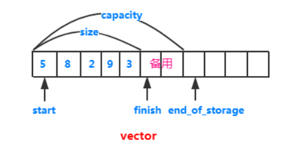

初始化: 就是在设置这些指针,也能看出来，如果不指定大小n，那创建的vector就只是三个指针而已，并且都是空指针

```c++
_Vector_base(const _Alloc&)
    : _M_start(0), _M_finish(0), _M_end_of_storage(0) {}


_Vector_base(size_t __n, const _Alloc&)
: _M_start(0), _M_finish(0), _M_end_of_storage(0) 
{
_M_start = _M_allocate(__n);
_M_finish = _M_start;
_M_end_of_storage = _M_start + __n;
}
```

push_back，能看出第一次调用时会触发申请内存，如果容量充足就会直接在Finish位置处构造对象

```c++
void push_back(const _Tp& __x) {
    if (_M_finish != _M_end_of_storage) { // 有备用空间
      construct(_M_finish, __x);    // 全局函数，将 __x 设定到 _M_finish 指针所指的空间上
      ++_M_finish;         // 调整
    }
    else
      _M_insert_aux(end(), __x);  // 无备用空间，从新分配再插入
  }
```

新分配内存的逻辑

```c++
template <class _Tp, class _Alloc>
void 
vector<_Tp, _Alloc>::_M_insert_aux(iterator __position, const _Tp& __x)
{
  if (_M_finish != _M_end_of_storage) {
    construct(_M_finish, *(_M_finish - 1));
    ++_M_finish;
    _Tp __x_copy = __x;
    copy_backward(__position, _M_finish - 2, _M_finish - 1);
    *__position = __x_copy;
  }
  else {// 没有备用空间
    const size_type __old_size = size();
    const size_type __len = __old_size != 0 ? 2 * __old_size : 1;   // 这里看出是两倍扩容
      
  // 下面就是申请新空间，移动数据，更新指针
    iterator __new_start = _M_allocate(__len);
    iterator __new_finish = __new_start;
    __STL_TRY {
      __new_finish = uninitialized_copy(_M_start, __position, __new_start);
      construct(__new_finish, __x);
      ++__new_finish;
      __new_finish = uninitialized_copy(__position, _M_finish, __new_finish);
    }
    __STL_UNWIND((destroy(__new_start,__new_finish), 
                  _M_deallocate(__new_start,__len)));
    destroy(begin(), end());
    _M_deallocate(_M_start, _M_end_of_storage - _M_start);
    _M_start = __new_start;
    _M_finish = __new_finish;
    _M_end_of_storage = __new_start + __len;
  }
}
```

#### List

> 双向循环链表

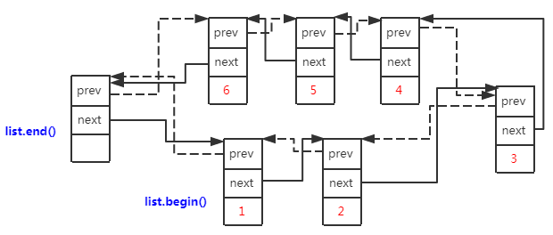

初始化时，会创建一个node，这里也能看出来，每次push一个节点时，才会去调用器申请新的空间

```c++
_List_node<_Tp>* _M_get_node() { return _Alloc_type::allocate(1); } // 配置一个节点并传回

_List_base(const allocator_type&) {
    _M_node = _M_get_node();
    _M_node->_M_next = _M_node;
    _M_node->_M_prev = _M_node;
}
```

#### deque

> 双向队列，具体实现只知道是map的一个数组，每个map表示的是一个缓冲区，来构建一个逻辑上连续的队列，具体实现还没看


> `deque` 的存储空间不是一块完整的连续内存，而是由多个**固定大小的连续数组（缓冲区 buffer）** 拼接而成；缓冲区之间在物理内存上不连续，但逻辑上是连续的
>
> `deque` 内部维护一个**指针数组（称为 map）**，这个数组的每个元素都是一个指针，指向上述的某个缓冲区；
>
> map 是一块连续的内存，它的作用是 “索引” 所有缓冲区，让 `deque` 对外表现出 “逻辑连续” 的特性；

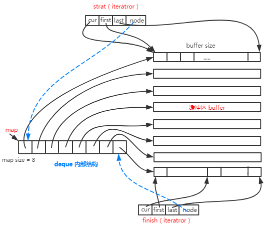

### 关联式容器

> - 标准的 STL 关联式容器分为 set(集合) 和 map(映射表) 两大类。衍生的还有 multiset(多键集合) 和 multimap(多键映射表)。这些容器的底层机制都是 RB-tree红黑树原理 完成。
> - 散列表 hash table(Hash Table 原理)，以 hash table 为底层机制而完成的 hash_set、hash_map、hash_multiset、hash_multimap。

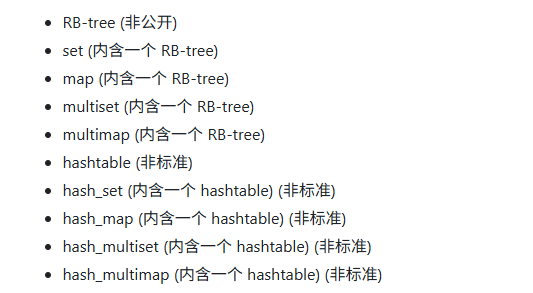

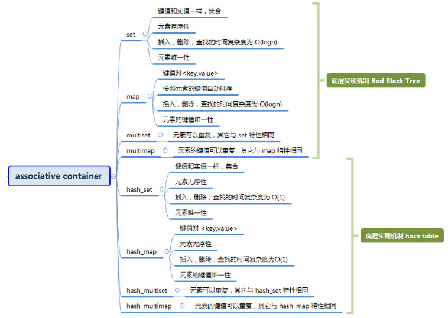

#### 红黑树

> 


### Vector的emplace_back 和 push_back

> push_back:  传入的参数就是一个已经存在的对象，或者临时创建的右值，会先触发构造函数，然后又触发拷贝构造或移动构造
>
> emplace_back: 可以直接传入以构建的对象，但是还可以传入构建需要的参数，这样vector可以原地创建对象，不需要拷贝或移动
>
> **一句话：push_back只接受已存在的对象，然后把他拷贝/移动到Vector， emplace_back接收参数，它来进行构造**
>
> **感觉网上说push_back是先创建再拷贝是不对的，创建是程序员自己控制的**
>
> **总体来说，如果一个对象已经存在了，我要把他传入数组，那用哪个都无所谓，如果要传入一个当前不存在的对象，那使用emplace_back更合适**

```c++
// emplace_back 
template <class... _Valty>
_CONSTEXPR20 _CONTAINER_EMPLACE_RETURN emplace_back(_Valty&&... _Val) {
    // insert by perfectly forwarding into element at end, provide strong guarantee
    _Ty& _Result = _Emplace_one_at_back(_STD forward<_Valty>(_Val)...);
#if _HAS_CXX17
    return _Result;
#else // ^^^ _HAS_CXX17 / !_HAS_CXX17 vvv
    (void) _Result;
#endif // ^^^ !_HAS_CXX17 ^^^
}

// pushback
_CONSTEXPR20 void push_back(const _Ty& _Val) { // insert element at end, provide strong guarantee
    _Emplace_one_at_back(_Val);
}

_CONSTEXPR20 void push_back(_Ty&& _Val) {
    // insert by moving into element at end, provide strong guarantee
    _Emplace_one_at_back(_STD move(_Val));
}
```

### STL的构造器

> 下面的代码能看出来，构造器就是在当前内存上直接placement new来构造对象

```c++
// 将初值 __value 设定到指针所指的空间上。
template <class _T1, class _T2>
inline void _Construct(_T1* __p, const _T2& __value) {
  new ((void*) __p) _T1(__value);   // placement new，调用 _T1::_T1(__value);
}
template <class _Tp>
inline void _Destroy(_Tp* __pointer) {
  __pointer->~_Tp();
}
```

### allocator解读

> SGI-STL V3.3

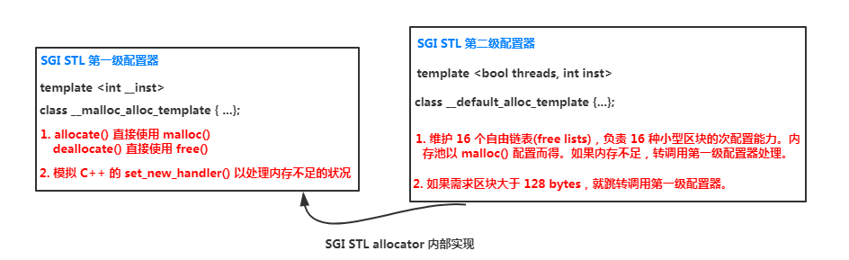

> 考虑到小型区块可能造成内存碎片问题，SGI 采用两级配置器，第一级配置器直接使用 malloc() 和 free() 实现；第二级配置器使用 memory pool 内存池管理

为什么会有外部碎片，释放小块的不连续内存后，没合并

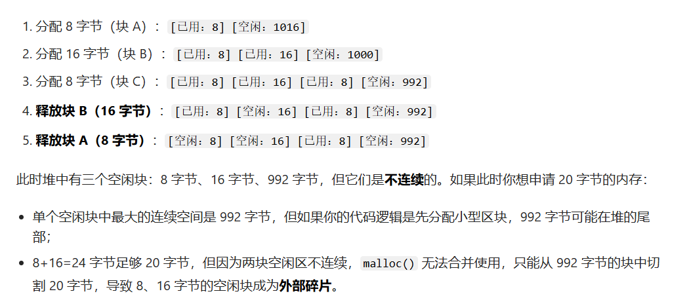

第二级配置器的架构

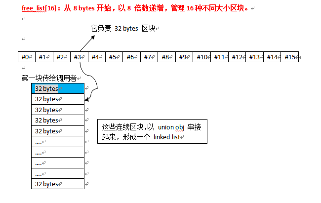

```c++
static void* allocate(size_t __n)
  {
    void* __ret = 0;

    // 如果需求区块大于 128 bytes，就转调用第一级配置
    if (__n > (size_t) _MAX_BYTES) {
      __ret = malloc_alloc::allocate(__n);
    }
    else {
      // 根据申请空间的大小寻找相应的空闲链表（16个空闲链表中的一个）
      _Obj* __STL_VOLATILE* __my_free_list
          = _S_free_list + _S_freelist_index(__n);
      // Acquire the lock here with a constructor call.
      // This ensures that it is released in exit or during stack
      // unwinding.
#     ifndef _NOTHREADS
      /*REFERENCED*/
      _Lock __lock_instance;
#     endif
      _Obj* __RESTRICT __result = *__my_free_list;
      // 空闲链表没有可用数据块，就将区块大小先调整至 8 倍数边界，然后调用 _S_refill() 重新填充
      if (__result == 0)
        __ret = _S_refill(_S_round_up(__n));
      else {
        // 如果空闲链表中有空闲数据块，则取出一个，并把空闲链表的指针指向下一个数据块  
        *__my_free_list = __result -> _M_free_list_link;
        __ret = __result;
      }
    }

    return __ret;
  };
```


# C++ 11的新特性

### auto自动推导与const

```c++
// 普通
const int a = 10;
auto b = a;
b = 20;  // 说明b推导类型为int，而不是const int，说明普通的顶层const会忽略
const auto b1 = a;  // 如果需要推断出来const，需要手动加const

// 引用
auto c = &a;
// c = 2;  // 不能修改，对常量取地址是一个底层const，会被推断出来
```

### decltype

> `decltype` 推导时**不会忽略任何 const 限定（包括顶层 const）**，这也是和 `auto` 最关键的差异之一
>
> 用于希望从表达式中推断出要定义的变量类型，但是不希望用这个表达式来初始化，可以自定义初始化

```c++
const int a = 10;
decltype(a) b = 10;   // b也是const int
```

### NULL和nullptr

NULL是一种宏定义

```c++
// 在CPP中 NULL就是整数0
#ifndef NULL
    #ifdef __cplusplus
        #define NULL 0  // 这里启动CPP
    #else
        #define NULL ((void *)0) // 这里启动C
    #endif
#endif
```

nullptr是一个关键字

## 智能指针

> 智能指针是一个类，用于存储指向动态分配对象的指针，负责自动释放动态分配的对象，防止内存泄露、

```c++
void SmartPointerFunc() { 
	std::unique_ptr<Person> p1 = std::make_unique<Person>(10, "haha");
    // std::unique_ptr<Person> p2 = p1;  // unique_ptr类删除了拷贝构造
    std::unique_ptr<Person> p2 = std::move(p1); // 移动构造
	print(p1.get());
	print(p2.get());
    
    
    // 引用计数
    std::shared_ptr<Person> p3 = std::make_shared<Person>(10, "shaderd_haha");
	print(p3.use_count());  // 1
    std::shared_ptr<Person> p4 = p3;
	print(p3.use_count()); // 2
	print(p4.use_count()); // 2
    
    // weakptr
    std::weak_ptr<Person> p5 = p3;
    print(p5.use_count()); // 还是2  weak指针不影响计数
    
}

//Person构造
//0000000000000000
//0000027CF1E92310
//Person析构
```

> 因为shared_ptr是基于引用计数的，所以肯定会有循环引用的情况，用双链表来解释，两个结点互相连接，释放其中一个时，需要先释放另外一个，互相牵制导致死锁

### unique_ptr的唯一性是如何体现的

```c++
// 也就是这个栈上的智能指针对象无法执行拷贝构造、也无法执行=重新赋值
unique_ptr(const unique_ptr&)            = delete;
unique_ptr& operator=(const unique_ptr&) = delete;

// 如果想转移必须用右值
_CONSTEXPR23 unique_ptr(unique_ptr&& _Right) noexcept
    : _Mypair(_One_then_variadic_args_t{}, _STD forward<_Dx>(_Right.get_deleter()), _Right.release()) {}
```

### shared_ptr如何增加引用计数、销毁对象

```c++
// 从一个智能指针复制到另外一个时，  即调用拷贝函数来复制指针时
template <class _Ty2>
void _Copy_construct_from(const shared_ptr<_Ty2>& _Other) noexcept {
    // implement shared_ptr's (converting) copy ctor
    _Other._Incref();

    _Ptr = _Other._Ptr;
    _Rep = _Other._Rep;
}

// 引用计数，其实是智能指针内部一个成员_Rep来管理的
void _Incref() const noexcept {
    if (_Rep) {
        _Rep->_Incref();
    }
}

// 这是一个类型为_Ref_count_base的指针
_Ref_count_base* _Rep{nullptr};
// 就是这个类
class __declspec(novtable) _Ref_count_base { // common code for reference counting
    _Atomic_counter_t _Uses  = 1;
    _Atomic_counter_t _Weaks = 1;
} 
    
// 具体的Inc
void _Incref() noexcept { // increment use count
    _MT_INCR(_Uses);
}

void _Incwref() noexcept { // increment weak reference count
    _MT_INCR(_Weaks);
}

// 最底层来执行这个原子操作的方法
#define _MT_INCR(x) _INTRIN_RELAXED(_InterlockedIncrement)(reinterpret_cast<volatile long*>(&x))
	


// _Rep 实在make_shared时 new出来的，所以引用计数管理器是在堆上的
_NODISCARD_SMART_PTR_ALLOC shared_ptr<_Ty> make_shared(_Types&&... _Args) { // make a shared_ptr to non-array object
    const auto _Rx = new _Ref_count_obj2<_Ty>(_STD forward<_Types>(_Args)...);
    shared_ptr<_Ty> _Ret;
    _Ret._Set_ptr_rep_and_enable_shared(_STD addressof(_Rx->_Storage._Value), _Rx);
    return _Ret;
}
```

> 引用计数器的销毁，如果计数器=0，就会销毁管理的对象，如果弱引用计数器=0，就会销毁控制块本身

```c++
void _Decref() noexcept { // decrement use count
    if (_MT_DECR(_Uses) == 0) {
        _Destroy();
        _Decwref();   // 注意：只有弱引用计数器=0时，这个控制块才会被销毁
    }
}

void _Decwref() noexcept { // decrement weak reference count
    if (_MT_DECR(_Weaks) == 0) {
        _Delete_this();
    }
}
```

### 循环引用问题

> 下面代码中AB两个对象的销毁函数都不会被调用

```c++
class Base {
public:
	Base() {
		cout << "构造" << endl;
	}

	~Base() {
		cout << "销毁" << endl;
	}

	std::shared_ptr<Base> pater;
};

int main() {
	std::shared_ptr<Base> A = make_shared<Base>();
	std::shared_ptr<Base> B = make_shared<Base>();

	A->pater = B;
	B->pater = A;

	cout << "done" << endl;
}
```

> 理解一下：
>
> 当退出智能指针作用域时，只会让引用计数-1，不会销毁对象，此时对象里还有别的对象的指针，上述代码场景中，AB这两个智能指针销毁后，引用计数器都还是1，所以这两个对象永远无法销毁
>
> 另一个理解是：退出作用域后，外部已经无法控制两个对象了，但是两个对象还互相持有对方的引用，所以这两个对象都无法被销毁


# C++的多线程

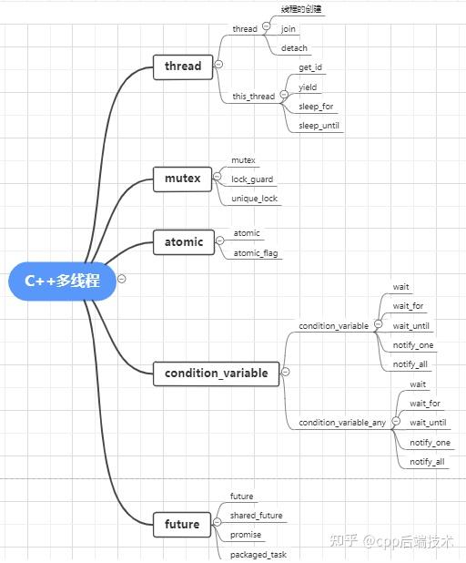

## std::thread

> 线程对象构造即启动

```c++
// 线程的构造函数
template <class _Fn, class... _Args, enable_if_t<!is_same_v<_Remove_cvref_t<_Fn>, thread>, int> = 0>
_NODISCARD_CTOR_THREAD explicit thread(_Fn&& _Fx, _Args&&... _Ax) {
    _Start(_STD forward<_Fn>(_Fx), _STD forward<_Args>(_Ax)...);
}

// 具体的启动函数
template <class _Fn, class... _Args>
void _Start(_Fn&& _Fx, _Args&&... _Ax) {
    using _Tuple                 = tuple<decay_t<_Fn>, decay_t<_Args>...>;
    auto _Decay_copied           = _STD make_unique<_Tuple>(_STD forward<_Fn>(_Fx), _STD forward<_Args>(_Ax)...);
    constexpr auto _Invoker_proc = _Get_invoke<_Tuple>(make_index_sequence<1 + sizeof...(_Args)>{});

    _Thr._Hnd =
        reinterpret_cast<void*>(_CSTD _beginthreadex(nullptr, 0, _Invoker_proc, _Decay_copied.get(), 0, &_Thr._Id));

    if (_Thr._Hnd) { // ownership transferred to the thread
        (void) _Decay_copied.release();
    } else { // failed to start thread
        _Thr._Id = 0;
        _Throw_Cpp_error(_RESOURCE_UNAVAILABLE_TRY_AGAIN);
    }
}
```

## 线程构造与std::Ref

> 因为创建线程传递参数时，会发生参数类型退化，需要注意

```c++
// 线程执行的函数
void func(int& x) {
	cout << x++ << endl;
}

// 线程构造
int a = 1;
std::thread t(func, a);   // 这行报错，因为把临时变量绑定到了int&（引用不能绑定右值）
t.join();
```

> 究其原因可以看线程构造时的Start函数,主要问题是`decay_t`

```c++
using _Tuple                 = tuple<decay_t<_Fn>, decay_t<_Args>...>;
auto _Decay_copied           = _STD make_unique<_Tuple>(_STD forward<_Fn>(_Fx), _STD forward<_Args>(_Ax)...);
```

`decay_t`让类型衰变了，变成了临时变量，所以没法后续把他绑定到引用参数上

> 总之一句话:线程创建时会让传入的函数参数衰变，所以最终作用在线程函数上的参数类型不一定与初始传入的参数类型一致

解决办法也很简单

```c++
void func(int& x) {
	cout << x++ << endl;
}

int main() {
	int a = 1;
	std::thread t(func, std::ref(a));   // 包装a 让衰变发生在包装器上，而不是a本身
    t.join();

	return 0;
}
```

## Join和Detach

> 创建线程后，join表示等待该线程。Detach表示脱离
>
> 如果不设置线程的状态，那创建的线程对象脱离作用域调用析构时就会报错
>
> ```c++
> // 如这个函数执行完成后就会报错，因为std::thread对象会调用析构，如果没有执行join或者Detach就会报错
> void createThread() {
> 	std::thread t(Func);
> }
> ```
>
> joinable用看看当前线程是否可以调用join或detach

## 多线程资源竞争问题

>  线程A读取int，还未把修改结果写入，此时线程B进来读取int，还是旧数据,如下面这段程序，最终结果有概率不是50000

```c++
void func(int& x) {
	for (int i = 0; i < 10000; i++) {
		x++;
	}
}

int main() {
	int a = 0;
	std::thread t1(func, std::ref(a));
	std::thread t2(func, std::ref(a));
	std::thread t3(func, std::ref(a));
	std::thread t4(func, std::ref(a));
	std::thread t5(func, std::ref(a));
    t1.join();
    t2.join();
    t3.join();
    t4.join();
    t5.join();
	cout << a;
	return 0;
}
```

原因就是x++不是原子操作

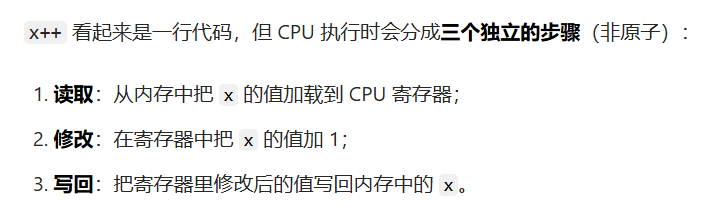

## 使用mutex构建一个死锁的情况

> 需要两个mutex，A 持有1，等待2，  B持有2等待1  就死锁了

下面就很容易发生死锁

 ```
 void funcA() {
 	mt1.lock();
 	mt2.lock();
 	mt1.unlock();
 	mt2.unlock();
 }
 
 void funcB() {
 	mt2.lock();
 	mt1.lock();
 	mt2.unlock();
 	mt1.unlock();
 }
 
 int main() {
 	
 	for (int i = 0; i < 100000; i++) {
 		cout << i << endl;;
 		std::thread t1 = std::thread(funcA);
 		std::thread t2 = std::thread(funcB);
 		t1.join();
 		t2.join();
 	}
 	return 0;
 }
 ```

> 总结一句话，两个线程互相需要对方已经持有的锁，都在等待对方释放

## lock_guard和unique_lock

> `std::lock_guard` 是基于**RAII 机制**（资源获取即初始化）的锁封装，它的解锁时机由**作用域**决定

```c++
void func(int& x) {
    for (int i = 0; i < 10000; i++) {
        std::lock_guard<std::mutex> lock(mt); // 作用域：单次循环
        x++;	
    } // 每次循环到这，lock析构→解锁
}
```

他的源码也很简单,并且把拷贝和赋值都删除了

```c++
_EXPORT_STD template <class _Mutex>
class _NODISCARD_LOCK lock_guard { // class with destructor that unlocks a mutex
public:
    using mutex_type = _Mutex;

    explicit lock_guard(_Mutex& _Mtx) : _MyMutex(_Mtx) { // construct and lock
        _MyMutex.lock();
    }

    lock_guard(_Mutex& _Mtx, adopt_lock_t) noexcept // strengthened
        : _MyMutex(_Mtx) {} // construct but don't lock

    ~lock_guard() noexcept {
        _MyMutex.unlock();
    }

    lock_guard(const lock_guard&)            = delete;
    lock_guard& operator=(const lock_guard&) = delete;

private:
    _Mutex& _MyMutex;
};
```

unique_lock也是类似的工具，不过提供了延迟加锁，设置等待时间等功能


## 条件变量

> 当一个线程进入锁后发现一些条件不满足，可以进行wait休眠，此时会释放锁，其他线程进入后修改内部数据，此时这个条件满足了，就可与notify来通知休眠的线程，唤醒后原线程立即持有锁，然后进行继续运行，所以条件变量是用于线程间的操作同步
>
> 用下面这个生产者消费者的例子就能看出条件变量的用法
>
> 每当消费者获取锁，首先判断queue中有没有对象，如果没有就wait，等待生产者的notify

```c++
void Producer() {
	for (int i = 0; i < 10; i++) {
		{
			std::unique_lock<std::mutex> lock(mt);
			q.push(i);
			cout << "生产" << i << endl;
			cv.notify_one();
		}
		std::this_thread::sleep_for(std::chrono::microseconds(100));
	}
}

void comsumer() {
	while (true) {
		std::unique_lock<std::mutex> lock(mt);
		cv.wait(lock, []() { return !q.empty(); });
		int num = q.front();
		cout << "消费" << num << endl;
		q.pop();
	}
}
 
int main() {
	std::thread t1(Producer);
	std::thread t2(comsumer);
	t1.join();
	t2.join();
	return 0;
}
```

## 异步并发 async future promise

> 基于上边那些底层组件封装的 “高层工具”，目的是让你更方便地实现异步编程，不用手动处理线程管理、同步等待等繁琐细节。
>
> 相当于一个异步编排工具包

```c++
// 启动一个异步任务foo，future用来接收返回值int
std::future<int> futrue_result = std::async(std::launch::async, foo); 

// 第一个参数表示执行策略
_EXPORT_STD enum class launch { // names for launch options passed to async
    async    = 0x1,	// 立刻创建新线程执行函数
    deferred = 0x2	// 不创建新线程，同步执行，当调用future.get()时才会执行
};
```

> promise用于接收异步函数的数据，如果不用promise，就只能通过返回值、全局变量等方式，promise相当于提供了异步变量存储的功能
>
> **一句话理解：在一个线程中产生一个值，在另外一个线程中获取这个值的工具**
>
> 使用方法就是把promise当作参数传递给异步函数，异步函数内部`set_value`来设置它，这样主线程可以在合适的时机去get它，而不是阻塞等待异步函数执行完

```c++
int foo(std::promise<int> prom) {
	for (int i = 0; i < 500; i++) {
		cout << "Thread ID: " << this_thread::get_id() << " - Iteration: " << i << endl;
	}
	prom.set_value(100);
	return 1;
}

int main() {
	std::promise<int> prom;
	auto fut = prom.get_future();
	std::thread t(foo, std::move(prom));
	for(int i = 0;i<1000;i++){
		cout << "主线程同时进行其他任务" << endl;
	}
	cout << "获取异步结果" << fut.get();
	t.join();
}
```

## 原子操作

> 有些多线程问题是因为一个资源操作不是原子操作而导致的线程冲突问题，比如num++，他需要读取到CPU寄存器、寄存器++、写回内存，如果期间时间片到了，就出问题了
>
> 用atomic来封装对象，可以保证操作的原子性，不会被打断

```c++
void foo(std::atomic_int&res) {
	for (int i = 0; i < 50000; i++) {
		res++;
	}
}

int main() {
	std::atomic<int> num;
	std::thread t1(foo, std::ref(num));
	std::thread t2(foo, std::ref(num));
	t1.join();
	t2.join();
	cout << num;
}
```

# C++ string底层

> 首先他是一个模板，底层由模板类`basic_string`来实现

```c++
_EXPORT_STD using string  = basic_string<char, char_traits<char>, allocator<char>>;
_EXPORT_STD using wstring = basic_string<wchar_t, char_traits<wchar_t>, allocator<wchar_t>>;
#ifdef __cpp_lib_char8_t
_EXPORT_STD using u8string = basic_string<char8_t, char_traits<char8_t>, allocator<char8_t>>;
#endif // defined(__cpp_lib_char8_t)
_EXPORT_STD using u16string = basic_string<char16_t, char_traits<char16_t>, allocator<char16_t>>;
_EXPORT_STD using u32string = basic_string<char32_t, char_traits<char32_t>, allocator<char32_t>>;


/*
字符类型 (_Elem)  +  字符操作策略 (_Traits)  +  内存管理策略 (_Alloc)
           ↓
  生成不同类型的 string
*/
```

这里看来string不止一种

> 捎带捋一下字符编码：Unicode只说明了十进制对应关系，至于这个十进制数据怎么存储是UTF这些规范决定的 （有了 Unicode，我们知道每个符号是什么；有了 UTF，我们知道怎么在计算机里存储和传输。）

```c++
_EXPORT_STD template <class _Elem, class _Traits = char_traits<_Elem>, class _Alloc = allocator<_Elem>>
class basic_string { // null-terminated transparent array of elements(这个注释意思是他的char数组结尾也是\0)
    
    // string = "aaa"; 时进入的构造器，（这里获取了Ptr的size，然后委托构造）
    _CONSTEXPR20 basic_string(_In_z_ const _Elem* const _Ptr) : _Mypair(_Zero_then_variadic_args_t{}) {
        _Construct<_Construct_strategy::_From_ptr>(_Ptr, _Convert_size<size_type>(_Traits::length(_Ptr)));
    }
	
    // 最终的核心构造器
    template <_Construct_strategy _Strat, class _Char_or_ptr>
    _CONSTEXPR20 void _Construct(const _Char_or_ptr _Arg, _CRT_GUARDOVERFLOW const size_type _Count) {
        auto& _My_data = _Mypair._Myval2;
        _STL_INTERNAL_CHECK(!_My_data._Large_mode_engaged());

        if constexpr (_Strat == _Construct_strategy::_From_char) {
            _STL_INTERNAL_STATIC_ASSERT(is_same_v<_Char_or_ptr, _Elem>);
        } else {
            _STL_INTERNAL_STATIC_ASSERT(_Is_elem_cvptr<_Char_or_ptr>::value);
        }

        if (_Count > max_size()) {
            _Xlen_string(); // result too long
        }

        auto& _Al     = _Getal();
        auto _Alproxy = _STD _Get_proxy_allocator(_Al);
        _Container_proxy_ptr<_Alty> _Proxy(_Alproxy, _My_data);
		
        // 小字符串优化SSO：如果字符串长度小于 SSO 最大容量 → 使用栈上存储
        if (_Count <= _Small_string_capacity) {
            _My_data._Mysize = _Count;
            _My_data._Myres  = _Small_string_capacity;

            if constexpr (_Strat == _Construct_strategy::_From_char) {
                _Traits::assign(_My_data._Bx._Buf, _Count, _Arg);
                _Traits::assign(_My_data._Bx._Buf[_Count], _Elem());
            } else if constexpr (_Strat == _Construct_strategy::_From_ptr) {
                _STD _Traits_copy_batch<_Traits>(_My_data._Bx._Buf, _Arg, _Count);
                _Traits::assign(_My_data._Bx._Buf[_Count], _Elem());
            } else { // _Strat == _Construct_strategy::_From_string
    #ifdef _INSERT_STRING_ANNOTATION
                _Traits::copy(_My_data._Bx._Buf, _Arg, _Count + 1);
    #else // ^^^ _INSERT_STRING_ANNOTATION / !_INSERT_STRING_ANNOTATION vvv
                _Traits::copy(_My_data._Bx._Buf, _Arg, _BUF_SIZE);
    #endif // ^^^ !_INSERT_STRING_ANNOTATION ^^^
            }

            _Proxy._Release();
            return;
        }

        size_type _New_capacity = _Calculate_growth(_Count, _Small_string_capacity, max_size());
        const pointer _New_ptr  = _Allocate_for_capacity(_Al, _New_capacity); // throws
        _Construct_in_place(_My_data._Bx._Ptr, _New_ptr);

        _My_data._Mysize = _Count;
        _My_data._Myres  = _New_capacity;
        if constexpr (_Strat == _Construct_strategy::_From_char) {
            _Traits::assign(_Unfancy(_New_ptr), _Count, _Arg);
            _Traits::assign(_Unfancy(_New_ptr)[_Count], _Elem());
        } else if constexpr (_Strat == _Construct_strategy::_From_ptr) {
            _STD _Traits_copy_batch<_Traits>(_Unfancy(_New_ptr), _Arg, _Count);
            _Traits::assign(_Unfancy(_New_ptr)[_Count], _Elem());
        } else { // _Strat == _Construct_strategy::_From_string
            _Traits::copy(_Unfancy(_New_ptr), _Arg, _Count + 1);
        }

        _ASAN_STRING_CREATE(*this);
        _Proxy._Release();
    }
    
    // 增长策略，1.5倍
    _NODISCARD static _CONSTEXPR20 size_type _Calculate_growth(
        const size_type _Requested, const size_type _Old, const size_type _Max) noexcept {
        const size_type _Masked = _Requested | _Alloc_mask;
        if (_Masked > _Max) { // the mask overflows, settle for max_size()
            return _Max;
        }

        if (_Old > _Max - _Old / 2) { // similarly, geometric overflows
            return _Max;
        }

        return (_STD max)(_Masked, _Old + _Old / 2);
    }
}
```

小字符串（≤15字节） → 数据直接在栈对象 `_My_data._Bx._Buf`

大字符串（>15字节） → 数据堆分配，指针存储在栈对象

`_Construct` 是把 “外部字符源” → 转换为 `std::string` 内部存储的核心逻辑

> 至于这里的扩容 ：我看代码是1.5，但网上都说是2倍
>
> **GCC (libstdc++)**：默认按 **2 倍** 扩容（经典的 “倍增策略”）。
>
> 比如当前容量是 10 字节，扩容后会变成 20 字节；如果 20 字节还不够，会先满足实际需求，再按 2 倍兜底。
>
> **Clang (libc++)**：同样以 **2 倍** 为基础，部分场景会微调（比如小字符串优化 SSO 范围内不扩容）。
>
> **MSVC (Visual Studio)**：早期版本按 1.5 倍扩容，新版也逐步切换到 2 倍扩容。

# C++ 编译全流程

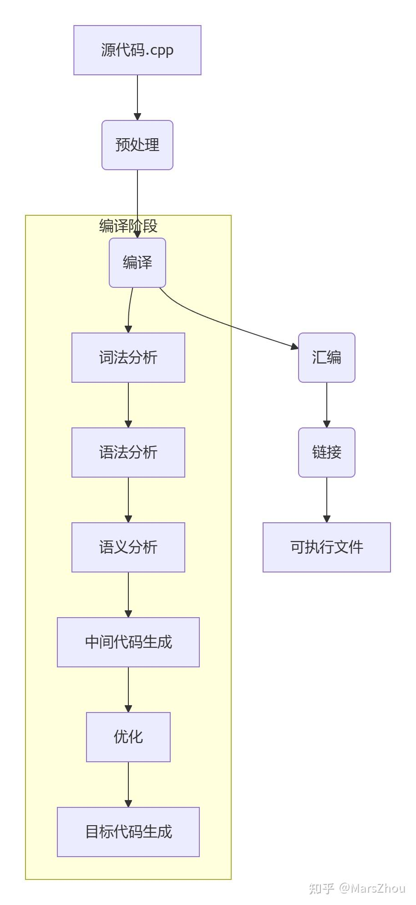

## 预处理

```c++
// 只进行预处理的命令
g++ -E main.cpp -o main.i  
```

预处理阶段即使代码是错的也能通过

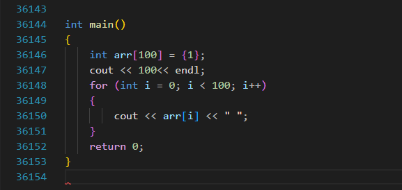

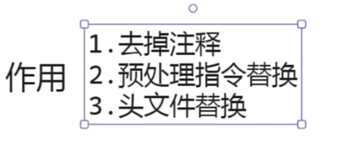

## 编译

把预处理的文件编译为.s文件

```c++
g++ -S main.cpp -o main.s
```

到这就变成汇编语言了，**注意这里生成的汇编很多地方都是占位符  比如` call _ZNSolsEi`, 在链接阶段才会写入虚拟地址**

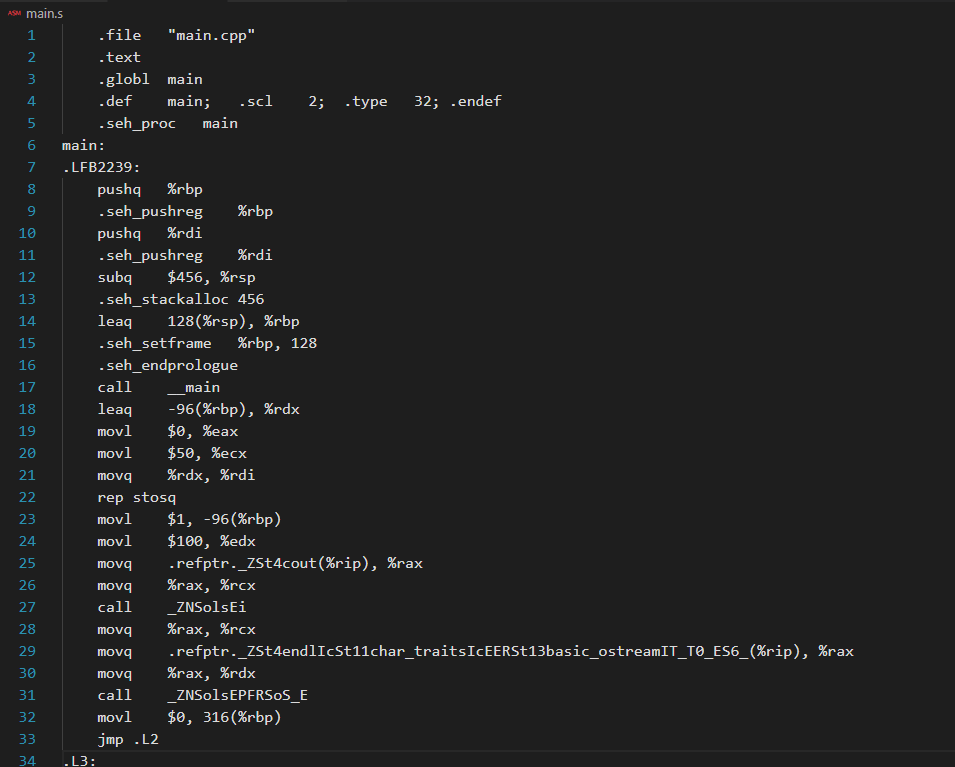

## 汇编

变成机器指令

```c++
g++ -c  main.s -o main.o
```

## 链接

最终变成可执行文件

```c++
g++ .\main.o -o main
```


## 静态库和动态库

### 静态库

静态库制作

```c++
g++ -c .\lib\staticLib.cpp -o staticLib.o  // 生成最终的机器指令
ar rcs staticLib.a .\staticLib.o  // 用这个机器指令生成一个 .a的静态库
```

静态库使用

-L是指定目录 -l是指定静态库名称, 比如下边这个就是链接  lib/staticLib.a

```c++
g++ -o outWithLib main.cpp -Llib -l:staticLib.a
```

静态库的问题：

1. 每次链接都要把静态库代码塞入进程中，如果有多个进程使用了这个静态库，那都会创建一份静态库代码内存
2. 修改静态库需要重写编译main程序

好处是：编译后 程序就可以换个地方运行了（不需要静态库了）


## 动态库

制作 .so 动态库

```c++
g++ -c -fPIC .\lib\staticLib.cpp
g++ -shared -o libshare.so .\staticLib.o
    
// 链接动态库，和静态库方法一致
g++ -o outWithLib .\main.cpp -Llib -l:libshare.so 
```

因为是动态库，所以需要在运行程序时能找到它，需要把动态库放到能找到的位置

# 从汇编理解C++


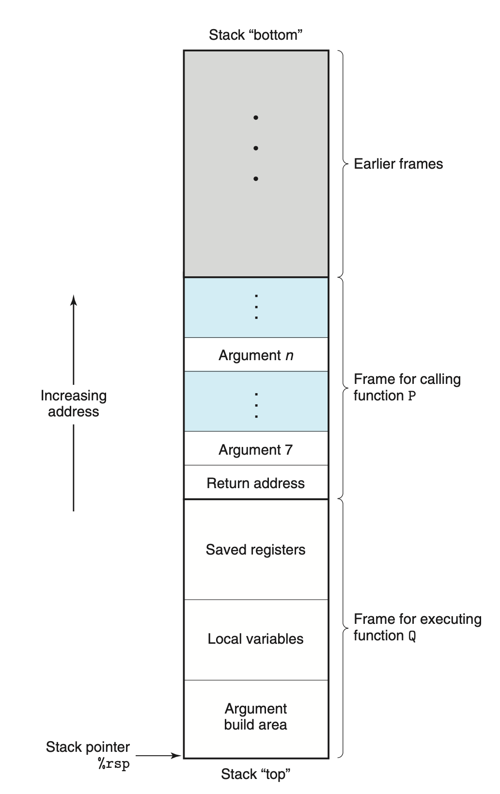

## 基本情况

```c++
int main(){
    return 0;
}

main:
        push    rbp  // 保存上一个栈帧的基地址到栈中
        mov     rbp, rsp  // rsp写入rbp（rbp压栈后，当前栈顶地址rsp会自动更新，所以写入到rbp，作为当前栈帧的基地址）
        mov     eax, 0  // 把立即数0写入eax寄存器，后续用来返回值
        pop     rbp // 恢复上一个函数的rbp（执行后基地址就是上一个函数了）
        ret   // 跳转回调用者（更新pc寄存器，这说明调用者的pc数据也压栈了），回收栈空间
```

1. rbp：栈帧基地址，在一个函数执行的内部，rbp指向的是这个栈帧的基地址，是栈空间中的一个地址
2. rsp： 存储栈顶地址，会自动更新

```c++
int main(){
    int a = 10;
    return 0;
}

main:
        push    rbp
        mov     rbp, rsp
        mov     DWORD PTR [rbp-4], 10   // rbp-4 也就是在rbp的地址上存储了一个立即数
        mov     eax, 0
        pop     rbp
        ret
```

到这里大概懂了 临时变量是如何存储的

```c++
int main(){
    int a = 10;
    int b = a;
    return 0;
}

main:
        push    rbp
        mov     rbp, rsp
        mov     DWORD PTR [rbp-4], 10
        mov     eax, DWORD PTR [rbp-4]   // 读取a，并存入寄存器eax
        mov     DWORD PTR [rbp-8], eax   // 寄存器eax写入rbp-8的位置
        mov     eax, 0
        pop     rbp
        ret
```

## 函数调用

这里也理解了汇编层面上并没有class概念这些抽象概念，都是最基本的操作

```c++
void foo(){

}
int main(){
    
    foo();
    return 0;
}

foo():
        push    rbp
        mov     rbp, rsp
        nop  // 空指令（因为foo函数体无逻辑，编译器填充的占位符）
        pop     rbp
        ret
main:
        push    rbp
        mov     rbp, rsp
        call    foo   // 执行前保存下一条指令的地址（为了调用完成后写入PC指令寄存器）到栈中   另外这里foo已经是具体的指令地址了，在编译链接后已经确定了地址
        mov     eax, 0
        pop     rbp
        ret
```

## 类

```c++
class Person{
    public:
    int a = 10;
};


int main(){
    Person a;
    return 0;
}

main:
        push    rbp
        mov     rbp, rsp
        mov     DWORD PTR [rbp-4], 10   // 说明一个类只存储了成员变量
        mov     eax, 0
        pop     rbp
        ret
```

