+++
date = '2025-12-26T16:49:57+08:00'
draft = true
title = '面试（图形学）'
+++

# TODO:

1. 再捋一下余弦重要性采样的流程
2. 深刻学习RayMarching的性能优化
3. IBL原理捋一遍
4. 弄清楚TAA的解决鬼影的各种细节
5. Vulkan细致过一遍、进一步学习GPU架构
6. GBuffer压缩（https://zhuanlan.zhihu.com/p/479490559里提到的问题）
7. 纹理贴图压缩算法
8. 完成项目的空间加速结构 （八叉树和BVH）https://zhuanlan.zhihu.com/p/696725602
9. 写SSSR 理解RayMarching的各种优化方案
10. ClipMap是什么
11. MVP矩阵捋一遍
12. HIZ遮挡剔除学习

# 图形学

## 图形管线

### 前向渲染VS延迟渲染

> 假设一个非常远的模型有10w个三角形，但是在屏幕上只占据了一个像素，那前向渲染仍然会执行10w次  

## 纹理

### 纹理过滤

> 这个问题就是纹素和像素大小不同（采样的UV不在纹理的纹素的中心）时如何处理

假设有一个Quad的渲染，进行到片段着色器时，每个像素的UV由插值生成，生成的UV坐标不一定正好是对应纹理的每个纹素的中心，所以需要一些手段来处理这个情况

纹理放大：物体距离屏幕过近，UV屏幕中一个像素投影到纹理上小于一个纹素的尺寸，如下图，红色为像素尺寸，黑色为原始纹理

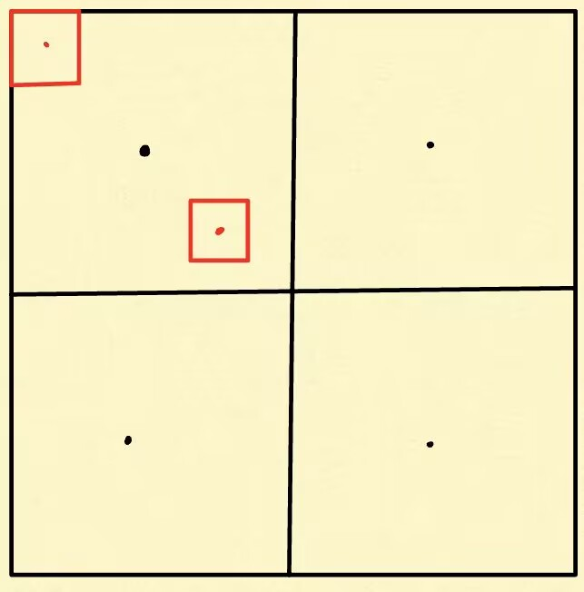

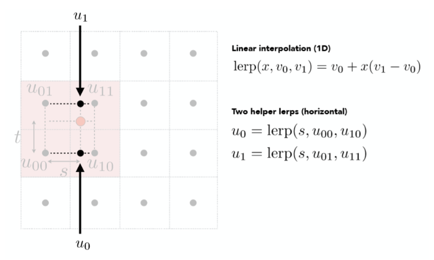

在Vulkan中可选的放大过滤模式 邻近、双线性插值、立方插值（基于立方函数（如 Catmull-Rom）对 4x4 纹素做加权插值）

```c++
typedef enum VkFilter {
    VK_FILTER_NEAREST = 0,
    VK_FILTER_LINEAR = 1,
    VK_FILTER_CUBIC_EXT = 1000015000,
    VK_FILTER_CUBIC_IMG = VK_FILTER_CUBIC_EXT,
    VK_FILTER_MAX_ENUM = 0x7FFFFFFF
} VkFilter;
```

> 已知一个UV，如何求它双线性插值的四个纹素的UV？

先给UV * 纹理尺寸，得到纹素坐标 

```c++
// 这里减0.5是有必要的，让更靠近左上角的点的第一个采样点是更左上角的一个纹素，而不是当前纹素
float x = uv.x * W - 0.5;
float y = uv.y * H - 0.5;

int x0 = floor(x);
int y0 = floor(y);

int x1 = x0 + 1;
int y1 = y0 + 1;

// 4个采样点就是
(x0, y0)
(x1, y0)
(x0, y1)
(x1, y1)
```

纹理缩小：红色框代表像素尺寸，可以看出采样点也可以进行双线性过滤，另外可选的过滤方式在Vulkan中和放大过滤是一样的3种

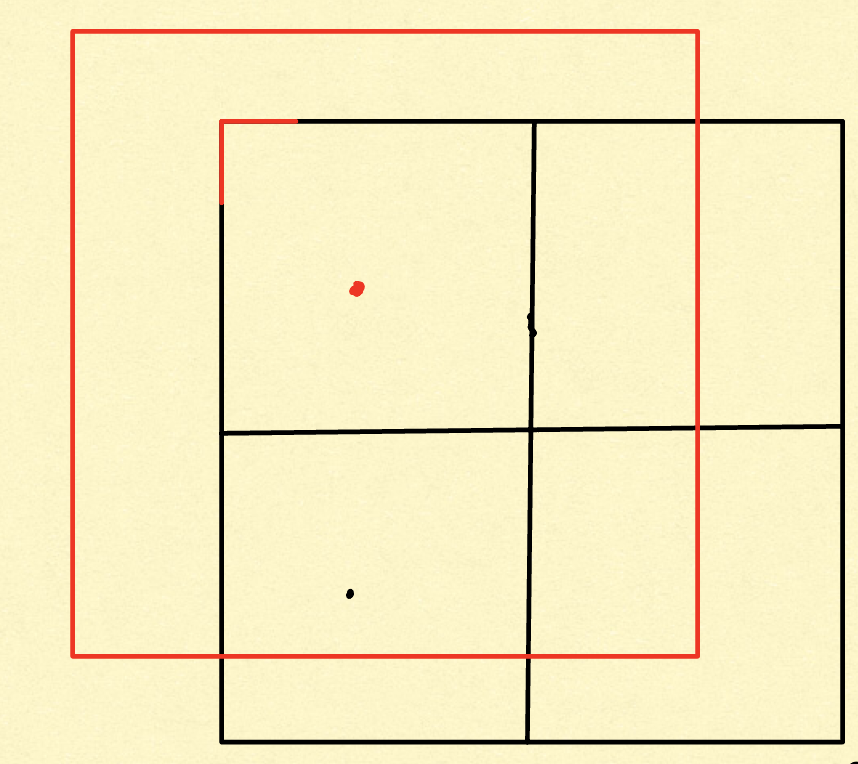

另外采样率过低了，所以会出现走样的情况，就如上边这张图 一个采样点没法完全描述这个像素内的情况

从下图也能看出，一个像素覆盖了纹素很多个，但是一个采样点最多表达4个纹素数据（双线性插值情况下）

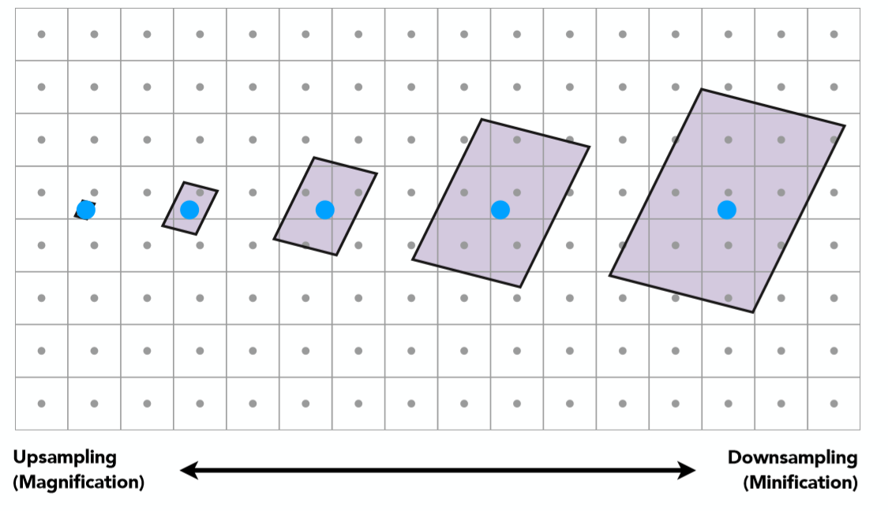

> GPU是怎么知道当前纹理被放大还是被缩小?

```c++
// 片段以 2×2 quad 为单位执行
// 用相邻片段差分： 也就是说算了两个相邻像素的UV差
// 注意不一定是下一个和当前，也可能是上一个，因为4个片段
dFdx ≈ uv(x+1,y) - uv(x,y)
dFdy ≈ uv(x,y+1) - uv(x,y)
```

在GLSL中可以使用dFdx表示这个变量在X方向上的导数，体现了coord在X方向上的变化率

```c++
vec2 dUVdx = dFdx(coord); // 每个分量在 x 方向的变化
vec2 dUVdy = dFdy(coord); // 每个分量在 y 方向的变化

vec2 dx_texel = dUVdx * texSize; // 每个分量变化对应多少 texel
vec2 dy_texel = dUVdy * texSize;
float rho = max(length(dx_texel), length(dy_texel));
// rho > 1 → 放大纹理（screen pixel < texel）
//rho < 1 → 缩小纹理（screen pixel > texel）
```

### Mipmap

> 上面说当缩小过滤时，一个采样点不足以表示像素内的情况，使用Mipmap后采样一次就代表了很多个原始纹素的数据

> 那如何确定使用哪一级Mipmap呢？

1. 首先，我们要计算屏幕空间的像素对纹理空间的导数，也就是“屏幕上沿x/y方向上移动一个像素，会在纹理上的u/v方向上跨越多少个纹素”。
2. 按照上一个问题介绍的算法，计算导数 * 纹理size 并取 XY上的max 得到 rho (可以理解为 像素尺寸和纹素尺寸的比例)
3. 做一个log2，比如rgo = 4时，说明屏幕尺寸是纹素尺寸的4倍，那我就在第2级mip上进行采样
4. 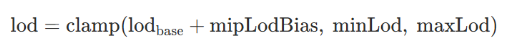可以考虑一个Bias，Bias越大，图形越模糊，因为采样时考虑了更多的纹素（mip层更大)，越小时更尖锐但是更容易走样

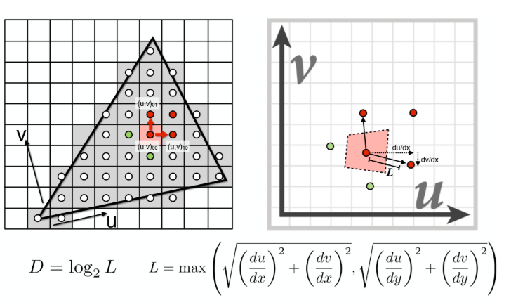

> 如何计算需要多少层Mipmap? 需要把3个维度都压成1需要的次数

```c++
const uint32_t MipSize() const
{
    return (uint32_t)(std::floor(std::log2(std::max(width, std::max(height, depth))))) + 1;
}
```


### 各项异性Mipmap

> 在斜视纹理时，max操作导致mip层级选择要么过大要么过小，所以考虑长/短方向差异，多次采样，方向性 LOD

```c++
float rho = max(length(dx_texel), length(dy_texel));
float lod = log2(rho);
vec4 color = textureLod(tex, UV, lod);
```

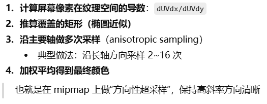

### 纹理压缩

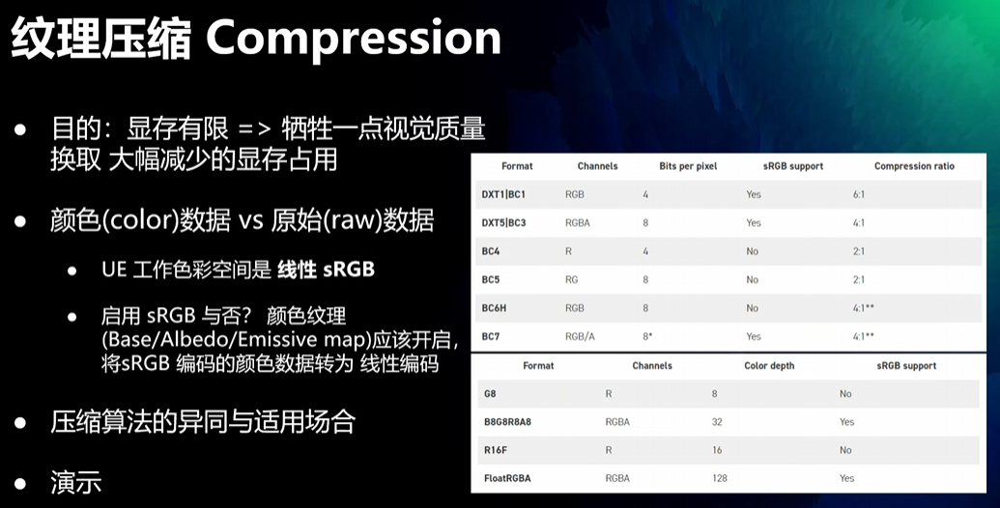

## 抗锯齿算法

> 当光栅化时，像素中心在三角形内部，就通过插值生成颜色，否则就是背景颜色，导致了锯齿
>
> 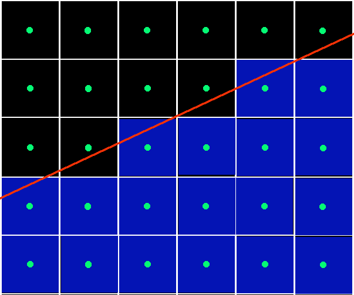
>
> 抗锯齿就是在边界这些像素进行混合颜色
>
> 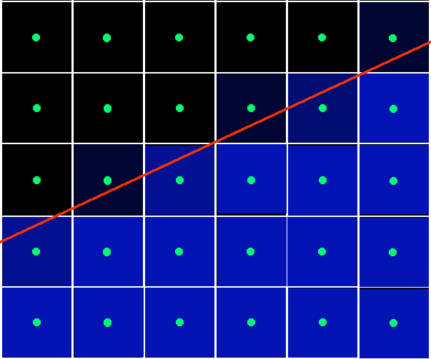

### MSAA

> 每格像素多个采样点，但不是像SSAA那样都采样一次
>
> 1. 先进行covertest（是否在三角形内）
> 2. 多个采样点共享同一个片段着色器计算结果（采样位置是像素中心）
> 3. 每个子像素点下一步还要进行深度模版测试，如果测试通过，就把中像素中心采样的着色结果写入当前次采样点，并更新深度信息（每个子采样点都有自己的深度，来自插值，所以深度贴图也得是多份的）
>
> MSAA的FreamBuffer占用多份，用于存储每个子像素采样点数据，渲染完成后，进行Reslove，就是把4个子采样结果进行平均

#### MSAA为什么不能用在延迟渲染

1. GBuffer又得翻倍
2. 信息存储错误，GBuffer又不是只有颜色贴图，很多贴图存储的都是信息，把这些信息进行MSAA是没有意义的。比如法线信息，一个像素比如一个子像素点覆盖了一个Mesh，另外三个子采样点覆盖了另一个Mesh，这样四个采样点存储了两种法线，在lighing时是没法判断像素中心应该怎么计算法线的，是第一个的？第二个的？还是把他们平均（这样更没有意义），把ID贴图进行MSAA也没有意义

### SMAA

下图是LMAA的流程，SMAA在此基础上进行了优化

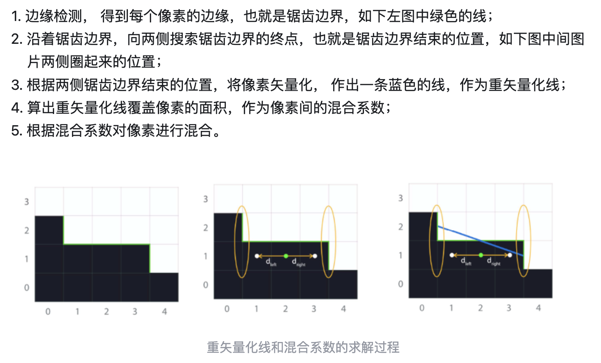

# 实例化

## Instance

> 具有相同Mesh的instance，可以用一次drawcall把他们渲染出来，需要额外准备一个instanceBuffer，存储到VertexBuffer中，在创建pipeline时，绑定到1号点位（Mesh是0号点位），然后设置内部数据的格式，即属性描述（每个数据只支持vec4，所以比如Model矩阵需要分3次上传）。
>
> 在Shader中可以通过instance_id来获取当前的offset（他会每个Mesh步进一次，而不是每个顶点）
>
> 上述技术只支持单种Mesh

## Merge-Instancing

> 将不同的Mesh的顶点和索引合并到一个巨大的VertexBuffer和IndexBuffer中。（Hazel好像就是这么干的）
>
> 然后通过计算得出当前VS是哪个实例的哪个顶点
>
> 具体逻辑就不看了：主要是通过一些手段让VS中确定我是在执行哪个Mesh的哪个顶点的，以及哪个instance


## 详细描述图形管线

1. 应用阶段：执行视锥剔除，查询出可能需要绘制的图元并生成渲染数据，设置渲染状态和绑定各种Shader参数，调用DrawCall

2. 输入装配：从指定的缓冲区中收集原始顶点数据，同时可能通过索引缓冲区重复某些元素，从而避免重复顶点数据本身。

   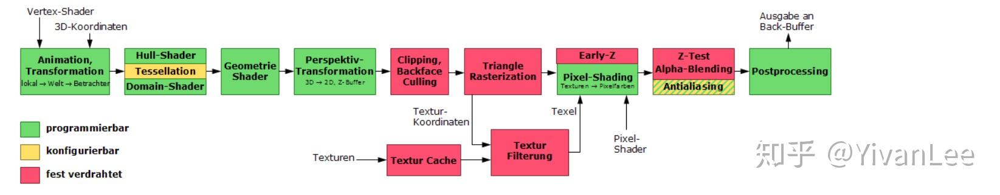


3. 顶点着色器：执行顶点MVP变换，骨骼变换，需要插值的内容都在这里定义

4. 壳着色器（hull shader）、曲面细分器（tessellator）和域着色器（domain shader）：它们可以将当前的顶点集合（通常）转换为更大的顶点集合，从而创建出更多的三角形。场景中的相机位置可以用来决定需要生成多少个三角形：当距离相机很近时，则生成较多数量的三角形；当距离相机很远时，则生成较少数量的三角形。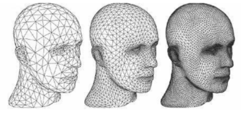

5. 几何着色器：比如顶点爆炸效果，顶点法线可视化效果，把点发射为四边形

6. 流式输出（stream out）：我们可以选择将这些处理好的数据输入到一个缓冲区中，而不是将其直接输入到渲染管线的后续部分并直接输出到屏幕上，这些缓冲区中的数据可以被CPU读回使用

7. 裁剪NDC坐标：在投影变换之后，只有位于标准立方体内部的图元（对应视锥体内部的模型），才需要进行后续处理。因此完全位于标准立方体外部的图元将会被直接丢弃，完全位于标准立方体内部的图元将会被保留。而与标准立方体相交的图元，将会被标准立方体裁剪，即生成一些新的顶点，而位于立方体之外的旧顶点将会被直接丢弃。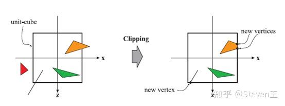

8. 背面剔除：area = cross( v1 - v0 , v2 - v0 ).z   按顺序进入的顶点， 做一个v0-1 和 v0-2的叉积，如果结果为正，就是逆时针

9. 屏幕映射：投影变换之后的图元都位于标准立方体内部，屏幕映射负责找到图元在屏幕上的坐标位置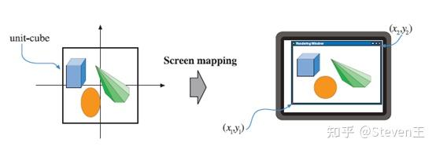

10. 光栅化（三角形设置）：计算出三角形的一些重要数据(如三条边的方程、微分（**如果一个像素一个像素计算 那每个像素都需要计算一次重心坐标，用微分就不需要了**）、深度值等)以供三角形遍历阶段使用，这些数据同样可用于各种着色数据的插值。

11. 光栅化（三角形遍历）：找到哪些像素被三角形所覆盖，并对这些像素的属性值进行插值。通过判断像素的中心采样点是否被三角形覆盖来决定该像素是否要生成片段。通过三角形三个顶点的属性数据，插值得到每个像素的属性值。此外透视校正插值也在这个阶段执行。

12. 片段着色器：e

    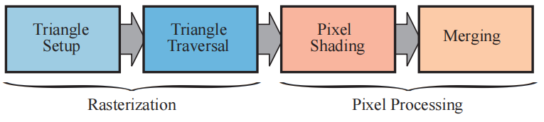

13. 合并：包括各种测试和混合操作，如裁剪测试、透明测试、模板测试、深度测试以及色彩混合等。经过了测试合并阶段，并存到帧缓冲的像素值，才是最终呈现在屏幕上的图像。

## 各种测试(缓冲)的含义，相对顺序

1. Alpha测试
2. 深度测试
3. 模板测试
4. Alpha混合

## 透明渲染

画家算法：一个模型一个模型渲染，但是这样会有如下图的问题，这时候覆盖顺序就会出问题

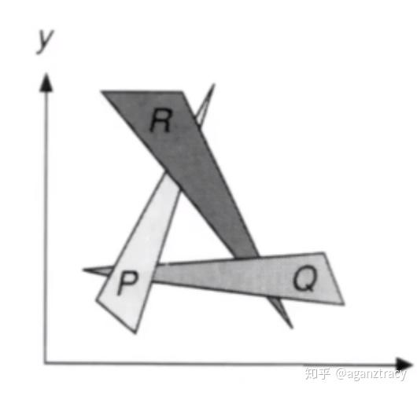

透明渲染的问题：

1. 与不透明物体的混合：比如深度从远到近是C->B->A,  如果先渲染B（透明渲染），此时深度为ZB，再渲染C时因为深度为ZB更近，所以C不会被渲染，导致透明的B内部并没看到后边的C，所以深度缓冲写入透明物体的深度会出问题。**所以渲染透明物体时，要关闭深度写入（如果开启深度写入就会错误），但是保留深度测试，并且必须从后往前渲染(按照从后往前的顺序进行渲染)**

2. 透明物体间交错时的混合：此时如果透明物体都是分离的那就没问题了，但是如上图那种情况，还是不行，因为透明物体交错排布，并不能说明先渲染谁后渲染谁**（可以直接理解为，没法根据整个模型的距离来决定谁在前谁在后，因为可能一半在前一半在后）**，另外透明物体可能自己就是一个交错的结构，也没办法处理

   

解决交错透明的思路：

两个Pass：1. 渲染透明物体的深度 2. 

## discard（Alpha测试）导致Early-Z失效、PreZ

> 一直对Alpha测试有误解：它是一个非0即1的透明测试，不通过就直接全透明了，和透明度混合没有关系的
>
> Early-z是把深度测试放在片段着色器之前执行，而Alpha-Test需要在片段着色器中判断透明度来进行discard
>
> **网上关于为什么的说明很少，都是假装提一句，其实根本不知道为什么**，真正导致失败的不是Early-Ztest，而是深度写入的时机，如果EarlyZ通过了立即写入深度，那就会出问题，因为后续这个深度值可能被Discard，深度图是错误的！
>
> 使用PreZ来解决这个问题，提前一个Pass渲染深度和AlphaTest，得到的深度图就是带有AlphaTest结果的深度图
>
> 另外PS中有UVA的写入也会导致失效，毕竟并不知道UVA是要干啥，深度测试失败也不一定就是不写入，所以不能不执行


## 阴影贴图

> 在片段着色器中把Mesh的顶点通过灯光设置好的viewProj转到光空间，只需要设置深度贴图，渲染出在灯光视角下离光源最近的深度信息

> 把一个Mesh转移到光空间下的深度值是连续的，但是ShadowMap是离散表达，所以出问题了
>
> 阴影抖动问题：如下图，同一个平面，因为深度贴图的分辨率有限，不同深度位置最终使用同一个深度像素位置，就会有一部分因为深度值大于阴影贴图的深度而被认定为在阴影中
>
> 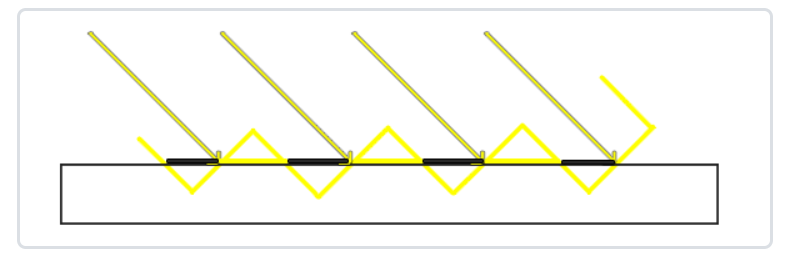
>
> 解决方法是给阴影贴图+Bias
>
> 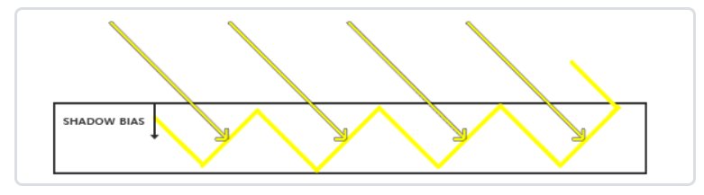
>
> 更进一步Bias可以做到自适应大小，阳光越倾斜，Bias越大`float bias = max(0.05 * (1.0 - dot(normal, lightDir)), 0.005);`
> 但是加上偏移后让本来就应该在阴影的区域变成不在阴影中，比如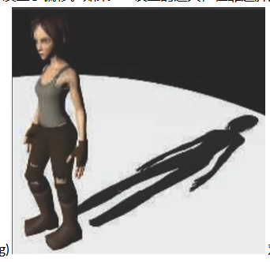，解决思路是渲染贴图时使用正面剔除，让深度图存储的是模型最远处，相当于自适应的给不同的深度图位置加了一个bias（光源从正面到背面之间的距离为bias)，而不是固定的bias

> 软阴影：
>
> PCF：对一个着色点计算阴影时考虑周围像素的阴影计算结果，进行一个平均，达到软阴影效果（采样可以使用泊松分布采样）
>
> PCSS: PCSS的关键思想是**从阴影接受处往光源看去，与遮挡物之间距离越远时，阴影越软**。如下图所示
>
> 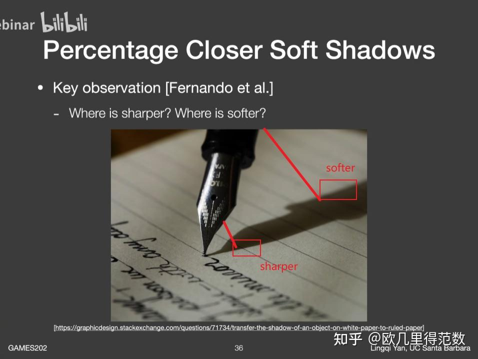
>
> PCSS的流程：相当于一个自适应的PCF。遮挡物离着色点越近，PCF搜素半径越小
>
> 1. 计算着色点与光源之间遮挡物的平均深度：（多大范围内搜索呢？）用一个相似三角形判断搜索半径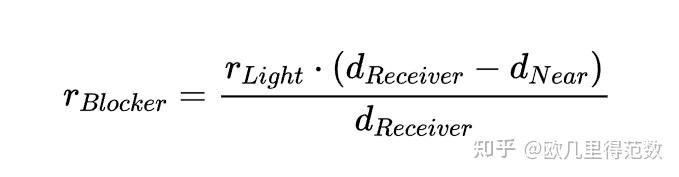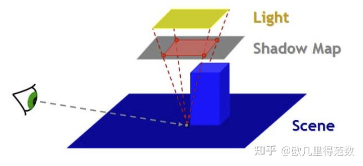
>
> 得到搜素半径后，采用泊松分布在这个半径范围内进行采样，累积深度值，最后取平均作为遮挡物的平均深度
>
> 2. 评估半影范围：也是一个相似三角形的计算（从这里也能看出Blocker离Receiver越近，PCF的范围就越小）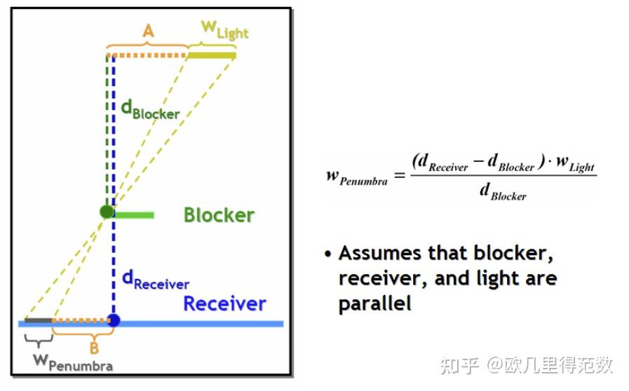
> 3. 用上一步得到的半影范围作为PCF的范围进行PCF计算

> VSM：对于PCF操作步骤：所有采样点比ShadowMap值小的就是没阴影，大的就是有阴影这样的操作，可以直接用概率论来解决，没必要真的遍历周围的像素（另外采样就会有噪点）。只需要存储一片区域的深度与深度的平方，

## 切线空间、法线贴图的使用方法


## 齐次坐标的意义

## 透视除法的意义


## MVP矩阵

> 将三维图形所有顶点都做相同变换就等价于对三维图形图形做了同等变换

1. 缩放

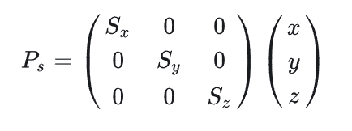

2. 旋转

可以分解为绕XYZ分别旋转、罗德里格斯旋转公式、也可以用四元数

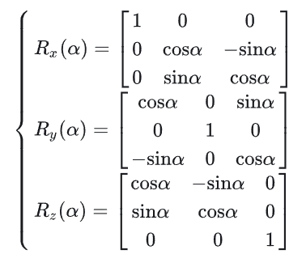

罗德里格旋转公式是描述「任意向量绕任意过原点的轴 n 旋转 $\alpha$ 角」的通用公式

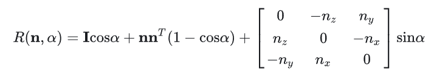


3. 平移

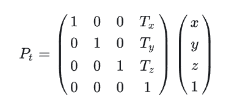

要按照缩放->旋转->平移的顺序进行

从Model矩阵也可以分离出三个分量：1. 平移很好处理 2. 旋转和缩放分离依靠一个性质：旋转是正交矩阵（行列向量都是单位向量），加上缩放就不是单位向量了，所以每个行向量的length就是缩放值

4. View

> 把空间坐标转到View空间，坐标原点就是摄像机，以摄像机参数构建一个正交坐标系
>
> 把世界空间坐标系移动到摄像机位置的过程中，顶点其实做的是逆变换（举几个例子就能理解， 比如世界坐标系原点向右移动一格，那原本(1,0,0)这个点，在新的坐标系下就是（0，0，0）向左移动了一格）。  **根据这个原理：把顶点转移到View空间的坐标变换就等价于 把摄像机移动到世界空间原点的流程**，把这个移动总结成一个矩阵，作用在世界坐标系下的顶点上即可

推导流程：

1. 顶点平移：假设摄像机在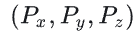,其他顶点可以通过下面的矩阵来转移到View

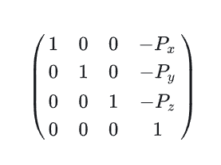

2. 构建正交坐标系：

   1. 指定看向的方向
   2. 规定一个Up方向（glm默认是Y-Up），现在就有两个垂直的向量了
   3. 两个向量叉乘算出第三个坐标系
   4. 因为手动指定的dir和Up并不需要一定正交，所以用第三个坐标系叉乘Dir来修正Up

   ```c++
   template<typename T, qualifier Q>
   GLM_FUNC_QUALIFIER mat<4, 4, T, Q> lookAtRH(vec<3, T, Q> const& eye, vec<3, T, Q> const& center, vec<3, T, Q> const& up)
   {
       vec<3, T, Q> const f(normalize(center - eye));
       vec<3, T, Q> const s(normalize(cross(f, up)));
       vec<3, T, Q> const u(cross(s, f));
   
       mat<4, 4, T, Q> Result(1);
       Result[0][0] = s.x;
       Result[1][0] = s.y;
       Result[2][0] = s.z;
       Result[0][1] = u.x;
       Result[1][1] = u.y;
       Result[2][1] = u.z;
       Result[0][2] =-f.x;
       Result[1][2] =-f.y;
       Result[2][2] =-f.z;
       Result[3][0] =-dot(s, eye);
       Result[3][1] =-dot(u, eye);
       Result[3][2] = dot(f, eye);
       return Result;
   }
   ```

3.  旋转坐标系

目的是把摄像机构建的三个坐标系方向旋转到世界空间的XYZ轴

看向方向 -> -Z轴

Up方向 -> Y轴

右方向 -> X轴

这里可以再反转一下，把标准化的XYZ轴旋转到摄像机的三个轴上计算更简单，进一步因为旋转矩阵是正交矩阵，转置就是逆，很容易求出逆变换的矩阵


############################ 打住：其实可以不用绕来绕去############################ 

世界空间转视图空间，其实就是变基的操作

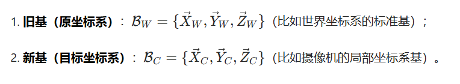

在两个正交基下应该表示的是同一个向量（三个坐标系向量的线性组合），从而构建等式

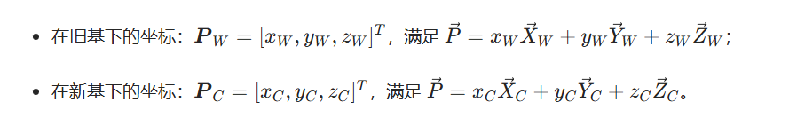

View矩阵就是求下面这个M矩阵的逆矩阵（因为这是正交矩阵，所以逆等于转置）

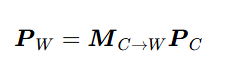

下面就是把一个世界空间顶点转到View空间的矩阵MT

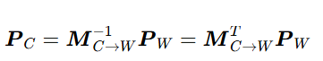

实际用的时候是这样直接创造View矩阵

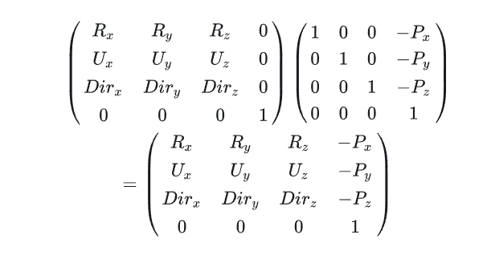

4. 投影矩阵

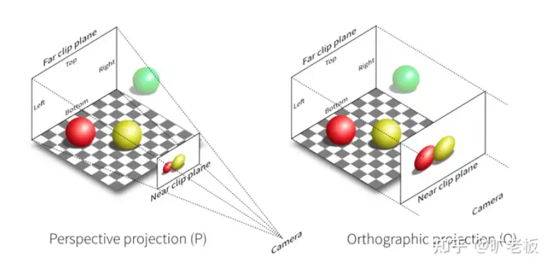

透视投影为了近似眼睛成像，目的是把一个锥形范围内的点都投影到Near平面范围内

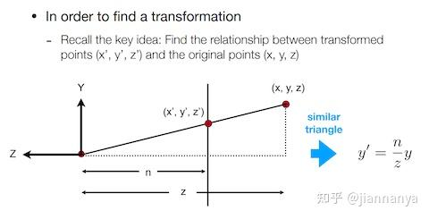根据相似三角形原理，挤压远平面之后的 x 和 y 都与 z 值成比例关系

所以XY的变换通过上述的相似三角形来计算（**并且把齐次坐标同时*z，这里乘啥都不会改变点的位置，乘z是方便计算，所以透视矩阵不一定形式都一模一样，毕竟还可以乘-z**）

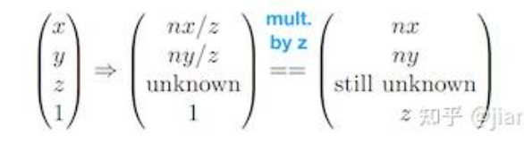

把这种变换写成矩阵变换形式就是，也就是说下面这个矩阵乘以 原坐标，就是透视投影后的坐标

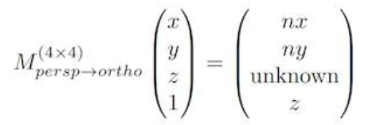

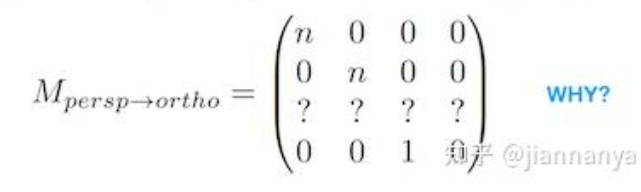

因为深度和XY无关，所以第三行计算时 应该是(0,0,A,B)

开始用一些特殊点来求解AB，在近平面上的点XYN，投影后深度仍然是N

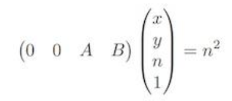

远平面上的点投影后深度仍然是f

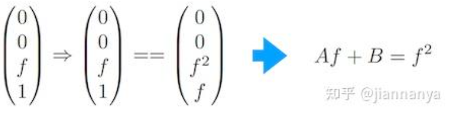

很简单就能求出来

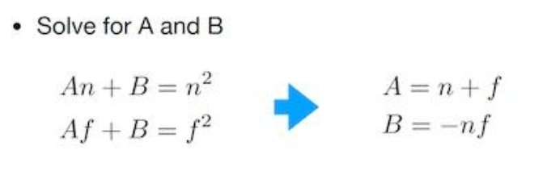

所以透视过程可以总结为下面这个透视矩阵

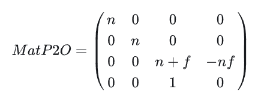


正交投影很简单，把规定好的上下左右前后范围的长方形盒子压成NDC空间，就是做一下缩放和平移即可

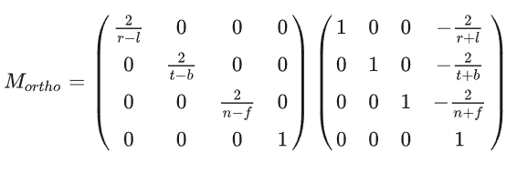


结合透视+正交，就把顶点转移到了NDC空间

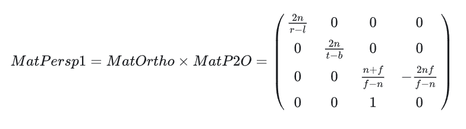

## 为什么使用反向Z


从透视矩阵可以得出 ViewSpace的Z和ClipSpece的Z的关系

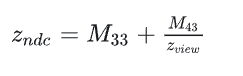

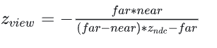


反转后

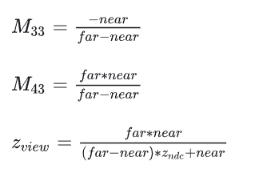

实际代码可以Far和Near反着传递，同时修改M33 * -1 即可


下图为正向Z的NDC深度均匀变化时ViewSpace深度的变化，由图可知深度高的地方都在ViewSpace很近的地方（因为大部分NDCZ都对应到这块区域）

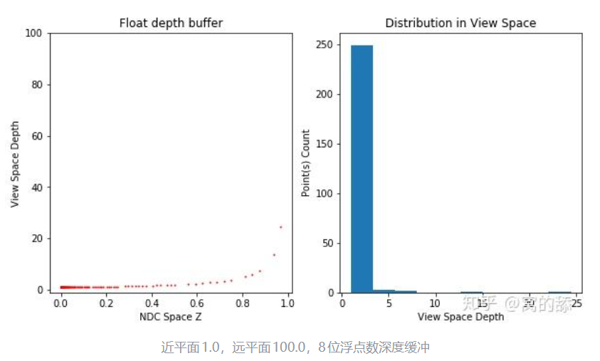

反向Z后，使用浮点数加上反向z时，突然好起来了。在View Space的各个距离上都分布了有效的深度值。


反转Z后，精度聚集在远处，这个很好理解，但是近处的精度并没有降低，这个需要从浮点数的精度来考虑

浮点数在解决0的地方精度更高，所以抵消了部分因为深度精度低的问题

为什么浮点数在0附近精度高？（也就是能表示的数据更多）

在0附近最后一位+1，数值变化很小，比如 从  0.12345 -> 0.12346   变化 0.00001

但是 100000的最后一位加1，数值变化很大

比如 12345 -> 12346   变化了1（浮点数在这里没法表示变化0.00001）因为底数位数有限


## 延迟渲染和延迟光照

延迟光照：

1. 第一个Pass叫Geometry Pass：只输出每个像素光照计算所需的几何属性（法线、深度）到GBuffer中。

2. 第二个Pass叫Lighting Pass：存储光源属性（如Normal*LightDir、LightColor、Specular）到LBuffer（Light Buffer，光源缓冲区）。

3. 第三个Pass叫Secondary Geometry Pass：获取GBuffer和LBuffer的数据，重建每个像素计算光照所需的数据，执行光照计算。

   与Deferred Shading相比，Deferred lighting的优势在于G-Buffer所需的尺寸急剧减少，允许更多的材质类型呈现，较好第支持MSAA等。劣势是需要绘制场景两次，增加了Draw Call。

## 裁剪技术

> 与渲染相关的裁剪技术，常见的有背面裁剪（Backface Culling），视锥裁剪（View Frustum Culling），以及遮挡裁剪（Occlusion Culling，也常常称作遮挡剔除）


利用BVH进行视锥裁剪，如果一个层级全部在视锥内，就直接全部渲染子节点即可，如果只是相交，就继续遍历子结点


遮蔽剔除


遮挡剔除时，对于一个Mesh的包围区域，如果用原始深度图的话，需要一个像素一个像素遍历，除非所有像素都在深度缓冲之后，才剔除这个Mesh，效率低下，

其实只要比较这一大片深度区域的最小值（离屏幕最近）


直接用Mip这一层，代表这一大片区域中深度的最小值，如果Mesh的深度比这个深度都小，那就通过测试，避免了大量计算


## 切线空间与法线贴图

> 法线贴图是使用RGB纹理来存储法线的XYZ，表达每个顶点的法线值，但是存储在法线贴图中的法线是定义在切线空间下的，着色器中需要世界空间下的法线时，通过TBN矩阵来转换切线空间法线到世界空间。
>
> 同时顶点本身也携带它自己的法线，法线贴图中的法线是专门调整过的法线，它并不是顶点的法线数据，用于达到不同的光照效果、凹凸效果

切线空间的三个轴，注意这里的法线是指顶点的原始法线，而不是法线贴图中的数据


如下图三角形，N1是模型法线，N1'则是人为扰动的法线贴图的法线

z轴是确定的，就是N1（模型法线），xy坐标轴则选用UV轴


切线空间转世界空间其实也是同View矩阵一样的基变换，使用的等式就是向量在两个空间中是同一个向量，即BA = B'A'(A和A‘表示该向量在两个坐标基下的坐标，B表示基向量)

最终推导出来就是  给切线法线前边乘以（TBN）矩阵，就可以得到世界空间法线

> 总结：
>
> 1. 顶点着色器导入顶点法线和切线
> 2. 使用Model的逆转矩阵得到时间空间的顶点法线和切线，并计算副切线
> 3. FS中读取切线空间法线（注意范围从0-1 还原到-1-1），左乘(TBN)矩阵，得到最终的世界空间法线

为什么法线贴图都是蓝紫色：法线贴图呈现**蓝紫色（偏青蓝 / 淡紫）** 是**切线空间法线贴图的视觉特征**，核心原因是：**平坦表面的切线空间法线为\**(0,0,1)\**，映射到纹理存储的\**[0,1]\**范围后对应 RGB\**(0.5,0.5,1)\**，这是纯正的天蓝色 / 青蓝色；而实际法线贴图的微细节会让 x/y 轻微偏移，最终呈现蓝紫 / 青蓝调**，再加上美术制作 / 纹理压缩的细微偏差，就形成了大家看到的经典蓝紫色外观。

# 全局光照

# 光线追踪

## 包围盒

### 包围盒的种类和创建

AABB

创建方法：遍历所有顶点的XYZ来更新AABB的min和Max即可


OBB（需要定义三个相交的轴，已经三个轴上的距离）

创建方法：（PCA都出来了，不过AI说商业引擎是通过AABB旋转的来的）

1. 用 PCA（主成分分析）算 OBB（标准解）
2. 把所有点投影到这 3 个轴上分别维护 min/max


k-DOP:两个顶点和一条法线定义一个平面，DOP同时维护很多个平面

创建方法：将顶点投影到k-DOP的每个法线$\mathbf{n}_i$上，并将这些投影极值$(\min,\max)$存储在$d^i_{min}$和$d^i_{max}$中


球包围盒：

创建方法：

- AABB的中心和Extend的Max做圆心和半径

- 或者重新遍历所有顶点，找离圆心最远的


## 相交测试

### 判断点在三角形内

方法一：面积法

分别连接P与任意两个三角形顶点。  3个三角形的面积和 = 原三角形面积

三角形面积计算使用叉乘：


方法二：叉乘法

点与任意两个顶点（按顺时针或逆时针，并不是任意选取）组成的两个法线叉乘都应该在同一测

方法三：同侧法

点P在三角形内，那P应该在三条边的同侧


### 射线与球包围盒

t是未知数，解一元二次方程即可


除了数学上的优化点，还有一个优化点是提前判断射线与（起点和圆心连线）的dot，小于0，并且起点不在圆内部，就直接拒绝测试

### 射线与AABB

三个轴单独计算，最后取交集，然后根据逻辑来判断各种情况

```c++
		bool IntersectsAABB(const AxisAlignedBox& aabb, float& t) const
		{
			glm::vec3 invD = 1.0f / Direction;
			glm::vec3 t0 = (aabb.GetMinCorner() - Origin) * invD;
			glm::vec3 t1 = (aabb.GetMaxCorner() - Origin) * invD;
			glm::vec3 tmin3 = glm::min(t0, t1);
			glm::vec3 tmax3 = glm::max(t0, t1);
			float tmin = glm::compMax(tmin3);
			float tmax = glm::compMin(tmax3);
			// if tmax < 0, ray (line) is intersecting AABB, but the whole AABB is behind us
			if (tmax < 0)
			{
				t = tmax;
				return false;
			}
			// if tmin > tmax, ray doesn't intersect AABB
			if (tmin > tmax)
			{
				t = tmax;
				return false;
			}
			t = tmin;
			return true;
		}
```

### 射线与平面


联立即可，如果只是判断Bool，那直接dot（法线，射线方向）

注意dot结果不是==0，而是< Epsilon（因为浮点数误差）

### 射线与三角形

方案一：先判断射线与三角形所在平面相交，再判断交点在三角形内部

方案二：Moller Trumbore

三角形的重心坐标复习一下


三角形可以用重心坐标来定义，如下这个显式方程


联立这个方程和射线方程（三个未知数 t u v），因为这些已知的参数本身就是3维的，所以三个未知数三个方程，可解


### 平面与AABB

方法一：两侧法

遍历AABB的8个顶点，带入平面方程，如果结果有正有负，说明顶点分布在平面两侧，那自然就是相交了

方法二：类似SAT


第三步直接取绝对值就是最长的半对角线e，避免了8次运算


### 三角形与三角形

方法一：如果两个三角形相交，必定至少其中一个三角形的一条边穿过了另一个三角形的内部；把边当作光线去跟另一个三角形求交，如果三条边只要有一条边跟三角形有交点，即可判断两三角形相交，当然关键是要判断计算出来的t是否合理，是否位于边长范围之内。

方法二：TODO(https://www.wolai.com/e4qUfqmE2gaTaMmahe4odJ)

思路就是：如果两个三角形相交，那在平面相交的这条线上的点也会有交集，否则就不相交


## 空间加速结构

- 层次包围盒（Bounding Volume Hierachy，BVH）
- 二元空间分割树（Binary Space Partitioning，BSP）
- 四叉树 （QuadTree）
- kd树（k-dimensional tree）
- 八叉树（Octree）
- 场景图 （Scene Graphs）

1. Bounding Volume Hierarchies, BVH：

也就是从下往上构建，两个包围盒合并后组成父节点，一层一层向上最终Root包围盒包含了整个场景的范围


2. BSP树 Binary Space Partitioning Tree 二叉空间分割树

> 类似于画家算法，BSP树可以方便地将表面由后往前地在屏幕上渲染出来，特别适用于场景中对象固定不变，仅视点移动的情况。


3. 八叉树 | Octrees


4. 场景图


# 数学

## 叉乘和点乘


## PBR

### 如何理解BRDF

> BRDF用于表达从某个方向射到着色点的Radiance，对视角方向的贡献大小
>
> 所以控制BRDF的参数为光源方向（或弹射光）、视角方向、着色点的材质，调整BRDF的数学模型，本质就是调整着色点的材质

### 法线分布函数

> 用于建模微表面法线朝向半程向量的占比
>
> 朝向半程向量的越多，半程向量越接近法线方向时，镜面反射越强
>
> DDX使用粗糙度来调控占比，在计算时传入粗糙度、半程向量、法线方向就可以直到当前情况下的镜面反射强度，作为cooktrance的一个调控参数

### 菲涅尔项

> 反射与折射的比例是与观察角度有关的，法线与观察角度的夹角越大，反射越强
>
> 另外由于不同的材质会影响这个比例，也就是影响F0，F0表示垂直入射时的反射强度，电介质是0.04，然后用金属度来调控F0，`vec3 F0 			= mix(vec3(0.04f), albedo, metallic); `
>
> 最终计算菲涅尔项时，还要考虑粗糙度，粗糙度影响掠射角度下的值，如果没有粗糙度，90°带入结果肯定是1

### 几何项

> 用于描述微表面的自阴影：有两种1. 视线被遮挡 2. 光线被反弹
>
> 几何是由上述两种自阴影情况的GGX来调控，最终由粗糙度来调控GGX，合并为Smith方程


# Vulkan

## MipMap生成

> vkCmdBlitImage其实只是一个图像拷贝函数，但是他会自动处理过滤

```c++
void BlitTexture(VkCommandBuffer commandBuffer,
	RHITextureRef src, RHITextureRef dst,
	TextureSubresourceLayers srcSubresource, TextureSubresourceLayers dstSubresource,
	FilterType filter)
{
	VkImageSubresourceLayers srcLayer = VulkanUtil::SubresourceToVk(srcSubresource);
	VkImageSubresourceLayers dstLayer = VulkanUtil::SubresourceToVk(dstSubresource);

	uint32_t srcMip = srcSubresource.mipLevel;
	uint32_t dstMip = dstSubresource.mipLevel;

	VkImageBlit blit = {};

	// offset表示源图像的区域范围和目标图像的区域范围
	blit.srcOffsets[0] = { 0, 0, 0 };
	blit.srcOffsets[1] = { (int32_t)(src->GetInfo().extent.width / pow(2, srcMip)),
							(int32_t)(src->GetInfo().extent.height / pow(2, srcMip)), 1 };
	blit.srcSubresource = srcLayer;

	blit.dstOffsets[0] = { 0, 0, 0 };
	blit.dstOffsets[1] = { (int32_t)(dst->GetInfo().extent.width / pow(2, dstMip)),
							(int32_t)(dst->GetInfo().extent.height / pow(2, dstMip)), 1 };
	blit.dstSubresource = dstLayer;

	vkCmdBlitImage(commandBuffer,
		CAST<VulkanRHITexture>(src)->GetHandle(),
		VK_IMAGE_LAYOUT_TRANSFER_SRC_OPTIMAL,
		CAST<VulkanRHITexture>(dst)->GetHandle(),
		VK_IMAGE_LAYOUT_TRANSFER_DST_OPTIMAL,
		1,
		&blit,
		VulkanUtil::FilterTypeToVk(filter));
}
```

完整的生成函数，先把要生成的区域全部设置为DST，然后生成一层，就把这层设置为SRC，最终结束后整个图像都是SRC布局下

```c++
void VulkanRHICommandContext::GenerateMips(RHITextureRef src)
{
	//总计生成的mip层数
	uint32_t mipLevels = src->GetInfo().mipLevels;

	VkImageSubresourceRange transition = {};
	transition.aspectMask = VK_IMAGE_ASPECT_COLOR_BIT;
	transition.baseMipLevel = 0;
	transition.levelCount = 1;
	transition.baseArrayLayer = 0;
	transition.layerCount = 1;

	for (uint32_t i = 0; i < src->GetInfo().arrayLayers; i++)
	{
		transition.baseMipLevel = 0;
		transition.baseArrayLayer = i;

		// 1. 先将后面的层全设置到dst
		TextureBarrier(
			{ src,
			RESOURCE_STATE_TRANSFER_SRC, RESOURCE_STATE_TRANSFER_DST,
					{TEXTURE_ASPECT_COLOR, 1, mipLevels - 1, transition.baseArrayLayer, transition.layerCount} });

		//循环生成各级mip，并将对应层级转到srcLayout
		for (uint32_t i = 1; i < mipLevels; i++)    //总共mipLevels级，只需要mipLevels-1次blit
		{
			BlitTexture(
				handle,
				src,
				src,
				{ transition.aspectMask, transition.baseMipLevel, transition.baseArrayLayer, transition.layerCount },
				{ transition.aspectMask, transition.baseMipLevel + 1, transition.baseArrayLayer, transition.layerCount },
				FILTER_TYPE_LINEAR);

			// 将生成后的层级设置到src
			TextureBarrier(
				{ src,
				RESOURCE_STATE_TRANSFER_DST, RESOURCE_STATE_TRANSFER_SRC,
						{TEXTURE_ASPECT_COLOR, transition.baseMipLevel + 1, 1, transition.baseArrayLayer, transition.layerCount} });

			transition.baseMipLevel++;
		}
	}
}
```

# 项目相关

## TinyRenderer

> CPU渲染器的核心流程1. 读取模型（即获取每个需要渲染的三角形） 2. MVP+viewport变换后转移到屏幕坐标（此时每个三角形拥有了屏幕坐标+深度信息) 3. 光栅化

渲染一个三角形的流程：

1. 计算包围盒

```c++
float ax = triangle.screenCoords[0].x();
float ay = triangle.screenCoords[0].y();
float bx = triangle.screenCoords[1].x();
float by = triangle.screenCoords[1].y();
float cx = triangle.screenCoords[2].x();
float cy = triangle.screenCoords[2].y();
int bbminx = std::floor(std::min(std::min(ax, bx), cx));
int bbminy = std::ceil(std::min(std::min(ay, by), cy));
int bbmaxx = std::floor(std::max(std::max(ax, bx), cx));
int bbmaxy = std::ceil(std::max(std::max(ay, by), cy));
```

2. 背面裁剪

> 方法是叉乘判断正负号，原理是变换后的三角形的三个顶点可能是顺时针也可能逆时针

```c++
float total_area = signed_triangle_area(ax, ay, bx, by, cx, cy);
if (total_area < 1) return;
```

3. 遍历包围盒

```c++
for (int x = bbminx; x <= bbmaxx; x++) {
    for (int y = bbminy; y <= bbmaxy; y++) {
        
        // 1. 剔除坐标在屏幕外，本质是NDC坐标不在-1，1之间
        if (x < 0 || x >= width || y < 0 || y >= height) continue;
        
        // 2. 判断（x,y）是否在三角形内部（使用方法为求重心坐标，重心坐标必须都大于0）
        float alpha = signed_triangle_area(x, y, bx, by, cx, cy) / total_area;
        float beta = signed_triangle_area(x, y, cx, cy, ax, ay) / total_area;
        float gamma = signed_triangle_area(x, y, ax, ay, bx, by) / total_area;
        if (alpha < 0 || beta < 0 || gamma < 0) continue;
        
        // 3. 属性插值（就是用三个顶点的数据作为基，重心坐标作为参数的线性组合，重心坐标可以理解为在某一点上三个顶点的贡献权重，这确实可以反应到上述三个三角形的面积上，因为面积越大，说明越靠近某个顶点，权重越大）
        float barycentricZ = interpolate(triangle.screenCoords[0].z(), triangle.screenCoords[1].z(),triangle.screenCoords[2].z(), alpha, beta, gamma);
Eigen::Vector3f barycentricGlobalCoord = interpolate(triangle.globalCoords[0].head<3>(),triangle.globalCoords[1].head<3>(),triangle.globalCoords[2].head<3>(), alpha, beta,gamma);
float texU = interpolate(triangle.texCoords[0].x(), triangle.texCoords[1].x(),triangle.texCoords[2].x(), alpha, beta, gamma);
float texV = interpolate(triangle.texCoords[0].y(), triangle.texCoords[1].y(),triangle.texCoords[2].y(), alpha, beta, gamma);
        
        // 4. 深度测试
        if (zBuffer->at(x).at(y) < barycentricZ) {
    zBuffer->at(x).at(y) = barycentricZ;
        
        // 5. 着色
        framebuffer.set(x,y, blinnPhongShading(texColor,barycentricGlobalCoord,barycentricNorm,specKd,isShadow));
        }
    }
```

## 渲染器

### 光源与阴影

#### PCF及其优化

> 在写这里之前，一直以为PCF就是取周围像素然后取平均（Box滤波器），其实在Unity中有更好的滤波器（**四棱锥型分布滤波（TentFilter）**）实现


很好理解，离中心越近权重线性增加


TODO: 进一步实现上还涉及到什么每个纹素中等腰三角形的面积占比作为权重值，来计算TentKernel的权重，不是很懂了


### RHI


#### 1. descriptorPool和descriptor是怎么管理的

> descriptorPool 全局只有一个，由VulkanDynamicRHI管理
>
> RDGExecute时，会根据这个Pass连接的资源的边的资源描述去创建对应的资源描述符（定义资源时会记录存入这个资源会放在哪个Set哪个Binding中） 
>
> 资源描述符集的缓存的hash的计算方式是根据当前pass的根签名 + set是哪个来做Hash，hash算法生成主要用murmurHash直接对内存数据进行Hash
>
> （资源描述符池需要3个，因为这一帧修改资源描述符，上一帧可能正在渲染）

#### 2. commandpool怎么管理

> 每个RHICommandContext创建时就会带一个自己的pool

#### 3. 为什么叫DynamicRHI

> 因为在启动程序后才能决定内部到底是哪个图形API

#### 4. 多Queue可以在哪里入手

> RHICommandList收集好指令后，其实可以选择提交到不同的Queue
>
> commandPool是绑定queue的

#### 5. RHICommandList的作用

> RHI层执行渲染指令都是在这一层，他会调用底层RHICommandContext的指令来把命令存储在commandBuffer中，或者自己先存储，然后统一添加到CommandBuffer中。 
>
> 所以本质就是对CommandBuffer填装过程的封装
>
> 所以我的多线程设计是把commandBuffer填装和Submit的的过程放在另外一个线程执行
>
> ​		rdgBuilder.Execute();会收集command到commandList或者直接到commandBuffer（取决于bypass）

## 间接渲染

> 目前看到 三角形背面剔除也可以GPUDriven，避免MeshPass执行这些背面的三角形（减少后续VS的执行，毕竟光栅化阶段才会进行背面剔除）

## IBL

### 漫反射部分

>  当我要计算着色点的漫反射时，只需要法线半球上进行光照 * cos的积分 最后乘以albedo/pi即可
>
> 所以提前对cubemap中所有的法线进行一个半球积分，预计算后 * albedo就是漫反射
>
> computeShader使用流程：
>
> 1. 因为漫反射是低频信息，所以只需要32 * 32 * 6的cubemap来存储
> 2. 每个像素代表一个法线方向
> 3. 使用低差异序列工具，生成采样点数量个二维UV坐标([0-1]之间)
> 4. 用地差异序列配合余弦重要性采样生成一个采样点的切线空间法线（因为整个随机采样过程，并没有当前的法线参与）
> 5. 利用当前法线的坐标系把切线空间采样方向转到世界空间
> 6. 利用世界空间采样方向去采样CubeMap，所有采样点采样完成后用蒙特卡洛积分工具计算最终结果存储到像素

利用一个法线方向生成切线空间基向量时，可以假设一个(0,1,0)来cross，然后生成一个垂直于N的向量，但是如果N接近0,1,0时就会出问题，所有需要用if，在Shader中这样优化

```c++
T = cross(N, vec3(0.0, 1.0, 0.0));
T = mix(cross(N, vec3(1.0, 0.0, 0.0)), T, step(Epsilon, dot(T, T)));
```

用一个变量的0或者1来分支，可以用mix来代替

两个变量大小的比较用step来代替

### 镜面反射部分

# 路径追踪

## 余弦重要性采样

>  在Lambert表面上，cos越大，贡献越大，所以使用余弦重要性采样，让采样方向靠近法线的概率更大
