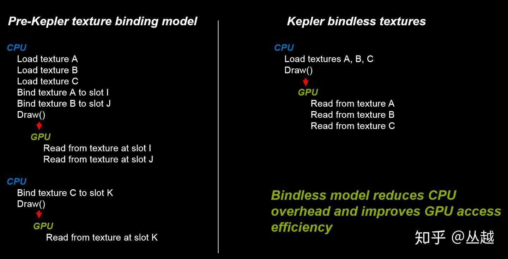

+++date = '2025-11-21T13:33:36+08:00'
draft = false
title = 'Bindless'
categories = ["图形API/Vulkan"]
tags = ["API学习","Vulkan"]
+++

> Bindless（Unbounded）无绑定或者无界绑定，是指不通过传统图形 API 的形如 glBindXXX 函数而直接将 Buffer\Texture 的 GPU 虚拟地址存储在 Bindless Buffer 中，在 Shader 中通过索引 Bindless 而直接访问 Texture\Buffer 数据的技术。Bindless 也是现代渲染技术如 GPU Driven Pipeline 不可或缺的基础组成部分

Bindless可以减少DrawCall



Vulkan创建DescriptorLayout时需要通过VkDescriptorSetLayoutBinding来表示每个绑定点的信息

```c++
typedef struct VkDescriptorSetLayoutBinding {
    uint32_t              binding;                // 绑定点编号（从 0 开始）
    VkDescriptorType      descriptorType;         // 描述符类型
    uint32_t              descriptorCount;        // 描述符数量（数组大小）
    VkShaderStageFlags    stageFlags;             // 着色器可见性阶段
    const VkSampler*      pImmutableSamplers;     //  immutable 采样器（可选）
} VkDescriptorSetLayoutBinding;
```

descriptorCount指定binding的资源描述符数量，也就是这个Binding可以存放多个相同类型的资源。在更新DescriptorSet时

```c++
VkWriteDescriptorSet writeDescriptorSet = {};
writeDescriptorSet.sType = VK_STRUCTURE_TYPE_WRITE_DESCRIPTOR_SET;
writeDescriptorSet.dstSet = yourDescriptorSet; 
writeDescriptorSet.dstBinding = 0;           
writeDescriptorSet.dstArrayElement = 2; // 对应layout的descriptorCount的索引，在Shader中  用[descriptorCount]来设置一个资源数组
writeDescriptorSet.descriptorCount = 1;      
writeDescriptorSet.descriptorType = VK_DESCRIPTOR_TYPE_COMBINED_IMAGE_SAMPLER;
writeDescriptorSet.pImageInfo = &imageInfo;
```


所以在创建布局时，可以指定一个binding位置很大的descriptorCount，在Update时根据索引来更新，并且在Shader中写可以方便索引（当然需要传递索引到Shader）

> 这种静态的方式带来的问题是无法根据实际情况来决定资源数量，造成复杂的资源驻留管理以及 Descriptor 空间浪费。在从越大佬的文章中，这种方式被称为“有限”Bindless 

真bindless其实就是靠Vulkan自己添加的新特性，支持Shader指定数组时不需要填入数量
