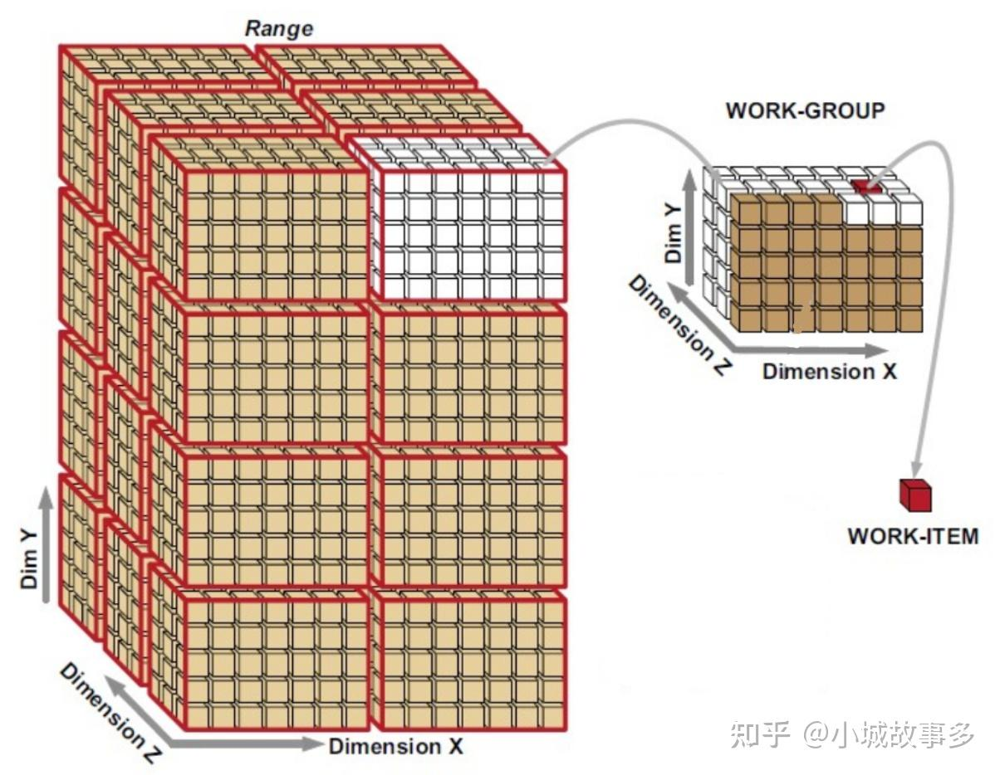

+++
date = '2025-10-29T12:17:56+08:00'
draft = false
title = 'ComputerShader学习'
categories = ["Rendering/Vulkan"]
tags = ["API学习","Vulkan"]
+++

# 概念

> vkCmdDispatch分配的是线程组的总数，Shader中的layout定义一个线程组内部多少个线程

1. `workgroup`定义了计算负载处理构型，是GPU必须处理的工作项。`workgroup`是一个三维模型，每个维度的大小通过`vkCmdDIspatch(commandBuffer, groupSize.x, groupSize.y, groupSize.z)`指定。
2. `invocation`代表`workgroup`中的一个计算单元，每个计算单元运行相同的compute shader。
3. `workgroup`中的`invocations`并行运行，它们的维度由compute shader中`layout(local_size_x=a, local_size_y=b, local_size_y=c)`指定。同一个`workgroup`中的`invocations`可以访问共享内存。



## 案例

``` c++
		vkCmdDispatch(cmdBuffer, storageImage.width / 16, storageImage.height / 16, 1);
```

这就代表了我需要$storageImage.width / 16 *storageImage.width / 16 * 1$个线程组。(本质是计算了图片能分成多少份16*16的区域)

通常这样写，是假设**每个线程组负责处理图像中 16×16 大小的区域**

对应的Shader中写的是

```glsl
layout (local_size_x = 16, local_size_y = 16) in;
```

定义了每个线程组包含 `16×16 = 256` 个线程.这样每个线程刚好处理图像中 `globalPos` 对应的一个像素，整个任务通过线程组和线程的二维分布，实现了对图像的并行遍历。

在Shader中计算当前线程属于哪个像素的坐标

```glsl
    // 1. 计算当前线程对应的全局像素坐标（x, y）
    uvec2 groupID = gl_WorkGroupID.xy;       // 线程组在全局的索引
    uvec2 localID = gl_LocalInvocationID.xy; // 线程在组内的索引
    ivec2 globalPos = ivec2(groupID * 16 + localID); // 转换为整数坐标
```

在Shader中获取某个像素值的方法是

```glsl
gvec4 imageLoad(gimage2D image, ivec2 coord);
```

- 参数 1：要读取的图像（即 `inputImage`）。
- 参数 2：像素的**整数坐标**（`ivec2`，表示 `(x, y)` 位置，原点通常在图像左上角）。
- 返回值：像素的颜色值（`gvec4`，包含 `r, g, b, a` 四个通道，范围通常为 `[0.0, 1.0]` 或 `[0, 255]`，取决于图像格式）。

线程组内部可以使用共享数据，在Shader中用shared修饰的变量，但是需要使用同步函数保证所有线程先写入，才能使用

```glsl
shared vec4 cache[16][16];

// 每个线程写自己的位置
cache[localID.x][localID.y] = someValue;

// 等待同组线程全部写完
barrier(); // GLSL 内置同步函数

// 之后可以安全读取其他线程写的值
vec4 v = cache[otherX][otherY];

```

# 同步

ComputePass并不需要创建RenderPass，也就是说没有定义资源的依赖关系，所以需要手动设置内存屏障保证后续Pass读取到的是新的结果

```c++
// 比如这张图片在compute中处理，后续参与采样，需要一个内存屏障在两个Pass之间
		// Image memory barrier to make sure that compute shader writes are finished before sampling from the texture
  VkImageMemoryBarrier imageMemoryBarrier = {};
  imageMemoryBarrier.sType = VK_STRUCTURE_TYPE_IMAGE_MEMORY_BARRIER;
  // We won't be changing the layout of the image
  imageMemoryBarrier.oldLayout = VK_IMAGE_LAYOUT_GENERAL;
  imageMemoryBarrier.newLayout = VK_IMAGE_LAYOUT_GENERAL;
  imageMemoryBarrier.image = storageImage.image;
  imageMemoryBarrier.subresourceRange = { VK_IMAGE_ASPECT_COLOR_BIT, 0, 1, 0, 1 };
  imageMemoryBarrier.srcAccessMask = VK_ACCESS_SHADER_WRITE_BIT;
  imageMemoryBarrier.dstAccessMask = VK_ACCESS_SHADER_READ_BIT;
  imageMemoryBarrier.srcQueueFamilyIndex = VK_QUEUE_FAMILY_IGNORED;
  imageMemoryBarrier.dstQueueFamilyIndex = VK_QUEUE_FAMILY_IGNORED;
  vkCmdPipelineBarrier(
    cmdBuffer,
    VK_PIPELINE_STAGE_COMPUTE_SHADER_BIT, // compute结束
    VK_PIPELINE_STAGE_FRAGMENT_SHADER_BIT, // 片段着色器开始
    VK_FLAGS_NONE,
    0, nullptr,
    0, nullptr,
    1, &imageMemoryBarrier);
  vkCmdBeginRenderPass(cmdBuffer, &renderPassBeginInfo, VK_SUBPASS_CONTENTS_INLINE);
```

